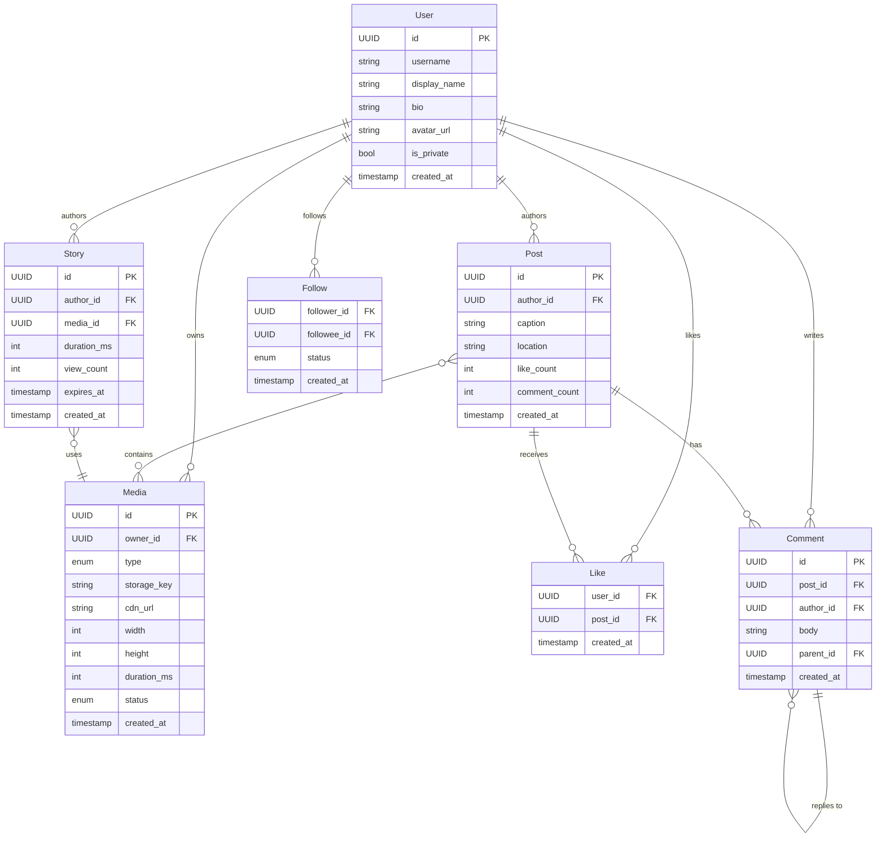
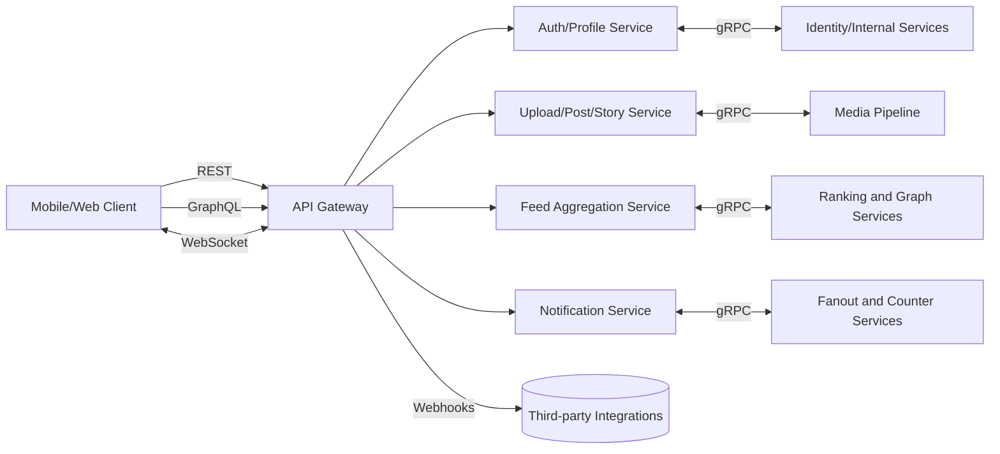
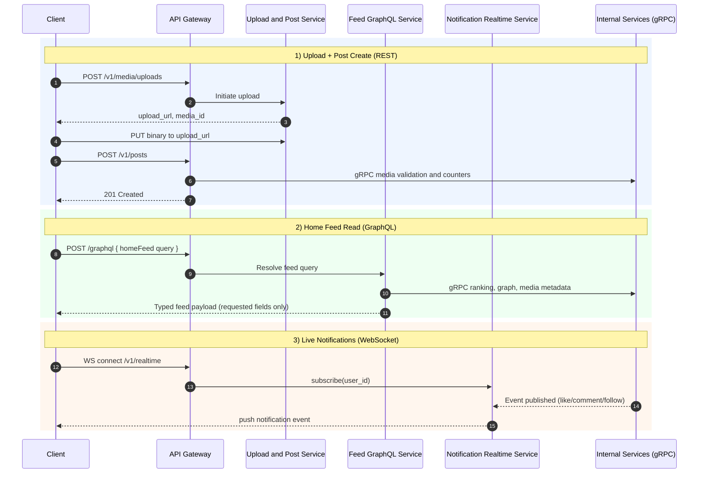
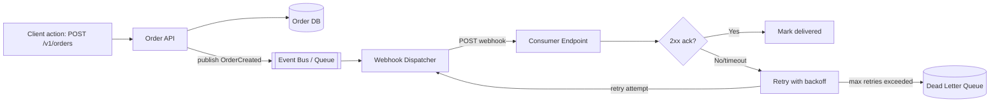
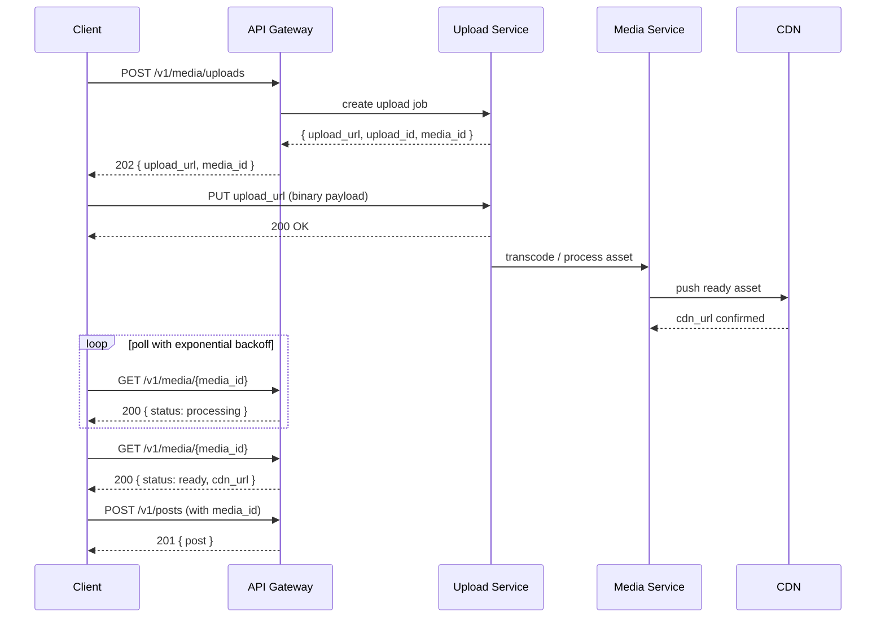
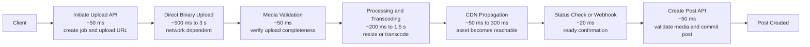
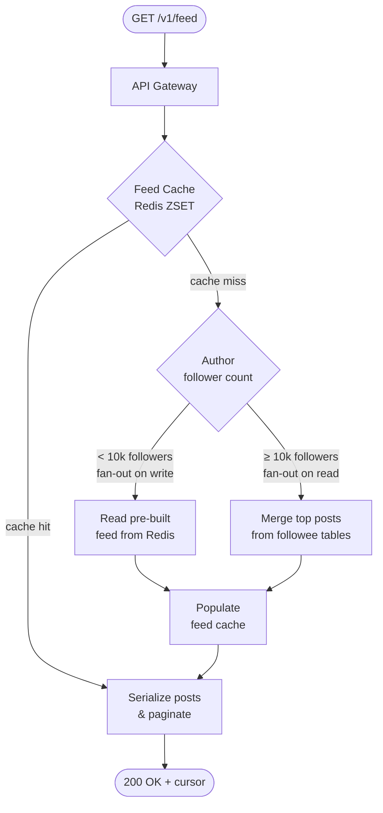
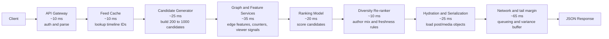
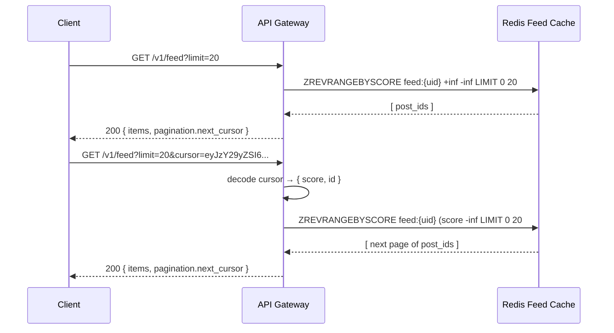
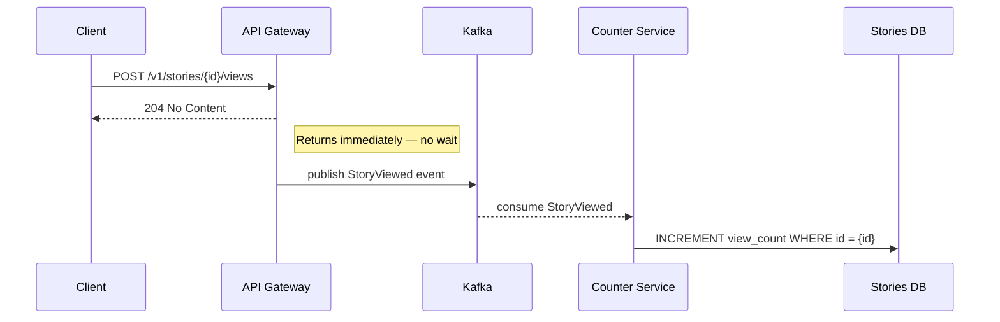

# API Design Walkthrough — Instagram

> Detailed API design for the critical paths of a photo/video social platform. The goal is not to reverse-engineer Instagram's private API but to design a production-quality public API that correctly solves the same problems.

---

## 1. Overview & Scope

### In Scope

| Capability                     | Critical?                           |
| ------------------------------ | ----------------------------------- |
| User registration & auth       | Yes                                 |
| Media upload (photo/video)     | Yes — largest payload, most complex |
| Post creation & deletion       | Yes                                 |
| Home feed retrieval            | Yes — highest read traffic          |
| Stories (create, view, expire) | Yes                                 |
| Follow / Unfollow              | Yes — graph write path              |
| Like & Comment                 | Secondary                           |
| Explore / Search               | Out of scope                        |
| DMs                            | Out of scope                        |
| Reels recommendation           | Out of scope                        |

### Traffic Profile (assumed)

| Metric               | Value        |
| -------------------- | ------------ |
| DAU                  | 500 M        |
| Feed reads / DAU     | ~20          |
| Peak feed RPS        | ~2 M         |
| Post creates / day   | ~100 M       |
| Peak upload RPS      | ~1,200       |
| Latency SLO (feed)   | p99 < 200 ms |
| Latency SLO (upload) | p99 < 5 s    |

---

## 2. Data Model



### 2.1 Story vs Post: API and System Design Impact

The two objects both reference media, but they are optimized for different product behavior.

| Dimension          | Post                                         | Story                                        |
| ------------------ | -------------------------------------------- | -------------------------------------------- |
| Product intent     | Durable, profile/feed content                | Ephemeral, recent-first content              |
| Lifetime           | Persistent until deleted                     | Expires after 24h (`expires_at`)             |
| Media relationship | One or many media assets (carousel-friendly) | Typically one media asset per story row      |
| Primary reads      | Home feed + profile grid + permalinks        | Story tray + sequential story viewer         |
| Engagement         | Likes/comments/saves with long tail          | Views/replies/reactions with short half-life |

#### API design perspective

`Post` and `Story` should not share identical API semantics because clients consume them differently.

| API aspect          | Post design                                              | Story design                                               |
| ------------------- | -------------------------------------------------------- | ---------------------------------------------------------- |
| Create endpoint     | `POST /v1/posts` with `media_ids[]`                      | `POST /v1/stories` with one `media_id`                     |
| Validation          | All media must be `ready`; carousel ordering rules apply | Media must be `ready`; enforce max duration and 24h expiry |
| Read endpoint shape | Rich object for ranking and engagement counts            | Lightweight object for fast tray loading and playback      |
| Pagination          | Cursor pagination for feed/profile history               | Grouped by author and ordered by recency/expiry            |
| Mutability          | Caption edits and delete are common                      | Usually minimal edits; delete/hide is common               |
| Idempotency         | Strongly required for create/delete writes               | Required for create/view events to prevent double counting |

Recommended contract clarity:

- Keep `Post` APIs optimized for durability and retrieval across long time windows.
- Keep `Story` APIs optimized for recency, expiry, and low-latency playback.
- Expose `expires_at` and `has_unseen` fields for story clients to avoid extra calls.
- Use separate rate-limit buckets because story-view writes can be much hotter than post creates.

#### System design perspective

The `Story` lifecycle introduces expiration-heavy behavior that impacts storage, caches, and counters differently from `Post`.

| System aspect    | Post impact                                                                   | Story impact                                                            |
| ---------------- | ----------------------------------------------------------------------------- | ----------------------------------------------------------------------- |
| Storage model    | Durable tables; often normalized via `PostMedia(post_id, media_id, position)` | TTL-aware storage keyed by `expires_at`; fast delete/compaction path    |
| Caching          | Feed and profile caches with longer reuse windows                             | Tray and viewer caches with aggressive invalidation near expiry         |
| Fanout strategy  | Feed fanout and ranking pipelines                                             | Recent-first fanout; strict filtering of expired stories                |
| Counters         | Like/comment counters with eventual consistency acceptable                    | View counters are high-volume and bursty; often async event aggregation |
| CDN usage        | Long-lived media URLs and derivative sizes                                    | Short-lived assets and stricter cache-control near expiration           |
| Background jobs  | Re-ranking, rehydration, backfills                                            | Expiry sweeper, tombstoning, and archive/cleanup workers                |
| Abuse/moderation | Durable moderation queue and appeals                                          | Real-time moderation SLA is tighter due to 24h window                   |

#### What parts of the system this affects

| Subsystem                | Post responsibility                        | Story responsibility                                   |
| ------------------------ | ------------------------------------------ | ------------------------------------------------------ |
| API Gateway              | Route durable CRUD + feed reads            | Route tray/view APIs and realtime-friendly reads       |
| Media service            | Validate multi-media posts and derivatives | Validate single-story media and fast playback variants |
| Feed service             | Rank and paginate posts                    | Merge story tray ordering and unseen status            |
| Realtime service         | Optional for comment/like notifications    | Core for rapid story reactions/view updates            |
| Cache layer (Redis)      | Feed cursors, profile pages, post metadata | Tray shards, unseen bitsets, short TTL keys            |
| Event bus (Kafka/PubSub) | PostCreated, PostLiked, CommentCreated     | StoryCreated, StoryViewed, StoryExpired                |
| Counter service          | Like/comment aggregates                    | View/reaction aggregates at high write rate            |
| Data warehouse/analytics | Long-term content and creator metrics      | 24h engagement funnels and completion rates            |

Design rule:

- Model `Post` for durability and discoverability.
- Model `Story` for ephemerality, recency, and high-frequency interaction.

---

## 3. Authentication

Instagram uses OAuth 2.0 with short-lived access tokens + refresh tokens. For this design:

### Token Exchange

```
POST /v1/auth/token
Content-Type: application/x-www-form-urlencoded

grant_type=password&username=alice&password=<hashed>
```

```json
HTTP/1.1 200 OK
{
  "access_token":  "eyJ...",
  "token_type":    "Bearer",
  "expires_in":    3600,
  "refresh_token": "dGhp..."
}
```

All subsequent requests carry:

```
Authorization: Bearer <access_token>
```

### Scopes

| Scope           | Grants                         |
| --------------- | ------------------------------ |
| `read:feed`     | Read own feed and public posts |
| `write:post`    | Create and delete own posts    |
| `write:story`   | Create stories                 |
| `write:follow`  | Follow/unfollow users          |
| `read:profile`  | Read any public profile        |
| `write:profile` | Edit own profile               |

---

## 4. Versioning Strategy

- URL prefix: `/v1/`, `/v2/` etc.
- A major version bump happens only for **breaking changes** (field removal, semantic change).
- Additive changes (new optional fields, new endpoints) are non-breaking and applied in-place.
- Deprecated fields carry a `Sunset` response header:
  ```
  Sunset: Sat, 01 Jan 2027 00:00:00 GMT
  Deprecation: true
  Link: <https://developers.instagram.example/migration/v2>; rel="successor-version"
  ```
- Old major versions are supported for **12 months** after the next version GA.

### 4.1 API Style Selection (REST vs GraphQL vs WebSocket vs gRPC)

Most large consumer apps are hybrid. Instagram-like systems usually combine multiple API styles based on traffic shape, latency needs, and client flexibility.

| Style     | Best For                                               | Why                                              | Common Tradeoff                                  |
| --------- | ------------------------------------------------------ | ------------------------------------------------ | ------------------------------------------------ |
| REST      | Public APIs, CRUD flows, stable contracts              | Simple, cache-friendly, broad tooling support    | Can over-fetch or require multiple round-trips   |
| GraphQL   | Client-specific read shapes (feed/profile composition) | Client asks for exact fields; fewer over-fetches | Resolver complexity, query cost control required |
| WebSocket | Real-time bidirectional features                       | Low-latency push for live events                 | Connection/state management complexity           |
| gRPC      | Internal service-to-service communication              | Strong contracts + high performance over HTTP/2  | Less browser-friendly for direct public clients  |

#### Where each style fits in popular app patterns

| App Pattern                         | Recommended Mix                            | Why                                                                                                                                                          |
| ----------------------------------- | ------------------------------------------ | ------------------------------------------------------------------------------------------------------------------------------------------------------------ |
| Social feed app (Instagram/X)       | REST + GraphQL + WebSocket + internal gRPC | REST for writes/auth/upload flows, GraphQL for feed shaping, WebSocket for notifications/live interactions, gRPC for internal fanout/ranking/media pipelines |
| Ride-hailing (Uber-like)            | REST + WebSocket + internal gRPC           | REST for booking/payment lifecycle, WebSocket for live trip updates, gRPC for dispatch/ETA internals                                                         |
| Chat/messaging (Slack/Discord-like) | REST + WebSocket + internal gRPC           | REST for channel/account CRUD, WebSocket for message/presence streams, gRPC for internal message services                                                    |
| E-commerce (Shopify/Amazon-like)    | REST + GraphQL + Webhooks + internal gRPC  | REST for admin/order/payment APIs, GraphQL for storefront reads, webhooks for async partner events, gRPC internally                                          |
| Payments/fintech                    | REST + Webhooks + internal gRPC            | REST for broad integrator compatibility, webhooks for async status updates, gRPC for low-latency internal risk/ledger services                               |

#### Instagram-specific recommendation

Use REST as the external canonical API style, then layer in specialized protocols where needed:

- Use REST for auth, media upload lifecycle, post/story create/delete, follow/unfollow, and profile endpoints.
- Use GraphQL for read-heavy, client-composed surfaces like home feed, profile tab mixes, and story tray aggregation.
- Use WebSocket for real-time delivery paths (notifications, live comments/reactions, presence-like signals).
- Use gRPC for internal communication across feed fanout, ranking, media processing, counter aggregation, and relationship graph services.

Decision rule of thumb:

- If you need maximum partner compatibility and clear versioning, start with REST.
- If UI teams frequently need custom field selection across many entities, add GraphQL for read paths.
- If users must see updates within sub-second latency, add WebSocket.
- If internal P99 latency and throughput are bottlenecks, use gRPC between backend services.

#### Hybrid protocol view (Instagram-like)



#### Feature request paths (which protocol for which user action)



### 4.2 Delivery Mechanisms (Webhook, Polling, SSE, WebSocket, Streams)

API style and delivery mechanism are different concerns:

- API style defines interface semantics (REST, GraphQL, gRPC).
- Delivery mechanism defines how updates travel (pull vs push, sync vs async).

#### Delivery mechanism matrix

| Mechanism                               | Model                             | Direction          | Latency Profile                    | Best Real-World Use Cases                                                                          | Avoid When                                                |
| --------------------------------------- | --------------------------------- | ------------------ | ---------------------------------- | -------------------------------------------------------------------------------------------------- | --------------------------------------------------------- |
| Polling                                 | Pull                              | Client -> Server   | Depends on poll interval           | Basic status checks, simple admin dashboards, low-frequency updates                                | High scale or near real-time UX is required               |
| Long polling                            | Pull (held request)               | Client -> Server   | Near real-time with fewer requests | Chat-like updates when WebSocket is blocked by infrastructure                                      | Very high fanout or mobile battery sensitivity matters    |
| Webhook                                 | Push (event callback)             | Server -> Server   | Near real-time async               | Payment status updates (Stripe-like), order/shipping events, CI/CD callbacks, partner integrations | Consumer endpoint reliability/security is weak            |
| SSE                                     | Push stream over HTTP             | Server -> Client   | Real-time one-way                  | Live news tickers, notification feeds, monitoring dashboards, sports scores                        | Client must send frequent real-time messages back         |
| WebSocket                               | Full-duplex persistent connection | Bidirectional      | Sub-second                         | Chat, collaborative editing, multiplayer, live reactions, ride tracking                            | Operational model cannot handle connection state at scale |
| gRPC streaming                          | Persistent stream RPC             | Uni/Bidirectional  | Low latency                        | Internal service streams (telemetry, log/event pipes, ML feature streams)                          | Browser-first public API without gateway support          |
| Message queue/stream (Kafka/SQS/PubSub) | Async event bus                   | Service -> Service | Async eventual                     | Order pipeline, fanout, retries, decoupled microservices, analytics ingestion                      | Caller needs immediate synchronous response               |

#### When webhook is the right choice

Use webhooks when a producer must notify another system after asynchronous work completes.

Typical examples:

- Payments: `payment.succeeded`, `refund.failed`
- Commerce: `order.shipped`, `inventory.low`
- SaaS integrations: `user.invited`, `invoice.paid`
- Internal platform events: build/deploy completed notifications

Webhook design requirements:

- Sign each event payload (HMAC) and verify signature before processing.
- Make consumers idempotent using `event_id` dedupe storage.
- Retry with exponential backoff and dead-letter failed events.
- Tolerate out-of-order delivery and at-least-once semantics.
- Version event schemas explicitly (for example `type` + `version`).

#### Recommended combinations in production

Most systems combine mechanisms instead of choosing one:

- REST/GraphQL + polling: simplest baseline for small products.
- REST/GraphQL + webhooks: best for third-party async integrations.
- REST/GraphQL + WebSocket: best for end-user realtime experiences.
- REST/gRPC + Kafka/PubSub: best for resilient internal event-driven workflows.
- WebSocket + webhook + queue: common in large apps (user realtime + partner callbacks + durable async backend).

#### Quick selection rule

- Need immediate answer to a user action: synchronous REST/GraphQL/gRPC call.
- Need to inform another service later: webhook or event bus.
- Need live UI updates from server only: SSE.
- Need two-way live interaction: WebSocket.
- Need durable decoupled processing across services: queue/stream.

#### Event delivery lifecycle (API -> queue -> webhook -> retry/DLQ)



---

## 5. Critical Path 1 — Media Upload + Post Creation

This is the most complex critical path because it involves:
- Large binary payloads
- Async transcoding (video)
- CDN propagation
- Atomic post creation referencing media that must already be ready

### 5.1 Step-by-step flow



#### Plain-English definitions used below

| Term                       | Plain-English definition                                                                                                                   | Example                                                                                                                                       |
| -------------------------- | ------------------------------------------------------------------------------------------------------------------------------------------ | --------------------------------------------------------------------------------------------------------------------------------------------- |
| `pre-signed URL`           | A temporary upload link generated by the server so the client can upload directly to storage without sending the file through app servers. | The API returns an S3-style URL valid for 15 minutes, and the mobile app uploads the image bytes straight there.                              |
| `idempotency key`          | A request ID sent by the client so retrying the same request does not create duplicates.                                                   | If the app retries `POST /v1/posts` after a timeout with the same key, the server returns the original post instead of creating a second one. |
| `transcoding`              | Converting uploaded media into formats or sizes that are easier to deliver.                                                                | A large video might be converted into multiple resolutions like 1080p and 720p.                                                               |
| `CDN propagation`          | The process of making media available through globally distributed edge servers.                                                           | After processing, the photo is copied to CDN edges so users in Europe and Asia can fetch it quickly.                                          |
| `polling`                  | Repeatedly asking the server whether work is done yet.                                                                                     | The client calls `GET /v1/media/{media_id}` every few seconds until `status=ready`.                                                           |
| `exponential backoff`      | Waiting longer between retries after each failed or incomplete attempt.                                                                    | Poll after 0.5 s, then 1 s, then 2 s, then 4 s instead of hammering the server.                                                               |
| `422 Unprocessable Entity` | The request is structurally valid, but the action cannot be completed because the data is not in the right state.                          | `POST /v1/posts` with a `media_id` that is still processing returns `422`.                                                                    |
| `atomic`                   | All required pieces are committed together or not at all, so partial completion is avoided.                                                | A post should not be created unless all referenced media files are already ready to serve.                                                    |

#### Example latency budget for upload and post creation

Unlike feed retrieval, upload latency is split into two very different parts:

- client-side transfer time, which depends heavily on file size and network quality
- backend processing time, which depends on media type and processing pipeline load

Example target budget for a photo upload:

| Step                   | Target Budget   | What happens here                                         |
| ---------------------- | --------------- | --------------------------------------------------------- |
| Initiate upload API    | 50 ms           | Authenticate user, create upload job, mint pre-signed URL |
| Client binary upload   | 500 ms to 3 s   | Client uploads bytes directly to storage                  |
| Media validation       | 50 ms           | Verify file metadata, ownership, and upload completeness  |
| Processing/transcoding | 200 ms to 1.5 s | Generate resized images or transcode video variants       |
| CDN propagation        | 50 ms to 300 ms | Make asset reachable through edge delivery path           |
| Final status read      | 20 ms           | Client polls or receives webhook that media is ready      |
| Create post API        | 50 ms           | Validate `media_id` state and commit post metadata        |

Total user-perceived time for a photo: often about `1 s to 5 s p99`

Annotated request path:



Reading the diagram:

- Direct upload dominates total time more than API compute, especially on mobile networks.
- Processing cost depends on media type; video is much more expensive than photo.
- Keeping upload transfer off the app servers is the main scaling win of the two-phase design.
- Post creation stays fast because it only commits metadata after media readiness is confirmed.

### 5.2 Initiate Upload

```
POST /v1/media/uploads
Authorization: Bearer <token>
Content-Type: application/json
Idempotency-Key: 550e8400-e29b-41d4-a716-446655440000

{
  "type":      "photo",
  "mime_type": "image/jpeg",
  "size":      4821203,
  "width":     1080,
  "height":    1350
}
```

**Response — 202 Accepted**

```json
{
  "upload_id":  "upl_3kT9mZ",
  "upload_url": "https://upload.instagram.example/v1/blobs/upl_3kT9mZ",
  "expires_at": "2026-05-15T15:30:00Z",
  "media_id":   "med_7rW2xQ"
}
```

| Field        | Notes                                                                    |
| ------------ | ------------------------------------------------------------------------ |
| `upload_url` | Pre-signed URL, single-use, valid for 15 min                             |
| `media_id`   | Already provisioned; POST /v1/posts can reference it once `status=ready` |

### 5.3 Upload Binary Payload

```
PUT https://upload.instagram.example/v1/blobs/upl_3kT9mZ
Content-Type: image/jpeg
Content-Length: 4821203

<binary bytes>
```

**Response — 200 OK** (no body; idempotent — re-PUT the same upload_id is safe)

### 5.4 Poll Media Status

```
GET /v1/media/med_7rW2xQ
Authorization: Bearer <token>
```

**Response — 200 OK (processing)**

```json
{
  "id":         "med_7rW2xQ",
  "type":       "photo",
  "status":     "processing",
  "created_at": "2026-05-15T15:00:00Z"
}
```

**Response — 200 OK (ready)**

```json
{
  "id":         "med_7rW2xQ",
  "type":       "photo",
  "status":     "ready",
  "cdn_url":    "https://cdn.instagram.example/p/med_7rW2xQ_1080x1350.jpg",
  "width":      1080,
  "height":     1350,
  "created_at": "2026-05-15T15:00:00Z"
}
```

> Recommendation: clients should poll with exponential backoff starting at 500 ms.  
> Alternative: subscribe to a webhook (see §9).

### 5.5 Create Post

Only call this after all referenced `media_id`s have `status=ready`.

```
POST /v1/posts
Authorization: Bearer <token>
Content-Type: application/json
Idempotency-Key: 7c9e6679-7425-40de-944b-e07fc1f90ae7

{
  "media_ids": ["med_7rW2xQ"],
  "caption":   "Golden hour in the city. 🌆",
  "location":  "Brooklyn Bridge, New York"
}
```

**Response — 201 Created**

```json
{
  "id":            "pst_9aB1cD",
  "author": {
    "id":          "usr_4xK8mN",
    "username":    "alice",
    "avatar_url":  "https://cdn.instagram.example/avatars/usr_4xK8mN.jpg"
  },
  "media": [
    {
      "id":        "med_7rW2xQ",
      "cdn_url":   "https://cdn.instagram.example/p/med_7rW2xQ_1080x1350.jpg",
      "width":     1080,
      "height":    1350
    }
  ],
  "caption":       "Golden hour in the city. 🌆",
  "location":      "Brooklyn Bridge, New York",
  "like_count":    0,
  "comment_count": 0,
  "created_at":    "2026-05-15T15:05:00Z"
}
```

### 5.6 Edge Cases & Failure Modes

| Scenario                                   | Behavior                                                        |
| ------------------------------------------ | --------------------------------------------------------------- |
| `media_id` still `processing` at POST time | `422 Unprocessable Entity` with `{ "code": "media_not_ready" }` |
| `media_id` belongs to another user         | `403 Forbidden`                                                 |
| `media_id` in `failed` status              | `422` with `{ "code": "media_processing_failed" }`              |
| Upload URL expired                         | `410 Gone` on PUT; client must call initiate upload again       |
| Duplicate `Idempotency-Key` within 24h     | Returns the original 201 response, no duplicate post            |
| Caption exceeds 2200 chars                 | `400 Bad Request` with field-level detail                       |

---

## 6. Critical Path 2 — Home Feed Retrieval

The feed is the highest-traffic read path. At 500 M DAU × 20 reads = 10 B feed reads/day ≈ **115,000 RPS average**, spiking to ~2 M RPS.

### 6.1 Feed Architecture (context for the API contract)

The feed is **pre-computed** (fan-out on write for users with < 10k followers; fan-out on read for celebrities). The API layer reads from a feed cache (Redis sorted set keyed by user + score = timestamp), not from the post store directly.



#### Plain-English definitions used below

| Term                   | Plain-English definition                                                                                                            | Example                                                                                                                            |
| ---------------------- | ----------------------------------------------------------------------------------------------------------------------------------- | ---------------------------------------------------------------------------------------------------------------------------------- |
| `p99 latency`          | The response time under which 99% of requests finish. Only the slowest 1% are worse.                                                | If feed `p99` is 200 ms, then 99 out of 100 feed requests finish in 200 ms or less.                                                |
| `adjacency list`       | A stored list of direct relationships for one node in a graph. Here, it usually means “who a user follows” or “who follows a user.” | Alice's follow adjacency list might be `[bob, carol, dave]`.                                                                       |
| `candidate generation` | The stage that picks a manageable shortlist of posts worth scoring.                                                                 | From 1,200 followees, the system may narrow to 550 candidate posts before ranking.                                                 |
| `strong ties`          | Authors the viewer interacts with a lot, so their content is more likely to matter.                                                 | Alice likes Bob often, so Bob becomes a strong tie.                                                                                |
| `exploration`          | Content shown outside the user's direct follow graph to help discovery.                                                             | Alice follows no travel creators, but the system may still show one popular travel post.                                           |
| `heuristic`            | A simple rule-of-thumb formula used before or instead of a learned model.                                                           | “Prefer recent posts with high engagement and strong affinity” is a heuristic.                                                     |
| `feature store`        | A system that serves prepared ranking inputs quickly to online services.                                                            | The ranking service may fetch Alice's topic interests and Bob's recent engagement rate from a feature store.                       |
| `affinity`             | A score for how strong the relationship is between viewer and author.                                                               | If Alice often watches Bob's stories and likes his posts, `affinity(alice, bob)` is high.                                          |
| `fatigue`              | A penalty for showing too much content from the same author too often.                                                              | If Alice already saw two Bob posts recently, Bob's next post gets a fatigue penalty.                                               |
| `freshness`            | How recent a post is, usually normalized so newer content scores higher.                                                            | A post from 8 minutes ago has higher freshness than one from 2 days ago.                                                           |
| `engagement velocity`  | How quickly likes, comments, saves, or shares are arriving right now.                                                               | 500 likes in 10 minutes is higher engagement velocity than 500 likes over 2 days.                                                  |
| `re-rank`              | A second pass that adjusts the initial ranked list using layout or policy rules.                                                    | Even if Bob has the top 2 posts by score, reranking may move Carol into slot 2 for diversity.                                      |
| `nearline`             | Processing that is not fully real-time but updates frequently, often every few seconds or minutes.                                  | Like counts may be refreshed every 30 seconds and used by ranking as nearline signals.                                             |
| `fanout-on-write`      | Push a new post into many followers' feed caches when the post is created.                                                          | When Bob posts, the system inserts Bob's post ID into Alice's feed cache immediately.                                              |
| `fanout-on-read`       | Do not push on write; instead merge an author's posts into the feed when the viewer requests it.                                    | For a celebrity with 50 million followers, the system merges recent posts at read time instead of writing to all 50 million feeds. |
| `write amplification`  | One logical write causes many physical writes in storage or cache.                                                                  | One celebrity post might trigger millions of feed-cache writes if handled naively.                                                 |
| `eventual consistency` | Data may be briefly stale, but it becomes correct after propagation finishes.                                                       | Alice likes a post, but `like_count` may update 2 seconds later instead of instantly.                                              |
| `idempotent`           | Repeating the same operation produces the same final result instead of duplicating it.                                              | Retrying “like post 123” should still leave exactly one like from Alice.                                                           |

### 6.1.1 Ranking and Graph Services

The feed service should not rank directly from raw tables on every request. Instead, it calls two internal capabilities:

- `Graph Service`: answers relationship questions quickly.
- `Ranking Service`: scores candidate posts for a specific viewer.

#### Graph Service design

The graph service owns follow edges and relationship-derived features.

Core responsibilities:

- Return the viewer's followee set.
- Return relationship metadata such as `is_close_friend`, `is_muted`, `is_blocked`, `is_private_pending`.
- Provide lightweight graph features for ranking, such as interaction frequency and edge strength.

Typical storage layout:

- Write-optimized source of truth in a sharded relational or wide-column store.
- Read-optimized adjacency lists in Redis or memory for hot users.
- Periodic compaction jobs to rebuild hot followee lists and relationship summaries.

Representative APIs:

```text
GetFollowees(user_id) -> [author_id]
GetEdgeFeatures(viewer_id, author_ids[]) -> {
  author_id: {
    follows,
    close_friend,
    muted,
    interaction_count_7d,
    last_interaction_at
  }
}
```

Concrete graph-feature example:

Assume viewer `alice` follows `bob`, `carol`, and `dave`. Over the last 7 days:

- Alice liked 6 of Bob's posts and watched 80% of his stories.
- Alice followed Carol recently but rarely interacts with her content.
- Alice follows Dave, but muted him after seeing too many posts.

The graph service can convert this raw relationship history into feed-ready edge features:

| Author | follows | close_friend | muted | interaction_count_7d | last_interaction_at | Derived intuition                                              |
| ------ | ------- | ------------ | ----- | -------------------- | ------------------- | -------------------------------------------------------------- |
| Bob    | true    | false        | false | 18                   | 2h ago              | Strong positive affinity                                       |
| Carol  | true    | false        | false | 2                    | 5d ago              | Weak but valid follow edge                                     |
| Dave   | true    | false        | true  | 9                    | 1d ago              | Relationship exists, but muted should filter or heavily demote |

The ranking service may then derive normalized features such as:

- `affinity(alice, bob) = 0.90`
- `affinity(alice, carol) = 0.35`
- `affinity(alice, dave) = 0.05` or filter Dave entirely because `muted=true`
- `fatigue(alice, bob)` increases if Bob already has multiple recent feed impressions

This is the main value of the graph service: it converts raw edges and interaction history into cheap, reusable ranking signals.

Why separate it:

- Follow graph cardinality and mutation patterns differ from feed reads.
- Relationship lookups are reused by feed, stories, notifications, privacy checks, and messaging.
- It allows aggressive caching of adjacency lists without mixing ranking logic into the graph store.

#### Ranking Service design

The ranking service takes a candidate set of posts and computes a score per `(viewer, post)` pair.

High-level pipeline:

1. Candidate generation
2. Feature fetch
3. Filtering
4. Scoring
5. Diversity and freshness re-rank

##### 1. Candidate generation

Do not score the entire social graph. First generate a small candidate pool, for example the newest 200 to 1,000 posts from followees plus a small exploration set.

Candidate sources:

- Recent posts from direct followees
- High-engagement posts from strong ties
- Optional exploration/recommended posts if product requires it
- Backfill items if the pool is too small

Candidate-generation walkthrough:

Assume `alice` follows 1,200 accounts. At request time, the system should not fetch every recent post from all 1,200 authors and score them all. Instead, it narrows candidates in stages:

1. Build source buckets

- `strong_ties`: authors with high recent interaction, for example top 50 by affinity
- `normal_followees`: the rest of the follow graph
- `exploration_pool`: optional recommended authors/posts outside the direct graph

2. Pull recent items from each bucket

Example retrieval budget:

- Fetch up to 5 recent posts from each strong-tie author
- Fetch up to 1 to 2 recent posts from each normal followee
- Fetch up to 50 exploration candidates from recommendation services

This may still produce too many raw items, so the next step prunes aggressively.

3. Apply cheap pre-ranking before full scoring

Use inexpensive filters and heuristics first:

- Drop authors the viewer muted or blocked
- Drop posts older than a freshness window, for example 72 hours
- Drop posts the viewer already consumed deeply
- Keep only the top few posts per author to avoid author spam
- Use simple priors like recency plus lightweight engagement velocity to trim the pool

4. Cap the final candidate set

After cheap pruning, reduce to a scoreable pool such as:

- 400 followee posts
- 100 strong-tie boosted posts
- 50 exploration posts

Final candidate pool: about 550 posts

That is small enough for feature joins and ranking within the online latency budget.

Example pseudo-flow:

```text
followees = GraphService.GetFollowees(viewer_id)
strong_ties = TopAffinityAuthors(viewer_id, limit=50)
normal_followees = followees - strong_ties

raw = []
raw += PostStore.GetRecentPosts(strong_ties, per_author=5, window=72h)
raw += PostStore.GetRecentPosts(normal_followees, per_author=2, window=72h)
raw += RecoService.GetExplorationCandidates(viewer_id, limit=50)

pruned = CheapFilter(raw)
pruned = LimitPerAuthor(pruned, max_per_author=3)
candidates = TopByHeuristic(pruned, limit=550)
```

Why this matters:

- Candidate generation is where most scale is saved.
- A weak candidate generation stage hurts ranking quality because the best posts never reach the scorer.
- A too-large candidate pool hurts p99 latency and increases feature-store load.

##### 2. Feature fetch

Features usually come from multiple systems:

- Graph features: follow strength, interaction frequency, close-friend flag
- Content features: media type, age, caption language, predicted quality
- Engagement features: like velocity, comment velocity, save rate
- Viewer features: past watch time, hide/report actions, topic affinity
- Context features: network quality, device type, current time, session depth

##### 3. Filtering

Filter before scoring when possible:

- Remove blocked/muted/private-inaccessible authors
- Remove already seen or recently dismissed posts
- Remove expired or moderation-blocked content
- Enforce policy constraints and quota limits for exploration content

##### 4. Scoring

In production this is usually a learned ranking model, but conceptually it can be documented as a weighted score:

$$
score(viewer, post) =
w_1 \cdot affinity(viewer, author)
+ w_2 \cdot engagement(post)
+ w_3 \cdot freshness(post)
+ w_4 \cdot media\_quality(post)
- w_5 \cdot fatigue(viewer, author)
- w_6 \cdot negative\_feedback(viewer, author, post)
$$

In practice, teams often evolve through these stages:

- Stage 1: heuristic weighted sum
- Stage 2: gradient-boosted trees on logged features
- Stage 3: multi-stage ranking with lightweight online scorer + heavier offline-trained model

Example pseudo-flow:

```text
candidates = CandidateGenerator(viewer_id)
edges = GraphService.GetEdgeFeatures(viewer_id, candidates.author_ids)
features = FeatureStore.BatchGet(viewer_id, candidates, edges)
filtered = PolicyFilter(features)
scored = RankModel.Score(filtered)
ranked = DiversityReranker(scored)
return TopK(ranked, 20)
```

Worked example for one candidate post:

Assume viewer `alice` follows author `bob` and the ranking pipeline computes these normalized features for Bob's new photo post:

| Feature                                   | Value | Why it is high/low                                          |
| ----------------------------------------- | ----- | ----------------------------------------------------------- |
| `affinity(viewer, author)`                | 0.90  | Alice frequently likes Bob's posts and watches his stories  |
| `engagement(post)`                        | 0.70  | The post is getting likes/comments quickly for its age      |
| `freshness(post)`                         | 0.95  | The post is only 8 minutes old                              |
| `media_quality(post)`                     | 0.80  | High-resolution image and historically good completion rate |
| `fatigue(viewer, author)`                 | 0.30  | Alice already saw one Bob post recently                     |
| `negative_feedback(viewer, author, post)` | 0.05  | Alice rarely hides Bob's content                            |

If the heuristic stage uses weights:

$$
w_1=0.35,\; w_2=0.20,\; w_3=0.20,\; w_4=0.10,\; w_5=0.10,\; w_6=0.05
$$

Then:

$$
score =
0.35(0.90)
+ 0.20(0.70)
+ 0.20(0.95)
+ 0.10(0.80)
- 0.10(0.30)
- 0.05(0.05)
= 0.6925
$$

Interpretation:

- `0.6925` is not meaningful by itself; it is only useful relative to the scores of other candidate posts.
- A post from a weaker relationship might have lower affinity but still outrank this one if it has much stronger engagement velocity.
- The diversity re-ranker may still move this post down one slot if Bob already appears immediately above it.

Worked comparison across multiple candidate posts:

Suppose Alice's candidate pool currently contains three posts:

| Post | Author | Affinity | Engagement | Freshness | Media Quality | Fatigue | Negative Feedback |
| ---- | ------ | -------- | ---------- | --------- | ------------- | ------- | ----------------- |
| P1   | Bob    | 0.90     | 0.70       | 0.95      | 0.80          | 0.30    | 0.05              |
| P2   | Carol  | 0.35     | 0.92       | 0.85      | 0.75          | 0.05    | 0.02              |
| P3   | Erin   | 0.20     | 0.98       | 0.60      | 0.90          | 0.00    | 0.01              |

Using the same heuristic weights as above:

$$
score(P1) = 0.6925
$$

$$
score(P2) =
0.35(0.35)
+ 0.20(0.92)
+ 0.20(0.85)
+ 0.10(0.75)
- 0.10(0.05)
- 0.05(0.02)
= 0.5485
$$

$$
score(P3) =
0.35(0.20)
+ 0.20(0.98)
+ 0.20(0.60)
+ 0.10(0.90)
- 0.10(0.00)
- 0.05(0.01)
= 0.4755
$$

Result before reranking:

1. `P1` from Bob
2. `P2` from Carol
3. `P3` from Erin

Why Bob still wins:

- Bob's post has the strongest relationship signal by far.
- Carol's post is more viral, but weaker affinity keeps it below Bob.
- Erin's post has excellent engagement but is likely exploration content or a weak tie, so it starts lower.

How reranking can still change the final order:

- If Bob already has the previous slot in the feed, the diversity re-ranker might swap `P2` above `P1`.
- If the product wants more exploration, `P3` may be boosted by a separate exploration quota.
- If Alice just watched several Bob stories, `fatigue` may increase enough for `P2` to overtake `P1` on the next refresh.

##### 5. Diversity and freshness re-rank

The highest raw score is not always the best final feed. Re-rankers usually enforce:

- No more than `N` consecutive posts from the same author
- Media-type mixing (photo vs video)
- Freshness floors so older high-engagement posts do not dominate forever
- Optional insertion constraints for sponsored or exploration content

#### Online vs offline split

Keep the expensive learning pipeline offline and the request path lightweight.

- Offline: train models, compute author/viewer embeddings, precompute quality priors
- Nearline: update rolling counters and affinity features every few minutes
- Online: fetch candidates, run small feature joins, score top few hundred items, return top 20

This split keeps p99 latency within the feed SLO while still using rich signals.

### 6.1.2 Fanout and Counter Services

The fanout and counter services turn writes into fast reads.

#### Fanout Service design

The fanout service decides how a new post propagates into followers' feed state.

Two-path strategy:

- `Fanout-on-write` for normal accounts with manageable follower counts
- `Fanout-on-read` for celebrity accounts where pushing to every follower would be too expensive

Decision rule example:

- If follower count < 10k: write post ID into each follower's Redis feed timeline
- If follower count >= 10k: do not push to all followers; merge this author's recent posts at read time

Write-time algorithm for normal accounts:

```text
on PostCreated(post_id, author_id, created_at):
  followers = GraphService.GetFollowers(author_id)
  for follower_id in followers:
    Redis.ZADD(feed:{follower_id}, score=created_at, member=post_id)
    Redis.ZREMRANGEBYRANK(feed:{follower_id}, 0, -max_feed_size-1)
```

Implementation details:

- Execute fanout asynchronously from an event bus, not inline with the post create request.
- Partition workers by `author_id` so ordering is stable per author.
- Batch follower writes and pipeline Redis commands.
- Keep only the newest `N` post IDs per user in cache; older items can be reconstructed from storage if needed.

Read-time merge for celebrity accounts:

```text
on GetFeed(viewer_id):
  base = Redis.ZREVRANGE(feed:{viewer_id}, 0, K)
  celebrities = GraphService.GetHighFollowerFollowees(viewer_id)
  recent = PostStore.GetRecentPosts(celebrities, window=48h)
  merged = MergeByRank(base, recent)
  return merged
```

This hybrid avoids the classic write amplification problem.

#### Counter Service design

The counter service owns high-write aggregates such as:

- `like_count`
- `comment_count`
- `story_view_count`
- optional per-post reaction counts

Do not update the primary post row synchronously on every like or view at large scale. Instead:

1. Accept the write
2. Emit an event
3. Aggregate asynchronously
4. Periodically flush durable totals

Typical pipeline:

```text
LikeCreated -> Kafka -> CounterAggregator -> Redis/In-memory shard -> periodic DB flush
StoryViewed -> Kafka -> CounterAggregator -> Redis/In-memory shard -> periodic DB flush
```

Why this design:

- Prevents write hotspots on a single popular post row
- Allows very high write throughput for viral content
- Lets the feed read path fetch hot counters from cache instead of durable storage

Counter algorithm details:

- Deduplicate by `(user_id, object_id, action_type)` when the action must be unique, such as likes.
- For non-unique events like story views, choose product semantics explicitly: unique viewers vs total views.
- Use sharded counters for hot keys so one viral post does not overload a single partition.
- Flush deltas in batches, for example every few seconds or every `N` events.

Example sharded counter strategy:

```text
counter_key = hash(post_id) % 128
INCR post_like_count:{post_id}:{counter_key}
read_total = SUM(shards 0..127)
```

#### Consistency model

Feed systems usually accept eventual consistency for counters and partial fanout delays.

- A new post may appear for some followers a few seconds later.
- `like_count` may lag the true value briefly.
- Ranking can use nearline counters instead of exact real-time totals.

That tradeoff is usually correct because feed latency and write throughput matter more than perfect instant consistency.

#### Failure handling

Design these services to degrade gracefully:

- If fanout workers lag, fall back to fanout-on-read for affected authors.
- If counters are delayed, serve cached or slightly stale counts.
- If Redis evicts old feed entries, rebuild from post storage plus follow graph.
- Use idempotent event processing so retries do not duplicate fanout inserts or counter increments.

### 6.1.3 Example latency budget for one feed request

To keep feed `p99 < 200 ms`, the online path needs an explicit latency budget.

| Step                               | Target Budget | What happens here                                                                          |
| ---------------------------------- | ------------- | ------------------------------------------------------------------------------------------ |
| API Gateway auth + request parsing | 10 ms         | Validate token, parse cursor, route request                                                |
| Feed cache lookup                  | 10 ms         | Check whether a pre-built timeline is available in Redis                                   |
| Candidate generation               | 25 ms         | Pull candidate post IDs from feed cache, followee buckets, and optional exploration source |
| Graph + feature fetch              | 35 ms         | Fetch edge features, counters, and viewer/post features                                    |
| Ranking model score                | 20 ms         | Score the candidate set                                                                    |
| Diversity re-rank                  | 10 ms         | Apply author diversity and freshness constraints                                           |
| Hydration + serialization          | 25 ms         | Load final post/media objects and build JSON response                                      |
| Network + safety margin            | 65 ms         | Tail latency buffer for queueing, retries, and unavoidable variance                        |

Total target: about `200 ms p99`

Worked example:

- If candidate generation jumps from 25 ms to 80 ms because the candidate pool is too large, the whole request can miss the SLO even if ranking itself is fast.
- If feature fetch becomes slow, teams often reduce candidate count first because that lowers both feature-store load and ranking cost.
- This is why candidate generation quality and bounded pool size matter as much as the ranking model.

Annotated request path:



Reading the diagram:

- The request path is sequential, so overruns in one stage eat into every later stage.
- Candidate generation and feature fetch are usually the most sensitive stages because they affect both latency and downstream work.
- The `65 ms` tail margin is intentional; without buffer, real-world jitter pushes p99 above target even when average latency looks fine.

### 6.2 Endpoint

```
GET /v1/feed
Authorization: Bearer <token>
```

**Query Parameters**

| Param    | Type   | Default | Description                                     |
| -------- | ------ | ------- | ----------------------------------------------- |
| `limit`  | int    | 20      | Items per page (max 50)                         |
| `cursor` | string | —       | Opaque pagination cursor from previous response |

### 6.3 Example Request

```
GET /v1/feed?limit=20 HTTP/1.1
Authorization: Bearer eyJ...
```

### 6.4 Example Response — 200 OK

```json
{
  "items": [
    {
      "id":         "pst_9aB1cD",
      "author": {
        "id":       "usr_4xK8mN",
        "username": "alice",
        "avatar_url": "https://cdn.instagram.example/avatars/usr_4xK8mN.jpg",
        "is_verified": false
      },
      "media": [
        {
          "id":      "med_7rW2xQ",
          "type":    "photo",
          "cdn_url": "https://cdn.instagram.example/p/med_7rW2xQ_1080x1350.jpg",
          "width":   1080,
          "height":  1350
        }
      ],
      "caption":       "Golden hour in the city. 🌆",
      "like_count":    1423,
      "comment_count": 38,
      "liked_by_me":   false,
      "created_at":    "2026-05-15T15:05:00Z"
    }
    // ... 19 more items
  ],
  "pagination": {
    "next_cursor":  "eyJzY29yZSI6MTcxNTc4OTkwMCwiaWQiOiJwc3RfMWFCMmNEIn0=",
    "has_more":     true
  }
}
```

### 6.5 Cursor Design

The cursor is a **base64-encoded JSON blob** containing the last item's sort key:

```json
{ "score": 1715789900, "id": "pst_1aB2cD" }
```

Clients treat it as opaque. The server decodes it and issues a range query against the Redis sorted set:

```
ZREVRANGEBYSCORE feed:{user_id}  (score LIMIT 0 limit
```

Cursor flow:



Benefits over offset:
- Stable under concurrent inserts (no items skipped or doubled)
- O(log N) rather than O(offset + limit) at the DB layer
- Can be cached at edge (cursor-keyed cache entries)

### 6.6 Response Headers

```
Cache-Control: private, max-age=0           # feed is personalized
X-Request-Id: req_f3a7c891
X-RateLimit-Limit: 200
X-RateLimit-Remaining: 197
X-RateLimit-Reset: 1715790060
```

### 6.7 Edge Cases & Failure Modes

| Scenario                                  | Behavior                                                              |
| ----------------------------------------- | --------------------------------------------------------------------- |
| Cursor from a different user's session    | `400 Bad Request` `{ "code": "invalid_cursor" }`                      |
| Cursor older than 24h (feed refreshed)    | Return fresh feed from top, `pagination.cursor_expired: true`         |
| Feed cache miss (cold start / new user)   | Synchronous fan-in from followee post tables, slightly higher latency |
| Followee with 0 posts                     | Their posts simply absent from items                                  |
| Private account the caller doesn't follow | Posts excluded server-side                                            |

---

## 7. Critical Path 3 — Stories (Create & View)

Stories expire after 24 hours, have an ordered viewer list, and auto-advance in the client.

### 7.1 Create a Story

```
POST /v1/stories
Authorization: Bearer <token>
Content-Type: application/json
Idempotency-Key: <uuid>

{
  "media_id":    "med_2bC3dE",
  "duration_ms": 5000
}
```

**Response — 201 Created**

```json
{
  "id":          "str_5eF6gH",
  "author_id":   "usr_4xK8mN",
  "media": {
    "id":        "med_2bC3dE",
    "cdn_url":   "https://cdn.instagram.example/stories/med_2bC3dE.jpg",
    "type":      "photo"
  },
  "duration_ms": 5000,
  "view_count":  0,
  "expires_at":  "2026-05-16T15:10:00Z",
  "created_at":  "2026-05-15T15:10:00Z"
}
```

### 7.2 List Stories for Feed (Story Tray)

```
GET /v1/stories/tray
Authorization: Bearer <token>
```

**Response — 200 OK**

```json
{
  "authors": [
    {
      "user": {
        "id":         "usr_1xY9zA",
        "username":   "bob",
        "avatar_url": "https://cdn.instagram.example/avatars/usr_1xY9zA.jpg"
      },
      "has_unseen": true,
      "stories": [
        {
          "id":         "str_7iJ8kL",
          "cdn_url":    "https://cdn.instagram.example/stories/med_8hI9jK.jpg",
          "expires_at": "2026-05-16T12:00:00Z"
        }
      ]
    }
  ]
}
```

### 7.3 Record a Story View

```
POST /v1/stories/str_5eF6gH/views
Authorization: Bearer <token>
```

**Response — 204 No Content**

This is a **fire-and-forget write** on the client side. The server increments `view_count` asynchronously via a Kafka event → counter service.



---

## 8. Critical Path 4 — Follow / Unfollow

### 8.1 Follow a User

```
POST /v1/users/usr_1xY9zA/follow
Authorization: Bearer <token>
Idempotency-Key: <uuid>
```

**Response — 200 OK (public account — accepted immediately)**

```json
{
  "followee_id": "usr_1xY9zA",
  "status":      "accepted",
  "created_at":  "2026-05-15T15:20:00Z"
}
```

**Response — 200 OK (private account — pending approval)**

```json
{
  "followee_id": "usr_1xY9zA",
  "status":      "pending",
  "created_at":  "2026-05-15T15:20:00Z"
}
```

### 8.2 Unfollow / Cancel Request

```
DELETE /v1/users/usr_1xY9zA/follow
Authorization: Bearer <token>
```

**Response — 204 No Content**

Idempotent: `DELETE` on a non-existent follow also returns `204`.

### 8.3 Approve / Reject a Follow Request (private accounts)

```
PATCH /v1/follow-requests/usr_3cD4eF
Authorization: Bearer <token>
Content-Type: application/json

{
  "action": "approve"
}
```

`action` ∈ `{ "approve", "reject" }`.

**Response — 200 OK**

```json
{
  "follower_id": "usr_3cD4eF",
  "status":      "accepted"
}
```

---

## 9. Common API Concerns

### 9.1 Pagination

All collection endpoints use **cursor-based pagination**:

```json
"pagination": {
  "next_cursor": "<opaque>",
  "has_more":    true
}
```

- No `total_count` (too expensive on live data)
- `limit` capped at 50; requests above cap silently clamp, not error

### 9.2 Error Format (RFC 9457 Problem Details)

```json
{
  "type":     "https://developers.instagram.example/errors/media_not_ready",
  "title":    "Media Not Ready",
  "status":   422,
  "detail":   "Media med_7rW2xQ is still processing. Poll GET /v1/media/med_7rW2xQ.",
  "instance": "/v1/posts",
  "request_id": "req_f3a7c891"
}
```

**Standard status codes used**

| Code  | When                                                   |
| ----- | ------------------------------------------------------ |
| `200` | Successful read or update                              |
| `201` | Resource created                                       |
| `202` | Async job accepted                                     |
| `204` | Successful delete or fire-and-forget write             |
| `400` | Malformed request or validation failure                |
| `401` | Missing or invalid token                               |
| `403` | Valid token, insufficient permission                   |
| `404` | Resource not found (or intentionally hidden)           |
| `409` | Conflict (duplicate, already followed)                 |
| `410` | Gone (upload URL expired)                              |
| `422` | Semantically invalid (media not ready)                 |
| `429` | Rate limit exceeded                                    |
| `500` | Unexpected server error                                |
| `503` | Temporary overload — retry after `Retry-After` seconds |

### 9.3 Rate Limiting

| Token class | Endpoint group            | Limit        |
| ----------- | ------------------------- | ------------ |
| User token  | `GET /v1/feed`            | 200 req/min  |
| User token  | `POST /v1/posts`          | 10 req/hour  |
| User token  | `POST /v1/media/uploads`  | 20 req/hour  |
| User token  | `POST /v1/users/*/follow` | 100 req/hour |
| User token  | All other reads           | 500 req/min  |

When exceeded:

```
HTTP/1.1 429 Too Many Requests
Retry-After: 42
X-RateLimit-Limit: 200
X-RateLimit-Remaining: 0
X-RateLimit-Reset: 1715790060
```

### 9.4 Idempotency

`POST` endpoints that create resources or trigger side-effects require `Idempotency-Key: <uuid-v4>`.

- Keys are stored for **24 hours**.
- A duplicate key within the window returns the **original response** (same status code, same body) without re-executing.
- A key reused with a **different request body** returns `422 Unprocessable Entity`.

### 9.5 Webhooks (Alternative to Polling Media Status)

```
POST /v1/webhooks
Authorization: Bearer <token>
Content-Type: application/json

{
  "url":    "https://app.example/hooks/instagram",
  "events": ["media.ready", "media.failed"],
  "secret": "whsec_abc123"
}
```

Payload delivered to `url`:

```json
{
  "event":      "media.ready",
  "media_id":   "med_7rW2xQ",
  "cdn_url":    "https://cdn.instagram.example/p/med_7rW2xQ_1080x1350.jpg",
  "occurred_at":"2026-05-15T15:01:30Z"
}
```

Signature: `X-Instagram-Signature: sha256=<HMAC-SHA256(secret, raw_body)>`

---

## 10. Design Decisions & Trade-offs

| Decision                                            | Rationale                                                                                         | Trade-off                                                           |
| --------------------------------------------------- | ------------------------------------------------------------------------------------------------- | ------------------------------------------------------------------- |
| Two-phase upload (initiate → PUT → create post)     | Decouples auth from binary transfer; upload URL can be routed to edge without hitting app servers | More round-trips for the client                                     |
| Pre-signed upload URLs                              | No auth headers on the binary PUT; simpler CDN routing                                            | URL can be intercepted (mitigated by 15-min expiry + single-use)    |
| Denormalized `like_count` / `comment_count` on Post | Avoids expensive COUNT queries on every feed read                                                 | Eventual consistency — counts may lag by seconds                    |
| Cursor pagination for feed                          | Stable under live inserts; O(log N)                                                               | Client cannot jump to arbitrary page                                |
| Fan-out on write (small accounts)                   | Feed reads are O(1) cache hit                                                                     | Write amplification for users with many followers → hybrid strategy |
| `204` on DELETE follow                              | Idempotent; client doesn't need to handle "already deleted"                                       | Cannot distinguish "never followed" from "just unfollowed"          |
| `status: pending` on private follow                 | Correct UX — user knows request sent                                                              | Follow graph writes need to handle async approval event             |

---

## 11. System Bottlenecks & Scaling Triggers

As the product grows, different subsystems become the bottleneck at different times. This table summarizes what usually breaks first, what signal tells you it is time to change the design, and the common scaling response.

| Subsystem                     | Typical bottleneck                             | Scaling trigger to watch                                               | Common mitigation                                                                              |
| ----------------------------- | ---------------------------------------------- | ---------------------------------------------------------------------- | ---------------------------------------------------------------------------------------------- |
| API Gateway                   | CPU, auth verification, request fan-in         | Rising gateway p99, auth CPU saturation, high 429/503 rate             | Add stateless horizontal scaling, cache auth metadata, split read/write traffic                |
| Media upload path             | Network throughput and object-storage ingress  | Upload p99 increases with file size or mobile traffic spikes           | Keep direct-to-storage upload, add regional upload edges, rate-limit abusive uploaders         |
| Media processing pipeline     | CPU/GPU/transcoder worker saturation           | Processing queue lag grows, `media.status=processing` lasts too long   | Autoscale workers, separate photo and video queues, prioritize short jobs                      |
| CDN/media delivery            | Cache miss rate and origin egress              | Origin traffic spikes, CDN hit ratio drops, high geographic latency    | Add more CDN caching, generate better derivatives, pre-warm hot assets                         |
| Feed cache (Redis)            | Memory pressure and hot keys                   | Evictions rise, cache miss rate climbs, hot users dominate traffic     | Shard timelines, cap feed length, move celebrities to fanout-on-read                           |
| Candidate generation          | Too many raw posts to prune quickly            | Candidate generation exceeds latency budget, feature-store load spikes | Tighten per-author caps, shorten freshness window, reduce exploration budget                   |
| Graph service                 | Large adjacency lists and hot-followee lookups | Follow graph lookups slow for power users or celebrities               | Precompute hot adjacency lists, shard by user, cache strong ties separately                    |
| Ranking service               | Feature fetch cost and scorer latency          | Ranking p95/p99 grows with candidate count                             | Reduce candidate pool, cache hot features, use lighter online model                            |
| Counter service               | Hot-post write concentration                   | Viral posts create write hotspots or delayed like/view counts          | Use sharded counters, async aggregation, batch flushes                                         |
| Fanout workers                | Write amplification on large-follower posts    | Fanout queue lag increases, follower timelines become stale            | Switch large authors to fanout-on-read, batch writes, partition by author                      |
| Story tray/view pipeline      | High write rate for view events                | Story view lag or unseen-status lag grows at peak                      | Aggregate views asynchronously, TTL caches aggressively, compress viewer state                 |
| Follow graph writes           | Contention on relationship updates             | Follow/unfollow spikes cause slow writes or approval lag               | Queue non-critical side effects, isolate approval workflow, batch secondary updates            |
| Notification/realtime service | Connection fanout and state tracking           | WebSocket connection count or push delay climbs                        | Partition connections by user, offload fanout to event bus, degrade to polling/SSE when needed |
| Databases                     | Read/write hotspotting and index pressure      | Slow queries, replication lag, storage hot partitions                  | Add read replicas, reshard hot tables, denormalize read models                                 |

How to use this table in an interview:

- Start with the hottest product path: feed reads, uploads, or story views.
- Name the first bottleneck that appears at scale.
- Explain the trigger metric you would monitor.
- Explain the design change that removes that bottleneck.

Example:

- "When a creator reaches celebrity scale, feed fanout becomes the bottleneck because one post fans out to too many followers. The trigger is fanout queue lag and stale follower timelines. The mitigation is switching that author to fanout-on-read."

---

## 12. Interview Summary

If you need to explain this design quickly in an interview, these are the main points:

### 12.1 Product-level framing

- Posts are durable, discoverable content for feed and profile surfaces.
- Stories are ephemeral, expire after 24 hours, and optimize for quick viewing and reactions.
- The API should reflect those different product behaviors instead of forcing one generic content model.

### 12.2 API-style choices

- Use REST for stable public write flows like auth, upload initiation, post create, follow, and profile operations.
- Use GraphQL for flexible read-heavy surfaces like home feed or profile tab composition.
- Use WebSocket for live notifications and interactive realtime features.
- Use gRPC internally for low-latency service-to-service calls.
- Use webhooks or queues for asynchronous cross-system delivery.

### 12.3 Upload path trade-off

- Use a two-phase upload: initiate upload, upload binary directly, then create post after media becomes ready.
- This keeps large files away from app servers and makes media processing asynchronous.
- The main trade-off is extra client round-trips in exchange for much better scalability.

### 12.4 Feed design trade-off

- Feed is the hottest read path, so it must be cache-first and not built from raw tables on every request.
- Use hybrid fanout: fanout-on-write for normal users and fanout-on-read for celebrities.
- Generate a bounded candidate pool first, then fetch features, score, rerank, and paginate.

### 12.5 Ranking explanation in one sentence

- Ranking is usually: "find a small set of likely-good posts, compute signals like affinity, freshness, and engagement, then score and rerank for diversity."

### 12.6 Consistency and scale trade-off

- Exact real-time counters are expensive at scale, so likes, views, and feed propagation are often eventually consistent.
- This is acceptable because user experience benefits more from fast reads and scalable writes than from perfectly instant counts.

### 12.7 Common terms to explain confidently

- `affinity`: how strong the viewer-author relationship is
- `fatigue`: penalty for over-showing the same author
- `candidate generation`: narrowing from huge content space to a small scoreable pool
- `fanout`: how writes are propagated into followers' feeds
- `eventual consistency`: correct after propagation, but not instantly exact
