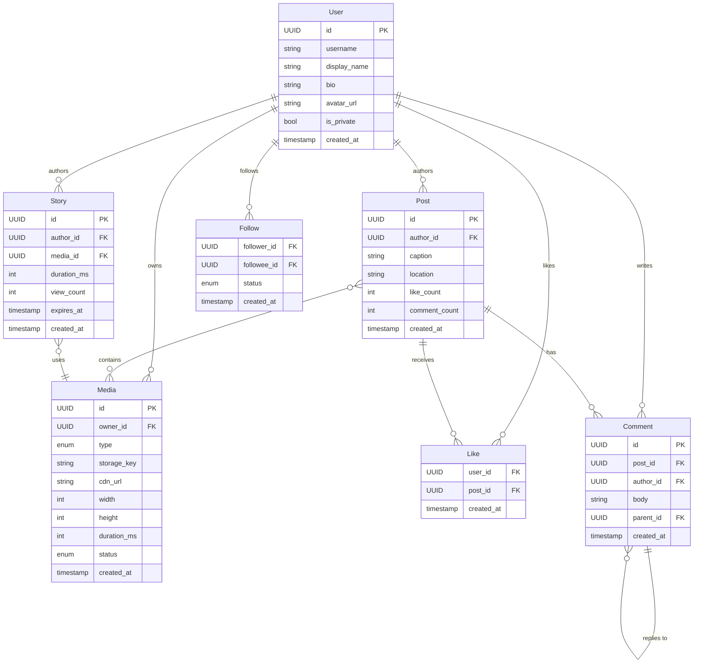
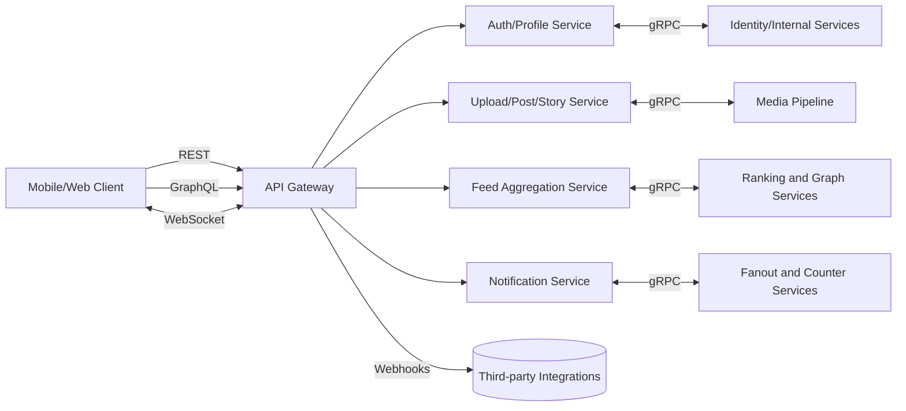
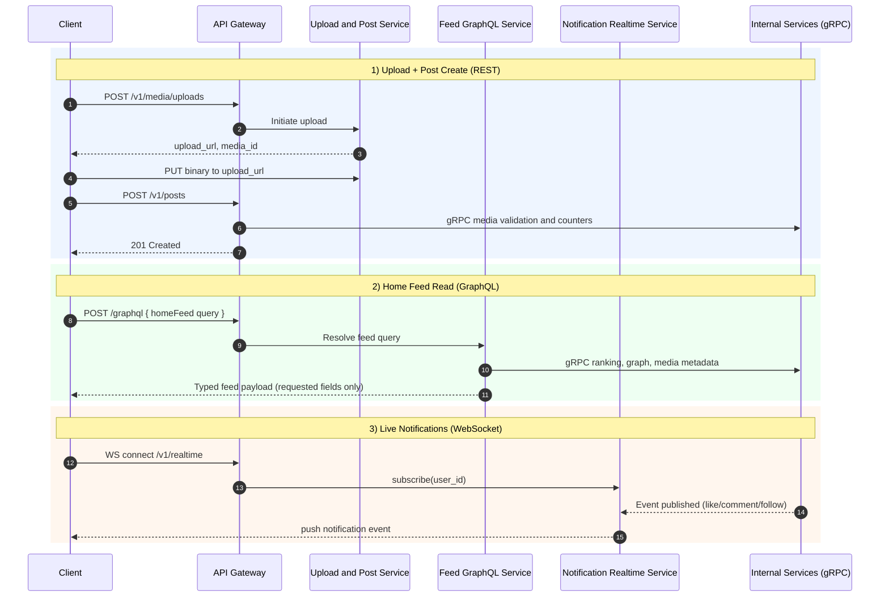
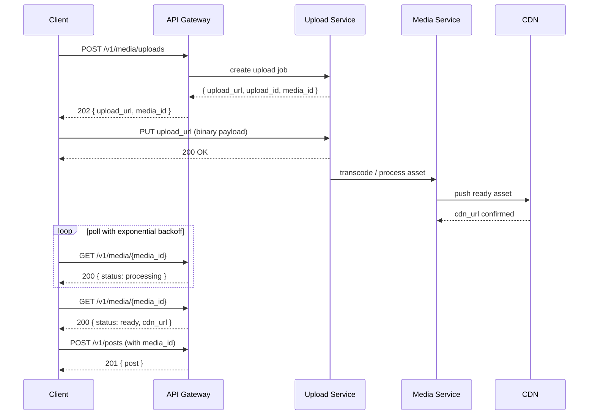
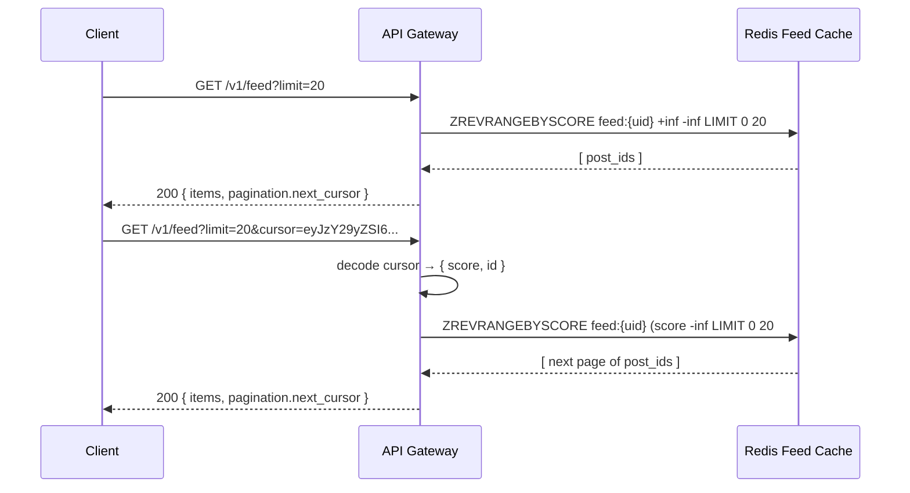
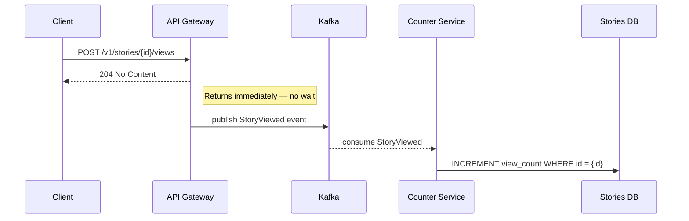

# API Design Walkthrough — Instagram

> Detailed API design for the critical paths of a photo/video social platform. The goal is not to reverse-engineer Instagram's private API but to design a production-quality public API that correctly solves the same problems.

---

## 1. Overview & Scope

### In Scope

| Capability | Critical? |
|------------|-----------|
| User registration & auth | Yes |
| Media upload (photo/video) | Yes — largest payload, most complex |
| Post creation & deletion | Yes |
| Home feed retrieval | Yes — highest read traffic |
| Stories (create, view, expire) | Yes |
| Follow / Unfollow | Yes — graph write path |
| Like & Comment | Secondary |
| Explore / Search | Out of scope |
| DMs | Out of scope |
| Reels recommendation | Out of scope |

### Traffic Profile (assumed)

| Metric | Value |
|--------|-------|
| DAU | 500 M |
| Feed reads / DAU | ~20 |
| Peak feed RPS | ~2 M |
| Post creates / day | ~100 M |
| Peak upload RPS | ~1,200 |
| Latency SLO (feed) | p99 < 200 ms |
| Latency SLO (upload) | p99 < 5 s |

---

## 2. Data Model



---

## 3. Authentication

Instagram uses OAuth 2.0 with short-lived access tokens + refresh tokens. For this design:

### Token Exchange

```
POST /v1/auth/token
Content-Type: application/x-www-form-urlencoded

grant_type=password&username=alice&password=<hashed>
```

```json
HTTP/1.1 200 OK
{
  "access_token":  "eyJ...",
  "token_type":    "Bearer",
  "expires_in":    3600,
  "refresh_token": "dGhp..."
}
```

All subsequent requests carry:

```
Authorization: Bearer <access_token>
```

### Scopes

| Scope | Grants |
|-------|--------|
| `read:feed` | Read own feed and public posts |
| `write:post` | Create and delete own posts |
| `write:story` | Create stories |
| `write:follow` | Follow/unfollow users |
| `read:profile` | Read any public profile |
| `write:profile` | Edit own profile |

---

## 4. Versioning Strategy

- URL prefix: `/v1/`, `/v2/` etc.
- A major version bump happens only for **breaking changes** (field removal, semantic change).
- Additive changes (new optional fields, new endpoints) are non-breaking and applied in-place.
- Deprecated fields carry a `Sunset` response header:
  ```
  Sunset: Sat, 01 Jan 2027 00:00:00 GMT
  Deprecation: true
  Link: <https://developers.instagram.example/migration/v2>; rel="successor-version"
  ```
- Old major versions are supported for **12 months** after the next version GA.

### 4.1 API Style Selection (REST vs GraphQL vs WebSocket vs gRPC)

Most large consumer apps are hybrid. Instagram-like systems usually combine multiple API styles based on traffic shape, latency needs, and client flexibility.

| Style | Best For | Why | Common Tradeoff |
|-------|----------|-----|-----------------|
| REST | Public APIs, CRUD flows, stable contracts | Simple, cache-friendly, broad tooling support | Can over-fetch or require multiple round-trips |
| GraphQL | Client-specific read shapes (feed/profile composition) | Client asks for exact fields; fewer over-fetches | Resolver complexity, query cost control required |
| WebSocket | Real-time bidirectional features | Low-latency push for live events | Connection/state management complexity |
| gRPC | Internal service-to-service communication | Strong contracts + high performance over HTTP/2 | Less browser-friendly for direct public clients |

#### Where each style fits in popular app patterns

| App Pattern | Recommended Mix | Why |
|-------------|-----------------|-----|
| Social feed app (Instagram/X) | REST + GraphQL + WebSocket + internal gRPC | REST for writes/auth/upload flows, GraphQL for feed shaping, WebSocket for notifications/live interactions, gRPC for internal fanout/ranking/media pipelines |
| Ride-hailing (Uber-like) | REST + WebSocket + internal gRPC | REST for booking/payment lifecycle, WebSocket for live trip updates, gRPC for dispatch/ETA internals |
| Chat/messaging (Slack/Discord-like) | REST + WebSocket + internal gRPC | REST for channel/account CRUD, WebSocket for message/presence streams, gRPC for internal message services |
| E-commerce (Shopify/Amazon-like) | REST + GraphQL + Webhooks + internal gRPC | REST for admin/order/payment APIs, GraphQL for storefront reads, webhooks for async partner events, gRPC internally |
| Payments/fintech | REST + Webhooks + internal gRPC | REST for broad integrator compatibility, webhooks for async status updates, gRPC for low-latency internal risk/ledger services |

#### Instagram-specific recommendation

Use REST as the external canonical API style, then layer in specialized protocols where needed:

- Use REST for auth, media upload lifecycle, post/story create/delete, follow/unfollow, and profile endpoints.
- Use GraphQL for read-heavy, client-composed surfaces like home feed, profile tab mixes, and story tray aggregation.
- Use WebSocket for real-time delivery paths (notifications, live comments/reactions, presence-like signals).
- Use gRPC for internal communication across feed fanout, ranking, media processing, counter aggregation, and relationship graph services.

Decision rule of thumb:

- If you need maximum partner compatibility and clear versioning, start with REST.
- If UI teams frequently need custom field selection across many entities, add GraphQL for read paths.
- If users must see updates within sub-second latency, add WebSocket.
- If internal P99 latency and throughput are bottlenecks, use gRPC between backend services.

#### Hybrid protocol view (Instagram-like)



#### Feature request paths (which protocol for which user action)



---

## 5. Critical Path 1 — Media Upload + Post Creation

This is the most complex critical path because it involves:
- Large binary payloads
- Async transcoding (video)
- CDN propagation
- Atomic post creation referencing media that must already be ready

### 5.1 Step-by-step flow



### 5.2 Initiate Upload

```
POST /v1/media/uploads
Authorization: Bearer <token>
Content-Type: application/json
Idempotency-Key: 550e8400-e29b-41d4-a716-446655440000

{
  "type":      "photo",
  "mime_type": "image/jpeg",
  "size":      4821203,
  "width":     1080,
  "height":    1350
}
```

**Response — 202 Accepted**

```json
{
  "upload_id":  "upl_3kT9mZ",
  "upload_url": "https://upload.instagram.example/v1/blobs/upl_3kT9mZ",
  "expires_at": "2026-05-15T15:30:00Z",
  "media_id":   "med_7rW2xQ"
}
```

| Field | Notes |
|-------|-------|
| `upload_url` | Pre-signed URL, single-use, valid for 15 min |
| `media_id` | Already provisioned; POST /v1/posts can reference it once `status=ready` |

### 5.3 Upload Binary Payload

```
PUT https://upload.instagram.example/v1/blobs/upl_3kT9mZ
Content-Type: image/jpeg
Content-Length: 4821203

<binary bytes>
```

**Response — 200 OK** (no body; idempotent — re-PUT the same upload_id is safe)

### 5.4 Poll Media Status

```
GET /v1/media/med_7rW2xQ
Authorization: Bearer <token>
```

**Response — 200 OK (processing)**

```json
{
  "id":         "med_7rW2xQ",
  "type":       "photo",
  "status":     "processing",
  "created_at": "2026-05-15T15:00:00Z"
}
```

**Response — 200 OK (ready)**

```json
{
  "id":         "med_7rW2xQ",
  "type":       "photo",
  "status":     "ready",
  "cdn_url":    "https://cdn.instagram.example/p/med_7rW2xQ_1080x1350.jpg",
  "width":      1080,
  "height":     1350,
  "created_at": "2026-05-15T15:00:00Z"
}
```

> Recommendation: clients should poll with exponential backoff starting at 500 ms.  
> Alternative: subscribe to a webhook (see §9).

### 5.5 Create Post

Only call this after all referenced `media_id`s have `status=ready`.

```
POST /v1/posts
Authorization: Bearer <token>
Content-Type: application/json
Idempotency-Key: 7c9e6679-7425-40de-944b-e07fc1f90ae7

{
  "media_ids": ["med_7rW2xQ"],
  "caption":   "Golden hour in the city. 🌆",
  "location":  "Brooklyn Bridge, New York"
}
```

**Response — 201 Created**

```json
{
  "id":            "pst_9aB1cD",
  "author": {
    "id":          "usr_4xK8mN",
    "username":    "alice",
    "avatar_url":  "https://cdn.instagram.example/avatars/usr_4xK8mN.jpg"
  },
  "media": [
    {
      "id":        "med_7rW2xQ",
      "cdn_url":   "https://cdn.instagram.example/p/med_7rW2xQ_1080x1350.jpg",
      "width":     1080,
      "height":    1350
    }
  ],
  "caption":       "Golden hour in the city. 🌆",
  "location":      "Brooklyn Bridge, New York",
  "like_count":    0,
  "comment_count": 0,
  "created_at":    "2026-05-15T15:05:00Z"
}
```

### 5.6 Edge Cases & Failure Modes

| Scenario | Behavior |
|----------|----------|
| `media_id` still `processing` at POST time | `422 Unprocessable Entity` with `{ "code": "media_not_ready" }` |
| `media_id` belongs to another user | `403 Forbidden` |
| `media_id` in `failed` status | `422` with `{ "code": "media_processing_failed" }` |
| Upload URL expired | `410 Gone` on PUT; client must call initiate upload again |
| Duplicate `Idempotency-Key` within 24h | Returns the original 201 response, no duplicate post |
| Caption exceeds 2200 chars | `400 Bad Request` with field-level detail |

---

## 6. Critical Path 2 — Home Feed Retrieval

The feed is the highest-traffic read path. At 500 M DAU × 20 reads = 10 B feed reads/day ≈ **115,000 RPS average**, spiking to ~2 M RPS.

### 6.1 Feed Architecture (context for the API contract)

The feed is **pre-computed** (fan-out on write for users with < 10k followers; fan-out on read for celebrities). The API layer reads from a feed cache (Redis sorted set keyed by user + score = timestamp), not from the post store directly.


### 6.2 Endpoint

```
GET /v1/feed
Authorization: Bearer <token>
```

**Query Parameters**

| Param | Type | Default | Description |
|-------|------|---------|-------------|
| `limit` | int | 20 | Items per page (max 50) |
| `cursor` | string | — | Opaque pagination cursor from previous response |

### 6.3 Example Request

```
GET /v1/feed?limit=20 HTTP/1.1
Authorization: Bearer eyJ...
```

### 6.4 Example Response — 200 OK

```json
{
  "items": [
    {
      "id":         "pst_9aB1cD",
      "author": {
        "id":       "usr_4xK8mN",
        "username": "alice",
        "avatar_url": "https://cdn.instagram.example/avatars/usr_4xK8mN.jpg",
        "is_verified": false
      },
      "media": [
        {
          "id":      "med_7rW2xQ",
          "type":    "photo",
          "cdn_url": "https://cdn.instagram.example/p/med_7rW2xQ_1080x1350.jpg",
          "width":   1080,
          "height":  1350
        }
      ],
      "caption":       "Golden hour in the city. 🌆",
      "like_count":    1423,
      "comment_count": 38,
      "liked_by_me":   false,
      "created_at":    "2026-05-15T15:05:00Z"
    }
    // ... 19 more items
  ],
  "pagination": {
    "next_cursor":  "eyJzY29yZSI6MTcxNTc4OTkwMCwiaWQiOiJwc3RfMWFCMmNEIn0=",
    "has_more":     true
  }
}
```

### 6.5 Cursor Design

The cursor is a **base64-encoded JSON blob** containing the last item's sort key:

```json
{ "score": 1715789900, "id": "pst_1aB2cD" }
```

Clients treat it as opaque. The server decodes it and issues a range query against the Redis sorted set:

```
ZREVRANGEBYSCORE feed:{user_id}  (score LIMIT 0 limit
```

Cursor flow:



Benefits over offset:
- Stable under concurrent inserts (no items skipped or doubled)
- O(log N) rather than O(offset + limit) at the DB layer
- Can be cached at edge (cursor-keyed cache entries)

### 6.6 Response Headers

```
Cache-Control: private, max-age=0           # feed is personalized
X-Request-Id: req_f3a7c891
X-RateLimit-Limit: 200
X-RateLimit-Remaining: 197
X-RateLimit-Reset: 1715790060
```

### 6.7 Edge Cases & Failure Modes

| Scenario | Behavior |
|----------|----------|
| Cursor from a different user's session | `400 Bad Request` `{ "code": "invalid_cursor" }` |
| Cursor older than 24h (feed refreshed) | Return fresh feed from top, `pagination.cursor_expired: true` |
| Feed cache miss (cold start / new user) | Synchronous fan-in from followee post tables, slightly higher latency |
| Followee with 0 posts | Their posts simply absent from items |
| Private account the caller doesn't follow | Posts excluded server-side |

---

## 7. Critical Path 3 — Stories (Create & View)

Stories expire after 24 hours, have an ordered viewer list, and auto-advance in the client.

### 7.1 Create a Story

```
POST /v1/stories
Authorization: Bearer <token>
Content-Type: application/json
Idempotency-Key: <uuid>

{
  "media_id":    "med_2bC3dE",
  "duration_ms": 5000
}
```

**Response — 201 Created**

```json
{
  "id":          "str_5eF6gH",
  "author_id":   "usr_4xK8mN",
  "media": {
    "id":        "med_2bC3dE",
    "cdn_url":   "https://cdn.instagram.example/stories/med_2bC3dE.jpg",
    "type":      "photo"
  },
  "duration_ms": 5000,
  "view_count":  0,
  "expires_at":  "2026-05-16T15:10:00Z",
  "created_at":  "2026-05-15T15:10:00Z"
}
```

### 7.2 List Stories for Feed (Story Tray)

```
GET /v1/stories/tray
Authorization: Bearer <token>
```

**Response — 200 OK**

```json
{
  "authors": [
    {
      "user": {
        "id":         "usr_1xY9zA",
        "username":   "bob",
        "avatar_url": "https://cdn.instagram.example/avatars/usr_1xY9zA.jpg"
      },
      "has_unseen": true,
      "stories": [
        {
          "id":         "str_7iJ8kL",
          "cdn_url":    "https://cdn.instagram.example/stories/med_8hI9jK.jpg",
          "expires_at": "2026-05-16T12:00:00Z"
        }
      ]
    }
  ]
}
```

### 7.3 Record a Story View

```
POST /v1/stories/str_5eF6gH/views
Authorization: Bearer <token>
```

**Response — 204 No Content**

This is a **fire-and-forget write** on the client side. The server increments `view_count` asynchronously via a Kafka event → counter service.



---

## 8. Critical Path 4 — Follow / Unfollow

### 8.1 Follow a User

```
POST /v1/users/usr_1xY9zA/follow
Authorization: Bearer <token>
Idempotency-Key: <uuid>
```

**Response — 200 OK (public account — accepted immediately)**

```json
{
  "followee_id": "usr_1xY9zA",
  "status":      "accepted",
  "created_at":  "2026-05-15T15:20:00Z"
}
```

**Response — 200 OK (private account — pending approval)**

```json
{
  "followee_id": "usr_1xY9zA",
  "status":      "pending",
  "created_at":  "2026-05-15T15:20:00Z"
}
```

### 8.2 Unfollow / Cancel Request

```
DELETE /v1/users/usr_1xY9zA/follow
Authorization: Bearer <token>
```

**Response — 204 No Content**

Idempotent: `DELETE` on a non-existent follow also returns `204`.

### 8.3 Approve / Reject a Follow Request (private accounts)

```
PATCH /v1/follow-requests/usr_3cD4eF
Authorization: Bearer <token>
Content-Type: application/json

{
  "action": "approve"
}
```

`action` ∈ `{ "approve", "reject" }`.

**Response — 200 OK**

```json
{
  "follower_id": "usr_3cD4eF",
  "status":      "accepted"
}
```

---

## 9. Common API Concerns

### 9.1 Pagination

All collection endpoints use **cursor-based pagination**:

```json
"pagination": {
  "next_cursor": "<opaque>",
  "has_more":    true
}
```

- No `total_count` (too expensive on live data)
- `limit` capped at 50; requests above cap silently clamp, not error

### 9.2 Error Format (RFC 9457 Problem Details)

```json
{
  "type":     "https://developers.instagram.example/errors/media_not_ready",
  "title":    "Media Not Ready",
  "status":   422,
  "detail":   "Media med_7rW2xQ is still processing. Poll GET /v1/media/med_7rW2xQ.",
  "instance": "/v1/posts",
  "request_id": "req_f3a7c891"
}
```

**Standard status codes used**

| Code | When |
|------|------|
| `200` | Successful read or update |
| `201` | Resource created |
| `202` | Async job accepted |
| `204` | Successful delete or fire-and-forget write |
| `400` | Malformed request or validation failure |
| `401` | Missing or invalid token |
| `403` | Valid token, insufficient permission |
| `404` | Resource not found (or intentionally hidden) |
| `409` | Conflict (duplicate, already followed) |
| `410` | Gone (upload URL expired) |
| `422` | Semantically invalid (media not ready) |
| `429` | Rate limit exceeded |
| `500` | Unexpected server error |
| `503` | Temporary overload — retry after `Retry-After` seconds |

### 9.3 Rate Limiting

| Token class | Endpoint group | Limit |
|------------|----------------|-------|
| User token | `GET /v1/feed` | 200 req/min |
| User token | `POST /v1/posts` | 10 req/hour |
| User token | `POST /v1/media/uploads` | 20 req/hour |
| User token | `POST /v1/users/*/follow` | 100 req/hour |
| User token | All other reads | 500 req/min |

When exceeded:

```
HTTP/1.1 429 Too Many Requests
Retry-After: 42
X-RateLimit-Limit: 200
X-RateLimit-Remaining: 0
X-RateLimit-Reset: 1715790060
```

### 9.4 Idempotency

`POST` endpoints that create resources or trigger side-effects require `Idempotency-Key: <uuid-v4>`.

- Keys are stored for **24 hours**.
- A duplicate key within the window returns the **original response** (same status code, same body) without re-executing.
- A key reused with a **different request body** returns `422 Unprocessable Entity`.

### 9.5 Webhooks (Alternative to Polling Media Status)

```
POST /v1/webhooks
Authorization: Bearer <token>
Content-Type: application/json

{
  "url":    "https://app.example/hooks/instagram",
  "events": ["media.ready", "media.failed"],
  "secret": "whsec_abc123"
}
```

Payload delivered to `url`:

```json
{
  "event":      "media.ready",
  "media_id":   "med_7rW2xQ",
  "cdn_url":    "https://cdn.instagram.example/p/med_7rW2xQ_1080x1350.jpg",
  "occurred_at":"2026-05-15T15:01:30Z"
}
```

Signature: `X-Instagram-Signature: sha256=<HMAC-SHA256(secret, raw_body)>`

---

## 10. Design Decisions & Trade-offs

| Decision | Rationale | Trade-off |
|----------|-----------|-----------|
| Two-phase upload (initiate → PUT → create post) | Decouples auth from binary transfer; upload URL can be routed to edge without hitting app servers | More round-trips for the client |
| Pre-signed upload URLs | No auth headers on the binary PUT; simpler CDN routing | URL can be intercepted (mitigated by 15-min expiry + single-use) |
| Denormalized `like_count` / `comment_count` on Post | Avoids expensive COUNT queries on every feed read | Eventual consistency — counts may lag by seconds |
| Cursor pagination for feed | Stable under live inserts; O(log N) | Client cannot jump to arbitrary page |
| Fan-out on write (small accounts) | Feed reads are O(1) cache hit | Write amplification for users with many followers → hybrid strategy |
| `204` on DELETE follow | Idempotent; client doesn't need to handle "already deleted" | Cannot distinguish "never followed" from "just unfollowed" |
| `status: pending` on private follow | Correct UX — user knows request sent | Follow graph writes need to handle async approval event |
