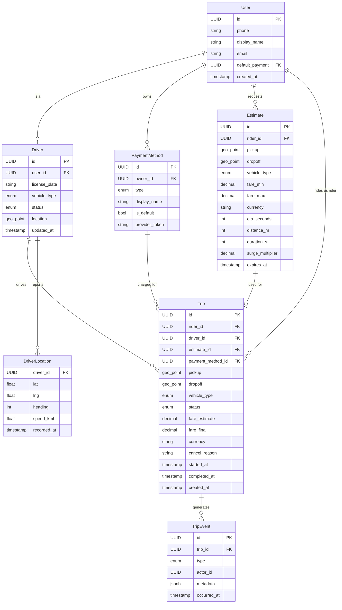
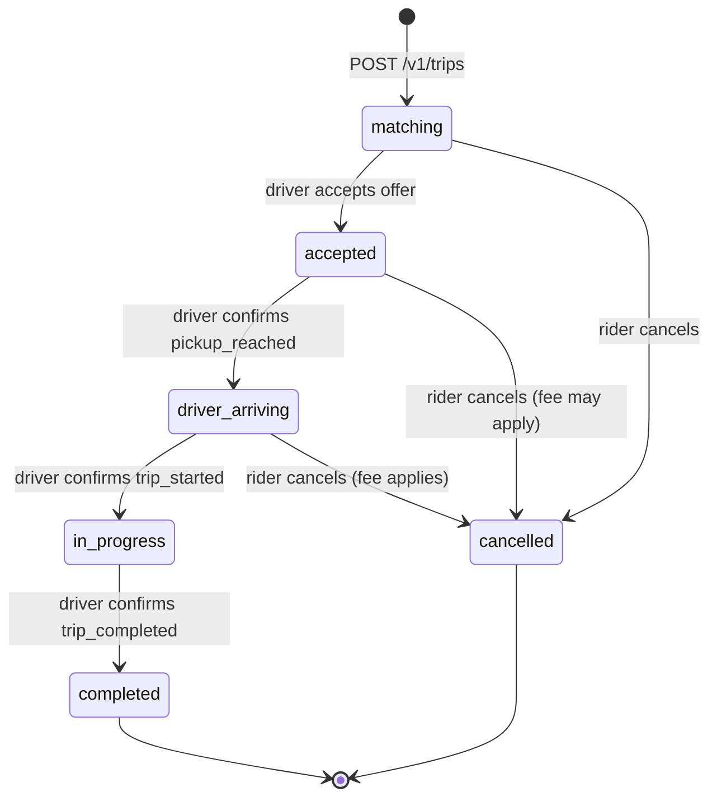
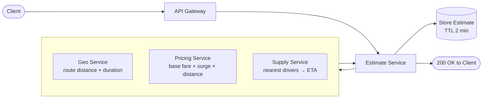
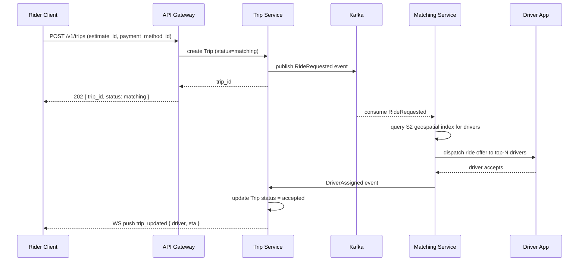
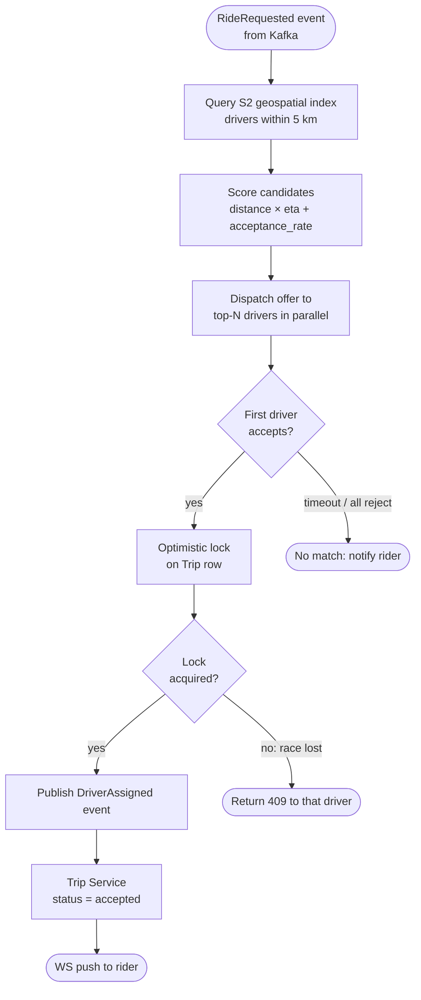
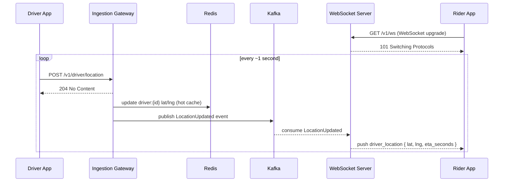
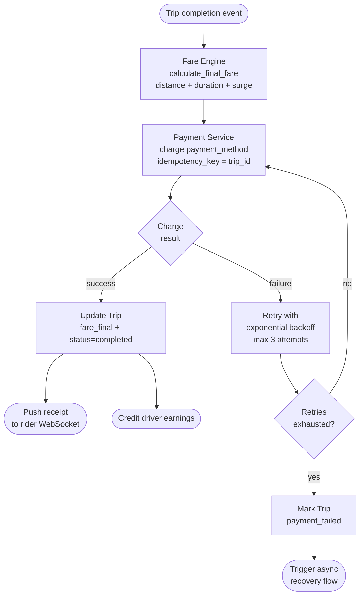

# API Design Walkthrough — Uber

> Detailed API design for the critical paths of a ride-hailing platform. Focus areas: ride request, real-time driver matching, live trip tracking, fare estimation, and payment. These paths are latency-sensitive, geo-distributed, and have strong consistency requirements around money.

---

## 1. Overview & Scope

### In Scope

| Capability | Critical? |
|------------|-----------|
| Fare estimation | Yes — first thing a rider sees |
| Ride request (booking) | Yes — core transaction |
| Driver matching & acceptance | Yes — real-time, latency-sensitive |
| Trip tracking (driver location) | Yes — WebSocket push |
| Trip completion & fare capture | Yes — involves payment |
| Payment method management | Yes |
| Trip history | Secondary |
| Driver onboarding | Out of scope |
| Surge pricing algorithm | Out of scope |
| Driver earnings | Out of scope |

### Traffic Profile (assumed)

| Metric | Value |
|--------|-------|
| Active markets | 70+ countries |
| Trips / day | ~25 M |
| Peak ride requests / s | ~3,000 |
| Driver location updates / s | ~500,000 |
| Fare estimates / s | ~10,000 |
| Matching latency SLO | p99 < 5 s end-to-end |
| Location update latency | p99 < 1 s |

---

## 2. Data Model



### Trip Status State Machine



---

## 3. Authentication

Uber has two actor types: **Riders** (mobile client) and **Drivers** (driver app). Both use OAuth 2.0 with JWT access tokens.

### Rider Token

```
POST /v1/auth/token
Content-Type: application/json

{
  "grant_type": "otp",
  "phone":      "+12025550182",
  "otp":        "847291"
}
```

```json
HTTP/1.1 200 OK
{
  "access_token":  "eyJ...",
  "token_type":    "Bearer",
  "expires_in":    3600,
  "refresh_token": "dGhp...",
  "actor_type":    "rider"
}
```

### Driver Token

Same endpoint; `actor_type` will be `driver` in the returned token claims.

All requests carry:

```
Authorization: Bearer <access_token>
X-Actor-Type: rider | driver
```

Server validates `actor_type` claim on every request. A rider token cannot call driver-only endpoints and vice-versa.

---

## 4. Versioning Strategy

- URL prefix versioning: `/v1/`, `/v2/`
- Breaking changes trigger a major version; additive changes do not
- Deprecated endpoints carry `Sunset` header (12-month support window)
- Driver app and rider app pin to a version; forced-upgrade mechanism exists outside the API

---

## 5. Critical Path 1 — Fare Estimation

The fare estimate is the **entry point** for every ride. It must be fast (< 500 ms p99) and accurate enough that the actual fare is almost never a surprise.

### 5.1 Endpoint

```
POST /v1/estimates
Authorization: Bearer <token>
Content-Type: application/json

{
  "pickup": {
    "lat": 40.748817,
    "lng": -73.985428,
    "address": "350 5th Ave, New York, NY 10118"
  },
  "dropoff": {
    "lat": 40.712776,
    "lng": -74.005974,
    "address": "1 World Trade Center, New York, NY 10007"
  },
  "vehicle_types": ["economy", "comfort", "xl"]
}
```

> `vehicle_types` is optional. Omitting it returns estimates for all available types.

### 5.2 Response — 200 OK

```json
{
  "estimates": [
    {
      "id":               "est_4kL5mN",
      "vehicle_type":     "economy",
      "fare_min":         14.50,
      "fare_max":         18.00,
      "currency":         "USD",
      "eta_seconds":      240,
      "distance_m":       6800,
      "duration_s":       1080,
      "surge_multiplier": 1.0,
      "surge_active":     false,
      "expires_at":       "2026-05-15T16:02:00Z"
    },
    {
      "id":               "est_6oP7qR",
      "vehicle_type":     "comfort",
      "fare_min":         19.00,
      "fare_max":         24.00,
      "currency":         "USD",
      "eta_seconds":      180,
      "distance_m":       6800,
      "duration_s":       1080,
      "surge_multiplier": 1.2,
      "surge_active":     true,
      "expires_at":       "2026-05-15T16:02:00Z"
    }
  ]
}
```

### 5.3 Internal Flow



### 5.4 Edge Cases

| Scenario | Behavior |
|----------|----------|
| No drivers available in area | `eta_seconds` absent; `"available": false` |
| Unsupported vehicle type | Excluded from response (not an error) |
| Pickup outside service area | `422` with `{ "code": "outside_service_area" }` |
| Estimate expired and used for booking | `409` with `{ "code": "estimate_expired" }` |

---

## 6. Critical Path 2 — Ride Request & Driver Matching

This is the **most critical write path** in the system. A ride request must be atomic, matched quickly, and never double-booked.

### 6.1 Step-by-step flow



### 6.2 Request a Ride

```
POST /v1/trips
Authorization: Bearer <token>
Content-Type: application/json
Idempotency-Key: a3f1b2c4-d5e6-7890-abcd-ef1234567890

{
  "estimate_id":         "est_4kL5mN",
  "payment_method_id":   "pm_8sT9uV",
  "notes":               "Gate code is 1234"
}
```

**Response — 202 Accepted**

```json
{
  "trip_id":    "trp_2wX3yZ",
  "status":     "matching",
  "created_at": "2026-05-15T16:00:00Z"
}
```

`202` because matching is **asynchronous**. The client must subscribe to updates via WebSocket (see §8) or poll `GET /v1/trips/trp_2wX3yZ`.

### 6.3 Poll Trip Status

```
GET /v1/trips/trp_2wX3yZ
Authorization: Bearer <token>
```

**Response — 200 OK (matching)**

```json
{
  "id":     "trp_2wX3yZ",
  "status": "matching"
}
```

**Response — 200 OK (driver accepted)**

```json
{
  "id":     "trp_2wX3yZ",
  "status": "accepted",
  "driver": {
    "id":            "drv_1aB2cD",
    "display_name":  "Marcus T.",
    "avatar_url":    "https://cdn.uber.example/avatars/drv_1aB2cD.jpg",
    "rating":        4.87,
    "vehicle": {
      "make":         "Toyota",
      "model":        "Camry",
      "color":        "Silver",
      "license_plate":"ABC-1234",
      "type":         "economy"
    }
  },
  "eta_seconds":      190,
  "pickup": {
    "lat":     40.748817,
    "lng":    -73.985428,
    "address": "350 5th Ave, New York, NY 10118"
  },
  "dropoff": {
    "lat":     40.712776,
    "lng":    -74.005974,
    "address": "1 World Trade Center, New York, NY 10007"
  },
  "fare_estimate": 14.50,
  "currency":      "USD",
  "created_at":    "2026-05-15T16:00:00Z"
}
```

### 6.4 Cancel a Trip

```
DELETE /v1/trips/trp_2wX3yZ
Authorization: Bearer <token>
Content-Type: application/json

{
  "reason": "plans_changed"
}
```

`reason` ∈ `{ "plans_changed", "driver_too_far", "wrong_vehicle", "other" }`

**Response — 200 OK**

```json
{
  "trip_id":          "trp_2wX3yZ",
  "status":           "cancelled",
  "cancellation_fee": 0.00,
  "currency":         "USD"
}
```

> Cancellation fee may be non-zero if driver has already arrived (configurable per market).

### 6.5 Driver: Accept a Ride (Driver App)

```
POST /v1/driver/trips/trp_2wX3yZ/accept
Authorization: Bearer <driver_token>
Idempotency-Key: <uuid>
```

**Response — 200 OK**

```json
{
  "trip_id":  "trp_2wX3yZ",
  "status":   "accepted",
  "rider": {
    "display_name": "Alice M.",
    "avatar_url":   "https://cdn.uber.example/avatars/usr_4xK8mN.jpg",
    "rating":       4.9
  },
  "pickup": {
    "lat":     40.748817,
    "lng":    -73.985428,
    "address": "350 5th Ave, New York, NY 10118"
  }
}
```

**Response — 409 Conflict** (trip already claimed by another driver)

```json
{
  "type":   "https://developers.uber.example/errors/trip_already_claimed",
  "title":  "Trip Already Claimed",
  "status": 409,
  "detail": "Another driver accepted this trip first."
}
```

### 6.6 Matching Algorithm (context)

Matching runs outside the REST layer, in a dedicated service. The REST API is the **control plane**; the matching engine is the **data plane**.



---

## 7. Critical Path 3 — Live Trip Tracking

### 7.1 Location Tracking Flow



### 7.2 Driver Location Publish (Driver App → Server)

Driver app sends location at ~1 Hz.

```
POST /v1/driver/location
Authorization: Bearer <driver_token>
Content-Type: application/json

{
  "lat":       40.750123,
  "lng":      -73.987456,
  "heading":   215,
  "speed_kmh": 32.5,
  "recorded_at": "2026-05-15T16:05:00.000Z"
}
```

**Response — 204 No Content**

This endpoint is optimized for throughput: no response body, fire-and-forget from the driver app's perspective. The server persists to Redis (hot) and Kafka (durable) asynchronously.

> At 500k updates/s, this endpoint sits behind a dedicated ingestion gateway (no auth middleware overhead — token is validated at the edge and a lightweight session claim propagates inward).

### 7.2 Rider Receives Location (WebSocket)

Rather than polling, the rider client maintains a WebSocket connection.

**Connection**

```
GET /v1/ws
Authorization: Bearer <token>
Upgrade: websocket
```

**Server-pushed message (JSON over WebSocket)**

```json
{
  "event":   "driver_location",
  "trip_id": "trp_2wX3yZ",
  "driver": {
    "lat":       40.750123,
    "lng":      -73.987456,
    "heading":   215,
    "eta_seconds": 140
  },
  "ts": "2026-05-15T16:05:01.000Z"
}
```

**Other events pushed on the same connection**

| Event | When |
|-------|------|
| `trip_updated` | Trip status changes (accepted, driver_arriving, in_progress, completed) |
| `driver_location` | Every driver location update for the active trip |
| `fare_updated` | Surge multiplier changes mid-estimate |
| `ping` | Keepalive every 30s; client replies with `pong` |

### 7.3 WebSocket Reconnect Strategy

Client should reconnect with **exponential backoff** (500ms, 1s, 2s, 4s, max 30s) on disconnect. Reconnect includes the last known `trip_id` so the server can replay any missed events:

```
GET /v1/ws?resume_trip=trp_2wX3yZ&last_event_ts=1715790300000
```

---

## 8. Critical Path 4 — Trip Completion & Payment

### 8.1 Driver: Mark Pickup Reached

```
POST /v1/driver/trips/trp_2wX3yZ/events
Authorization: Bearer <driver_token>
Content-Type: application/json

{
  "type": "pickup_reached"
}
```

**Response — 200 OK**

```json
{
  "trip_id": "trp_2wX3yZ",
  "status":  "driver_arriving",
  "event_id":"evt_9kL0mN"
}
```

### 8.2 Driver: Start Trip

```
POST /v1/driver/trips/trp_2wX3yZ/events
Authorization: Bearer <driver_token>
Content-Type: application/json

{
  "type": "trip_started"
}
```

**Response — 200 OK**

```json
{
  "trip_id":    "trp_2wX3yZ",
  "status":     "in_progress",
  "started_at": "2026-05-15T16:12:00Z"
}
```

### 8.3 Driver: Complete Trip

```
POST /v1/driver/trips/trp_2wX3yZ/events
Authorization: Bearer <driver_token>
Content-Type: application/json

{
  "type":       "trip_completed",
  "dropoff": {
    "lat": 40.712776,
    "lng": -74.005974
  }
}
```

**Response — 200 OK**

```json
{
  "trip_id":       "trp_2wX3yZ",
  "status":        "completed",
  "fare_final":    15.75,
  "currency":      "USD",
  "completed_at":  "2026-05-15T16:28:00Z",
  "receipt_url":   "https://riders.uber.example/receipts/trp_2wX3yZ"
}
```

### 8.4 Payment Flow (Internal — context for the API contract)



The `idempotency_key = trip_id` ensures the charge is never duplicated even if the payment service is retried.

### 8.5 Rider: Fetch Receipt

```
GET /v1/trips/trp_2wX3yZ/receipt
Authorization: Bearer <token>
```

**Response — 200 OK**

```json
{
  "trip_id":        "trp_2wX3yZ",
  "fare_breakdown": {
    "base_fare":     5.00,
    "distance_fare": 7.20,
    "time_fare":     2.16,
    "surge":         0.00,
    "booking_fee":   1.39,
    "total":        15.75
  },
  "currency":       "USD",
  "payment_method": "Visa ••••4242",
  "charged_at":     "2026-05-15T16:28:45Z",
  "map_url":        "https://riders.uber.example/receipts/trp_2wX3yZ/map.png"
}
```

---

## 9. Payment Method Management

### 9.1 List Payment Methods

```
GET /v1/payment-methods
Authorization: Bearer <token>
```

**Response — 200 OK**

```json
{
  "items": [
    {
      "id":           "pm_8sT9uV",
      "type":         "card",
      "display_name": "Visa ••••4242",
      "is_default":   true
    }
  ]
}
```

### 9.2 Add a Payment Method

```
POST /v1/payment-methods
Authorization: Bearer <token>
Content-Type: application/json
Idempotency-Key: <uuid>

{
  "type":             "card",
  "provider_token":   "tok_visa_4242",
  "set_as_default":   false
}
```

`provider_token` is obtained by the client directly from the payment processor SDK (e.g., Stripe.js). The Uber API never sees raw card data — this is a **PCI-compliant tokenization pattern**.

**Response — 201 Created**

```json
{
  "id":           "pm_1aB2cD",
  "type":         "card",
  "display_name": "Visa ••••4242",
  "is_default":   false
}
```

### 9.3 Delete a Payment Method

```
DELETE /v1/payment-methods/pm_1aB2cD
Authorization: Bearer <token>
```

**Response — 204 No Content**

Error if it is the only payment method or currently attached to an active trip:

```json
{
  "type":   "https://developers.uber.example/errors/payment_method_in_use",
  "title":  "Payment Method In Use",
  "status": 409,
  "detail": "This payment method is attached to an active trip (trp_2wX3yZ)."
}
```

---

## 10. Common API Concerns

### 10.1 Pagination (Trip History)

```
GET /v1/trips?limit=20&cursor=<opaque>
Authorization: Bearer <token>
```

```json
{
  "items": [ /* trip summaries */ ],
  "pagination": {
    "next_cursor": "eyJpZCI6InRycF8xMiIsInRzIjoxNzE1Nzg5OTAwfQ==",
    "has_more": true
  }
}
```

### 10.2 Error Format (RFC 9457)

```json
{
  "type":       "https://developers.uber.example/errors/estimate_expired",
  "title":      "Estimate Expired",
  "status":     409,
  "detail":     "Estimate est_4kL5mN expired at 2026-05-15T16:02:00Z. Request a new estimate.",
  "instance":   "/v1/trips",
  "request_id": "req_a1b2c3d4"
}
```

### 10.3 Rate Limiting

| Actor | Endpoint | Limit |
|-------|----------|-------|
| Rider | `POST /v1/estimates` | 30 req/min |
| Rider | `POST /v1/trips` | 5 req/min |
| Rider | `GET /v1/trips/*` | 120 req/min |
| Driver | `POST /v1/driver/location` | 120 req/min (1 Hz normal) |
| Driver | `POST /v1/driver/trips/*/events` | 20 req/min |

### 10.4 Idempotency

| Endpoint | Idempotency-Key required? | Key scope |
|----------|--------------------------|-----------|
| `POST /v1/estimates` | No (reads only, side-effect free) | — |
| `POST /v1/trips` | **Yes** | 24h |
| `POST /v1/driver/trips/*/accept` | **Yes** | Until trip resolved |
| `POST /v1/payment-methods` | **Yes** | 24h |
| `POST /v1/driver/trips/*/events` | **Yes** | Per event type per trip |

### 10.5 Geo Data Conventions

All coordinates use **WGS-84** decimal degrees. Maximum precision accepted: 6 decimal places (~0.1 m).

```json
{ "lat": 40.748817, "lng": -73.985428 }
```

`lng` is always `lng` (not `lon` or `longitude`) for consistency.

---

## 11. Design Decisions & Trade-offs

| Decision | Rationale | Trade-off |
|----------|-----------|-----------|
| `202 Accepted` on trip creation | Matching is async; no driver may be available immediately | Client must handle matching state; more complex than synchronous |
| WebSocket for location push | ~1 Hz updates at 500k drivers is too much for polling | Requires persistent connection management (scaling with connection-aware load balancer) |
| `POST /v1/driver/location` (REST) | Simpler than WebSocket for a write-only unidirectional stream | Higher overhead than UDP/QUIC; acceptable at 1 Hz |
| Idempotency key = trip_id for payment | Natural idempotency key; avoids double charge on retry | Requires payment service to accept caller-supplied idempotency keys |
| PCI tokenization (provider_token) | Uber never stores raw card data; dramatically reduces PCI scope | Client must integrate payment SDK; server cannot validate card without calling processor |
| Fare min/max range (not exact) | Exact fare requires completed route; estimate is inherently uncertain | Creates UX trust risk if final fare is near or above max |
| Optimistic locking on driver accept | High throughput; minimal DB contention (only one driver wins per trip) | Losers get `409` — driver app must handle gracefully |
| S2 cell geospatial index | Hierarchical; efficient for "all drivers within radius" queries | Requires tuning cell level (L13 ≈ 1.2 km²) for local density |
