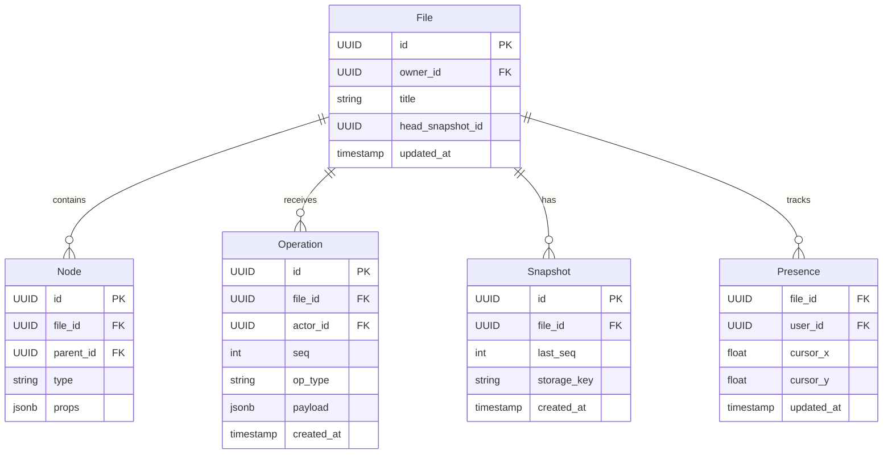
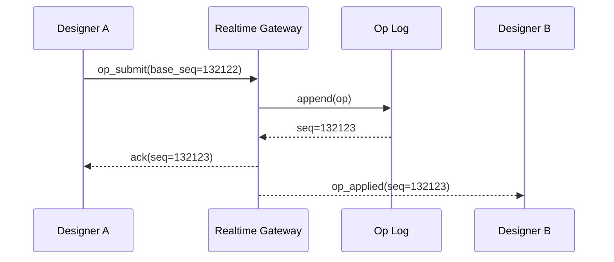

# API Design Walkthrough — Figma

> Detailed API design for a collaborative design editor. Focus areas: file bootstrap, realtime multiplayer operations, presence, and version snapshots.

---

## 1. Overview & Scope

### In Scope

| Capability | Critical? |
|------------|-----------|
| File open/bootstrap | Yes |
| Realtime collaborative edits | Yes |
| Presence and cursor sync | Yes |
| Version snapshots and restore | Yes |
| Plugin marketplace | Secondary |
| Billing and seat management | Out of scope |

### Traffic Profile (assumed)

| Metric | Value |
|--------|-------|
| Peak file opens | ~12k rps |
| Peak operation ingest | ~300k ops/s |
| Peak presence updates | ~1.2M events/s |
| Realtime op delivery SLO | p99 < 250 ms |

---

## 2. Data Model



### 2.1 Plain-English Terms

- Operation log: append-only list of edits.
- Seq: monotonic per-file ordering key.
- Presence: ephemeral cursor/selection info.
- Snapshot: compact durable checkpoint for quick file load.

---

## 3. Authentication

- OAuth2 tokens for users.
- Workspace membership checks for file access.
- Realtime token scoped to file_id and ttl.

---

## 4. Versioning Strategy

- /v1 for public REST surface.
- Realtime frame schema includes version field.
- Additive operation types preferred over mutation of existing types.

---

## 5. Critical Path 1 — File Open and Bootstrap

### Endpoint Contract

- GET /v1/files/{file_id}
- GET /v1/files/{file_id}/operations?after_seq=...

### Example Response

```json
{
  "file": {"id": "f_21", "title": "Landing Page"},
  "snapshot": {"id": "s_88", "last_seq": 132120, "storage_key": "snapshots/f_21/s_88.bin"},
  "tail_ops": [
    {"seq": 132121, "op_type": "node_transform"},
    {"seq": 132122, "op_type": "node_style_patch"}
  ]
}
```

### Internal Flow

1. Validate workspace/file permission.
2. Fetch latest snapshot metadata.
3. Stream snapshot blob from object storage.
4. Fetch post-snapshot operations by seq.
5. Return bootstrap payload.

### Latency Budget

| Stage | Budget |
|-------|--------|
| Auth + ACL | 25 ms |
| Snapshot metadata read | 20 ms |
| Snapshot blob fetch | 110 ms |
| Tail op query | 40 ms |
| Total | 195 ms |

---

## 6. Critical Path 2 — Realtime Collaborative Edits

### Endpoint Contract

- WS /v1/files/{file_id}/realtime

### Example Client Op Frame

```json
{
  "type": "op_submit",
  "client_op_id": "co_991",
  "base_seq": 132122,
  "op": {"op_type": "node_transform", "node_id": "n_9", "dx": 12, "dy": -4}
}
```

### Internal Flow

1. Client sends op with base_seq.
2. Server validates and transforms against concurrent ops.
3. Server assigns authoritative seq.
4. Append op to log and ack sender.
5. Broadcast op to all collaborators.



---

## 7. Critical Path 3 — Presence and Cursor Sync

### Endpoint Contract

- WS event type: presence_update

### Internal Flow

1. Clients send low-priority cursor updates at capped frequency.
2. Server samples/coalesces updates.
3. Fanout via pub/sub to collaborators.
4. Expire stale presence after heartbeat timeout.

### Scalability Notes

- Presence is lossy by design.
- Drop frequency under load before dropping operation traffic.

---

## 8. Critical Path 4 — Version Snapshots and Restore

### Endpoint Contracts

- POST /v1/files/{file_id}/snapshots
- POST /v1/files/{file_id}:restore

### Example Snapshot Response

```json
{
  "snapshot_id": "s_89",
  "file_id": "f_21",
  "last_seq": 133004,
  "created_at": "2026-05-17T15:22:11Z"
}
```

### Internal Flow

1. Serialize canonical document tree.
2. Upload snapshot blob to object storage.
3. Persist snapshot metadata and last_seq.
4. Restore re-points head_snapshot_id and emits restore event.

---

## 9. Common API Concerns

### 9.1 Error Catalog (examples)

| HTTP | When | Retry? |
|------|------|--------|
| 400 | Invalid schema or missing required field | No |
| 401 | Missing or invalid token | No (refresh auth) |
| 403 | Scope/permission denied | No |
| 409 | Version conflict or stale cursor/seq | Retry after refetch |
| 422 | Business rule violation | No |
| 429 | Rate limit exceeded | Yes, with backoff |
| 500/503 | Transient internal/dependency error | Yes, exponential backoff |

Example error payload:

```json
{
  "type": "https://api.example.com/errors/rate-limit",
  "title": "Rate limit exceeded",
  "status": 429,
  "detail": "Too many requests for this token",
  "instance": "req_abc123"
}
```

### 9.2 Retry and Idempotency Matrix

| Operation type | Idempotency strategy | Safe retry policy |
|----------------|----------------------|-------------------|
| Realtime op submit | client_op_id or nonce per channel/file | Retry only on timeout; refetch latest seq before resend |
| Message/edit write | Idempotency-Key or client_msg_id | Exponential backoff with jitter, max 3 attempts |
| Presence update | None (ephemeral) | Best-effort, do not retry aggressively |
| Reconnect/resume | Session resume token | Immediate resume once, then backoff (1s, 2s, 5s...) |
| Webhook/app callback delivery | event_id dedupe on receiver | At-least-once with exponential backoff + DLQ |


## 10. Design Decisions & Trade-offs

| Decision | Why | Trade-off |
|----------|-----|-----------|
| Append-only op log | Replay/debug/audit | Storage growth |
| Snapshot + tail replay | Fast bootstraps | Snapshot maintenance complexity |
| Lossy presence | Protects critical edit traffic | Less precise cursors under load |

---

## 11. System Bottlenecks & Scaling Triggers

### 11.1 Alert Thresholds (sample)

| Alert | Threshold | Action |
|-------|-----------|--------|
| Realtime op/event p99 | > 250 ms for 10 min | scale gateway shards, reduce non-critical fanout |
| Reconnect storm | > 8% connections/min | enforce jittered reconnect, temporary admission control |
| Dropped realtime frames | > 1% for 5 min | increase buffers, backpressure low-priority streams |
| Gateway file descriptor usage | > 80% for 10 min | add instances, rebalance sticky sessions |
| Fanout queue lag | > 60 s | autoscale workers and inspect hot partition |

## 12. Interview Summary

- Collaborative editors are operation pipelines first, APIs second.
- Separate critical edit ops from noisy presence updates.
- Snapshot + operation-tail replay is the key load-time pattern.
