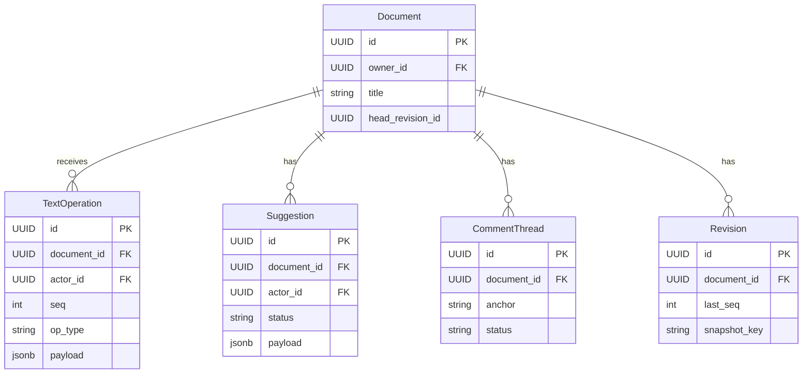

# API Design Walkthrough — Google Docs

> Detailed API design for a collaborative text editor. Focus areas: document bootstrap, concurrent text operations, comment/suggestion lanes, and revision restore.

---

## 1. Overview & Scope

### In Scope

| Capability | Critical? |
|------------|-----------|
| Document open/bootstrap | Yes |
| Realtime text co-editing | Yes |
| Suggestions and comments | Yes |
| Revision history and restore | Yes |
| Document export | Secondary |
| Admin auditing | Out of scope |

### Traffic Profile (assumed)

| Metric | Value |
|--------|-------|
| Peak opens | ~20k rps |
| Peak edit ops | ~500k ops/s |
| Peak comment events | ~90k events/s |
| Edit apply SLO | p99 < 220 ms |

---

## 2. Data Model



---

## 3. Authentication

- OAuth2 user tokens.
- ACL roles: owner, editor, commenter, viewer.
- Realtime channel token scoped to document and role.

---

## 4. Versioning Strategy

- Public REST at /v1.
- Realtime operation schema versioned with frame_version.
- New op types additive and backward-compatible.

---

## 5. Critical Path 1 — Document Open and Bootstrap

### Endpoints

- GET /v1/documents/{document_id}
- GET /v1/documents/{document_id}/operations?after_seq=...

### Example Response

```json
{
  "document": {"id": "d_1", "title": "Design Notes"},
  "head_revision": {"id": "r_81", "last_seq": 55122},
  "tail_ops": [{"seq": 55123, "op_type": "insert_text"}]
}
```

### Flow

1. Check ACL and document status.
2. Read head revision snapshot.
3. Read tail ops after revision seq.
4. Return bootstrap bundle.

---

## 6. Critical Path 2 — Realtime Text Co-editing

### Endpoint

- WS /v1/documents/{document_id}/collab

### Client Operation Example

```json
{
  "type": "op_submit",
  "base_seq": 55123,
  "op": {"op_type": "insert_text", "index": 1204, "text": "System design "}
}
```

### Flow

1. Validate operation and actor role.
2. Transform op against concurrent writes.
3. Append with authoritative seq.
4. Fanout transformed op to peers.

### Latency Budget

| Stage | Budget |
|-------|--------|
| Validation | 20 ms |
| Transform/merge | 90 ms |
| Append + fanout | 80 ms |
| Total | 190 ms |


---

## 7. Critical Path 3 — Suggestions and Comments

### Endpoints

- POST /v1/documents/{id}/suggestions
- POST /v1/documents/{id}/comments

### Flow

1. Suggestion/comment stored in side-lane tables.
2. Change events pushed to participants.
3. Accept/reject suggestion emits synthetic text ops.

---

## 8. Critical Path 4 — Revision History and Restore

### Endpoints

- GET /v1/documents/{id}/revisions
- POST /v1/documents/{id}:restore

### Flow

1. List revision metadata with cursor paging.
2. Restore sets head_revision_id and replays metadata updates.
3. Broadcast restore event to active editors.

---

## 9. Common API Concerns

### 9.1 Error Catalog (examples)

| HTTP | When | Retry? |
|------|------|--------|
| 400 | Invalid schema or missing required field | No |
| 401 | Missing or invalid token | No (refresh auth) |
| 403 | Scope/permission denied | No |
| 409 | Version conflict or stale cursor/seq | Retry after refetch |
| 422 | Business rule violation | No |
| 429 | Rate limit exceeded | Yes, with backoff |
| 500/503 | Transient internal/dependency error | Yes, exponential backoff |

Example error payload:

```json
{
  "type": "https://api.example.com/errors/rate-limit",
  "title": "Rate limit exceeded",
  "status": 429,
  "detail": "Too many requests for this token",
  "instance": "req_abc123"
}
```

### 9.2 Retry and Idempotency Matrix

| Operation type | Idempotency strategy | Safe retry policy |
|----------------|----------------------|-------------------|
| Realtime op submit | client_op_id or nonce per channel/file | Retry only on timeout; refetch latest seq before resend |
| Message/edit write | Idempotency-Key or client_msg_id | Exponential backoff with jitter, max 3 attempts |
| Presence update | None (ephemeral) | Best-effort, do not retry aggressively |
| Reconnect/resume | Session resume token | Immediate resume once, then backoff (1s, 2s, 5s...) |
| Webhook/app callback delivery | event_id dedupe on receiver | At-least-once with exponential backoff + DLQ |


## 10. Design Decisions & Trade-offs

| Decision | Why | Trade-off |
|----------|-----|-----------|
| Shared op log | Reproducibility and auditability | Large history storage |
| Side-lane suggestions | Isolates editorial workflow | Extra merge logic |
| Revision snapshots | Fast open time | Snapshot maintenance |

---

## 11. System Bottlenecks & Scaling Triggers

### 11.1 Alert Thresholds (sample)

| Alert | Threshold | Action |
|-------|-----------|--------|
| Realtime op/event p99 | > 250 ms for 10 min | scale gateway shards, reduce non-critical fanout |
| Reconnect storm | > 8% connections/min | enforce jittered reconnect, temporary admission control |
| Dropped realtime frames | > 1% for 5 min | increase buffers, backpressure low-priority streams |
| Gateway file descriptor usage | > 80% for 10 min | add instances, rebalance sticky sessions |
| Fanout queue lag | > 60 s | autoscale workers and inspect hot partition |

## 12. Interview Summary

- Document editors need deterministic operation ordering.
- Suggestions/comments should not block edit hot path.
- Revision restore is a metadata flip plus client reconciliation.
