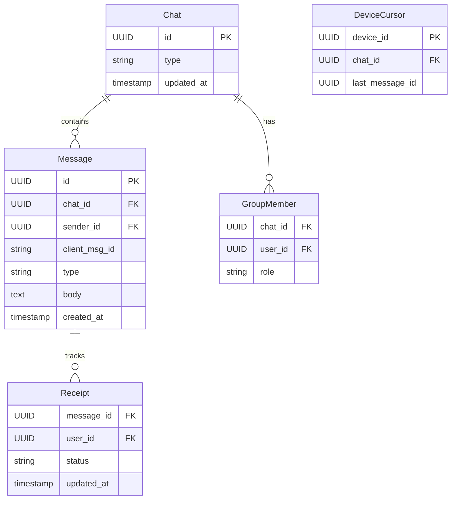
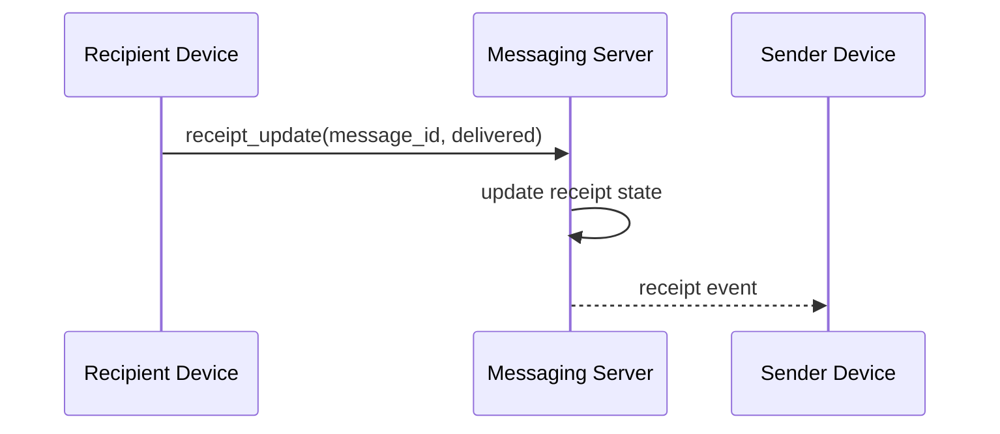

# API Design Walkthrough — WhatsApp

> Detailed API design for a messaging platform. Focus areas: send path, reconnect sync, receipts, and group fanout.

---

## 1. Overview & Scope

### In Scope

| Capability | Critical? |
|------------|-----------|
| Send message | Yes |
| Reconnect and sync history | Yes |
| Delivery/read receipts | Yes |
| Group member fanout | Yes |
| Status stories | Secondary |
| Contact discovery internals | Out of scope |

### Traffic Profile (assumed)

| Metric | Value |
|--------|-------|
| Peak sends | ~250k msg/s |
| Peak receipt events | ~500k events/s |
| Peak group fanout | ~1.5M deliveries/s |
| Send ack SLO | p99 < 500 ms |

---

## 2. Data Model



---

## 3. Authentication

- Device-authenticated sessions.
- User tokens for account-level operations.
- Per-device key material for encrypted payload exchange.

---

## 4. Versioning Strategy

- /v1 REST for metadata.
- Realtime protocol frame version in handshake.
- Forward-compatible unknown frame handling.

---

## 5. Critical Path 1 — Send Message

### Endpoint Contract

- WS frame: send_message
- POST /v1/chats/{chat_id}/messages (fallback)

### Example Send Frame

```json
{
  "type": "send_message",
  "chat_id": "c_7",
  "client_msg_id": "m_client_992",
  "payload": {"type": "text", "body": "On my way"}
}
```

### Flow

1. Validate sender membership.
2. Dedupe by client_msg_id.
3. Persist message.
4. Ack sender with server message id.
5. Fanout to recipient devices.

### Latency Budget

| Stage | Budget |
|-------|--------|
| Auth + membership | 40 ms |
| Dedupe + write | 80 ms |
| Fanout enqueue | 120 ms |
| Sender ack | 30 ms |
| Total | 270 ms |

---

## 6. Critical Path 2 — Reconnect and Sync History

### Endpoint

- GET /v1/chats/{chat_id}/messages?after_message_id=...

### Flow

1. Client sends last known cursor.
2. Server fetches delta messages.
3. Client applies in order and updates cursor.

---

## 7. Critical Path 3 — Delivery and Read Receipts

### Endpoint

- WS frame: receipt_update

### Flow

1. Device reports delivered/read transition.
2. Receipt row updates with monotonic state machine.
3. Sender devices receive receipt event.



---

## 8. Critical Path 4 — Group Fanout

### Endpoint

- POST /v1/groups/{group_id}/messages

### Flow

1. Resolve active group members.
2. Expand to device targets.
3. Enqueue per-recipient deliveries.
4. Retry transient failures with backoff.

### Consistency

- Message persistence is strong.
- Device delivery state is eventual.

---

## 9. Common API Concerns

### 9.1 Error Catalog (examples)

| HTTP | When | Retry? |
|------|------|--------|
| 400 | Invalid schema or missing required field | No |
| 401 | Missing or invalid token | No (refresh auth) |
| 403 | Scope/permission denied | No |
| 409 | Version conflict or stale cursor/seq | Retry after refetch |
| 422 | Business rule violation | No |
| 429 | Rate limit exceeded | Yes, with backoff |
| 500/503 | Transient internal/dependency error | Yes, exponential backoff |

Example error payload:

```json
{
  "type": "https://api.example.com/errors/rate-limit",
  "title": "Rate limit exceeded",
  "status": 429,
  "detail": "Too many requests for this token",
  "instance": "req_abc123"
}
```

### 9.2 Retry and Idempotency Matrix

| Operation type | Idempotency strategy | Safe retry policy |
|----------------|----------------------|-------------------|
| Realtime op submit | client_op_id or nonce per channel/file | Retry only on timeout; refetch latest seq before resend |
| Message/edit write | Idempotency-Key or client_msg_id | Exponential backoff with jitter, max 3 attempts |
| Presence update | None (ephemeral) | Best-effort, do not retry aggressively |
| Reconnect/resume | Session resume token | Immediate resume once, then backoff (1s, 2s, 5s...) |
| Webhook/app callback delivery | event_id dedupe on receiver | At-least-once with exponential backoff + DLQ |


## 10. Design Decisions & Trade-offs

| Decision | Why | Trade-off |
|----------|-----|-----------|
| Realtime-first send path | Low latency chat UX | Stateful infra |
| Cursor-based sync | Efficient reconnect | Cursor management complexity |
| Async fanout workers | Smooth burst traffic | Eventual delivery visibility |

---

## 11. System Bottlenecks & Scaling Triggers

### 11.1 Alert Thresholds (sample)

| Alert | Threshold | Action |
|-------|-----------|--------|
| Realtime op/event p99 | > 250 ms for 10 min | scale gateway shards, reduce non-critical fanout |
| Reconnect storm | > 8% connections/min | enforce jittered reconnect, temporary admission control |
| Dropped realtime frames | > 1% for 5 min | increase buffers, backpressure low-priority streams |
| Gateway file descriptor usage | > 80% for 10 min | add instances, rebalance sticky sessions |
| Fanout queue lag | > 60 s | autoscale workers and inspect hot partition |

## 12. Interview Summary

- Send path should ack quickly and fanout asynchronously.
- Reconnect sync relies on stable per-device cursors.
- Receipt updates are monotonic state transitions.
