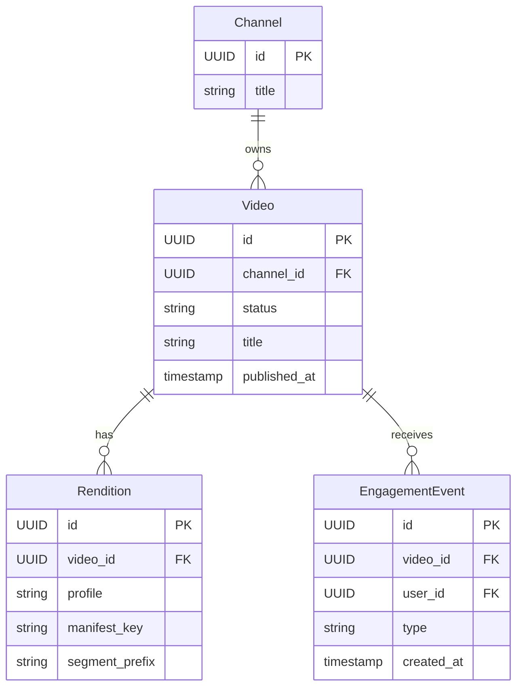
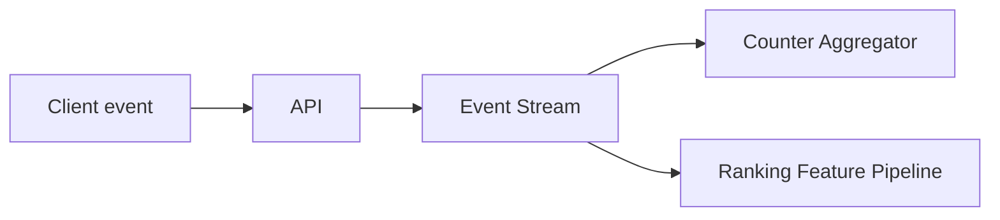

# API Design Walkthrough — YouTube

> Detailed API design for a video platform. Focus areas: upload-to-watchable path, playback manifests, engagement stream, and publish notification fanout.

---

## 1. Overview & Scope

### In Scope

| Capability | Critical? |
|------------|-----------|
| Upload init and ingest | Yes |
| Playback metadata retrieval | Yes |
| Engagement events | Yes |
| Publish notification fanout | Yes |
| Creator analytics | Secondary |
| Ad auction internals | Out of scope |

### Traffic Profile (assumed)

| Metric | Value |
|--------|-------|
| Peak upload init | ~5k rps |
| Peak playback metadata reads | ~80k rps |
| Peak engagement events | ~600k events/s |
| Manifest read SLO | p99 < 120 ms |

---

## 2. Data Model



---

## 3. Authentication

- OAuth2 for creator and user actions.
- Signed upload session tokens for blob ingest.
- Service auth between transcoder and metadata services.

---

## 4. Versioning Strategy

- /v1 for public API.
- Playback payload schema versioned for players.
- Backward-compatible default fields preserved.

---

## 5. Critical Path 1 — Upload Init and Ingest

### Endpoints

- POST /v1/videos/uploads:init
- PUT signed upload URL (object storage)

### Example Init Response

```json
{
  "video_id": "vid_88",
  "upload_url": "https://uploads.example.net/u/abc",
  "expires_in_s": 3600
}
```

### Flow

1. Validate creator scope.
2. Create video row with status=uploading.
3. Mint signed upload URL.
4. Client uploads media directly to object storage.
5. Ingest event triggers transcoding workflow.

---

## 6. Critical Path 2 — Playback Metadata Retrieval

### Endpoint

- GET /v1/videos/{video_id}/playback

### Example Response

```json
{
  "video_id": "vid_88",
  "status": "ready",
  "hls_manifest": "https://cdn.example.net/v/vid_88/master.m3u8",
  "dash_manifest": "https://cdn.example.net/v/vid_88/manifest.mpd"
}
```

### Latency Budget

| Stage | Budget |
|-------|--------|
| Auth + geo checks | 30 ms |
| Metadata cache read | 40 ms |
| Entitlement enrich | 30 ms |
| Total | 100 ms |

---

## 7. Critical Path 3 — Engagement Event Ingestion

### Endpoint

- POST /v1/videos/{video_id}/events

### Flow

1. Validate event schema and auth.
2. Append to event stream.
3. Async consumers update counters and rank features.



---

## 8. Critical Path 4 — Publish Notification Fanout

### Endpoint

- POST /v1/videos/{video_id}:publish

### Flow

1. Verify renditions complete.
2. Set status=published atomically.
3. Emit video_published event.
4. Fanout notifications to subscribers asynchronously.

---

## 9. Common API Concerns

### 9.1 Error Catalog (examples)

| HTTP | When | Retry? |
|------|------|--------|
| 400 | Invalid schema or missing required field | No |
| 401 | Missing or invalid token | No (refresh auth) |
| 403 | Scope/permission denied | No |
| 409 | Version conflict or stale cursor/seq | Retry after refetch |
| 422 | Business rule violation | No |
| 429 | Rate limit exceeded | Yes, with backoff |
| 500/503 | Transient internal/dependency error | Yes, exponential backoff |

Example error payload:

```json
{
  "type": "https://api.example.com/errors/rate-limit",
  "title": "Rate limit exceeded",
  "status": 429,
  "detail": "Too many requests for this token",
  "instance": "req_abc123"
}
```

### 9.2 Retry and Idempotency Matrix

| Operation type | Idempotency strategy | Safe retry policy |
|----------------|----------------------|-------------------|
| Playback session start | Idempotency-Key per device request | Retry on 5xx/timeout up to 2 times |
| Queue/home read | None required | Retry on transient 5xx with short capped backoff |
| Engagement event write | event_id dedupe in stream consumers | Client may retry once; backend dedupe handles duplicates |
| Publish/state transition | Idempotency-Key required | Retry with backoff; verify final status before repeat |
| Upload init/chunk commit | upload_session_id + offset checks | Retry failed chunk only; never replay committed offsets |


## 10. Design Decisions & Trade-offs

| Decision | Why | Trade-off |
|----------|-----|-----------|
| Direct-to-storage upload | Reduces API bandwidth | More client complexity |
| Async transcode workflow | Scales compute-heavy steps | Delayed readiness |
| Event stream for engagement | Decoupled analytics | Eventual counters |

---

## 11. System Bottlenecks & Scaling Triggers

### 11.1 Alert Thresholds (sample)

| Alert | Threshold | Action |
|-------|-----------|--------|
| Playback start p99 | > 400 ms for 10 min | prioritize session/auth lane, degrade non-critical enrichments |
| Playback error rate | > 1% for 5 min | fail over CDN/manifest route and trigger incident |
| CDN cache hit rate | < 90% for 15 min | prewarm hot assets and inspect cache key churn |
| Metadata/read API p99 | > 200 ms for 10 min | scale read replicas and cache tier |
| Processing queue lag (transcode/ranking) | > 5 min | autoscale workers and pause low-priority jobs |

## 12. Interview Summary

- Upload and playback are separate data planes.
- Publish must atomically gate watcher visibility.
- Engagement ingestion belongs to stream-first architecture.
