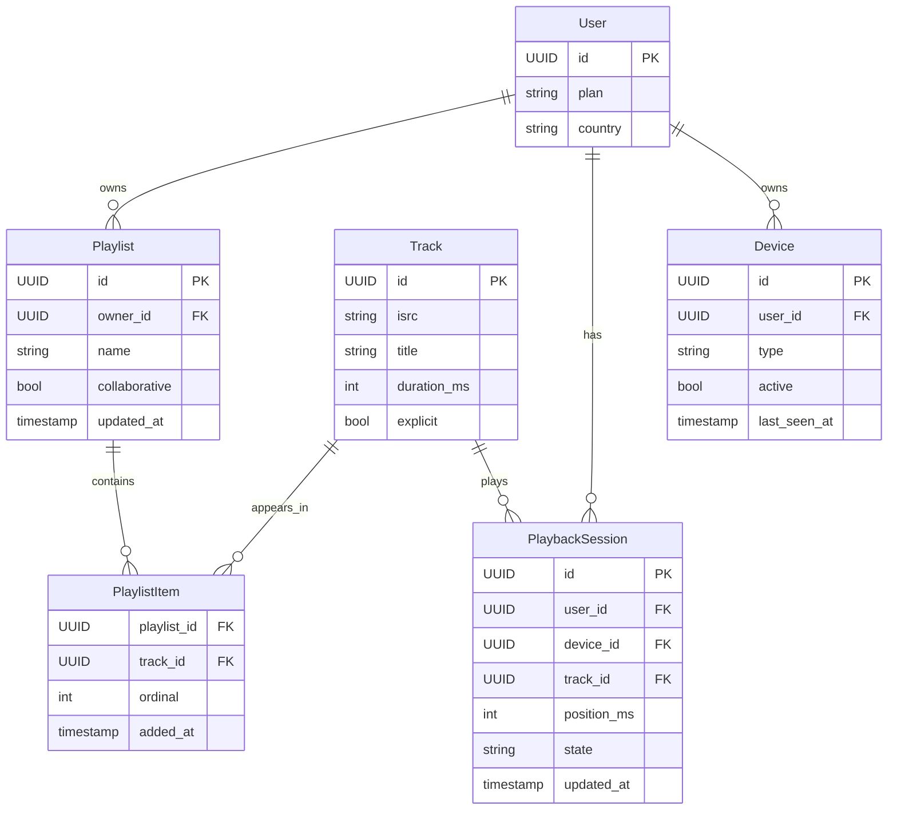
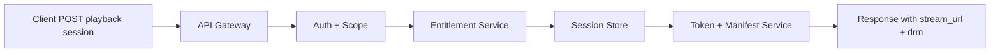
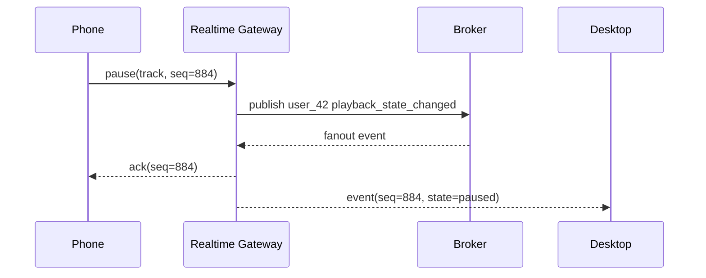

# API Design Walkthrough — Spotify

> Detailed API design for the critical paths of a music streaming platform. Focus areas: playback start, queue and catalog reads, cross-device sync, and playlist mutation with recommendation refresh.

---

## 1. Overview & Scope

### In Scope

| Capability | Critical? |
|------------|-----------|
| Playback session start | Yes |
| Queue and catalog retrieval | Yes |
| Multi-device playback sync | Yes |
| Playlist mutation and recommendation refresh | Yes |
| Search | Secondary |
| Artist payouts | Out of scope |

### Traffic Profile (assumed)

| Metric | Value |
|--------|-------|
| DAU | 250 M |
| Peak playback starts | ~45k rps |
| Peak queue reads | ~95k rps |
| Peak state-sync updates | ~180k events/s |
| Playback start SLO | p99 < 400 ms |
| Queue read SLO | p99 < 180 ms |

---

## 2. Data Model



### 2.1 Plain-English Terms

- Playback token: short-lived authorization for a device to fetch stream manifests.
- Queue snapshot: ordered list of upcoming tracks for a session.
- Device handoff: transfer of active playback from one device to another.
- Exactly-once mutation effect: retries do not duplicate playlist inserts.

---

## 3. Authentication

- OAuth2 bearer tokens for user-facing APIs.
- Playback token minted from user token and device id.
- Scopes:
  - playback:read
  - playback:write
  - playlist:read
  - playlist:write

---

## 4. Versioning Strategy

- URL major versioning: /v1.
- Additive fields are backward compatible.
- Breaking fields move to /v2 with deprecation headers.

---

## 5. Critical Path 1 — Playback Session Start

### Endpoint Contract

- POST /v1/playback/sessions

### Example Request

```json
{
  "device_id": "dev_9f2",
  "track_id": "trk_7ab",
  "start_position_ms": 0,
  "context": {
    "type": "playlist",
    "id": "pl_123"
  }
}
```

### Example Response

```json
{
  "session_id": "ps_9981",
  "stream_url": "https://cdn.example.net/manifest/ps_9981.m3u8",
  "drm": {
    "license_url": "https://license.example.net/v1/widevine",
    "expires_in_s": 300
  },
  "started_at": "2026-05-17T13:04:11Z"
}
```

### Internal Flow

1. Validate user token and playback:write scope.
2. Check device ownership and active session policy.
3. Resolve track availability by country and subscription plan.
4. Mint playback token and DRM claims.
5. Create PlaybackSession row and emit session_started event.
6. Return manifest and license endpoints.

### Playback Start Latency Budget

| Stage | Budget |
|-------|--------|
| Gateway + auth | 25 ms |
| Entitlement checks | 80 ms |
| Session write | 40 ms |
| Token/manifest generation | 120 ms |
| Network + serialization | 40 ms |
| Total | 305 ms |



---

## 6. Critical Path 2 — Queue and Catalog Retrieval

### Endpoint Contract

- GET /v1/playback/sessions/{session_id}/queue?cursor=...

### Example Response

```json
{
  "session_id": "ps_9981",
  "now_playing": {
    "track_id": "trk_7ab",
    "title": "Sunrise Echo",
    "position_ms": 14521
  },
  "items": [
    {"track_id": "trk_8cd", "title": "Evening Drive"},
    {"track_id": "trk_6ef", "title": "Blue Static"}
  ],
  "next_cursor": "q_cur_201"
}
```

### Internal Flow

1. Read session state from hot cache.
2. Fetch queue ids from session store.
3. Batch-resolve track metadata from catalog cache.
4. Return snapshot + cursor.

### Queue Read Latency Budget

| Stage | Budget |
|-------|--------|
| Auth | 20 ms |
| Session cache read | 35 ms |
| Catalog batch fetch | 85 ms |
| Response build | 25 ms |
| Total | 165 ms |

---

## 7. Critical Path 3 — Multi-device Playback Sync

### Endpoint Contract

- WS /v1/playback/realtime

### Event Types

- playback_state_changed
- queue_changed
- device_handoff

### Internal Flow

1. Device opens websocket with playback token.
2. Connection is keyed by user_id in realtime shard.
3. State changes publish to user:{id} channel.
4. All active devices receive ordered events.
5. Clients apply last-write-wins by event_seq.



---

## 8. Critical Path 4 — Playlist Mutation and Recommendation Refresh

### Endpoint Contract

- POST /v1/playlists/{playlist_id}/items
- Header: Idempotency-Key required

### Example Request

```json
{
  "track_ids": ["trk_4aa", "trk_4ab"],
  "insert_after_track_id": "trk_39z"
}
```

### Internal Flow

1. Validate playlist write permission.
2. Check Idempotency-Key store for replay.
3. Apply ordered insert in playlist_items.
4. Emit playlist_updated event.
5. Recommendation service refreshes user vectors asynchronously.

### Consistency

- Playlist order writes: strong within a playlist shard.
- Recommendation freshness: eventual, typically < 5 minutes.

---

## 9. Common API Concerns

### 9.1 Error Catalog (examples)

| HTTP | When | Retry? |
|------|------|--------|
| 400 | Invalid schema or missing required field | No |
| 401 | Missing or invalid token | No (refresh auth) |
| 403 | Scope/permission denied | No |
| 409 | Version conflict or stale cursor/seq | Retry after refetch |
| 422 | Business rule violation | No |
| 429 | Rate limit exceeded | Yes, with backoff |
| 500/503 | Transient internal/dependency error | Yes, exponential backoff |

Example error payload:

```json
{
  "type": "https://api.example.com/errors/rate-limit",
  "title": "Rate limit exceeded",
  "status": 429,
  "detail": "Too many requests for this token",
  "instance": "req_abc123"
}
```

### 9.2 Retry and Idempotency Matrix

| Operation type | Idempotency strategy | Safe retry policy |
|----------------|----------------------|-------------------|
| Playback session start | Idempotency-Key per device request | Retry on 5xx/timeout up to 2 times |
| Queue/home read | None required | Retry on transient 5xx with short capped backoff |
| Engagement event write | event_id dedupe in stream consumers | Client may retry once; backend dedupe handles duplicates |
| Publish/state transition | Idempotency-Key required | Retry with backoff; verify final status before repeat |
| Upload init/chunk commit | upload_session_id + offset checks | Retry failed chunk only; never replay committed offsets |


## 10. Design Decisions & Trade-offs

| Decision | Why | Trade-off |
|----------|-----|-----------|
| Realtime sync over websocket | Low-latency multi-device UX | Stateful connection infrastructure |
| Queue snapshot API | Simple client reconciliation | Slightly larger payloads |
| Async recommendation refresh | Keeps write path fast | Freshness lag |
| Country/plan entitlement checks in hot path | Rights correctness | Extra start latency |

---

## 11. System Bottlenecks & Scaling Triggers

### 11.1 Alert Thresholds (sample)

| Alert | Threshold | Action |
|-------|-----------|--------|
| Playback start p99 | > 400 ms for 10 min | prioritize session/auth lane, degrade non-critical enrichments |
| Playback error rate | > 1% for 5 min | fail over CDN/manifest route and trigger incident |
| CDN cache hit rate | < 90% for 15 min | prewarm hot assets and inspect cache key churn |
| Metadata/read API p99 | > 200 ms for 10 min | scale read replicas and cache tier |
| Processing queue lag (transcode/ranking) | > 5 min | autoscale workers and pause low-priority jobs |

## 12. Interview Summary

- Playback start is entitlement + token mint + session write.
- Queue reads must be cache-first and batch metadata fetches.
- Realtime sync should use ordered events and sequence reconciliation.
- Playlist writes should be idempotent and recommendation updates async.
