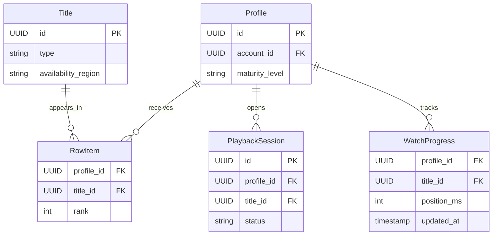

# API Design Walkthrough — Netflix

> Detailed API design for a video-on-demand platform. Focus areas: play authorization, home row retrieval, playback telemetry, and continue-watching sync.

---

## 1. Overview & Scope

### In Scope

| Capability | Critical? |
|------------|-----------|
| Play authorization | Yes |
| Home row retrieval | Yes |
| Playback telemetry ingest | Yes |
| Continue-watching progress sync | Yes |
| Search | Secondary |
| Content production tooling | Out of scope |

### Traffic Profile (assumed)

| Metric | Value |
|--------|-------|
| Peak home reads | ~120k rps |
| Peak playback starts | ~35k rps |
| Telemetry events | ~900k events/s |
| Home SLO | p99 < 250 ms |

---

## 2. Data Model



---

## 3. Authentication

- Account token + profile selection.
- Device attestation for DRM-capable clients.
- Region entitlement checks per title.

---

## 4. Versioning Strategy

- /v1 HTTP APIs.
- Player contract version in playback payload.
- Backward compatibility for at least two player generations.

---

## 5. Critical Path 1 — Play Authorization

### Endpoint

- POST /v1/playback/sessions

### Example Response

```json
{
  "session_id": "pbs_11",
  "drm_license_url": "https://license.example.net/widevine",
  "manifest_url": "https://cdn.example.net/t_778/master.m3u8",
  "expires_in_s": 600
}
```

### Flow

1. Validate account, profile, and maturity policy.
2. Validate region/license entitlement.
3. Create playback session.
4. Return DRM + manifest metadata.

---

## 6. Critical Path 2 — Home Row Retrieval

### Endpoint

- GET /v1/profiles/{profile_id}/home?cursor=...

### Latency Budget

| Stage | Budget |
|-------|--------|
| Auth/profile validation | 30 ms |
| Row candidate fetch | 90 ms |
| Metadata hydration | 70 ms |
| Serialize | 40 ms |
| Total | 230 ms |

---

## 7. Critical Path 3 — Playback Telemetry Ingestion

### Endpoint

- POST /v1/playback/sessions/{session_id}/events

### Flow

1. Ingest qos/heartbeat events.
2. Append to stream.
3. Aggregate QoE metrics and anomaly alerts.

---

## 8. Critical Path 4 — Continue-watching Progress Sync

### Endpoint

- PATCH /v1/playback/sessions/{session_id}/progress

### Example Request

```json
{"position_ms": 1422333, "completed": false}
```

### Flow

1. Validate monotonic progression.
2. Persist progress row.
3. Async update profile continue-watching row.

---

## 9. Common API Concerns

### 9.1 Error Catalog (examples)

| HTTP | When | Retry? |
|------|------|--------|
| 400 | Invalid schema or missing required field | No |
| 401 | Missing or invalid token | No (refresh auth) |
| 403 | Scope/permission denied | No |
| 409 | Version conflict or stale cursor/seq | Retry after refetch |
| 422 | Business rule violation | No |
| 429 | Rate limit exceeded | Yes, with backoff |
| 500/503 | Transient internal/dependency error | Yes, exponential backoff |

Example error payload:

```json
{
  "type": "https://api.example.com/errors/rate-limit",
  "title": "Rate limit exceeded",
  "status": 429,
  "detail": "Too many requests for this token",
  "instance": "req_abc123"
}
```

### 9.2 Retry and Idempotency Matrix

| Operation type | Idempotency strategy | Safe retry policy |
|----------------|----------------------|-------------------|
| Playback session start | Idempotency-Key per device request | Retry on 5xx/timeout up to 2 times |
| Queue/home read | None required | Retry on transient 5xx with short capped backoff |
| Engagement event write | event_id dedupe in stream consumers | Client may retry once; backend dedupe handles duplicates |
| Publish/state transition | Idempotency-Key required | Retry with backoff; verify final status before repeat |
| Upload init/chunk commit | upload_session_id + offset checks | Retry failed chunk only; never replay committed offsets |


## 10. Design Decisions & Trade-offs

| Decision | Why | Trade-off |
|----------|-----|-----------|
| Dedicated playback session object | Easier DRM/audit control | More state objects |
| Async telemetry pipeline | Protects serving latency | Eventual analytics |

---

## 11. System Bottlenecks & Scaling Triggers

### 11.1 Alert Thresholds (sample)

| Alert | Threshold | Action |
|-------|-----------|--------|
| Playback start p99 | > 400 ms for 10 min | prioritize session/auth lane, degrade non-critical enrichments |
| Playback error rate | > 1% for 5 min | fail over CDN/manifest route and trigger incident |
| CDN cache hit rate | < 90% for 15 min | prewarm hot assets and inspect cache key churn |
| Metadata/read API p99 | > 200 ms for 10 min | scale read replicas and cache tier |
| Processing queue lag (transcode/ranking) | > 5 min | autoscale workers and pause low-priority jobs |

## 12. Interview Summary

- Play path is entitlement + DRM + manifest.
- Home retrieval latency dominates perceived responsiveness.
- Progress sync should be monotonic and cheap.
