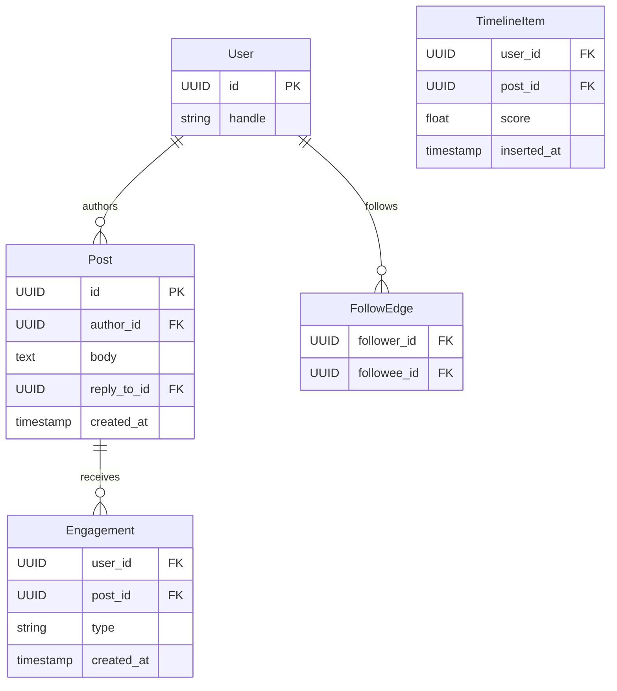

# API Design Walkthrough — Twitter/X

> Detailed API design for a social feed platform. Focus areas: post publish, home timeline retrieval, realtime notifications, and engagement writes.

---

## 1. Overview & Scope

### In Scope

| Capability | Critical? |
|------------|-----------|
| Post publish | Yes |
| Home timeline retrieval | Yes |
| Realtime notifications | Yes |
| Like/repost/reply writes | Yes |
| Search/trends | Secondary |
| Ads auction internals | Out of scope |

### Traffic Profile (assumed)

| Metric | Value |
|--------|-------|
| Peak post creates | ~35k rps |
| Peak timeline reads | ~180k rps |
| Peak notification fanout | ~2M events/s |
| Timeline SLO | p99 < 220 ms |

---

## 2. Data Model



---

## 3. Authentication

- OAuth2 bearer tokens.
- Per-action scope checks (post.write, like.write).
- Anti-abuse risk scoring at gateway.

---

## 4. Versioning Strategy

- /v1 versioned REST.
- Optional GraphQL for dynamic client surfaces.
- Event payload versioning for realtime streams.

---

## 5. Critical Path 1 — Post Publish

### Endpoint

- POST /v1/posts
- Header: Idempotency-Key

### Example Request

```json
{"text": "Shipping the new feed service today.", "reply_to_post_id": null}
```

### Flow

1. Validate auth and abuse checks.
2. Dedupe by idempotency key.
3. Persist post.
4. Emit post_created event for fanout/ranking.

---

## 6. Critical Path 2 — Home Timeline Retrieval

### Endpoint

- GET /v1/timeline/home?cursor=...

### Flow

1. Generate candidate set from follow graph + explore pool.
2. Score candidates.
3. Apply diversity/freshness constraints.
4. Return top-N with cursor.

### Latency Budget

| Stage | Budget |
|-------|--------|
| Auth | 20 ms |
| Candidate generation | 70 ms |
| Ranking + filters | 90 ms |
| Serialization | 25 ms |
| Total | 205 ms |

---

## 7. Critical Path 3 — Realtime Notifications

### Endpoint

- WS /v1/notifications/realtime

### Flow

1. Subscribe by user_id channel.
2. Fanout mentions/replies/likes events.
3. Coalesce noisy events for burst control.

---

## 8. Critical Path 4 — Engagement Writes

### Endpoints

- POST /v1/posts/{post_id}/likes
- POST /v1/posts/{post_id}/reposts

### Flow

1. Upsert engagement row idempotently.
2. Publish engagement event.
3. Async update counters and rank features.

---

## 9. Common API Concerns

### 9.1 Error Catalog (examples)

| HTTP | When | Retry? |
|------|------|--------|
| 400 | Invalid schema or missing required field | No |
| 401 | Missing or invalid token | No (refresh auth) |
| 403 | Scope/permission denied | No |
| 409 | Version conflict or stale cursor/seq | Retry after refetch |
| 422 | Business rule violation | No |
| 429 | Rate limit exceeded | Yes, with backoff |
| 500/503 | Transient internal/dependency error | Yes, exponential backoff |

Example error payload:

```json
{
  "type": "https://api.example.com/errors/rate-limit",
  "title": "Rate limit exceeded",
  "status": 429,
  "detail": "Too many requests for this token",
  "instance": "req_abc123"
}
```

### 9.2 Retry and Idempotency Matrix

| Operation type | Idempotency strategy | Safe retry policy |
|----------------|----------------------|-------------------|
| Post publish | Idempotency-Key per post intent | Retry timeout/5xx with same key only |
| Engagement write (like/repost) | upsert unique (user_id, post_id, type) | Safe to retry; operation remains idempotent |
| Timeline read | None required | Retry transient 5xx with short backoff |
| Notification dispatch | notification_id dedupe | At-least-once with retry + TTL |
| Fanout batch | fanout_job_id checkpointing | Resume from checkpoint; avoid full replay |


## 10. Design Decisions & Trade-offs

| Decision | Why | Trade-off |
|----------|-----|-----------|
| Hybrid fanout strategy | Handles celebrity accounts | More serving complexity |
| Async counter updates | Fast write path | Counter staleness |

---

## 11. System Bottlenecks & Scaling Triggers

### 11.1 Alert Thresholds (sample)

| Alert | Threshold | Action |
|-------|-----------|--------|
| Timeline read p99 | > 220 ms for 10 min | simplify ranker features and increase cache reliance |
| Fanout queue lag | > 5 s | autoscale fanout workers and split hot keys |
| Post publish 5xx rate | > 1% for 5 min | rollback recent deploy and activate write-safemode |
| Notification dispatch lag | > 2 s | batch low-priority alerts and scale dispatch plane |
| Abuse filter false-positive spike | > 2x baseline for 15 min | switch to conservative policy profile |

## 12. Interview Summary

- Timeline is primarily candidate generation + ranking.
- Writes should stay cheap; fanout/counters happen async.
- Realtime notifications are a separate delivery lane.
