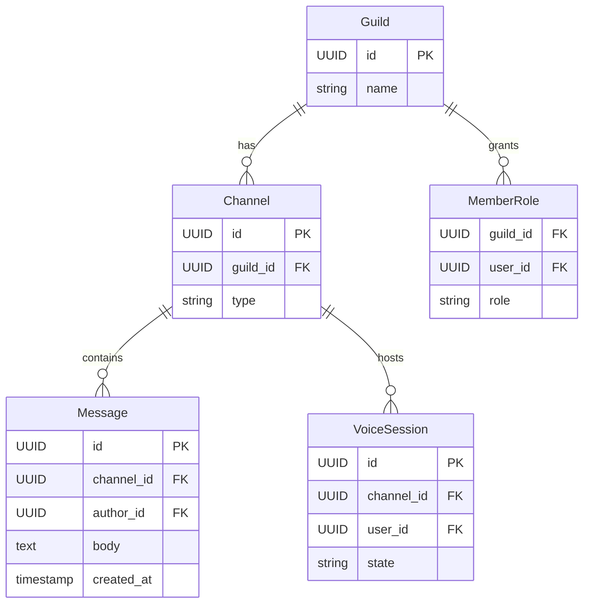
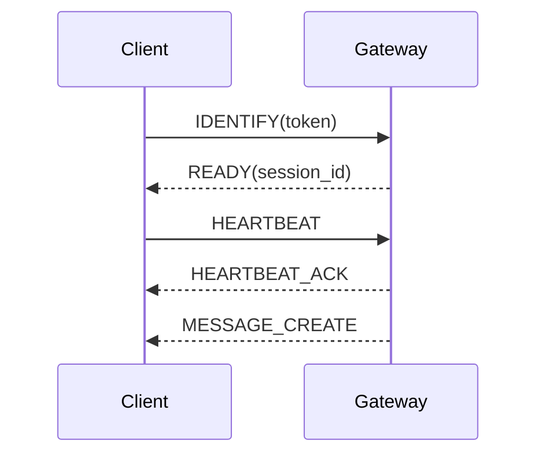

# API Design Walkthrough — Discord

> Detailed API design for community chat. Focus areas: channel message send, history retrieval, gateway event stream, and voice signaling setup.

---

## 1. Overview & Scope

### In Scope

| Capability | Critical? |
|------------|-----------|
| Channel message send | Yes |
| Channel history retrieval | Yes |
| Gateway realtime events | Yes |
| Voice signaling setup | Yes |
| File uploads | Secondary |
| Moderation ML internals | Out of scope |

### Traffic Profile (assumed)

| Metric | Value |
|--------|-------|
| Peak message sends | ~140k msg/s |
| Peak gateway connections | ~40M concurrent |
| Peak voice joins | ~20k rps |
| Message fanout SLO | p99 < 250 ms |

---

## 2. Data Model



---

## 3. Authentication

- User tokens for REST and gateway handshake.
- Guild/channel permission resolution per action.
- Voice signaling tokens scoped by channel + ttl.

---

## 4. Versioning Strategy

- /v1 REST APIs.
- Gateway opcode/event version in handshake.
- Backward compatibility maintained for client release windows.

---

## 5. Critical Path 1 — Channel Message Send

### Endpoint

- POST /v1/channels/{channel_id}/messages

### Example Request

```json
{"content": "Deploy is done", "nonce": "n_9981"}
```

### Flow

1. Check membership and channel send permissions.
2. Dedupe nonce.
3. Persist message and assign sequence.
4. Emit gateway dispatch event.

---

## 6. Critical Path 2 — Channel History Retrieval

### Endpoint

- GET /v1/channels/{channel_id}/messages?before=...&limit=50

### Flow

1. Validate read access.
2. Query message index by channel + cursor.
3. Return descending page with next cursor.

---

## 7. Critical Path 3 — Gateway Realtime Events

### Endpoint

- WS /v1/gateway

### Flow

1. Client identifies and resumes session.
2. Gateway dispatches events by subscribed guild shards.
3. Heartbeat + ack keeps session healthy.



---

## 8. Critical Path 4 — Voice Signaling Setup

### Endpoint

- POST /v1/channels/{channel_id}/voice-sessions

### Flow

1. Validate voice permissions.
2. Allocate regional voice relay.
3. Return signaling endpoint and session token.

---

## 9. Common API Concerns

### 9.1 Error Catalog (examples)

| HTTP | When | Retry? |
|------|------|--------|
| 400 | Invalid schema or missing required field | No |
| 401 | Missing or invalid token | No (refresh auth) |
| 403 | Scope/permission denied | No |
| 409 | Version conflict or stale cursor/seq | Retry after refetch |
| 422 | Business rule violation | No |
| 429 | Rate limit exceeded | Yes, with backoff |
| 500/503 | Transient internal/dependency error | Yes, exponential backoff |

Example error payload:

```json
{
  "type": "https://api.example.com/errors/rate-limit",
  "title": "Rate limit exceeded",
  "status": 429,
  "detail": "Too many requests for this token",
  "instance": "req_abc123"
}
```

### 9.2 Retry and Idempotency Matrix

| Operation type | Idempotency strategy | Safe retry policy |
|----------------|----------------------|-------------------|
| Realtime op submit | client_op_id or nonce per channel/file | Retry only on timeout; refetch latest seq before resend |
| Message/edit write | Idempotency-Key or client_msg_id | Exponential backoff with jitter, max 3 attempts |
| Presence update | None (ephemeral) | Best-effort, do not retry aggressively |
| Reconnect/resume | Session resume token | Immediate resume once, then backoff (1s, 2s, 5s...) |
| Webhook/app callback delivery | event_id dedupe on receiver | At-least-once with exponential backoff + DLQ |


## 10. Design Decisions & Trade-offs

| Decision | Why | Trade-off |
|----------|-----|-----------|
| Separate gateway from REST | Clear control vs realtime lanes | More infrastructure surfaces |
| Shard by guild | Locality and scale | Uneven shard hotspots |

---

## 11. System Bottlenecks & Scaling Triggers

### 11.1 Alert Thresholds (sample)

| Alert | Threshold | Action |
|-------|-----------|--------|
| Realtime op/event p99 | > 250 ms for 10 min | scale gateway shards, reduce non-critical fanout |
| Reconnect storm | > 8% connections/min | enforce jittered reconnect, temporary admission control |
| Dropped realtime frames | > 1% for 5 min | increase buffers, backpressure low-priority streams |
| Gateway file descriptor usage | > 80% for 10 min | add instances, rebalance sticky sessions |
| Fanout queue lag | > 60 s | autoscale workers and inspect hot partition |

## 12. Interview Summary

- REST handles history/control; gateway handles live events.
- Session resume is critical at large connection counts.
- Voice signaling should be isolated from text message path.
