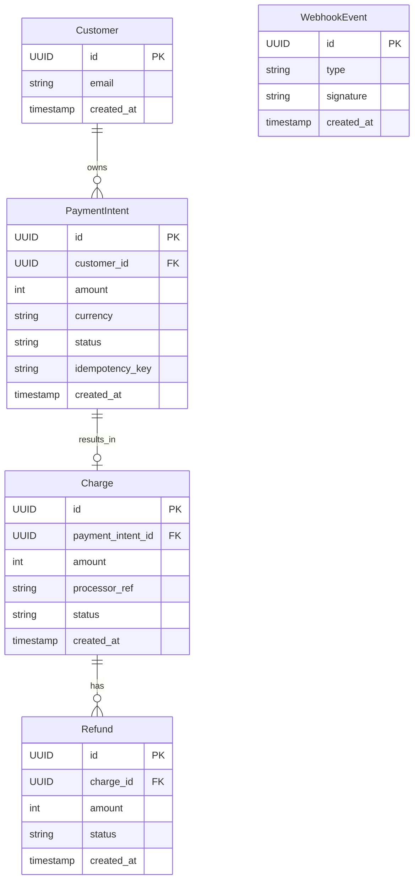
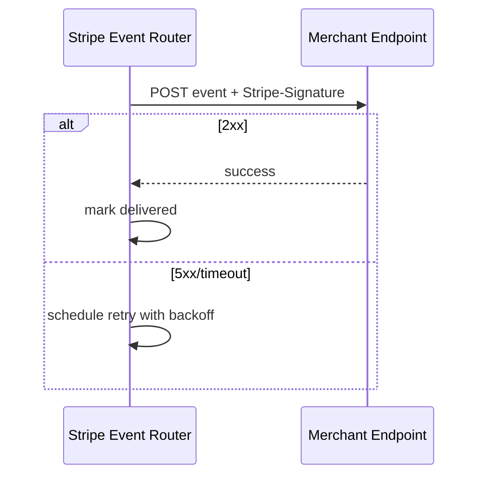

# API Design Walkthrough — Stripe

> Detailed API design for the critical paths of a payments platform. Focus areas: payment intent lifecycle, idempotent writes, webhook delivery, and reconciliation correctness.

---

## 1. Overview & Scope

### In Scope

| Capability | Critical? |
|------------|-----------|
| PaymentIntent create/confirm | Yes |
| Payment status retrieval | Yes |
| Webhook event delivery | Yes |
| Refund and reconciliation | Yes |
| Dashboard analytics | Secondary |
| Card network settlement internals | Out of scope |

### Traffic Profile (assumed)

| Metric | Value |
|--------|-------|
| Peak intent create | ~22k rps |
| Peak confirm attempts | ~18k rps |
| Webhook deliveries | ~60k events/s |
| Create/confirm SLO | p99 < 900 ms |

---

## 2. Data Model



### 2.1 Plain-English Terms

- PaymentIntent: state machine that tracks one payment attempt.
- Idempotency key: client-generated key to make retries safe.
- Webhook signature: HMAC proof that event came from Stripe.
- Reconciliation: ledger consistency check between internal records and processor truth.

---

## 3. Authentication

- Bearer keys for API clients.
- Restricted keys with endpoint scopes for server-side use.
- mTLS for processor/internal services.

---

## 4. Versioning Strategy

- Date-based API version pinning per account.
- Response includes Stripe-Version header.
- New versions are opt-in until account migration.

---

## 5. Critical Path 1 — PaymentIntent Create and Confirm

### Endpoint Contracts

- POST /v1/payment_intents
- POST /v1/payment_intents/{id}/confirm
- Header: Idempotency-Key required for both

### Example Create Request

```json
{
  "amount": 2599,
  "currency": "usd",
  "customer": "cus_123",
  "payment_method": "pm_789",
  "confirm": false
}
```

### Example Confirm Response

```json
{
  "id": "pi_abc",
  "status": "requires_action",
  "next_action": {
    "type": "use_stripe_sdk",
    "client_secret": "pi_abc_secret"
  }
}
```

### Internal Flow

1. Validate API key scope and merchant account state.
2. Check idempotency store; return prior object on duplicate.
3. Create or load PaymentIntent state machine record.
4. Call processor for auth/capture or challenge.
5. Persist transition and emit payment_intent.* events.

### Latency Budget (create/confirm)

| Stage | Budget |
|-------|--------|
| Gateway + auth | 30 ms |
| Idempotency + intent store | 60 ms |
| Processor round trip | 650 ms |
| Event persist + response | 90 ms |
| Total | 830 ms |


---

## 6. Critical Path 2 — Payment Status Retrieval

### Endpoint Contract

- GET /v1/payment_intents/{id}

### Internal Flow

1. Read latest intent state.
2. If in pending_async status, enrich from processor cache.
3. Return normalized state and next_action if needed.

### Read Latency Budget

| Stage | Budget |
|-------|--------|
| Auth | 25 ms |
| Intent read | 55 ms |
| Enrichment | 70 ms |
| Serialization | 20 ms |
| Total | 170 ms |

---

## 7. Critical Path 3 — Webhook Event Delivery

### Endpoint Contract

- POST merchant webhook endpoint (outbound from Stripe)

### Delivery Semantics

- At-least-once delivery.
- Exponential backoff retries for non-2xx.
- Signed payload with timestamp tolerance window.

### Internal Flow

1. Event router selects subscribed endpoints.
2. Sign payload with endpoint secret.
3. Attempt delivery and store attempt result.
4. Retry until success or terminal retry budget.



---

## 8. Critical Path 4 — Refund and Reconciliation

### Endpoint Contract

- POST /v1/refunds

### Example Request

```json
{
  "charge": "ch_456",
  "amount": 1200,
  "reason": "requested_by_customer"
}
```

### Internal Flow

1. Validate charge status and refundable balance.
2. Create Refund record idempotently.
3. Submit processor refund request.
4. Update internal ledger entries.
5. Reconciliation job verifies processor settlement later.

### Consistency

- Ledger writes are strong and append-only.
- External settlement confirmation is eventual.

---

## 9. Common API Concerns

### 9.1 Error Catalog (examples)

| HTTP | When | Retry? |
|------|------|--------|
| 400 | Invalid schema or missing required field | No |
| 401 | Missing or invalid token | No (refresh auth) |
| 403 | Scope/permission denied | No |
| 409 | Version conflict or stale cursor/seq | Retry after refetch |
| 422 | Business rule violation | No |
| 429 | Rate limit exceeded | Yes, with backoff |
| 500/503 | Transient internal/dependency error | Yes, exponential backoff |

Example error payload:

```json
{
  "type": "https://api.example.com/errors/rate-limit",
  "title": "Rate limit exceeded",
  "status": 429,
  "detail": "Too many requests for this token",
  "instance": "req_abc123"
}
```

### 9.2 Retry and Idempotency Matrix

| Operation type | Idempotency strategy | Safe retry policy |
|----------------|----------------------|-------------------|
| PaymentIntent create/confirm | Mandatory Idempotency-Key | Retry on timeout/5xx for up to 24h using same key |
| Refund create | Mandatory Idempotency-Key | Retry on timeout/5xx only; never retry with new key blindly |
| GET payment status | None required | Retry on transient 5xx with capped backoff |
| Webhook delivery | event_id + signature timestamp verification | At-least-once delivery with exponential backoff + DLQ |
| Reconciliation jobs | deterministic job run id | Retry failed batch step; do not duplicate ledger writes |


## 10. Design Decisions & Trade-offs

| Decision | Why | Trade-off |
|----------|-----|-----------|
| Intent state machine | Handles async payment flows | More states to reason about |
| At-least-once webhooks | Better delivery durability | Merchant dedupe required |
| Append-only ledger | Auditability | Storage growth |
| Processor abstraction | Multi-provider support | Adapter complexity |

---

## 11. System Bottlenecks & Scaling Triggers

### 11.1 Alert Thresholds (sample)

| Alert | Threshold | Action |
|-------|-----------|--------|
| Create/confirm p99 | > 900 ms for 10 min | route to backup processor and shed optional enrichments |
| Processor timeout rate | > 3% for 5 min | open circuit breaker, switch provider route |
| Webhook retry backlog | > 2 min | autoscale delivery workers and inspect failing endpoints |
| Idempotency store p99 | > 100 ms for 10 min | rebalance key partitions, enable hot-key protection |
| Ledger reconciliation drift | non-zero in 2 consecutive runs | freeze risky payouts and trigger incident response |

## 12. Interview Summary

- PaymentIntent is the core state machine abstraction.
- Idempotency is mandatory for safe monetary retries.
- Webhooks are at-least-once and must be signed + deduped.
- Reconciliation closes the loop between internal and processor truth.
