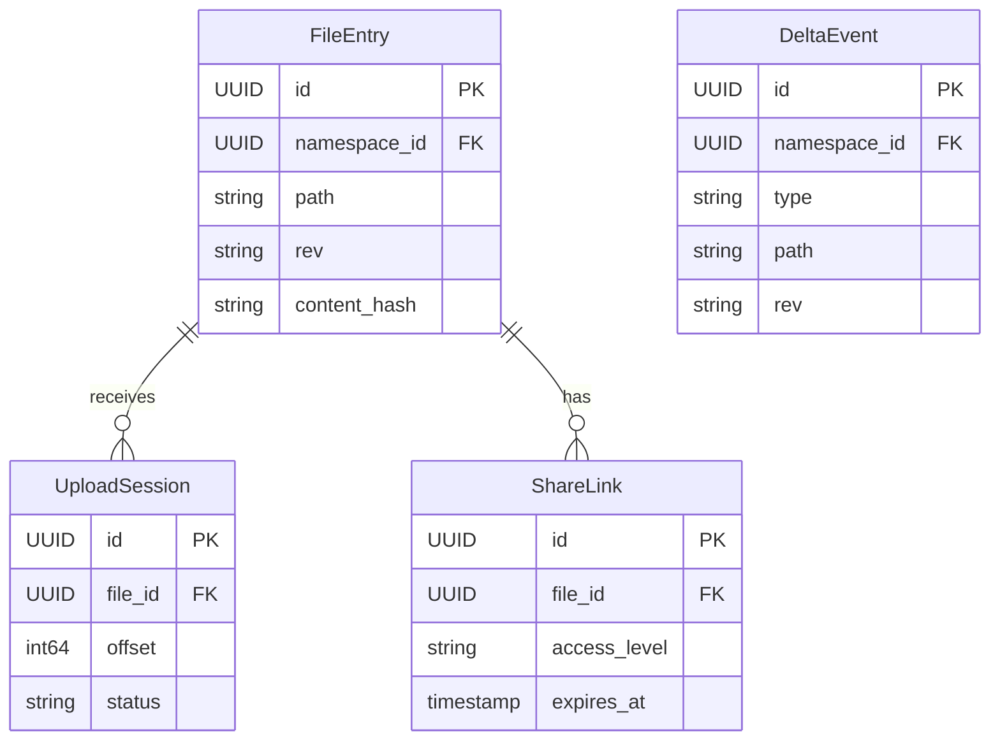

# API Design Walkthrough — Dropbox

> Detailed API design for cloud file sync. Focus areas: resumable uploads, delta sync reads, long-poll change notification, and sharing updates.

---

## 1. Overview & Scope

### In Scope

| Capability | Critical? |
|------------|-----------|
| Resumable upload | Yes |
| Delta sync retrieval | Yes |
| Long-poll change wait | Yes |
| Sharing permission updates | Yes |
| OCR/search | Secondary |
| Compliance archive internals | Out of scope |

### Traffic Profile (assumed)

| Metric | Value |
|--------|-------|
| Peak upload sessions | ~8k rps |
| Peak delta reads | ~70k rps |
| Long-poll waits | ~6M concurrent |
| Delta read SLO | p99 < 220 ms |

---

## 2. Data Model



---

## 3. Authentication

- OAuth2 user and app tokens.
- Namespace-scoped permission checks.
- Team tokens for enterprise admin operations.

---

## 4. Versioning Strategy

- /v1 stable endpoints.
- Cursor format opaque and versioned server-side.
- Additive metadata fields preferred.

---

## 5. Critical Path 1 — Resumable Upload

### Endpoints

- POST /v1/files/upload_session/start
- POST /v1/files/upload_session/append
- POST /v1/files/upload_session/finish

### Flow

1. Start session returns session_id.
2. Append validates offset and chunk hash.
3. Finish commits metadata + content hash.
4. Emit delta event for sync clients.

---

## 6. Critical Path 2 — Delta Sync Retrieval

### Endpoint

- POST /v1/files/list_folder/continue

### Example Response

```json
{
  "entries": [{"path": "/docs/spec.md", "rev": "a9b2"}],
  "cursor": "cur_551",
  "has_more": false
}
```

### Latency Budget

| Stage | Budget |
|-------|--------|
| Auth | 30 ms |
| Cursor read | 40 ms |
| Delta query | 110 ms |
| Total | 180 ms |

---

## 7. Critical Path 3 — Long-poll Change Wait

### Endpoint

- POST /v1/files/list_folder/longpoll

### Flow

1. Client sends cursor.
2. Server blocks up to timeout.
3. Responds with changes=true on new events.

---

## 8. Critical Path 4 — Sharing Permission Updates

### Endpoint

- POST /v1/sharing/permissions:update

### Flow

1. Validate ownership/admin rights.
2. Update ACL metadata.
3. Emit share_permission_changed event.

---

## 9. Common API Concerns

### 9.1 Error Catalog (examples)

| HTTP | When | Retry? |
|------|------|--------|
| 400 | Invalid schema or missing required field | No |
| 401 | Missing or invalid token | No (refresh auth) |
| 403 | Scope/permission denied | No |
| 409 | Version conflict or stale cursor/seq | Retry after refetch |
| 422 | Business rule violation | No |
| 429 | Rate limit exceeded | Yes, with backoff |
| 500/503 | Transient internal/dependency error | Yes, exponential backoff |

Example error payload:

```json
{
  "type": "https://api.example.com/errors/rate-limit",
  "title": "Rate limit exceeded",
  "status": 429,
  "detail": "Too many requests for this token",
  "instance": "req_abc123"
}
```

### 9.2 Retry and Idempotency Matrix

| Operation type | Idempotency strategy | Safe retry policy |
|----------------|----------------------|-------------------|
| Upload session start | upload_session_id uniqueness | Retry start only if no session returned |
| Chunk append | strict offset + session_id | Retry same chunk at same offset only |
| Upload finish | commit token / revision precondition | Retry with same commit token and verify resulting rev |
| Delta/list reads | cursor token | Retry transient failures; refresh cursor on invalidation |
| Share permission update | idempotent ACL set semantics | Retry on 5xx; re-read ACL before retrying |


## 10. Design Decisions & Trade-offs

| Decision | Why | Trade-off |
|----------|-----|-----------|
| Metadata/blob split | Better scale and cost | Coordination complexity |
| Long-poll for sync | Simple client model | Many open requests |

---

## 11. System Bottlenecks & Scaling Triggers

### 11.1 Alert Thresholds (sample)

| Alert | Threshold | Action |
|-------|-----------|--------|
| Delta sync p99 | > 220 ms for 10 min | scale index readers and warm namespace cache |
| Long-poll connection saturation | > 85% for 10 min | add wait nodes and reduce timeout window temporarily |
| Upload retry rate | > 3% for 10 min | inspect chunk integrity and storage path health |
| Namespace lock wait p99 | > 100 ms | repartition hot namespaces |
| Cursor invalidation errors | > 0.5% for 10 min | trigger cursor regeneration fallback |

## 12. Interview Summary

- Sync systems are cursor + delta logs at their core.
- Resumable upload needs strict offset/idempotency semantics.
- Long-poll is practical for massive sync clients.
