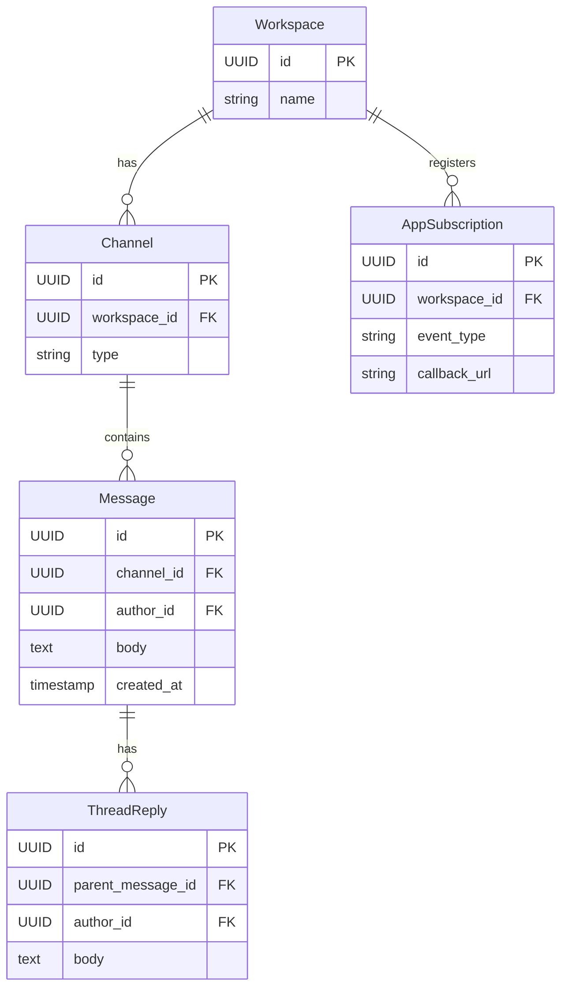

# API Design Walkthrough — Slack

> Detailed API design for team collaboration messaging. Focus areas: channel message publish, history retrieval, realtime events, and app webhook/event delivery.

---

## 1. Overview & Scope

### In Scope

| Capability | Critical? |
|------------|-----------|
| Channel message publish | Yes |
| Conversation history retrieval | Yes |
| Realtime workspace events | Yes |
| App event/webhook delivery | Yes |
| Search | Secondary |
| Billing internals | Out of scope |

### Traffic Profile (assumed)

| Metric | Value |
|--------|-------|
| Peak message writes | ~90k msg/s |
| Peak history reads | ~110k rps |
| Event deliveries | ~700k events/s |
| Message fanout SLO | p99 < 280 ms |

---

## 2. Data Model



---

## 3. Authentication

- User OAuth tokens and bot tokens.
- Workspace + channel membership checks.
- App-level signature verification for callbacks.

---

## 4. Versioning Strategy

- /v1 REST contracts.
- Event envelope version in realtime and webhooks.
- Deprecation notices in response headers.

---

## 5. Critical Path 1 — Channel Message Publish

### Endpoint

- POST /v1/chat.postMessage

### Example Request

```json
{"channel_id": "C123", "text": "Deploy complete", "client_msg_id": "cm_77"}
```

### Flow

1. Validate token and channel permission.
2. Dedupe by client_msg_id.
3. Persist message.
4. Emit channel event to realtime gateway and app subscriptions.

---

## 6. Critical Path 2 — Conversation History Retrieval

### Endpoint

- GET /v1/conversations.history?channel_id=...&cursor=...

### Flow

1. ACL validation.
2. Cursor-based page read from message index.
3. Return messages + next_cursor.

---

## 7. Critical Path 3 — Realtime Workspace Events

### Endpoint

- WS /v1/realtime

### Flow

1. Client opens session and subscribes channels.
2. Gateway dispatches message/thread/mention events.
3. Keepalive + resume token for reconnect.

---

## 8. Critical Path 4 — App Event/Webhook Delivery

### Endpoint

- Outbound POST to app callback_url

### Flow

1. Build signed event payload.
2. Deliver with retries and backoff.
3. Mark delivered or send to DLQ after retry budget.

---

## 9. Common API Concerns

### 9.1 Error Catalog (examples)

| HTTP | When | Retry? |
|------|------|--------|
| 400 | Invalid schema or missing required field | No |
| 401 | Missing or invalid token | No (refresh auth) |
| 403 | Scope/permission denied | No |
| 409 | Version conflict or stale cursor/seq | Retry after refetch |
| 422 | Business rule violation | No |
| 429 | Rate limit exceeded | Yes, with backoff |
| 500/503 | Transient internal/dependency error | Yes, exponential backoff |

Example error payload:

```json
{
  "type": "https://api.example.com/errors/rate-limit",
  "title": "Rate limit exceeded",
  "status": 429,
  "detail": "Too many requests for this token",
  "instance": "req_abc123"
}
```

### 9.2 Retry and Idempotency Matrix

| Operation type | Idempotency strategy | Safe retry policy |
|----------------|----------------------|-------------------|
| Realtime op submit | client_op_id or nonce per channel/file | Retry only on timeout; refetch latest seq before resend |
| Message/edit write | Idempotency-Key or client_msg_id | Exponential backoff with jitter, max 3 attempts |
| Presence update | None (ephemeral) | Best-effort, do not retry aggressively |
| Reconnect/resume | Session resume token | Immediate resume once, then backoff (1s, 2s, 5s...) |
| Webhook/app callback delivery | event_id dedupe on receiver | At-least-once with exponential backoff + DLQ |


## 10. Design Decisions & Trade-offs

| Decision | Why | Trade-off |
|----------|-----|-----------|
| Tenant isolation by workspace | Security + noisy-neighbor control | Operational partition complexity |
| Async app events | Protects chat path | Eventual app visibility |

---

## 11. System Bottlenecks & Scaling Triggers

### 11.1 Alert Thresholds (sample)

| Alert | Threshold | Action |
|-------|-----------|--------|
| Realtime op/event p99 | > 250 ms for 10 min | scale gateway shards, reduce non-critical fanout |
| Reconnect storm | > 8% connections/min | enforce jittered reconnect, temporary admission control |
| Dropped realtime frames | > 1% for 5 min | increase buffers, backpressure low-priority streams |
| Gateway file descriptor usage | > 80% for 10 min | add instances, rebalance sticky sessions |
| Fanout queue lag | > 60 s | autoscale workers and inspect hot partition |

## 12. Interview Summary

- Keep chat write path simple and idempotent.
- Realtime and app-event delivery should be separate lanes.
- Workspace partitioning is key for multi-tenant scale.
