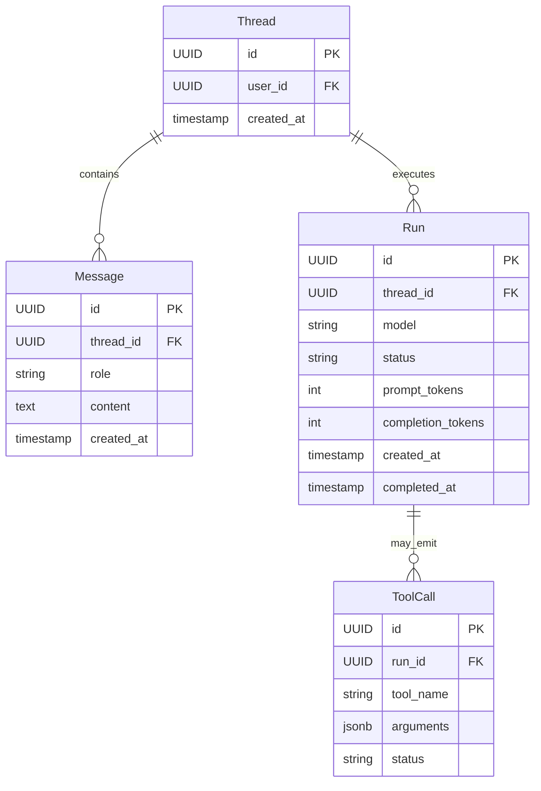
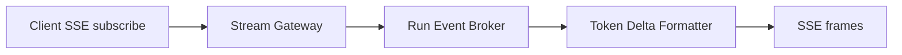

# API Design Walkthrough — ChatGPT

> Detailed API design for a conversational AI platform. Focus areas: run creation, run retrieval, token streaming, and tool-call orchestration.

---

## 1. Overview & Scope

### In Scope

| Capability | Critical? |
|------------|-----------|
| Run creation for a thread | Yes |
| Run status retrieval | Yes |
| SSE token streaming | Yes |
| Tool-call completion loop | Yes |
| Fine-tuning jobs | Secondary |
| Billing internals | Out of scope |

### Traffic Profile (assumed)

| Metric | Value |
|--------|-------|
| Peak run creates | ~30k rps |
| Peak stream connections | ~1.2M concurrent |
| Peak tool callbacks | ~90k events/s |
| First-token SLO | p99 < 1.8 s |

---

## 2. Data Model



### 2.1 Plain-English Terms

- Run: one model execution over a thread snapshot.
- First-token latency: time from request acceptance to first streamed token.
- Tool call: model asks backend to execute a function with JSON args.
- Resume token: marker to continue streaming after reconnect.

---

## 3. Authentication

- API key or OAuth token per workspace/user.
- Model-level access control and quota checks.
- Signed callback token for tool result submission.

---

## 4. Versioning Strategy

- /v1 stable resources: threads, messages, runs.
- Model upgrades are additive unless response contract changes.
- Event schema version field in streaming payloads.

---

## 5. Critical Path 1 — Run Creation

### Endpoint Contract

- POST /v1/threads/{thread_id}/runs

### Example Request

```json
{
  "model": "gpt-4.2",
  "instructions": "Be concise",
  "tools": [
    {"type": "function", "name": "get_weather"}
  ]
}
```

### Example Response

```json
{
  "id": "run_91",
  "thread_id": "thr_22",
  "status": "queued",
  "created_at": "2026-05-17T14:18:00Z"
}
```

### Internal Flow

1. Validate auth and quota.
2. Snapshot thread messages and system instructions.
3. Build prompt package and safety precheck.
4. Enqueue run to model scheduler.
5. Return queued/in_progress state.

### Latency Budget

| Stage | Budget |
|-------|--------|
| Auth + quota | 40 ms |
| Thread snapshot | 120 ms |
| Prompt build + safety | 250 ms |
| Scheduler enqueue | 80 ms |
| Total | 490 ms |

---

## 6. Critical Path 2 — Run Status Retrieval

### Endpoint Contract

- GET /v1/threads/{thread_id}/runs/{run_id}

### Internal Flow

1. Read run state from run store.
2. If streaming active, include latest offset.
3. Return status, usage, and incomplete details if any.

### Read Latency Budget

| Stage | Budget |
|-------|--------|
| Auth | 25 ms |
| Run store read | 55 ms |
| Usage aggregation | 60 ms |
| Total | 140 ms |

---

## 7. Critical Path 3 — SSE Token Streaming

### Endpoint Contract

- GET /v1/threads/{thread_id}/runs/{run_id}/events
- Content-Type: text/event-stream

### Example Stream Frames

```text
event: delta
data: {"index": 1, "text": "Hello"}

event: delta
data: {"index": 2, "text": " world"}

event: done
data: {"finish_reason": "stop"}
```

### Internal Flow

1. Client subscribes with run id and auth.
2. Stream service reads model tokens from broker.
3. Tokens are batched into SSE delta events.
4. Keep-alive comments prevent proxy idle closes.



---

## 8. Critical Path 4 — Tool-call Completion Loop

### Endpoint Contracts

- Tool call emitted in run events.
- POST /v1/threads/{thread_id}/runs/{run_id}/tool_outputs

### Example Tool Output Submission

```json
{
  "tool_call_id": "tc_42",
  "output": "{\"temp_c\": 21, \"condition\": \"clear\"}"
}
```

### Internal Flow

1. Model emits requires_action with tool_call payload.
2. Client/backend executes tool externally.
3. Tool output is posted back with tool_call_id.
4. Run resumes generation and eventually completes.

### Consistency

- Tool output writes are idempotent by tool_call_id.
- Final run output is deterministic for same model params and tool outputs.

---

## 9. Common API Concerns

### 9.1 Error Catalog (examples)

| HTTP | When | Retry? |
|------|------|--------|
| 400 | Invalid schema or missing required field | No |
| 401 | Missing or invalid token | No (refresh auth) |
| 403 | Scope/permission denied | No |
| 409 | Version conflict or stale cursor/seq | Retry after refetch |
| 422 | Business rule violation | No |
| 429 | Rate limit exceeded | Yes, with backoff |
| 500/503 | Transient internal/dependency error | Yes, exponential backoff |

Example error payload:

```json
{
  "type": "https://api.example.com/errors/rate-limit",
  "title": "Rate limit exceeded",
  "status": 429,
  "detail": "Too many requests for this token",
  "instance": "req_abc123"
}
```

### 9.2 Retry and Idempotency Matrix

| Operation type | Idempotency strategy | Safe retry policy |
|----------------|----------------------|-------------------|
| Run/completion create | request_id or Idempotency-Key | Retry on timeout/5xx with same key; max 2 attempts |
| Stream subscribe | resume token / last event index | Reconnect with resume first; then exponential backoff |
| Tool output submission | tool_call_id uniqueness | Retry with same tool_call_id until acked |
| Feedback telemetry | event_id dedupe | Fire-and-forget client side; backend retries asynchronously |
| Context retrieval RPC | deterministic cache key | Retry once on timeout then degrade gracefully |


## 10. Design Decisions & Trade-offs

| Decision | Why | Trade-off |
|----------|-----|-----------|
| Run abstraction over raw completion | Supports async and tools | More lifecycle states |
| SSE for streaming | Browser-friendly and simple | One-way stream only |
| Tool loop as explicit state | Reliable retries | Slightly more client complexity |
| Brokered token pipeline | Smooth fanout and backpressure | More moving parts |

---

## 11. System Bottlenecks & Scaling Triggers

### 11.1 Alert Thresholds (sample)

| Alert | Threshold | Action |
|-------|-----------|--------|
| First-token p99 | > SLO for 10 min | route to faster model tier and trim context budget |
| Model scheduler queue delay | > 2 s p95 | autoscale workers and prioritize interactive traffic |
| Context/retrieval timeout rate | > 2% for 5 min | fallback to cached context and degrade optional retrieval |
| Stream disconnect rate | > 1% for 10 min | rebalance stream gateways and tune heartbeat intervals |
| Feedback/telemetry lag | > 2 min | scale consumers and investigate partition hotspots |

## 12. Interview Summary

- Separate run creation from streaming delivery.
- Optimize first-token latency with prompt and scheduler efficiency.
- Treat tool calls as explicit state transitions with idempotent callbacks.
- Design streaming for reconnects, backpressure, and cancellation.
