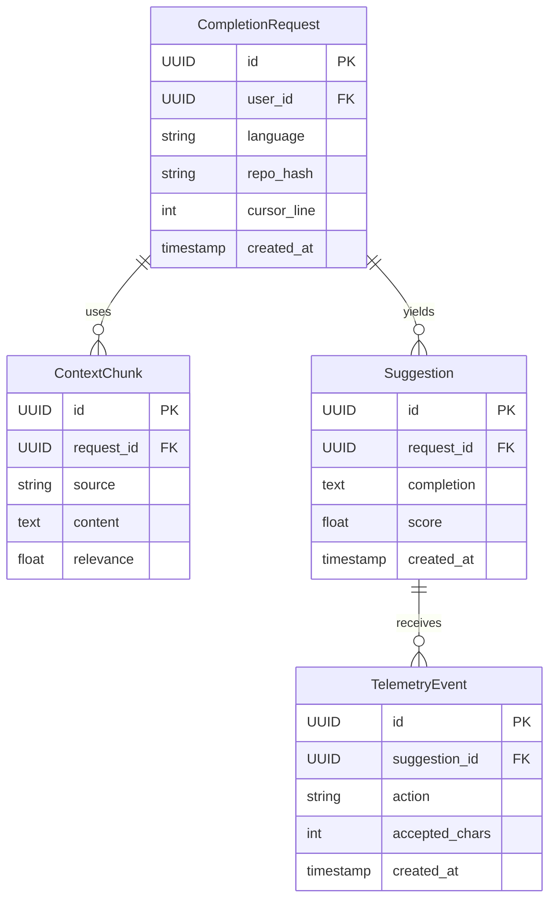
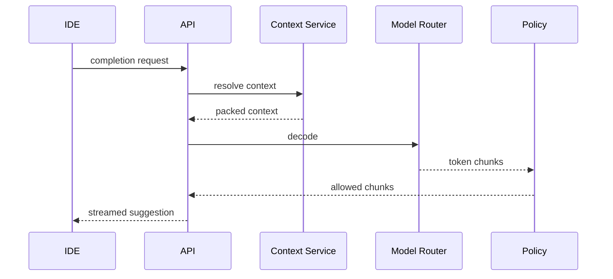

# API Design Walkthrough — GitHub Copilot

> Detailed API design for an AI coding assistant. Focus areas: completion request path, context retrieval, suggestion streaming, and acceptance telemetry feedback loops.

---

## 1. Overview & Scope

### In Scope

| Capability | Critical? |
|------------|-----------|
| Inline completion request | Yes |
| Workspace context retrieval | Yes |
| Suggestion streaming | Yes |
| Acceptance/rejection telemetry ingestion | Yes |
| Chat mode and agent actions | Secondary |
| Model training pipeline internals | Out of scope |

### Traffic Profile (assumed)

| Metric | Value |
|--------|-------|
| Peak completion requests | ~65k rps |
| Peak stream updates | ~220k events/s |
| Acceptance events | ~40k events/s |
| Time-to-first-suggestion SLO | p99 < 700 ms |

---

## 2. Data Model



### 2.1 Plain-English Terms

- Time to first suggestion: request accepted to first suggestion bytes rendered.
- Context packing: selecting best local snippets under token budget.
- Policy filter: blocks unsafe or license-risky outputs before serving.
- Acceptance telemetry: signal used to improve ranking and routing.

---

## 3. Authentication

- User token tied to IDE session.
- Repo-level authorization checks for enterprise tenants.
- Service JWT for internal model and retrieval calls.

---

## 4. Versioning Strategy

- /v1 for stable completion APIs.
- Feature flags for experimental decoding/ranking options.
- Response schema version attached to streamed frames.

---

## 5. Critical Path 1 — Inline Completion Request

### Endpoint Contract

- POST /v1/completions

### Example Request

```json
{
  "language": "python",
  "cursor": {"line": 82, "column": 17},
  "prefix": "def rank_candidates(items):\n    ",
  "suffix": "\n    return top",
  "request_id": "req_aa19"
}
```

### Example Response

```json
{
  "completion_id": "cmp_551",
  "status": "streaming",
  "stream_url": "/v1/completions/cmp_551/stream"
}
```

### Internal Flow

1. Authenticate IDE session and apply per-user rate limit.
2. Validate language and payload constraints.
3. Trigger context retrieval and packing.
4. Dispatch to model router for low-latency decode.
5. Return stream handle.

### Latency Budget

| Stage | Budget |
|-------|--------|
| Gateway + auth | 30 ms |
| Context retrieval | 180 ms |
| Prompt packing | 110 ms |
| Model first token | 300 ms |
| Total | 620 ms |

---

## 6. Critical Path 2 — Context Retrieval

### Endpoint Contract

- POST /v1/context:resolve (internal)

### Internal Flow

1. Collect open buffers, nearby lines, and symbols.
2. Add retrieval chunks from indexed repo embeddings.
3. Rank chunks by relevance and recency.
4. Pack under strict token budget.

### Example Resolved Context

```json
{
  "chunks": [
    {"source": "active_file", "score": 0.98},
    {"source": "same_repo_symbol", "score": 0.83},
    {"source": "test_file_pattern", "score": 0.61}
  ],
  "token_budget_used": 1850
}
```

---

## 7. Critical Path 3 — Suggestion Streaming

### Endpoint Contract

- GET /v1/completions/{completion_id}/stream

### Internal Flow

1. Client subscribes to stream.
2. Decoder emits token chunks.
3. Policy filter checks each chunk/window.
4. Ranked candidates streamed to IDE.



---

## 8. Critical Path 4 — Acceptance Telemetry Ingestion

### Endpoint Contract

- POST /v1/telemetry/completion-feedback

### Example Request

```json
{
  "suggestion_id": "sg_91",
  "action": "accepted",
  "accepted_chars": 47,
  "language": "python",
  "latency_ms": 512
}
```

### Internal Flow

1. Validate telemetry schema and session linkage.
2. Deduplicate by event id.
3. Write to analytics stream.
4. Update online ranker features asynchronously.

### Consistency

- Telemetry ingestion: at-least-once with dedupe.
- Ranking updates: eventual.

---

## 9. Common API Concerns

### 9.1 Error Catalog (examples)

| HTTP | When | Retry? |
|------|------|--------|
| 400 | Invalid schema or missing required field | No |
| 401 | Missing or invalid token | No (refresh auth) |
| 403 | Scope/permission denied | No |
| 409 | Version conflict or stale cursor/seq | Retry after refetch |
| 422 | Business rule violation | No |
| 429 | Rate limit exceeded | Yes, with backoff |
| 500/503 | Transient internal/dependency error | Yes, exponential backoff |

Example error payload:

```json
{
  "type": "https://api.example.com/errors/rate-limit",
  "title": "Rate limit exceeded",
  "status": 429,
  "detail": "Too many requests for this token",
  "instance": "req_abc123"
}
```

### 9.2 Retry and Idempotency Matrix

| Operation type | Idempotency strategy | Safe retry policy |
|----------------|----------------------|-------------------|
| Run/completion create | request_id or Idempotency-Key | Retry on timeout/5xx with same key; max 2 attempts |
| Stream subscribe | resume token / last event index | Reconnect with resume first; then exponential backoff |
| Tool output submission | tool_call_id uniqueness | Retry with same tool_call_id until acked |
| Feedback telemetry | event_id dedupe | Fire-and-forget client side; backend retries asynchronously |
| Context retrieval RPC | deterministic cache key | Retry once on timeout then degrade gracefully |


## 10. Design Decisions & Trade-offs

| Decision | Why | Trade-off |
|----------|-----|-----------|
| Stream suggestions instead of one-shot | Better perceived latency | More stream lifecycle logic |
| Retrieval + generation architecture | Higher quality completions | Additional retrieval latency |
| Policy filter in serving path | Safety/compliance | Slight p99 increase |
| Telemetry-driven ranker | Continuous quality improvement | Feedback loop complexity |

---

## 11. System Bottlenecks & Scaling Triggers

### 11.1 Alert Thresholds (sample)

| Alert | Threshold | Action |
|-------|-----------|--------|
| First-token p99 | > SLO for 10 min | route to faster model tier and trim context budget |
| Model scheduler queue delay | > 2 s p95 | autoscale workers and prioritize interactive traffic |
| Context/retrieval timeout rate | > 2% for 5 min | fallback to cached context and degrade optional retrieval |
| Stream disconnect rate | > 1% for 10 min | rebalance stream gateways and tune heartbeat intervals |
| Feedback/telemetry lag | > 2 min | scale consumers and investigate partition hotspots |

## 12. Interview Summary

- Completion quality depends on context retrieval and model decoding.
- Streaming is essential for IDE responsiveness.
- Policy filtering belongs in the hot path despite latency cost.
- Acceptance telemetry closes the product improvement loop.
