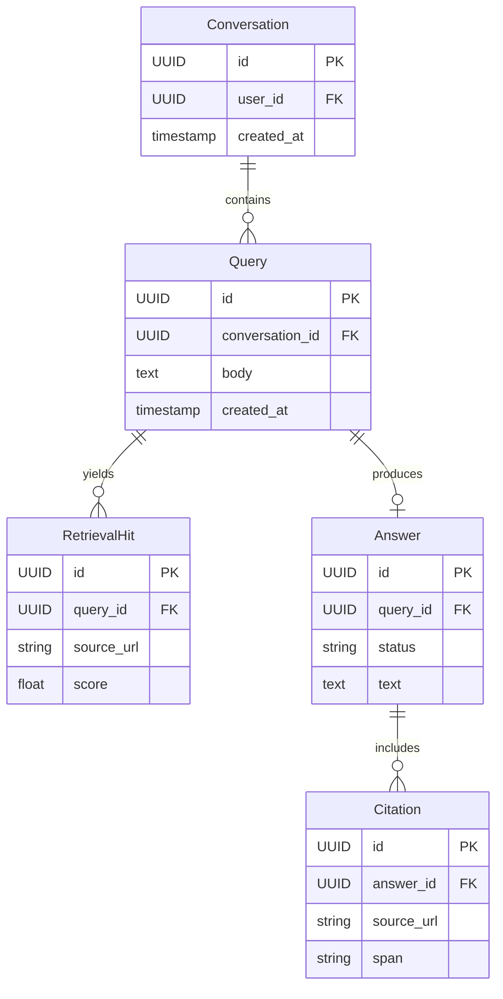

# API Design Walkthrough — Perplexity

> Detailed API design for an answer engine. Focus areas: query submission, citation-backed answer retrieval, streamed responses, and follow-up turn handling.

---

## 1. Overview & Scope

### In Scope

| Capability | Critical? |
|------------|-----------|
| Query submission | Yes |
| Citation-backed answer retrieval | Yes |
| Streaming answer delivery | Yes |
| Follow-up turn with context | Yes |
| Account settings | Secondary |
| Index crawler internals | Out of scope |

### Traffic Profile (assumed)

| Metric | Value |
|--------|-------|
| Peak queries | ~28k rps |
| Peak streams | ~700k concurrent |
| Retrieval RPC calls | ~220k rps |
| First chunk SLO | p99 < 1.7 s |

---

## 2. Data Model



---

## 3. Authentication

- User API token for query and conversation endpoints.
- Scoped service auth for retrieval/reranker/generation microservices.

---

## 4. Versioning Strategy

- /v1 API versioning.
- Streaming event schemas include event_version.
- Citation payload contract is additive.

---

## 5. Critical Path 1 — Query Submission

### Endpoint

- POST /v1/conversations/{conversation_id}/queries

### Example Request

```json
{"query": "Compare gRPC and GraphQL for internal APIs"}
```

### Flow

1. Validate auth and quota.
2. Persist query and enqueue answer job.
3. Return answer_id and stream endpoint.

---

## 6. Critical Path 2 — Citation-backed Answer Retrieval

### Endpoint

- GET /v1/answers/{answer_id}

### Flow

1. Fetch answer state and body.
2. Resolve citation set with source metadata.
3. Return answer + citations.

### Latency Budget

| Stage | Budget |
|-------|--------|
| Auth | 25 ms |
| Answer read | 45 ms |
| Citation resolve | 80 ms |
| Total | 150 ms |

---

## 7. Critical Path 3 — Streaming Answer Delivery

### Endpoint

- GET /v1/answers/{answer_id}/stream

### Flow

1. Client opens SSE stream.
2. Answer generator emits token deltas.
3. Stream emits partial citations and final answer.

---

## 8. Critical Path 4 — Follow-up Turn with Context

### Endpoint

- POST /v1/conversations/{conversation_id}/queries

### Flow

1. Load compact conversation context window.
2. Merge with new query.
3. Run retrieval + rerank + generation.

---

## 9. Common API Concerns

### 9.1 Error Catalog (examples)

| HTTP | When | Retry? |
|------|------|--------|
| 400 | Invalid schema or missing required field | No |
| 401 | Missing or invalid token | No (refresh auth) |
| 403 | Scope/permission denied | No |
| 409 | Version conflict or stale cursor/seq | Retry after refetch |
| 422 | Business rule violation | No |
| 429 | Rate limit exceeded | Yes, with backoff |
| 500/503 | Transient internal/dependency error | Yes, exponential backoff |

Example error payload:

```json
{
  "type": "https://api.example.com/errors/rate-limit",
  "title": "Rate limit exceeded",
  "status": 429,
  "detail": "Too many requests for this token",
  "instance": "req_abc123"
}
```

### 9.2 Retry and Idempotency Matrix

| Operation type | Idempotency strategy | Safe retry policy |
|----------------|----------------------|-------------------|
| Run/completion create | request_id or Idempotency-Key | Retry on timeout/5xx with same key; max 2 attempts |
| Stream subscribe | resume token / last event index | Reconnect with resume first; then exponential backoff |
| Tool output submission | tool_call_id uniqueness | Retry with same tool_call_id until acked |
| Feedback telemetry | event_id dedupe | Fire-and-forget client side; backend retries asynchronously |
| Context retrieval RPC | deterministic cache key | Retry once on timeout then degrade gracefully |


## 10. Design Decisions & Trade-offs

| Decision | Why | Trade-off |
|----------|-----|-----------|
| Retrieval-augmented generation | Better factual grounding | Retrieval latency overhead |
| SSE streaming | Better perceived speed | One-way channel only |

---

## 11. System Bottlenecks & Scaling Triggers

### 11.1 Alert Thresholds (sample)

| Alert | Threshold | Action |
|-------|-----------|--------|
| First-token p99 | > SLO for 10 min | route to faster model tier and trim context budget |
| Model scheduler queue delay | > 2 s p95 | autoscale workers and prioritize interactive traffic |
| Context/retrieval timeout rate | > 2% for 5 min | fallback to cached context and degrade optional retrieval |
| Stream disconnect rate | > 1% for 10 min | rebalance stream gateways and tune heartbeat intervals |
| Feedback/telemetry lag | > 2 min | scale consumers and investigate partition hotspots |

## 12. Interview Summary

- Answer quality depends on retrieval quality and latency.
- Citations are a first-class output, not a post-process.
- Streaming makes long generation workloads feel fast.
