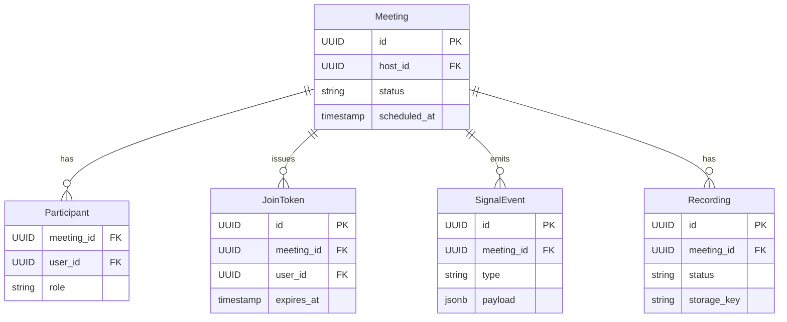

# API Design Walkthrough — Zoom

> Detailed API design for video conferencing. Focus areas: meeting creation, participant join flow, realtime signaling, and recording lifecycle.

---

## 1. Overview & Scope

### In Scope

| Capability | Critical? |
|------------|-----------|
| Meeting create/schedule | Yes |
| Join and token validation | Yes |
| Realtime signaling | Yes |
| Recording lifecycle | Yes |
| Webinar analytics | Secondary |
| Media codec implementation internals | Out of scope |

### Traffic Profile (assumed)

| Metric | Value |
|--------|-------|
| Peak meeting creates | ~6k rps |
| Peak joins | ~40k rps |
| Peak signaling events | ~900k events/s |
| Join success SLO | >99.9% |

---

## 2. Data Model



---

## 3. Authentication

- OAuth/JWT for hosts and participants.
- Join tokens short-lived and meeting-scoped.
- Role checks for host-only actions (mute all, record, etc).

---

## 4. Versioning Strategy

- /v1 control plane REST.
- Signaling protocol version in websocket handshake.
- Backward compatibility for active client releases.

---

## 5. Critical Path 1 — Meeting Create/Schedule

### Endpoint

- POST /v1/meetings

### Example Request

```json
{"topic": "Design Review", "scheduled_at": "2026-05-20T15:00:00Z", "passcode": "849233"}
```

### Flow

1. Validate host entitlement.
2. Persist meeting metadata.
3. Issue host join token.

---

## 6. Critical Path 2 — Join and Token Validation

### Endpoint

- POST /v1/meetings/{meeting_id}/join-tokens

### Latency Budget

| Stage | Budget |
|-------|--------|
| Auth | 30 ms |
| Meeting lookup | 35 ms |
| Capacity/role checks | 70 ms |
| Token mint | 30 ms |
| Total | 165 ms |

---

## 7. Critical Path 3 — Realtime Signaling

### Endpoint

- WS /v1/meetings/{meeting_id}/signal

### Flow

1. Client joins signaling websocket.
2. Exchange SDP/candidate metadata.
3. Emit participant state events (join/mute/leave).

---

## 8. Critical Path 4 — Recording Lifecycle

### Endpoints

- POST /v1/meetings/{meeting_id}/recordings:start
- POST /v1/meetings/{meeting_id}/recordings:stop

### Flow

1. Host permission check.
2. Toggle recording session state.
3. Persist recording artifact metadata after finalization.

---

## 9. Common API Concerns

### 9.1 Error Catalog (examples)

| HTTP | When | Retry? |
|------|------|--------|
| 400 | Invalid schema or missing required field | No |
| 401 | Missing or invalid token | No (refresh auth) |
| 403 | Scope/permission denied | No |
| 409 | Version conflict or stale cursor/seq | Retry after refetch |
| 422 | Business rule violation | No |
| 429 | Rate limit exceeded | Yes, with backoff |
| 500/503 | Transient internal/dependency error | Yes, exponential backoff |

Example error payload:

```json
{
  "type": "https://api.example.com/errors/rate-limit",
  "title": "Rate limit exceeded",
  "status": 429,
  "detail": "Too many requests for this token",
  "instance": "req_abc123"
}
```

### 9.2 Retry and Idempotency Matrix

| Operation type | Idempotency strategy | Safe retry policy |
|----------------|----------------------|-------------------|
| Realtime op submit | client_op_id or nonce per channel/file | Retry only on timeout; refetch latest seq before resend |
| Message/edit write | Idempotency-Key or client_msg_id | Exponential backoff with jitter, max 3 attempts |
| Presence update | None (ephemeral) | Best-effort, do not retry aggressively |
| Reconnect/resume | Session resume token | Immediate resume once, then backoff (1s, 2s, 5s...) |
| Webhook/app callback delivery | event_id dedupe on receiver | At-least-once with exponential backoff + DLQ |


## 10. Design Decisions & Trade-offs

| Decision | Why | Trade-off |
|----------|-----|-----------|
| Separate signaling from media plane | Clear scaling boundaries | More system complexity |
| Tokenized join flow | Strong access control | Extra join round-trip |

---

## 11. System Bottlenecks & Scaling Triggers

### 11.1 Alert Thresholds (sample)

| Alert | Threshold | Action |
|-------|-----------|--------|
| Realtime op/event p99 | > 250 ms for 10 min | scale gateway shards, reduce non-critical fanout |
| Reconnect storm | > 8% connections/min | enforce jittered reconnect, temporary admission control |
| Dropped realtime frames | > 1% for 5 min | increase buffers, backpressure low-priority streams |
| Gateway file descriptor usage | > 80% for 10 min | add instances, rebalance sticky sessions |
| Fanout queue lag | > 60 s | autoscale workers and inspect hot partition |

## 12. Interview Summary

- Join reliability matters more than feature breadth.
- Signaling and media should scale independently.
- Recording path must not block live meeting control path.
