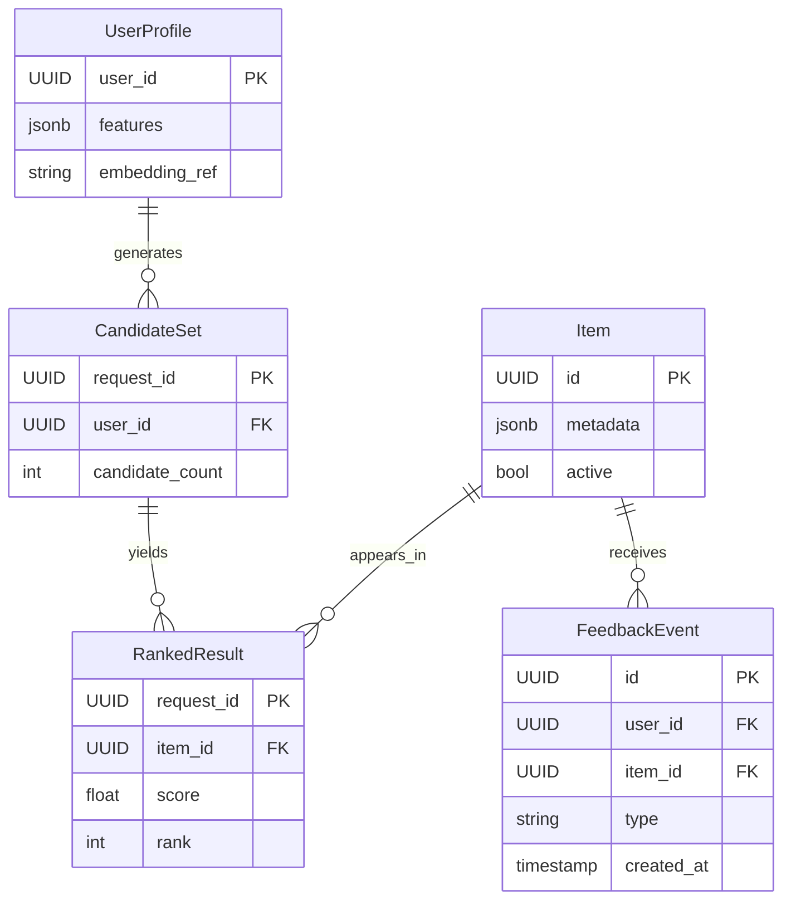
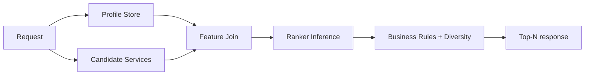

# API Design Walkthrough — AI Recommendation Platform

> Detailed API design for a recommendation serving system. Focus areas: request-time ranking, feature retrieval, feedback ingestion, and model rollout.

---

## 1. Overview & Scope

### In Scope

| Capability | Critical? |
|------------|-----------|
| Recommendation request serving | Yes |
| Candidate generation + ranking | Yes |
| Feedback event ingestion | Yes |
| Model activation/rollout | Yes |
| Offline experimentation UI | Secondary |
| Feature engineering platform internals | Out of scope |

### Traffic Profile (assumed)

| Metric | Value |
|--------|-------|
| Peak recommend requests | ~140k rps |
| Candidate RPC volume | ~500k rps |
| Feedback events | ~1.8M events/s |
| Serve SLO | p99 < 150 ms |

---

## 2. Data Model



---

## 3. Authentication

- Service auth for first-party callers.
- Tenant/application keys for external consumers.
- Signed event ingestion tokens.

---

## 4. Versioning Strategy

- /v1 serve API.
- Model id and feature schema versions included in response.
- Backward-compatible defaults for missing feature fields.

---

## 5. Critical Path 1 — Recommendation Request Serving

### Endpoint

- POST /v1/recommendations:rank

### Example Request

```json
{
  "user_id": "u_77",
  "context": {"surface": "home", "device": "mobile"},
  "limit": 20
}
```

### Example Response

```json
{
  "request_id": "req_612",
  "model_id": "ranker_v42",
  "items": [
    {"item_id": "i_1", "score": 0.913},
    {"item_id": "i_2", "score": 0.901}
  ]
}
```

---

## 6. Critical Path 2 — Candidate Generation + Ranking

### Internal Flow

1. Fetch user profile features.
2. Retrieve candidates from multiple sources.
3. Join online features.
4. Score with ranker model.
5. Apply diversity/business filters.

### Latency Budget

| Stage | Budget |
|-------|--------|
| Profile read | 20 ms |
| Candidate fetch | 45 ms |
| Feature join | 35 ms |
| Model inference | 30 ms |
| Filtering/serialize | 15 ms |
| Total | 145 ms |



---

## 7. Critical Path 3 — Feedback Event Ingestion

### Endpoints

- POST /v1/events/impressions
- POST /v1/events/clicks
- POST /v1/events/conversions

### Flow

1. Validate schema and signature.
2. Deduplicate by event_id.
3. Append to event stream.
4. Update online counters/features asynchronously.

---

## 8. Critical Path 4 — Model Activation and Rollout

### Endpoint

- POST /v1/models/{model_id}:activate

### Flow

1. Validate model artifact and compatibility.
2. Enable canary traffic percentage.
3. Monitor quality/latency guardrails.
4. Ramp to full traffic or rollback.

---

## 9. Common API Concerns

### 9.1 Error Catalog (examples)

| HTTP | When | Retry? |
|------|------|--------|
| 400 | Invalid schema or missing required field | No |
| 401 | Missing or invalid token | No (refresh auth) |
| 403 | Scope/permission denied | No |
| 409 | Version conflict or stale cursor/seq | Retry after refetch |
| 422 | Business rule violation | No |
| 429 | Rate limit exceeded | Yes, with backoff |
| 500/503 | Transient internal/dependency error | Yes, exponential backoff |

Example error payload:

```json
{
  "type": "https://api.example.com/errors/rate-limit",
  "title": "Rate limit exceeded",
  "status": 429,
  "detail": "Too many requests for this token",
  "instance": "req_abc123"
}
```

### 9.2 Retry and Idempotency Matrix

| Operation type | Idempotency strategy | Safe retry policy |
|----------------|----------------------|-------------------|
| Run/completion create | request_id or Idempotency-Key | Retry on timeout/5xx with same key; max 2 attempts |
| Stream subscribe | resume token / last event index | Reconnect with resume first; then exponential backoff |
| Tool output submission | tool_call_id uniqueness | Retry with same tool_call_id until acked |
| Feedback telemetry | event_id dedupe | Fire-and-forget client side; backend retries asynchronously |
| Context retrieval RPC | deterministic cache key | Retry once on timeout then degrade gracefully |


## 10. Design Decisions & Trade-offs

| Decision | Why | Trade-off |
|----------|-----|-----------|
| Online+offline hybrid features | Better quality | More operational complexity |
| Multi-source candidates | Better recall | Higher latency pressure |
| Async feedback processing | Protects serve p99 | Delayed learning updates |

---

## 11. System Bottlenecks & Scaling Triggers

### 11.1 Alert Thresholds (sample)

| Alert | Threshold | Action |
|-------|-----------|--------|
| First-token p99 | > SLO for 10 min | route to faster model tier and trim context budget |
| Model scheduler queue delay | > 2 s p95 | autoscale workers and prioritize interactive traffic |
| Context/retrieval timeout rate | > 2% for 5 min | fallback to cached context and degrade optional retrieval |
| Stream disconnect rate | > 1% for 10 min | rebalance stream gateways and tune heartbeat intervals |
| Feedback/telemetry lag | > 2 min | scale consumers and investigate partition hotspots |

## 12. Interview Summary

- Recommendation is a serve+learn loop.
- Candidate recall and feature freshness dominate quality.
- Serve path must stay deterministic and low-latency.
