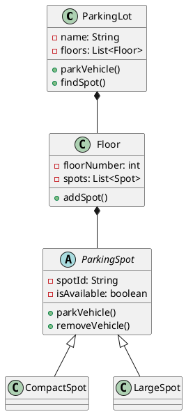

# UML Diagrams for LLD

> **💡 From Diagrams to Code:** UML is language-agnostic, but see how designs translate to code:
> - [Complete Interview Walkthroughs](../COMPLETE-INTERVIEW-WALKTHROUGHS-MULTILANG.md) - Design → Code in all languages
> - [Practice Problems](../07-practice-problems/) - Class diagrams with full implementations
> - [Four Pillars Examples](../03-oop-fundamentals/four-pillars.md) - OOP relationships in all languages

UML (Unified Modeling Language) diagrams help visualize your design. While perfect UML isn't required in interviews, being able to quickly sketch class relationships is valuable.

## Why UML Matters

1. **Visual Communication**: A diagram is worth a thousand words
2. **Interview Clarity**: Show your thought process visually
3. **Design Validation**: Spot issues in relationships
4. **Documentation**: Clear reference for implementation

## The 3 Essential Diagrams for LLD

### 1. Class Diagram ⭐⭐⭐
**Most Important!** Shows classes, attributes, methods, and relationships.

### 2. Use Case Diagram
Shows actors and their interactions with the system.

### 3. Sequence Diagram
Shows how objects interact over time.

## Interview Reality Check

❌ You **DON'T** need perfect UML syntax
✅ You **DO** need to show:
- Classes and their relationships
- Key methods and attributes
- Inheritance and composition
- General flow of interactions

## 1. Class Diagram

### Basic Notation

```
┌─────────────────────────┐
│      ClassName          │  ← Class name
├─────────────────────────┤
│ - privateAttribute      │  ← Attributes
│ + publicAttribute       │  (- private, + public, # protected)
├─────────────────────────┤
│ + publicMethod()        │  ← Methods
│ - privateMethod()       │
└─────────────────────────┘
```

### Relationships

```
Inheritance (IS-A):
Parent
  ▲
  │
  │ (hollow arrow pointing to parent)
Child

Association (HAS-A):
ClassA ────────> ClassB  (knows about)

Aggregation (Weak HAS-A):
ClassA ◇────────> ClassB  (hollow diamond - can exist independently)

Composition (Strong HAS-A):
ClassA ◆────────> ClassB  (filled diamond - lifecycle bound)

Dependency:
ClassA ·······> ClassB  (dashed line - uses)
```

### Example: Parking Lot System

```
┌──────────────────────────┐
│      ParkingLot          │
├──────────────────────────┤
│ - name: str              │
│ - floors: List[Floor]    │
├──────────────────────────┤
│ + add_floor(floor)       │
│ + park_vehicle(vehicle)  │
│ + find_spot(type)        │
└──────────────────────────┘
         ◆ (composition)
         │
         │ 1..*
         ▼
┌──────────────────────────┐
│         Floor            │
├──────────────────────────┤
│ - floor_number: int      │
│ - spots: List[Spot]      │
├──────────────────────────┤
│ + add_spot(spot)         │
│ + find_available()       │
└──────────────────────────┘
         ◆
         │
         │ 1..*
         ▼
┌──────────────────────────┐
│      ParkingSpot         │  ← Abstract
├──────────────────────────┤
│ - spot_id: str           │
│ - is_available: bool     │
├──────────────────────────┤
│ + park_vehicle()         │
│ + remove_vehicle()       │
└──────────────────────────┘
         ▲
         │ (inheritance)
    ┌────┴────┬────────────┐
    │         │            │
┌───────┐ ┌────────┐ ┌──────────┐
│Compact│ │ Large  │ │ Electric │
└───────┘ └────────┘ └──────────┘
```

### Python Code to Diagram

```python
# This code:
class ParkingLot:
    def __init__(self):
        self.floors = []  # Composition

class Floor:
    def __init__(self):
        self.spots = []  # Composition

class ParkingSpot(ABC):  # Abstract
    pass

class CompactSpot(ParkingSpot):  # Inheritance
    pass

# Becomes this diagram:
# ParkingLot ◆──> Floor ◆──> ParkingSpot ▲──> CompactSpot
```

## 2. Use Case Diagram

### Notation

```
     Actor
    ┌─────┐
    │ 👤  │
    │User │
    └─────┘
       │
       │ (interacts with)
       ▼
  ╭──────────╮
  │Use Case  │  ← Ellipse
  ╰──────────╯
```

### Example: Vending Machine

```
           Customer                         Admin
           ┌─────┐                         ┌─────┐
           │ 👤  │                         │ 👤  │
           └──┬──┘                         └──┬──┘
              │                               │
              │ Insert Money                  │ Restock
              ├──────────╮                    ├──────────╮
              │          │                    │          │
              ▼          ▼                    ▼          │
         ╭─────────╮ ╭────────────╮    ╭──────────╮    │
         │ Select  │ │   Refund   │    │ Add      │    │
         │ Product │ │            │    │ Products │    │
         ╰─────────╯ ╰────────────╯    ╰──────────╯    │
              │                                         │
              │ includes                                │
              ▼                                         ▼
         ╭─────────╮                            ╭────────────╮
         │ Dispense│                            │   View     │
         │ Product │                            │ Inventory  │
         ╰─────────╯                            ╰────────────╯
```

## 3. Sequence Diagram

### Notation

Shows interaction over time (top to bottom)

```
Object1    Object2    Object3
   │          │          │
   │  msg1    │          │
   ├─────────>│          │
   │          │  msg2    │
   │          ├─────────>│
   │          │<─────────┤
   │          │  return  │
   │<─────────┤          │
   │  return  │          │
```

### Example: Place Order

```
Customer    ShoppingCart    PaymentService    Inventory
   │             │                │               │
   │ checkout()  │                │               │
   ├────────────>│                │               │
   │             │ calculate_total()              │
   │             ├──┐             │               │
   │             │<─┘             │               │
   │             │ process_payment()              │
   │             ├───────────────>│               │
   │             │                │ charge_card() │
   │             │                ├──┐            │
   │             │                │<─┘            │
   │             │<───────────────┤               │
   │             │   success      │               │
   │             │                                │
   │             │ update_inventory()             │
   │             ├────────────────────────────────>│
   │             │                                │
   │             │ send_confirmation()            │
   │             ├──┐                             │
   │             │<─┘                             │
   │<────────────┤                                │
   │   Order     │                                │
```

## Quick Sketching in Interviews

### On Whiteboard

```
Simple Box Notation:

[ParkingLot] --has--> [Floor] --has--> [Spot]
                                          △
                                          |
                              +-----------+---------+
                              |           |         |
                          [Compact]   [Large]  [Electric]
```

### Text-Based (In Code Comments)

```python
"""
CLASS RELATIONSHIPS:

ParkingLot
  ├── has many Floors (composition)
  └── has many Tickets (aggregation)

Floor
  └── has many ParkingSpots (composition)

ParkingSpot (abstract)
  ├── CompactSpot (inheritance)
  ├── LargeSpot (inheritance)
  └── ElectricSpot (inheritance)

Vehicle (abstract)
  ├── Car (inheritance)
  ├── Truck (inheritance)
  └── Motorcycle (inheritance)

Ticket
  ├── uses Vehicle (association)
  └── uses ParkingSpot (association)
"""
```

## Real Interview Examples

### Example 1: Library Management

```
┌─────────────┐         ┌──────────┐
│   Library   │◆───────>│   Book   │
├─────────────┤   1..*  ├──────────┤
│- name       │         │- isbn    │
│- books      │         │- title   │
├─────────────┤         │- author  │
│+ add_book() │         └──────────┘
└─────────────┘              ▲
      ◆                      │
      │                      │ (is-a)
      │ 1..*           ┌─────┴─────┐
      ▼                │           │
┌─────────────┐   ┌────────┐  ┌────────┐
│   Member    │   │Physical│  │ EBook  │
├─────────────┤   └────────┘  └────────┘
│- member_id  │
│- name       │
├─────────────┤
│+ borrow()   │
└─────────────┘
      │
      │ creates
      ▼
┌─────────────┐
│    Loan     │
├─────────────┤
│- loan_id    │
│- due_date   │
└─────────────┘
```

### Example 2: Payment Processing

```
Sequence Diagram:

User        PaymentService      PaymentStrategy      Bank
 │               │                    │               │
 │ pay(100)      │                    │               │
 ├──────────────>│                    │               │
 │               │ process(100)       │               │
 │               ├───────────────────>│               │
 │               │                    │ charge(100)   │
 │               │                    ├──────────────>│
 │               │                    │               │
 │               │                    │<──────────────┤
 │               │                    │   success     │
 │               │<───────────────────┤               │
 │<──────────────┤                    │               │
 │   Receipt     │                    │               │
```

## Drawing Tools

### For Practice
- **Draw.io** (free, web-based)
- **PlantUML** (text-based, generates diagrams)
- **Lucidchart** (professional, collaborative)
- **Excalidraw** (simple, quick sketches)

### PlantUML Example



## Interview Tips

### Do's ✅
- **Start simple**: Basic boxes and arrows
- **Label relationships**: "has", "is-a", "uses"
- **Show key attributes/methods**: Not everything
- **Use consistent notation**: Pick one style
- **Iterate**: Refine as you discuss

### Don'ts ❌
- **Perfect UML syntax**: Not required
- **Every detail**: Focus on important parts
- **Complicated diagrams**: Keep it simple
- **Too much time**: 5-10 min max on diagrams

## Practice Exercise

Draw a class diagram for a **Restaurant Reservation System** including:
- Restaurant (has tables)
- Table (has capacity)
- Reservation (links customer to table)
- Customer
- TimeSlot

Include:
- Inheritance where appropriate
- Composition vs aggregation
- Key attributes and methods

## Quick Reference Card

```
Relationships Quick Guide:

IS-A (Inheritance):      Parent ▲──── Child
HAS-A (Composition):     Parent ◆──── Child (strong)
HAS-A (Aggregation):     Parent ◇──── Child (weak)
USES (Association):      ClassA ────> ClassB
DEPENDS (Dependency):    ClassA ····> ClassB

Access Modifiers:
+ public
- private
# protected
~ package

Multiplicity:
1     exactly one
0..1  zero or one
*     zero or many
1..*  one or many
3..5  three to five
```

---

**Next**: Practice drawing diagrams for the [practice problems](../07-practice-problems/)!
