# Proximity Service Design

A service to find nearby places/businesses based on user location (similar to Yelp, Google Maps, Uber driver matching).

## 📁 Files in this Directory

| File | Description |
|------|-------------|
| [README.md](README.md) | Complete system design documentation |
| [openapi.yaml](openapi.yaml) | OpenAPI 3.0 specification (machine-readable) |
| [OPENAPI_GUIDE.md](OPENAPI_GUIDE.md) | How to use the OpenAPI spec |
| [client_example.py](client_example.py) | Python client usage examples |

## Table of Contents
- [Functional Requirements](#functional-requirements)
- [Non-Functional Requirements](#non-functional-requirements)
- [Back-of-Envelope Estimation](#back-of-envelope-estimation)
- [API Design](#api-design)
- [High-Level Architecture](#high-level-architecture)
- [Database Schema](#database-schema)
- [Geospatial Indexing](#geospatial-indexing)
- [Deep Dive](#deep-dive)

---

## Functional Requirements

### Core Features

**1. Search Nearby Places**
- Users can search for places within a radius (e.g., "restaurants within 5km")
- Support filtering by type (restaurant, gas station, hotel, etc.)
- Return results sorted by distance

**2. Add/Update/Delete Places**
- Business owners can add new places
- Update place information (name, address, hours, etc.)
- Remove places that no longer exist

**3. View Place Details**
- Get detailed information about a specific place
- Include: name, address, rating, photos, reviews, hours

**4. Optional Features (Phase 2)**
- Real-time updates (e.g., Uber drivers' live locations)
- Geofencing (notify when user enters/exits area)
- Route optimization (visit multiple places)

### Out of Scope (for this design)
- Reviews and ratings system (separate service)
- Payment processing
- Booking/reservations
- Social features

---

## Non-Functional Requirements

### Performance
- **Low latency:** P99 < 200ms for search queries
- **High throughput:** Handle 100,000 QPS (queries per second)
- **Fast reads:** Read-heavy system (read:write ratio = 100:1)

### Scalability
- **Horizontal scaling:** Add more servers as traffic grows
- **Data size:** Support 500M places globally
- **Geographic distribution:** Deploy in multiple regions for low latency

### Availability
- **High availability:** 99.99% uptime (< 52 minutes downtime/year)
- **Fault tolerance:** No single point of failure
- **Disaster recovery:** Data replicated across regions

### Consistency
- **Eventual consistency acceptable:** New places may take a few seconds to appear
- **Strong consistency for writes:** Prevent duplicate place additions

### Other Requirements
- **Accuracy:** Return results within specified radius
- **Freshness:** Place data updated within 1 minute
- **Security:** API authentication, rate limiting

---

## Back-of-Envelope Estimation

### Assumptions
- **Daily Active Users (DAU):** 100 million
- **Searches per user per day:** 5
- **Total daily searches:** 100M × 5 = 500M searches/day
- **Seconds per day:** 10^5 seconds ≈ 86,400 seconds (simplified)

### QPS Calculations

**Average QPS:**
```
500M searches / 10^5 seconds = 5,000 QPS
```

**Peak QPS (3x average):**
```
5,000 × 3 = 15,000 QPS
```

**Design for:** 20,000 QPS (buffer for growth)

### Storage Estimation

**Number of places:**
```
Total places worldwide: 500M
```

**Storage per place:**
```
place_id: 8 bytes
name: 256 bytes
address: 512 bytes
latitude: 8 bytes
longitude: 8 bytes
category: 64 bytes
metadata: 500 bytes
Total: ~1.5 KB per place
```

**Total storage:**
```
500M places × 1.5 KB = 750 GB
With indexes (2x): 1.5 TB
With replicas (3x): 4.5 TB
```

### Bandwidth

**Average request size:** 100 bytes (lat, lon, radius, filters)  
**Average response size:** 5 KB (20 places × 250 bytes each)

**Incoming traffic:**
```
20,000 QPS × 100 bytes = 2 MB/s = 16 Mbps
```

**Outgoing traffic:**
```
20,000 QPS × 5 KB = 100 MB/s = 800 Mbps
```

### Memory (Caching)

**Cache hot places (20% accessed frequently):**
```
500M × 0.2 × 1.5 KB = 150 GB
Distributed across servers: ~10 GB per cache node
```

### Server Estimation

**Application servers (20,000 QPS):**
```
Assume 1 server handles 1,000 QPS
20,000 / 1,000 = 20 servers
With redundancy: 30 servers
```

**Database servers:**
```
Read QPS: 20,000
Write QPS: 200 (read:write = 100:1)
With read replicas: 5 primary + 15 read replicas
```

### Summary Table

| Metric | Value |
|--------|-------|
| Daily searches | 500M |
| Average QPS | 5,000 |
| Peak QPS | 15,000 |
| Design target | 20,000 QPS |
| Total places | 500M |
| Storage (with replicas) | 4.5 TB |
| Incoming bandwidth | 16 Mbps |
| Outgoing bandwidth | 800 Mbps |
| Cache memory | 150 GB |
| Application servers | 30 |
| Database servers | 20 |

---

## API Design

### OpenAPI 3.0 Specification

> **Full spec:** [openapi.yaml](openapi.yaml)  
> **Usage guide:** [OPENAPI_GUIDE.md](OPENAPI_GUIDE.md)  
> **Try online:** [Swagger Editor](https://editor.swagger.io/) (import openapi.yaml)

**Quick Overview:**
```yaml
openapi: 3.0.0
info:
  title: Proximity Service API
  version: 1.0.0
  description: Find nearby places based on location
servers:
  - url: https://api.proximity.example.com/v1
    description: Production
  - url: https://api-staging.proximity.example.com/v1
    description: Staging
```

**Interactive Documentation:**
- **Swagger UI:** `https://api.proximity.example.com/docs`
- **ReDoc:** `https://api.proximity.example.com/redoc`
- **Postman Collection:** Import OpenAPI spec directly

**Getting Started:**
```bash
# View docs locally
docker run -p 8080:8080 -v $(pwd):/app -e SWAGGER_JSON=/app/openapi.yaml swaggerapi/swagger-ui
open http://localhost:8080

# Generate Python client
openapi-generator-cli generate -i openapi.yaml -g python -o ./client

# Validate API responses
prism mock openapi.yaml -p 8080
```

### RESTful API

#### 1. Search Nearby Places

```http
GET /v1/places/nearby
```

**Query Parameters:**
```json
{
  "latitude": 37.7749,      // Required
  "longitude": -122.4194,   // Required
  "radius": 5000,           // Optional, default 5000 (meters)
  "type": "restaurant",     // Optional, filter by type
  "limit": 20,              // Optional, default 20
  "offset": 0               // Optional, for pagination
}
```

**Response (200 OK):**
```json
{
  "places": [
    {
      "place_id": "chIJN1t_tDeuEmsRUsoyG83frY4",
      "name": "Blue Bottle Coffee",
      "address": "66 Mint St, San Francisco, CA 94103",
      "location": {
        "latitude": 37.7764,
        "longitude": -122.4172
      },
      "distance": 450,         // meters
      "rating": 4.5,
      "type": "cafe",
      "is_open": true
    },
    {
      "place_id": "chIJPZDrEzeuEmsRwMRrY83frB2",
      "name": "Foreign Cinema",
      "address": "2534 Mission St, San Francisco, CA 94110",
      "location": {
        "latitude": 37.7584,
        "longitude": -122.4188
      },
      "distance": 1850,
      "rating": 4.3,
      "type": "restaurant",
      "is_open": false
    }
  ],
  "total": 156,
  "has_more": true
}
```

**Error Response (400 Bad Request):**
```json
{
  "error": "INVALID_COORDINATES",
  "message": "Latitude must be between -90 and 90"
}
```

---

#### 2. Get Place Details

```http
GET /v1/places/{place_id}
```

**Path Parameters:**
- `place_id`: Unique identifier for the place

**Response (200 OK):**
```json
{
  "place_id": "chIJN1t_tDeuEmsRUsoyG83frY4",
  "name": "Blue Bottle Coffee",
  "address": "66 Mint St, San Francisco, CA 94103",
  "location": {
    "latitude": 37.7764,
    "longitude": -122.4172
  },
  "phone": "+1 415-495-3394",
  "website": "https://bluebottlecoffee.com",
  "rating": 4.5,
  "type": "cafe",
  "hours": {
    "monday": "07:00-19:00",
    "tuesday": "07:00-19:00",
    "wednesday": "07:00-19:00",
    "thursday": "07:00-19:00",
    "friday": "07:00-19:00",
    "saturday": "08:00-18:00",
    "sunday": "08:00-18:00"
  },
  "photos": [
    "https://cdn.example.com/photos/abc123.jpg",
    "https://cdn.example.com/photos/def456.jpg"
  ],
  "created_at": "2020-05-15T10:30:00Z",
  "updated_at": "2026-02-01T14:20:00Z"
}
```

---

#### 3. Add Place

```http
POST /v1/places
```

**Headers:**
```
Authorization: Bearer {token}
Content-Type: application/json
```

**Request Body:**
```json
{
  "name": "New Cafe",
  "address": "123 Main St, San Francisco, CA 94102",
  "location": {
    "latitude": 37.7850,
    "longitude": -122.4100
  },
  "phone": "+1 415-555-0123",
  "website": "https://newcafe.com",
  "type": "cafe",
  "hours": {
    "monday": "08:00-20:00",
    "tuesday": "08:00-20:00",
    "wednesday": "08:00-20:00",
    "thursday": "08:00-20:00",
    "friday": "08:00-20:00",
    "saturday": "09:00-21:00",
    "sunday": "09:00-21:00"
  }
}
```

**Response (201 Created):**
```json
{
  "place_id": "chIJXYZ123newPlaceId",
  "message": "Place created successfully",
  "created_at": "2026-02-08T12:00:00Z"
}
```

---

#### 4. Update Place

```http
PUT /v1/places/{place_id}
```

**Headers:**
```
Authorization: Bearer {token}
Content-Type: application/json
```

**Request Body:** (partial updates allowed)
```json
{
  "name": "New Cafe - Updated",
  "hours": {
    "monday": "07:00-21:00"
  }
}
```

**Response (200 OK):**
```json
{
  "place_id": "chIJXYZ123newPlaceId",
  "message": "Place updated successfully",
  "updated_at": "2026-02-08T15:30:00Z"
}
```

---

#### 5. Delete Place

```http
DELETE /v1/places/{place_id}
```

**Headers:**
```
Authorization: Bearer {token}
```

**Response (204 No Content)**

---

#### 6. Search by Area (Polygon)

```http
POST /v1/places/search-area
```

**Request Body:**
```json
{
  "polygon": [
    {"latitude": 37.7749, "longitude": -122.4194},
### Benefits of OpenAPI


**Key Benefits:**
- 📖 **Auto-generated docs** - No manual doc updates
- 🔧 **SDK generation** - Python, Java, JavaScript clients
- ✅ **Validation** - Request/response validation at runtime
- 🧪 **Testing** - Contract testing, mock servers
- 🤝 **Team collaboration** - Single source of truth

    {"latitude": 37.7849, "longitude": -122.4094},
    {"latitude": 37.7649, "longitude": -122.4094}
  ],
  "type": "restaurant",
  "limit": 50
}
```

**Response:** Similar to nearby search

---

### API Design Principles

✅ **RESTful conventions:** Use HTTP verbs correctly  
✅ **Versioning:** `/v1/` prefix for future compatibility  
✅ **Pagination:** Support `limit` and `offset` for large results  
✅ **Filtering:** Allow filtering by type, open/closed, rating  
✅ **Rate limiting:** 1000 requests/hour per user  
✅ **Authentication:** JWT tokens for write operations  
✅ **HTTPS only:** Secure communication  
✅ **Error codes:** Standard HTTP status codes with descriptive messages

---

## High-Level Architecture


### Components

**1. Load Balancer (NGINX/AWS ALB)**
- Distribute traffic across API servers
- Health checks
- SSL termination

**2. API Servers (Stateless)**
- Handle HTTP requests
- Business logic
- Coordinate between cache, index, database
- Horizontally scalable

**3. Cache Layer (Redis)**
- Cache popular places
- Cache recent search results
- TTL: 5 minutes for search results, 1 hour for place details
- LRU eviction policy

**4. Geospatial Index**
- Fast proximity search
- In-memory data structure (QuadTree or Geohash)
- Periodically synchronized with database
- Options: Redis Geospatial, custom QuadTree service

**5. Database (PostgreSQL with PostGIS)**
- Primary: Handle writes
- Read replicas: Handle read queries
- PostGIS extension for geospatial queries
- Sharding by geographic region

**6. CDN (Optional)**
- Cache place photos
- Reduce latency for static content

---

## Request Flow Diagrams

### Entity Relationship Diagram


### Search Nearby Places Flow


### Add Place Flow


### Real-Time Location Update (Uber-style)


---

### Geospatial Indexing Comparison

```mermaid
graph LR
    A[Geospatial<br/>Indexing<br/>Approaches] --> B[Geohash]
    A --> C[QuadTree]
    A --> D[Google S2]
    A --> E[R-Tree]
    
    B --> B1[Simple<br/>String-based]
    B --> B2[Redis GEORADIUS]
    B --> B3[Grid cells]
    
    C --> C1[Hierarchical<br/>4 quadrants]
    C --> C2[Dynamic<br/>balancing]
    C --> C3[In-memory]
    
    D --> D1[Sphere projection]
    D --> D2[Best coverage]
    D --> D3[Complex]
    
    E --> E1[PostgreSQL<br/>PostGIS]
    E --> E2[B-tree variant]
    E --> E3[Good for DB]
    
    style B fill:#90EE90
    style B2 fill:#FFD700
    style C fill:#87CEEB
    style D fill:#DDA0DD
    style E fill:#F0E68C
``` loop Every 5 seconds
        Driver->>Gateway: Send location<br/>{driver_id, lat, lon, timestamp}
        Gateway->>LocationSvc: Update location
        
        LocationSvc->>LocationSvc: Check if moved > 50m
        
        alt Significant movement
            LocationSvc->>Redis: GEOADD drivers {lon} {lat} {driver_id}
            LocationSvc->>Redis: EXPIRE drivers:{driver_id} 300
        else No significant movement
            LocationSvc->>LocationSvc: Skip update
        end
    end
    
    Rider->>Gateway: Search nearby drivers<br/>{lat, lon, radius: 2000m}
    Gateway->>LocationSvc: Find nearby
    LocationSvc->>Redis: GEORADIUS drivers {lon} {lat} 2000m
    Redis-->>LocationSvc: [driver1: 500m, driver2: 1200m]
    LocationSvc-->>Gateway: Available drivers
    Gateway-->>Rider: Show drivers on map
```

---

## Database Schema

### PostgreSQL Schema

```sql
-- Places table
CREATE TABLE places (
    place_id VARCHAR(255) PRIMARY KEY,
    name VARCHAR(255) NOT NULL,
    address TEXT NOT NULL,
    latitude DOUBLE PRECISION NOT NULL,
    longitude DOUBLE PRECISION NOT NULL,
    location GEOGRAPHY(POINT, 4326),  -- PostGIS type
    phone VARCHAR(50),
    website VARCHAR(500),
    type VARCHAR(50) NOT NULL,
    rating DECIMAL(2, 1) DEFAULT 0,
    is_open BOOLEAN DEFAULT true,
    created_at TIMESTAMP DEFAULT CURRENT_TIMESTAMP,
    updated_at TIMESTAMP DEFAULT CURRENT_TIMESTAMP,
    
    CHECK (latitude >= -90 AND latitude <= 90),
    CHECK (longitude >= -180 AND longitude <= 180)
);

-- Spatial index for fast proximity queries
CREATE INDEX idx_places_location ON places USING GIST(location);

-- Regular indexes
CREATE INDEX idx_places_type ON places(type);
CREATE INDEX idx_places_created_at ON places(created_at);

-- Business hours table
CREATE TABLE business_hours (
    id BIGSERIAL PRIMARY KEY,
    place_id VARCHAR(255) REFERENCES places(place_id) ON DELETE CASCADE,
    day_of_week INTEGER NOT NULL,  -- 0=Monday, 6=Sunday
    open_time TIME,
    close_time TIME,
    is_closed BOOLEAN DEFAULT false,
    
    UNIQUE(place_id, day_of_week)
);

CREATE INDEX idx_business_hours_place ON business_hours(place_id);

-- Place metadata (extensible)
CREATE TABLE place_metadata (
    place_id VARCHAR(255) REFERENCES places(place_id) ON DELETE CASCADE,
    key VARCHAR(100) NOT NULL,
    value TEXT,
    
    PRIMARY KEY(place_id, key)
);

-- Geohash index table (alternative to QuadTree)
CREATE TABLE place_geohash (
    place_id VARCHAR(255) REFERENCES places(place_id) ON DELETE CASCADE,
    geohash VARCHAR(12) NOT NULL,
    
    PRIMARY KEY(place_id)
);

CREATE INDEX idx_geohash ON place_geohash(geohash);
```

### Sample Queries

**1. Find nearby places (PostGIS):**
```sql
SELECT 
    place_id,
    name,
    address,
    latitude,
    longitude,
    ST_Distance(
        location,
        ST_SetSRID(ST_MakePoint(-122.4194, 37.7749), 4326)::geography
    ) AS distance
FROM places
WHERE 
    ST_DWithin(
        location,
        ST_SetSRID(ST_MakePoint(-122.4194, 37.7749), 4326)::geography,
        5000  -- 5km radius in meters
    )
    AND type = 'restaurant'
ORDER BY distance
LIMIT 20;
```

**2. Find places by geohash prefix:**
```sql
SELECT p.*
FROM places p
JOIN place_geohash gh ON p.place_id = gh.place_id
WHERE gh.geohash LIKE '9q8yy%'  -- Geohash prefix
LIMIT 20;
```

**3. Check if place is currently open:**
```sql
SELECT p.*, 
    CASE 
        WHEN bh.is_closed THEN false
        WHEN CURRENT_TIME BETWEEN bh.open_time AND bh.close_time THEN true
        ELSE false
    END as is_currently_open
FROM places p
LEFT JOIN business_hours bh 
    ON p.place_id = bh.place_id 
    AND bh.day_of_week = EXTRACT(DOW FROM CURRENT_DATE)
WHERE p.place_id = 'chIJN1t_tDeuEmsRUsoyG83frY4';
```

---

## Geospatial Indexing

### Why Geospatial Indexing?

**Naive approach (scan all places):**
```python
for place in all_places:  # 500M places!
    if distance(user_location, place.location) < radius:
        results.append(place)
# Time complexity: O(n) - Too slow! ❌
```

**With geospatial index:**
```python
# Only check places in nearby grid cells
results = geospatial_index.search(user_location, radius)
# Time complexity: O(log n) or O(1) - Fast! ✅
```

---

### Approach 1: QuadTree

**QuadTree Visualization:**


**QuadTree Search Process:**


---

### Approach 1: Geohash

**What is Geohash?**
- Encode coordinates into a short string
- Similar locations have similar prefixes
- Hierarchical: longer geohash = more precise

**Example:**
```
San Francisco: "9q8yy" (5 chars ≈ 5km precision)
- 9q8yy9: Specific block
- 9q8yy: Neighborhood
- 9q8y: District
- 9q8: City
- 9q: Region
```

**Geohash Hierarchy Visualization:**


**Implementation:**
```python
import pygeohash as pgh

def find_nearby_places(lat, lon, radius_km):
    # Get geohash at appropriate precision
    precision = get_precision_for_radius(radius_km)
    center_hash = pgh.encode(lat, lon, precision=precision)
    
    # Get neighboring geohashes
    neighbors = pgh.get_adjacent(center_hash)
    search_hashes = [center_hash] + neighbors
    
    # Query database
    results = []
    for geohash in search_hashes:
        places = db.query(
            "SELECT * FROM place_geohash WHERE geohash LIKE %s",
            (geohash + '%',)
        )
        results.extend(places)
    
    # Filter by exact distance
    filtered = [
        p for p in results 
        if haversine_distance(lat, lon, p.lat, p.lon) <= radius_km
    ]
    
    return sorted(filtered, key=lambda p: p.distance)

def get_precision_for_radius(radius_km):
    # Geohash precision mapping
    if radius_km <= 0.02:    return 9  # ~20m
    elif radius_km <= 0.15:  return 7  # ~150m
    elif radius_km <= 1.2:   return 6  # ~1.2km
    elif radius_km <= 5:     return 5  # ~5km
    elif radius_km <= 20:    return 4  # ~20km
    else:                    return 3  # ~150km
```

**Geohash Index in Redis:**
```python
import redis
import pygeohash as pgh

redis_client = redis.Redis()

# Add place to Redis geospatial index
def add_place(place_id, lat, lon):
    redis_client.geoadd('places', (lon, lat, place_id))

# Search nearby
def search_nearby(lat, lon, radius_m):
    results = redis_client.georadius(
        'places',
        lon, lat,
        radius_m,
        unit='m',
        withdist=True,
        count=20
    )
    return results

# Example
add_place('place1', 37.7749, -122.4194)
add_place('place2', 37.7849, -122.4094)

nearby = search_nearby(37.7749, -122.4194, 5000)
print(nearby)  # [(b'place1', 0.0), (b'place2', 1345.6)]
```

**Pros/Cons:**

✅ Simple to implement  
✅ Works well with Redis GEOADD/GEORADIUS  
✅ Human-readable (can see location from hash)  
❌ Edge cases near boundaries (need to check neighbors)  
❌ Not perfect for arbitrary radiuses

---

### Approach 2: QuadTree

**What is QuadTree?**
- Recursively divide 2D space into 4 quadrants
- Each node represents a region
- Leaf nodes contain actual places

**Structure:**
```
                    [Root: World]
                    /     |     \
           [NW]    [NE]   [SW]    [SE]
          /  |  \
    [NW] [NE] [SW] [SE]
      |
    [Places: p1, p2, p3]
```

**Implementation:**
```python
class QuadTreeNode:
    def __init__(self, boundary, capacity=50):
        self.boundary = boundary  # (min_lat, max_lat, min_lon, max_lon)
        self.capacity = capacity
        self.places = []
        self.divided = False
        self.northwest = None
        self.northeast = None
        self.southwest = None
        self.southeast = None
    
    def insert(self, place):
        # If place not in boundary, reject
        if not self.boundary.contains(place):
            return False
        
        # If capacity not reached, add here
        if len(self.places) < self.capacity:
            self.places.append(place)
            return True
        
        # Otherwise, subdivide and add
        if not self.divided:
            self.subdivide()
        
        # Try to insert into children
        if self.northwest.insert(place): return True
        if self.northeast.insert(place): return True
        if self.southwest.insert(place): return True
        if self.southeast.insert(place): return True
        
        return False  # Should never reach here
```

**Pros/Cons:**

✅ Fast for sparse data  
✅ Automatically adapts to data density  
✅ Good for arbitrary radiuses  
❌ Complex to implement  
❌ Requires rebuilding on updates  
❌ Memory intensive for dense areas

---

### Approach Comparison

| Feature | Geohash | QuadTree |
|---------|---------|----------|
| **Implementation** | Simple | Complex |
| **Search Speed** | O(log n) | O(log n) |
| **Update Speed** | O(1) | O(log n) |
| **Memory Usage** | Low | Medium-High |
| **Boundary Issues** | Yes (check neighbors) | Minimal |
| **Best For** | Redis-backed systems | In-memory services |
| **Recommended** | ✅ For most cases | Advanced use cases |

**Recommendation:** Use **Geohash with Redis** for simplicity and scalability.

---

### Multi-Level Caching Architecture


**Cache Key Strategy:**
```
Level 1 (App): "nearby:{lat}:{lon}:{radius}"
Level 2 (Redis): "nearby:{lat_rounded}:{lon_rounded}:{radius}"
  - Round lat/lon to 2 decimal places (~1km precision)
```

---

### Scaling Strategy


**Key Improvements per Phase:**

**Phase 1 (MVP):**
- Single server, single database
- Simple to deploy
- Good for 0-1K QPS

**Phase 2 (Growth):**
- Load balancer for high availability
- Redis cache (80% hit rate)
- Read replica for read scaling
- Good for 1K-5K QPS

**Phase 3 (Scale):**
- Auto-scaling API servers
- Redis cluster for distributed caching
- Database sharding by geographic region
- CDN for static content
- Good for 5K-20K+ QPS

---

### Database Sharding Architecture


**Benefits:**
- Most queries stay within one shard
- Easy to understand and manage
- Natural data isolation by geography

**Challenges:**
- Uneven load (more places in dense cities)
- Cross-region searches (rare but need to query multiple shards)

**Cache Strategy:**
```
Level 1 (App): "nearby:{lat_rounded}:{lon_rounded}:{radius}"
  - Round lat/lon to 2 decimal places (~1km precision)
  - Increases cache hit rate

Level 2 (Redis): 
  - Place details: "place:{place_id}"
  - Popular places: "popular:places" (sorted set by access count)
  - Geospatial index: GEOADD places {lon} {lat} {place_id}
```

---

### QuadTree Complete Implementation

```python
class QuadTreeNode:
    def __init__(self, boundary, capacity=50):
        self.boundary = boundary  # (min_lat, max_lat, min_lon, max_lon)
        self.capacity = capacity
        self.places = []
        self.divided = False
        self.northwest = None
        self.northeast = None
        self.southwest = None
        self.southeast = None
    
    def subdivide(self):
        min_lat, max_lat, min_lon, max_lon = self.boundary
        mid_lat = (min_lat + max_lat) / 2
        mid_lon = (min_lon + max_lon) / 2
        
        self.northwest = QuadTreeNode((min_lat, mid_lat, min_lon, mid_lon))
        self.northeast = QuadTreeNode((min_lat, mid_lat, mid_lon, max_lon))
        self.southwest = QuadTreeNode((mid_lat, max_lat, min_lon, mid_lon))
        self.southeast = QuadTreeNode((mid_lat, max_lat, mid_lon, max_lon))
        
        self.divided = True
        
        # Move places to children
        for place in self.places:
            self.northwest.insert(place) or \
            self.northeast.insert(place) or \
            self.southwest.insert(place) or \
            self.southeast.insert(place)
        
        self.places = []
    
    def query_range(self, center_lat, center_lon, radius_km):
        results = []
        
        # If range doesn't intersect boundary, skip
        if not self.boundary.intersects_circle(center_lat, center_lon, radius_km):
            return results
        
        # Check places in this node
        for place in self.places:
            if haversine_distance(center_lat, center_lon, place.lat, place.lon) <= radius_km:
                results.append(place)
        
        # Check children
        if self.divided:
            results.extend(self.northwest.query_range(center_lat, center_lon, radius_km))
            results.extend(self.northeast.query_range(center_lat, center_lon, radius_km))
            results.extend(self.southwest.query_range(center_lat, center_lon, radius_km))
            results.extend(self.southeast.query_range(center_lat, center_lon, radius_km))
        
        return results
```

**Pros/Cons:**

✅ Fast queries: O(log n)  
✅ Dynamic (handles inserts/deletes well)  
✅ Works for any radius  
✅ No edge cases like geohash  
❌ More complex to implement  
❌ Requires memory (entire tree in memory)  
❌ Needs rebalancing

---

### Approach 3: Google S2

**Used by:** Google Maps, Uber, Foursquare

**What is S2?**
- Projects Earth onto a cube
- Divides cube into hierarchical cells
- Each cell has unique ID
- Better coverage than geohash

**Pros:**
✅ Best performance for complex queries  
✅ No gaps/overlaps in coverage  
✅ Supports polygons, not just circles  

**Cons:**
❌ Complex to implement  
❌ Heavy library

---

### Recommendation

**For this design:**

**Use Geohash + Redis** for simplicity and performance:
1. Redis GEOADD for fast in-memory lookups
2. PostgreSQL PostGIS for persistent storage
3. Sync Redis from PostgreSQL every 5 minutes

**Flow:**
```
1. Search request → Check Redis (fast)
2. If cache miss → Query PostGIS (ST_DWithin)
3. Warm up Redis with results
4. Return to client
```

---

## Deep Dive

### Database Sharding Strategy

**Shard by geographic region:**

```
Shard 1: North America (lat/lon ranges)
Shard 2: Europe
Shard 3: Asia
Shard 4: Rest of world

Benefits:
- Most queries stay within one shard
- Easy to understand
- Natural data isolation

Challenges:
- Uneven load (more places in cities)
- Cross-region searches (rare)
```

### Caching Strategy

**Multi-level caching:**

```
Level 1: Application cache (in-memory, 1 min TTL)
- Recently searched locations

Level 2: Redis (5 min TTL)
- Popular places
- Recent search results
- Key: "nearby:{lat}:{lon}:{radius}"

Level 3: CDN (1 hour TTL)
- Place photos
- Static place details
```

### Real-time Updates (Uber-style)

**For live location updates (drivers, delivery):**

```
1. Drivers send location every 5 seconds
2. Location Service → Redis Geospatial
3. Store only recent locations (TTL: 5 minutes)
4. User searches → Query Redis for live drivers
5. Don't persist every location (too much data)

Optimization:
- Only update if driver moved > 50m
- Batch updates every 10 seconds
```

### Handling High Load

**Read-heavy optimizations:**
- Read replicas (5-10x write throughput)
- Aggressive caching (80% cache hit rate)
- CDN for static content

**Write optimizations:**
- Batch writes
- Async processing (queue)
- De-duplicate updates

---

## Summary

### System Design Decision Matrix

```mermaid
graph TB
    subgraph "Key Design Decisions"
        D1[Database<br/>PostgreSQL + PostGIS]
        D2[Cache<br/>Redis Cluster]
        D3[Index<br/>Geohash + Redis GEORADIUS]
        D4[API<br/>REST]
        D5[Sharding<br/>Geographic]
        D6[Consistency<br/>Eventual]
    end
    
    subgraph "Rationale"
        R1[✓ Mature, ACID<br/>✓ PostGIS support<br/>✓ Strong community]
        R2[✓ Fast in-memory<br/>✓ GEORADIUS built-in<br/>✓ TTL support]
        R3[✓ Simple implementation<br/>✓ Battle-tested<br/>✓ Redis integration]
        R4[✓ Standard, cacheable<br/>✓ Wide adoption<br/>✓ Easy debugging]
        R5[✓ Natural locality<br/>✓ Most queries single-shard<br/>✓ Easy to understand]
        R6[✓ Better availability<br/>✓ Lower latency<br/>✓ Read-heavy OK]
    end
    
    subgraph "Trade-offs"
        T1[⚠️ Not as fast as NoSQL<br/>⚠️ Vertical scaling limits]
        T2[⚠️ In-memory cost<br/>⚠️ Need clustering]
        T3[⚠️ Edge case handling<br/>⚠️ Not perfect circles]
        T4[⚠️ Chattier than gRPC<br/>⚠️ Verbose responses]
        T5[⚠️ Uneven load<br/>⚠️ Cross-shard queries hard]
        T6[⚠️ Not strongly consistent<br/>⚠️ Stale reads possible]
    end
    
    D1 --> R1
    D2 --> R2
    D3 --> R3
    D4 --> R4
    D5 --> R5
    D6 --> R6
    
    R1 --> T1
    R2 --> T2
    R3 --> T3
    R4 --> T4
    R5 --> T5
    R6 --> T6
    
    style D1 fill:#90EE90
    style D2 fill:#90EE90
    style D3 fill:#90EE90
    style D4 fill:#90EE90
    style D5 fill:#90EE90
    style D6 fill:#90EE90
    style R1 fill:#87CEEB
    style T1 fill:#FFD700
```



### Performance Metrics Target


**Key Decisions:**

| Component | Choice | Rationale |
|-----------|--------|-----------|
| Database | PostgreSQL + PostGIS | Mature, geospatial support, ACID |
| Cache | Redis | Fast, GEORADIUS command, TTL |
| Index | Geohash + Redis | Simple, performant, battle-tested |
| API | REST | Standard, easy to use, cacheable |
| Sharding | Geographic | Natural data locality |
| Consistency | Eventual | Acceptable for read-heavy system |

**Tradeoffs:**
- Chose simplicity over perfection (Geohash vs S2)
- Eventual consistency for better availability
- Read replicas for scalability vs consistency

**Next Steps:**
1. Implement MVP with single region
2. Add caching layer
3. Horizontal scaling with load balancer
4. Multi-region deployment
5. Add monitoring and alerts

---

## Viewing These Diagrams

**On GitHub:**
- All Mermaid diagrams render automatically in GitHub markdown
- Just push to GitHub and view the README

**Locally:**
- **VS Code:** Install "Markdown Preview Mermaid Support" extension
- **IntelliJ/PyCharm:** Built-in Mermaid support
- **Chrome:** Use Markdown Preview Plus extension
- **Online:** Copy to [Mermaid Live Editor](https://mermaid.live)

**Export Options:**
```bash
# Install Mermaid CLI
npm install -g @mermaid-js/mermaid-cli

# Generate PNG/SVG
mmdc -i README.md -o diagrams/architecture.png
mmdc -i README.md -o diagrams/architecture.svg
```

**Embedding in Presentations:**
- Export as SVG for crisp scaling
- Use Mermaid Live Editor to customize colors
- Screenshots work for quick sharing

---

## OpenAPI Workflow


