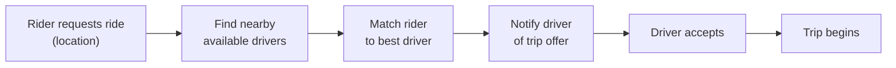
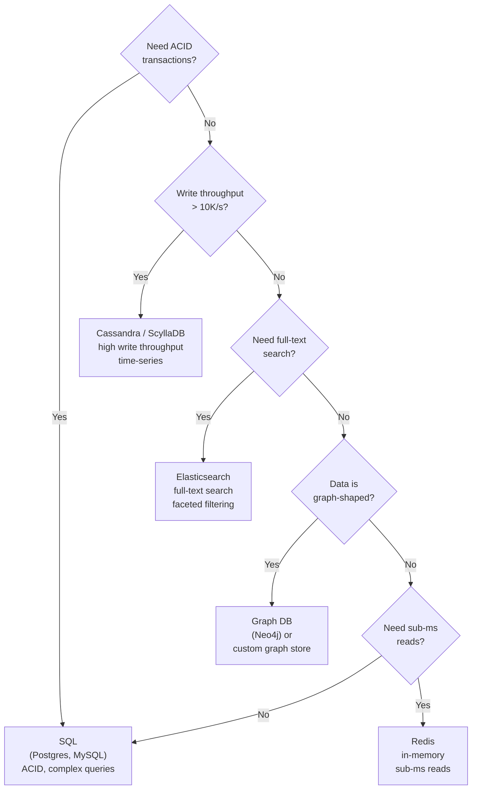
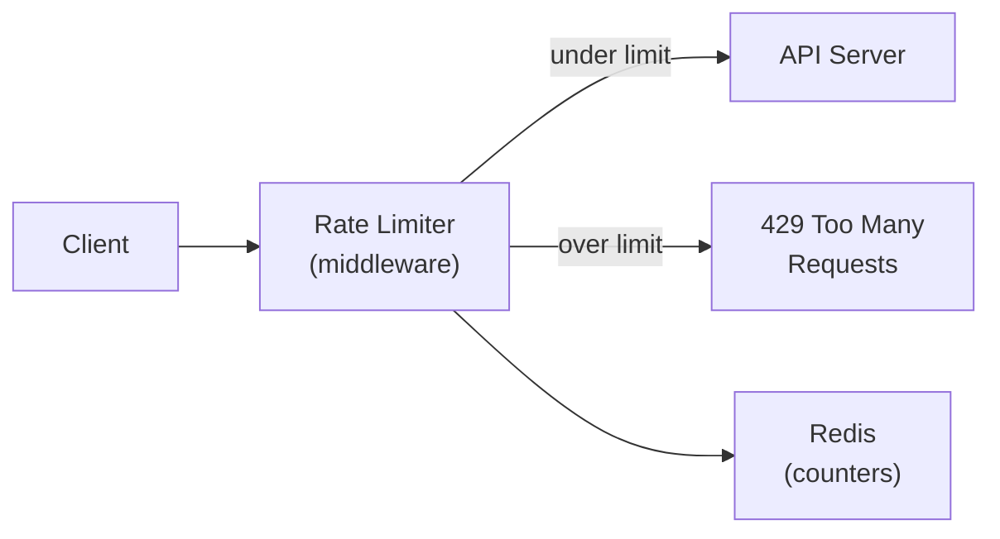
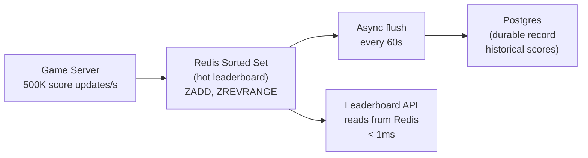
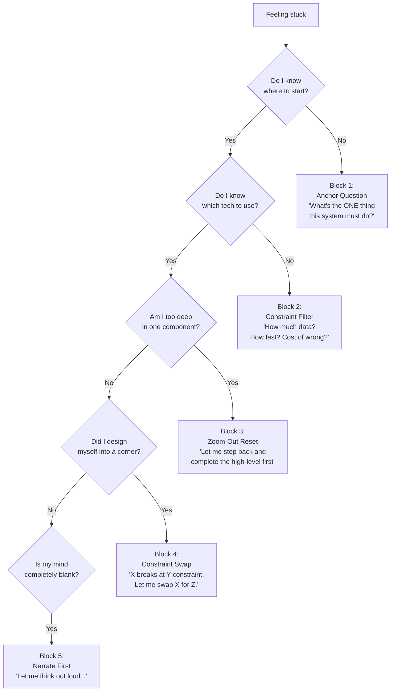

# System Design Interview Framework

A repeatable, structured approach for tackling any system design question. Use this as your playbook — not a rigid script, but a mental checklist that keeps you organized and signals seniority to interviewers.

---

## The 6-Step Framework

```
Step 1 → Clarify Requirements        (3–5 min)
Step 2 → Back-of-the-Envelope        (3–5 min)
Step 3 → High-Level Design           (10–15 min)
Step 4 → Detailed Component Design   (10–15 min)
Step 5 → Decision Log                (ongoing)
Step 6 → Bottlenecks & Trade-offs    (5 min)
```

Total target: ~45 minutes. Adjust depth based on interview length.

---

## Step 1 — Clarify Requirements

**Never start drawing boxes until you understand what you're building.**

The goal is to narrow the problem space and surface hidden assumptions. Ask questions in two categories:

### Functional Requirements (what the system does)
- What are the core user-facing features? (write these down explicitly)
- What is explicitly out of scope?
- Who are the users? (consumers, businesses, internal tools)
- What does a "happy path" look like end to end?

### Non-Functional Requirements (how well it does it)
- Scale: How many users? DAU / MAU? Requests per second?
- Latency: Is this read-heavy or write-heavy? What's the acceptable p99?
- Availability: 99.9%? 99.99%? What's the cost of downtime?
- Consistency: Strong or eventual? Can users see stale data?
- Durability: What happens if we lose data? Is data loss ever acceptable?
- Geography: Single region or global?

### Template to fill in
```
System: _______________

Functional:
  - Core: _______________
  - Out of scope: _______________

Non-Functional:
  - DAU: _______________
  - Read:Write ratio: _______________
  - Latency target: _______________
  - Availability: _______________
  - Consistency model: _______________
```

### Example — "Design Twitter"
```
Functional:
  - Post tweets (≤280 chars)
  - Follow users
  - View home timeline (tweets from followed users)
  - Out of scope: ads, DMs, trends, notifications

Non-Functional:
  - 300M DAU
  - Read-heavy: 100:1 read/write ratio
  - Timeline latency: <200ms p99
  - Availability: 99.99% (Twitter is a public utility)
  - Eventual consistency acceptable for timelines
```

---

## Step 2 — Back-of-the-Envelope Estimates

**Numbers anchor every design decision that follows.** Rough is fine — the point is to identify the order of magnitude and spot where the hard problems are.

### Key numbers to memorize

| Metric | Value |
|--------|-------|
| 1 million requests/day | ~12 req/s |
| 1 billion requests/day | ~12,000 req/s |
| 1 KB × 1M users | 1 GB |
| 1 KB × 1B users | 1 TB |
| SSD read latency | ~0.1 ms |
| Network round trip (same DC) | ~0.5 ms |
| Network round trip (cross-region) | ~100–150 ms |
| HDD sequential read | ~100 MB/s |
| SSD sequential read | ~500 MB/s |
| Network bandwidth (1 GbE) | ~125 MB/s |

### What to estimate

1. **Traffic** — requests per second (read and write separately)
2. **Storage** — data per object × objects per day × retention period
3. **Bandwidth** — bytes per request × requests per second
4. **Memory** — what fits in cache? (80/20 rule: cache the hot 20%)

### Template
```
Traffic:
  Writes: ___ /day → ___ /s
  Reads:  ___ /day → ___ /s (read:write = ___:1)

Storage:
  Object size: ___ KB
  New objects/day: ___
  Retention: ___ years
  Total: ___ TB

Bandwidth:
  Ingress: ___ MB/s
  Egress:  ___ MB/s

Cache:
  Working set (20% of data): ___ GB
  → fits in memory? ___
```

### Example — "Design Twitter"
```
Traffic:
  Tweets: 300M DAU × 1 tweet/5 days = 60M tweets/day → 700 writes/s
  Reads:  100:1 ratio → 70,000 reads/s

Storage:
  Tweet: 280 chars + metadata ≈ 1 KB
  60M tweets/day × 1 KB = 60 GB/day
  5 years retention → ~110 TB

Bandwidth:
  Egress: 70,000 reads/s × 1 KB = 70 MB/s

Cache:
  Hot tweets (20% of daily): 60 GB × 20% = 12 GB → fits in RAM ✅
```

---

## Step 3 — High-Level Design

Draw the system as a small number of boxes (5–8). This is your "napkin diagram." Don't go deep yet — establish the skeleton.

### Standard building blocks to consider

```
Client → CDN → API Gateway → Services → Data Stores
                                ↓
                         Message Queue
                                ↓
                        Background Workers
```

| Component | When to reach for it |
|-----------|---------------------|
| CDN | Static assets, geographically distributed reads |
| API Gateway | Auth, rate limiting, routing, SSL termination |
| Load Balancer | Horizontal scaling of stateless services |
| Cache (Redis) | Hot reads, session state, rate limit counters |
| Message Queue (Kafka/SQS) | Async processing, decoupling, fan-out |
| Object Store (S3) | Blobs, images, backups, large files |
| SQL DB | Structured data, ACID transactions, complex queries |
| NoSQL DB | High write throughput, flexible schema, horizontal scale |
| Search Index (Elasticsearch) | Full-text search, faceted filtering |

### High-level diagram template
```
┌──────────┐     ┌───────────┐     ┌──────────────┐
│  Client  │────▶│    CDN    │────▶│  API Gateway │
└──────────┘     └───────────┘     └──────┬───────┘
                                          │
                    ┌─────────────────────┼──────────────────────┐
                    ▼                     ▼                      ▼
             ┌────────────┐       ┌────────────┐        ┌────────────┐
             │ Service A  │       │ Service B  │        │ Service C  │
             └─────┬──────┘       └─────┬──────┘        └─────┬──────┘
                   │                    │                      │
             ┌─────▼──────┐      ┌──────▼─────┐       ┌───────▼────┐
             │  Primary   │      │   Cache    │       │  Message   │
             │    DB      │      │  (Redis)   │       │   Queue    │
             └────────────┘      └────────────┘       └────────────┘
```

### Walk through the happy path
After drawing the diagram, narrate one request end to end:
> "A user posts a tweet → hits the API Gateway → Auth Service validates JWT → Write Service inserts into DB → publishes event to Kafka → Fan-out Worker pushes to follower timelines in Redis."

This proves the design is coherent before you go deep.

---

## Step 4 — Detailed Component Design

Pick the 2–3 hardest or most interesting components and go deep. Don't try to detail everything — that signals poor prioritization.

### What to cover per component

**Data model / schema**
```sql
-- Be explicit about types, indexes, and constraints
CREATE TABLE tweets (
  tweet_id   BIGINT PRIMARY KEY,   -- Snowflake ID
  user_id    BIGINT NOT NULL,
  content    TEXT NOT NULL,
  created_at TIMESTAMPTZ DEFAULT now()
);
CREATE INDEX ON tweets(user_id, created_at DESC);
```

**API contract**
```
POST /tweets
  Body: { content: string }
  Response: { tweet_id, created_at }

GET /timeline?user_id=X&cursor=Y&limit=20
  Response: { tweets: [...], next_cursor }
```

**Core algorithm or data flow**
```
Timeline generation options:
  A. Fan-out on write  → pre-compute timelines in Redis
     + Fast reads (O(1))
     - Expensive for celebrities (100M followers)

  B. Fan-out on read   → query at read time
     + Simple writes
     - Slow reads (fan-in from N followees)

  C. Hybrid            → fan-out for normal users, fan-in for celebrities
     + Best of both
     - More complex
```

**Failure modes**
- What happens if this component goes down?
- What data could be lost?
- How does it recover?

---

## Step 5 — Decision Log

**The decision log is what separates senior engineers from junior ones.** Every non-obvious choice should be recorded as: context → options considered → decision → rationale → trade-offs accepted.

### Template per decision

```
Decision: [Short title]
Context:  [Why does this choice need to be made?]
Options:
  A. [Option] — pros / cons
  B. [Option] — pros / cons
  C. [Option] — pros / cons
Decision: [Chosen option]
Rationale: [Why this one given the constraints]
Trade-offs: [What you're giving up]
Revisit if: [Conditions that would change the decision]
```

### Example decision log entries

---

**Decision: Storage engine for tweet data**
Context: Need to store 700 writes/s with high read throughput and simple query patterns (lookup by user_id + time range).
Options:
- A. PostgreSQL — strong consistency, complex queries, vertical scaling limits
- B. Cassandra — high write throughput, wide-column model fits time-series, eventual consistency
- C. DynamoDB — managed, auto-scaling, limited query flexibility

Decision: Cassandra
Rationale: Write throughput and time-series access pattern are the dominant constraints. Eventual consistency is acceptable for timelines.
Trade-offs: No joins, no ad-hoc queries, operational complexity.
Revisit if: Query patterns become more complex or team lacks Cassandra expertise.

---

**Decision: Timeline delivery — fan-out on write vs. read**
Context: 300M DAU, celebrities with 100M+ followers, p99 timeline latency target <200ms.
Options:
- A. Fan-out on write — fast reads, expensive for celebrities
- B. Fan-out on read — simple writes, slow reads at scale
- C. Hybrid — fan-out for users with <1M followers, fan-in for celebrities

Decision: Hybrid (C)
Rationale: Pure fan-out breaks for celebrities. Pure fan-in can't hit 200ms at 70K reads/s. Hybrid handles both cases.
Trade-offs: Two code paths to maintain, need to classify users as "celebrity" dynamically.
Revisit if: Celebrity threshold needs tuning based on observed latency data.

---

### Common decisions you'll face in most designs

| Decision | Common options | Key question |
|----------|---------------|--------------|
| SQL vs NoSQL | Postgres, MySQL / Cassandra, DynamoDB, MongoDB | Do you need ACID? Complex queries? |
| Sync vs async | Direct call / Message queue | Can the caller wait? What if downstream is slow? |
| Cache strategy | Cache-aside, write-through, write-behind | Read-heavy or write-heavy? Stale data ok? |
| Consistency model | Strong / eventual / causal | What's the cost of stale or conflicting data? |
| ID generation | Auto-increment / UUID / Snowflake | Do you need sortability? Global uniqueness? |
| Sharding key | User ID / content ID / geography | What's the access pattern? Hot spots? |
| Auth mechanism | Session cookie / JWT / OAuth | Stateless services? Third-party identity? |

---

## Step 6 — Bottlenecks & Trade-offs

End by proactively identifying where the design will break and what you'd do about it. This shows you can think beyond the happy path.

### Checklist

**Single points of failure**
- Is every component redundant?
- What happens if the primary DB goes down?
- What happens if the cache is cold (cache stampede)?

**Hot spots**
- Is any shard or partition getting disproportionate traffic?
- Celebrity problem: one entity generating massive fan-out
- Hot key in cache: one key getting millions of reads/s

**Scaling limits**
- At 10× current load, what breaks first?
- At 100×?

**Data consistency edge cases**
- What if a write succeeds but the async fan-out fails?
- What if two users edit the same record concurrently?
- What if a client retries a request that already succeeded?

**Operational concerns**
- How do you deploy without downtime?
- How do you roll back a bad migration?
- How do you debug a latency spike at 3am?

### Mitigation patterns

| Problem | Mitigation |
|---------|-----------|
| DB overload | Read replicas, connection pooling, caching |
| Cache stampede | Probabilistic early expiry, mutex on cache miss |
| Hot shard | Consistent hashing, virtual nodes, shard splitting |
| Fan-out explosion | Hybrid fan-out, rate limiting, async with backpressure |
| Single point of failure | Active-active replication, circuit breakers |
| Thundering herd on restart | Staggered rollout, warm-up traffic shaping |

---

## Putting It All Together — Worked Example

**Question: Design a URL shortener (like bit.ly)**

### Step 1 — Requirements
```
Functional:
  - Shorten a long URL → short code (e.g. bit.ly/xK3p)
  - Redirect short URL → original URL
  - Out of scope: analytics, custom aliases, expiry

Non-Functional:
  - 100M new URLs/day
  - 10B redirects/day (100:1 read:write)
  - Redirect latency: <10ms p99
  - Availability: 99.99%
  - URLs never deleted (durable)
```

### Step 2 — Estimates
```
Writes: 100M/day → 1,200/s
Reads:  10B/day  → 116,000/s

Storage:
  1 URL record ≈ 500 bytes
  100M/day × 365 × 5 years = 182B records → ~91 TB

Bandwidth:
  Reads: 116,000/s × 500 bytes = 58 MB/s

Cache:
  Hot URLs (20% of daily): 100M × 20% × 500B = 10 GB → fits in RAM ✅
```

### Step 3 — High-Level Design
```
Client → CDN (cache redirects) → API Gateway
                                      │
                    ┌─────────────────┴──────────────────┐
                    ▼                                     ▼
             Write Service                         Redirect Service
             (generate code,                       (lookup code,
              store mapping)                        return 301)
                    │                                     │
                    ▼                                     ▼
              Primary DB ◀──────── Replication ──▶  Read Replicas
                                                          │
                                                     Redis Cache
```

### Step 4 — Detailed Design

**ID generation**
```
Options:
  A. MD5(long_url) → truncate to 7 chars — collision risk
  B. Auto-increment ID → encode in base62 — predictable, sequential
  C. Random 7-char base62 — unpredictable, collision check needed

Decision: B (base62 encode of auto-increment)
  62^7 = 3.5 trillion unique codes — enough for centuries
  No collision check needed
  Sortable by creation time
```

**Data model**
```sql
CREATE TABLE urls (
  id        BIGSERIAL PRIMARY KEY,
  code      CHAR(7) UNIQUE NOT NULL,  -- base62 encoded id
  long_url  TEXT NOT NULL,
  created_at TIMESTAMPTZ DEFAULT now()
);
CREATE INDEX ON urls(code);  -- primary lookup path
```

**Redirect flow**
```
1. Client hits GET /xK3p
2. Check Redis cache (key: "xK3p")
   → HIT: return 301 with cached long_url (< 1ms)
   → MISS: query read replica, populate cache, return 301
3. Cache TTL: 24h (URLs rarely change)
```

### Step 5 — Decision Log
```
Decision: 301 vs 302 redirect
Context: 301 = permanent (browser caches), 302 = temporary (no browser cache)
Options:
  A. 301 — reduces server load, but analytics are lost (browser goes direct)
  B. 302 — every redirect hits our servers, enables analytics
Decision: 301 for now (no analytics requirement)
Revisit if: analytics become a requirement
```

### Step 6 — Bottlenecks
```
Hot URLs: viral links get millions of hits/s
  → CDN caches the redirect at the edge, never hits origin

DB write bottleneck at 1,200/s:
  → Single primary handles this easily (Postgres: ~10K writes/s)
  → Shard by code prefix if needed at 100× scale

Cache cold start:
  → Pre-warm cache on deploy with top-N URLs
```

---

## Quick Reference Card

```
1. CLARIFY    → Functional + Non-functional requirements
2. ESTIMATE   → Traffic, storage, bandwidth, cache size
3. HIGH-LEVEL → 5–8 boxes, walk the happy path
4. DETAIL     → Schema, API, algorithm for 2–3 hard components
5. DECISIONS  → Context → Options → Choice → Rationale → Trade-offs
6. BOTTLENECKS → SPOFs, hot spots, failure modes, 10× scale
```

**Signals that impress interviewers:**
- You ask clarifying questions before drawing anything
- Your estimates drive your design choices
- You name trade-offs before the interviewer asks
- You have a reason for every technology choice
- You know where your design breaks and have a plan

**Signals that hurt:**
- Jumping to a solution before understanding the problem
- Picking technologies without justification ("I'll use Kafka" with no reason)
- Ignoring failure modes
- Treating the design as final rather than iterative

---

## Breaking Through Mental Blocks

Mental blocks in system design interviews are almost never about not knowing enough. They're caused by a small set of specific traps. Here's how to identify which trap you're in and get out of it.

---

### The 5 Mental Block Patterns

```
Block 1 → "I don't know where to start"         → Use the anchor question
Block 2 → "I don't know which technology to use" → Use the constraint filter
Block 3 → "I'm going too deep too fast"          → Use the zoom-out reset
Block 4 → "I've designed myself into a corner"   → Use the constraint swap
Block 5 → "My mind goes blank under pressure"    → Use the narrate-first technique
```

---

### Block 1 — "I don't know where to start"

**What's happening:** The problem feels too big. You're trying to hold the whole system in your head at once before drawing anything.

**The fix — The Anchor Question:**

Stop. Ask yourself one question: *"What is the single most important thing this system must do?"*

Not the full feature list. One thing. That becomes your anchor. Design outward from it.

**Example — "Design Uber"**

You freeze because Uber has: ride matching, GPS tracking, payments, ratings, surge pricing, driver onboarding, notifications...

Apply the anchor question:
> "The single most important thing Uber must do is: connect a rider to a nearby driver within seconds."

Now you have a starting point. Draw just that flow first:



Everything else (payments, ratings, surge) is secondary. You can add it after the core flow is solid. The anchor prevents you from drowning in scope.

---

### Block 2 — "I don't know which technology to use"

**What's happening:** You're trying to pick a database (or queue, or cache) before you know what constraints matter. Without constraints, every option looks equally valid — which is paralyzing.

**The fix — The Constraint Filter:**

Before naming any technology, answer these four questions about the data:

```
1. How much data? (KB / GB / TB / PB)
2. How fast does it need to be written? (writes/s)
3. How fast does it need to be read? (reads/s)
4. What's the cost of wrong data? (strong consistency vs. eventual)
```

The answers eliminate options. You don't choose a database — the constraints choose it for you.

**Example — "Design a notification system. What database do you use?"**

Without constraints, you're stuck. Apply the filter:

```
1. How much data?
   100M users × 50 notifications each = 5B rows × 200 bytes = 1 TB
   → Not huge. Most databases handle this.

2. Write speed?
   100M users × 10 notifications/day = 1B/day → ~11,600 writes/s
   → Moderate-high. Postgres starts struggling above ~10K writes/s.
   → Cassandra handles 100K+ writes/s easily.

3. Read speed?
   User opens app → fetch last 20 notifications
   100M DAU × 5 opens/day = 500M reads/day → ~5,800 reads/s
   → Moderate. Most databases handle this.

4. Cost of wrong data?
   Seeing a notification twice: annoying but not catastrophic.
   Missing a notification: bad UX but not a financial error.
   → Eventual consistency is acceptable.

Constraints say: high write throughput + eventual consistency + time-series access
→ Cassandra. Not because you memorized "use Cassandra for notifications"
   but because the constraints eliminated everything else.
```

**The constraint filter for common data stores:**



---

### Block 3 — "I'm going too deep too fast"

**What's happening:** You started explaining the internals of one component (e.g., how the database sharding works) before finishing the high-level design. Now you've lost the thread and don't know how the pieces connect.

**The fix — The Zoom-Out Reset:**

Say out loud: *"Let me step back and make sure the high-level picture is complete before going deeper."*

Then draw the full system as boxes — no internals, just names and arrows. Only after every box is on the diagram do you zoom into any one of them.

**Example — "Design a rate limiter"**

You start explaining token bucket algorithms in detail at minute 3. You've lost the interviewer.

Zoom-out reset:



Now you have 5 boxes. The interviewer can see the whole system. Now you can zoom into the rate limiter box and explain token bucket — with context.

**The rule:** Never go deeper than level 2 until level 1 is complete.

```
Level 1: boxes and arrows (the whole system)
Level 2: internals of one box (algorithm, schema, API)
Level 3: edge cases and failure modes within that box
```

---

### Block 4 — "I've designed myself into a corner"

**What's happening:** You made an early decision that seemed fine, but now you've realized it creates a problem you can't solve. For example: you chose a single SQL database, and now the interviewer asks how you handle 1M writes/s.

**The fix — The Constraint Swap:**

Name the constraint that your current design violates, then swap the component that can't satisfy it. Don't apologize — this is normal engineering.

Say: *"My current design uses X, which works well for [constraint A] but breaks at [constraint B]. Let me swap it for Y which handles [constraint B]."*

**Example — "Design a leaderboard. You chose Postgres. Now handle 500K score updates/s."**

You're in a corner: Postgres can't handle 500K writes/s.

Apply the constraint swap:

```
Current design: Postgres for scores
Constraint violated: 500K writes/s (Postgres limit: ~10K/s)

Swap: Replace Postgres writes with Redis sorted sets for the hot path

New design:
  Score update → Redis ZADD leaderboard <score> <user_id>  (O(log N), sub-ms)
  Leaderboard read → Redis ZREVRANGE leaderboard 0 99      (top 100, O(log N + 100))
  Persistence → async flush to Postgres every 60s for durability

Result: Redis handles 500K writes/s easily.
        Postgres retains the durable record.
        Both constraints satisfied.
```



The constraint swap works because you're not abandoning your design — you're surgically replacing the one component that can't meet the new constraint.

---

### Block 5 — "My mind goes blank under pressure"

**What's happening:** Anxiety, not ignorance. The pressure of being watched causes working memory to collapse. You know this stuff — you just can't access it right now.

**The fix — The Narrate-First Technique:**

Stop trying to think silently. Start talking. Say exactly what you're doing, even if it's obvious.

> "I'm going to start by writing down the functional requirements so I don't lose track of scope..."
> "I'm thinking about the write path first because that's where the scale constraint lives..."
> "I'm not sure about this part yet — let me put a placeholder and come back to it..."

Narrating does three things:
1. It buys you time while your brain catches up
2. It shows the interviewer your thought process (which is what they're actually evaluating)
3. It breaks the silence loop — silence amplifies anxiety; talking reduces it

**Example — You freeze on "Design a search autocomplete system"**

Instead of sitting silently:

> "Okay, let me think through this out loud. The core feature is: user types 'app' and sees suggestions like 'apple', 'application', 'app store'. So the read path is: given a prefix, return top-N matching strings ranked by popularity. That's the core problem. Let me figure out what data structure handles prefix lookups efficiently..."

Now you're moving. The trie data structure will come to you once you've articulated the problem. The narration unlocked it.

**The narrate-first script for when you're completely stuck:**

```
"Let me think about this from first principles."
  → Buys 10 seconds, signals you're methodical not lost

"The core constraint here is [X]."
  → Forces you to identify what actually matters

"If I ignore scale for a moment, the simplest solution would be [Y]."
  → Gives you a starting point; you can add scale after

"The problem with [Y] at scale is [Z]."
  → Now you're reasoning about trade-offs, which is the interview

"So I need to replace [Y] with something that handles [Z]."
  → You're back on track
```

---

### The Mental Block Decision Tree

Use this when you feel stuck:



---

### One More Thing — The "I Don't Know" Move

If you genuinely don't know something (a specific technology, an algorithm), say so directly and reason around it. This is better than guessing and getting caught.

> "I'm not familiar with the internals of Kafka's replication protocol, but I know it provides durable, ordered, partitioned log storage — which is what I need here. I'd use it for that property and look up the specifics before implementation."

This shows intellectual honesty and the ability to reason about systems at the right level of abstraction — both of which interviewers value more than memorized trivia.
