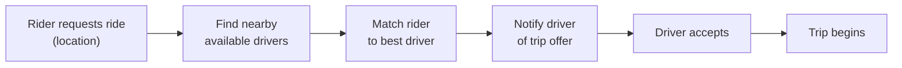
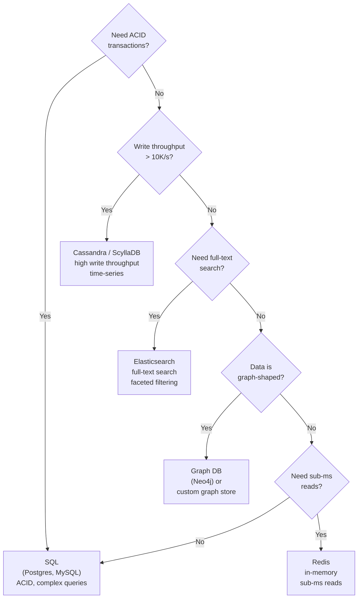
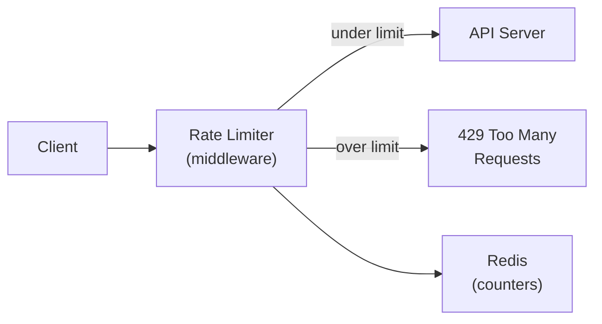
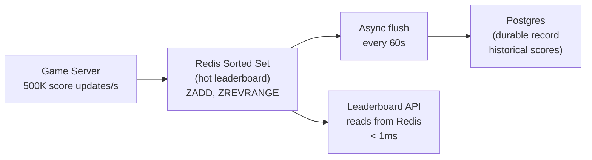
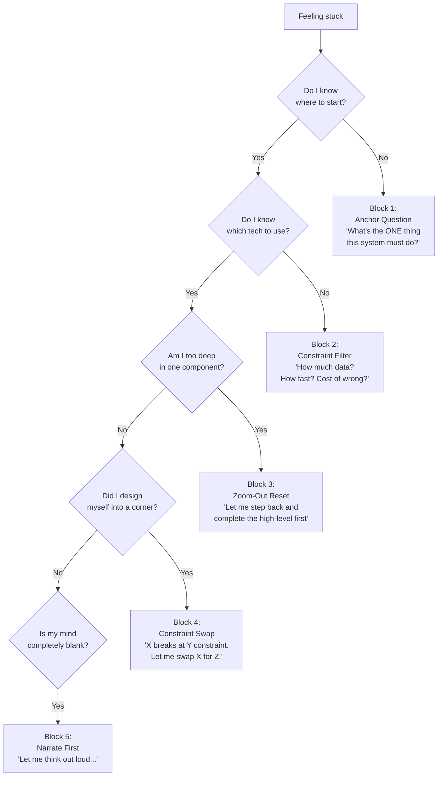
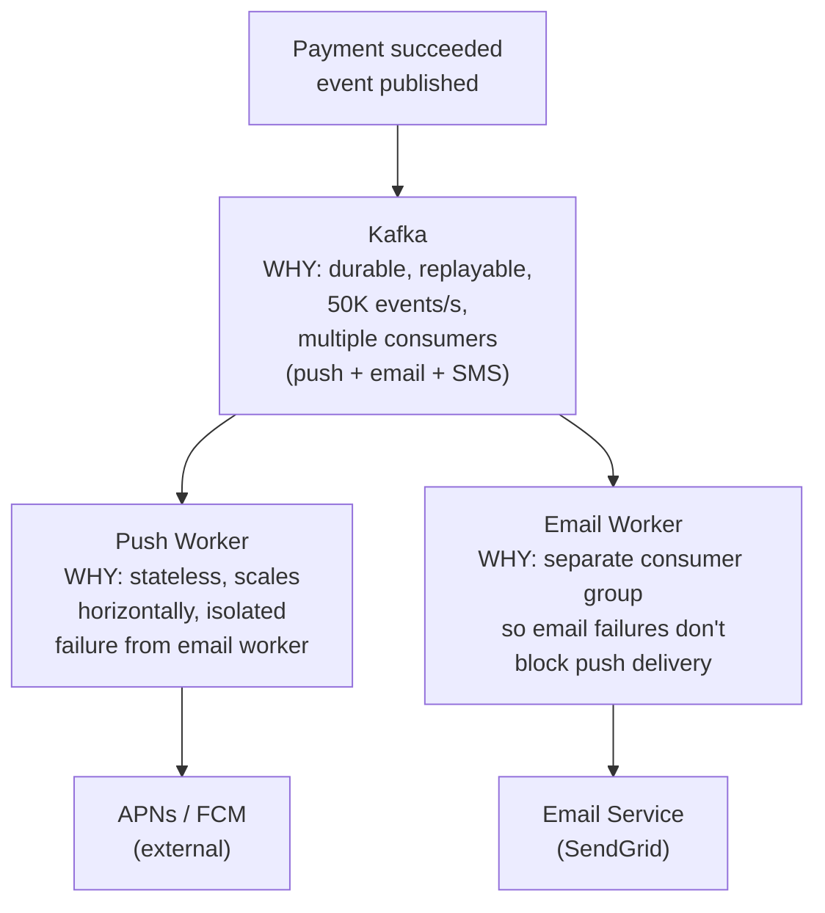
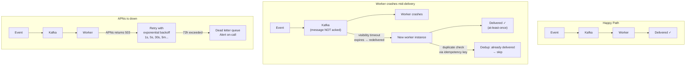
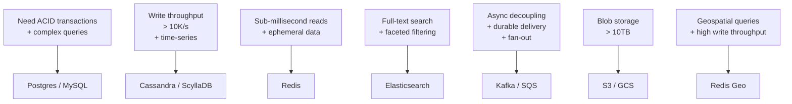
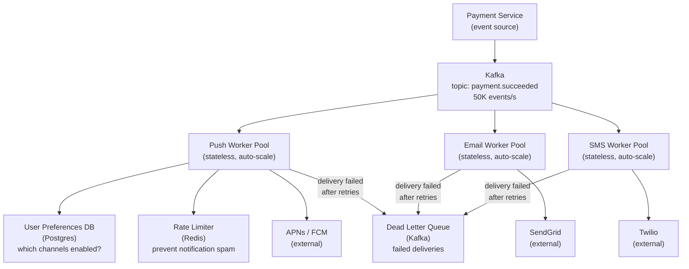
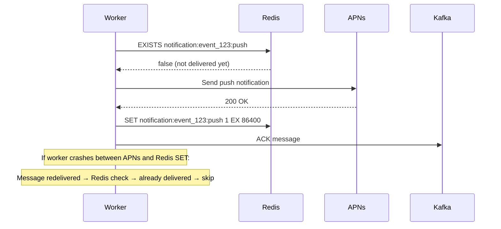

# System Design Interview Framework

A repeatable, structured approach for tackling any system design question. Use this as your playbook — not a rigid script, but a mental checklist that keeps you organized and signals seniority to interviewers.

---

## The 6-Step Framework

```
Step 1 → Clarify Requirements        (3–5 min)
Step 2 → Back-of-the-Envelope        (3–5 min)
Step 3 → High-Level Design           (10–15 min)
Step 4 → Detailed Component Design   (10–15 min)
Step 5 → Decision Log                (ongoing)
Step 6 → Bottlenecks & Trade-offs    (5 min)
```

Total target: ~45 minutes. Adjust depth based on interview length.

---

## Step 1 — Clarify Requirements

**Never start drawing boxes until you understand what you're building.**

The goal is to narrow the problem space and surface hidden assumptions. Ask questions in two categories:

### Functional Requirements (what the system does)
- What are the core user-facing features? (write these down explicitly)
- What is explicitly out of scope?
- Who are the users? (consumers, businesses, internal tools)
- What does a "happy path" look like end to end?

### Non-Functional Requirements (how well it does it)
- Scale: How many users? DAU / MAU? Requests per second?
- Latency: Is this read-heavy or write-heavy? What's the acceptable p99?
- Availability: 99.9%? 99.99%? What's the cost of downtime?
- Consistency: Strong or eventual? Can users see stale data?
- Durability: What happens if we lose data? Is data loss ever acceptable?
- Geography: Single region or global?

### Template to fill in
```
System: _______________

Functional:
  - Core: _______________
  - Out of scope: _______________

Non-Functional:
  - DAU: _______________
  - Read:Write ratio: _______________
  - Latency target: _______________
  - Availability: _______________
  - Consistency model: _______________
```

### Example — "Design Twitter"
```
Functional:
  - Post tweets (≤280 chars)
  - Follow users
  - View home timeline (tweets from followed users)
  - Out of scope: ads, DMs, trends, notifications

Non-Functional:
  - 300M DAU
  - Read-heavy: 100:1 read/write ratio
  - Timeline latency: <200ms p99
  - Availability: 99.99% (Twitter is a public utility)
  - Eventual consistency acceptable for timelines
```

---

## Step 2 — Back-of-the-Envelope Estimates

**Numbers anchor every design decision that follows.** Rough is fine — the point is to identify the order of magnitude and spot where the hard problems are.

### Key numbers to memorize

| Metric | Value |
|--------|-------|
| 1 million requests/day | ~12 req/s |
| 1 billion requests/day | ~12,000 req/s |
| 1 KB × 1M users | 1 GB |
| 1 KB × 1B users | 1 TB |
| SSD read latency | ~0.1 ms |
| Network round trip (same DC) | ~0.5 ms |
| Network round trip (cross-region) | ~100–150 ms |
| HDD sequential read | ~100 MB/s |
| SSD sequential read | ~500 MB/s |
| Network bandwidth (1 GbE) | ~125 MB/s |

### What to estimate

1. **Traffic** — requests per second (read and write separately)
2. **Storage** — data per object × objects per day × retention period
3. **Bandwidth** — bytes per request × requests per second
4. **Memory** — what fits in cache? (80/20 rule: cache the hot 20%)

### Template
```
Traffic:
  Writes: ___ /day → ___ /s
  Reads:  ___ /day → ___ /s (read:write = ___:1)

Storage:
  Object size: ___ KB
  New objects/day: ___
  Retention: ___ years
  Total: ___ TB

Bandwidth:
  Ingress: ___ MB/s
  Egress:  ___ MB/s

Cache:
  Working set (20% of data): ___ GB
  → fits in memory? ___
```

### Example — "Design Twitter"
```
Traffic:
  Tweets: 300M DAU × 1 tweet/5 days = 60M tweets/day → 700 writes/s
  Reads:  100:1 ratio → 70,000 reads/s

Storage:
  Tweet: 280 chars + metadata ≈ 1 KB
  60M tweets/day × 1 KB = 60 GB/day
  5 years retention → ~110 TB

Bandwidth:
  Egress: 70,000 reads/s × 1 KB = 70 MB/s

Cache:
  Hot tweets (20% of daily): 60 GB × 20% = 12 GB → fits in RAM ✅
```

---

## Step 3 — High-Level Design

Draw the system as a small number of boxes (5–8). This is your "napkin diagram." Don't go deep yet — establish the skeleton.

### Standard building blocks to consider

```
Client → CDN → API Gateway → Services → Data Stores
                                ↓
                         Message Queue
                                ↓
                        Background Workers
```

| Component | When to reach for it |
|-----------|---------------------|
| CDN | Static assets, geographically distributed reads |
| API Gateway | Auth, rate limiting, routing, SSL termination |
| Load Balancer | Horizontal scaling of stateless services |
| Cache (Redis) | Hot reads, session state, rate limit counters |
| Message Queue (Kafka/SQS) | Async processing, decoupling, fan-out |
| Object Store (S3) | Blobs, images, backups, large files |
| SQL DB | Structured data, ACID transactions, complex queries |
| NoSQL DB | High write throughput, flexible schema, horizontal scale |
| Search Index (Elasticsearch) | Full-text search, faceted filtering |

### High-level diagram template
```
┌──────────┐     ┌───────────┐     ┌──────────────┐
│  Client  │────▶│    CDN    │────▶│  API Gateway │
└──────────┘     └───────────┘     └──────┬───────┘
                                          │
                    ┌─────────────────────┼──────────────────────┐
                    ▼                     ▼                      ▼
             ┌────────────┐       ┌────────────┐        ┌────────────┐
             │ Service A  │       │ Service B  │        │ Service C  │
             └─────┬──────┘       └─────┬──────┘        └─────┬──────┘
                   │                    │                      │
             ┌─────▼──────┐      ┌──────▼─────┐       ┌───────▼────┐
             │  Primary   │      │   Cache    │       │  Message   │
             │    DB      │      │  (Redis)   │       │   Queue    │
             └────────────┘      └────────────┘       └────────────┘
```

### Walk through the happy path
After drawing the diagram, narrate one request end to end:
> "A user posts a tweet → hits the API Gateway → Auth Service validates JWT → Write Service inserts into DB → publishes event to Kafka → Fan-out Worker pushes to follower timelines in Redis."

This proves the design is coherent before you go deep.

---

## Step 4 — Detailed Component Design

Pick the 2–3 hardest or most interesting components and go deep. Don't try to detail everything — that signals poor prioritization.

### What to cover per component

**Data model / schema**
```sql
-- Be explicit about types, indexes, and constraints
CREATE TABLE tweets (
  tweet_id   BIGINT PRIMARY KEY,   -- Snowflake ID
  user_id    BIGINT NOT NULL,
  content    TEXT NOT NULL,
  created_at TIMESTAMPTZ DEFAULT now()
);
CREATE INDEX ON tweets(user_id, created_at DESC);
```

**API contract**
```
POST /tweets
  Body: { content: string }
  Response: { tweet_id, created_at }

GET /timeline?user_id=X&cursor=Y&limit=20
  Response: { tweets: [...], next_cursor }
```

**Core algorithm or data flow**
```
Timeline generation options:
  A. Fan-out on write  → pre-compute timelines in Redis
     + Fast reads (O(1))
     - Expensive for celebrities (100M followers)

  B. Fan-out on read   → query at read time
     + Simple writes
     - Slow reads (fan-in from N followees)

  C. Hybrid            → fan-out for normal users, fan-in for celebrities
     + Best of both
     - More complex
```

**Failure modes**
- What happens if this component goes down?
- What data could be lost?
- How does it recover?

---

## Step 5 — Decision Log

**The decision log is what separates senior engineers from junior ones.** Every non-obvious choice should be recorded as: context → options considered → decision → rationale → trade-offs accepted.

### Template per decision

```
Decision: [Short title]
Context:  [Why does this choice need to be made?]
Options:
  A. [Option] — pros / cons
  B. [Option] — pros / cons
  C. [Option] — pros / cons
Decision: [Chosen option]
Rationale: [Why this one given the constraints]
Trade-offs: [What you're giving up]
Revisit if: [Conditions that would change the decision]
```

### Example decision log entries

---

**Decision: Storage engine for tweet data**
Context: Need to store 700 writes/s with high read throughput and simple query patterns (lookup by user_id + time range).
Options:
- A. PostgreSQL — strong consistency, complex queries, vertical scaling limits
- B. Cassandra — high write throughput, wide-column model fits time-series, eventual consistency
- C. DynamoDB — managed, auto-scaling, limited query flexibility

Decision: Cassandra
Rationale: Write throughput and time-series access pattern are the dominant constraints. Eventual consistency is acceptable for timelines.
Trade-offs: No joins, no ad-hoc queries, operational complexity.
Revisit if: Query patterns become more complex or team lacks Cassandra expertise.

---

**Decision: Timeline delivery — fan-out on write vs. read**
Context: 300M DAU, celebrities with 100M+ followers, p99 timeline latency target <200ms.
Options:
- A. Fan-out on write — fast reads, expensive for celebrities
- B. Fan-out on read — simple writes, slow reads at scale
- C. Hybrid — fan-out for users with <1M followers, fan-in for celebrities

Decision: Hybrid (C)
Rationale: Pure fan-out breaks for celebrities. Pure fan-in can't hit 200ms at 70K reads/s. Hybrid handles both cases.
Trade-offs: Two code paths to maintain, need to classify users as "celebrity" dynamically.
Revisit if: Celebrity threshold needs tuning based on observed latency data.

---

### Common decisions you'll face in most designs

| Decision | Common options | Key question |
|----------|---------------|--------------|
| SQL vs NoSQL | Postgres, MySQL / Cassandra, DynamoDB, MongoDB | Do you need ACID? Complex queries? |
| Sync vs async | Direct call / Message queue | Can the caller wait? What if downstream is slow? |
| Cache strategy | Cache-aside, write-through, write-behind | Read-heavy or write-heavy? Stale data ok? |
| Consistency model | Strong / eventual / causal | What's the cost of stale or conflicting data? |
| ID generation | Auto-increment / UUID / Snowflake | Do you need sortability? Global uniqueness? |
| Sharding key | User ID / content ID / geography | What's the access pattern? Hot spots? |
| Auth mechanism | Session cookie / JWT / OAuth | Stateless services? Third-party identity? |

---

## Step 6 — Bottlenecks & Trade-offs

End by proactively identifying where the design will break and what you'd do about it. This shows you can think beyond the happy path.

### Checklist

**Single points of failure**
- Is every component redundant?
- What happens if the primary DB goes down?
- What happens if the cache is cold (cache stampede)?

**Hot spots**
- Is any shard or partition getting disproportionate traffic?
- Celebrity problem: one entity generating massive fan-out
- Hot key in cache: one key getting millions of reads/s

**Scaling limits**
- At 10× current load, what breaks first?
- At 100×?

**Data consistency edge cases**
- What if a write succeeds but the async fan-out fails?
- What if two users edit the same record concurrently?
- What if a client retries a request that already succeeded?

**Operational concerns**
- How do you deploy without downtime?
- How do you roll back a bad migration?
- How do you debug a latency spike at 3am?

### Mitigation patterns

| Problem | Mitigation |
|---------|-----------|
| DB overload | Read replicas, connection pooling, caching |
| Cache stampede | Probabilistic early expiry, mutex on cache miss |
| Hot shard | Consistent hashing, virtual nodes, shard splitting |
| Fan-out explosion | Hybrid fan-out, rate limiting, async with backpressure |
| Single point of failure | Active-active replication, circuit breakers |
| Thundering herd on restart | Staggered rollout, warm-up traffic shaping |

---

## Putting It All Together — Worked Example

**Question: Design a URL shortener (like bit.ly)**

### Step 1 — Requirements
```
Functional:
  - Shorten a long URL → short code (e.g. bit.ly/xK3p)
  - Redirect short URL → original URL
  - Out of scope: analytics, custom aliases, expiry

Non-Functional:
  - 100M new URLs/day
  - 10B redirects/day (100:1 read:write)
  - Redirect latency: <10ms p99
  - Availability: 99.99%
  - URLs never deleted (durable)
```

### Step 2 — Estimates
```
Writes: 100M/day → 1,200/s
Reads:  10B/day  → 116,000/s

Storage:
  1 URL record ≈ 500 bytes
  100M/day × 365 × 5 years = 182B records → ~91 TB

Bandwidth:
  Reads: 116,000/s × 500 bytes = 58 MB/s

Cache:
  Hot URLs (20% of daily): 100M × 20% × 500B = 10 GB → fits in RAM ✅
```

### Step 3 — High-Level Design
```
Client → CDN (cache redirects) → API Gateway
                                      │
                    ┌─────────────────┴──────────────────┐
                    ▼                                     ▼
             Write Service                         Redirect Service
             (generate code,                       (lookup code,
              store mapping)                        return 301)
                    │                                     │
                    ▼                                     ▼
              Primary DB ◀──────── Replication ──▶  Read Replicas
                                                          │
                                                     Redis Cache
```

### Step 4 — Detailed Design

**ID generation**
```
Options:
  A. MD5(long_url) → truncate to 7 chars — collision risk
  B. Auto-increment ID → encode in base62 — predictable, sequential
  C. Random 7-char base62 — unpredictable, collision check needed

Decision: B (base62 encode of auto-increment)
  62^7 = 3.5 trillion unique codes — enough for centuries
  No collision check needed
  Sortable by creation time
```

**Data model**
```sql
CREATE TABLE urls (
  id        BIGSERIAL PRIMARY KEY,
  code      CHAR(7) UNIQUE NOT NULL,  -- base62 encoded id
  long_url  TEXT NOT NULL,
  created_at TIMESTAMPTZ DEFAULT now()
);
CREATE INDEX ON urls(code);  -- primary lookup path
```

**Redirect flow**
```
1. Client hits GET /xK3p
2. Check Redis cache (key: "xK3p")
   → HIT: return 301 with cached long_url (< 1ms)
   → MISS: query read replica, populate cache, return 301
3. Cache TTL: 24h (URLs rarely change)
```

### Step 5 — Decision Log
```
Decision: 301 vs 302 redirect
Context: 301 = permanent (browser caches), 302 = temporary (no browser cache)
Options:
  A. 301 — reduces server load, but analytics are lost (browser goes direct)
  B. 302 — every redirect hits our servers, enables analytics
Decision: 301 for now (no analytics requirement)
Revisit if: analytics become a requirement
```

### Step 6 — Bottlenecks
```
Hot URLs: viral links get millions of hits/s
  → CDN caches the redirect at the edge, never hits origin

DB write bottleneck at 1,200/s:
  → Single primary handles this easily (Postgres: ~10K writes/s)
  → Shard by code prefix if needed at 100× scale

Cache cold start:
  → Pre-warm cache on deploy with top-N URLs
```

---

## Quick Reference Card

```
1. CLARIFY    → Functional + Non-functional requirements
2. ESTIMATE   → Traffic, storage, bandwidth, cache size
3. HIGH-LEVEL → 5–8 boxes, walk the happy path
4. DETAIL     → Schema, API, algorithm for 2–3 hard components
5. DECISIONS  → Context → Options → Choice → Rationale → Trade-offs
6. BOTTLENECKS → SPOFs, hot spots, failure modes, 10× scale
```

**Signals that impress interviewers:**
- You ask clarifying questions before drawing anything
- Your estimates drive your design choices
- You name trade-offs before the interviewer asks
- You have a reason for every technology choice
- You know where your design breaks and have a plan

**Signals that hurt:**
- Jumping to a solution before understanding the problem
- Picking technologies without justification ("I'll use Kafka" with no reason)
- Ignoring failure modes
- Treating the design as final rather than iterative

---

## Breaking Through Mental Blocks

Mental blocks in system design interviews are almost never about not knowing enough. They're caused by a small set of specific traps. Here's how to identify which trap you're in and get out of it.

---

### The 5 Mental Block Patterns

```
Block 1 → "I don't know where to start"         → Use the anchor question
Block 2 → "I don't know which technology to use" → Use the constraint filter
Block 3 → "I'm going too deep too fast"          → Use the zoom-out reset
Block 4 → "I've designed myself into a corner"   → Use the constraint swap
Block 5 → "My mind goes blank under pressure"    → Use the narrate-first technique
```

---

### Block 1 — "I don't know where to start"

**What's happening:** The problem feels too big. You're trying to hold the whole system in your head at once before drawing anything.

**The fix — The Anchor Question:**

Stop. Ask yourself one question: *"What is the single most important thing this system must do?"*

Not the full feature list. One thing. That becomes your anchor. Design outward from it.

**Example — "Design Uber"**

You freeze because Uber has: ride matching, GPS tracking, payments, ratings, surge pricing, driver onboarding, notifications...

Apply the anchor question:
> "The single most important thing Uber must do is: connect a rider to a nearby driver within seconds."

Now you have a starting point. Draw just that flow first:



Everything else (payments, ratings, surge) is secondary. You can add it after the core flow is solid. The anchor prevents you from drowning in scope.

---

### Block 2 — "I don't know which technology to use"

**What's happening:** You're trying to pick a database (or queue, or cache) before you know what constraints matter. Without constraints, every option looks equally valid — which is paralyzing.

**The fix — The Constraint Filter:**

Before naming any technology, answer these four questions about the data:

```
1. How much data? (KB / GB / TB / PB)
2. How fast does it need to be written? (writes/s)
3. How fast does it need to be read? (reads/s)
4. What's the cost of wrong data? (strong consistency vs. eventual)
```

The answers eliminate options. You don't choose a database — the constraints choose it for you.

**Example — "Design a notification system. What database do you use?"**

Without constraints, you're stuck. Apply the filter:

```
1. How much data?
   100M users × 50 notifications each = 5B rows × 200 bytes = 1 TB
   → Not huge. Most databases handle this.

2. Write speed?
   100M users × 10 notifications/day = 1B/day → ~11,600 writes/s
   → Moderate-high. Postgres starts struggling above ~10K writes/s.
   → Cassandra handles 100K+ writes/s easily.

3. Read speed?
   User opens app → fetch last 20 notifications
   100M DAU × 5 opens/day = 500M reads/day → ~5,800 reads/s
   → Moderate. Most databases handle this.

4. Cost of wrong data?
   Seeing a notification twice: annoying but not catastrophic.
   Missing a notification: bad UX but not a financial error.
   → Eventual consistency is acceptable.

Constraints say: high write throughput + eventual consistency + time-series access
→ Cassandra. Not because you memorized "use Cassandra for notifications"
   but because the constraints eliminated everything else.
```

**The constraint filter for common data stores:**



---

### Block 3 — "I'm going too deep too fast"

**What's happening:** You started explaining the internals of one component (e.g., how the database sharding works) before finishing the high-level design. Now you've lost the thread and don't know how the pieces connect.

**The fix — The Zoom-Out Reset:**

Say out loud: *"Let me step back and make sure the high-level picture is complete before going deeper."*

Then draw the full system as boxes — no internals, just names and arrows. Only after every box is on the diagram do you zoom into any one of them.

**Example — "Design a rate limiter"**

You start explaining token bucket algorithms in detail at minute 3. You've lost the interviewer.

Zoom-out reset:



Now you have 5 boxes. The interviewer can see the whole system. Now you can zoom into the rate limiter box and explain token bucket — with context.

**The rule:** Never go deeper than level 2 until level 1 is complete.

```
Level 1: boxes and arrows (the whole system)
Level 2: internals of one box (algorithm, schema, API)
Level 3: edge cases and failure modes within that box
```

---

### Block 4 — "I've designed myself into a corner"

**What's happening:** You made an early decision that seemed fine, but now you've realized it creates a problem you can't solve. For example: you chose a single SQL database, and now the interviewer asks how you handle 1M writes/s.

**The fix — The Constraint Swap:**

Name the constraint that your current design violates, then swap the component that can't satisfy it. Don't apologize — this is normal engineering.

Say: *"My current design uses X, which works well for [constraint A] but breaks at [constraint B]. Let me swap it for Y which handles [constraint B]."*

**Example — "Design a leaderboard. You chose Postgres. Now handle 500K score updates/s."**

You're in a corner: Postgres can't handle 500K writes/s.

Apply the constraint swap:

```
Current design: Postgres for scores
Constraint violated: 500K writes/s (Postgres limit: ~10K/s)

Swap: Replace Postgres writes with Redis sorted sets for the hot path

New design:
  Score update → Redis ZADD leaderboard <score> <user_id>  (O(log N), sub-ms)
  Leaderboard read → Redis ZREVRANGE leaderboard 0 99      (top 100, O(log N + 100))
  Persistence → async flush to Postgres every 60s for durability

Result: Redis handles 500K writes/s easily.
        Postgres retains the durable record.
        Both constraints satisfied.
```



The constraint swap works because you're not abandoning your design — you're surgically replacing the one component that can't meet the new constraint.

---

### Block 5 — "My mind goes blank under pressure"

**What's happening:** Anxiety, not ignorance. The pressure of being watched causes working memory to collapse. You know this stuff — you just can't access it right now.

**The fix — The Narrate-First Technique:**

Stop trying to think silently. Start talking. Say exactly what you're doing, even if it's obvious.

> "I'm going to start by writing down the functional requirements so I don't lose track of scope..."
> "I'm thinking about the write path first because that's where the scale constraint lives..."
> "I'm not sure about this part yet — let me put a placeholder and come back to it..."

Narrating does three things:
1. It buys you time while your brain catches up
2. It shows the interviewer your thought process (which is what they're actually evaluating)
3. It breaks the silence loop — silence amplifies anxiety; talking reduces it

**Example — You freeze on "Design a search autocomplete system"**

Instead of sitting silently:

> "Okay, let me think through this out loud. The core feature is: user types 'app' and sees suggestions like 'apple', 'application', 'app store'. So the read path is: given a prefix, return top-N matching strings ranked by popularity. That's the core problem. Let me figure out what data structure handles prefix lookups efficiently..."

Now you're moving. The trie data structure will come to you once you've articulated the problem. The narration unlocked it.

**The narrate-first script for when you're completely stuck:**

```
"Let me think about this from first principles."
  → Buys 10 seconds, signals you're methodical not lost

"The core constraint here is [X]."
  → Forces you to identify what actually matters

"If I ignore scale for a moment, the simplest solution would be [Y]."
  → Gives you a starting point; you can add scale after

"The problem with [Y] at scale is [Z]."
  → Now you're reasoning about trade-offs, which is the interview

"So I need to replace [Y] with something that handles [Z]."
  → You're back on track
```

---

### The Mental Block Decision Tree

Use this when you feel stuck:



---

### One More Thing — The "I Don't Know" Move

If you genuinely don't know something (a specific technology, an algorithm), say so directly and reason around it. This is better than guessing and getting caught.

> "I'm not familiar with the internals of Kafka's replication protocol, but I know it provides durable, ordered, partitioned log storage — which is what I need here. I'd use it for that property and look up the specifics before implementation."

This shows intellectual honesty and the ability to reason about systems at the right level of abstraction — both of which interviewers value more than memorized trivia.

---

## Estimation Deep Dive — A Simple, Repeatable Framework

Estimation in system design is not about being precise. It's about being **right by an order of magnitude** and using the numbers to make decisions. An estimate that's off by 2× is fine. An estimate that's off by 1000× means you'll design the wrong system.

The framework has three parts:
1. A small set of numbers to memorize (the cheat sheet)
2. A four-step process to apply every time
3. Worked examples for the most common estimation types

---

### Part 1 — The Cheat Sheet (Memorize These)

#### Time conversions
```
1 day   = 86,400 seconds  ≈ 100K seconds  (round up for easy math)
1 hour  = 3,600 seconds   ≈ 4K seconds
1 month = 2.5M seconds
1 year  = 31.5M seconds   ≈ 30M seconds
```

#### Traffic conversions (requests/day → requests/second)
```
1M  requests/day →    12/s
10M requests/day →   115/s  ≈ 100/s
100M requests/day → 1,150/s ≈ 1K/s
1B  requests/day → 11,500/s ≈ 10K/s

Shortcut: divide daily requests by 100K to get requests/second
  (uses the "1 day ≈ 100K seconds" approximation)
  Example: 500M/day ÷ 100K = 5,000/s
```

#### Data size intuition
```
Character (ASCII)    = 1 byte
Integer (32-bit)     = 4 bytes
Long / UUID          = 8–16 bytes
Typical DB row       = 100–500 bytes
Small JSON object    = 1 KB
Web page (HTML only) = 50 KB
Image (compressed)   = 100 KB – 3 MB
Audio (1 min, 128Kbps) = 1 MB
Video (1 min, 720p)  = 50–100 MB
```

#### Storage scale intuition
```
1 KB × 1M  = 1 GB
1 KB × 1B  = 1 TB
1 MB × 1M  = 1 TB
1 MB × 1B  = 1 PB
1 GB × 1M  = 1 PB

Shortcut: multiply the object size by the number of objects,
          then use the table above to read off the scale.
```

#### Throughput limits (what each component can handle)
```
Single Postgres instance:    ~10K writes/s,  ~100K reads/s
Single Cassandra node:       ~100K writes/s
Single Redis instance:       ~100K ops/s
Single Kafka broker:         ~1M messages/s
Single web server (8 cores): ~10K requests/s
CDN edge node:               ~100 Gbps bandwidth
1 GbE network link:          ~125 MB/s = 1 Gbps
10 GbE network link:         ~1.25 GB/s = 10 Gbps
SSD sequential read:         ~500 MB/s
SSD random read (IOPS):      ~100K IOPS
HDD sequential read:         ~100 MB/s
```

#### Latency intuition
```
L1 cache read:               ~1 ns
L2 cache read:               ~4 ns
RAM read:                    ~100 ns
SSD random read:             ~100 µs  (0.1 ms)
HDD random read:             ~10 ms
Network: same datacenter:    ~0.5 ms
Network: same region:        ~5 ms
Network: cross-region (US↔EU): ~100 ms
Network: cross-region (US↔Asia): ~150 ms
```

---

### Part 2 — The Four-Step Process

Apply these four steps in order for every estimation. Don't skip steps.

```
Step A → Anchor on users
Step B → Derive requests/s
Step C → Calculate storage
Step D → Calculate bandwidth
```

#### Step A — Anchor on Users

Start with the number of users. If the interviewer doesn't give it, ask or assume.

```
DAU (Daily Active Users) is your anchor.
Everything else is derived from it.

If you only know MAU, assume DAU = MAU × 0.5 (50% daily engagement)
  → Twitter: 350M MAU → ~175M DAU
  → Slack: 32M DAU (given directly)

If you know nothing, use these reference points:
  Small startup:    100K DAU
  Mid-size product: 10M DAU
  Large platform:   100M–1B DAU
```

#### Step B — Derive Requests/Second

From DAU, estimate how many actions each user takes per day, then convert.

```
Formula:
  requests/s = (DAU × actions_per_user_per_day) ÷ 100K

The "÷ 100K" shortcut works because 1 day ≈ 100K seconds.

Always separate reads from writes — they have different scaling implications.

Example:
  100M DAU
  Each user: reads feed 10×/day, posts 1×/day
  
  Read requests:  100M × 10 ÷ 100K = 10,000 reads/s
  Write requests: 100M × 1  ÷ 100K = 1,000 writes/s
  Read:write ratio = 10:1
```

#### Step C — Calculate Storage

```
Formula:
  storage = object_size × objects_per_day × retention_days

Then use the scale table to read off the unit.

Always ask: is this transient (delete after use) or permanent?
  Transient: storage = object_size × max_concurrent_objects
  Permanent: storage = object_size × objects_per_day × retention_days
```

#### Step D — Calculate Bandwidth

```
Formula:
  ingress bandwidth = write_request_size × writes/s
  egress bandwidth  = read_response_size × reads/s

Egress almost always dominates — reads outnumber writes and
responses are larger than requests.

Compare egress to your network link capacity to see if CDN is needed:
  If egress > 10 Gbps → CDN is not optional, it's required
```

---

### Part 3 — Worked Examples

#### Example 1 — Twitter (simple, read-heavy)

**Given:** 300M DAU

**Step A — Anchor**
```
DAU = 300M
```

**Step B — Requests/s**
```
User behavior:
  Posts:       1 tweet per 5 days = 0.2 tweets/day
  Feed reads:  10 timeline loads/day

Writes: 300M × 0.2 ÷ 100K = 600 writes/s
Reads:  300M × 10  ÷ 100K = 30,000 reads/s
Read:write ratio = 50:1  → heavily read-optimized
```

**Step C — Storage**
```
Object: 1 tweet ≈ 300 bytes (text + metadata)
Volume: 600 writes/s × 86,400s = 52M tweets/day
Retention: permanent (tweets don't expire)

Daily: 52M × 300B = 15.6 GB/day
5 years: 15.6 GB × 365 × 5 = ~28 TB

Media (photos/videos in ~30% of tweets):
  52M × 30% × 500KB avg = 7.8 TB/day  ← stored in object storage (S3)
  5 years: ~14 PB of media
```

**Step D — Bandwidth**
```
Ingress (writes):
  600 writes/s × 300B = 180 KB/s  ← trivial

Egress (reads):
  Each timeline load: 20 tweets × 300B = 6 KB
  30,000 reads/s × 6 KB = 180 MB/s

Media egress (CDN):
  30,000 reads/s × 30% with media × 500KB = 4.5 GB/s  ← CDN required
```

**What the numbers tell you:**
- Text data is tiny — Postgres handles it fine
- Media is 4.5 GB/s egress — CDN is mandatory, not optional
- 50:1 read:write ratio — cache aggressively, read replicas needed

---

#### Example 2 — WhatsApp (write-heavy, transient storage)

**Given:** 2B DAU

**Step A — Anchor**
```
DAU = 2B
```

**Step B — Requests/s**
```
User behavior:
  Sends: 50 messages/day
  Reads: 50 messages/day (roughly symmetric — you read what others send)

Writes: 2B × 50 ÷ 100K = 1,000,000 writes/s  (1M/s)
Reads:  2B × 50 ÷ 100K = 1,000,000 reads/s   (1M/s)
```

**Step C — Storage**
```
WhatsApp deletes messages after delivery → transient storage

Undelivered message queue:
  Assume 10% of users offline at any time = 200M offline users
  Each has 10 undelivered messages × 100B = 200 GB queue
  → Fits in Cassandra cluster easily

Media (photos/videos):
  1M writes/s × 30% media × 500KB avg = 150 GB/s ingress
  → Media CANNOT flow through the messaging pipeline
  → Upload separately to S3; send only a URL reference in the message
  → S3 stores media until downloaded; TTL 30 days
```

**Step D — Bandwidth**
```
Text message ingress:
  1M writes/s × 100B = 100 MB/s  ← manageable

Media ingress (S3 upload path):
  1M × 30% × 500KB = 150 GB/s  ← separate upload tier required

Egress (delivery):
  1M reads/s × 100B = 100 MB/s text
  Media egress via CDN: similar to ingress
```

**What the numbers tell you:**
- 1M writes/s rules out Postgres — Cassandra or similar required
- Media at 150 GB/s must be on a separate upload path, not the messaging pipeline
- Storage is transient — queue size is bounded by offline users, not total history

---

#### Example 3 — YouTube (storage-dominated)

**Given:** 2B DAU, 500 hours of video uploaded per minute

**Step A — Anchor**
```
DAU = 2B
Upload rate = 500 hours/min (given directly — use this instead of deriving)
```

**Step B — Requests/s**
```
Uploads:
  500 hours/min = 8.3 hours/s of raw video
  1 hour of raw video ≈ 1 GB
  8.3 GB/s raw upload ingress

Views:
  2B DAU × 5 videos/day ÷ 100K = 100,000 views/s
```

**Step C — Storage**
```
Raw video (before transcoding):
  8.3 GB/s × 86,400s = 717 TB/day raw

After transcoding (5 quality levels × compression):
  1 hour raw → 5 quality levels × ~500MB each = 2.5 GB output
  500 hours/min × 60 min × 2.5 GB = 75 TB/hour = 1.8 PB/day

Cumulative (YouTube has been running ~20 years):
  ~1 exabyte total  ← only distributed object storage (GCS/S3) works here
```

**Step D — Bandwidth**
```
Upload ingress: 8.3 GB/s (dedicated upload tier)

Streaming egress:
  100,000 views/s × 5 Mbps avg = 500 Gbps = 0.5 Tbps
  → CDN required (no single data center serves 500 Gbps)
  → Netflix/YouTube together are ~30% of global internet traffic at peak
```

**What the numbers tell you:**
- 1.8 PB/day of new video → only object storage works
- 500 Gbps egress → CDN is the entire delivery strategy, not an optimization
- Transcoding is the bottleneck — needs thousands of parallel workers

---

#### Example 4 — Uber (location-write dominated)

**Given:** 5M active drivers

**Step A — Anchor**
```
Active drivers = 5M (this is the write source, not DAU)
```

**Step B — Requests/s**
```
Driver location updates every 4 seconds:
  5M drivers ÷ 4s = 1,250,000 location writes/s  (1.25M/s)

Ride requests:
  25M rides/day ÷ 100K = 250 ride requests/s  ← tiny compared to location

Location reads (rider tracking active trip):
  ~1M active trips × 1 read/2s = 500,000 reads/s
```

**Step C — Storage**
```
Location data is ephemeral (only current position matters):
  5M drivers × 50 bytes = 250 MB  ← fits entirely in Redis

Trip records (permanent):
  25M trips/day × 2 KB = 50 GB/day
  5 years: ~90 TB  ← Postgres handles this
```

**Step D — Bandwidth**
```
Location write ingress:
  1.25M writes/s × 50B = 62.5 MB/s  ← manageable

Location read egress:
  500K reads/s × 50B = 25 MB/s  ← trivial
```

**What the numbers tell you:**
- 1.25M writes/s to location store → must be in-memory (Redis), not a database
- Location data is tiny (250 MB total) — fits in a single Redis instance
- Trip storage is modest — Postgres is fine
- The hard problem is write throughput, not storage volume

---

### The Estimation Cheat Sheet — One Page

```
┌─────────────────────────────────────────────────────────────┐
│                    ESTIMATION CHEAT SHEET                   │
├─────────────────────────────────────────────────────────────┤
│ TIME                                                        │
│   1 day ≈ 100K seconds  (use this for all conversions)      │
│   1 year ≈ 30M seconds                                      │
├─────────────────────────────────────────────────────────────┤
│ TRAFFIC SHORTCUT                                            │
│   requests/s = (DAU × actions/day) ÷ 100K                  │
│   1M/day → 10/s  |  100M/day → 1K/s  |  1B/day → 10K/s    │
├─────────────────────────────────────────────────────────────┤
│ STORAGE SHORTCUT                                            │
│   1KB × 1M = 1GB  |  1KB × 1B = 1TB  |  1MB × 1M = 1TB    │
│   storage = object_size × count × retention_days           │
├─────────────────────────────────────────────────────────────┤
│ OBJECT SIZES                                                │
│   DB row: 100–500B  |  JSON: 1KB  |  Image: 100KB–3MB      │
│   Audio 1min: 1MB   |  Video 1min: 50–100MB                 │
├─────────────────────────────────────────────────────────────┤
│ THROUGHPUT LIMITS                                           │
│   Postgres write: 10K/s   |  Cassandra write: 100K/s        │
│   Redis ops: 100K/s       |  Kafka: 1M msgs/s               │
│   Web server: 10K req/s   |  CDN edge: 100 Gbps             │
├─────────────────────────────────────────────────────────────┤
│ WHAT THE NUMBERS TELL YOU                                   │
│   writes/s > 10K    → consider Cassandra / Redis            │
│   egress > 10 Gbps  → CDN is required                       │
│   storage > 10 TB   → object storage (S3/GCS)               │
│   data is ephemeral → Redis (in-memory, TTL)                │
│   data needs ACID   → Postgres / MySQL                      │
└─────────────────────────────────────────────────────────────┘
```

---

### Common Estimation Mistakes to Avoid

**Mistake 1 — Forgetting peak vs. average**

Average load is not what you design for. Systems must handle peak.

```
Rule of thumb: peak = 3× daily average
  If average is 1,000 writes/s → design for 3,000 writes/s
  
Some systems have sharper peaks:
  Black Friday (Amazon): 10× average
  New Year's Eve (messaging apps): 5× average
  Breaking news (Twitter): 10× average
```

**Mistake 2 — Forgetting read:write ratio**

Always separate reads from writes. They scale differently.

```
Read-heavy (100:1): optimize reads → caching, read replicas, CDN
Write-heavy (1:1 or higher): optimize writes → Cassandra, Kafka, sharding
Symmetric (1:1): common in messaging — both paths need equal attention
```

**Mistake 3 — Confusing transient and permanent storage**

Ask: does this data need to be kept forever, or only until it's consumed?

```
Transient examples:
  WhatsApp messages (delete after delivery)
  Uber driver locations (only current position matters)
  Session tokens (expire after logout)
  → Size = max_concurrent × object_size (small)

Permanent examples:
  Tweets, posts, photos
  Financial transactions
  User profiles
  → Size = objects_per_day × retention_days × object_size (large)
```

**Mistake 4 — Ignoring replication factor**

Storage estimates are for one copy. Real systems store 3 copies (replication factor 3).

```
Estimated storage: 100 TB
Actual storage needed: 100 TB × 3 = 300 TB

Also account for:
  Indexes: +20–50% of data size
  Overhead: +20% for OS, logs, temp files
  
Practical multiplier: estimated_storage × 5 = actual provisioned storage
```

**Mistake 5 — Precise numbers signal false confidence**

Don't say "we need 47.3 TB." Say "roughly 50 TB." Precision implies you know more than you do. Round aggressively — the goal is the order of magnitude.

```
Bad:  "We need 47.3 TB of storage"
Good: "We need roughly 50 TB — call it 100 TB with replication"

Bad:  "We'll have 11,574 requests per second"
Good: "We'll have roughly 10K requests per second"
```

---

## Why 90% of Senior Engineers Fail System Design — And How to Fix It

The article's core finding: most senior engineers fail not because they don't know the components, but because they **optimize for the wrong thing**. They memorize the happy path and the boxes. They can't defend the arrows.

Here's what that looks like in practice, and how to fix each failure mode.

---

### The 4 Failure Patterns

```
Pattern 1 → Memorized templates, no reasoning
Pattern 2 → Happy path only, no failure modes
Pattern 3 → Technology choices without justification
Pattern 4 → No trade-offs — only "the right answer"
```

---

### Pattern 1 — Memorized Templates, No Reasoning

**What it looks like:**

> Interviewer: "Design a notification system."
> Candidate: *draws load balancer → service → Kafka → worker → push service*
> Interviewer: "Why Kafka over RabbitMQ here?"
> Candidate: "...that's what I've seen used for this."

The candidate memorized the shape of the answer but not the reasoning behind it. When the interviewer probes one level deeper, there's nothing there.

**The fix — Always attach a "because" to every component.**

Every box you draw must have a one-sentence justification tied to a constraint. If you can't say it out loud, you don't own the decision.

```
Bad:  "I'll use Kafka for the message queue."
Good: "I'll use Kafka because we need durable, ordered, replayable delivery
       at ~50K events/s — Kafka's append-only log is built for exactly this.
       RabbitMQ would work at lower volume but doesn't give us replay,
       which we need for the retry path."
```

**The "because" template:**

```
I'll use [component] because [constraint it satisfies].
[Alternative] would work for [scenario] but breaks at [our specific constraint].
```

**Worked example — Notification system**



Every arrow has a reason. The interviewer can probe any component and get a constraint-based answer.

---

### Pattern 2 — Happy Path Only, No Failure Modes

**What it looks like:**

The candidate draws a beautiful diagram showing a request flowing through the system successfully. The interviewer asks: "What happens if your notification worker crashes mid-delivery?" Silence.

This is the most common failure pattern. The happy path is the easy part. Interviewers are evaluating whether you think like a production engineer, not a tutorial writer.

**The fix — For every component, ask three failure questions.**

```
1. What happens if this component goes down?
2. What data could be lost or duplicated?
3. How does the system recover?
```

Apply this systematically after drawing each component. Don't wait for the interviewer to ask.

**The failure mode matrix — apply to every design:**

| Component | Goes down | Data at risk | Recovery |
|-----------|-----------|--------------|----------|
| API server | Load balancer routes to healthy instance | In-flight requests lost | Stateless → restart, no data loss |
| Primary DB | Failover to replica (30-60s) | Writes since last WAL sync | Replica promotion, replay WAL |
| Cache (Redis) | Cache miss storm hits DB | None (cache is ephemeral) | Warm cache gradually, circuit breaker |
| Message queue | Producers buffer locally | Messages in-flight | Durable queue → replay on restart |
| External API (APNs) | Retry with backoff | Notifications not delivered | Dead letter queue, retry up to 72h |

**Worked example — Notification system failure modes**



Notice: the failure paths are as detailed as the happy path. That's what separates a senior answer from a junior one.

---

### Pattern 3 — Technology Choices Without Justification

**What it looks like:**

> "I'll use Redis for caching, Kafka for the queue, Cassandra for storage, and Elasticsearch for search."

This is a list of technologies, not a design. The candidate has named all the right tools but hasn't connected them to any constraint. An interviewer can't tell if they understand why.

**The fix — The constraint-first rule.**

Never name a technology before naming the constraint it satisfies. The constraint comes first, the technology is the conclusion.

```
Wrong order: "I'll use Cassandra."
Right order: "We have 500K writes/s and a time-series access pattern
              with eventual consistency acceptable → Cassandra."

Wrong order: "I'll use Elasticsearch for search."
Right order: "We need full-text search with fuzzy matching and faceted
              filtering across 500M documents → Elasticsearch."
```

**The constraint → technology mapping (internalize this):**



**Worked example — Notification system technology justification**

```
Kafka (not RabbitMQ):
  Constraint: multiple independent consumers (push, email, SMS),
              need replay for retry, 50K events/s
  Why Kafka: consumer groups allow independent consumption;
             log retention enables replay; throughput is overkill-proof
  Why not RabbitMQ: no replay; message deleted after consumption;
                    fan-out to 3 consumers requires 3 queues

Redis (not Memcached) for rate limiting:
  Constraint: atomic increment + TTL per user per minute
  Why Redis: INCR + EXPIRE is atomic; Lua scripts for complex logic
  Why not Memcached: no atomic increment; no TTL on individual keys

Postgres (not Cassandra) for notification preferences:
  Constraint: user preferences are relational (user → channels → settings),
              low write volume (~1 update/user/month), need joins
  Why Postgres: ACID, joins, low volume — Cassandra adds complexity with no benefit
```

---

### Pattern 4 — No Trade-offs, Only "The Right Answer"

**What it looks like:**

The candidate presents one design as if it's the only correct answer. They never acknowledge what they're giving up. When the interviewer says "what if we need stronger consistency here?" they have no response because they never considered the alternative.

**The fix — Every decision has a cost. Name it.**

The format: *"I chose X which gives us [benefit] at the cost of [trade-off]. If [condition] changes, I'd switch to Y."*

This signals that you understand the design space, not just one point in it.

**The trade-off table — use this structure for every major decision:**

```
Decision: [what you're choosing between]
Chosen:   [your choice]
Benefit:  [what you gain]
Cost:     [what you give up]
Breaks if: [condition that would make you reconsider]
```

**Worked example — Notification system trade-off table**

| Decision | Chosen | Benefit | Cost | Breaks if |
|----------|--------|---------|------|-----------|
| Delivery guarantee | At-least-once | Simple, no coordination | Duplicates possible | Duplicate notifications are unacceptable (e.g., payment confirmations) |
| Fan-out model | Kafka consumer groups | Independent scaling per channel | Kafka operational complexity | Team has no Kafka expertise |
| Retry strategy | Exponential backoff, 72h max | Handles transient failures | Notifications can be 72h late | SLA requires delivery within 5 minutes |
| Notification storage | No server-side storage | Simple, no DB needed | Can't query "what notifications did user X receive?" | Audit/compliance requirement added |
| Rate limiting | Redis sliding window | Accurate, fast | Redis is a dependency | Redis goes down → no rate limiting |

**The key insight:** A candidate who presents trade-offs is demonstrating that they've thought about the design space. A candidate who presents only "the answer" is demonstrating that they memorized a template.

---

### Putting It Together — The Full Notification System Design

This is what a senior-level answer looks like when all four patterns are avoided. The question is deliberately simple — the depth comes from the reasoning, not the complexity.

**Question:** *"Design a notification system that sends push, email, and SMS notifications when a payment succeeds. It must handle 50K payment events per second at peak."*

---

**Step 1 — Clarify (2 min)**

> "Before I start — a few questions. Do notifications need to be delivered in order? Can a user receive the same notification twice, or must it be exactly-once? What's the acceptable delivery latency — is 5 minutes okay, or does it need to be under 30 seconds? And do we need to store notification history for users to query later?"

*Assumed answers: order doesn't matter, at-least-once is fine, 30s SLA, no history needed.*

---

**Step 2 — Estimates (2 min)**

```
Events: 50K payment events/s at peak
Fanout: each event → up to 3 notifications (push + email + SMS)
        50K × 3 = 150K notification deliveries/s

Notification size: ~500 bytes
Storage: none required (no history)
External API calls: 150K/s to APNs/FCM/SendGrid/Twilio
  → These external APIs are the bottleneck, not our system
```

---

**Step 3 — High-Level Design**



---

**Step 4 — Detailed Design with Justifications**

**Why Kafka:**
> "50K events/s with 3 consumer types (push, email, SMS). Kafka's consumer group model lets each worker type consume independently — push failures don't block email delivery. Log retention gives us replay for the retry path. RabbitMQ would work at lower volume but deletes messages after consumption, which breaks our retry model."

**Why separate worker pools:**
> "APNs, SendGrid, and Twilio have different rate limits, failure modes, and latency profiles. Coupling them in one worker means a Twilio outage blocks push delivery. Separate pools isolate failures and let us scale each channel independently — SMS volume is 10× lower than push, so we run fewer SMS workers."

**Idempotency (failure mode addressed proactively):**
> "Kafka delivers at-least-once. A worker crash after delivery but before ack means the message is redelivered. We prevent duplicate notifications by storing a `notification_id` (hash of event_id + channel) in Redis with a 24h TTL. Before delivering, check if already delivered — if yes, skip."



**Rate limiting:**
> "A user who makes 10 payments in 1 minute shouldn't get 10 push notifications. Redis sliding window counter per user per channel per minute. If count > 3, drop the notification silently and log it. This is a product decision — I'd confirm the threshold with the team."

---

**Step 5 — Trade-offs (stated proactively)**

> "A few trade-offs I've made that are worth calling out:
>
> First, at-least-once delivery. This means duplicates are possible. For payment notifications that's probably fine — seeing 'payment succeeded' twice is annoying but not harmful. If this were a 'your account has been charged' notification, I'd add stronger deduplication.
>
> Second, no notification history. Users can't see past notifications in this design. If that becomes a requirement, I'd add a Postgres table and write to it from each worker before delivery.
>
> Third, the 72-hour retry window. If APNs is down for 3 days, users get a very late notification. If the SLA is tighter, I'd shorten the window and alert on-call sooner."

---

**Step 6 — Bottlenecks (stated proactively)**

> "The bottleneck is the external APIs, not our system. APNs rate-limits per certificate, SendGrid rate-limits per account. At 150K deliveries/s, we'd need multiple APNs certificates and SendGrid accounts, load-balanced across worker pools. I'd monitor delivery latency per external provider and circuit-break if one is degraded — fail fast and queue for retry rather than blocking worker threads."

---

### The Senior vs. Junior Answer — Side by Side

| Dimension | Junior answer | Senior answer |
|-----------|--------------|---------------|
| Technology choice | "I'll use Kafka" | "I'll use Kafka because we need fan-out to 3 independent consumers with replay — RabbitMQ breaks at this requirement" |
| Failure modes | Not mentioned | Proactively addressed: worker crash, APNs down, duplicate delivery |
| Trade-offs | Not mentioned | Named explicitly: at-least-once vs. exactly-once, no history, retry window |
| Estimates | Skipped | 50K events × 3 channels = 150K deliveries/s → external APIs are the bottleneck |
| Interviewer pushback | Defensive or silent | "Good point — if exactly-once is required, here's what changes..." |
| Design scope | One correct answer | "I chose X; if Y constraint changes, I'd switch to Z" |

The difference is not knowledge. It's the habit of reasoning out loud about constraints, failures, and trade-offs — on every component, every time.
