# System Design Walkthrough — Figma (Collaborative Design Tool)

> This document applies the 6-step framework from `00-system-design-framework.md` to a real, hard problem: designing a collaborative vector design tool like Figma. Use it as a reference for how the framework plays out on a complex, multi-constraint system.

---

## The Question

> "Design a real-time collaborative design tool like Figma. Multiple users should be able to edit the same document simultaneously, see each other's cursors, and never lose work."

---

## Step 1 — Clarify Requirements

Before touching a diagram, ask questions. Here's what a good clarification session surfaces:

### Functional Requirements

| # | Requirement |
|---|-------------|
| F1 | Users can create, rename, duplicate, and delete design documents |
| F2 | Documents contain frames and layers (rectangle, ellipse, text, image, group) |
| F3 | Multiple users can edit the same document simultaneously |
| F4 | All collaborators see each other's changes in real time |
| F5 | Users can see collaborators' cursors and selections |
| F6 | Users can upload image assets and embed them in designs |
| F7 | Edits are auto-saved — no explicit save button |
| F8 | Users can view version history and restore to a checkpoint |
| F9 | Editing continues offline; changes sync on reconnect |

**Out of scope (for this session):** comments/annotations, plugins, prototyping/animation, export to PDF/PNG, billing.

### Non-Functional Requirements

| Attribute | Target |
|-----------|--------|
| Concurrent documents | 10,000 active simultaneously |
| Concurrent users per document | Up to 100 |
| Edit broadcast latency | < 100ms p99 (same region) |
| Presence broadcast latency | < 50ms p95 |
| Canvas render rate | 60fps idle, 30fps under load |
| Availability | 99.99% (design tools are business-critical) |
| Durability | Zero data loss after server ack |
| Consistency | Eventual (CRDT convergence), not strong |
| Offline support | Yes — queue ops in IndexedDB, drain on reconnect |
| Asset upload size | ≤ 20MB per file (PNG, JPEG, WebP, SVG) |

### The Core Insight

Ask yourself: *what makes this problem hard?* For Figma, it's not the canvas rendering — it's the **distributed state problem**. Two users editing the same layer at the same time must converge to the same result without a central lock. That constraint drives every major architectural decision.

---

## Step 2 — Back-of-the-Envelope Estimates

### Traffic

```
Assumptions:
  5M DAU
  Average session: 2 hours
  Ops per user per minute: ~10 (move, resize, style change)

Write ops:
  5M users × 10 ops/min × 120 min/day = 6B ops/day
  6B / 86,400s ≈ 70,000 ops/s peak (assume 3× daily average)
  Sustained: ~23,000 ops/s

Presence updates:
  Cursor moves at 30/s per active user
  Assume 500K concurrent users at peak
  500K × 30 = 15M presence msgs/s  ← this is the hot path
  (presence is ephemeral — not persisted, handled in-memory)

Document reads (open document):
  5M DAU × 3 opens/day = 15M/day → ~175/s (cheap, snapshot fetch)
```

### Storage

```
Op-Log (Kafka):
  1 op ≈ 200 bytes (Yjs binary delta + metadata)
  70,000 ops/s × 200 bytes = 14 MB/s ingress
  30-day retention: 14 MB/s × 86,400 × 30 ≈ 36 TB

Snapshots (S3):
  Average document size: 2 MB (Yjs state)
  Snapshot every 500 ops or 5 min
  10,000 active docs × 12 snapshots/hour × 2 MB = 240 GB/hour
  → S3 is cheap; this is fine

Metadata DB (Postgres):
  1 document row ≈ 500 bytes
  100M total documents × 500 bytes = 50 GB → trivially fits
```

### Key Observations from the Numbers

1. **Presence is 200× higher volume than ops** — it must never touch the database or Kafka.
2. **Op-log is append-only at 14 MB/s** — Kafka with partitioning by `document_id` handles this easily.
3. **Snapshots are large but infrequent** — S3 is the right store; don't put them in Postgres.
4. **The hard problem is fan-out**: 100 users in a room × 70K ops/s means the broadcast path must be in-process, not via a message queue.

---

## Step 3 — High-Level Design

### System Context

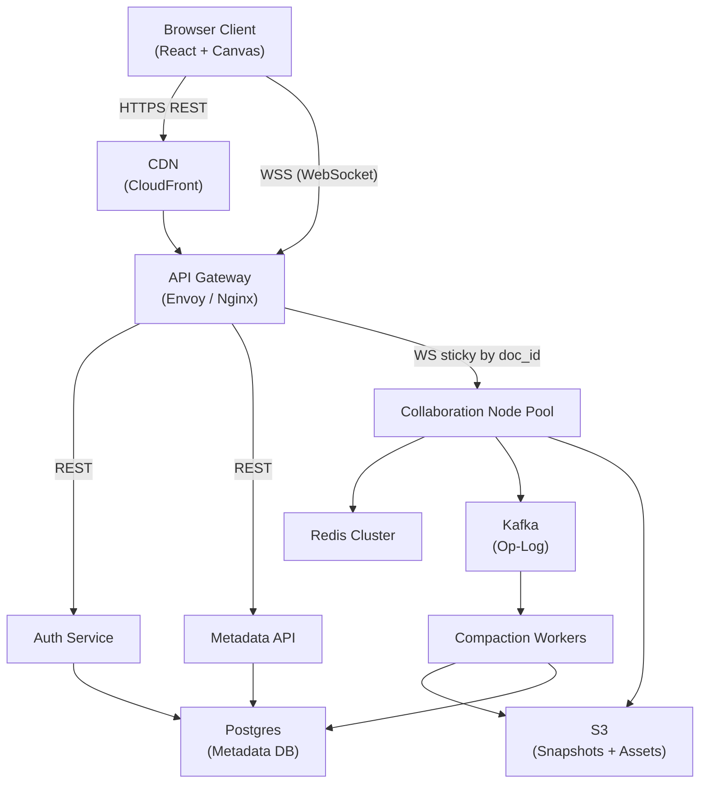

### Happy Path — User Makes an Edit

Walk through one operation end to end to prove the design is coherent:

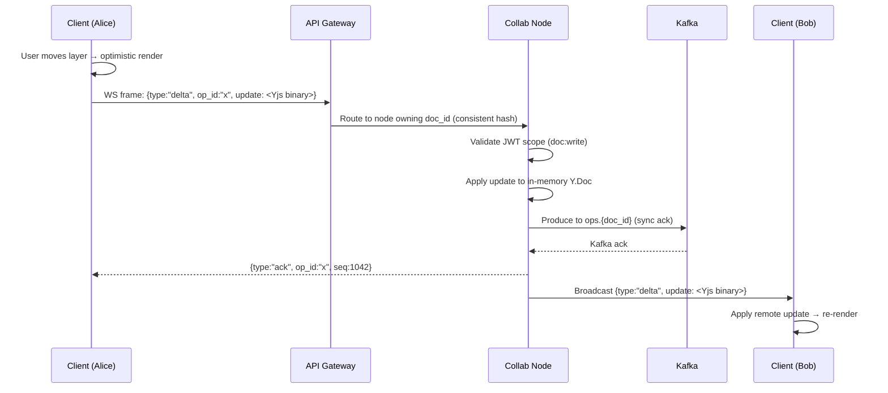

### Happy Path — User Opens a Document

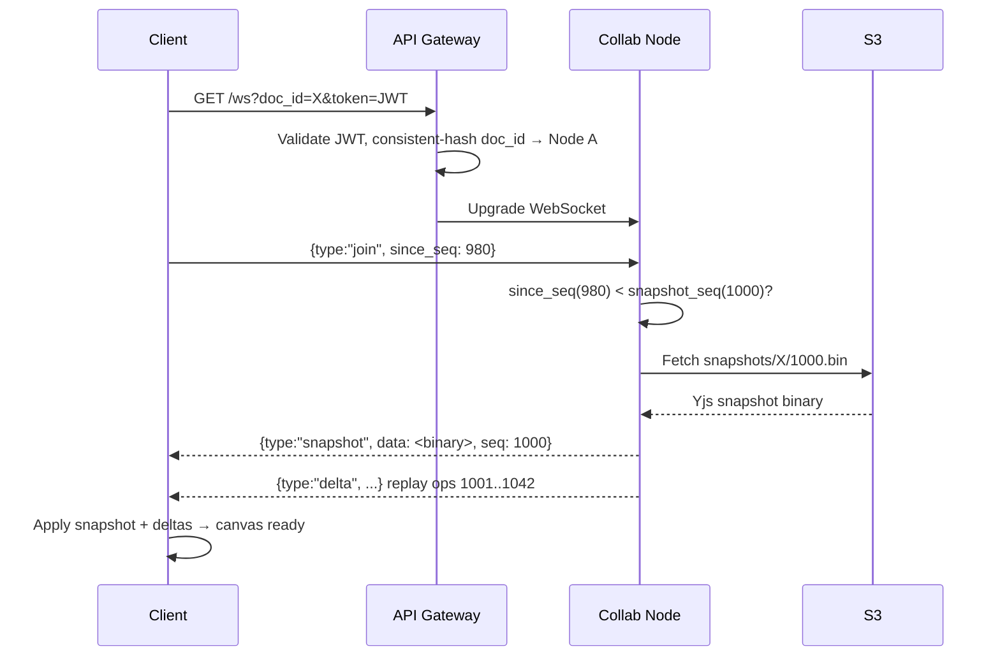

---

## Step 4 — Detailed Component Design

### 4.1 The CRDT Data Model

This is the most important design decision in the entire system. The document state must be mergeable without coordination.

**Why CRDT over OT (Operational Transformation)?**

OT (used by Google Docs) requires a central server to serialize and transform operations. CRDTs are commutative — any node can merge any set of operations in any order and reach the same result. That's what makes offline editing and multi-node scaling tractable.

**Yjs document structure:**

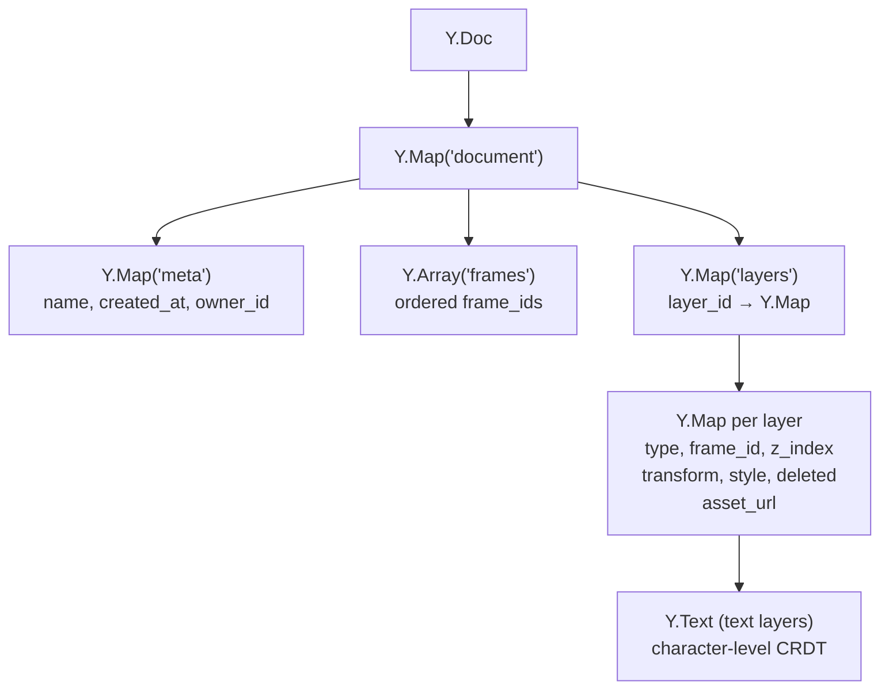

**Key choices in the data model:**

- `Y.Map` for layers (not `Y.Array`) — O(1) lookup by `layer_id`, independent property updates without conflicts.
- `z_index` as a fractional index string — lexicographic sort gives z-order; inserting between `"a"` and `"b"` yields `"am"`. Two concurrent inserts at the same position both survive and sort deterministically.
- `deleted: boolean` tombstone — layers are never hard-removed. This preserves causal history for concurrent ops that reference a deleted layer.
- `Y.Text` for text content — handles character-level concurrent edits (insert/delete) with correct merge semantics.

### 4.2 Collaboration Node — The Stateful Core

Each node owns a set of documents. "Owns" means it holds the live `Y.Doc` in memory and all WebSocket sessions for that document connect here.

**In-memory state per document:**

```
DocumentRoom {
  doc_id:       string
  ydoc:         Y.Doc          ← live CRDT state
  sessions:     Map<client_id, WebSocket>
  last_seq:     int64          ← last persisted op
  snapshot_seq: int64          ← seq of last snapshot
  dirty_ops:    int            ← ops since last snapshot
}
```

**Operation pipeline:**

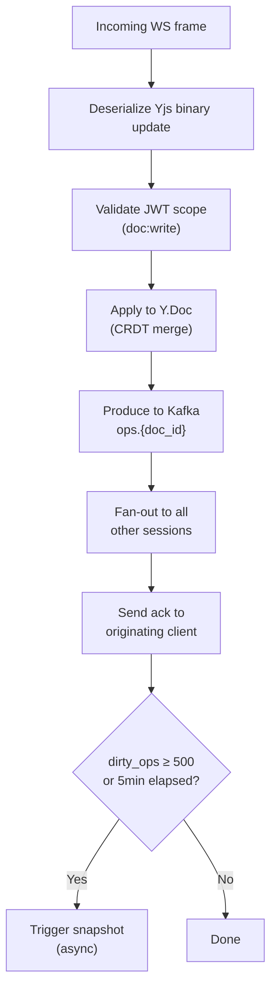

**Node startup / rehydration:**

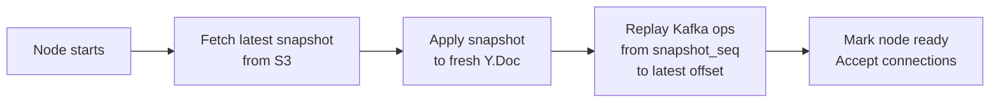

Target: complete within 10 seconds for documents up to 50MB.

### 4.3 Presence Service

Presence is **not** a CRDT problem. It's ephemeral — stale presence data expires in 3 seconds anyway. The design is deliberately simple:

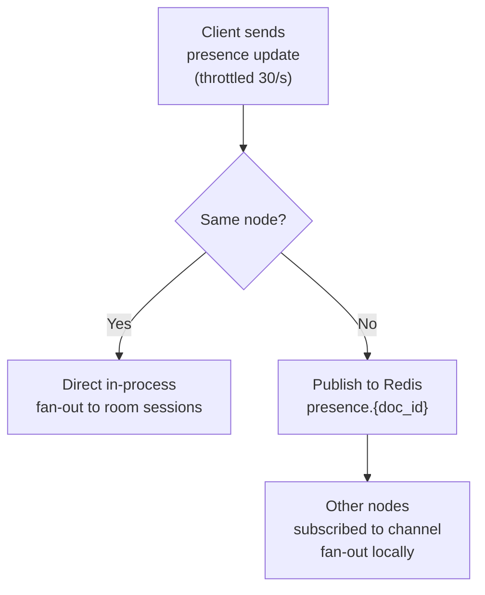

Presence never touches Kafka or Postgres. A presence broadcast failure cannot corrupt document state — this is a hard invariant.

### 4.4 Consistent Hashing for WebSocket Routing

All sessions for a given `document_id` must land on the same Collaboration Node (the one holding the live `Y.Doc`). The API Gateway uses a consistent hash ring stored in Redis.

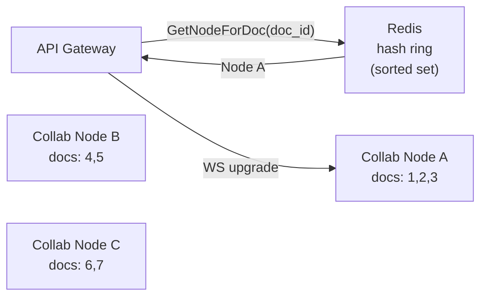

**When a node joins:**
1. Registers in Redis sorted set with its capacity.
2. Ring rebalances — a subset of document slots move to the new node.
3. New node rehydrates those documents (S3 + Kafka replay) within a 5-second overlap window before the old node closes those sessions.

**When a node fails:**
1. Gateway detects missing heartbeat.
2. Removes node from ring.
3. Affected documents are reassigned to next node in ring.
4. New node rehydrates from last snapshot + Kafka replay.

### 4.5 Offline Editing and Reconnection

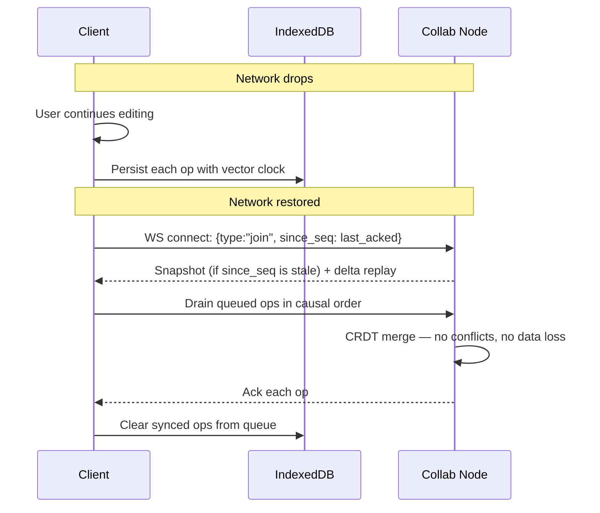

The CRDT guarantees that queued ops merge correctly regardless of what happened on the server while the client was offline. No manual conflict resolution needed.

### 4.6 Snapshot and Compaction

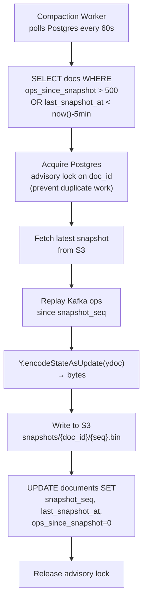

---

## Step 5 — Decision Log

### Decision 1: CRDT (Yjs) vs. Operational Transformation

**Context:** Two users editing the same layer concurrently must converge to the same state. Need to choose a conflict resolution strategy.

| Option | Pros | Cons |
|--------|------|------|
| OT (Google Docs approach) | Well-understood, used at scale | Requires central server to serialize ops; hard to scale horizontally; complex transformation functions |
| CRDT (Yjs) | Commutative — any order of merge produces same result; enables true offline editing; no central coordinator needed | Tombstones accumulate (need compaction); higher memory per document; less intuitive for some conflict types |
| Last-write-wins (simple) | Trivial to implement | Data loss — concurrent edits overwrite each other |

**Decision:** Yjs CRDT.

**Rationale:** The offline editing requirement (R6) is a hard constraint. OT requires a server to be the arbiter — that breaks offline. LWW loses data. Yjs is the only option that satisfies all three: offline editing, convergence, and horizontal scaling.

**Trade-offs accepted:** Tombstones require periodic compaction. Yjs binary format is opaque — harder to debug than JSON ops. CGo or WASM binding needed to run Yjs in Go.

**Revisit if:** The team finds Yjs's Go binding too risky; could fall back to a pure-Go CRDT library or a Node.js Collaboration Node.

---

### Decision 2: Op-Log storage — Kafka vs. Postgres vs. custom

**Context:** Every operation must be durably persisted before being acked. Need append-only, ordered, partitioned storage with 30-day retention.

| Option | Pros | Cons |
|--------|------|------|
| Kafka | Built for this: append-only, partitioned by key, configurable retention, high throughput | Operational complexity; Zookeeper dependency |
| Postgres (append-only table) | Already in the stack; ACID; easy to query | Not designed for 70K writes/s; WAL bloat; retention management is manual |
| DynamoDB Streams | Managed; scales automatically | Retention limited to 24h; not suitable for 30-day replay |

**Decision:** Kafka, partitioned by `document_id`.

**Rationale:** 70K ops/s sustained write throughput rules out Postgres as the primary op-log. Kafka's partition-per-document model preserves per-document ordering (critical for CRDT replay) while distributing load across brokers. 30-day retention is a first-class Kafka feature.

**Trade-offs accepted:** Adds Kafka + Zookeeper to the operational stack. Team needs Kafka expertise.

**Revisit if:** Team is small and operational burden is too high — could use a managed service like Confluent Cloud or Amazon MSK.

---

### Decision 3: Presence delivery — Redis Pub/Sub vs. Kafka vs. direct WebSocket mesh

**Context:** Presence updates are 200× higher volume than ops (15M msgs/s peak). They're ephemeral — stale after 3 seconds. Need sub-50ms broadcast latency.

| Option | Pros | Cons |
|--------|------|------|
| Kafka | Durable, ordered | 15M msgs/s is expensive; persistence is wasteful for ephemeral data; adds latency |
| Redis Pub/Sub | In-memory, sub-millisecond, no persistence overhead | At-most-once delivery (fine for presence); Redis is already in the stack |
| Direct WebSocket mesh (nodes talk to each other) | No intermediary | O(N²) connections between nodes; complex topology management |

**Decision:** In-process fan-out within a node; Redis Pub/Sub for cross-node.

**Rationale:** Most presence traffic stays within a single node (all sessions for a document are on the same node). Cross-node presence only occurs for team-level awareness features. Redis Pub/Sub handles the cross-node case with minimal overhead. At-most-once delivery is acceptable — a missed cursor update is invisible to users.

**Trade-offs accepted:** Presence is not durable. If a node crashes, presence state is lost (users' cursors disappear until they move again — acceptable).

---

### Decision 4: Snapshot storage — S3 vs. Postgres BYTEA vs. dedicated blob store

**Context:** Snapshots are large (avg 2MB, up to 50MB), written infrequently (every 500 ops or 5 min), read on node startup and reconnect.

| Option | Pros | Cons |
|--------|------|------|
| S3 | Cheap, durable, CDN-friendly, no size limit | Eventual consistency on overwrite (use versioned keys to avoid) |
| Postgres BYTEA | Already in stack; transactional with metadata update | Not designed for large blobs; bloats WAL; slow for 50MB reads |
| Dedicated blob store (GCS, Azure Blob) | Similar to S3 | No advantage over S3 if already on AWS |

**Decision:** S3 with versioned keys (`snapshots/{doc_id}/{seq}.bin`).

**Rationale:** Snapshots are blobs — S3 is the canonical blob store. Versioned keys (using the sequence number) avoid overwrite consistency issues and give free version history. Postgres BYTEA at 50MB per document would destroy query performance.

**Trade-offs accepted:** S3 GET latency (~10–50ms) adds to node startup time. Mitigated by keeping the latest snapshot warm in a local disk cache on the node.

---

### Decision 5: WebSocket routing — consistent hashing vs. random with state sync

**Context:** All sessions for a document must share the same in-memory `Y.Doc`. Need to route WebSocket connections deterministically.

| Option | Pros | Cons |
|--------|------|------|
| Consistent hashing on `doc_id` | All sessions for a doc land on same node; no cross-node state sync needed | Node failure requires rehydration; ring rebalancing is complex |
| Random routing + state sync via Kafka | Simple routing | Every node must hold every document's state — memory explodes at scale |
| Sticky sessions via cookie | Simple | Breaks on node failure; doesn't scale to new nodes |

**Decision:** Consistent hashing on `document_id`, ring stored in Redis.

**Rationale:** Random routing requires every node to hold every document — at 10K active documents × 2MB average = 20GB per node minimum. That doesn't scale. Consistent hashing keeps each document on exactly one node, making the in-memory CRDT model viable.

**Trade-offs accepted:** Node failure causes a brief disruption (rehydration takes up to 10s). Graceful handoff during scaling events requires careful orchestration.

---

## Step 6 — Bottlenecks & Trade-offs

### Identified Bottlenecks

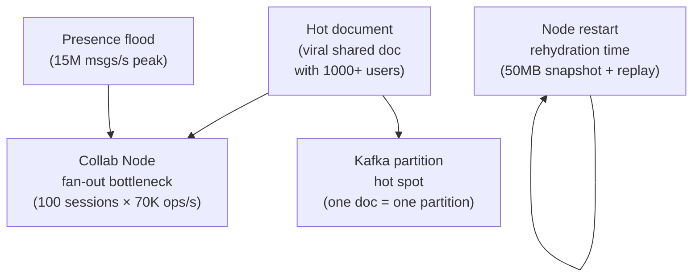

### Mitigations

| Bottleneck | Mitigation |
|------------|-----------|
| Hot document (>100 sessions) | Fan-out via goroutines (one per session) to parallelize WS writes. For extreme cases (>500 sessions), active-active multi-node: multiple nodes hold a replica, exchange deltas via Kafka |
| Kafka hot partition | Single partition per document preserves ordering. At extreme write rates, batch ops before producing (micro-batching at 10ms) |
| Presence flood | Never touches Kafka or DB. In-process fan-out is O(N) per message. Throttle client-side to 30/s. Server-side drop excess silently |
| Node restart rehydration | Keep latest snapshot in local disk cache (warm cache). Parallelize S3 fetch + Kafka replay. Target: <10s for 50MB |
| Cache stampede on node restart | Stagger node restarts. New node rehydrates before old node closes sessions (5s overlap window) |
| Postgres write bottleneck | Metadata writes are low volume (document CRUD, snapshot metadata). PgBouncer for connection pooling. Read replicas for all SELECT queries |

### Failure Mode Analysis

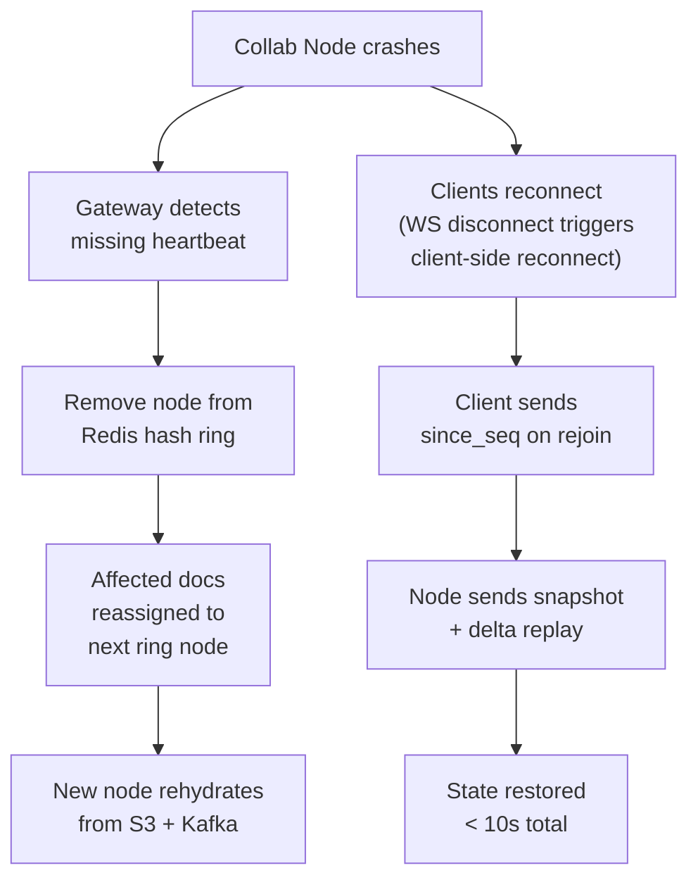

**What can be lost?**
- Ops that were applied to `Y.Doc` but not yet acked to Kafka: these are lost on node crash. The client will retransmit after 5s timeout (idempotent via `op_id`).
- Presence state: lost on crash. Clients re-emit presence on reconnect.
- Nothing that was acked to the client is ever lost (durability guarantee).

### Scaling to 10× Load

| Component | Current | At 10× | Action needed |
|-----------|---------|--------|---------------|
| Collab Nodes | ~50 nodes | ~500 nodes | Horizontal — add nodes, ring rebalances |
| Kafka | 3 brokers | 30 brokers | Add brokers, increase partition count |
| Postgres | 1 primary + 2 replicas | 1 primary + 10 replicas | Add read replicas; consider Citus for sharding |
| Redis | 3-node cluster | 6-node cluster | Add shards |
| S3 | Unlimited | Unlimited | No action |

---

## Summary

The key insight that drives every decision in this design:

> **Collaborative editing is a distributed state problem. The CRDT data model must be correct before anything else matters.**

Once you commit to Yjs as the CRDT engine, the rest of the architecture follows logically:
- Ops must be persisted before ack → Kafka op-log
- All sessions for a doc must share one `Y.Doc` → consistent hashing
- Presence is ephemeral and high-volume → Redis Pub/Sub, never Kafka
- Offline editing is free → CRDT merges queued ops on reconnect
- Recovery is deterministic → snapshot + Kafka replay = exact state reconstruction

The hardest operational challenge is the Collaboration Node: it's stateful, it owns live CRDT state, and it must handle graceful handoff during scaling and failure. Everything else (auth, metadata API, asset storage) is conventional web service design.

---

## Interviewer Mode — Hard Follow-Up Questions

> These are the questions a senior interviewer asks after you finish the happy path. Read the question, think about your answer, then read the model response.

---

**Q1: "You said you'd use Yjs as the CRDT engine. What happens if two users concurrently delete and modify the same layer — one deletes it, the other moves it. What does the final state look like?"**

The interviewer is testing whether you understand CRDT semantics beyond "it merges automatically."

> The delete wins. In Yjs, a delete operation sets a tombstone on the layer — the layer is marked `deleted: true` but the entry remains in the Y.Map. The move operation targets a layer_id that now has `deleted: true`. The CRDT applies both operations, but the client rendering layer filters out tombstoned layers before drawing. The user who moved it sees their move "disappear" — the layer is gone. We should send them an error message: "The layer you were editing was deleted by another user." This is the correct behavior per Requirement 8.3 — delete wins, modification is discarded.

---

**Q2: "Your consistent hashing routes all sessions for a document to one Collaboration Node. What happens during a rolling deployment — you're updating the node software. How do you avoid dropping active sessions?"**

The interviewer is testing operational thinking — deployments are a real failure mode.

> Rolling deployments are the hardest part of stateful services. The approach: before terminating a node, mark it as "draining" in the Redis hash ring — the gateway stops routing new documents to it but existing sessions stay. We wait for a configurable drain window (say 60 seconds) for users to naturally disconnect. For sessions still active after the drain window, we force-close them — clients auto-reconnect via WebSocket reconnect logic, get routed to a new node, and that node rehydrates from S3 + Kafka. The user sees a brief "reconnecting" indicator. The key insight: we never kill a node without draining first. This is the same pattern as Kubernetes graceful termination with a `preStop` hook.

---

**Q3: "You're storing Yjs snapshots in S3. A document has 50,000 layers after 2 years of editing. The snapshot is 200MB. Rehydration takes 45 seconds. How do you fix this?"**

The interviewer is testing whether you can identify and solve a concrete performance problem.

> Three approaches, applied in order of complexity. First, incremental snapshots — instead of one full snapshot, store a base snapshot plus delta snapshots every 100 ops. Rehydration loads the base and applies only the recent deltas. Second, lazy rehydration — mark the node as "warming up," accept new connections but queue their operations until rehydration completes. Users see a loading state for a few seconds rather than a connection refusal. Third, snapshot compression — Yjs binary format compresses well with zstd; a 200MB snapshot typically compresses to 20-40MB, cutting S3 fetch time by 5-10×. In practice, combining compression with incremental snapshots gets rehydration under 5 seconds for most documents.

---

**Q4: "Your presence service broadcasts cursor positions at 30/s per user. With 100 users in a room that's 3,000 messages/second just for presence. How does this not overwhelm the Collaboration Node?"**

The interviewer is testing whether you've thought about the hot path carefully.

> Three layers of throttling. Client-side: cursor moves are throttled to 30/s before sending — mousemove fires at 60fps but we only send every 33ms. Server-side: the Collaboration Node drops presence messages that arrive faster than 30/s per client, silently. Fan-out: presence is in-process fan-out — no serialization to Kafka, no DB write, just iterating the sessions map and writing to each WebSocket. At 100 sessions, that's 100 WebSocket writes per presence message. Each write is ~100 bytes. 3,000 messages/s × 100 bytes = 300KB/s per session — well within a 1Gbps NIC. The node handles this in goroutines, one per session, so slow clients don't block fast ones. The real limit is the number of goroutines, not bandwidth.

---

**Q5: "A user reports their changes aren't showing up for their collaborators. How do you debug this in production?"**

The interviewer is testing operational maturity — can you actually run this system.

> I'd work through the pipeline in order. First, check if the client is sending the delta — look at WebSocket frame logs on the client side. If the frame is sent, check if the Collaboration Node received it — look for the op_id in the node's structured logs. If received, check if Kafka produced successfully — look for the Kafka producer ack log. If Kafka acked, check if the broadcast happened — look for fan-out log entries for the room. If broadcast happened, check if the recipient's WebSocket received it — look at the recipient's client logs. This is a linear pipeline so the bug is at exactly one stage. The most common cause in practice: the recipient's WebSocket is in a half-open state — the TCP connection appears alive but packets aren't flowing. The fix: WebSocket ping/pong keepalive detects this within 30 seconds and triggers a reconnect.
