# System Design Walkthrough — Google Docs (Collaborative Document Editor)

> This document applies the 6-step framework from `00-system-design-framework.md` to Google Docs. Read it alongside `31-figma-system-design-walkthrough.md` — both solve real-time collaborative editing, but the constraints differ enough to produce meaningfully different architectures. The comparison is instructive.

---

## The Question

> "Design a real-time collaborative document editor like Google Docs. Multiple users should be able to type in the same document simultaneously, see each other's cursors, and never lose work."

---

## How This Differs from Figma — Before You Start

This is worth stating upfront in an interview, because it shows you understand the problem space:

| Dimension | Figma | Google Docs |
|-----------|-------|-------------|
| Data model | 2D canvas, layers, transforms | Linear text with rich formatting |
| Conflict resolution | CRDT (commutative, no coordinator) | OT (requires central server to serialize) |
| Consistency | Eventual (CRDT convergence) | Strong (server is the source of truth) |
| Offline editing | First-class (CRDT merges freely) | Limited (OT requires server to transform) |
| State size | Large (Yjs binary, up to 50MB) | Moderate (text + formatting, typically <5MB) |
| Primary hard problem | Distributed state, fan-out at scale | Operation transformation correctness, cursor tracking |

The core insight: **Google Docs is a text editing problem first. The server is the arbiter of truth. Figma is a distributed state problem first. The server is just a relay.**

---

## Step 1 — Clarify Requirements

### Functional Requirements

| # | Requirement |
|---|-------------|
| F1 | Users can create, open, rename, and delete documents |
| F2 | Documents contain rich text: bold, italic, headings, lists, links, images |
| F3 | Multiple users can type in the same document simultaneously |
| F4 | All collaborators see each other's changes in real time |
| F5 | Users can see collaborators' cursors and selections with name labels |
| F6 | Documents are auto-saved — no explicit save button |
| F7 | Users can view full revision history and restore any version |
| F8 | Users can leave comments on specific text ranges |
| F9 | Documents are accessible offline; changes sync on reconnect |
| F10 | Documents can be exported (PDF, DOCX) |

**Out of scope:** spreadsheets, presentations, real-time voice/video, plugin ecosystem, billing.

### Non-Functional Requirements

| Attribute | Target |
|-----------|--------|
| DAU | 1 billion (Google Docs is used globally) |
| Concurrent editors per document | Up to 100 |
| Edit broadcast latency | < 100ms p99 (same region) |
| Cursor broadcast latency | < 50ms p95 |
| Availability | 99.99% |
| Durability | Zero data loss after server ack |
| Consistency | **Strong** — server is the single source of truth for op ordering |
| Revision history | Full history retained indefinitely |
| Document size | Up to ~10MB of text content |

### The Core Insight

The hardest problem in Google Docs is **Operational Transformation (OT) correctness**. When two users type at the same time, their operations must be transformed against each other so both edits survive and the document stays consistent. This requires a central server to serialize operations — which is fundamentally different from Figma's CRDT approach.

---

## Step 2 — Back-of-the-Envelope Estimates

### Traffic

```
Assumptions:
  1B DAU, but only ~50M actively editing at peak
  Average editing session: 30 min
  Keystrokes per minute while typing: ~40
  Not all time is spent typing — assume 5 ops/min average

Write ops (keystrokes/formatting):
  50M active users × 5 ops/min = 250M ops/min → ~4M ops/s peak
  Sustained average: ~1M ops/s

Cursor/presence updates:
  Cursor moves on every keystroke: ~4M/s (same as ops)
  (presence is ephemeral — handled in-memory, not persisted)

Document opens (reads):
  1B DAU × 5 opens/day = 5B/day → ~58,000/s
  Most are cache hits (recent docs in Redis or CDN)
```

### Storage

```
Document content:
  Average doc: 50KB (text + formatting)
  1B total documents × 50KB = 50 TB → manageable in distributed storage

Revision history (the expensive part):
  Each op: ~100 bytes
  1M ops/s × 86,400s × 365 days = ~3 PB/year
  → Cannot store every individual op forever
  → Compact into periodic snapshots + delta ops (same pattern as Figma)
  → Keep full op history for 30 days; compact to hourly snapshots beyond that

Cursor/presence:
  Ephemeral — not stored. Zero storage cost.
```

### Key Observations

1. **4M ops/s is the dominant write load** — needs a horizontally scalable, low-latency write path.
2. **Revision history is petabyte-scale** — must be compacted aggressively.
3. **Document reads are high volume but cacheable** — most users open the same popular docs.
4. **The OT server is a serialization bottleneck per document** — one document can only be processed by one OT server at a time. This is the fundamental scaling constraint.

---

## Step 3 — High-Level Design

### System Context

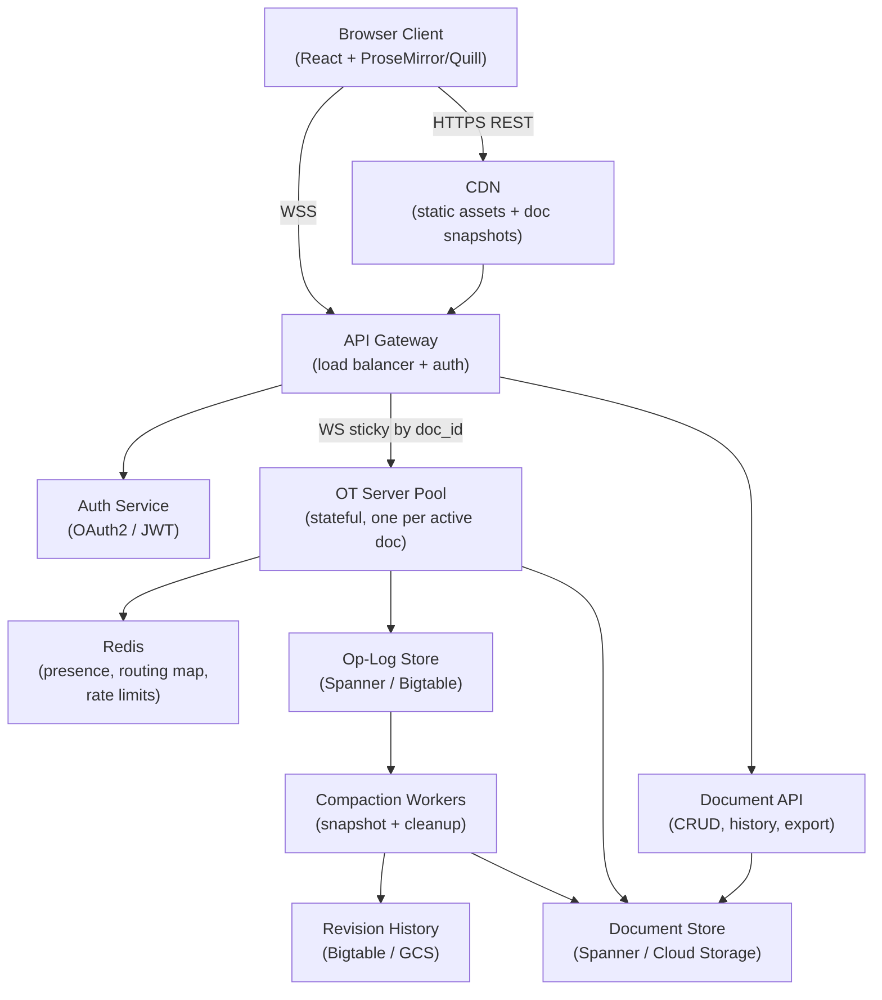

### Happy Path — Two Users Type Simultaneously

This is the core scenario that makes Google Docs hard. Alice types "Hello" at position 0, Bob types "World" at position 0 at the same time.

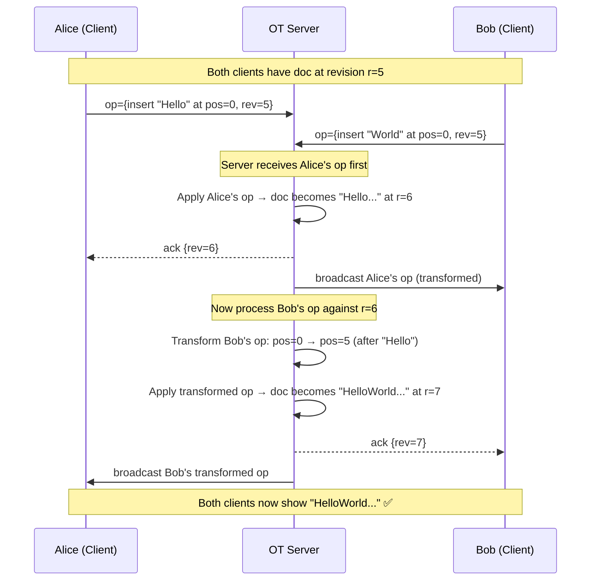

### Happy Path — Opening a Document

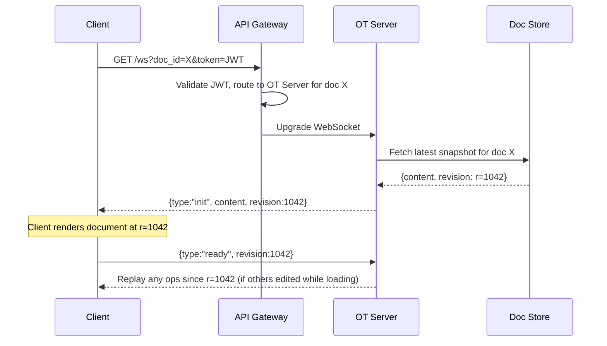

---

## Step 4 — Detailed Component Design

### 4.1 Operational Transformation — The Core Algorithm

OT is the reason Google Docs works. The key property: given two concurrent operations `op_A` and `op_B` that both start from the same document state, you can produce `op_A'` and `op_B'` such that applying them in either order produces the same result.

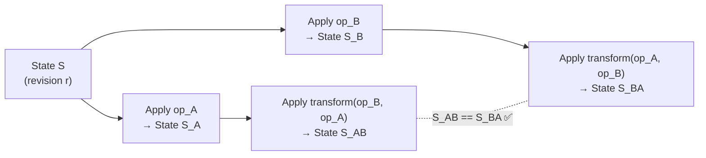

**The transformation rules for text operations:**

```
Operations: Insert(pos, text) and Delete(pos, len)

transform(Insert(p1, t1), Insert(p2, t2)):
  if p1 <= p2: return Insert(p2 + len(t1), t2)  ← shift right
  else:        return Insert(p2, t2)              ← no shift needed

transform(Delete(p1, l1), Insert(p2, t2)):
  if p2 <= p1: return Delete(p1 + len(t2), l1)  ← shift right
  if p2 >= p1 + l1: return Delete(p1, l1)        ← no overlap
  else: split the delete around the insert        ← complex case

transform(Delete(p1, l1), Delete(p2, l2)):
  handle overlapping deletes carefully            ← trickiest case
```

**Why this requires a central server:** The server must receive all ops and assign them a total order (revision number). Without a total order, clients can't know which ops to transform against which. This is the fundamental difference from CRDTs, which are designed to work without a coordinator.

### 4.2 OT Server — The Stateful Core

Each active document is owned by exactly one OT Server instance. "Owned" means it holds the current document state in memory and serializes all incoming operations.

**In-memory state per document:**

```
DocumentSession {
  doc_id:       string
  content:      RichTextDoc     ← current document state
  revision:     int64           ← current revision number
  op_buffer:    []PendingOp     ← ops waiting to be applied
  sessions:     Map<client_id, WebSocket>
  last_saved:   int64           ← last revision persisted to storage
  dirty:        bool            ← unsaved changes exist
}
```

**Operation handling pipeline:**

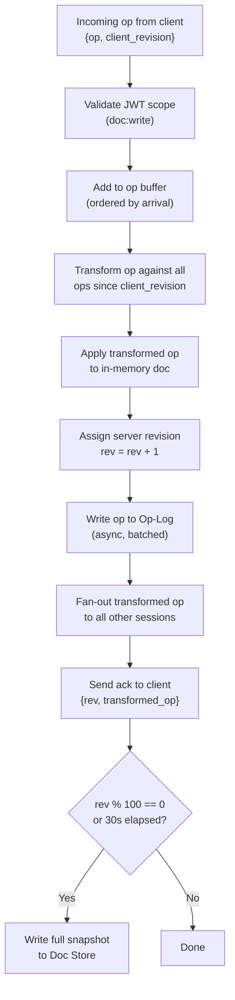

**Why ops are persisted async:** Waiting for storage on every keystroke would add 10–50ms of latency. Instead, ops are written to an in-memory buffer and flushed to the Op-Log in batches every ~100ms. The risk: if the server crashes before flushing, those ops are lost. Mitigation: clients retransmit unacked ops on reconnect.

### 4.3 Client-Side OT — Handling the Ack Gap

The client can't just wait for the server to ack every op before sending the next one — that would make typing feel laggy. Instead, the client uses a local buffer:

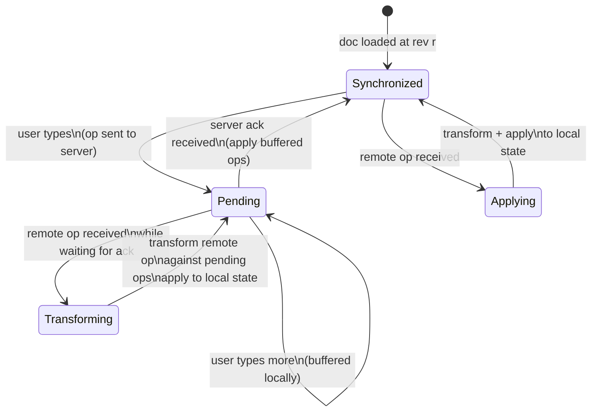

**The client maintains two queues:**
- `sent`: ops sent to server, waiting for ack
- `pending`: ops typed locally, not yet sent (waiting for previous ack)

When a remote op arrives, it must be transformed against everything in `sent` before being applied locally. This keeps the client's view consistent with what the server will eventually produce.

### 4.4 Cursor and Presence Tracking

Cursors are positions in the document, not canvas coordinates. When ops are applied, cursor positions must be transformed too — otherwise Alice's cursor jumps to the wrong place when Bob inserts text before it.

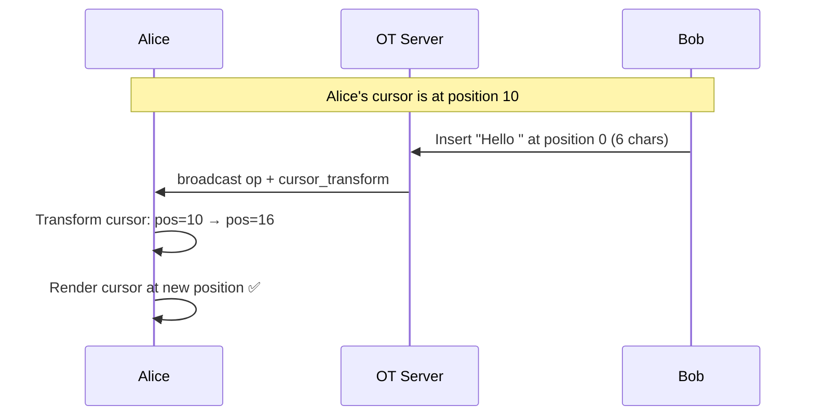

Presence (cursor positions, selections, user colors) is broadcast via the same WebSocket connection but is **not persisted** — it's ephemeral state handled in-memory on the OT Server and fanned out directly to room sessions.

### 4.5 Revision History and Compaction

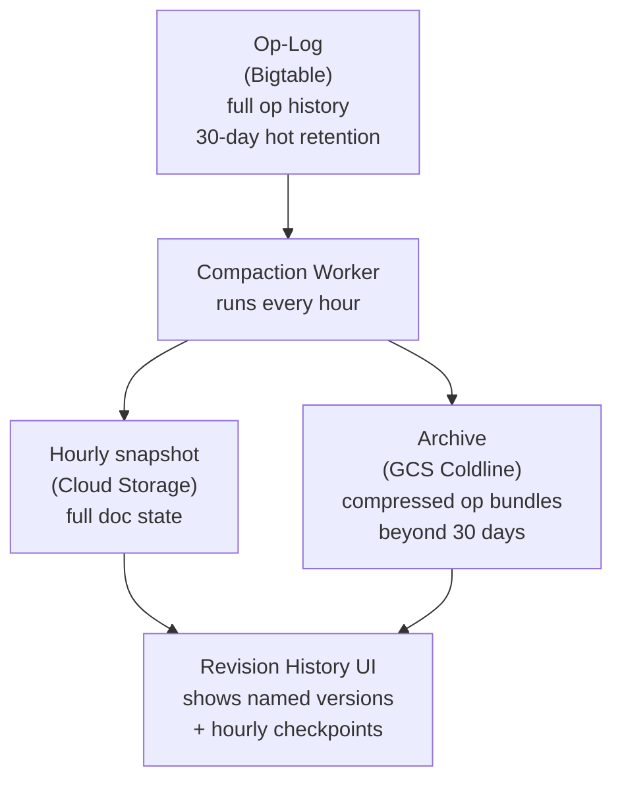

**Retention strategy:**
- 0–30 days: every individual op stored in Bigtable (fast random access for recent history)
- 30 days–2 years: hourly snapshots in GCS + compressed op bundles
- 2+ years: monthly snapshots only

This keeps storage costs manageable while still allowing "restore to any point in the last 30 days."

### 4.6 Offline Editing

OT's central-server requirement makes offline editing harder than with CRDTs. The approach:

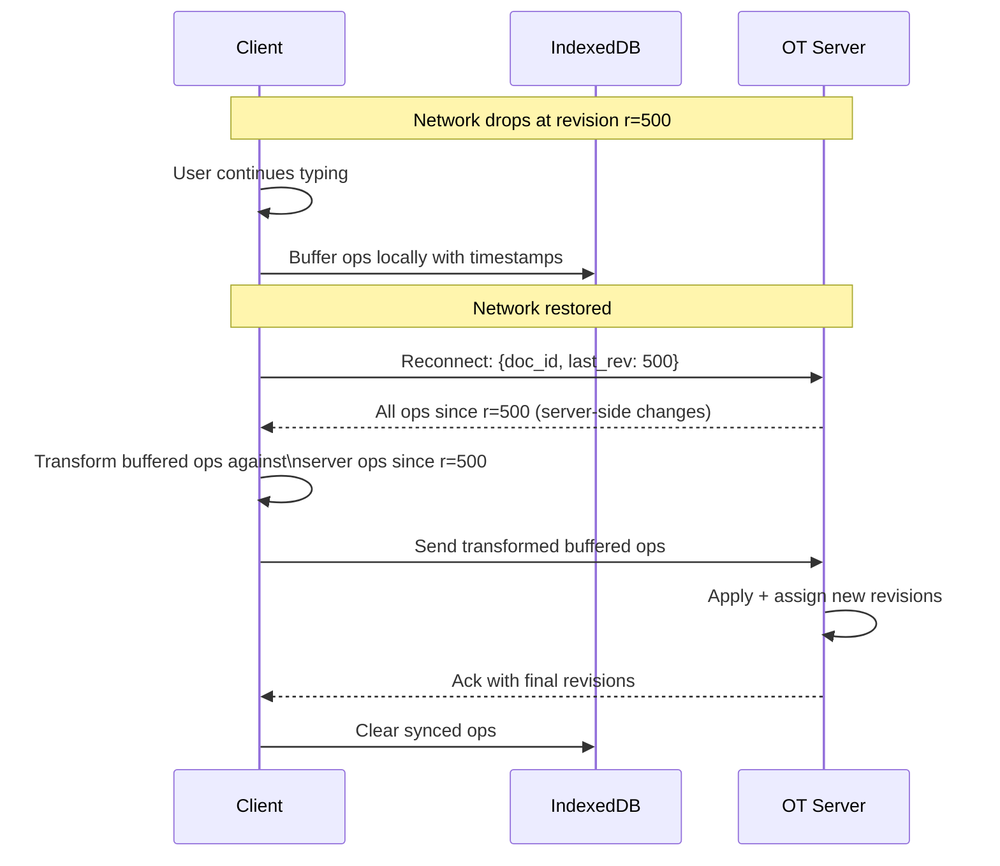

The key difference from Figma: the client must transform its buffered ops against the server's ops before sending. With CRDTs, the merge is automatic. With OT, the client does the transformation work on reconnect.

---

## Step 5 — Decision Log

### Decision 1: OT vs. CRDT

**Context:** Two users editing the same text position concurrently must converge to the same result. Need to choose a conflict resolution strategy.

| Option | Pros | Cons |
|--------|------|------|
| OT (Operational Transformation) | Well-understood for linear text; deterministic; server controls total order | Requires central server; complex transformation functions; hard to get right for rich text |
| CRDT (e.g., Yjs, Automerge) | No central coordinator; offline-first; simpler scaling | Tombstones accumulate; harder to implement cursor tracking; less intuitive for text |
| Last-write-wins | Trivial | Data loss on concurrent edits |

**Decision:** OT with a central OT Server per document.

**Rationale:** Google Docs is a text editing problem. The document has a linear structure with a well-defined position space. OT's transformation rules for insert/delete are well-understood and correct for this model. The central server requirement is acceptable because documents are typically edited from one region at a time, and the server provides a clean source of truth for revision history.

**Trade-offs accepted:** The OT Server is a serialization bottleneck — one document can only be processed by one server. Offline editing requires client-side transformation on reconnect, which is complex. Getting OT correct for rich text (especially nested formatting) is notoriously hard.

**Revisit if:** The team needs true peer-to-peer editing or strong offline support — then CRDT (Yjs) would be the right call, as Figma chose.

---

### Decision 2: Op-Log storage — Bigtable vs. Postgres vs. Kafka

**Context:** Need to store every individual op for 30-day revision history. 4M ops/s write throughput. Random access by (doc_id, revision_range) for history queries.

| Option | Pros | Cons |
|--------|------|------|
| Bigtable (wide-column) | Designed for time-series append; row key = (doc_id, rev) gives perfect access pattern; scales to PB | Google-specific; operational complexity |
| Kafka | High write throughput; log retention built-in | Not designed for random access by revision range; retention management is coarse |
| Postgres | ACID; easy to query | 4M ops/s will destroy a Postgres cluster; WAL bloat |
| DynamoDB | Managed; scales | 30-day retention requires TTL management; expensive at this volume |

**Decision:** Bigtable (or equivalent wide-column store like Cassandra/ScyllaDB outside Google).

**Rationale:** The access pattern is a perfect fit for wide-column: row key `(doc_id#rev)` gives O(1) lookup for any revision range. Write throughput at 4M ops/s is Bigtable's sweet spot. Kafka would work for the write path but doesn't support the random-access revision history queries.

**Trade-offs accepted:** Bigtable is Google-specific. Outside Google, Cassandra or ScyllaDB with a composite partition key `(doc_id, rev_bucket)` achieves the same pattern.

---

### Decision 3: Document content storage — Spanner vs. Postgres vs. Bigtable

**Context:** Need to store the current document state (latest snapshot) with strong consistency. Reads on every document open (~58K/s). Writes on every snapshot (~1K/s).

| Option | Pros | Cons |
|--------|------|------|
| Spanner | Globally distributed; strong consistency; SQL interface | Google-specific; expensive |
| Postgres | Strong consistency; ACID; familiar | Doesn't scale globally without significant sharding work |
| Bigtable | High throughput | Eventual consistency; no SQL; not ideal for structured metadata |
| Cloud Storage (GCS) | Cheap; durable; CDN-friendly | No query capability; eventual consistency on overwrite |

**Decision:** Spanner for document metadata + latest snapshot pointer; GCS for snapshot binary content.

**Rationale:** Document metadata (owner, permissions, name, current revision) needs strong consistency and relational queries — Spanner handles this. The actual document content is a blob — GCS is cheaper and CDN-friendly. Separating metadata from content is a standard pattern.

**Trade-offs accepted:** Two storage systems to manage. Outside Google: Postgres (with read replicas) + S3 achieves the same split.

---

### Decision 4: OT Server routing — consistent hashing vs. random + state sync

**Context:** All sessions for a document must connect to the same OT Server (the one holding the in-memory doc state and serializing ops).

| Option | Pros | Cons |
|--------|------|------|
| Consistent hashing on `doc_id` | All sessions for a doc land on same server; no cross-server state sync | Server failure requires rehydration; ring rebalancing is complex |
| Random routing + state sync | Simple routing | Every server must hold every doc — memory explodes |
| Sticky sessions (cookie) | Simple | Breaks on server failure; doesn't scale to new servers |

**Decision:** Consistent hashing on `doc_id`, routing table in Redis.

**Rationale:** Same reasoning as Figma. The OT Server must hold the in-memory doc state to serialize ops. Random routing would require every server to hold every document — not viable at scale. Consistent hashing keeps each document on exactly one server.

**Trade-offs accepted:** Server failure causes a brief disruption while the new server rehydrates from the Op-Log. Graceful handoff during scaling requires careful orchestration.

---

### Decision 5: Persistence timing — sync vs. async op-log writes

**Context:** Writing every keystroke synchronously to Bigtable before acking would add 10–50ms latency. Users expect sub-100ms response.

| Option | Pros | Cons |
|--------|------|------|
| Sync write (write before ack) | Zero data loss; simple | 10–50ms added latency per op; unacceptable for typing |
| Async write (ack immediately, flush in background) | Low latency; good UX | Risk of data loss if server crashes before flush |
| Write-ahead log (WAL on local SSD, async to Bigtable) | Low latency + durability | More complex; local SSD is still a SPOF |

**Decision:** Async write with a local WAL on the OT Server.

**Rationale:** Typing latency is a UX-critical constraint. Async writes keep the ack path fast. The local WAL (append to local SSD before acking) provides crash recovery — on restart, the server replays the WAL before accepting new connections. Bigtable flush happens in the background every ~100ms.

**Trade-offs accepted:** If the server crashes and the local SSD is lost (rare), ops since the last Bigtable flush are lost. Clients retransmit unacked ops on reconnect, so the window of potential loss is bounded by the flush interval (~100ms of ops).

---

## Step 6 — Bottlenecks & Trade-offs

### Identified Bottlenecks

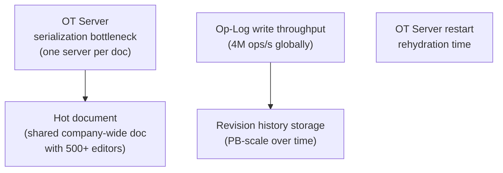

### Mitigations

| Bottleneck | Mitigation |
|------------|-----------|
| OT Server serialization | One server per doc is the fundamental constraint of OT. Mitigate by keeping the server fast (in-memory, async I/O). For extreme cases (500+ editors), consider read-only viewers that receive broadcasts but don't send ops |
| Hot document | Separate read path: viewers get a read-only WebSocket that receives broadcast ops but doesn't go through the OT pipeline. Only active editors go through OT |
| Op-Log write throughput | Bigtable scales horizontally. Batch ops before writing (micro-batch at 100ms). Partition by `(doc_id, rev_bucket)` to distribute load |
| Revision history storage | Aggressive compaction: hourly snapshots beyond 30 days, monthly beyond 2 years. Compress op bundles (text ops compress extremely well) |
| OT Server restart | Keep latest snapshot in local disk cache. Replay only ops since last snapshot from Bigtable. Target: <5s for typical documents |

### Failure Mode Analysis

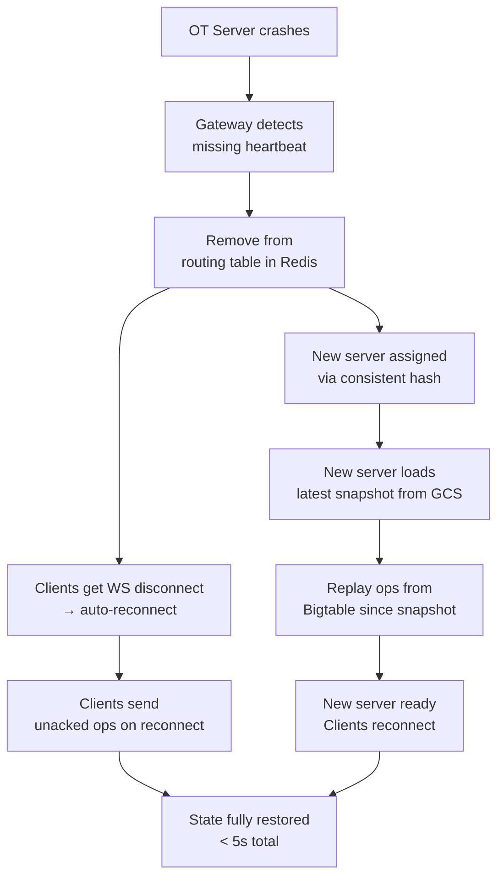

**What can be lost?**
- Ops in the local WAL that weren't flushed to Bigtable before the crash: bounded by the flush interval (~100ms). Clients retransmit these on reconnect.
- Nothing that was acked and flushed to Bigtable is ever lost.

### Scaling to 10× Load

| Component | Current | At 10× | Action needed |
|-----------|---------|--------|---------------|
| OT Servers | ~1,000 nodes | ~10,000 nodes | Horizontal — add nodes, ring rebalances |
| Bigtable (Op-Log) | 10 nodes | 100 nodes | Add nodes, Bigtable auto-rebalances tablets |
| Spanner (Doc metadata) | 3-region | 5-region | Add regions for global coverage |
| Redis (routing) | 3-node cluster | 6-node cluster | Add shards |
| GCS (snapshots) | Unlimited | Unlimited | No action |

---

## Figma vs. Google Docs — Side-by-Side Comparison

This is worth having in your head for interviews. The same problem (real-time collaborative editing) leads to different architectures based on the data model.

| Aspect | Google Docs | Figma |
|--------|-------------|-------|
| Conflict resolution | OT — server serializes all ops | CRDT — any order of merge converges |
| Server role | Arbiter — assigns total order to ops | Relay — broadcasts ops, holds CRDT state |
| Offline editing | Hard — client must transform on reconnect | Easy — CRDT merges freely |
| Consistency | Strong — server is source of truth | Eventual — CRDT convergence |
| Scaling constraint | One OT Server per document (serialization) | One Collab Node per document (CRDT state) |
| State size | Small-medium (text, <10MB) | Large (canvas, up to 50MB) |
| Cursor tracking | Transform cursor positions with OT | Broadcast canvas coordinates via presence |
| Op-Log | Bigtable (random access by revision) | Kafka (append-only, replay by offset) |
| Snapshot store | GCS (text snapshots, small) | S3 (Yjs binary, larger) |
| Presence | Ephemeral, in-memory fan-out | Ephemeral, in-memory + Redis Pub/Sub |

**The key takeaway:** OT and CRDT are both valid solutions to collaborative editing. OT is simpler to reason about for linear text and gives you a clean revision history. CRDT is better for complex data models (canvas, trees), offline-first requirements, and peer-to-peer scenarios. Neither is universally better — the choice depends on the data model and consistency requirements.

---

## Quick Reference — What to Say in an Interview

**"Why OT instead of CRDT for Google Docs?"**
> OT works well for linear text because the transformation rules for insert/delete are well-defined and the server provides a clean total order. The central server is acceptable because documents are typically edited from one region. CRDT would be better if we needed true offline-first or peer-to-peer editing — which is why Figma uses it.

**"What's the hardest part of this design?"**
> Getting OT correct for rich text. Plain text insert/delete is manageable. But when you add nested formatting (bold inside a list inside a table), the transformation functions become complex and subtle bugs cause data corruption. Google spent years getting this right.

**"How do you handle a user who's been offline for an hour?"**
> On reconnect, the client sends its last known revision. The server sends all ops since that revision. The client transforms its buffered local ops against the server ops, then sends the transformed ops to the server. The CRDT approach (Figma) is simpler here — the merge is automatic.

**"How does revision history work?"**
> Every op is stored in Bigtable with a (doc_id, revision) key. To restore to revision N, fetch the nearest snapshot before N and replay ops from that snapshot to N. Beyond 30 days, we compact to hourly snapshots to control storage costs.
