# System Design Walkthrough — WhatsApp (Real-Time Messaging)

> Language-agnostic. The architecture is what matters — not whether you implement it in Erlang, Go, or Java.

---

## The Question

> "Design a real-time messaging system like WhatsApp. Users should be able to send messages to individuals and groups, see delivery and read receipts, and receive messages even when they were offline."

---

## The Core Insight — Before You Draw Anything

WhatsApp's famous engineering fact: 50 engineers supporting 900 million users (as of 2014). That's only possible because the architecture is brutally simple. The hard problems are:

1. **Message delivery guarantees** — a message must be delivered exactly once, even if the sender or recipient goes offline mid-send.
2. **Connection scale** — billions of persistent connections. Most messaging systems collapse here.
3. **Group fan-out** — sending one message to a group of 256 people means 255 delivery operations. At scale, this dominates write traffic.

The language (Erlang) is a consequence of the architecture, not the cause of it. Erlang was chosen because it handles millions of lightweight concurrent processes well. Any language with good async I/O and lightweight concurrency (Go, Rust, Node.js) can achieve the same architecture.

---

## Step 1 — Clarify Requirements

### Functional Requirements

| # | Requirement |
|---|-------------|
| F1 | 1-to-1 messaging between users |
| F2 | Group messaging (up to 256 members) |
| F3 | Message delivery receipts (sent ✓, delivered ✓✓, read ✓✓ blue) |
| F4 | Media sharing (images, video, audio, documents) |
| F5 | Online/last-seen presence |
| F6 | Message history (stored on device, not server) |
| F7 | End-to-end encryption |
| F8 | Offline message queuing — messages delivered when recipient comes online |

**Out of scope:** voice/video calls, payments, business API, Stories.

### Non-Functional Requirements

| Attribute | Target |
|-----------|--------|
| DAU | 2 billion |
| Messages per day | ~100 billion |
| Concurrent connections | ~500 million |
| Message delivery latency | < 100ms (online recipient, same region) |
| Availability | 99.99% |
| Durability | Messages stored until delivered; deleted from server after delivery |
| Consistency | At-least-once delivery (idempotent deduplication on client) |
| Encryption | End-to-end (Signal Protocol) — server never sees plaintext |

### The Key Constraint

WhatsApp stores messages on the server **only until they are delivered**. Once delivered to the recipient's device, the server deletes them. This is fundamentally different from email or Slack, which store messages indefinitely server-side. It massively simplifies storage but means the client is the source of truth for history.

---

## Step 2 — Back-of-the-Envelope Estimates

```
Messages:
  100B messages/day → ~1.16M messages/s peak (assume 3× average)
  Average message size: 100 bytes (text) + metadata
  Media messages: ~30% of traffic, avg 500KB each

Text message storage (transient — until delivered):
  1.16M msg/s × 100 bytes = 116 MB/s ingress
  Average delivery time: <1s for online users
  Offline queue: assume 10% of users offline at any time
  500M offline users × avg 10 undelivered msgs × 100 bytes = 500 GB queue

Media storage:
  1.16M msg/s × 30% × 500KB = 174 GB/s  ← cannot store on messaging servers
  → Media goes to separate object storage (S3-equivalent)
  → Only a URL/reference is sent through the messaging pipeline

Connections:
  500M concurrent WebSocket connections
  Each connection: ~10KB memory overhead
  500M × 10KB = 5 TB RAM across the cluster
  → Need thousands of connection servers

Presence updates:
  Users update "last seen" on connect/disconnect + every 30s while active
  500M active × 1 update/30s = ~17M presence updates/s
  → Must be handled separately from message delivery
```

### Key Observations

1. **Media cannot flow through the messaging pipeline** — 174 GB/s would require thousands of servers just for buffering. Media is uploaded separately; only a reference travels through the message path.
2. **500M concurrent connections** — this is the dominant infrastructure cost. Connection servers must be extremely lightweight.
3. **Message storage is transient** — the queue only holds undelivered messages. Once delivered, delete. This keeps storage manageable.
4. **Presence is high-volume and low-value** — it must never block message delivery.

---

## Step 3 — High-Level Design

### System Context

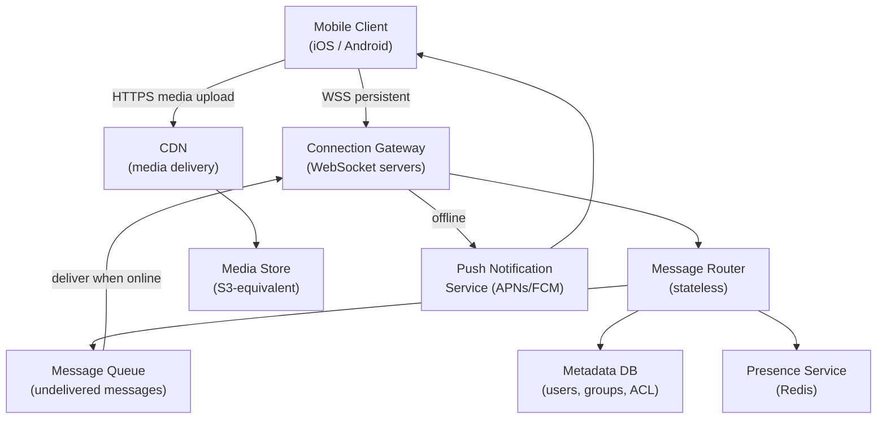

### Happy Path — Alice Sends a Message to Bob (Both Online)

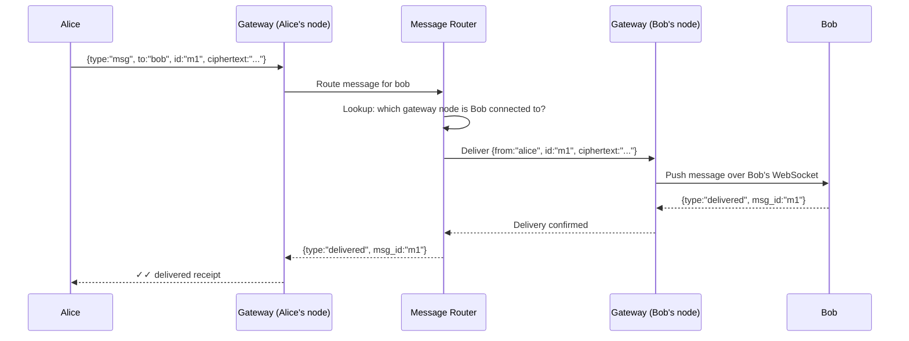

### Happy Path — Bob is Offline

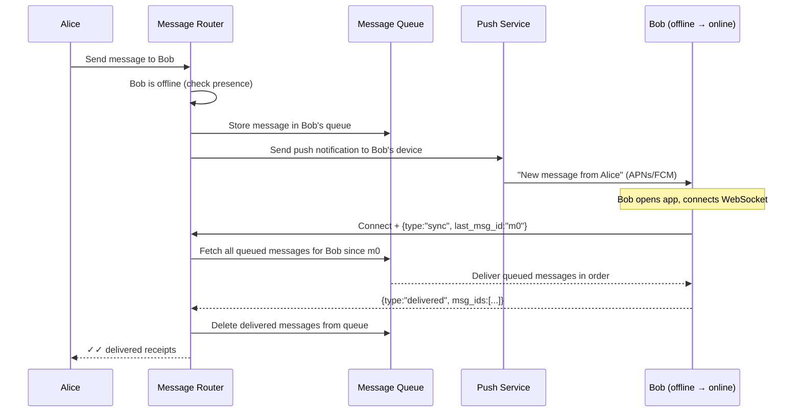

---

## Step 4 — Detailed Component Design

### 4.1 Connection Gateway — The Scale Problem

This is the hardest infrastructure problem in WhatsApp. 500 million persistent WebSocket connections across a cluster.

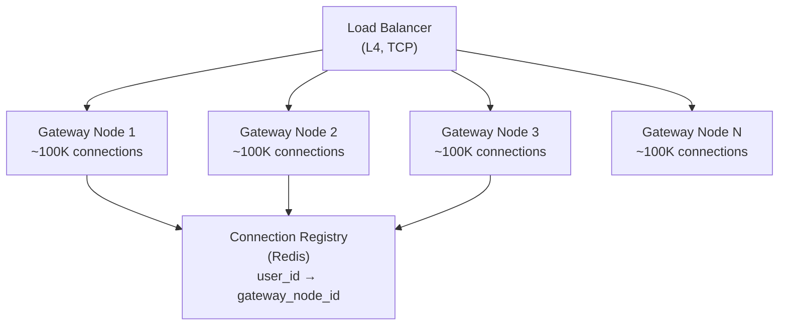

Each gateway node handles ~100K concurrent connections. At 500M connections, you need ~5,000 gateway nodes. Each node:
- Maintains a map of `user_id → WebSocket connection` in memory
- Registers itself in the Connection Registry on startup
- Heartbeats each connection every 30s (detect dead connections)
- Is stateless beyond the connection map — can be replaced without data loss

**Why L4 (TCP) load balancing, not L7 (HTTP)?**
WebSocket connections are long-lived. L4 routes the initial TCP connection and then gets out of the way. L7 would add overhead on every frame. For 500M connections, that overhead matters.

### 4.2 Message Router — Finding the Recipient

The router's job: given a `user_id`, find which gateway node they're connected to and deliver the message.

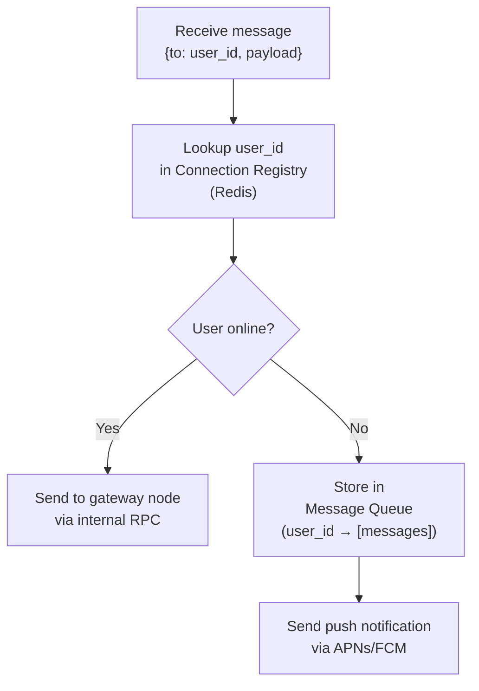

The Connection Registry is a Redis hash: `user_id → {gateway_node_id, connected_at}`. It's updated on every connect/disconnect. TTL of 60s — if a gateway node crashes without deregistering, the entry expires automatically.

### 4.3 Message Queue — Durability for Offline Users

The queue only holds messages that haven't been delivered yet. Once delivered, they're deleted.

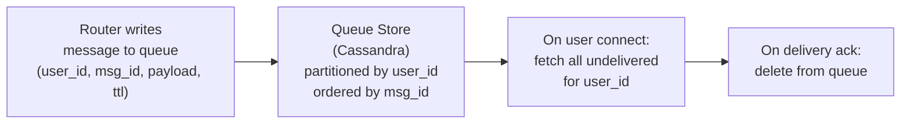

**Why Cassandra for the queue?**
- Partition key = `user_id` → all messages for a user are co-located
- Clustering key = `msg_id` (time-ordered) → efficient range scan for "all messages since X"
- High write throughput (millions of enqueues/s)
- TTL support — messages auto-expire after 30 days if never delivered (user never came online)

**Message TTL:** If a user doesn't come online within 30 days, their queued messages are deleted. WhatsApp notifies the sender that the message was not delivered.

### 4.4 Group Messaging — The Fan-Out Problem

A group message to 256 members = 255 individual delivery operations. At 1M group messages/s, that's 255M delivery operations/s.

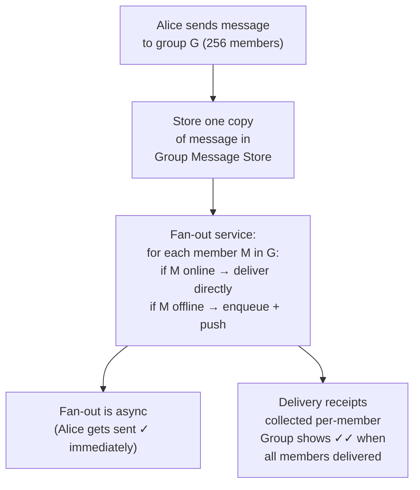

**Key optimization:** Store one copy of the group message, not 256 copies. Each member's queue stores only a reference (group_id, msg_id), not the full payload. This reduces storage by 256×.

**Fan-out is async:** Alice gets a "sent" receipt immediately. The fan-out to 255 members happens in the background. This keeps Alice's send latency low regardless of group size.

### 4.5 Media Delivery — Separate from the Message Path

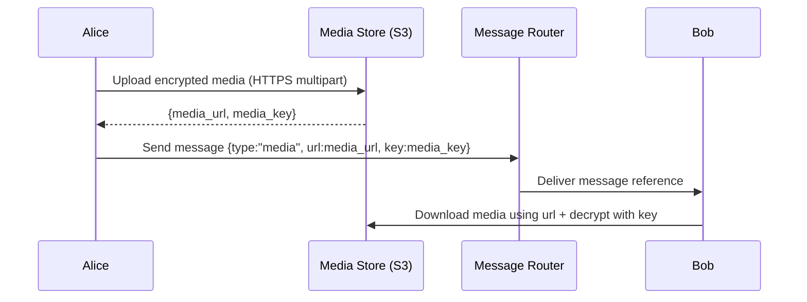

Media is end-to-end encrypted: Alice encrypts the file with a random key, uploads the ciphertext to S3, and sends the key inside the encrypted message. The server stores ciphertext it can never decrypt. Bob downloads and decrypts client-side.

### 4.6 End-to-End Encryption (Signal Protocol)

The server never sees plaintext. This is an architectural constraint, not just a feature.

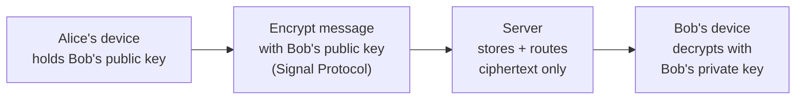

**Implications for system design:**
- Server cannot search message content (no server-side search)
- Server cannot recover messages if device is lost (no server-side backup by default)
- Key distribution requires a trusted key server (WhatsApp manages public keys)
- Group messages use a shared group key, rotated when members leave

---

## Step 5 — Decision Log

### Decision 1: Store-and-forward vs. direct peer-to-peer delivery

**Context:** Messages need to be delivered even when the recipient is offline.

| Option | Pros | Cons |
|--------|------|------|
| Store-and-forward (server queues) | Works when recipient is offline; server handles ordering | Server stores messages (privacy concern); server is a bottleneck |
| Peer-to-peer (direct device-to-device) | No server storage; better privacy | Requires both devices online simultaneously; NAT traversal is hard |
| Hybrid (P2P when both online, server queue when offline) | Best of both | Complex; hard to guarantee delivery ordering |

**Decision:** Store-and-forward with server-side queue.

**Rationale:** P2P requires both devices online simultaneously — unacceptable for a messaging app. The privacy concern is mitigated by end-to-end encryption: the server stores ciphertext it cannot read. Store-and-forward is the only model that guarantees delivery to offline users.

---

### Decision 2: Message storage — delete after delivery vs. retain server-side

**Context:** Should messages be stored on the server permanently (like email) or deleted after delivery (like SMS)?

| Option | Pros | Cons |
|--------|------|------|
| Delete after delivery | Minimal server storage; better privacy; simpler | No server-side history; device loss = message loss |
| Retain server-side | History accessible from any device; backup | Massive storage cost; privacy risk; server becomes source of truth |
| Retain with E2E encryption | Privacy preserved; multi-device sync possible | Complex key management; storage cost remains |

**Decision:** Delete after delivery. History lives on the device only.

**Rationale:** WhatsApp's design philosophy is device-centric. The server is a relay, not a database. This keeps server storage proportional to undelivered message volume (not total history), which is orders of magnitude smaller. It also simplifies the privacy model.

**Trade-offs accepted:** No multi-device sync (historically). Device loss = message loss. WhatsApp added optional encrypted cloud backup later, but that's a separate system.

---

### Decision 3: Connection registry — Redis vs. consistent hashing vs. DHT

**Context:** Need to find which gateway node a user is connected to, for 500M concurrent users.

| Option | Pros | Cons |
|--------|------|------|
| Redis hash (user_id → node_id) | Simple; fast O(1) lookup; TTL for crash recovery | Redis cluster must handle 500M keys; hot keys for popular users |
| Consistent hashing (route by user_id hash) | No registry needed; deterministic | User must always connect to their "home" node; rebalancing is complex |
| DHT (distributed hash table) | Fully decentralized; no single registry | Complex; higher lookup latency |

**Decision:** Redis hash with TTL.

**Rationale:** 500M keys in Redis is manageable (each entry is ~50 bytes = 25GB total, easily sharded). O(1) lookup is critical for message routing latency. TTL handles gateway node crashes without manual cleanup. Consistent hashing would work but forces users to reconnect to a specific node — bad for mobile clients that roam between networks.

---

### Decision 4: Group fan-out — fan-out on write vs. fan-out on read

**Context:** Group message to 256 members. When should the 255 delivery operations happen?

| Option | Pros | Cons |
|--------|------|------|
| Fan-out on write (deliver to all members immediately) | Low read latency; simple delivery path | 255 writes per group message; expensive for large groups |
| Fan-out on read (store once, each member fetches) | One write per message; storage efficient | Each member must poll or be notified; complex read path |
| Hybrid (fan-out for small groups, fan-in for large) | Balanced | Two code paths; threshold tuning |

**Decision:** Fan-out on write, async, with a single stored copy.

**Rationale:** WhatsApp groups are capped at 256 members — fan-out is bounded. Async fan-out keeps sender latency low. Storing one copy with per-member references (not 256 copies) keeps storage efficient. Fan-out on read would require each member to poll, adding complexity and latency.

---

## Step 6 — Bottlenecks & Trade-offs

### Identified Bottlenecks

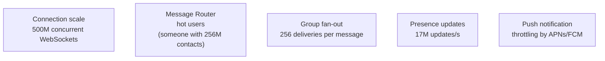

### Mitigations

| Bottleneck | Mitigation |
|------------|-----------|
| 500M connections | Horizontal gateway nodes (~5,000 at 100K connections each). L4 load balancing. Lightweight connection handling (event loop, not thread-per-connection) |
| Message Router hot paths | Stateless routers — scale horizontally. Redis connection registry is sharded. No single router owns a user |
| Group fan-out | Async fan-out workers. Cap group size (256). Store one copy, fan-out references. Batch deliveries to the same gateway node |
| Presence at 17M/s | Presence is eventually consistent — stale by seconds is fine. Batch presence updates. Never block message delivery on presence |
| APNs/FCM throttling | Push is best-effort. If throttled, user will connect on next app open and drain the queue. Message delivery doesn't depend on push succeeding |

### Failure Mode Analysis

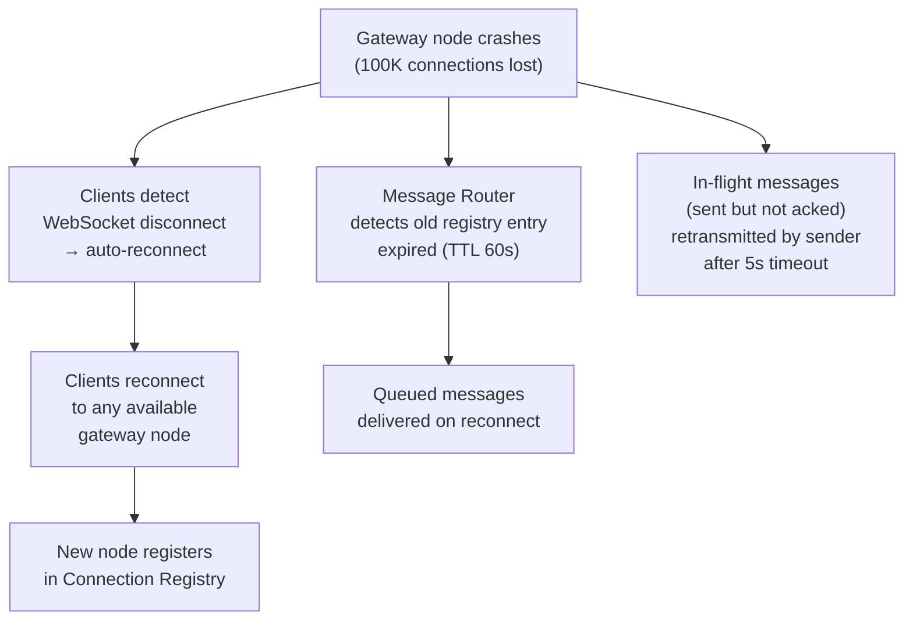

**What can be lost?**
- Messages in-flight at the moment of crash (sent by router to gateway, not yet delivered to client): retransmitted by sender after timeout. Idempotent via `msg_id`.
- Nothing in the Message Queue is lost — Cassandra is durable.

### Scaling to 10× (20 billion users — hypothetical)

| Component | Current | At 10× | Action |
|-----------|---------|--------|--------|
| Gateway nodes | ~5,000 | ~50,000 | Horizontal |
| Connection Registry (Redis) | ~25 GB | ~250 GB | Shard Redis cluster |
| Message Queue (Cassandra) | ~500 GB queue | ~5 TB queue | Add Cassandra nodes |
| Message Routers | ~100 nodes | ~1,000 nodes | Horizontal (stateless) |
| Media Store (S3) | Unlimited | Unlimited | No action |

---

## Interviewer Mode — Hard Follow-Up Questions

---

**Q1: "You said messages are deleted from the server after delivery. A user gets a new phone and restores from iCloud backup. Their chat history is on the device. But what about messages sent to them while they were setting up the new phone — those were delivered to the old device and deleted from the server. Are they lost?"**

The interviewer is testing whether you've thought through the edge cases of the delete-after-delivery model.

> Yes, those messages are lost — and that's an intentional design decision, not a bug. WhatsApp's model is device-centric: the device is the source of truth for history. Messages delivered to the old device are gone from the server. The new device only receives messages sent after it registers. This is the trade-off WhatsApp made for privacy and simplicity. The mitigation: WhatsApp offers optional encrypted cloud backup (iCloud/Google Drive) where the device periodically backs up the local message database. The backup is encrypted with a key only the user holds — WhatsApp can't read it. On new device setup, the user restores from backup and gets their history back. This is opt-in, not automatic, which is why some users lose messages. If the interviewer pushes for a better solution: a server-side encrypted history store (like Signal's sealed sender) would work but adds significant complexity and changes the privacy model.

---

**Q2: "Your Connection Registry in Redis maps user_id to gateway node. What happens if Redis goes down? Can users still send and receive messages?"**

The interviewer is testing your single point of failure analysis.

> If Redis goes down, new message routing fails — the Message Router can't look up which gateway node a recipient is on. But existing connections are unaffected — the gateway nodes still have their in-memory session maps. Messages between users on the same gateway node still work (in-process routing doesn't need Redis). Cross-node messages fail. The fix: Redis Sentinel or Redis Cluster for high availability — 3 nodes, automatic failover in ~30 seconds. For the 30-second window: the Message Router falls back to broadcasting the message to all gateway nodes ("scatter") — each node checks its local session map and delivers if the user is connected there. This is expensive (N gateway nodes receive every message) but it's a fallback for a rare failure. Alternatively, cache the routing table locally on each Message Router with a 5-second TTL — a Redis outage means stale routing for 5 seconds, not complete failure.

---

**Q3: "A WhatsApp group has 256 members. 200 of them are online. You fan-out the message to 200 gateway nodes. But 50 of those users are on the same gateway node. Are you making 200 separate calls or 50?"**

The interviewer is testing whether you've optimized the fan-out path.

> Great question — naive fan-out makes 200 separate calls, one per recipient. Optimized fan-out groups recipients by gateway node first, then makes one call per node with a batch of user_ids. So if 50 users are on Node A, 80 on Node B, and 70 on Node C, we make 3 calls instead of 200. Each call carries a list of user_ids and the message payload. The gateway node delivers to all listed users from its local session map in a single pass. This reduces fan-out from O(members) calls to O(gateway_nodes) calls — typically 3-10 calls instead of 200. The Message Router maintains a reverse index: gateway_node → [user_ids on that node] built from the Connection Registry. This index is rebuilt on every routing lookup and cached for 1 second.

---

**Q4: "End-to-end encryption means the server can't read messages. But WhatsApp has to comply with law enforcement requests. How does that work architecturally?"**

The interviewer is testing whether you understand the real-world implications of your security design.

> This is the fundamental tension in E2E encryption. WhatsApp genuinely cannot provide message content to law enforcement — the server stores ciphertext it cannot decrypt. What WhatsApp can provide: metadata. Who messaged whom, when, how frequently, group membership, IP addresses, device identifiers. This metadata is stored in plaintext on the server and is legally accessible. The architecture doesn't change — E2E encryption is real and the server truly can't read messages. The metadata logging is a separate system that records communication patterns without content. This is why privacy advocates distinguish between "content privacy" (E2E encryption provides this) and "metadata privacy" (WhatsApp does not provide this). Signal goes further by minimizing metadata collection — they can provide almost nothing to law enforcement because they don't store it.

---

**Q5: "Your system handles 1M messages/s. You need to add a spam detection feature that scans message content before delivery. How do you do this without breaking E2E encryption and without adding more than 50ms latency?"**

The interviewer is testing whether you can add a feature that appears to conflict with your architecture.

> This is a genuine conflict — you can't scan encrypted content server-side. There are three approaches. First, client-side scanning: run the spam model on the device before encrypting. The client checks the message against a local model (downloaded periodically) and either blocks it or adds a spam score to the message metadata. This preserves E2E encryption but is bypassable by modified clients. Second, hash-based matching: maintain a database of known-bad message hashes. The client computes a hash of the plaintext before encrypting and sends it alongside the ciphertext. The server checks the hash against the blocklist. This only catches known spam, not novel content. Third, metadata signals: detect spam from behavioral patterns — sending rate, new account age, group membership patterns — without reading content. This is what WhatsApp actually does. The 50ms constraint rules out any server-side ML inference on the message path — that would require decryption, which breaks E2E. The honest answer: you can't do content-based spam detection with true E2E encryption. You choose one or the other.
