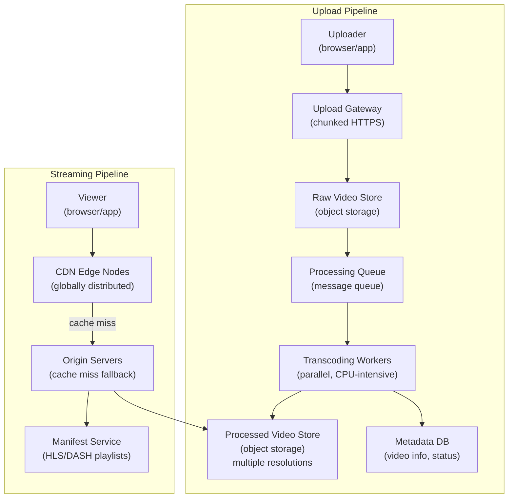
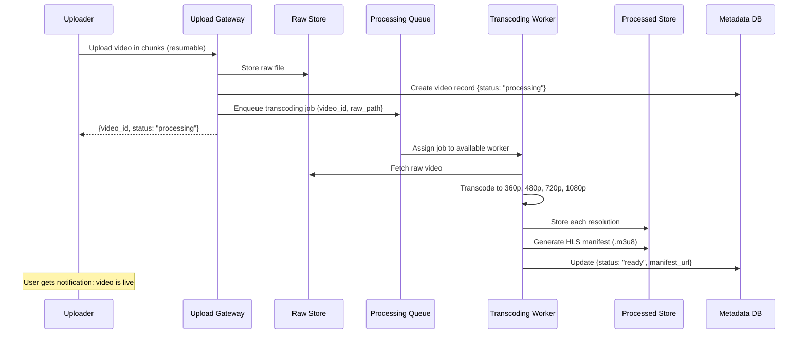
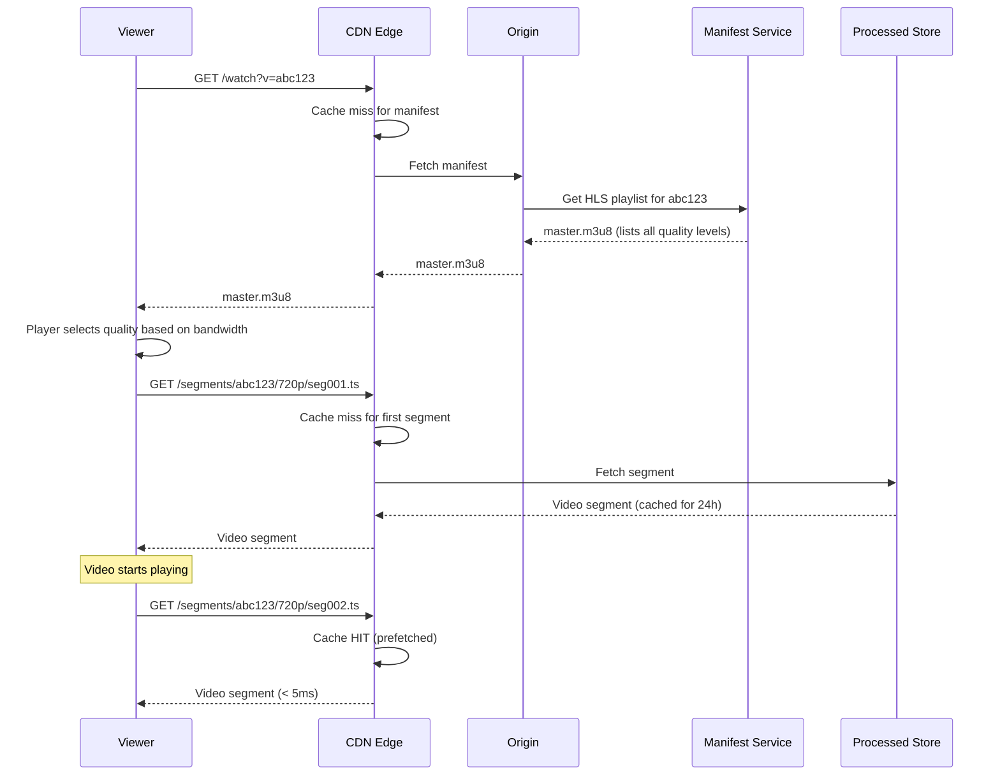
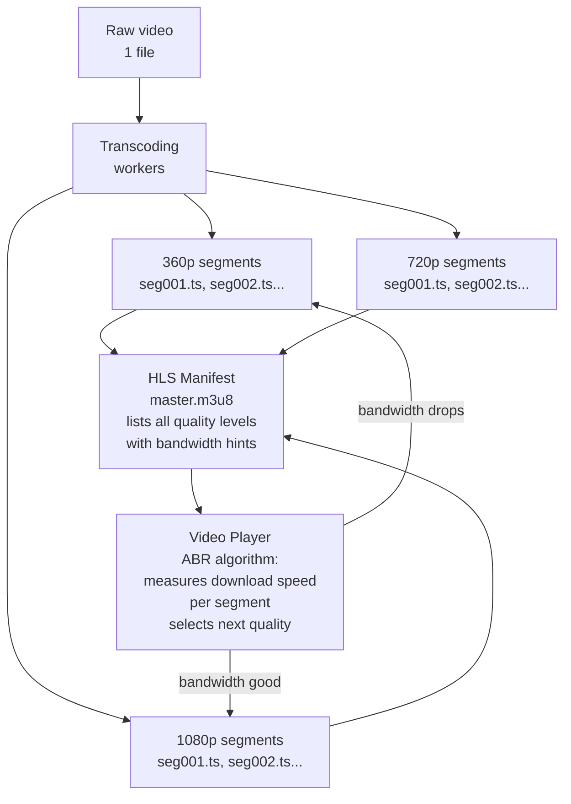
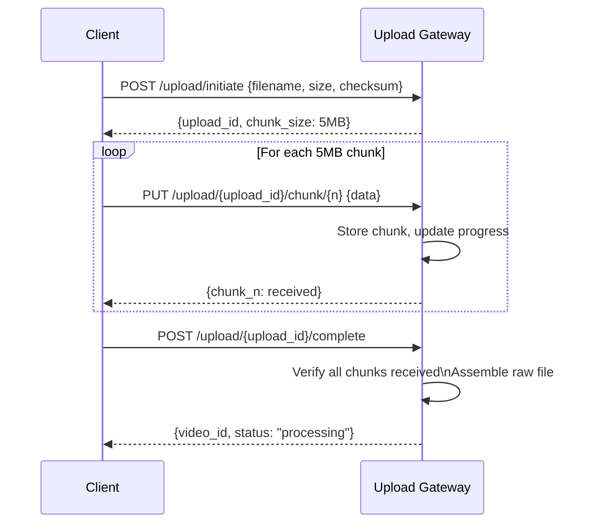
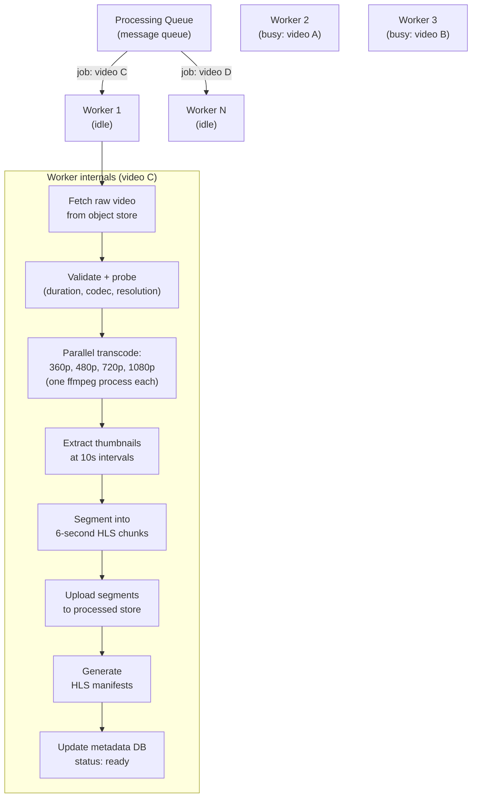
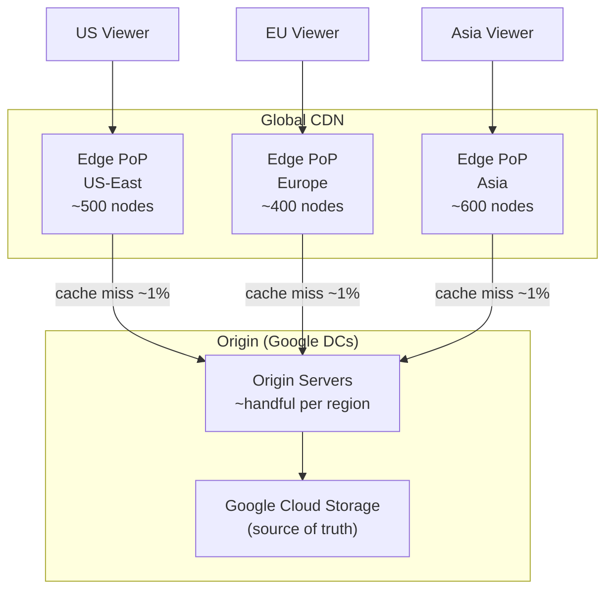
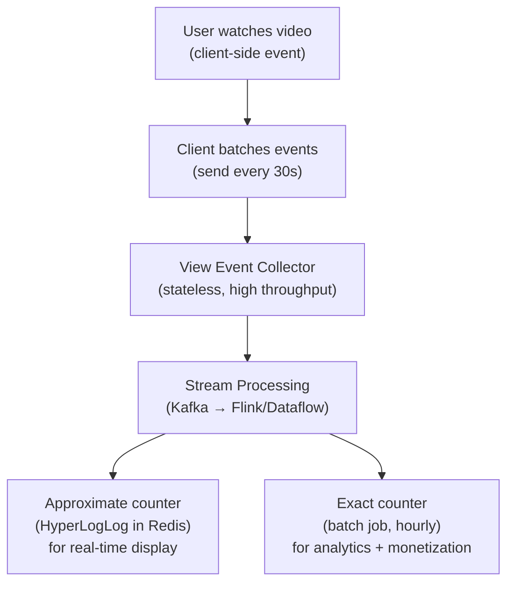
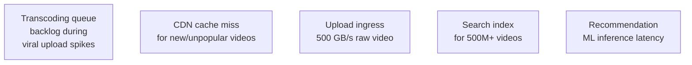
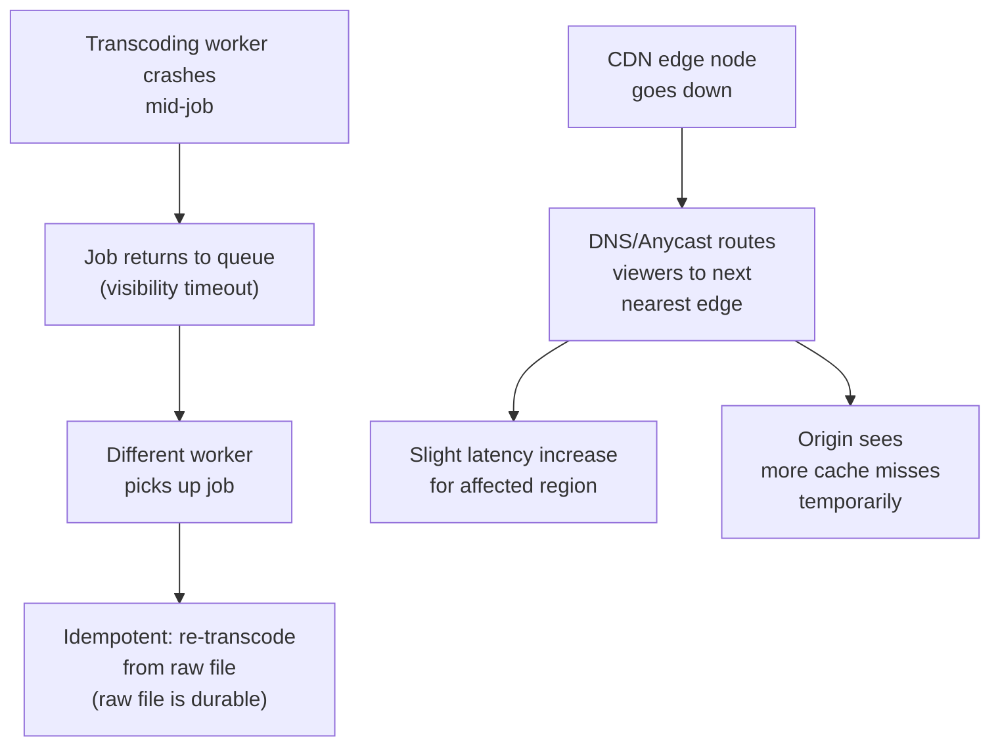

# System Design Walkthrough — YouTube (Video Streaming Platform)

> Language-agnostic. The architecture is what matters — not whether you implement it in Python, C++, or Go.

---

## The Question

> "Design a video streaming platform like YouTube. Users should be able to upload videos, have them processed and available for streaming, and watch them with adaptive quality based on their connection speed."

---

## The Core Insight — Before You Draw Anything

YouTube has two completely separate problems that are easy to conflate:

1. **The upload and processing pipeline** — a video file comes in, gets transcoded into multiple resolutions and formats, and becomes streamable. This is a batch processing problem. Latency is measured in minutes, not milliseconds.

2. **The streaming and delivery problem** — billions of users watching video simultaneously. This is a read-heavy, globally distributed caching problem. The origin servers barely matter — the CDN does all the work.

These two pipelines share almost no infrastructure. Design them separately.

The language choices (Python for ML/processing, C++ for performance-critical encoding, Go for services) are consequences of these two problems, not causes.

---

## Step 1 — Clarify Requirements

### Functional Requirements

| # | Requirement |
|---|-------------|
| F1 | Users can upload videos (up to 10GB, any common format) |
| F2 | Videos are transcoded to multiple resolutions (360p, 480p, 720p, 1080p, 4K) |
| F3 | Videos are available for streaming within minutes of upload |
| F4 | Adaptive bitrate streaming — quality adjusts to connection speed |
| F5 | Users can search for videos |
| F6 | Users can like, comment, and subscribe to channels |
| F7 | Recommendations feed on homepage |
| F8 | View count tracking |

**Out of scope:** live streaming, YouTube Shorts, ads, monetization, YouTube Premium.

### Non-Functional Requirements

| Attribute | Target |
|-----------|--------|
| DAU | 2 billion viewers, 500 hours of video uploaded per minute |
| Video watch time | 1 billion hours/day |
| Upload processing time | Video available within 5 minutes of upload |
| Streaming latency | < 2s to first frame (time-to-first-byte) |
| Availability | 99.99% for streaming; 99.9% for upload |
| Durability | Videos stored permanently (never lost) |
| Consistency | Eventual — view counts, likes can lag by seconds |

### The Key Constraints

- **500 hours uploaded per minute** — the processing pipeline must be massively parallel.
- **1 billion hours watched per day** — ~11M concurrent streams. No origin server can handle this. CDN is not optional, it's the entire delivery strategy.
- **Adaptive bitrate** — the same video must exist in 5–8 quality levels. Storage is multiplied accordingly.

---

## Step 2 — Back-of-the-Envelope Estimates

```
Upload traffic:
  500 hours of video/minute = 8.3 hours/second
  Average raw video: 1 GB/minute of footage
  8.3 hours/s × 60 min × 1 GB = ~500 GB/s raw upload ingress
  → Need a dedicated upload ingestion tier, not the same servers as streaming

Transcoding:
  1 hour of raw video → ~5 quality levels × ~500 MB each = 2.5 GB output
  500 hours/min → 500 × 2.5 GB = 1.25 TB of transcoded output per minute
  → Transcoding is CPU-intensive; needs a large worker pool

Storage:
  1.25 TB/min × 60 × 24 × 365 = ~657 PB/year of new video
  Total YouTube library: estimated ~1 exabyte
  → Distributed object storage (GCS / S3) is the only viable option

Streaming (read traffic):
  1B hours/day = ~11M concurrent streams
  Average stream bitrate: 2 Mbps (mix of qualities)
  11M × 2 Mbps = 22 Tbps of egress bandwidth
  → No data center can serve 22 Tbps. CDN edge nodes serve this.
  → Origin servers only serve cache misses (~1% of traffic)

Metadata (video info, comments, likes):
  500M videos × 1 KB metadata = 500 GB → trivial, fits in a database
  Comments: ~10B total, avg 200 bytes = 2 TB → manageable
```

### Key Observations

1. **22 Tbps egress** — this is served entirely by CDN. Origin servers handle ~220 Gbps (1% cache miss rate). Design the CDN strategy first.
2. **500 GB/s upload ingress** — upload and streaming are on completely separate infrastructure.
3. **Transcoding is the bottleneck** — 1.25 TB/min of output requires thousands of parallel transcoding workers.
4. **Storage is exabyte-scale** — only distributed object storage (GCS, S3) works here.

---

## Step 3 — High-Level Design

### Two Separate Pipelines



### Happy Path — Upload and Processing



### Happy Path — Watching a Video



---

## Step 4 — Detailed Component Design

### 4.1 Adaptive Bitrate Streaming (ABR) — How Quality Adapts

This is the core technical innovation that makes YouTube work on any connection. The video is split into small segments (2–10 seconds each), and the player can switch quality between segments.



**HLS (HTTP Live Streaming) manifest structure:**
```
master.m3u8
  → 360p.m3u8  (lists all 360p segments)
  → 720p.m3u8  (lists all 720p segments)
  → 1080p.m3u8 (lists all 1080p segments)

720p.m3u8:
  #EXTINF:6.0
  seg001.ts
  #EXTINF:6.0
  seg002.ts
  ...
```

The player downloads the master manifest, picks a quality level, downloads that quality's segment list, and starts fetching segments. If download speed drops, it switches to a lower quality manifest for the next segment — seamlessly.

### 4.2 Upload Pipeline — Chunked Resumable Upload

Raw video files are large (up to 10GB). A single HTTP upload would fail on any network hiccup. The solution: chunked resumable uploads.



**Why chunked?**
- Network failure mid-upload: resume from last successful chunk, not from the beginning
- Progress reporting: client knows exactly how much has been received
- Parallel chunk upload: multiple chunks in flight simultaneously (faster on high-bandwidth connections)

### 4.3 Transcoding Workers — The Processing Pipeline

Transcoding is CPU-bound and embarrassingly parallel. Each video is independent.



**Scaling the worker pool:**
- Workers are stateless — pull jobs from the queue, process, push results
- Auto-scale based on queue depth: if queue grows, spin up more workers
- Spot/preemptible instances are ideal — transcoding is interruptible (checkpoint progress)
- A 1-hour video takes ~5 minutes to transcode on a modern 32-core machine

### 4.4 CDN Strategy — The Real Delivery System

The CDN is not an optimization — it's the entire delivery architecture. Without it, YouTube doesn't exist.



**Cache hit rate is everything.** Popular videos (top 1% of content) account for ~80% of views. These are permanently cached at every edge node. The long tail (obscure videos) has lower cache hit rates but also lower traffic — the math works out.

**CDN cache key:** `(video_id, quality, segment_number)` — each segment is independently cacheable. A cache miss on segment 1 doesn't affect segment 2.

**Cache TTL:** Video segments are immutable (a transcoded segment never changes) — TTL can be 30 days or more. Manifests have shorter TTL (1 hour) to allow quality level updates.

### 4.5 View Count — Eventual Consistency at Scale

Counting 1 billion views per day accurately in real time would require a distributed counter that handles ~11,000 increments per second per popular video. Strong consistency here is unnecessary and expensive.



**Why approximate for display?** Users don't care if the view count shows 1,234,567 vs 1,234,589. HyperLogLog gives ~1% error with 1/1000th the memory of an exact counter. The exact count is computed hourly for monetization purposes where accuracy matters.

---

## Step 5 — Decision Log

### Decision 1: Transcoding architecture — monolithic vs. pipeline stages

**Context:** Transcoding a video involves multiple steps: validation, audio extraction, video encoding per resolution, thumbnail generation, segmentation, manifest generation. Should this be one job or a pipeline of stages?

| Option | Pros | Cons |
|--------|------|------|
| Monolithic worker (one process does everything) | Simple; no coordination overhead | If one step fails, restart everything; can't scale steps independently |
| Pipeline stages (each step is a separate job) | Fault isolation; scale each stage independently; partial results available early | More complex orchestration; more queue hops |

**Decision:** Pipeline stages with a workflow orchestrator.

**Rationale:** Transcoding to 1080p takes 10× longer than transcoding to 360p. With a monolithic worker, 360p isn't available until 1080p finishes. With pipeline stages, 360p can be published first — video is available sooner. Fault isolation also matters: if 1080p transcoding fails, 360p is still available.

**Trade-offs accepted:** More complex orchestration. Need a workflow system (e.g., a DAG scheduler) to manage dependencies between stages.

---

### Decision 2: Video storage — object storage vs. distributed filesystem vs. custom

**Context:** Exabyte-scale storage for video segments. High read throughput (CDN cache misses). Write-once, read-many access pattern.

| Option | Pros | Cons |
|--------|------|------|
| Object storage (S3/GCS) | Designed for this; unlimited scale; CDN integration; cheap | Higher latency than local disk (~50ms); eventual consistency on overwrite |
| Distributed filesystem (HDFS, Ceph) | Lower latency; strong consistency | Operational complexity; doesn't integrate with CDN natively |
| Custom blob store (like YouTube's Colossus) | Optimized for the exact access pattern | Massive engineering investment; only viable at Google scale |

**Decision:** Object storage (GCS/S3) for most deployments; custom at Google scale.

**Rationale:** Object storage is write-once, read-many — a perfect fit for immutable video segments. CDN integration is native. At Google's scale, they built Colossus (successor to GFS) for lower latency and tighter CDN integration, but that's only justified at exabyte scale.

---

### Decision 3: Streaming protocol — HLS vs. DASH vs. progressive download

**Context:** Need to deliver video with adaptive quality to billions of devices.

| Option | Pros | Cons |
|--------|------|------|
| Progressive download (single MP4) | Simple; works everywhere | No adaptive quality; must download from beginning; no seeking without full download |
| HLS (HTTP Live Streaming) | Adaptive bitrate; works on all Apple devices; CDN-friendly (standard HTTP) | Apple-specific origin; ~10s segment latency |
| DASH (Dynamic Adaptive Streaming over HTTP) | Open standard; adaptive bitrate; CDN-friendly | Less native support on older devices |

**Decision:** HLS for broad compatibility; DASH for modern browsers; both served from the same segmented files.

**Rationale:** Both HLS and DASH use the same underlying segmented video files — only the manifest format differs. Serving both adds minimal overhead but maximizes device compatibility. Progressive download is only used as a fallback for very old clients.

---

### Decision 4: View count consistency — strong vs. eventual

**Context:** View counts are displayed on every video. 11M concurrent streams means ~11K view events per second per popular video.

| Option | Pros | Cons |
|--------|------|------|
| Strong consistency (increment DB counter per view) | Exact count always | Database bottleneck at 11K writes/s per video; locks; latency |
| Eventual consistency (batch + stream processing) | Scales to any throughput; no DB bottleneck | Count lags by seconds; approximate for display |
| Approximate (HyperLogLog) | Constant memory; ~1% error | Not suitable for monetization |

**Decision:** Eventual consistency with approximate display count + exact hourly batch for monetization.

**Rationale:** Users don't need exact real-time view counts. The display count can lag by seconds or minutes — nobody notices. Monetization (ad revenue) requires exact counts, but those can be computed hourly in a batch job. This decouples the high-throughput event collection from the accuracy requirement.

---

## Step 6 — Bottlenecks & Trade-offs

### Identified Bottlenecks



### Mitigations

| Bottleneck | Mitigation |
|------------|-----------|
| Transcoding backlog | Auto-scale worker pool based on queue depth. Prioritize popular creators (faster processing SLA). Use spot instances for cost efficiency |
| CDN cache miss for new videos | Pre-warm CDN: push first N segments to edge nodes immediately after transcoding. Popular videos are pre-positioned globally |
| Upload ingress | Dedicated upload ingestion tier (separate from streaming). Chunked upload with parallel chunk transfer. Regional upload endpoints (upload to nearest DC, replicate internally) |
| Search at 500M videos | Inverted index (Elasticsearch or custom). Index title, description, tags, transcript. Separate search cluster from serving cluster |
| Recommendation latency | Pre-compute recommendations offline (batch ML job). Serve from cache. Real-time signals (current session) applied as lightweight re-ranking on top of pre-computed candidates |

### Failure Mode Analysis



**What can be lost?**
- A transcoding job in progress: re-queued automatically. Raw file is durable. No data loss.
- An in-progress upload (client crash): client resumes from last chunk. No data loss.
- View count events: a small number may be lost in transit. Acceptable — view counts are approximate for display anyway.

### Scaling to 10× (5,000 hours uploaded per minute)

| Component | Current | At 10× | Action |
|-----------|---------|--------|--------|
| Transcoding workers | ~10,000 | ~100,000 | Auto-scale (spot instances) |
| Upload ingress | ~500 GB/s | ~5 TB/s | More regional upload endpoints |
| Object storage | ~1 EB | ~10 EB | Object storage scales automatically |
| CDN egress | ~22 Tbps | ~220 Tbps | Add CDN edge capacity (CDN providers handle this) |
| Metadata DB | ~500 GB | ~5 TB | Sharding by video_id |

---

## WhatsApp vs. YouTube — The Contrast

These two systems from the same image illustrate how different the same "scale" problem looks depending on the access pattern:

| Dimension | WhatsApp | YouTube |
|-----------|----------|---------|
| Primary problem | Real-time delivery to specific users | Global read-heavy distribution to anyone |
| Data model | Messages (small, transient) | Video segments (large, permanent) |
| Write pattern | High write throughput (1M msg/s) | High write throughput (500 GB/s upload) |
| Read pattern | Point reads (deliver to specific user) | Broadcast reads (same video to millions) |
| Caching | Not useful (messages are unique per recipient) | Everything (same segment served to millions) |
| CDN role | Minimal (media only) | Central (serves 99% of traffic) |
| Consistency | At-least-once delivery (critical) | Eventual (view counts, recommendations) |
| Storage model | Transient (delete after delivery) | Permanent (videos stored forever) |
| Hard problem | Connection scale, delivery guarantees | Transcoding pipeline, CDN cache hit rate |

The language choices follow from these constraints — not the other way around.
