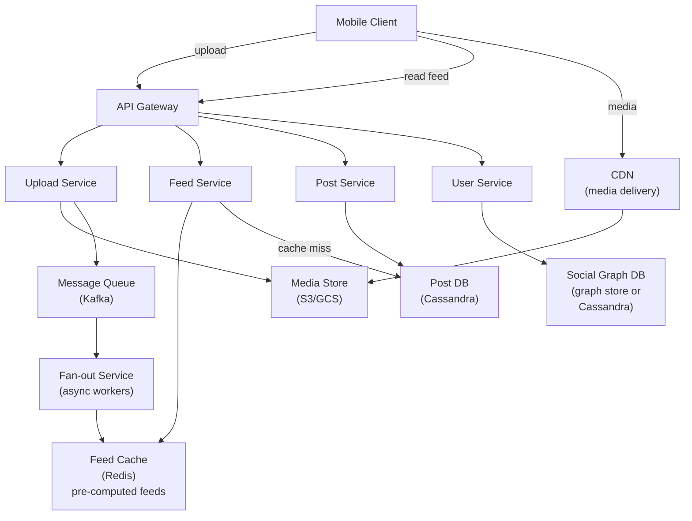
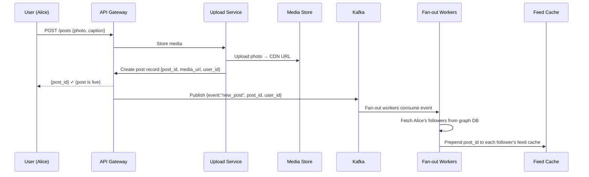
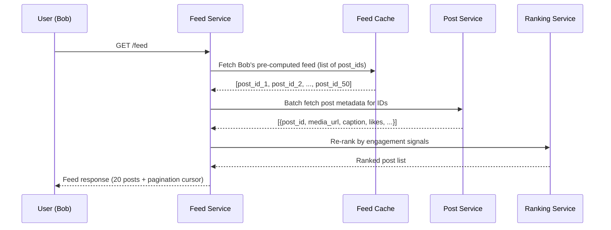
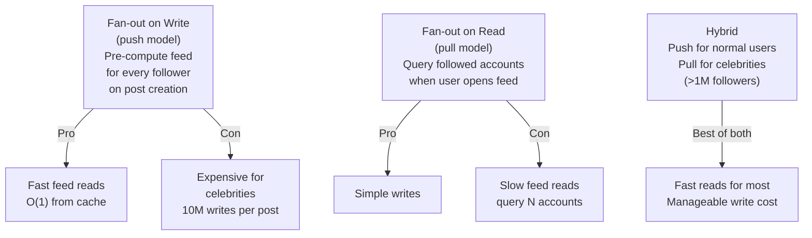
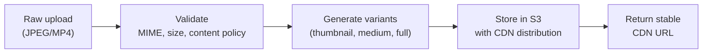

# System Design Walkthrough — Instagram (Photo & Video Social Network)

> Language-agnostic. Focus is on architecture, data flow, and trade-offs.

---

## The Question

> "Design a photo and video sharing social network like Instagram. Users upload media, follow other users, and see a feed of content from people they follow."

---

## Core Insight

Instagram has three distinct hard problems that are easy to conflate:

1. **Media storage and delivery** — photos and videos at petabyte scale, served globally with low latency. This is a CDN + object storage problem.
2. **Feed generation** — showing each user a ranked, personalized list of posts from people they follow. This is the fan-out problem.
3. **Social graph** — who follows whom, at billions of edges. This is a graph storage and traversal problem.

The feed generation problem is what makes Instagram architecturally interesting. At 500M DAU with some users following thousands of accounts, naive approaches collapse.

---

## Step 1 — Requirements

### Functional
- Upload photos and videos (images up to 10MB, videos up to 60s)
- Follow / unfollow users
- Home feed: ranked posts from followed accounts
- Like, comment, save posts
- Stories (24-hour ephemeral content)
- Explore / discovery feed
- Direct messages (out of scope for this walkthrough)

### Non-Functional

| Attribute | Target |
|-----------|--------|
| DAU | 500M |
| Photos uploaded/day | 100M |
| Feed reads/day | 5B (10 per DAU) |
| Feed load latency | < 200ms p99 |
| Media upload latency | < 3s for photo |
| Availability | 99.99% |
| Consistency | Eventual — feed can lag seconds |

---

## Step 2 — Estimates

```
Media uploads:
  100M photos/day × 3MB avg = 300 TB/day ingress
  Videos: 10M/day × 50MB avg = 500 TB/day
  Total: ~800 TB/day → ~9 GB/s ingress

Feed reads:
  5B/day → ~58,000 reads/s
  Each feed: 20 posts × 1KB metadata = 20KB
  58,000 × 20KB = ~1.2 GB/s egress (metadata only)
  Media egress via CDN: much higher, handled separately

Social graph:
  1B users × avg 500 follows = 500B edges
  Each edge: ~20 bytes → ~10 TB for the graph
```

**Key observation:** Feed reads (58K/s) vastly outnumber writes (1,200 uploads/s). This is a read-heavy system — optimize the read path aggressively.

---

## Step 3 — High-Level Design



### Happy Path — User Posts a Photo



### Happy Path — User Opens Feed



---

## Step 4 — Detailed Design

### 4.1 Feed Generation — The Fan-Out Problem

This is the core architectural challenge. When Alice (10M followers) posts a photo, do you push to all 10M feeds immediately, or do you pull when each follower opens the app?



**Decision: Hybrid fan-out**
- Users with < 1M followers: fan-out on write (push post_id to each follower's Redis feed list)
- Users with > 1M followers (celebrities): fan-out on read (merge celebrity posts at read time)
- Feed cache stores a list of `post_id`s, not full post data — keeps cache small

### 4.2 Social Graph Storage

```
Follows table (Cassandra):
  Partition key: follower_id
  Clustering key: followee_id, followed_at

  → "Who does Alice follow?" = single partition scan
  → "Who follows Alice?" = separate inverted table (followee_id → follower_ids)
```

The inverted table (followers of a user) is what the fan-out service reads. For celebrities with 100M followers, this is a large partition — read in batches.

### 4.3 Media Pipeline



Photos are stored in multiple sizes (thumbnail 150px, medium 640px, full 1080px) to avoid serving 10MB originals to mobile clients on thumbnails.

---

## Step 5 — Decision Log

| Decision | Options | Choice | Rationale |
|----------|---------|--------|-----------|
| Feed generation | Push / Pull / Hybrid | Hybrid | Pure push breaks for celebrities; pure pull is too slow |
| Post storage | SQL / Cassandra | Cassandra | High write throughput; time-series access pattern (recent posts first) |
| Feed cache | Redis list / Sorted set | Redis sorted set (score = timestamp) | Efficient range queries for pagination |
| Media storage | Self-hosted / S3 | S3 + CDN | Petabyte scale; CDN integration; operational simplicity |
| Social graph | SQL / Graph DB / Cassandra | Cassandra (two tables) | Simple follow/unfollow queries; no complex graph traversal needed |

---

## Step 6 — Bottlenecks

| Bottleneck | Mitigation |
|------------|-----------|
| Celebrity post fan-out (10M followers) | Skip fan-out; merge at read time from a "celebrity posts" cache |
| Feed cache size (50 posts × 500M users) | Store only post_ids (8 bytes each) not full posts; 50 × 8B × 500M = 200GB — fits in Redis cluster |
| Hot media (viral photo) | CDN caches at edge; origin sees < 1% of traffic |
| Stories expiry (24h TTL) | TTL on Redis keys + background cleanup job; Cassandra TTL on story records |
