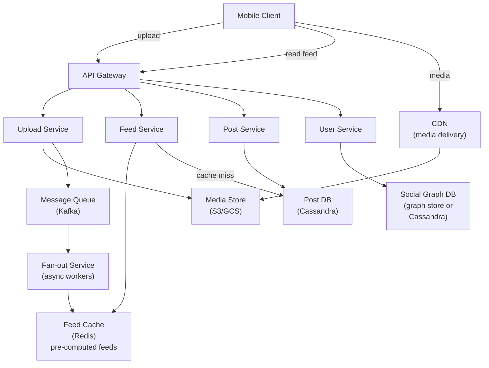
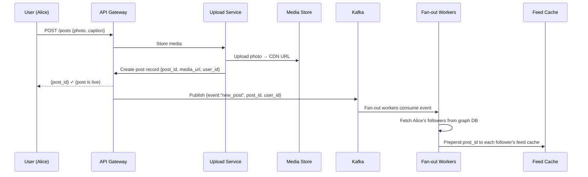
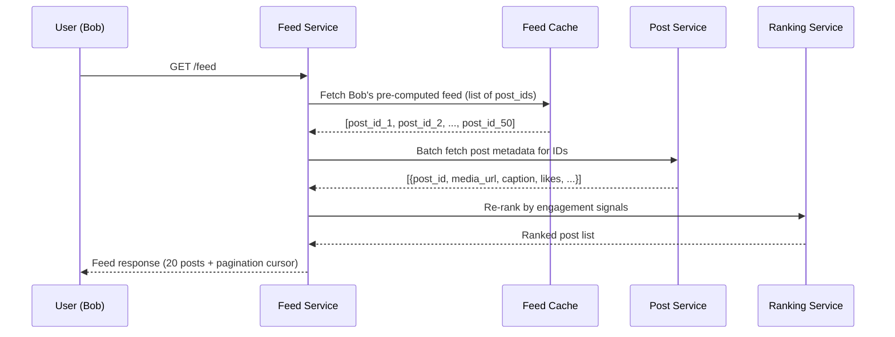
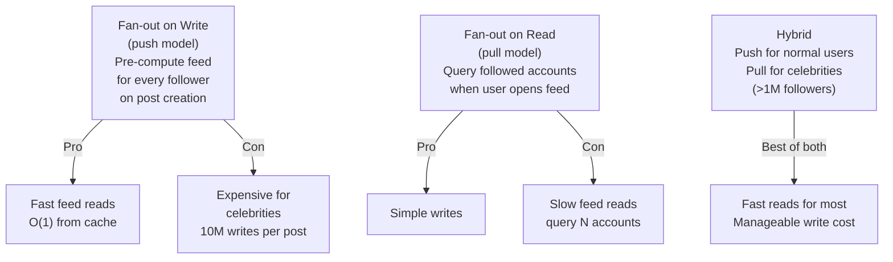
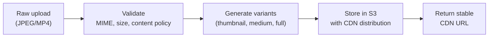

# System Design Walkthrough — Instagram (Photo & Video Social Network)

> Language-agnostic. Focus is on architecture, data flow, and trade-offs.

---

## The Question

> "Design a photo and video sharing social network like Instagram. Users upload media, follow other users, and see a feed of content from people they follow."

---

## Core Insight

Instagram has three distinct hard problems that are easy to conflate:

1. **Media storage and delivery** — photos and videos at petabyte scale, served globally with low latency. This is a CDN + object storage problem.
2. **Feed generation** — showing each user a ranked, personalized list of posts from people they follow. This is the fan-out problem.
3. **Social graph** — who follows whom, at billions of edges. This is a graph storage and traversal problem.

The feed generation problem is what makes Instagram architecturally interesting. At 500M DAU with some users following thousands of accounts, naive approaches collapse.

---

## Step 1 — Requirements

### Functional
- Upload photos and videos (images up to 10MB, videos up to 60s)
- Follow / unfollow users
- Home feed: ranked posts from followed accounts
- Like, comment, save posts
- Stories (24-hour ephemeral content)
- Explore / discovery feed
- Direct messages (out of scope for this walkthrough)

### Non-Functional

| Attribute | Target |
|-----------|--------|
| DAU | 500M |
| Photos uploaded/day | 100M |
| Feed reads/day | 5B (10 per DAU) |
| Feed load latency | < 200ms p99 |
| Media upload latency | < 3s for photo |
| Availability | 99.99% |
| Consistency | Eventual — feed can lag seconds |

---

## Step 2 — Estimates

```
Media uploads:
  100M photos/day × 3MB avg = 300 TB/day ingress
  Videos: 10M/day × 50MB avg = 500 TB/day
  Total: ~800 TB/day → ~9 GB/s ingress

Feed reads:
  5B/day → ~58,000 reads/s
  Each feed: 20 posts × 1KB metadata = 20KB
  58,000 × 20KB = ~1.2 GB/s egress (metadata only)
  Media egress via CDN: much higher, handled separately

Social graph:
  1B users × avg 500 follows = 500B edges
  Each edge: ~20 bytes → ~10 TB for the graph
```

**Key observation:** Feed reads (58K/s) vastly outnumber writes (1,200 uploads/s). This is a read-heavy system — optimize the read path aggressively.

---

## Step 3 — High-Level Design



### Happy Path — User Posts a Photo



### Happy Path — User Opens Feed



---

## Step 4 — Detailed Design

### 4.1 Feed Generation — The Fan-Out Problem

This is the core architectural challenge. When Alice (10M followers) posts a photo, do you push to all 10M feeds immediately, or do you pull when each follower opens the app?



**Decision: Hybrid fan-out**
- Users with < 1M followers: fan-out on write (push post_id to each follower's Redis feed list)
- Users with > 1M followers (celebrities): fan-out on read (merge celebrity posts at read time)
- Feed cache stores a list of `post_id`s, not full post data — keeps cache small

### 4.2 Social Graph Storage

```
Follows table (Cassandra):
  Partition key: follower_id
  Clustering key: followee_id, followed_at

  → "Who does Alice follow?" = single partition scan
  → "Who follows Alice?" = separate inverted table (followee_id → follower_ids)
```

The inverted table (followers of a user) is what the fan-out service reads. For celebrities with 100M followers, this is a large partition — read in batches.

### 4.3 Media Pipeline



Photos are stored in multiple sizes (thumbnail 150px, medium 640px, full 1080px) to avoid serving 10MB originals to mobile clients on thumbnails.

---

## Step 5 — Decision Log

| Decision | Options | Choice | Rationale |
|----------|---------|--------|-----------|
| Feed generation | Push / Pull / Hybrid | Hybrid | Pure push breaks for celebrities; pure pull is too slow |
| Post storage | SQL / Cassandra | Cassandra | High write throughput; time-series access pattern (recent posts first) |
| Feed cache | Redis list / Sorted set | Redis sorted set (score = timestamp) | Efficient range queries for pagination |
| Media storage | Self-hosted / S3 | S3 + CDN | Petabyte scale; CDN integration; operational simplicity |
| Social graph | SQL / Graph DB / Cassandra | Cassandra (two tables) | Simple follow/unfollow queries; no complex graph traversal needed |

---

## Step 6 — Bottlenecks

| Bottleneck | Mitigation |
|------------|-----------|
| Celebrity post fan-out (10M followers) | Skip fan-out; merge at read time from a "celebrity posts" cache |
| Feed cache size (50 posts × 500M users) | Store only post_ids (8 bytes each) not full posts; 50 × 8B × 500M = 200GB — fits in Redis cluster |
| Hot media (viral photo) | CDN caches at edge; origin sees < 1% of traffic |
| Stories expiry (24h TTL) | TTL on Redis keys + background cleanup job; Cassandra TTL on story records |

---

## Interviewer Mode — Hard Follow-Up Questions

---

**Q1: "You use a hybrid fan-out model — push for normal users, pull for celebrities. How do you define 'celebrity'? What happens when a normal user suddenly goes viral and gains 2 million followers overnight?"**

> The threshold is dynamic, not static. We store follower count in the User Service and check it at fan-out time. If follower_count > 1M, skip fan-out and use pull. The viral user problem: they start the day with 50K followers (fan-out on write), go viral, and end the day with 2M. During the transition, their posts are still being fanned out to 50K feeds — that's fine. Once follower_count crosses 1M, the Fan-out Service detects this on the next post and switches to pull mode. Existing pre-computed feed entries for their old posts remain in Redis — they don't need to be cleaned up because they're already delivered. The only edge case: a user crosses the threshold mid-fan-out. We handle this with an idempotency check — if fan-out is already in progress when the threshold is crossed, let it complete. The next post uses pull mode. The threshold itself is tunable — we'd set it based on observed fan-out latency, not a fixed number.

---

**Q2: "Instagram shows you posts from accounts you don't follow in the Explore tab. How does that work architecturally — it's not in your social graph?"**

> Explore is a separate pipeline from the home feed. It's powered by a content-based recommendation model, not the social graph. The pipeline: every post is analyzed at upload time — image classification (objects, scenes, aesthetics), engagement velocity (likes/comments in first hour), hashtags, caption text. These features are stored in a feature store. The recommendation model runs offline (hourly batch) and produces a ranked list of post_ids per user based on their interest profile — inferred from their like/save/comment history. This ranked list is stored in Redis: `explore:{user_id}` → sorted set of post_ids. When the user opens Explore, we fetch from this pre-computed list. The model is retrained daily. Real-time signals (what you liked in the last hour) are applied as a lightweight re-ranking layer on top of the pre-computed candidates. The key architectural point: Explore and home feed are completely separate systems sharing only the post metadata store.

---

**Q3: "Your feed cache stores 800 post_ids per user in Redis. That's 1.6TB for 500M users. Redis goes down. What happens to feed reads?"**

> Feed reads fall back to the database. The Timeline Service has a fallback path: on Redis miss (or Redis unavailable), it queries the social graph for the user's followed accounts, then queries the Post DB for recent posts from those accounts, sorted by timestamp. This is the "fan-out on read" path — slower (200-500ms vs 10ms from cache) but correct. We'd add a circuit breaker: if Redis error rate exceeds 10%, automatically route all feed reads to the DB fallback to avoid hammering a degraded Redis. The DB fallback is expensive — 500K reads/s hitting Cassandra directly. We'd need to shed load: return a cached "stale feed" from a secondary cache (Memcached with longer TTL) or rate-limit feed refreshes to once per 30 seconds per user during the outage. The key point: Redis is a performance optimization, not a correctness requirement. The system degrades gracefully without it.

---

**Q4: "A user posts a photo that violates community guidelines. It's already been fanned out to 10 million follower feeds. How do you remove it?"**

> Removal has two parts: content takedown and feed cleanup. Content takedown is immediate: mark the post as `removed` in the Post DB, invalidate the CDN cache for the media URL (CDN purge API), and return 404 for any direct post URL. Feed cleanup is eventually consistent: we don't immediately scrub 10M Redis feed entries — that's expensive and not necessary for safety. Instead, the Timeline Service filters removed posts at read time: when serving a feed, batch-fetch post metadata for all post_ids in the feed, filter out any with `status: removed`, and return the rest. The removed post simply doesn't appear. The Redis entry stays until it naturally expires (TTL or eviction) — it's harmless because the read-time filter catches it. For urgent cases (CSAM, terrorism), we add the post_id to a blocklist in Redis that the Timeline Service checks before serving — this is a fast O(1) check that ensures the post never appears even if the DB update is delayed.

---

**Q5: "Instagram Stories disappear after 24 hours. How do you implement this at scale — 500M users each potentially having active stories?"**

> Stories use TTL-based expiry at multiple layers. In Cassandra, story records have a TTL of 86,400 seconds (24 hours) — Cassandra automatically tombstones and eventually deletes them. In Redis, the story feed for each user (`stories:{user_id}`) is a sorted set with score = expiry_timestamp. A background job runs every minute and calls `ZREMRANGEBYSCORE stories:{user_id} 0 {now}` to remove expired stories. Media in S3 has a lifecycle policy: objects tagged `story` are deleted after 25 hours (1 hour buffer). The viewer's feed: when loading stories, we fetch the sorted set, filter out any with expiry < now (belt-and-suspenders), and return the rest. The 24-hour boundary is soft — a story might appear for 24h 5min due to TTL imprecision, which is acceptable. The key design: expiry is enforced at the storage layer (Cassandra TTL, S3 lifecycle) not just the application layer, so there's no risk of stories persisting due to an application bug.

---

## Staff Engineer Review

### Missing Sections

**Reels recommendation**
Instagram Reels uses a TikTok-style ML-driven feed — not the social-graph-based photo feed. The ranking model for Reels is trained on watch-time, replays, and shares (not likes alone), and surfaces content from creators the user has never followed. This is a fundamentally different pipeline from the photo feed. The two must coexist in the same app: photo feed = social-graph fan-out; Reels feed = ML candidate generation + ranking. Conflating them in the design misses a core architectural distinction.

**Stories expiry**
Stories expire at 24 hours. The expiry pipeline: a background job (cron or Kafka-scheduled) scans the Stories table for entries with `created_at < now() - 24h`, marks them as expired, removes them from followers' cached story rings (Redis), deletes media from CDN edge caches, and schedules S3 deletion. Edge case: what if the job misses a story (job crash between marking expired and purging Redis)? The next job run must be idempotent — re-processing an already-expired story must not corrupt follower feeds.

**Shadow banning / content moderation**
Instagram shadow-bans accounts algorithmically: the account can post, but their content does not appear in hashtag pages, Explore, or non-followers' feeds. Implementation: a `visibility_flags` field per account in the profile store. The feed generation and search services filter content from shadow-banned accounts without notifying the user. The flag is set by a classifier trained on spam signals, bot behavior, and policy violations — not by manual review.

### Critical Questions

> **"A user with 50M followers posts a photo. You are doing fan-out on read for celebrities. 30 million followers open the app simultaneously at the same moment. How do you prevent a stampede to the celebrity's feed?"**

This is the cache stampede problem at massive scale. Three defenses: (1) **Probabilistic early expiry** — before the cached celebrity feed actually expires, a fraction of requests proactively refresh it, preventing a simultaneous expiry flood. (2) **Request coalescing** — when the cache misses, only one request fetches from the origin; all others wait on a lock (Redis SETNX) for the first result. (3) **Push pre-warming** — when a high-follower account posts, the Feed Service pre-warms a partial fan-out to a CDN-like edge cache tier before any follower requests it. The combination means no more than 1–2 requests ever reach the celebrity's raw post record regardless of how many followers open the app simultaneously.

> **"Instagram's algorithm resurfaces old posts with high engagement. How does your feed service decide to show a week-old post?"**

The feed ranking model scores all candidate posts — not just recent ones. Candidates are generated from: recent posts from followees (last 7 days), posts the user hasn't seen yet regardless of age (tracked via impression log), and algorithmically boosted posts (high engagement velocity relative to posting time). The impression log (`user_id → post_id seen`) is stored in a bloom filter per user — space-efficient membership test to avoid reshowing seen posts. A post from a week ago with a sudden engagement spike (e.g., a celebrity shared it) gets a high recency-adjusted engagement score and re-enters the candidate pool. The ranking model produces a score per candidate; the feed service takes the top-K and orders them.

> **"A user blocks another user, but the blocker has already fanned one of their posts into the blockee's feed cache. How do you handle this?"**

The block relationship must be checked at feed read time, not just at fan-out time. Fan-out writes posts to feed caches eagerly, but the feed service applies a block filter before serving: when a user loads their feed, the service fetches their block list from a fast store (Redis set, updated on block action), then filters out any cached post from a blocked account. The block takes effect within seconds — the next time the blockee refreshes their feed. Posts already rendered on screen are not retroactively removed (client-side enforcement is impractical). This "write eagerly, filter on read" model is simpler and more correct than trying to retroactively purge fan-out caches on every block action.

---

## API Design Snapshot

### Core endpoints
- `POST /v1/posts` create post metadata.
- `POST /v1/posts/{post_id}/media` attach media object references.
- `GET /v1/feed?cursor=...` fetch ranked feed page.
- `POST /v1/posts/{post_id}/like` like/unlike as idempotent toggle.
- `GET /v1/users/{user_id}/posts?cursor=...` profile timeline.

### Reliability and consistency
- Feed reads use cursor pagination and cacheable page fragments.
- Engagement writes use idempotent keys and async counter materialization.
- Fanout tasks deduplicate by `(post_id, follower_id)`.

### Security and limits
- Privacy policy checks (public/private/followers) on reads.
- Per-user write limits and abuse controls on engagement endpoints.

---

## API Data Model and Contract (Ordered)

### 1) Domain resources and ownership
- `Post`: immutable authored content unit.
- `MediaRef`: attachment list per post with canonical ordering.
- `Engagement`: like/repost/reply edges with actor identity.
- `TimelineEntry`: materialized ranking candidate for a viewer.
- `FollowEdge`: directed social graph relation.

### 2) Storage and indexing model
- Post writes in OLTP by `post_id`; timeline materialization async.
- Indexes:
  - `idx_post_by_author(author_id, created_at desc)`
  - `idx_engagement_by_post(post_id, created_at desc)`
  - `idx_timeline_by_user(user_id, rank_bucket, created_at desc)`
- Fanout queue dedupe key: `(post_id, follower_id)`.

### 3) Endpoint matrix (comprehensive)
- `POST /v1/posts` create post/tweet.
- `GET /v1/posts/{post_id}` detail fetch.
- `GET /v1/feed/home?cursor=...` ranked timeline.
- `POST /v1/posts/{post_id}/like` idempotent toggle.
- `POST /v1/posts/{post_id}/repost` repost/retweet edge.
- `POST /v1/posts/{post_id}/reply` threaded reply write.
- `GET /v1/users/{user_id}/posts?cursor=...` author timeline.
- `POST /v1/moderation/report` abuse signal ingest.

### 4) Contract examples
Write contract: `POST /v1/posts`
```json
{
  "author_id": "u_12",
  "client_post_id": "cp_55",
  "text": "launch day",
  "media_ids": ["img_1"],
  "visibility": "followers"
}
```
```json
{
  "post_id": "p_990",
  "state": "published",
  "fanout_enqueued": true,
  "created_at": "2026-05-13T19:20:00Z"
}
```
List contract: `GET /v1/feed/home?cursor=1715600400:p_990&limit=2`
```json
{
  "items": [{"post_id": "p_990", "rank_score": 0.82}, {"post_id": "p_988", "rank_score": 0.80}],
  "next_cursor": "1715600100:p_988",
  "has_more": true
}
```

### 5) Idempotency, concurrency, and consistency
- Post create dedupe: `(author_id, client_post_id)`.
- Like/repost endpoints are state transitions, not blind increments.
- Feed eventually consistent; user timeline strongly consistent to author writes.

### 6) Error taxonomy
- `403_VISIBILITY_DENIED`
- `409_DUPLICATE_CLIENT_POST_ID`
- `422_POLICY_BLOCKED_CONTENT`

### 7) Security, quotas, and observability
- Privacy policy checks on read path.
- Write abuse controls (per-user post, reply, like QPS).
- Metrics: `fanout_enqueue_latency_ms`, `home_feed_p95_ms`, `publish_to_feed_delay_ms`.
