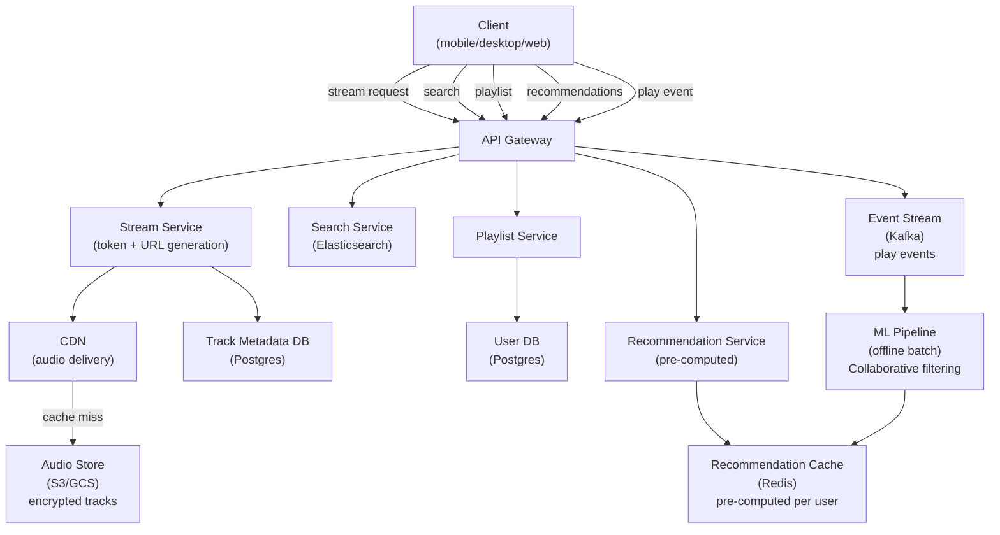
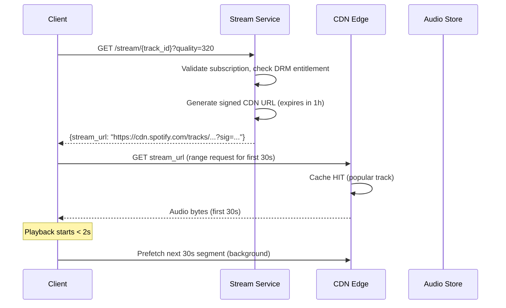
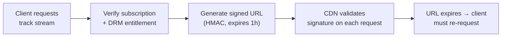
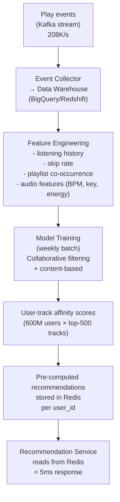
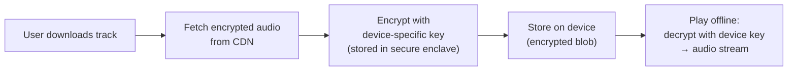

# System Design Walkthrough — Spotify (Music Streaming)

> Language-agnostic. Focus is on architecture, data flow, and trade-offs.

---

## The Question

> "Design a music streaming service like Spotify. Users can search for songs, play them with low latency, create playlists, and get personalized recommendations."

---

## Core Insight

Spotify looks like YouTube for audio, but the constraints are meaningfully different:

- **Songs are short** (3–5 min avg) and **listened to repeatedly** — cache hit rates are extremely high
- **Catalog is finite and stable** — ~100M tracks, rarely changing. Compare to YouTube where 500 hours are uploaded per minute
- **Offline listening is a first-class feature** — users download tracks to device
- **The hard problem is recommendations**, not delivery. Delivery is solved by CDN. Recommendations require understanding listening history across 600M users

---

## Step 1 — Requirements

### Functional
- Stream audio tracks with < 2s start time
- Search catalog (songs, artists, albums, podcasts)
- Create and manage playlists
- Offline download (Premium)
- Personalized recommendations (Discover Weekly, Daily Mix)
- Social features: see what friends listen to, share playlists
- Cross-device sync (pause on phone, resume on laptop)

### Non-Functional

| Attribute | Target |
|-----------|--------|
| MAU | 600M |
| Concurrent streams | ~10M |
| Catalog size | 100M tracks |
| Stream start latency | < 2s |
| Search latency | < 200ms |
| Availability | 99.99% |
| Consistency | Eventual (play counts, recommendations) |

---

## Step 2 — Estimates

```
Audio streaming:
  10M concurrent streams × 128 Kbps (standard quality) = 1.28 Tbps egress
  10M × 320 Kbps (premium) = 3.2 Tbps egress
  → CDN handles this; origin sees < 1%

Catalog storage:
  100M tracks × 5 min avg × 320 Kbps = 100M × 12MB = 1.2 PB
  Multiple quality levels (96/128/320 Kbps) × 3 = ~3.6 PB total
  → Finite and known; can be fully cached at CDN edge

Play events (for recommendations):
  600M MAU × 30 plays/day = 18B play events/day → ~208K events/s
  Each event: ~200 bytes → 42 MB/s ingress to analytics pipeline

Search queries:
  600M MAU × 5 searches/day = 3B/day → ~35K queries/s
```

**Key observation:** The catalog is finite (~3.6 PB). Unlike YouTube, you can pre-position the entire catalog at CDN edge nodes. Cache hit rate approaches 100% for popular tracks.

---

## Step 3 — High-Level Design



### Happy Path — User Plays a Track



---

## Step 4 — Detailed Design

### 4.1 Audio Delivery — DRM and Signed URLs

Spotify can't serve audio files as plain public URLs — that would allow anyone to download the full catalog. The solution: short-lived signed URLs.



The CDN validates the signature on every request. Expired URLs return 403. This prevents URL sharing while keeping the CDN doing the heavy lifting.

### 4.2 Recommendation Engine — The Real Differentiator

Spotify's recommendations (Discover Weekly, Daily Mix) are what retain users. The architecture is a classic offline ML pipeline:



**Why pre-compute?** Real-time ML inference for 600M users at query time is prohibitively expensive. Instead, run the model weekly (or daily for active users), store the top-N recommendations per user in Redis, and serve from cache. The recommendations are slightly stale but users don't notice.

### 4.3 Cross-Device Sync — Playback State

When a user pauses on their phone and resumes on their laptop, the position must sync.

```
Playback state (stored in Redis, TTL 30 days):
  user_id → {
    track_id,
    position_ms,
    device_id,
    context (playlist/album/radio),
    updated_at
  }

On device switch:
  New device polls /me/player → gets current state from Redis
  Resumes from position_ms
```

### 4.4 Offline Downloads

Premium users can download tracks. The downloaded file is encrypted with a device-specific key — it can only be played on the device that downloaded it.



---

## Step 5 — Decision Log

| Decision | Options | Choice | Rationale |
|----------|---------|--------|-----------|
| Audio delivery | Self-hosted / CDN | CDN with signed URLs | Catalog is finite; CDN can cache entire catalog; DRM via signed URLs |
| Recommendations | Real-time inference / Pre-computed | Pre-computed (weekly batch) | 600M users × real-time inference is too expensive; weekly freshness is acceptable |
| Search | SQL LIKE / Elasticsearch | Elasticsearch | Full-text search with fuzzy matching, facets, autocomplete |
| Playlist storage | SQL / NoSQL | Postgres | Playlists are relational (user → playlist → tracks); moderate scale |
| Play event pipeline | Sync DB write / Kafka stream | Kafka | 208K events/s; async; feeds multiple consumers (analytics, recommendations, billing) |

---

## Step 6 — Bottlenecks

| Bottleneck | Mitigation |
|------------|-----------|
| New release spike (Taylor Swift album) | Pre-position tracks at all CDN edge nodes before release; CDN absorbs the spike |
| Recommendation staleness | Run model daily for active users, weekly for inactive; real-time "recently played" signals applied as lightweight re-ranking |
| Search at 35K queries/s | Elasticsearch cluster with read replicas; cache popular queries in Redis (TTL 60s) |
| Playlist fan-out (collaborative playlists) | Collaborative playlists are rare; handle as special case with optimistic locking |

---

## Interviewer Mode — Hard Follow-Up Questions

---

**Q1: "A user is listening to a song. Halfway through, they lose internet connection. What happens? Does the song stop?"**

> No — the player buffers ahead. The Spotify client pre-fetches the next 30 seconds of audio while playing the current 30 seconds. When the connection drops, the player continues from the buffer. If the buffer runs out before the connection restores, playback pauses and shows a buffering indicator. The buffer size is adaptive: on a fast connection, buffer 60 seconds ahead; on a slow connection, buffer 15 seconds (less data to fetch, faster to fill). For Premium users with offline downloads, the entire track is on-device — no buffering needed. The architectural implication: the streaming service doesn't need to maintain a persistent connection per listener. Each segment request is independent HTTP. The client manages the buffer and makes requests proactively. This is why Spotify uses HTTP-based streaming (not a persistent WebSocket) — stateless, CDN-friendly, and resilient to connection drops.

---

**Q2: "Spotify's Discover Weekly drops every Monday. 400 million users get a new playlist simultaneously. How does the system handle this without falling over?"**

> This is a thundering herd problem at the recommendation layer. The mitigation is staggered generation and pre-computation. The ML pipeline runs throughout the week, not just on Sunday night. By Monday morning, all 400M playlists are pre-computed and stored in the recommendation cache (Redis/Cassandra). When users open the app on Monday, they're reading from cache — no ML inference at request time. The "simultaneous" part is a myth: users open the app throughout Monday across all time zones. The actual spike is spread over 24 hours. For the genuine spike (Monday 9am in each time zone), the recommendation cache is read-only and horizontally scalable — add more Redis replicas. The playlist metadata (track list) is stored in Postgres, also read-only at serve time. The CDN handles audio delivery. The only write spike is the playlist generation job itself — but that's a background batch job that runs over 48 hours, not a user-facing request.

---

**Q3: "You said Spotify uses signed URLs for DRM. The signed URL expires in 1 hour. A user is listening to a 3-hour audiobook. What happens when the URL expires mid-playback?"**

> The client handles URL refresh transparently. The Spotify client tracks the expiry time of the current stream URL. When it's within 5 minutes of expiry, the client silently requests a new signed URL from the Stream Service in the background — before the current URL expires. The new URL is swapped in for the next segment request. The user never notices. This is the same pattern as JWT refresh tokens — proactive refresh before expiry, not reactive refresh after failure. The edge case: the client is offline when the URL expires (e.g., phone in airplane mode). In this case, the cached segments already downloaded continue playing. When the client needs a new segment and the URL is expired, it waits for connectivity, refreshes the URL, and continues. For offline downloads, there's no URL — the file is on-device with device-level DRM, so expiry doesn't apply.

---

**Q4: "Two users have identical listening histories. Should they get identical recommendations? What are the implications if yes?"**

> They should get similar but not identical recommendations. If they're identical, we've created a filter bubble — both users only discover the same content, and new artists can never break through to different audience segments. The recommendation system intentionally injects diversity: a small percentage of recommendations (10-15%) are "exploration" slots — tracks outside the user's established taste profile, chosen to expand their musical range. These exploration slots are randomized per user, so two users with identical histories get different exploration tracks. The architectural implication: the recommendation model output is not deterministic. We add a controlled randomness layer after ranking — the top-N candidates are ranked by the model, but the final playlist is sampled from the top-N with some probability weighting rather than always taking the top-20. This also prevents the system from being gamed — if recommendations were fully deterministic, labels could reverse-engineer the algorithm and optimize for it.

---

**Q5: "Spotify pays royalties based on play counts. A play is counted after 30 seconds of listening. How do you ensure this count is accurate and can't be gamed by bots?"**

> Play count accuracy has two parts: correctness and fraud detection. For correctness: the client sends a "play event" after 30 seconds of actual audio playback (not just 30 seconds elapsed — we track actual audio position). The event includes track_id, user_id, device_id, timestamp, and a session token. The event goes to a stream processing pipeline (Kafka → Flink) that deduplicates by (user_id, track_id, session_id) within a 24-hour window — the same session can't count twice. For fraud detection: bot streams have detectable patterns — same user_id playing the same track on loop, thousands of plays from one IP, new accounts with no listening history suddenly generating millions of plays. We run anomaly detection on the play event stream: flag accounts with play velocity > 3 standard deviations from their historical average, flag IP addresses generating > 1000 plays/hour, flag tracks with sudden play spikes from accounts with no prior activity. Flagged plays are quarantined and reviewed before being counted for royalties. The royalty calculation runs on the verified play count, not the raw event count.

---

## Staff Engineer Review

### Missing Sections

**Podcast hosting vs. music**
Spotify stores and serves podcasts (arbitrary-length audio, uploaded daily by anyone). This is a fundamentally different content pipeline from music: no licensing rights management, no label approval, variable file formats (MP3, AAC, WAV submitted by creators), and no pre-existing catalog — podcasts are user-generated. The ingestion pipeline for podcasts is closer to YouTube's upload pipeline, while music is a curated catalog. Two separate pipelines must coexist behind the same playback API.

**Collaborative playlists**
Multiple users editing a playlist concurrently (adding tracks, reordering, removing). This is a lightweight collaborative state problem — less complex than Figma/Google Docs, but still requires conflict resolution. Last-write-wins on track order is usually acceptable. The playlist state is a versioned list in a document store (Cassandra or DynamoDB), with optimistic concurrency control: the client submits an edit with the current version number; the server rejects edits that arrive with a stale version and asks the client to re-fetch and retry.

**Gapless playback**
Listening to an album with no silence between tracks requires pre-fetching the next track before the current one ends. The client monitors playback position and begins pre-fetching the next track when ~20 seconds remain. The audio stream stitching happens in the client's audio buffer: the client decodes the end of track N and the beginning of track N+1 and blends them in the audio pipeline. This requires the CDN response for the next track to arrive before playback reaches the end of the current track — which means the pre-fetch must start early enough to account for worst-case network latency.

### Critical Questions

> **"Spotify's 'Discover Weekly' is generated for 400M users every Monday. Estimate the compute time and cost, and how you'd parallelize it."**

Each user's Discover Weekly requires: (1) load their listen history (last 30 days), (2) run collaborative filtering to find similar users, (3) identify tracks those users listened to that the target user hasn't, (4) rank by predicted affinity, (5) curate to 30 tracks. At ~100ms of compute per user on a single core, 400M users = 40M CPU-seconds = ~11,000 CPU-hours. Parallelized across 10,000 cores = 1.1 hours of wall-clock time — achievable in a Sunday-night batch window. On AWS at $0.10/CPU-hour, cost is ~$1,100 per week in compute alone (plus storage I/O). The parallelization strategy: partition users by user_id hash, one Spark job per partition, run on a Hadoop/EMR cluster spun up Sunday night and torn down Monday morning.

> **"A track's license is revoked mid-stream. How do you immediately stop all active playback without users being able to cache and replay it?"**

License revocation must propagate within seconds. Steps: (1) Mark the track as `licensed=false` in the catalog DB. (2) Publish a `license_revoked:{track_id}` event to Kafka. (3) CDN: purge all edge caches for that track's URLs via CDN invalidation API (takes 10–30 seconds). (4) Active streams: the streaming server stops serving new segments for that track_id. Clients on the current segment finish it (< 10 seconds of audio) and then request the next segment, which returns a 403. (5) Client-side cache: Spotify's offline sync client stores encrypted tracks with a key fetched from the license server on each play. Revoking the license means the license server stops issuing decryption keys for that track — offline cached copies become unplayable immediately on next play attempt.

> **"You have 100M tracks. For any song, you need to find acoustically similar songs in < 100ms for radio/autoplay. How?"**

Acoustic similarity is computed offline, not at query time. The pipeline: extract audio features from every track (tempo, key, timbre, loudness — using signal processing or a pretrained audio embedding model), then represent each track as a dense vector in a high-dimensional space. Store these vectors in an approximate nearest-neighbor (ANN) index (e.g., FAISS, ScaNN, or Pinecone). At query time, look up the current track's vector and return the K nearest neighbors — this is a vector search, not a full scan, taking < 100ms even at 100M vectors. The ANN index is built offline (weekly) and served from memory on dedicated ANN servers. The pre-computed neighbor lists for popular tracks can also be cached in Redis for the most common "similar to X" queries, reducing query time to sub-millisecond.

---

## API Design Snapshot

### Core endpoints
- `GET /v1/playlists/{playlist_id}` playlist metadata.
- `POST /v1/playlists/{playlist_id}/tracks` append tracks in order.
- `GET /v1/recommendations?seed_tracks=...` recommendation retrieval.
- `POST /v1/playback/sessions` create playback session token/context.
- `POST /v1/events/listen` ingest listening telemetry.

### Reliability and consistency
- Playlist mutation requests carry version for conflict detection.
- Telemetry ingestion is buffered/async and idempotent by event ID.
- Playback session state is ephemeral and region-affine.

### Security and limits
- Token scope enforcement (`playlist-write`, `streaming`).
- Rate limits for recommendation and telemetry endpoints.

---

## API Data Model and Contract (Ordered)

### 1) Domain resources and ownership
- `Track`: canonical audio item metadata.
- `Playlist`: ordered mutable collection owned by user/team.
- `PlaylistTrack`: join entity with position and add metadata.
- `PlaybackSession`: active stream context by device/profile.
- `ListenEvent`: immutable telemetry for recommendations/royalties.

### 2) Storage and indexing model
- Playlist OLTP writes with optimistic versioning.
- Indexes:
  - `idx_playlist_by_owner(owner_id, updated_at desc)`
  - `idx_playlist_track(playlist_id, position)`
  - `idx_listen_event(user_id, ts desc)`
- Recommendation candidate caches in memory tier.

### 3) Endpoint matrix (comprehensive)
- `GET /v1/playlists/{playlist_id}` playlist detail.
- `POST /v1/playlists/{playlist_id}/tracks` append tracks.
- `PATCH /v1/playlists/{playlist_id}/tracks/reorder` reorder items.
- `DELETE /v1/playlists/{playlist_id}/tracks/{position}` remove item.
- `POST /v1/playback/sessions` create stream session.
- `POST /v1/playback/sessions/{id}/heartbeat` progress updates.
- `GET /v1/recommendations?seed_tracks=...` recommendations.
- `POST /v1/events/listen` telemetry ingestion.

### 4) Contract examples
Write contract: `POST /v1/playlists/{playlist_id}/tracks`
```json
{
  "client_request_id": "req_55",
  "expected_version": 14,
  "tracks": ["trk_11", "trk_77"]
}
```
```json
{
  "playlist_id": "pl_22",
  "accepted": true,
  "new_version": 15,
  "added_count": 2
}
```
Read contract: `GET /v1/playlists/{playlist_id}`
```json
{
  "playlist_id": "pl_22",
  "version": 15,
  "tracks": [{"position": 1, "track_id": "trk_11"}]
}
```

### 5) Idempotency, concurrency, and consistency
- Mutations dedupe by `client_request_id`.
- Version conflicts return `409` with latest version.
- Playback session writes are eventually persisted but strongly ordered per session.

### 6) Error taxonomy
- `409_PLAYLIST_VERSION_CONFLICT`
- `403_SUBSCRIPTION_REQUIRED`
- `422_TRACK_NOT_AVAILABLE_IN_REGION`

### 7) Security, quotas, and observability
- Scope checks: `playlist-write`, `streaming`, `library-read`.
- Rate limits on recommendation and playback session endpoints.
- Metrics: `playlist_write_p95_ms`, `stream_startup_ms`, `listen_ingest_lag_ms`.
