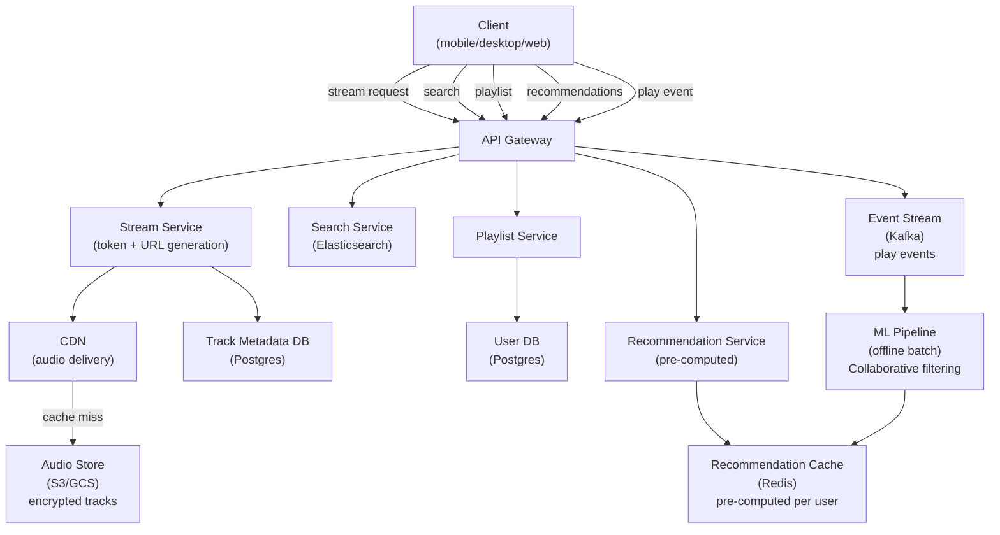
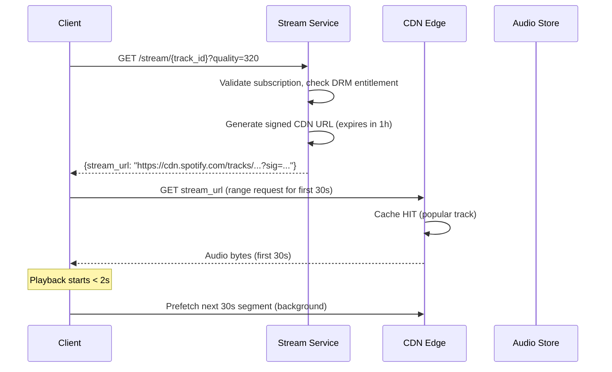
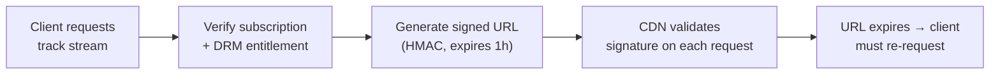
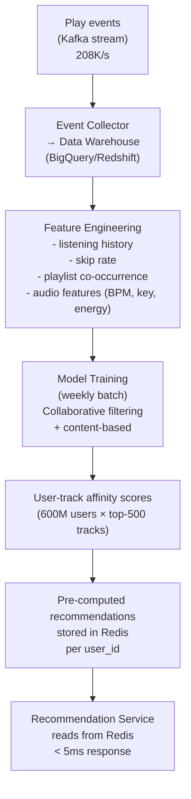
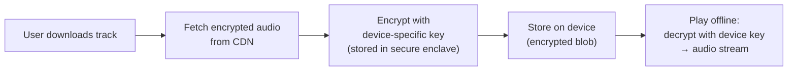

# System Design Walkthrough — Spotify (Music Streaming)

> Language-agnostic. Focus is on architecture, data flow, and trade-offs.

---

## The Question

> "Design a music streaming service like Spotify. Users can search for songs, play them with low latency, create playlists, and get personalized recommendations."

---

## Core Insight

Spotify looks like YouTube for audio, but the constraints are meaningfully different:

- **Songs are short** (3–5 min avg) and **listened to repeatedly** — cache hit rates are extremely high
- **Catalog is finite and stable** — ~100M tracks, rarely changing. Compare to YouTube where 500 hours are uploaded per minute
- **Offline listening is a first-class feature** — users download tracks to device
- **The hard problem is recommendations**, not delivery. Delivery is solved by CDN. Recommendations require understanding listening history across 600M users

---

## Step 1 — Requirements

### Functional
- Stream audio tracks with < 2s start time
- Search catalog (songs, artists, albums, podcasts)
- Create and manage playlists
- Offline download (Premium)
- Personalized recommendations (Discover Weekly, Daily Mix)
- Social features: see what friends listen to, share playlists
- Cross-device sync (pause on phone, resume on laptop)

### Non-Functional

| Attribute | Target |
|-----------|--------|
| MAU | 600M |
| Concurrent streams | ~10M |
| Catalog size | 100M tracks |
| Stream start latency | < 2s |
| Search latency | < 200ms |
| Availability | 99.99% |
| Consistency | Eventual (play counts, recommendations) |

---

## Step 2 — Estimates

```
Audio streaming:
  10M concurrent streams × 128 Kbps (standard quality) = 1.28 Tbps egress
  10M × 320 Kbps (premium) = 3.2 Tbps egress
  → CDN handles this; origin sees < 1%

Catalog storage:
  100M tracks × 5 min avg × 320 Kbps = 100M × 12MB = 1.2 PB
  Multiple quality levels (96/128/320 Kbps) × 3 = ~3.6 PB total
  → Finite and known; can be fully cached at CDN edge

Play events (for recommendations):
  600M MAU × 30 plays/day = 18B play events/day → ~208K events/s
  Each event: ~200 bytes → 42 MB/s ingress to analytics pipeline

Search queries:
  600M MAU × 5 searches/day = 3B/day → ~35K queries/s
```

**Key observation:** The catalog is finite (~3.6 PB). Unlike YouTube, you can pre-position the entire catalog at CDN edge nodes. Cache hit rate approaches 100% for popular tracks.

---

## Step 3 — High-Level Design



### Happy Path — User Plays a Track



---

## Step 4 — Detailed Design

### 4.1 Audio Delivery — DRM and Signed URLs

Spotify can't serve audio files as plain public URLs — that would allow anyone to download the full catalog. The solution: short-lived signed URLs.



The CDN validates the signature on every request. Expired URLs return 403. This prevents URL sharing while keeping the CDN doing the heavy lifting.

### 4.2 Recommendation Engine — The Real Differentiator

Spotify's recommendations (Discover Weekly, Daily Mix) are what retain users. The architecture is a classic offline ML pipeline:



**Why pre-compute?** Real-time ML inference for 600M users at query time is prohibitively expensive. Instead, run the model weekly (or daily for active users), store the top-N recommendations per user in Redis, and serve from cache. The recommendations are slightly stale but users don't notice.

### 4.3 Cross-Device Sync — Playback State

When a user pauses on their phone and resumes on their laptop, the position must sync.

```
Playback state (stored in Redis, TTL 30 days):
  user_id → {
    track_id,
    position_ms,
    device_id,
    context (playlist/album/radio),
    updated_at
  }

On device switch:
  New device polls /me/player → gets current state from Redis
  Resumes from position_ms
```

### 4.4 Offline Downloads

Premium users can download tracks. The downloaded file is encrypted with a device-specific key — it can only be played on the device that downloaded it.



---

## Step 5 — Decision Log

| Decision | Options | Choice | Rationale |
|----------|---------|--------|-----------|
| Audio delivery | Self-hosted / CDN | CDN with signed URLs | Catalog is finite; CDN can cache entire catalog; DRM via signed URLs |
| Recommendations | Real-time inference / Pre-computed | Pre-computed (weekly batch) | 600M users × real-time inference is too expensive; weekly freshness is acceptable |
| Search | SQL LIKE / Elasticsearch | Elasticsearch | Full-text search with fuzzy matching, facets, autocomplete |
| Playlist storage | SQL / NoSQL | Postgres | Playlists are relational (user → playlist → tracks); moderate scale |
| Play event pipeline | Sync DB write / Kafka stream | Kafka | 208K events/s; async; feeds multiple consumers (analytics, recommendations, billing) |

---

## Step 6 — Bottlenecks

| Bottleneck | Mitigation |
|------------|-----------|
| New release spike (Taylor Swift album) | Pre-position tracks at all CDN edge nodes before release; CDN absorbs the spike |
| Recommendation staleness | Run model daily for active users, weekly for inactive; real-time "recently played" signals applied as lightweight re-ranking |
| Search at 35K queries/s | Elasticsearch cluster with read replicas; cache popular queries in Redis (TTL 60s) |
| Playlist fan-out (collaborative playlists) | Collaborative playlists are rare; handle as special case with optimistic locking |
