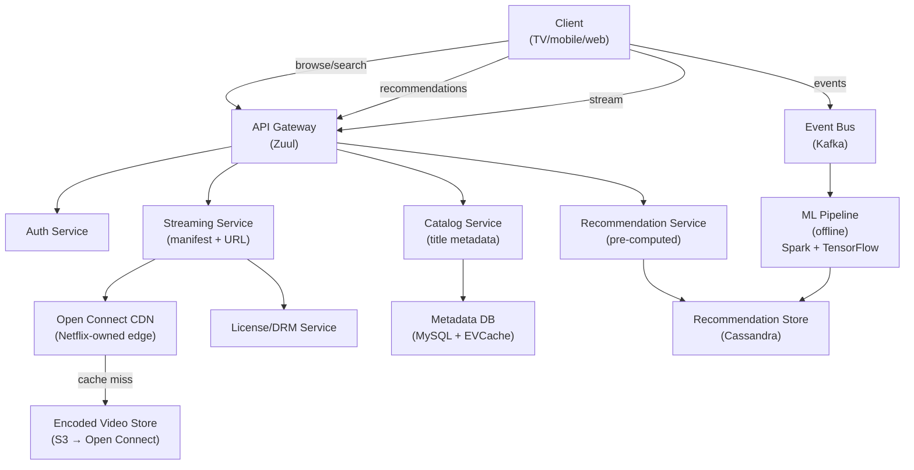
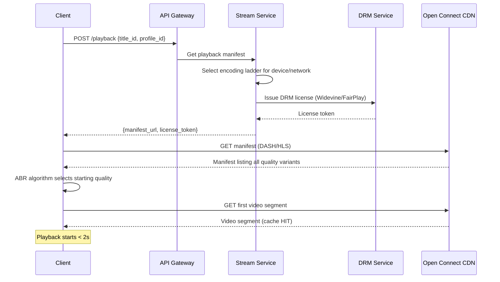
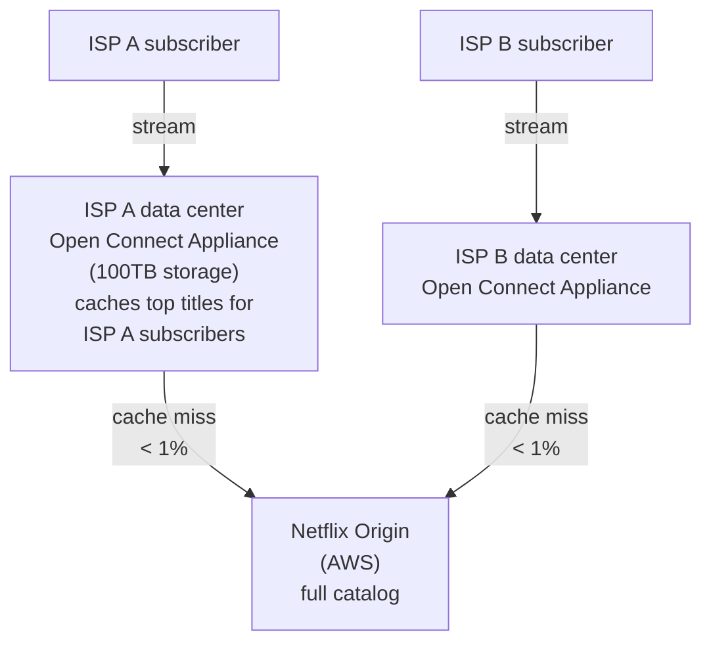
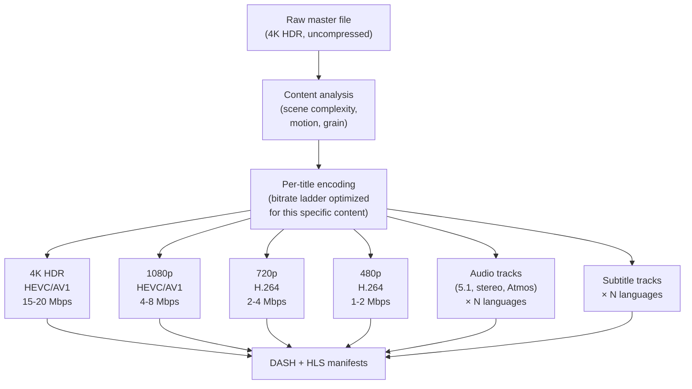
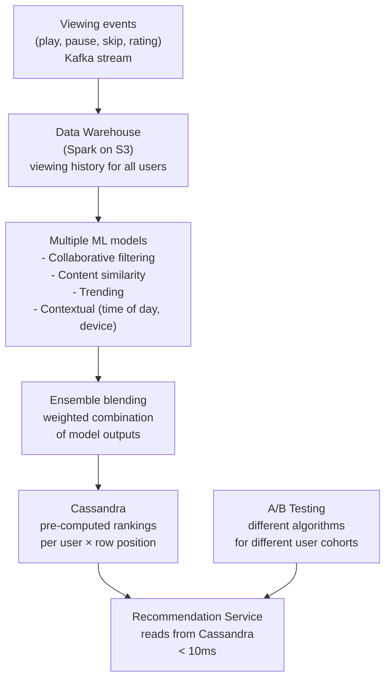
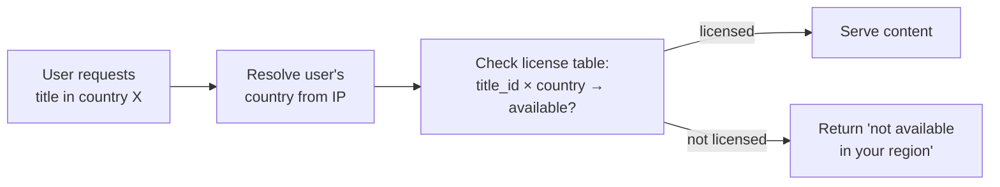

# System Design Walkthrough — Netflix (Video Streaming at Global Scale)

> Language-agnostic. Focus is on architecture, data flow, and trade-offs.

---

## The Question

> "Design a video streaming service like Netflix. Users browse a catalog, select a title, and stream it with adaptive quality. The system must handle global scale with high availability."

---

## Core Insight

Netflix is often confused with YouTube in system design interviews. The key differences:

| | Netflix | YouTube |
|--|---------|---------|
| Content | Licensed, finite catalog (~15K titles) | User-generated, infinite (800M+ videos) |
| Upload | Internal encoding pipeline, not user-facing | User upload at 500 hrs/min |
| Access pattern | Same titles watched by millions | Long tail — most videos rarely watched |
| CDN strategy | Netflix owns its CDN (Open Connect) | Uses third-party CDNs |
| Hard problem | Global availability + personalization | Transcoding pipeline + long-tail delivery |

Netflix's hardest problems are: **global availability** (they target 99.99% uptime across 190 countries) and **personalization** (the recommendation system drives 80% of what people watch).

---

## Step 1 — Requirements

### Functional
- Browse catalog with personalized recommendations
- Stream video with adaptive bitrate (360p to 4K HDR)
- Resume playback across devices
- Download for offline viewing (mobile)
- Multiple profiles per account
- Content availability varies by region (licensing)

### Non-Functional

| Attribute | Target |
|-----------|--------|
| Subscribers | 260M |
| Concurrent streams | ~15M peak |
| Catalog | ~15K titles × multiple formats |
| Stream start time | < 2s |
| Availability | 99.99% |
| Consistency | Eventual (recommendations, continue watching) |
| Regional licensing | Content restricted by country |

---

## Step 2 — Estimates

```
Streaming bandwidth:
  15M concurrent streams × 5 Mbps avg (HD) = 75 Tbps egress
  → Netflix is ~15% of global internet traffic at peak
  → Must be served from edge, not origin

Catalog storage:
  15K titles × 2h avg × multiple formats/resolutions
  1 title in all formats ≈ 1 TB
  15K × 1 TB = 15 PB total
  → Finite; can be fully pre-positioned at CDN

Encoding:
  Netflix encodes each title into ~1,200 variants
  (different resolutions × codecs × audio tracks × subtitles)
  This is a one-time cost per title, not ongoing

Metadata + recommendations:
  260M users × 1KB profile = 260 GB → trivial
  Viewing history: 260M × 500 events × 200B = 26 TB → manageable
```

---

## Step 3 — High-Level Design



### Happy Path — User Starts Watching



---

## Step 4 — Detailed Design

### 4.1 Open Connect — Netflix's Own CDN

Netflix built its own CDN rather than paying third-party CDNs. Open Connect Appliances (OCAs) are servers Netflix installs directly inside ISP data centers.



**Why build your own CDN?**
- At 75 Tbps, third-party CDN costs would be enormous
- ISP peering: traffic stays within the ISP's network — no transit costs, lower latency
- Netflix can pre-position content before it's requested (proactive caching during off-peak hours)
- Full control over cache eviction policy (optimize for Netflix's specific access patterns)

### 4.2 Encoding Pipeline — 1,200 Variants Per Title

Netflix doesn't just transcode to 5 resolutions. They encode each title into ~1,200 variants:



**Per-title encoding:** A simple action scene can be compressed more aggressively than a complex nature documentary. Netflix analyzes each title and generates a custom bitrate ladder — a cartoon might look great at 1 Mbps where a live-action film needs 4 Mbps at the same resolution. This saves ~20% bandwidth vs. fixed bitrate ladders.

### 4.3 Recommendation System — 80% of What You Watch

Netflix's recommendation system is responsible for ~80% of content watched. The architecture:



### 4.4 Regional Licensing — Content Availability

Not all titles are available in all countries. This is a licensing constraint, not a technical one, but it has architectural implications.



The license table is small (15K titles × 190 countries = 2.85M rows) and read-heavy — cache entirely in Redis.

---

## Step 5 — Decision Log

| Decision | Options | Choice | Rationale |
|----------|---------|--------|-----------|
| CDN | Third-party / Own (Open Connect) | Own CDN | At 75 Tbps, cost and control justify building it; ISP peering reduces latency |
| Encoding | Fixed bitrate ladder / Per-title | Per-title encoding | 20% bandwidth savings; better quality at same bitrate |
| Recommendations | Real-time / Pre-computed | Pre-computed (daily) | 260M users × real-time inference is too expensive; daily freshness is fine |
| Metadata DB | SQL / NoSQL | MySQL + EVCache (memcached) | Catalog metadata is relational; EVCache provides read scaling |
| Microservices | Monolith / Microservices | Microservices (500+ services) | Netflix pioneered this; enables independent scaling and deployment |

---

## Step 6 — Bottlenecks

| Bottleneck | Mitigation |
|------------|-----------|
| New release spike (Stranger Things S5) | Pre-position on all OCAs before release; CDN absorbs spike |
| AWS region failure | Multi-region active-active on AWS; Chaos Engineering (Netflix invented this) to test failure modes |
| Recommendation cold start (new user) | Onboarding flow: ask genre preferences; use popularity-based recommendations until enough history |
| DRM license server load | License tokens are cached client-side for session duration; license server only hit on new session |
