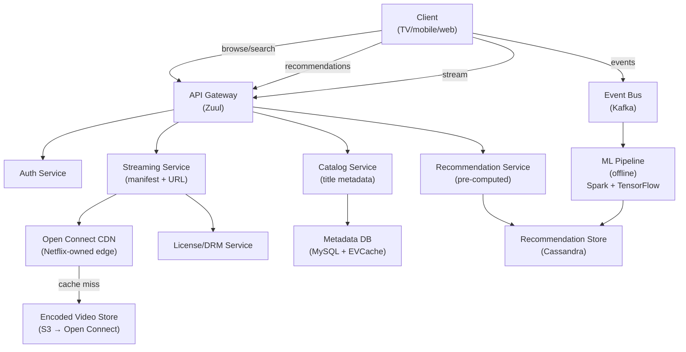
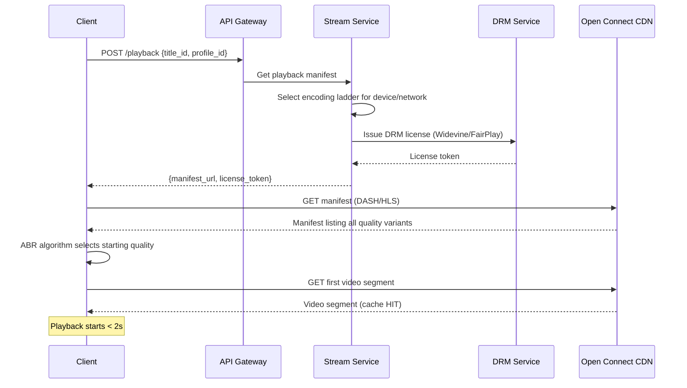
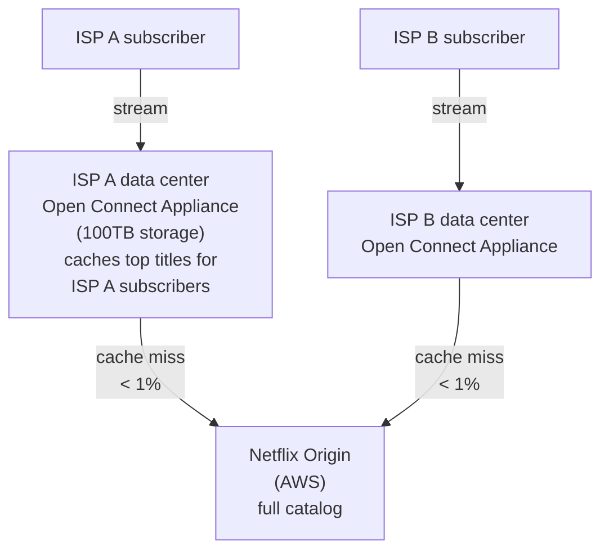
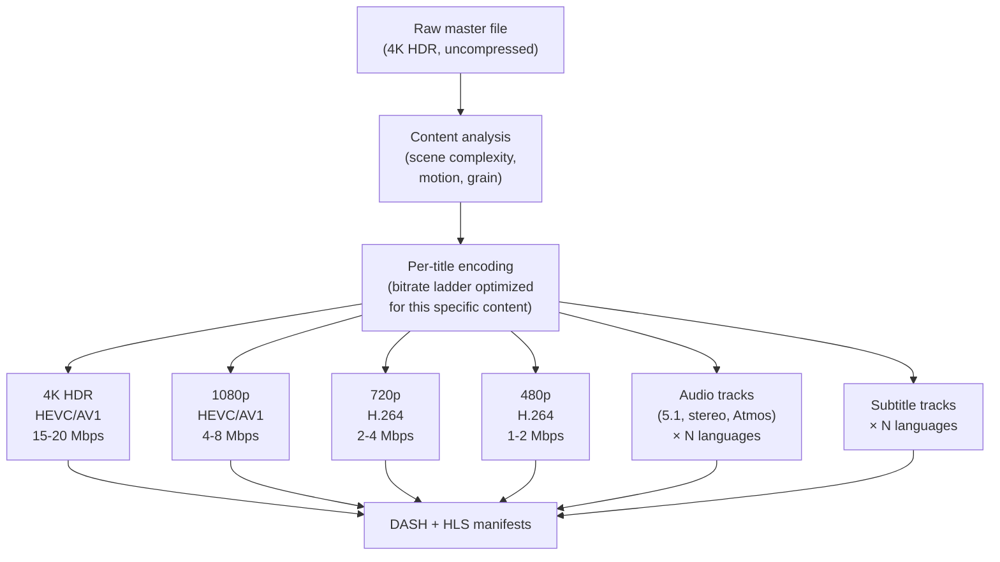
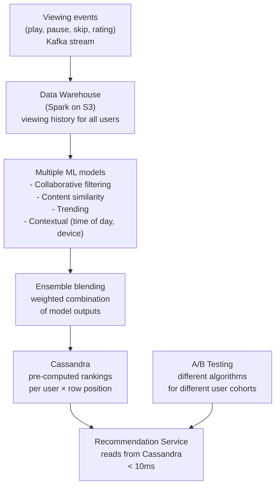
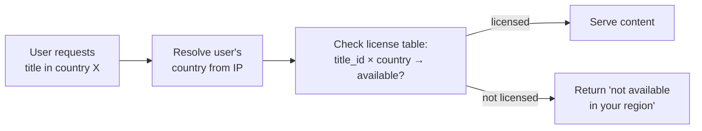

# System Design Walkthrough — Netflix (Video Streaming at Global Scale)

> Language-agnostic. Focus is on architecture, data flow, and trade-offs.

---

## The Question

> "Design a video streaming service like Netflix. Users browse a catalog, select a title, and stream it with adaptive quality. The system must handle global scale with high availability."

---

## Core Insight

Netflix is often confused with YouTube in system design interviews. The key differences:

| | Netflix | YouTube |
|--|---------|---------|
| Content | Licensed, finite catalog (~15K titles) | User-generated, infinite (800M+ videos) |
| Upload | Internal encoding pipeline, not user-facing | User upload at 500 hrs/min |
| Access pattern | Same titles watched by millions | Long tail — most videos rarely watched |
| CDN strategy | Netflix owns its CDN (Open Connect) | Uses third-party CDNs |
| Hard problem | Global availability + personalization | Transcoding pipeline + long-tail delivery |

Netflix's hardest problems are: **global availability** (they target 99.99% uptime across 190 countries) and **personalization** (the recommendation system drives 80% of what people watch).

---

## Step 1 — Requirements

### Functional
- Browse catalog with personalized recommendations
- Stream video with adaptive bitrate (360p to 4K HDR)
- Resume playback across devices
- Download for offline viewing (mobile)
- Multiple profiles per account
- Content availability varies by region (licensing)

### Non-Functional

| Attribute | Target |
|-----------|--------|
| Subscribers | 260M |
| Concurrent streams | ~15M peak |
| Catalog | ~15K titles × multiple formats |
| Stream start time | < 2s |
| Availability | 99.99% |
| Consistency | Eventual (recommendations, continue watching) |
| Regional licensing | Content restricted by country |

---

## Step 2 — Estimates

```
Streaming bandwidth:
  15M concurrent streams × 5 Mbps avg (HD) = 75 Tbps egress
  → Netflix is ~15% of global internet traffic at peak
  → Must be served from edge, not origin

Catalog storage:
  15K titles × 2h avg × multiple formats/resolutions
  1 title in all formats ≈ 1 TB
  15K × 1 TB = 15 PB total
  → Finite; can be fully pre-positioned at CDN

Encoding:
  Netflix encodes each title into ~1,200 variants
  (different resolutions × codecs × audio tracks × subtitles)
  This is a one-time cost per title, not ongoing

Metadata + recommendations:
  260M users × 1KB profile = 260 GB → trivial
  Viewing history: 260M × 500 events × 200B = 26 TB → manageable
```

---

## Step 3 — High-Level Design



### Happy Path — User Starts Watching



---

## Step 4 — Detailed Design

### 4.1 Open Connect — Netflix's Own CDN

Netflix built its own CDN rather than paying third-party CDNs. Open Connect Appliances (OCAs) are servers Netflix installs directly inside ISP data centers.



**Why build your own CDN?**
- At 75 Tbps, third-party CDN costs would be enormous
- ISP peering: traffic stays within the ISP's network — no transit costs, lower latency
- Netflix can pre-position content before it's requested (proactive caching during off-peak hours)
- Full control over cache eviction policy (optimize for Netflix's specific access patterns)

### 4.2 Encoding Pipeline — 1,200 Variants Per Title

Netflix doesn't just transcode to 5 resolutions. They encode each title into ~1,200 variants:



**Per-title encoding:** A simple action scene can be compressed more aggressively than a complex nature documentary. Netflix analyzes each title and generates a custom bitrate ladder — a cartoon might look great at 1 Mbps where a live-action film needs 4 Mbps at the same resolution. This saves ~20% bandwidth vs. fixed bitrate ladders.

### 4.3 Recommendation System — 80% of What You Watch

Netflix's recommendation system is responsible for ~80% of content watched. The architecture:



### 4.4 Regional Licensing — Content Availability

Not all titles are available in all countries. This is a licensing constraint, not a technical one, but it has architectural implications.



The license table is small (15K titles × 190 countries = 2.85M rows) and read-heavy — cache entirely in Redis.

---

## Step 5 — Decision Log

| Decision | Options | Choice | Rationale |
|----------|---------|--------|-----------|
| CDN | Third-party / Own (Open Connect) | Own CDN | At 75 Tbps, cost and control justify building it; ISP peering reduces latency |
| Encoding | Fixed bitrate ladder / Per-title | Per-title encoding | 20% bandwidth savings; better quality at same bitrate |
| Recommendations | Real-time / Pre-computed | Pre-computed (daily) | 260M users × real-time inference is too expensive; daily freshness is fine |
| Metadata DB | SQL / NoSQL | MySQL + EVCache (memcached) | Catalog metadata is relational; EVCache provides read scaling |
| Microservices | Monolith / Microservices | Microservices (500+ services) | Netflix pioneered this; enables independent scaling and deployment |

---

## Step 6 — Bottlenecks

| Bottleneck | Mitigation |
|------------|-----------|
| New release spike (Stranger Things S5) | Pre-position on all OCAs before release; CDN absorbs spike |
| AWS region failure | Multi-region active-active on AWS; Chaos Engineering (Netflix invented this) to test failure modes |
| Recommendation cold start (new user) | Onboarding flow: ask genre preferences; use popularity-based recommendations until enough history |
| DRM license server load | License tokens are cached client-side for session duration; license server only hit on new session |

---

## Interviewer Mode — Hard Follow-Up Questions

---

**Q1: "Netflix uses AWS but also built Open Connect. Why not just use CloudFront (AWS's CDN)? What's the architectural reason for building your own CDN?"**

> Three reasons. Cost: at 75 Tbps, CloudFront pricing would be hundreds of millions per year. Netflix's Open Connect Appliances (OCAs) are installed inside ISP data centers — Netflix pays for the hardware once, and the ISP provides the rack space and power in exchange for reduced transit costs (traffic stays within the ISP's network). Second, control: Netflix can implement custom cache eviction policies optimized for their specific access patterns — proactive pre-positioning of new releases, long TTLs for catalog content, custom routing logic. CloudFront's eviction policy is a black box. Third, ISP peering: when a Netflix subscriber streams, the traffic goes from the OCA inside their ISP's network directly to their home — no internet transit. This reduces latency by 20-50ms and eliminates transit costs entirely. The trade-off: Netflix now operates a global CDN infrastructure, which requires significant engineering and operational investment. This only makes sense at Netflix's scale — a smaller company should absolutely use CloudFront.

---

**Q2: "Netflix's recommendation system drives 80% of what people watch. A new subscriber has zero viewing history. What do they see on their homepage?"**

> The cold start problem. Three approaches in order of sophistication. First, onboarding: during signup, Netflix asks users to rate a few titles they've seen and select genres they like. This gives an initial taste profile. Second, demographic defaults: new users are shown the most popular content in their region, language, and demographic segment (inferred from signup data). This is a reasonable prior — popular content is popular for a reason. Third, implicit signals: even before the user watches anything, their browsing behavior on the homepage generates signals — which thumbnails they hover over, which titles they click on but don't watch, how long they spend on the browse page. These signals feed into the recommendation model within the first session. By the end of the first viewing session, the recommendations are already personalized. The architectural point: the recommendation system has multiple fallback tiers — personalized model → demographic defaults → global popularity. New users start at tier 3 and move toward tier 1 as they generate history.

---

**Q3: "You mentioned Netflix encodes each title into ~1,200 variants. That's expensive. How do you decide which titles get the full 1,200-variant treatment vs. a cheaper encoding?"**

> Not all titles get equal treatment. Netflix uses a tiered encoding strategy based on expected viewership. New original content (Stranger Things, Wednesday) gets the full treatment — all resolutions, all codecs (H.264, HEVC, AV1), all audio tracks, all subtitle languages. This content will be watched by millions globally. Licensed catalog content that's been on the platform for 5 years with declining viewership gets a reduced set — maybe 5 resolutions, 2 codecs, fewer audio tracks. Very old or low-viewership content might only have H.264 at 3 resolutions. The decision is made by a content prioritization service that scores each title based on predicted viewership (from the recommendation model), contract terms, and regional availability. High-score titles trigger the full encoding pipeline; low-score titles trigger a cheaper pipeline. This reduces encoding costs by ~40% without affecting the viewing experience for popular content. The trade-off: a user watching an obscure 1990s film might not get 4K even if their TV supports it.

---

**Q4: "An AWS region goes down. Netflix is running in that region. Walk me through exactly what happens to users currently streaming."**

> Netflix runs active-active across multiple AWS regions. The architecture: user data and viewing state are replicated across regions using Cassandra (multi-region replication). The API layer runs in multiple regions behind a global load balancer (Route 53 with health checks). When a region goes down: Route 53 detects the health check failure within 30-60 seconds and stops routing new connections to the failed region. Existing connections in the failed region drop — users see a brief error. Their clients retry, get routed to a healthy region, and resume playback. The resume position is stored in Cassandra (replicated) — the new region has it. The OCA CDN is independent of AWS regions — video delivery continues unaffected because OCAs are in ISP data centers, not AWS. The main impact: API calls (browse, search, recommendations) fail for 30-60 seconds during failover. Video streaming is unaffected. Netflix's Chaos Engineering practice (Chaos Monkey) regularly kills random AWS instances in production to ensure this failover works correctly.

---

**Q5: "Netflix shows different thumbnail images for the same title to different users — a thriller might show an action scene to one user and a romantic scene to another. How does this work architecturally?"**

> This is Netflix's artwork personalization system. For each title, Netflix generates 10-20 different thumbnail variants at different emotional tones (action, romance, comedy, drama). These variants are stored in S3 and served via CDN. The personalization layer: when the API serves the homepage, it calls the artwork selection service with the user's taste profile. The service returns the optimal thumbnail variant for that user — someone who watches a lot of action movies gets the action thumbnail for a thriller; someone who watches romance gets the romantic thumbnail. The A/B testing infrastructure: Netflix runs continuous experiments on thumbnail effectiveness. Each variant has a click-through rate and watch-completion rate tracked per user segment. The artwork selection model is trained on these signals and updated weekly. The architectural implication: the API response for the homepage is not cacheable at the CDN level — it's personalized per user. Only the thumbnail images themselves are CDN-cached (all variants are pre-generated and cached). The API call is fast (< 50ms) because it's just a lookup in the pre-computed recommendation store.
