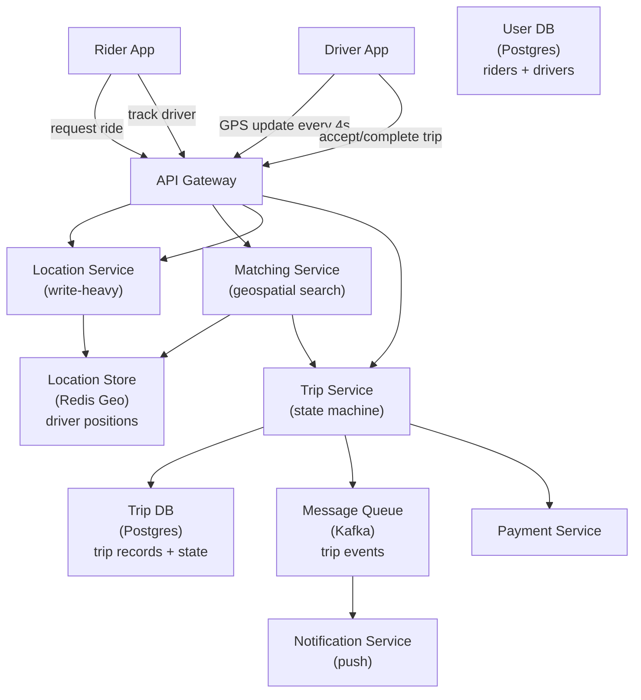
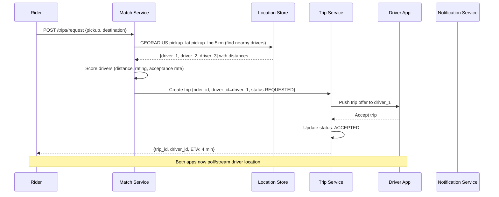
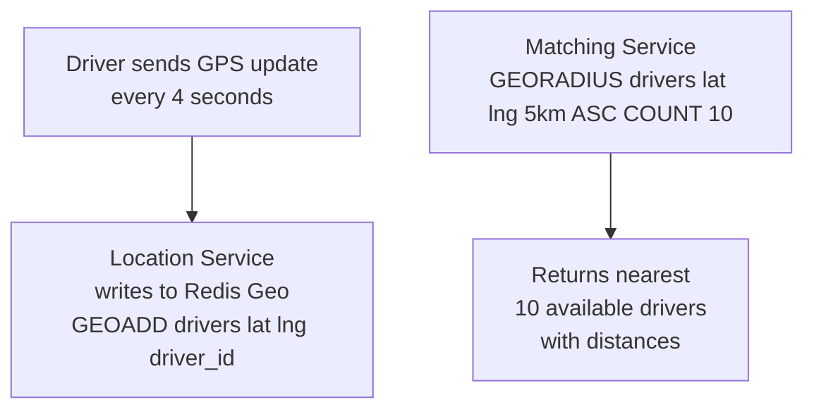
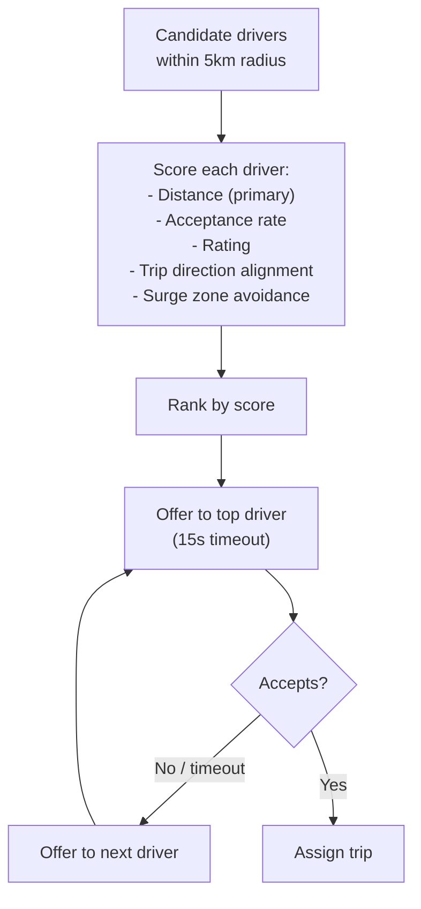
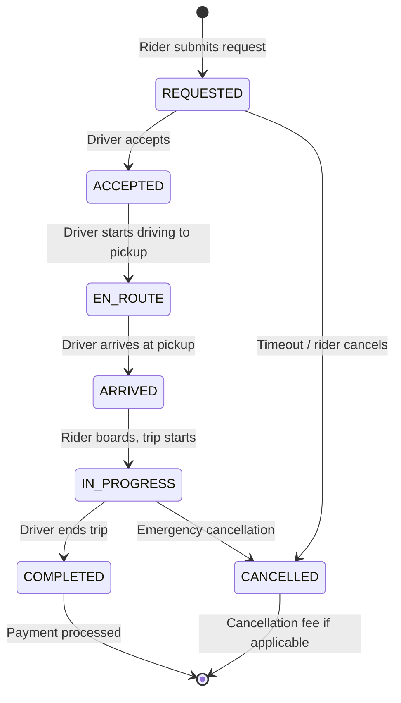
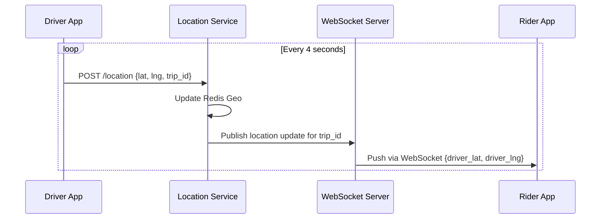
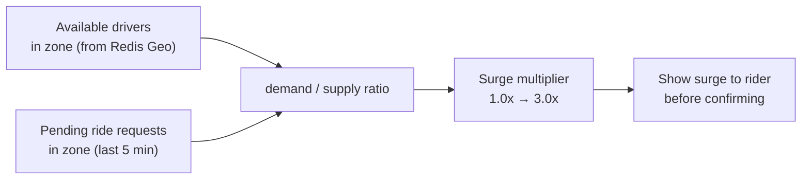

# System Design Walkthrough — Uber (Ride-Hailing Platform)

> Language-agnostic. Focus is on architecture, data flow, and trade-offs.

---

## The Question

> "Design a ride-hailing platform like Uber. Riders request trips, nearby drivers are matched, and both parties track the ride in real time."

---

## Core Insight

Uber has three distinct hard problems:

1. **Location tracking at scale** — millions of drivers updating their GPS position every 4 seconds. This is a high-frequency write problem with geospatial queries.
2. **Matching** — finding the best available driver for a rider in real time, within seconds. This is a geospatial search + optimization problem.
3. **Trip state machine** — a ride goes through many states (requested → accepted → en route → arrived → in progress → completed). Every state transition must be durable and consistent.

The language choices (Go for services, Java for matching) are consequences of these constraints. The architecture is what matters.

---

## Step 1 — Requirements

### Functional
- Rider requests a trip from location A to B
- System finds nearby available drivers
- Driver accepts the trip
- Both rider and driver see real-time location of the other
- Trip is tracked and fare calculated at completion
- Payment processed automatically
- Rating system post-trip

### Non-Functional

| Attribute | Target |
|-----------|--------|
| Active drivers | 5M globally |
| Ride requests/day | 25M |
| Driver location updates | Every 4 seconds per driver |
| Match latency | < 5 seconds from request to driver assignment |
| Location update latency | < 2 seconds for rider to see driver move |
| Availability | 99.99% |
| Consistency | Strong for trip state; eventual for location display |

---

## Step 2 — Estimates

```
Driver location updates:
  5M active drivers × 1 update/4s = 1.25M location writes/s
  Each update: ~50 bytes (driver_id, lat, lng, timestamp)
  1.25M × 50B = 62.5 MB/s write ingress

Ride requests:
  25M/day → ~290/s (low compared to location updates)

Geospatial queries (matching):
  290 ride requests/s × query for drivers within 5km
  Each query: scan ~100 candidate drivers
  → 29,000 driver lookups/s for matching

Location reads (rider tracking active trip):
  ~1M concurrent active trips × 1 read/2s = 500K reads/s
  (rider polls driver location every 2s during trip)
```

**Key observation:** Location writes (1.25M/s) dominate everything else. The location store must handle this write throughput while supporting fast geospatial range queries.

---

## Step 3 — High-Level Design



### Happy Path — Rider Requests a Trip



---

## Step 4 — Detailed Design

### 4.1 Location Service — 1.25M Writes/Second

The location store must handle high-frequency writes and fast geospatial range queries.



**Why Redis Geo?**
- `GEOADD` is O(log N) — fast writes
- `GEORADIUS` returns drivers within a radius, sorted by distance — exactly what matching needs
- In-memory — sub-millisecond reads
- Driver positions are ephemeral (stale after 30s if driver goes offline) — Redis TTL handles cleanup

**Geohashing for sharding:** Redis Geo uses geohash internally. For global scale, shard by geographic region (city or country) — drivers in New York don't need to be in the same Redis instance as drivers in London.

### 4.2 Matching Algorithm

Finding the best driver is not just "nearest driver." Uber optimizes for:



**Sequential vs. parallel offers:** Uber offers to one driver at a time (sequential) to avoid the situation where multiple drivers accept the same trip simultaneously. The 15-second timeout prevents a single unresponsive driver from blocking the match.

### 4.3 Trip State Machine

A trip is a state machine. Every transition must be durable — if the server crashes mid-trip, the state must be recoverable.



Each state transition is written to Postgres with a timestamp. The trip record is the source of truth. If a driver's app crashes mid-trip, they reconnect and fetch the current state from the server.

### 4.4 Real-Time Location Streaming During Trip

Once a trip is in progress, the rider needs to see the driver's location update every 2 seconds.



During active trips, the rider app maintains a WebSocket connection to receive driver location pushes. This is more efficient than polling (no wasted requests when driver hasn't moved).

### 4.5 Surge Pricing

Surge pricing is a supply/demand calculation per geographic zone.



Surge zones are computed every 60 seconds per city zone (geohash cell). Stored in Redis with 60s TTL.

---

## Step 5 — Decision Log

| Decision | Options | Choice | Rationale |
|----------|---------|--------|-----------|
| Location store | Postgres / Cassandra / Redis Geo | Redis Geo | 1.25M writes/s; geospatial queries; in-memory speed; TTL for stale drivers |
| Trip state storage | NoSQL / Postgres | Postgres | Trip state requires ACID — can't have a trip in two states simultaneously |
| Driver offers | Parallel / Sequential | Sequential | Prevents double-assignment; simpler consistency |
| Location streaming | Polling / WebSocket / SSE | WebSocket during trip | Bidirectional; low overhead; push model reduces unnecessary requests |
| Geospatial sharding | Single instance / Geo-sharded | Geo-sharded by city | Drivers in NYC don't need to be in same instance as London drivers |

---

## Step 6 — Bottlenecks

| Bottleneck | Mitigation |
|------------|-----------|
| Location write spike (rush hour) | Redis cluster sharded by city; each city is independent; horizontal scaling |
| Matching latency during surge | Pre-compute driver availability zones; limit GEORADIUS to top-10 candidates; timeout at 5s |
| Trip DB write contention | Postgres with optimistic locking on trip state transitions; partition by city |
| Driver goes offline mid-trip | Trip state in Postgres is durable; driver reconnects and fetches current state; rider sees "reconnecting" |
| Payment failure at trip end | Retry with exponential backoff; trip stays in COMPLETED state until payment succeeds; separate payment retry queue |

---

## Interviewer Mode — Hard Follow-Up Questions

---

**Q1: "You store driver locations in Redis Geo. Redis is single-threaded. At 1.25M location writes/s, how does a single Redis instance handle this?"**

> It doesn't — a single Redis instance handles ~100K ops/s. At 1.25M writes/s, we need at least 13 Redis instances. The sharding strategy: shard by geographic region (city or country). Drivers in New York write to the NYC Redis shard; drivers in London write to the London shard. This is natural partitioning — a rider in NYC only needs to query the NYC shard for nearby drivers. The Matching Service knows which shard to query based on the rider's location. Each city shard handles the drivers in that city — a large city like NYC might have 50K active drivers, which is well within one Redis instance's capacity. For very large cities, shard by geohash cell (sub-city regions). The key insight: location data has natural geographic locality — you never need to query drivers across cities simultaneously. Geographic sharding eliminates cross-shard queries entirely.

---

**Q2: "A driver accepts a trip, drives to the pickup, and the rider cancels just as the driver arrives. The driver is owed a cancellation fee. How does your system handle this payment edge case?"**

> The trip state machine handles this. When the rider cancels, the Trip Service checks the current trip state: if state is `EN_ROUTE` or `ARRIVED`, a cancellation fee applies. The fee calculation: if the driver has been waiting at the pickup for > 2 minutes (state = `ARRIVED`, `arrived_at` timestamp > 2 minutes ago), charge the rider a cancellation fee. The Trip Service transitions the trip to `CANCELLED_WITH_FEE` state and publishes a payment event to the Payment Service. The Payment Service charges the rider's saved payment method for the cancellation fee and credits the driver's account. The idempotency key for this payment is the trip_id + "cancellation_fee" — if the payment request is retried (network failure), it won't double-charge. The driver sees the fee credited in their earnings dashboard within 5 minutes. The edge case: what if the rider's payment method fails? The fee goes to a "pending collection" state — Uber retries the charge over 7 days and can deactivate the rider's account if it remains unpaid.

---

**Q3: "Surge pricing multiplies fares by up to 3×. A rider requests a trip, sees 1.5× surge, confirms, and then the surge drops to 1.0× before the driver arrives. What price do they pay?"**

> They pay the price they confirmed — 1.5×. This is a contract: the rider accepted the surge price at confirmation time. The Trip Service records the surge multiplier at the moment of trip creation: `surge_multiplier: 1.5`. The fare calculation at trip completion uses this stored multiplier, not the current surge. This is important for trust — if the price could change after confirmation, riders would never confirm during surge. The reverse case: surge increases after confirmation. The rider still pays the confirmed price (1.5×, not the new 2.0×). The surge multiplier is immutable once stored on the trip record. The only exception: if the trip is cancelled and re-requested, the new request gets the current surge price. This is why Uber shows a countdown timer on the surge confirmation screen — the price is locked for 60 seconds, after which you need to re-confirm.

---

**Q4: "Your matching algorithm offers the trip to one driver at a time with a 15-second timeout. In a busy city at rush hour, the top 5 drivers all decline. The rider has been waiting 75 seconds. How do you handle this?"**

> After N consecutive declines, the matching algorithm widens the search radius and lowers the driver score threshold. Specifically: after 3 declines, expand the search radius from 5km to 8km. After 5 declines, expand to 12km and include drivers with lower acceptance rates. After 7 declines, notify the rider that wait times are longer than usual and offer to cancel without penalty. Simultaneously, the system flags this as a supply shortage event for the surge pricing engine — if many riders are experiencing long wait times in a zone, surge price increases to attract more drivers. The driver decline tracking: we record why drivers decline (no reason given, but we infer from behavior — a driver who declines 5 trips in a row is probably heading home). Drivers with high decline rates in a zone are deprioritized for future offers in that zone. The 15-second timeout is also adaptive: during surge, we reduce it to 10 seconds to cycle through drivers faster.

---

**Q5: "Uber operates in 70 countries with different regulations. In some countries, drivers must be licensed taxis. In others, anyone can drive. How does your system handle this regulatory complexity without becoming a mess of if-statements?"**

> Regulatory rules are data, not code. We have a Rules Engine service that stores per-country, per-city regulatory requirements as configuration: `{country: "UK", city: "London", driver_license_type: "PCO", vehicle_inspection: "annual", surge_cap: 2.5x}`. When a driver registers, the onboarding flow queries the Rules Engine for their location and enforces the appropriate requirements. When a rider requests a trip, the Matching Service queries the Rules Engine to filter the driver pool — in London, only PCO-licensed drivers are eligible. When surge pricing is calculated, the Rules Engine caps it at the local maximum (some cities have surge caps). The Rules Engine is a separate service with its own database — adding a new country's regulations is a data change, not a code deployment. The if-statements exist in the Rules Engine's evaluation logic, not scattered across every service. New regulations are added by the compliance team via a configuration UI, not by engineers. This is the "policy as data" pattern — it's how you scale regulatory complexity without scaling engineering complexity.
