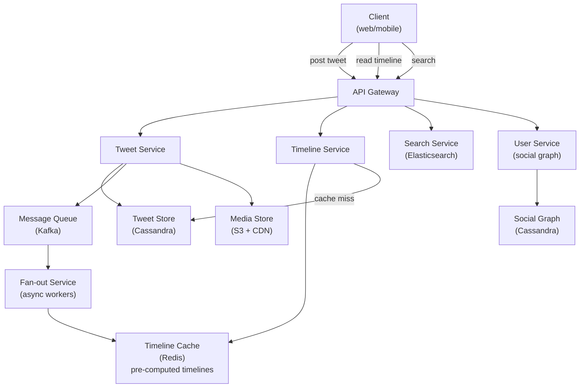
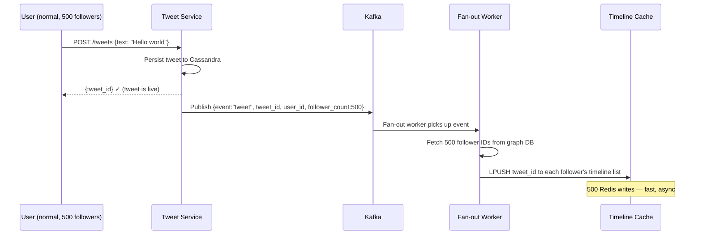
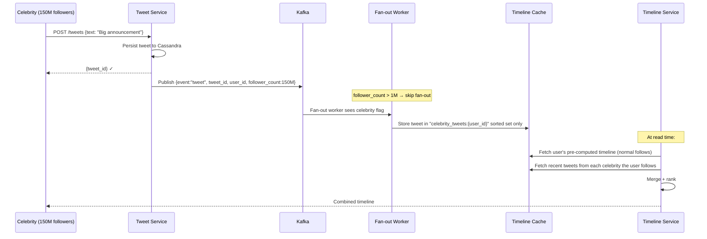
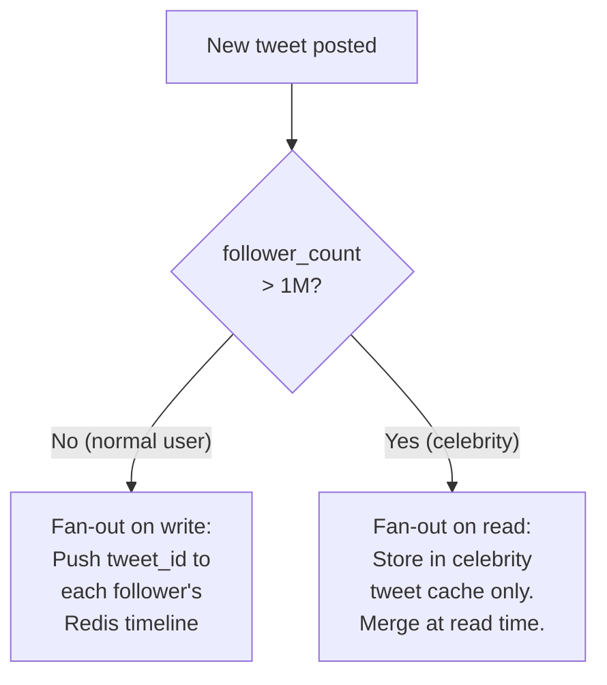
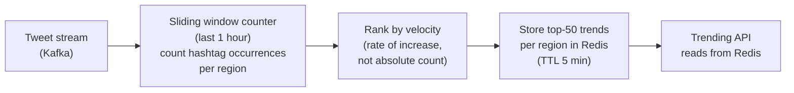

# System Design Walkthrough — Twitter / X (Social Media Feed)

> Language-agnostic. Focus is on architecture, data flow, and trade-offs.

---

## The Question

> "Design a social media platform like Twitter. Users post short messages, follow other users, and see a real-time feed of posts from people they follow."

---

## Core Insight

Twitter's hard problem is the **fan-out problem at celebrity scale**. When Elon Musk (150M followers) tweets, that single write must propagate to 150M timelines. Naive fan-out on write would require 150M Redis writes per tweet — that's the bottleneck that defines the entire architecture.

The secondary hard problem is **real-time delivery** — tweets should appear in followers' feeds within seconds, not minutes.

---

## Step 1 — Requirements

### Functional
- Post tweets (≤ 280 characters, optional media)
- Follow / unfollow users
- Home timeline: tweets from followed accounts, reverse chronological + ranked
- Like, retweet, reply
- Trending topics
- Search tweets
- Notifications (mentions, likes, retweets)

### Non-Functional

| Attribute | Target |
|-----------|--------|
| DAU | 250M |
| Tweets posted/day | 500M |
| Timeline reads/day | 50B (200 per DAU) |
| Timeline load latency | < 200ms p99 |
| Tweet delivery latency | < 5s from post to follower feed |
| Availability | 99.99% |
| Consistency | Eventual — timeline can lag seconds |

---

## Step 2 — Estimates

```
Tweets:
  500M/day → ~5,800/s
  Average tweet: 300 bytes (text + metadata)
  5,800 × 300B = 1.7 MB/s write ingress (trivial)

Timeline reads:
  50B/day → ~580,000 reads/s
  Each timeline: 20 tweets × 500B = 10KB
  580K × 10KB = 5.8 GB/s egress

Fan-out:
  Average user has 200 followers
  5,800 tweets/s × 200 followers = 1.16M timeline writes/s (manageable)
  BUT: celebrity with 150M followers tweets 10x/day
  10 tweets × 150M = 1.5B fan-out writes/day from one user alone
  → Celebrity fan-out is the bottleneck
```

**Key observation:** Read:write ratio is ~100:1. Optimize aggressively for reads. The fan-out problem only exists for celebrities — normal users are fine with push.

---

## Step 3 — High-Level Design



### Happy Path — User Posts a Tweet



### Happy Path — Celebrity Tweets (Hybrid Fan-out)



---

## Step 4 — Detailed Design

### 4.1 Timeline Storage — Redis Sorted Sets

Each user's timeline is a Redis sorted set: `timeline:{user_id}` → sorted by tweet timestamp.

```
ZADD timeline:bob_id <timestamp> <tweet_id>
ZREVRANGE timeline:bob_id 0 19  → 20 most recent tweet_ids

Timeline cache stores only tweet_ids (8 bytes each)
Max 800 tweet_ids per user = 6.4KB per user
250M users × 6.4KB = 1.6TB → fits in Redis cluster
```

Tweet metadata (text, author, likes) is fetched separately by batch lookup from Cassandra. This keeps the timeline cache small and the tweet store as the source of truth.

### 4.2 Fan-out Threshold — The Celebrity Problem



**The threshold (1M followers) is tunable.** At 1M followers, fan-out on write costs 1M Redis writes per tweet. At 10 tweets/day, that's 10M writes/day from one user — manageable. At 150M followers, it's 1.5B writes/day from one user — not manageable.

### 4.3 Tweet Storage — Cassandra Schema

```
tweets table:
  Partition key: tweet_id (UUID, time-ordered via Snowflake ID)
  Columns: user_id, text, media_urls, created_at, like_count, retweet_count

user_tweets table (for profile page):
  Partition key: user_id
  Clustering key: tweet_id DESC
  → "Get all tweets by user X" = single partition scan
```

**Snowflake IDs:** Tweet IDs are 64-bit integers encoding timestamp + datacenter + sequence. This gives time-ordered IDs without a central counter — critical for distributed writes.

### 4.4 Trending Topics



Trending is based on **velocity** (rate of increase), not absolute count. "COVID" might be tweeted 10M times/day but isn't trending because it's always high. A new hashtag going from 0 to 100K in an hour is trending.

---

## Step 5 — Decision Log

| Decision | Options | Choice | Rationale |
|----------|---------|--------|-----------|
| Timeline generation | Push / Pull / Hybrid | Hybrid | Pure push breaks for celebrities; pure pull is too slow at 580K reads/s |
| Tweet storage | SQL / Cassandra | Cassandra | 5,800 writes/s; time-series access; no complex joins needed |
| Timeline cache | Redis list / Sorted set | Sorted set | Score = timestamp; efficient range queries; deduplication |
| Fan-out | Sync / Async | Async (Kafka) | Fan-out must not block the tweet write; decoupled via queue |
| Celebrity threshold | Fixed / Dynamic | Dynamic (based on follower count) | Threshold can be tuned; some "celebrities" are inactive |

---

## Step 6 — Bottlenecks

| Bottleneck | Mitigation |
|------------|-----------|
| Celebrity tweet fan-out | Hybrid model: skip fan-out for >1M followers; merge at read time |
| Timeline cache cold start | Pre-warm on user login; background job fills cache from Cassandra |
| Trending computation | Stream processing (Flink/Spark Streaming); approximate counting (Count-Min Sketch) for memory efficiency |
| Search at scale | Elasticsearch with near-real-time indexing; tweets indexed within 10s of posting |
| Like/retweet count accuracy | Approximate with Redis counters; reconcile with exact DB count hourly |

---

## Interviewer Mode — Hard Follow-Up Questions

---

**Q1: "You use a hybrid fan-out model. Elon Musk has 150M followers. He tweets 10 times a day. That's 1.5B fan-in reads per day just for his followers to see his tweets. How do you make this fast?"**

> The celebrity's tweets are stored in a dedicated "celebrity tweet cache" — a Redis sorted set per celebrity: `celebrity_tweets:{user_id}` → sorted by timestamp, capped at the last 100 tweets. When a follower opens their feed, the Timeline Service fetches their pre-computed timeline (normal follows) from Redis, then fetches the last 20 tweets from each celebrity they follow from the celebrity cache, and merges them by timestamp. The merge is done in the application layer — it's just a sorted merge of small lists. The celebrity cache is updated on every tweet (one write to Redis, not 150M). The read cost: each follower's feed load makes 1 read to their timeline cache + N reads to celebrity caches (one per celebrity they follow). If a user follows 5 celebrities, that's 6 Redis reads total — still fast. The key insight: we trade write simplicity (one write per celebrity tweet) for slightly more complex reads (merge at read time). At 150M followers, this is the only viable approach.

---

**Q2: "Twitter shows you tweets in reverse chronological order, but also injects 'recommended' tweets from accounts you don't follow. How does the ranking layer work without slowing down feed loads?"**

> The ranking layer operates on the pre-fetched candidate set, not on the full tweet corpus. The Timeline Service fetches 100 tweet candidates from the timeline cache (more than the 20 we'll show). The ranking model scores each candidate on: recency (primary), engagement velocity (likes/retweets in last hour), user affinity (how often you engage with this author), and content quality signals. This scoring takes ~5ms for 100 candidates — it's a lightweight model running in-process, not a separate ML service call. The "recommended" tweets (from accounts you don't follow) are pre-computed by a separate recommendation pipeline and stored in a `recommended:{user_id}` Redis key. The Timeline Service fetches both the timeline candidates and the recommended candidates, merges them, runs the ranking model, and returns the top 20. Total latency: ~20ms for the Redis fetches + 5ms for ranking = 25ms. Well within the 200ms target. The ranking model is updated hourly — it doesn't need to be real-time because the signals it uses (engagement velocity) are already near-real-time.

---

**Q3: "A tweet goes viral — 500K retweets in 10 minutes. Each retweet fans out to the retweeter's followers. How does your system not collapse under this write storm?"**

> Retweet fan-out is rate-limited and async. When a retweet happens, the Fan-out Service publishes an event to Kafka. The Kafka consumer processes fan-out events at a controlled rate — if the queue backs up, fan-out slows down but doesn't crash. The result: followers see the viral tweet in their feed within seconds if they're early, or within minutes if they're late. This is acceptable — eventual consistency for feed delivery is fine. The write storm mitigation: the Fan-out Service has a circuit breaker. If a single tweet generates > 10K fan-out events per second (viral threshold), it switches to pull mode for that tweet — instead of pushing to all followers, it stores the tweet in a "viral tweet cache" and followers pull it at read time. This is the same celebrity mechanism applied dynamically. The threshold is detected by monitoring the Kafka consumer lag for a specific tweet_id partition. The switch from push to pull happens automatically within 30 seconds of the viral threshold being crossed.

---

**Q4: "Twitter has a 'Moments' feature showing curated news. A breaking news event happens — a major earthquake. Thousands of tweets about it appear in seconds. How does the trending topics system detect this in near-real-time?"**

> Trending detection uses a sliding window count with velocity scoring. The tweet stream flows through a stream processing job (Flink/Spark Streaming). For each tweet, we extract hashtags and key phrases (NLP). We maintain a sliding window count per term: count of occurrences in the last 5 minutes, 15 minutes, and 1 hour. Trending score = (count_5min / count_1hour) — this is the velocity ratio. A term that went from 100 occurrences/hour to 10,000 occurrences in 5 minutes has a velocity ratio of 100× — clearly trending. A term that's always at 10,000/hour has a ratio of 1× — not trending. The stream processor updates the trending scores every 30 seconds and writes the top-50 terms per region to Redis. The Trending API reads from Redis — sub-millisecond response. For the earthquake example: within 60-90 seconds of the first tweets, "earthquake" and the location name cross the velocity threshold and appear in trending. The 30-second update cycle means trending topics are at most 30 seconds stale.

---

**Q5: "You store tweets in Cassandra partitioned by user_id. A user deletes their account. How do you delete all their tweets, replies, and likes across the entire system?"**

> Account deletion is an async, multi-step process — not a synchronous delete. When a user requests deletion: immediately mark the account as `pending_deletion` in the User DB and stop serving their content (profile returns 404, tweets are filtered from feeds). Then publish a `user_deletion_requested` event to Kafka. A deletion worker consumes this event and runs the cleanup pipeline: delete tweets from Cassandra (query the `user_tweets` partition — all tweets for this user_id are co-located, so this is one partition scan), remove their tweet_ids from any follower feed caches in Redis (expensive — we do this lazily: feed reads filter out deleted user content at read time), delete their likes and retweets from the engagement tables, remove them from the social graph (follower/following tables). The full deletion takes 30 days — this is intentional, to allow account recovery if the deletion was accidental. After 30 days, the account is permanently deleted and the data is purged from backups on the next backup rotation cycle. The user-visible experience: account appears deleted immediately (pending_deletion state), but the data cleanup happens in the background.
