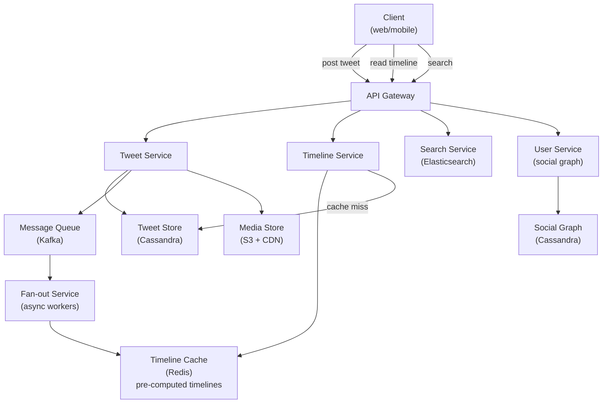
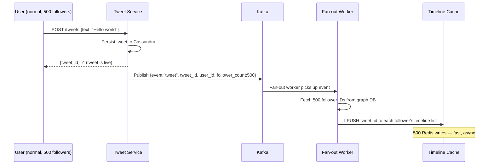
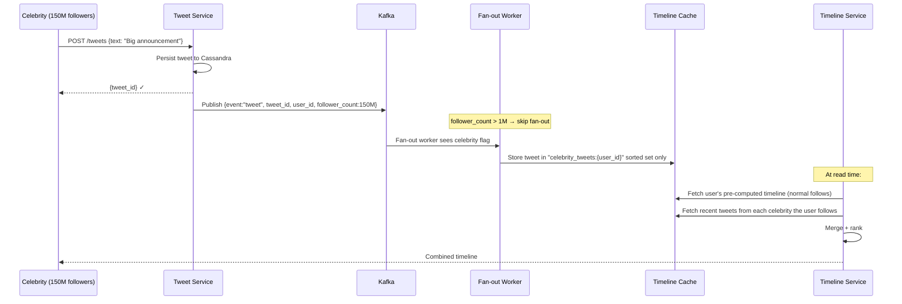
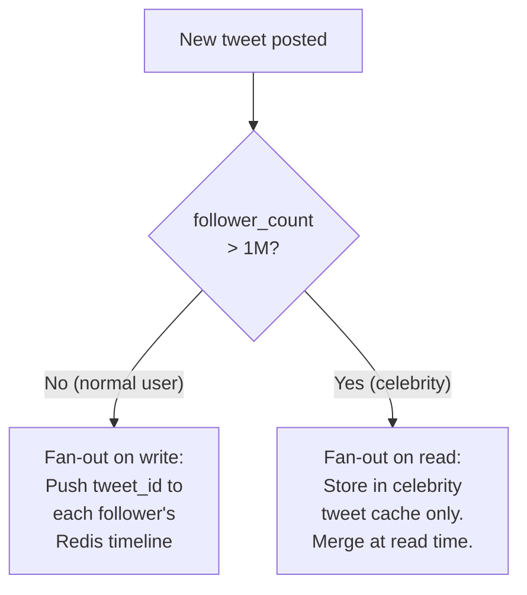
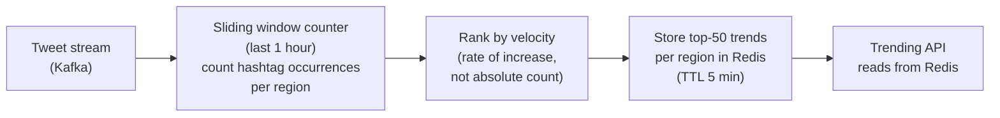

# System Design Walkthrough — Twitter / X (Social Media Feed)

> Language-agnostic. Focus is on architecture, data flow, and trade-offs.

---

## The Question

> "Design a social media platform like Twitter. Users post short messages, follow other users, and see a real-time feed of posts from people they follow."

---

## Core Insight

Twitter's hard problem is the **fan-out problem at celebrity scale**. When Elon Musk (150M followers) tweets, that single write must propagate to 150M timelines. Naive fan-out on write would require 150M Redis writes per tweet — that's the bottleneck that defines the entire architecture.

The secondary hard problem is **real-time delivery** — tweets should appear in followers' feeds within seconds, not minutes.

---

## Step 1 — Requirements

### Functional
- Post tweets (≤ 280 characters, optional media)
- Follow / unfollow users
- Home timeline: tweets from followed accounts, reverse chronological + ranked
- Like, retweet, reply
- Trending topics
- Search tweets
- Notifications (mentions, likes, retweets)

### Non-Functional

| Attribute | Target |
|-----------|--------|
| DAU | 250M |
| Tweets posted/day | 500M |
| Timeline reads/day | 50B (200 per DAU) |
| Timeline load latency | < 200ms p99 |
| Tweet delivery latency | < 5s from post to follower feed |
| Availability | 99.99% |
| Consistency | Eventual — timeline can lag seconds |

---

## Step 2 — Estimates

```
Tweets:
  500M/day → ~5,800/s
  Average tweet: 300 bytes (text + metadata)
  5,800 × 300B = 1.7 MB/s write ingress (trivial)

Timeline reads:
  50B/day → ~580,000 reads/s
  Each timeline: 20 tweets × 500B = 10KB
  580K × 10KB = 5.8 GB/s egress

Fan-out:
  Average user has 200 followers
  5,800 tweets/s × 200 followers = 1.16M timeline writes/s (manageable)
  BUT: celebrity with 150M followers tweets 10x/day
  10 tweets × 150M = 1.5B fan-out writes/day from one user alone
  → Celebrity fan-out is the bottleneck
```

**Key observation:** Read:write ratio is ~100:1. Optimize aggressively for reads. The fan-out problem only exists for celebrities — normal users are fine with push.

---

## Step 3 — High-Level Design



### Happy Path — User Posts a Tweet



### Happy Path — Celebrity Tweets (Hybrid Fan-out)



---

## Step 4 — Detailed Design

### 4.1 Timeline Storage — Redis Sorted Sets

Each user's timeline is a Redis sorted set: `timeline:{user_id}` → sorted by tweet timestamp.

```
ZADD timeline:bob_id <timestamp> <tweet_id>
ZREVRANGE timeline:bob_id 0 19  → 20 most recent tweet_ids

Timeline cache stores only tweet_ids (8 bytes each)
Max 800 tweet_ids per user = 6.4KB per user
250M users × 6.4KB = 1.6TB → fits in Redis cluster
```

Tweet metadata (text, author, likes) is fetched separately by batch lookup from Cassandra. This keeps the timeline cache small and the tweet store as the source of truth.

### 4.2 Fan-out Threshold — The Celebrity Problem



**The threshold (1M followers) is tunable.** At 1M followers, fan-out on write costs 1M Redis writes per tweet. At 10 tweets/day, that's 10M writes/day from one user — manageable. At 150M followers, it's 1.5B writes/day from one user — not manageable.

### 4.3 Tweet Storage — Cassandra Schema

```
tweets table:
  Partition key: tweet_id (UUID, time-ordered via Snowflake ID)
  Columns: user_id, text, media_urls, created_at, like_count, retweet_count

user_tweets table (for profile page):
  Partition key: user_id
  Clustering key: tweet_id DESC
  → "Get all tweets by user X" = single partition scan
```

**Snowflake IDs:** Tweet IDs are 64-bit integers encoding timestamp + datacenter + sequence. This gives time-ordered IDs without a central counter — critical for distributed writes.

### 4.4 Trending Topics



Trending is based on **velocity** (rate of increase), not absolute count. "COVID" might be tweeted 10M times/day but isn't trending because it's always high. A new hashtag going from 0 to 100K in an hour is trending.

---

## Step 5 — Decision Log

| Decision | Options | Choice | Rationale |
|----------|---------|--------|-----------|
| Timeline generation | Push / Pull / Hybrid | Hybrid | Pure push breaks for celebrities; pure pull is too slow at 580K reads/s |
| Tweet storage | SQL / Cassandra | Cassandra | 5,800 writes/s; time-series access; no complex joins needed |
| Timeline cache | Redis list / Sorted set | Sorted set | Score = timestamp; efficient range queries; deduplication |
| Fan-out | Sync / Async | Async (Kafka) | Fan-out must not block the tweet write; decoupled via queue |
| Celebrity threshold | Fixed / Dynamic | Dynamic (based on follower count) | Threshold can be tuned; some "celebrities" are inactive |

---

## Step 6 — Bottlenecks

| Bottleneck | Mitigation |
|------------|-----------|
| Celebrity tweet fan-out | Hybrid model: skip fan-out for >1M followers; merge at read time |
| Timeline cache cold start | Pre-warm on user login; background job fills cache from Cassandra |
| Trending computation | Stream processing (Flink/Spark Streaming); approximate counting (Count-Min Sketch) for memory efficiency |
| Search at scale | Elasticsearch with near-real-time indexing; tweets indexed within 10s of posting |
| Like/retweet count accuracy | Approximate with Redis counters; reconcile with exact DB count hourly |
