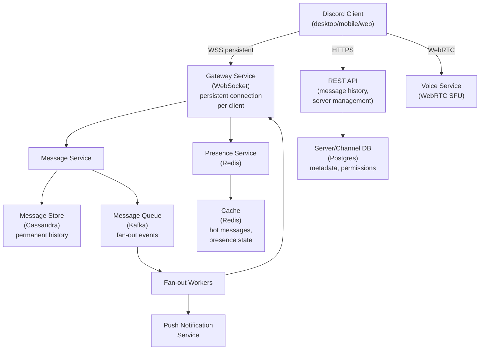
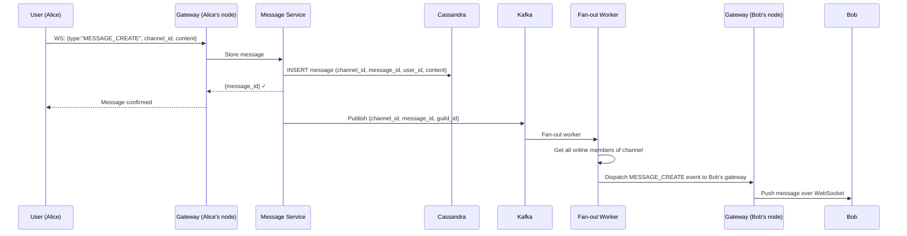
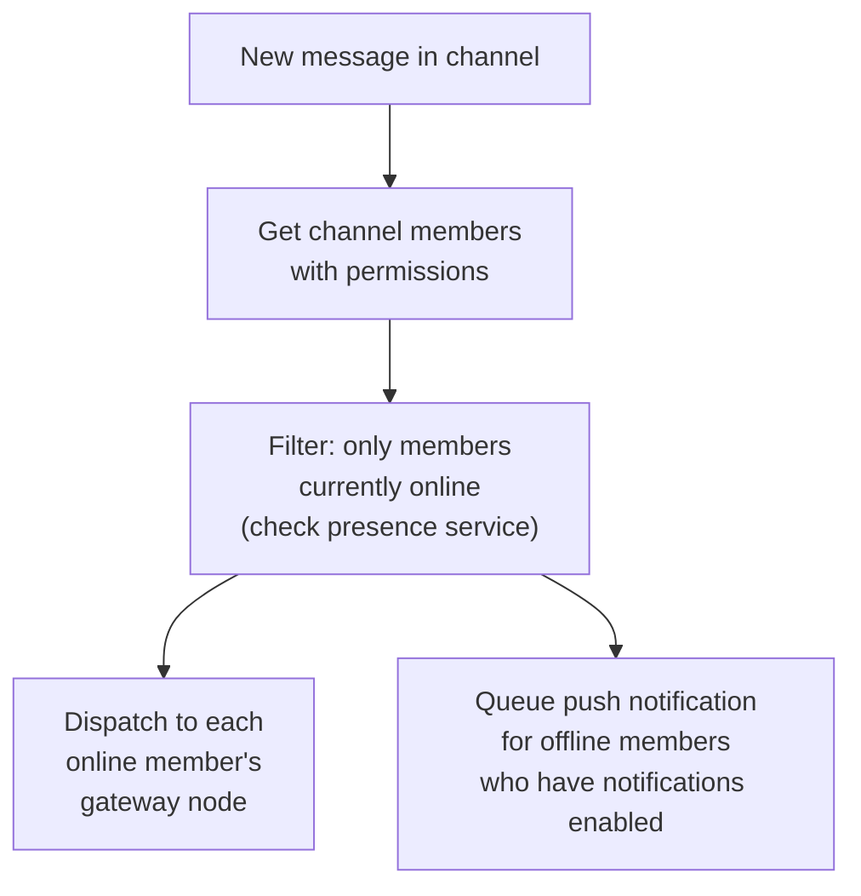
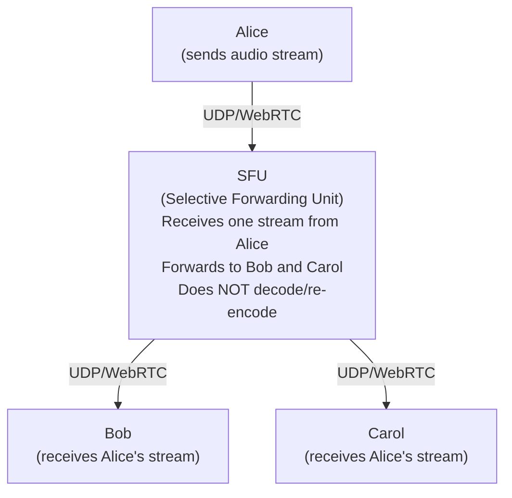
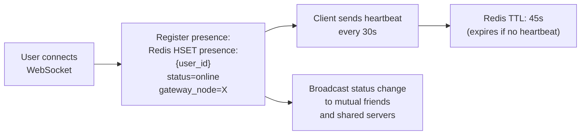

# System Design Walkthrough — Discord (Real-Time Chat & Voice)

> Language-agnostic. Focus is on architecture, data flow, and trade-offs.

---

## The Question

> "Design a real-time messaging and voice platform like Discord. Users join servers with channels, send messages, and participate in voice/video calls."

---

## Core Insight

Discord is architecturally different from WhatsApp in one critical way: **messages are stored permanently server-side and are the source of truth**. Unlike WhatsApp (delete after delivery), Discord is a persistent chat history platform. This changes the storage model entirely.

The hard problems:
1. **Message fan-out to server members** — a Discord server can have 500K members. When someone posts in a channel, who gets notified?
2. **Voice/video at scale** — real-time audio/video requires fundamentally different infrastructure than text (WebRTC, media servers, UDP)
3. **Presence at scale** — showing online/offline status for millions of users across thousands of servers

---

## Step 1 — Requirements

### Functional
- Text channels: send/receive messages, persistent history
- Voice channels: join/leave, real-time audio
- Video: screen share, camera
- Servers (guilds) with multiple channels
- Direct messages between users
- Roles and permissions per server
- Reactions, threads, file attachments
- Push notifications for mentions

### Non-Functional

| Attribute | Target |
|-----------|--------|
| Registered users | 500M |
| Concurrent users | 19M |
| Messages/day | 4B |
| Concurrent voice users | 8M |
| Message delivery latency | < 100ms |
| Message history | Permanent (never deleted by default) |
| Availability | 99.99% |

---

## Step 2 — Estimates

```
Messages:
  4B/day → ~46,000/s
  Average message: 500 bytes
  46K × 500B = 23 MB/s write ingress

Message storage (permanent):
  4B/day × 500B = 2 TB/day
  5 years: ~3.6 PB total
  → Cassandra (time-series, append-only, scales to PB)

Voice:
  8M concurrent voice users
  Opus codec: ~32 Kbps per stream
  8M × 32 Kbps = 256 Gbps audio bandwidth
  → Requires dedicated media servers (WebRTC SFU)

Presence:
  19M concurrent users × presence updates every 30s = ~633K updates/s
  → Must be handled in-memory, never touch the DB
```

---

## Step 3 — High-Level Design



### Happy Path — User Sends a Message



---

## Step 4 — Detailed Design

### 4.1 Message Storage — Cassandra Schema

Discord famously migrated from MongoDB to Cassandra, then from Cassandra to ScyllaDB (a Cassandra-compatible engine written in C++). The schema:

```
messages table:
  Partition key: (channel_id, bucket)
    bucket = floor(message_id / BUCKET_SIZE)
    → Prevents hot partitions from unbounded growth
  Clustering key: message_id DESC
  Columns: author_id, content, attachments, reactions, edited_at, deleted

Why bucket?
  A channel with 10 years of messages would be one huge partition.
  Bucketing by time range (e.g., 10-day buckets) keeps partitions bounded.
  "Load messages before cursor X" = query one or two buckets.
```

### 4.2 Fan-out — Server Members vs. Online Members

Discord servers can have 500K members. Fan-out to all 500K on every message would be catastrophic. The key insight: **only fan-out to online members**.



For very large servers (100K+ members), Discord uses a different model: members "subscribe" to channels they're actively viewing. Fan-out only goes to subscribed members, not all server members.

### 4.3 Voice — WebRTC and Selective Forwarding Units (SFU)

Voice is fundamentally different from text. It requires:
- **UDP** (not TCP) — latency matters more than reliability; a dropped audio packet is better than a delayed one
- **Real-time encoding** — Opus codec, 20ms frames
- **Media servers** — clients can't send audio directly to each other (NAT, firewall); a server relays the streams



**SFU vs. MCU (Multipoint Control Unit):**
- MCU: decodes all streams, mixes them, re-encodes → high CPU, low bandwidth for clients
- SFU: forwards raw encoded streams → low CPU, higher bandwidth for clients (each client receives N streams)
- Discord uses SFU — better for voice channels where participants take turns speaking

### 4.4 Presence System



Presence is stored in Redis with a TTL. If a client disconnects without sending an explicit "offline" event (e.g., phone dies), the TTL expires and the user appears offline automatically.

---

## Step 5 — Decision Log

| Decision | Options | Choice | Rationale |
|----------|---------|--------|-----------|
| Message storage | MongoDB / Cassandra / ScyllaDB | ScyllaDB (Cassandra-compatible) | Time-series append; PB scale; Discord migrated for better performance |
| Fan-out scope | All members / Online only | Online members only | 500K member servers make full fan-out impossible |
| Voice architecture | P2P / MCU / SFU | SFU | Better CPU efficiency than MCU; acceptable bandwidth for typical voice channels |
| Message history | Delete after delivery / Permanent | Permanent | Discord is a community platform; history is a core feature |
| Gateway connections | HTTP polling / WebSocket | WebSocket | Persistent connection for real-time push; Discord's gateway is the core of the product |

---

## Step 6 — Bottlenecks

| Bottleneck | Mitigation |
|------------|-----------|
| Large server fan-out (500K members) | Fan-out to online members only; subscription model for active channel viewers |
| Voice server capacity | SFU servers are stateless per session; scale horizontally; route to nearest region |
| Message history reads (load 50 messages) | Cassandra partition scan is fast; hot channels cached in Redis |
| Presence at 19M concurrent users | Redis cluster; presence updates batched; eventual consistency (1-2s lag is fine) |
| Attachment storage | S3 + CDN; virus scanning before serving; per-user upload quota |

---

## Interviewer Mode — Hard Follow-Up Questions

---

**Q1: "Discord has servers with 500K members. When someone posts in #general, you said you fan-out to online members only. How do you know which of the 500K members are online without querying all 500K presence records?"**

> We don't query all 500K presence records on every message. Instead, we maintain a channel subscription model. When a user opens a channel (scrolls to it, has it visible on screen), their client sends a `CHANNEL_SUBSCRIBE` event to the Gateway. The Gateway registers this subscription in Redis: `channel_subscribers:{channel_id}` → set of gateway_node_ids that have at least one subscriber. When a message arrives, the Fan-out Service queries this set — it gets back a list of 10-50 gateway nodes that have active subscribers, not 500K user records. Each gateway node then delivers to its local subscribers. For very large servers, Discord uses a "lazy subscription" model — you only receive messages for channels you're actively viewing, not all channels in the server. This reduces fan-out from O(online_members) to O(active_viewers), which is typically 1-5% of online members for any given channel.

---

**Q2: "You store messages permanently in ScyllaDB. A user sends a message with a typo, edits it 5 seconds later. How do you handle message edits — do you overwrite the original or store both versions?"**

> We store both versions — the original and the edit. The message record has an `edited_at` timestamp and an `edit_history` array. The current content is the latest edit. The original is preserved for moderation purposes — server admins can see edit history. The ScyllaDB schema: the message row is updated in-place (UPDATE statement) with the new content and `edited_at` timestamp. The edit history is stored as a separate `message_edits` table: `(channel_id, message_id, edited_at, previous_content)`. This keeps the hot path fast — reading a message is a single row lookup, not a join. Edit history is only fetched when explicitly requested (right-click → "View Edit History"). The fan-out for edits: the Gateway broadcasts a `MESSAGE_UPDATE` event to all online channel subscribers with the new content and `edited_at`. Clients update their local message cache. The edit is eventually consistent — a user who's offline when the edit happens will see the edited version when they reconnect (they fetch the current message state, not the history).

---

**Q3: "Discord's voice channels use WebRTC with an SFU. A user joins a voice channel with 50 other people. How many audio streams is their client sending and receiving?"**

> Sending: exactly 1 stream — their own microphone audio, encoded with Opus at 32Kbps. Receiving: up to 50 streams in theory, but in practice far fewer. The SFU uses voice activity detection (VAD) to identify who is speaking. At any moment, typically 1-3 people are speaking simultaneously. The SFU only forwards streams from active speakers to each client — silent participants' streams are suppressed. So the client receives 1-3 streams at any given time, not 50. For the gallery view (showing all participants), the SFU sends low-bitrate video thumbnails for all participants but full-quality audio only for active speakers. The client's bandwidth: 1 stream sent (32Kbps) + 3 streams received (3 × 32Kbps = 96Kbps) = ~128Kbps total. This is why Discord voice works on mobile data — it's extremely bandwidth-efficient. The SFU's job is to make intelligent forwarding decisions so clients don't have to receive 50 streams.

---

**Q4: "Discord has a 'Nitro' subscription that gives users higher upload limits and better video quality. How do you enforce these limits without checking the subscription on every message?"**

> Subscription status is cached at the Gateway layer. When a user connects, the Gateway fetches their subscription tier from the User Service and caches it in memory for the duration of the session. All limit checks (file size, video bitrate, emoji usage) are enforced at the Gateway using this cached value — no database call per message. The cache is invalidated when: the subscription expires (Gateway receives a `subscription_changed` event via Kafka), the user upgrades (same event), or the session ends. The Kafka event is published by the Subscription Service when any subscription change occurs. The Gateway subscribes to this topic and updates its in-memory cache. The race condition: a user's Nitro expires at exactly the moment they're uploading a large file. The Gateway's cached value says "Nitro" but the subscription has expired. We accept this — the file upload succeeds. The next session will have the correct (non-Nitro) limits. This is an intentional trade-off: the cost of occasionally allowing one over-limit upload is far less than the cost of a database call on every upload.

---

**Q5: "Discord stores message history permanently. After 10 years, you have petabytes of messages. Most of them are never read again. How do you manage storage costs?"**

> Tiered storage based on access recency. Hot tier (ScyllaDB, in-memory): messages from the last 30 days. These are frequently accessed — users scroll back through recent history. Warm tier (ScyllaDB, SSD): messages from 30 days to 2 years. Accessed occasionally — someone searches for a message from last year. Cold tier (S3 Glacier): messages older than 2 years. Rarely accessed — only when someone specifically searches for old content. The migration: a background job runs nightly and moves messages older than 30 days from hot to warm, and older than 2 years from warm to cold. The read path: the Message Service checks hot tier first, then warm, then cold (with a 3-5 second retrieval delay for Glacier). For search, Elasticsearch indexes all messages regardless of tier — the search result returns a message_id, and the Message Service fetches the content from whichever tier it's in. The cost reduction: S3 Glacier is ~$0.004/GB/month vs ScyllaDB's ~$0.10/GB/month — 25× cheaper for cold data. Given that 90% of messages are never read after 30 days, this reduces storage costs by ~60%.
