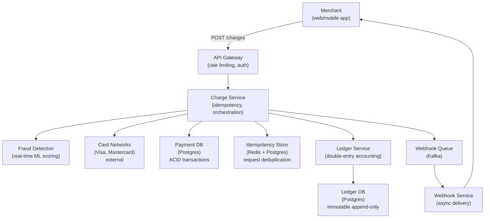
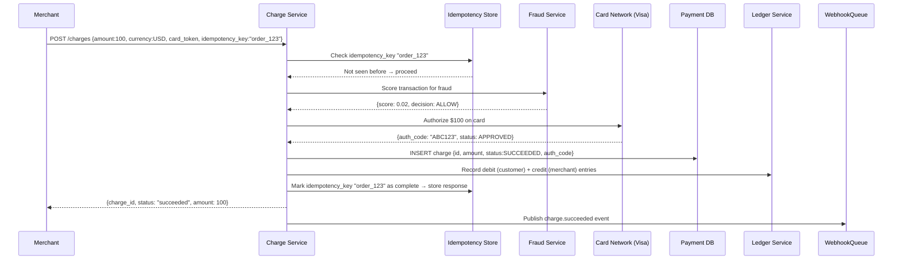
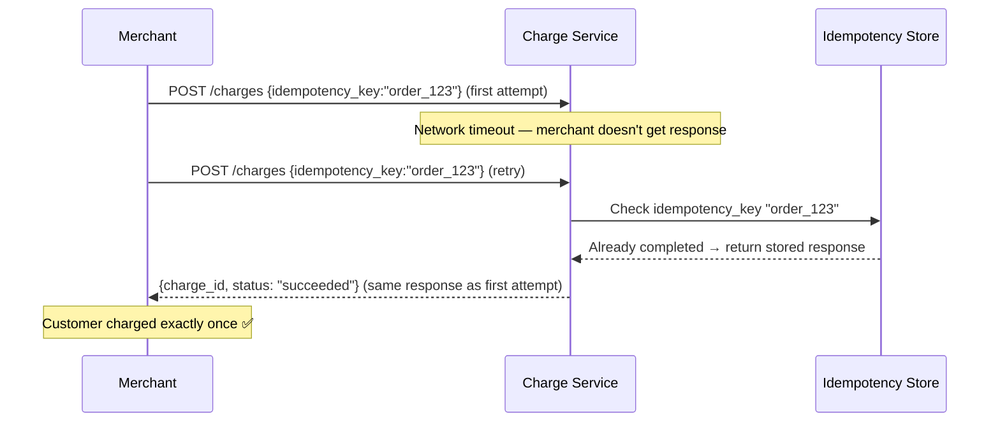
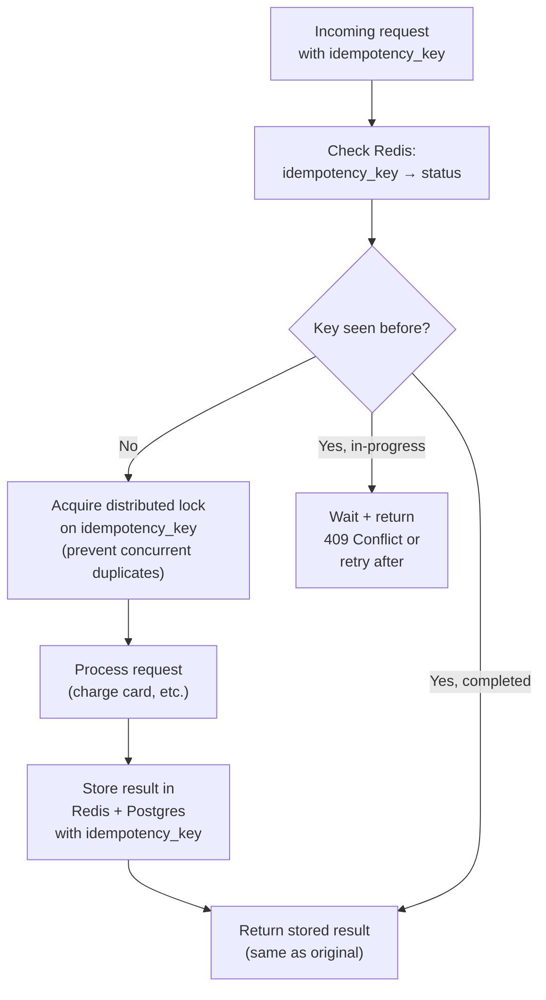
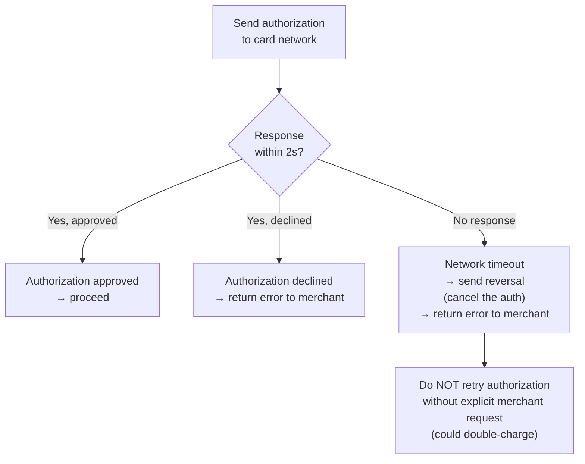
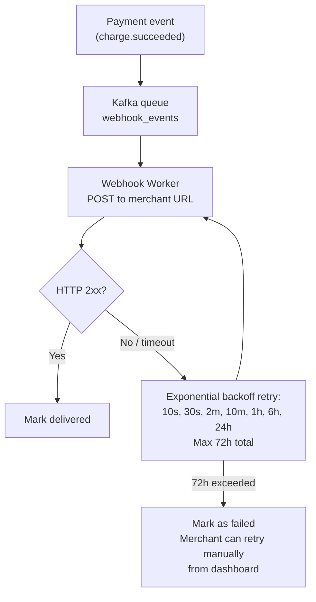

# System Design Walkthrough — Stripe (Payment Processing)

> Language-agnostic. Focus is on architecture, data flow, and trade-offs.

---

## The Question

> "Design a payment processing platform like Stripe. Merchants integrate via API to charge customers, and the system must handle payments reliably with strong consistency guarantees."

---

## Core Insight

Payments are the domain where **correctness matters more than performance**. The hard problems are:

1. **Idempotency** — a network timeout might cause a merchant to retry a charge. The system must ensure the customer is charged exactly once, not twice.
2. **Consistency** — money must never be created or destroyed. Every debit must have a corresponding credit. This requires ACID transactions.
3. **External system integration** — Stripe doesn't hold money; it talks to card networks (Visa, Mastercard), banks, and payment processors. These external systems are slow, unreliable, and have their own failure modes.
4. **Fraud detection** — every transaction must be evaluated for fraud in real time, before authorization.

The language choices (Ruby, Go, Java) are consequences of these constraints. The architecture is what matters.

---

## Step 1 — Requirements

### Functional
- Charge a card (one-time payment)
- Save payment methods (cards, bank accounts)
- Refunds (full and partial)
- Subscriptions (recurring billing)
- Payouts to merchants
- Webhooks (notify merchants of payment events)
- Dashboard (transaction history, analytics)

### Non-Functional

| Attribute | Target |
|-----------|--------|
| Payment volume | $1T+ processed/year |
| API requests/s | ~100K (mix of charges, refunds, queries) |
| Charge latency | < 2s p99 (card authorization) |
| Availability | 99.999% (five nines — downtime = lost revenue) |
| Consistency | **Strong** — ACID for all financial transactions |
| Idempotency | Guaranteed — retries never double-charge |
| Durability | Every transaction permanently recorded |

---

## Step 2 — Estimates

```
Transactions:
  $1T/year ÷ $50 avg transaction = 20B transactions/year
  20B / 31.5M seconds = ~635 transactions/s average
  Peak (Black Friday): ~10× = 6,350/s

API requests:
  100K/s (includes reads, webhook deliveries, dashboard queries)

Storage:
  1 transaction record: ~2KB
  20B × 2KB = 40 TB/year
  10 years: 400 TB → manageable in Postgres with partitioning

Webhooks:
  Each transaction generates 3-5 webhook events
  635 tx/s × 4 events = 2,540 webhook deliveries/s
```

**Key observation:** Transaction volume (635/s) is modest compared to social media systems. The hard problems are correctness and reliability, not raw throughput.

---

## Step 3 — High-Level Design



### Happy Path — Merchant Charges a Card



### Retry Scenario — Idempotency in Action



---

## Step 4 — Detailed Design

### 4.1 Idempotency — The Core Safety Mechanism

Every mutating API call accepts an `Idempotency-Key` header. The system guarantees that the same key produces the same result, no matter how many times it's called.



**Two-layer storage:**
- Redis: fast lookup for recent keys (TTL 24h)
- Postgres: permanent record for audit and dispute resolution

### 4.2 Double-Entry Ledger — Money Can't Disappear

Every financial transaction is recorded as two ledger entries: a debit and a credit. The sum of all entries must always be zero.

```
Charge $100 from customer to merchant:

DEBIT  customer_account  $100  (customer's balance decreases)
CREDIT merchant_account  $100  (merchant's balance increases)

Refund $100:

DEBIT  merchant_account  $100
CREDIT customer_account  $100

Invariant: SUM(all ledger entries) = 0 always
```

The ledger is **append-only** — entries are never updated or deleted. Corrections are made by adding new entries. This creates a complete audit trail.

### 4.3 External Card Network Integration

Card networks (Visa, Mastercard) are external systems with their own latency and failure modes. Stripe must handle:



**Why send a reversal on timeout?** If the authorization went through but the response was lost in transit, the card is authorized but Stripe doesn't know it. Sending a reversal cancels the authorization, ensuring the customer isn't charged for a transaction the merchant never confirmed.

### 4.4 Webhook Delivery — At-Least-Once with Retry

Merchants need to know when payments succeed or fail. Webhooks are the mechanism.



Webhooks are at-least-once — a merchant might receive the same event twice (if they return 200 but Stripe's worker crashes before marking it delivered). Merchants must handle duplicate events using the event ID.

---

## Step 5 — Decision Log

| Decision | Options | Choice | Rationale |
|----------|---------|--------|-----------|
| Transaction DB | NoSQL / Postgres | Postgres | ACID is non-negotiable for financial data; complex queries for reconciliation |
| Idempotency storage | DB only / Redis + DB | Redis + DB | Redis for fast lookup; DB for durability and audit |
| Ledger model | Mutable balance / Double-entry | Double-entry append-only | Immutable audit trail; regulatory requirement; can reconstruct any balance at any point in time |
| Webhook delivery | Sync / Async queue | Async (Kafka) | Merchant endpoints are unreliable; async with retry is the only viable model |
| Fraud detection | Rule-based / ML | ML + rules | ML catches novel patterns; rules enforce hard limits (velocity, geography) |

---

## Step 6 — Bottlenecks

| Bottleneck | Mitigation |
|------------|-----------|
| Black Friday spike (10× normal) | Pre-scale; Postgres connection pooling (PgBouncer); read replicas for dashboard queries |
| Card network latency (external) | Timeout at 2s; send reversal on timeout; async capture (authorize now, capture later) |
| Webhook delivery failures | Exponential backoff; dead letter queue; merchant dashboard for manual retry |
| Ledger query performance | Partition ledger by account_id + time; materialized views for balance queries |
| Fraud model latency | Pre-compute risk features; model inference < 50ms; fallback to rule-based if ML is slow |
