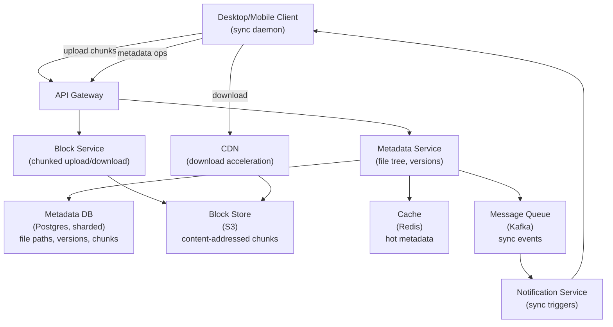
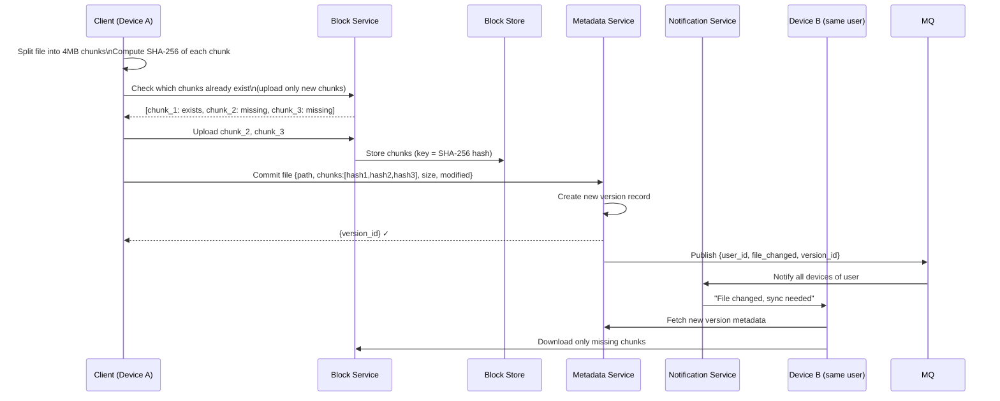
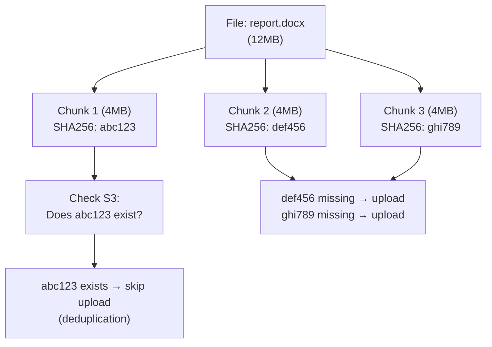
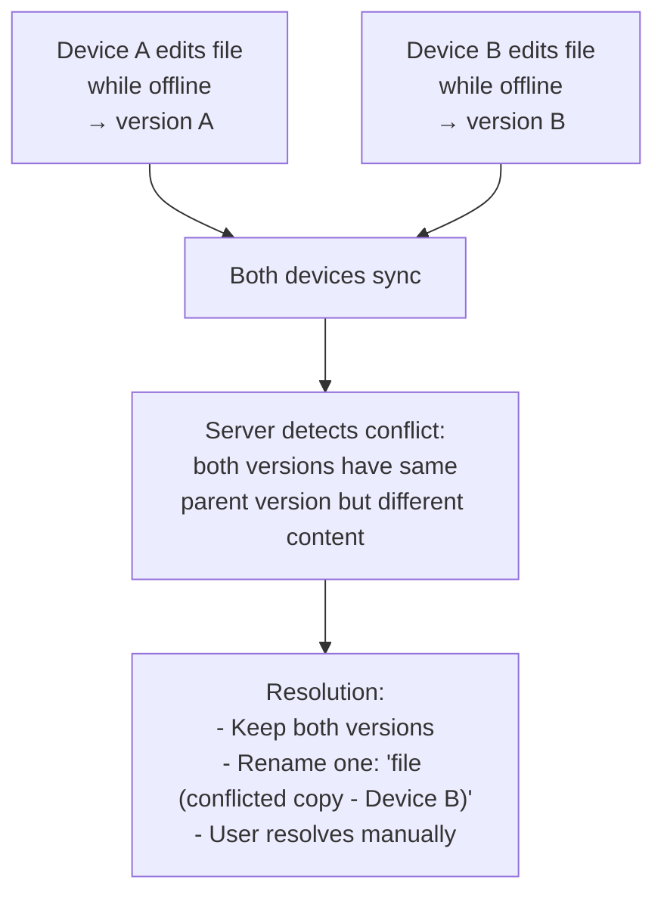
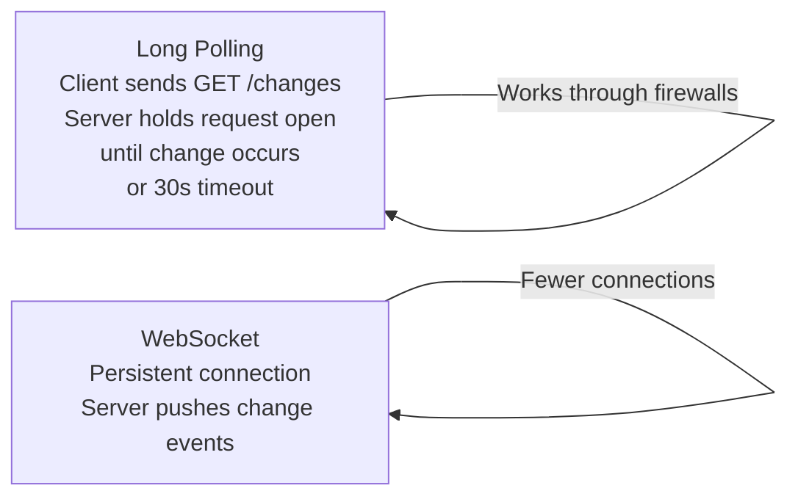

# System Design Walkthrough — Dropbox (File Sync & Storage)

> Language-agnostic. Focus is on architecture, data flow, and trade-offs.

---

## The Question

> "Design a file storage and synchronization service like Dropbox. Users upload files from one device and they appear on all their other devices automatically."

---

## Core Insight

Dropbox looks simple — it's just file storage. The hard problems are:

1. **Sync correctness** — if two devices edit the same file simultaneously while offline, what happens? The system must detect conflicts and resolve them without data loss.
2. **Bandwidth efficiency** — uploading a 1GB file every time you change one line is unacceptable. The system must only transfer the changed parts (delta sync).
3. **Metadata vs. content separation** — file metadata (name, path, size, modified time) has completely different access patterns than file content. They need separate storage systems.

---

## Step 1 — Requirements

### Functional
- Upload files from any device
- Sync files to all other devices automatically
- Share files and folders with other users
- Version history (restore previous versions)
- Conflict detection and resolution
- Offline editing (sync when reconnected)
- Web interface for access without client

### Non-Functional

| Attribute | Target |
|-----------|--------|
| Users | 700M registered, 15M paying |
| Files stored | 500B+ files |
| Storage | Exabyte scale |
| Upload throughput | ~1 GB/s aggregate |
| Sync latency | < 30s from upload to sync on other devices |
| Availability | 99.99% |
| Durability | 99.999999999% (11 nines) — files must never be lost |

---

## Step 2 — Estimates

```
Storage:
  700M users × avg 2GB used = 1.4 EB total
  → S3 or equivalent; no other option at this scale

Upload traffic:
  Assume 1% of users upload daily: 7M users
  Avg upload: 10MB
  7M × 10MB = 70 TB/day → ~810 MB/s ingress

Metadata:
  500B files × 200 bytes metadata = 100 TB
  → Too large for a single Postgres instance; needs sharding

Sync notifications:
  When a file changes, all devices of that user must be notified
  15M paying users × 3 devices avg = 45M device connections
  → Need a notification/push system for sync triggers
```

---

## Step 3 — High-Level Design



### Happy Path — User Uploads a File



---

## Step 4 — Detailed Design

### 4.1 Chunking and Deduplication — The Bandwidth Saver

Files are split into fixed-size chunks (4MB). Each chunk is identified by its SHA-256 hash (content-addressed storage).



**Benefits:**
- **Delta sync:** Only changed chunks are uploaded. Edit one paragraph of a 100MB file → upload one 4MB chunk, not 100MB.
- **Deduplication:** If two users upload the same file, only one copy is stored. The second upload just creates a new metadata record pointing to existing chunks.
- **Parallel upload:** Multiple chunks upload simultaneously.

### 4.2 Metadata Schema — File Tree

```
files table (sharded by user_id):
  user_id, file_id, parent_folder_id, name, is_deleted, current_version_id

file_versions table:
  version_id, file_id, created_at, size, chunk_list (array of SHA-256 hashes)

chunks table:
  chunk_hash (SHA-256), s3_key, size, ref_count
```

The file tree is a recursive structure (folders contain files and folders). Stored as an adjacency list — each file/folder has a `parent_folder_id`. Traversal is done in the application layer, not with recursive SQL.

### 4.3 Conflict Resolution

Two devices edit the same file while offline. When both sync, there's a conflict.



Dropbox's conflict resolution is intentionally simple: **keep both versions**. No automatic merge. The user sees a "conflicted copy" file and decides which to keep. This is the right trade-off for general-purpose file sync — automatic merging only works for specific file types (like Google Docs does for text).

### 4.4 Sync Notification — Long Polling vs. WebSocket

Devices need to know when files change so they can sync. Two approaches:



Dropbox historically used long polling (simpler, works through corporate firewalls). Modern clients use WebSocket or SSE for lower latency.

---

## Step 5 — Decision Log

| Decision | Options | Choice | Rationale |
|----------|---------|--------|-----------|
| Content storage | Self-hosted / S3 | S3 | Exabyte scale; 11-nine durability; CDN integration |
| Chunk size | 1MB / 4MB / 10MB | 4MB | Balance between parallelism and overhead; too small = too many chunks; too large = poor delta efficiency |
| Conflict resolution | Auto-merge / Keep both | Keep both | Auto-merge only works for specific formats; keeping both is safe for any file type |
| Metadata DB | Single Postgres / Sharded | Sharded by user_id | 500B files × 200B = 100TB; single instance can't handle this |
| Deduplication | None / Block-level | Block-level (SHA-256) | Significant storage savings; same file uploaded by multiple users stored once |

---

## Step 6 — Bottlenecks

| Bottleneck | Mitigation |
|------------|-----------|
| Large file upload (10GB video) | Chunked parallel upload; resumable (restart from last chunk on failure) |
| Hot user (shared folder with 10K collaborators) | Fan-out notifications to 10K devices; batch notifications; rate limit sync triggers |
| Metadata DB hot partition (power user with 1M files) | Shard by (user_id, folder_id); limit folder size |
| S3 eventual consistency on overwrite | Use versioned S3 keys; never overwrite a chunk (content-addressed = immutable) |
| Sync storm on reconnect (many devices offline) | Stagger sync on reconnect; prioritize recently modified files |
