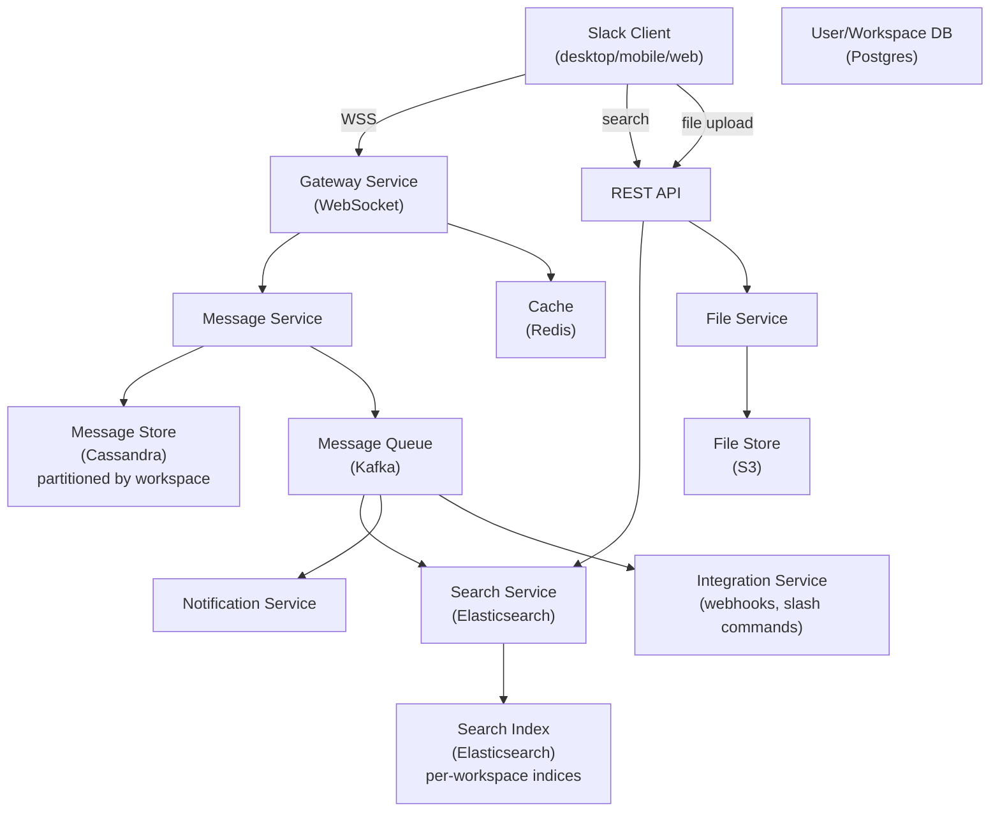
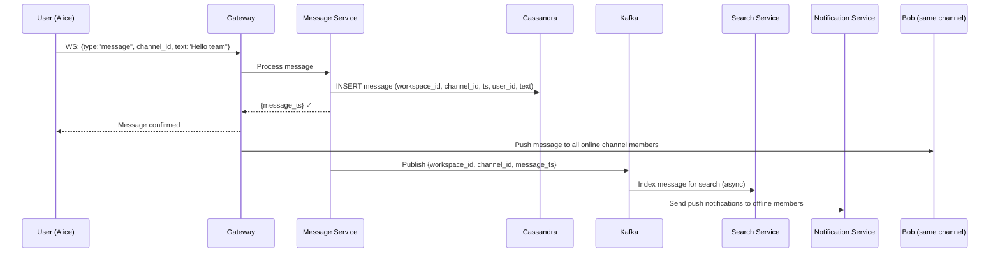
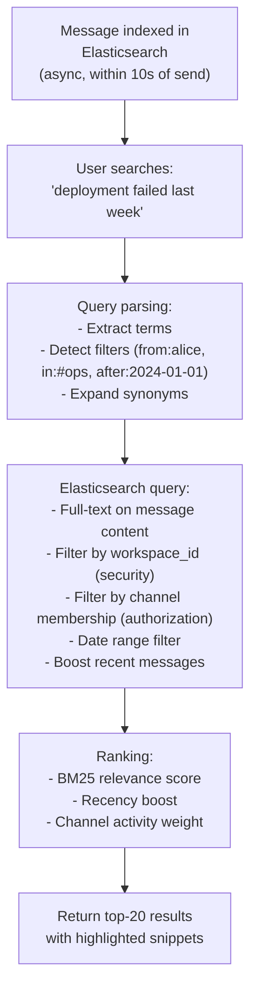
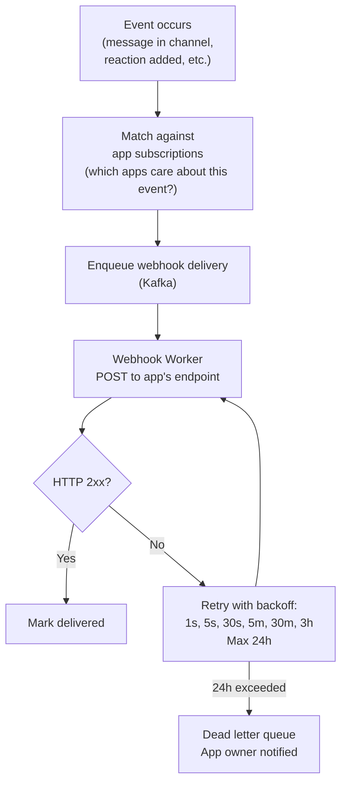
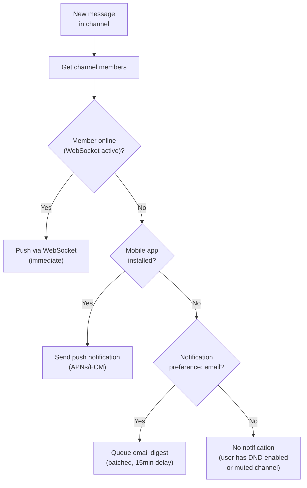

# System Design Walkthrough — Slack (Team Messaging & Collaboration)

> Language-agnostic. Focus is on architecture, data flow, and trade-offs.

---

## The Question

> "Design a team messaging platform like Slack. Users belong to workspaces with channels, send messages, share files, and integrate with external tools."

---

## Core Insight

Slack is architecturally similar to Discord but with different scale characteristics and a critical difference: **Slack is enterprise software**. This means:

- **Compliance and data retention** — enterprises need message history retained for years, with audit logs and e-discovery support
- **Workspace isolation** — each company's data must be logically (and sometimes physically) isolated
- **Integrations** — Slack's value comes from connecting to hundreds of external tools (GitHub, Jira, PagerDuty). The integration platform is as important as the messaging core
- **Search** — finding a message from 2 years ago in a busy channel is a core use case, not an afterthought

The hard problems: **search at scale**, **workspace-level data isolation**, and **reliable webhook/integration delivery**.

---

## Step 1 — Requirements

### Functional
- Channels (public, private) within workspaces
- Direct messages (1:1 and group)
- Threads (replies to messages)
- File sharing
- Search across all messages and files
- Slash commands and app integrations
- Notifications (desktop, mobile push, email digest)
- Message retention policies (configurable per workspace)

### Non-Functional

| Attribute | Target |
|-----------|--------|
| Workspaces | 750K+ active |
| DAU | 32M |
| Messages/day | 1B |
| Search queries/day | 500M |
| Message delivery latency | < 100ms |
| Search latency | < 500ms |
| Availability | 99.99% |
| Data retention | Configurable (1 year to forever) |

---

## Step 2 — Estimates

```
Messages:
  1B/day → ~11,600/s
  Average message: 500 bytes
  11,600 × 500B = 5.8 MB/s write ingress

Message storage:
  1B/day × 500B = 500 GB/day
  10 years: ~1.8 PB → Cassandra or similar

Search index:
  1B messages/day indexed
  Elasticsearch index: ~2KB per message (inverted index overhead)
  1B × 2KB = 2 TB/day of index writes
  → Significant; search indexing must be async

Connections:
  32M DAU, assume 50% online at peak = 16M concurrent WebSocket connections
```

---

## Step 3 — High-Level Design



### Happy Path — Message Sent in Channel



---

## Step 4 — Detailed Design

### 4.1 Message Storage — Workspace Partitioning

Slack's data model is workspace-centric. All data is partitioned by `workspace_id`.

```
messages table (Cassandra):
  Partition key: (workspace_id, channel_id, time_bucket)
  Clustering key: message_ts DESC
  Columns: user_id, text, thread_ts, reactions, edited, deleted

time_bucket = floor(message_ts / BUCKET_SIZE)
  → Prevents unbounded partition growth in busy channels
  → "Load messages before cursor X" = query 1-2 buckets
```

**Why workspace partitioning matters for enterprise:**
- Data isolation: workspace A's data never touches workspace B's partition
- Compliance: can delete all data for a workspace (GDPR right to erasure) by dropping partitions
- Retention policies: TTL per workspace, not per message

### 4.2 Search — The Hard Problem

Search is Slack's most technically challenging feature. Users expect Google-quality search across years of messages.



**Security in search:** Every search query must be filtered by `workspace_id` AND the user's channel membership. A user in #general cannot find messages from #private-exec even if they contain the search terms. This filter is applied at the Elasticsearch query level, not post-processing.

**Per-workspace indices:** Large enterprise customers get dedicated Elasticsearch indices. This provides data isolation and allows per-customer index tuning.

### 4.3 Integration Platform — Webhooks and Slash Commands

Slack's value multiplies through integrations. The integration platform must be reliable.



**Slash commands** (e.g., `/deploy production`) are synchronous: Slack sends an HTTP POST to the app's endpoint and expects a response within 3 seconds. If the app is slow, Slack shows a timeout error. Apps that need more time respond immediately with an acknowledgment and post the result later via the API.

### 4.4 Notification Routing



---

## Step 5 — Decision Log

| Decision | Options | Choice | Rationale |
|----------|---------|--------|-----------|
| Message storage | Postgres / Cassandra | Cassandra | 1B messages/day; time-series; workspace partitioning; PB scale |
| Search | Postgres full-text / Elasticsearch | Elasticsearch | Full-text search with relevance ranking; per-workspace indices for isolation |
| Search indexing | Sync / Async | Async (Kafka → Elasticsearch) | Indexing must not block message delivery; 10s lag is acceptable |
| Workspace isolation | Logical / Physical | Logical (same cluster, different partitions) for most; physical for large enterprise | Cost efficiency for small workspaces; compliance for large ones |
| Integration delivery | Sync / Async queue | Async with retry | App endpoints are unreliable; retry queue ensures delivery |

---

## Step 6 — Bottlenecks

| Bottleneck | Mitigation |
|------------|-----------|
| Large workspace (100K members, busy channel) | Fan-out to online members only; subscription model for active viewers |
| Search index lag | Async indexing via Kafka; prioritize recent messages; show "indexing in progress" for very new messages |
| Integration webhook storms | Rate limit per app; circuit breaker if app endpoint is consistently failing |
| Compliance data export (GDPR, e-discovery) | Async export job; workspace-partitioned storage makes bulk export efficient |
| Message edit/delete | Soft delete (mark as deleted, keep in DB for compliance); edit creates new version record |

---

## Interviewer Mode — Hard Follow-Up Questions

---

**Q1: "A Slack workspace has 50,000 employees. Someone posts in #general. How many WebSocket connections receive that message, and how do you fan-out to all of them efficiently?"**

> In a 50,000-person workspace, #general might have 40,000 members but only 5,000 are online and have #general open at any given time. We fan-out to those 5,000 active connections. The mechanism: the Gateway Service maintains a subscription registry in Redis — `channel_subscribers:{channel_id}` maps to a set of `{gateway_node_id, user_id}` pairs for users currently viewing that channel. When a message arrives, the Message Service publishes to Kafka. The Fan-out Worker reads from Kafka, queries the subscription registry, gets back ~50 gateway node IDs (5,000 users spread across 50 nodes = 100 users per node on average), and makes 50 parallel RPC calls — one per gateway node — each carrying a list of user_ids and the message payload. Each gateway node delivers to its local subscribers. Total fan-out: 50 RPC calls instead of 5,000. The subscription registry is updated when users open/close channels — it's eventually consistent (a user who just closed the channel might still receive one message), which is acceptable.

---

**Q2: "Slack's search needs to return results in under 500ms across years of messages. A user searches for 'deployment failed' in a workspace with 10 billion messages. How?"**

> The search is scoped to the workspace and the user's accessible channels. The Elasticsearch query: `{query: {bool: {must: [{match: {content: "deployment failed"}}, {term: {workspace_id: "acme-corp"}}, {terms: {channel_id: [list of channels user can access]}}]}}`. The channel access list is pre-computed and cached — it's the user's channel membership, which changes rarely. The Elasticsearch index is partitioned by workspace_id — all of Acme Corp's messages are in the same index shard, so the query hits one shard, not all shards. For a 10-billion-message workspace, the index is large but Elasticsearch handles this with segment merging and inverted index compression. The 500ms target: Elasticsearch full-text search on a well-tuned index returns results in 50-200ms. The remaining budget is for network, auth, and result enrichment (fetching message metadata). The bottleneck is usually the channel access list computation — we cache it in Redis with a 60-second TTL to avoid recomputing on every search.

---

**Q3: "A Slack integration (GitHub bot) sends 10,000 messages to a channel in 1 minute due to a bug. How do you detect and stop this?"**

> Rate limiting at the integration layer. Each Slack app has a per-workspace rate limit: by default, 1 message per second to any channel. The rate limiter uses a Redis token bucket per `(app_id, workspace_id)`. When the GitHub bot sends its 10th message in 10 seconds, it starts receiving 429 responses. The bot's retry logic (if well-implemented) backs off. If the bot ignores 429s and keeps sending, the rate limiter drops the messages silently after a threshold. For abuse detection: a background job monitors message velocity per app per workspace. If an app sends > 100 messages/minute (10× the normal limit), it triggers an alert to the workspace admin and temporarily suspends the app's API access. The workspace admin can review and re-enable. The architectural point: rate limiting is enforced at the API Gateway layer before messages reach the Message Service — abusive traffic never touches the database or fan-out pipeline.

---

**Q4: "Slack has a 'huddle' feature — quick audio calls within a channel. How is this different from a regular Slack message architecturally, and how do you implement it?"**

> Huddles are real-time audio, which requires a completely different infrastructure from text messages. Text messages go through the Message Service → Cassandra → fan-out pipeline. Audio goes through WebRTC with an SFU (Selective Forwarding Unit) — the same architecture as Discord's voice channels and Zoom. The architectural separation: when a user starts a huddle, the Gateway Service creates a "huddle session" record in Redis with a session_id and the SFU server assigned to it. Other users join by connecting to the same SFU server via WebRTC. The SFU handles audio routing — it receives one stream from each participant and forwards to others. The text message pipeline is not involved in audio delivery at all. The integration point: the huddle session_id is stored as a message in the channel ("Alice started a huddle") so other users can see it and join. But the audio itself never touches Cassandra or Kafka. Presence (who's in the huddle) is tracked in Redis with TTL — if a participant's connection drops, they're removed from the huddle after 30 seconds.

---

**Q5: "A large enterprise customer requires that all Slack messages be retained for 7 years for compliance. But Slack's default retention is configurable and some workspaces delete messages after 90 days. How do you implement per-workspace retention policies without making the storage layer a mess?"**

> Retention policy is metadata, not storage logic. Each workspace has a `retention_policy` record: `{workspace_id, retention_days: 2555, legal_hold: false}`. The Message Service writes all messages to Cassandra with a TTL equal to the workspace's retention policy. For the 7-year workspace, TTL = 2,555 days. For the 90-day workspace, TTL = 90 days. Cassandra handles TTL natively — no application-level cleanup job needed. For legal hold: when a workspace is placed on legal hold (e.g., litigation), the `legal_hold` flag is set to true. The Message Service stops setting TTLs on new messages (they're stored indefinitely). For existing messages with TTLs already set, we run a background job to remove the TTL (Cassandra supports updating TTL). The compliance export: a separate Compliance Export Service reads from Cassandra and writes to an immutable S3 bucket (object lock enabled) for the customer's legal team. The S3 bucket has its own 7-year retention policy independent of Cassandra. This two-layer approach (Cassandra for operational access, S3 for compliance archive) is the standard pattern for regulated industries.

---

## Staff Engineer Review

### Missing Sections

**Enterprise Grid**
Slack's enterprise product allows multiple workspaces under one organization ("org") with cross-workspace communication and centralized administration. This changes the data model: messages can flow between workspaces within the same org. The routing layer must resolve: is recipient workspace A in the same org as sender workspace B? If so, route internally. If not, this is a Slack Connect cross-org message (different permission model). The permission and billing model also changes: org-level admins can see all content across workspaces, setting up a private channel that the sending workspace's admin cannot see.

**Slack Connect**
Messaging between two completely different companies' Slack workspaces. This requires inter-tenant routing: messages from Acme Corp's workspace to Beta Inc's workspace must traverse tenant isolation boundaries. The design: Slack Connect channels have a shared `connect_channel_id` that both workspaces reference. A message sent in this channel is written to both tenants' message stores (or to a shared message store with dual-tenant ownership). DLP (Data Loss Prevention) rules of both companies must be applied — if Acme prohibits sharing certain file types externally, that rule applies to Slack Connect messages from Acme users even in shared channels.

**Permission-aware search**
Slack Enterprise Grid can have millions of messages across hundreds of channels. Full-text search must return only messages the user is authorized to see. The naive approach — a single Elasticsearch index with a channel filter at query time — requires the query to include the user's entire list of accessible channels. A user who is a member of 500 channels must send a 500-element `channel_id` filter. At scale (thousands of concurrent searches, users with hundreds of channels), this is expensive. The optimization: build per-workspace Elasticsearch indices, and within each context, pre-compute the user's channel membership as a bloom filter. The search query applies the bloom filter before Elasticsearch scoring, bounding false positives rather than requiring exact membership lookup per query.

### Critical Questions

> **"A Slack channel has 10,000 members. Someone posts a message. You have 10,000 WebSocket connections to write to. What's your fan-out strategy?"**

For channels above a member threshold (e.g., 1,000), Slack does not fan-out to all connections synchronously. Strategy: (1) **Active member filtering** — only push to members who have the channel open (active session with channel focused). Track "channel open" status per user per channel in Redis (`channel_active:{channel_id}` → set of active user_ids, updated by client focus/blur events). For a 10,000-member channel, realistically 50–200 members have it focused at any moment. Fan-out to those members via WebSocket. (2) **Notification-only for background members** — members with the channel unfocused receive a channel unread count increment (a cheaper update) rather than the full message payload. (3) **Lazy fetch on channel focus** — when a background member focuses the channel, their client fetches missed messages since last seen (a simple paginated API call). This converts a push-to-10,000 problem into a push-to-200 + lazy pull pattern.

> **"Slack's message retention policy can auto-delete messages after 90 days. How do you implement bulk deletion at scale without impacting read performance?"**

Deletion is an async background job — never synchronous with user traffic. Architecture: (1) Messages are stored in Cassandra partitioned by `(workspace_id, channel_id, time_bucket)`. A message older than 90 days belongs to a bucket that is entirely eligible for deletion. (2) The Retention Job runs nightly: for each workspace with a 90-day policy, identify all time-bucket partition keys older than 90 days, issue a Cassandra `DELETE FROM messages WHERE ...` partition-level drop for each expired bucket. Cassandra partition drops are fast (tombstone + compaction) and do not scan individual rows. (3) Elasticsearch: a concurrent job issues a `delete_by_query` with `created_at < now-90d AND workspace_id = X`. This runs as a background task with throttling (`requests_per_second` limit) to avoid saturating the Elasticsearch cluster during business hours. (4) File attachments in S3 are deleted via S3 Lifecycle rules set at the prefix level.

> **"A user searches for a keyword across their entire 5-year Slack message history. How do you return results in < 500ms?"**

Several design constraints make this feasible: (1) The search is scoped to the user's accessible channels (set is known server-side from their membership). (2) Elasticsearch has the message index warm in OS file cache for active workspaces. (3) The query runs against a pre-built inverted index — not a full scan of Cassandra message history. The latency breakdown: API gateway to search service (~10ms) + permission filter computation (user's channel list, from Redis cache, ~5ms) + Elasticsearch query (~50–200ms for a well-tuned cluster) + result ranking and response serialization (~20ms) = 85–235ms total. The failure mode is cold cache: if the workspace's Elasticsearch shards are not in OS file cache (e.g., a rarely-used Enterprise workspace), the first query after a cold start takes 1–3 seconds as shards are loaded from disk. Mitigation: warm up shards for workspaces with active users at the start of the business day (predictive warming based on historical activity patterns).
