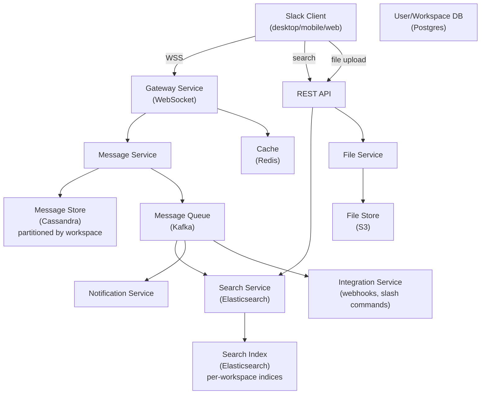
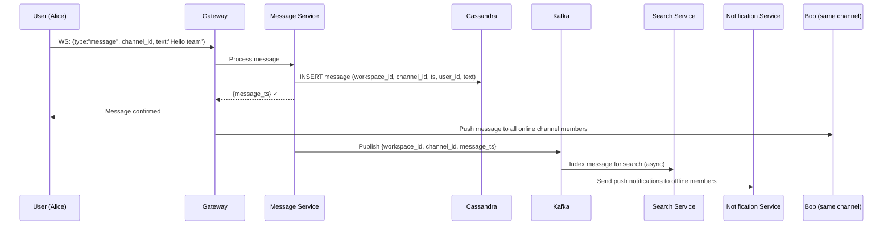
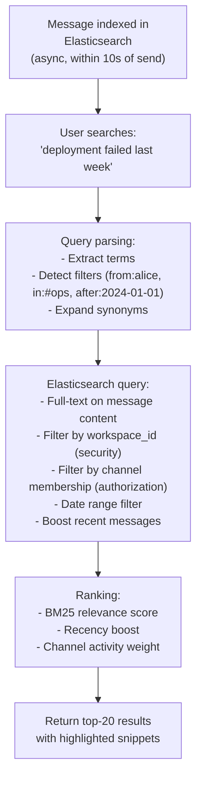
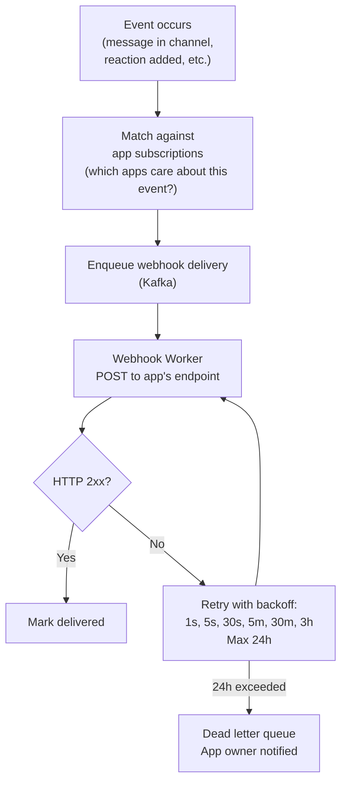
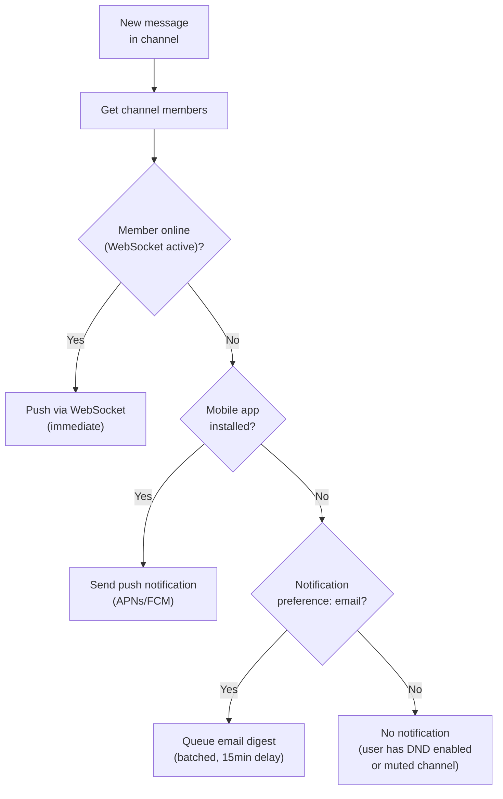

# System Design Walkthrough — Slack (Team Messaging & Collaboration)

> Language-agnostic. Focus is on architecture, data flow, and trade-offs.

---

## The Question

> "Design a team messaging platform like Slack. Users belong to workspaces with channels, send messages, share files, and integrate with external tools."

---

## Core Insight

Slack is architecturally similar to Discord but with different scale characteristics and a critical difference: **Slack is enterprise software**. This means:

- **Compliance and data retention** — enterprises need message history retained for years, with audit logs and e-discovery support
- **Workspace isolation** — each company's data must be logically (and sometimes physically) isolated
- **Integrations** — Slack's value comes from connecting to hundreds of external tools (GitHub, Jira, PagerDuty). The integration platform is as important as the messaging core
- **Search** — finding a message from 2 years ago in a busy channel is a core use case, not an afterthought

The hard problems: **search at scale**, **workspace-level data isolation**, and **reliable webhook/integration delivery**.

---

## Step 1 — Requirements

### Functional
- Channels (public, private) within workspaces
- Direct messages (1:1 and group)
- Threads (replies to messages)
- File sharing
- Search across all messages and files
- Slash commands and app integrations
- Notifications (desktop, mobile push, email digest)
- Message retention policies (configurable per workspace)

### Non-Functional

| Attribute | Target |
|-----------|--------|
| Workspaces | 750K+ active |
| DAU | 32M |
| Messages/day | 1B |
| Search queries/day | 500M |
| Message delivery latency | < 100ms |
| Search latency | < 500ms |
| Availability | 99.99% |
| Data retention | Configurable (1 year to forever) |

---

## Step 2 — Estimates

```
Messages:
  1B/day → ~11,600/s
  Average message: 500 bytes
  11,600 × 500B = 5.8 MB/s write ingress

Message storage:
  1B/day × 500B = 500 GB/day
  10 years: ~1.8 PB → Cassandra or similar

Search index:
  1B messages/day indexed
  Elasticsearch index: ~2KB per message (inverted index overhead)
  1B × 2KB = 2 TB/day of index writes
  → Significant; search indexing must be async

Connections:
  32M DAU, assume 50% online at peak = 16M concurrent WebSocket connections
```

---

## Step 3 — High-Level Design



### Happy Path — Message Sent in Channel



---

## Step 4 — Detailed Design

### 4.1 Message Storage — Workspace Partitioning

Slack's data model is workspace-centric. All data is partitioned by `workspace_id`.

```
messages table (Cassandra):
  Partition key: (workspace_id, channel_id, time_bucket)
  Clustering key: message_ts DESC
  Columns: user_id, text, thread_ts, reactions, edited, deleted

time_bucket = floor(message_ts / BUCKET_SIZE)
  → Prevents unbounded partition growth in busy channels
  → "Load messages before cursor X" = query 1-2 buckets
```

**Why workspace partitioning matters for enterprise:**
- Data isolation: workspace A's data never touches workspace B's partition
- Compliance: can delete all data for a workspace (GDPR right to erasure) by dropping partitions
- Retention policies: TTL per workspace, not per message

### 4.2 Search — The Hard Problem

Search is Slack's most technically challenging feature. Users expect Google-quality search across years of messages.



**Security in search:** Every search query must be filtered by `workspace_id` AND the user's channel membership. A user in #general cannot find messages from #private-exec even if they contain the search terms. This filter is applied at the Elasticsearch query level, not post-processing.

**Per-workspace indices:** Large enterprise customers get dedicated Elasticsearch indices. This provides data isolation and allows per-customer index tuning.

### 4.3 Integration Platform — Webhooks and Slash Commands

Slack's value multiplies through integrations. The integration platform must be reliable.



**Slash commands** (e.g., `/deploy production`) are synchronous: Slack sends an HTTP POST to the app's endpoint and expects a response within 3 seconds. If the app is slow, Slack shows a timeout error. Apps that need more time respond immediately with an acknowledgment and post the result later via the API.

### 4.4 Notification Routing



---

## Step 5 — Decision Log

| Decision | Options | Choice | Rationale |
|----------|---------|--------|-----------|
| Message storage | Postgres / Cassandra | Cassandra | 1B messages/day; time-series; workspace partitioning; PB scale |
| Search | Postgres full-text / Elasticsearch | Elasticsearch | Full-text search with relevance ranking; per-workspace indices for isolation |
| Search indexing | Sync / Async | Async (Kafka → Elasticsearch) | Indexing must not block message delivery; 10s lag is acceptable |
| Workspace isolation | Logical / Physical | Logical (same cluster, different partitions) for most; physical for large enterprise | Cost efficiency for small workspaces; compliance for large ones |
| Integration delivery | Sync / Async queue | Async with retry | App endpoints are unreliable; retry queue ensures delivery |

---

## Step 6 — Bottlenecks

| Bottleneck | Mitigation |
|------------|-----------|
| Large workspace (100K members, busy channel) | Fan-out to online members only; subscription model for active viewers |
| Search index lag | Async indexing via Kafka; prioritize recent messages; show "indexing in progress" for very new messages |
| Integration webhook storms | Rate limit per app; circuit breaker if app endpoint is consistently failing |
| Compliance data export (GDPR, e-discovery) | Async export job; workspace-partitioned storage makes bulk export efficient |
| Message edit/delete | Soft delete (mark as deleted, keep in DB for compliance); edit creates new version record |
