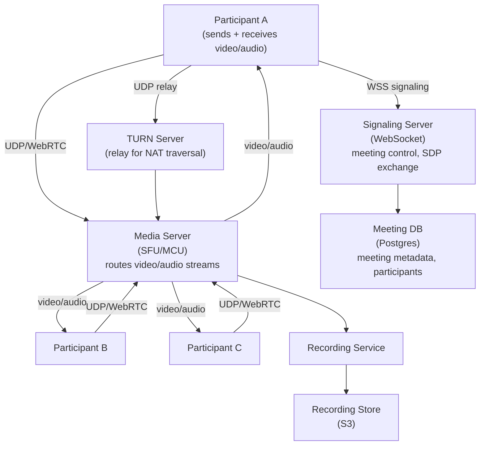
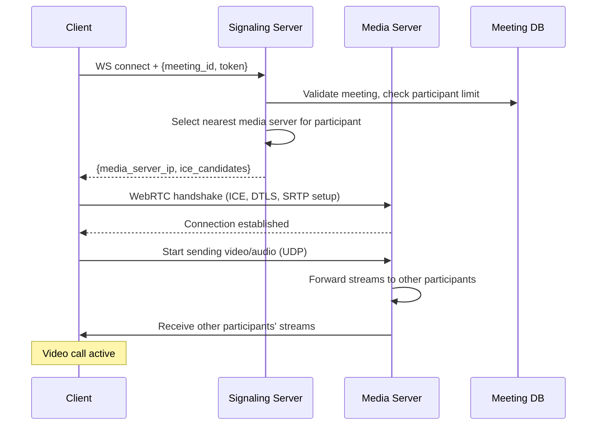
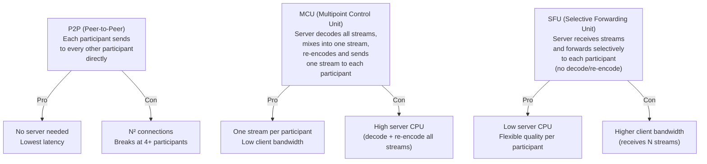
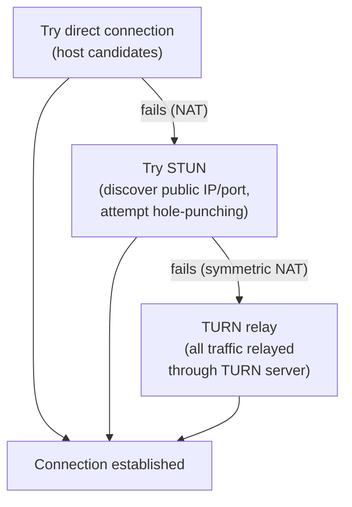
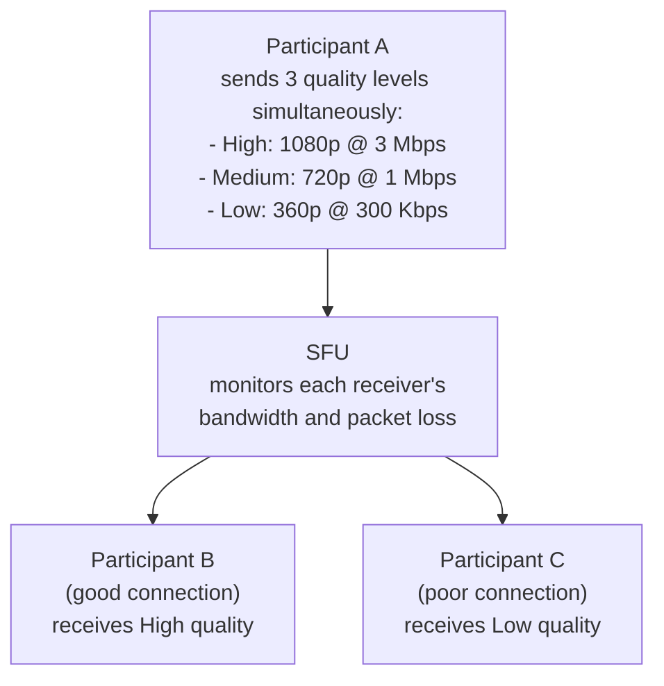
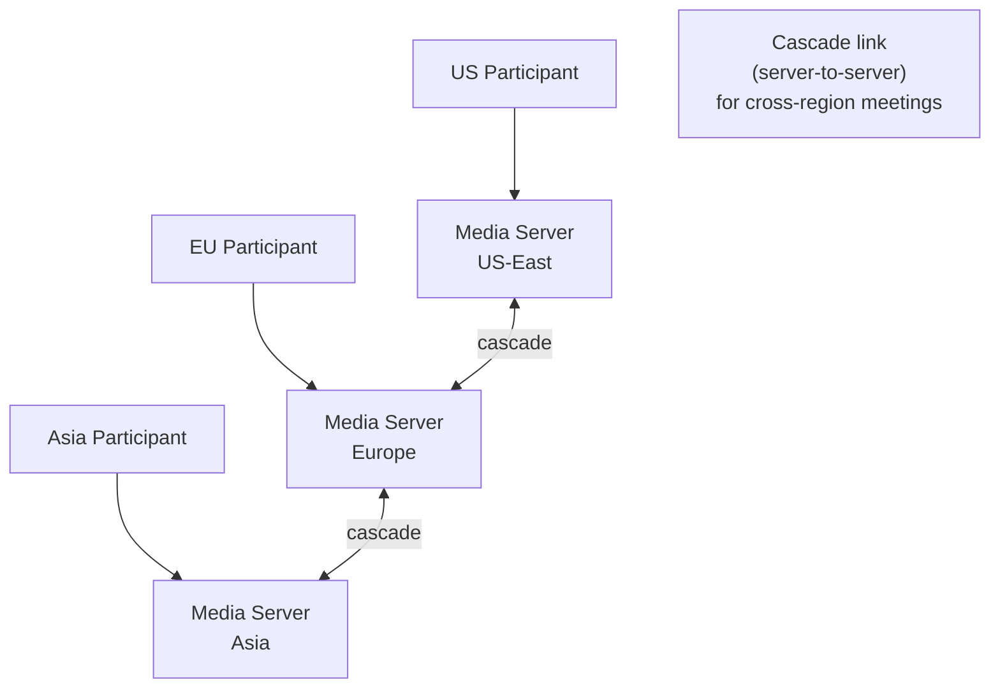
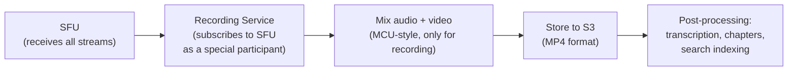

# System Design Walkthrough — Zoom (Video Conferencing)

> Language-agnostic. Focus is on architecture, data flow, and trade-offs.

---

## The Question

> "Design a video conferencing platform like Zoom. Multiple participants join a meeting, see and hear each other in real time, and can share their screens."

---

## Core Insight

Video conferencing is the hardest real-time system to design because it combines:

1. **Ultra-low latency requirements** — audio delay > 150ms is perceptible and disruptive. This rules out TCP for media transport.
2. **Adaptive quality** — participants have wildly different network conditions. The system must degrade gracefully.
3. **Media routing at scale** — in a 100-person meeting, naively sending each participant's video to all others = 100 × 99 = 9,900 streams. This doesn't scale.
4. **Global infrastructure** — participants are worldwide; routing media across continents adds unacceptable latency.

---

## Step 1 — Requirements

### Functional
- Video/audio calls with up to 1,000 participants
- Screen sharing
- Chat during meetings
- Recording (local and cloud)
- Breakout rooms
- Virtual backgrounds
- Waiting room / host controls

### Non-Functional

| Attribute | Target |
|-----------|--------|
| Concurrent meetings | 3M+ |
| Participants per meeting | Up to 1,000 (typical: 2-50) |
| Audio latency | < 150ms end-to-end |
| Video latency | < 300ms end-to-end |
| Availability | 99.99% |
| Packet loss tolerance | Graceful degradation up to 10% loss |

---

## Step 2 — Estimates

```
Concurrent meetings: 3M
Average participants: 5 (most meetings are small)
Total concurrent participants: 15M

Video bandwidth per participant:
  Sending: 1 Mbps (720p)
  Receiving: 1 Mbps × (N-1) participants
  For 5-person meeting: 4 Mbps receive

Total bandwidth:
  15M participants × 1 Mbps send = 15 Tbps ingress
  15M × 4 Mbps receive = 60 Tbps egress
  → Must be served from edge media servers, not a central data center

Signaling (meeting control):
  15M participants × 1 signal/s = 15M signals/s
  Each signal: ~200 bytes → 3 GB/s (manageable)
```

**Key observation:** 60 Tbps of video egress cannot come from a central location. Media servers must be distributed globally, close to participants.

---

## Step 3 — High-Level Design



### Happy Path — Joining a Meeting



---

## Step 4 — Detailed Design

### 4.1 Media Architecture — SFU vs. MCU vs. P2P

This is the most important architectural decision in video conferencing.



**Zoom uses SFU** for most meetings. The SFU receives one stream from each participant and forwards selectively — it only sends you the streams you need (active speaker + a few others), not all 100 streams in a large meeting.

**Active speaker detection:** The SFU monitors audio levels and identifies who is speaking. It prioritizes sending the active speaker's video at high quality and reduces quality for silent participants. This is why Zoom automatically switches the large video tile to whoever is talking.

### 4.2 NAT Traversal — Getting Through Firewalls

Most participants are behind NAT (home routers, corporate firewalls). Direct UDP connections between participants often fail. The solution: ICE (Interactive Connectivity Establishment) with STUN and TURN servers.



TURN servers are expensive (they relay all media traffic). Zoom minimizes TURN usage by trying direct and STUN connections first. Only ~10-15% of connections need TURN.

### 4.3 Adaptive Bitrate — Handling Bad Networks

Participants have different network conditions. The SFU uses simulcast to handle this:



**Simulcast:** The sender encodes and sends 3 quality levels simultaneously. The SFU selects which level to forward to each receiver based on their current bandwidth. Quality switches happen at keyframe boundaries (every ~1s) to avoid visual artifacts.

### 4.4 Global Media Server Distribution



For a meeting with participants in the US, Europe, and Asia:
- Each participant connects to their nearest media server
- Media servers are linked via cascade connections (server-to-server streams)
- Each participant receives streams from their local media server, not from across the world
- This keeps end-to-end latency low even for global meetings

### 4.5 Recording



Recording is handled by a special "participant" that subscribes to all streams from the SFU. It mixes them server-side (MCU-style) to produce a single MP4 file. This is acceptable for recording because latency doesn't matter — it's post-processed.

---

## Step 5 — Decision Log

| Decision | Options | Choice | Rationale |
|----------|---------|--------|-----------|
| Media architecture | P2P / MCU / SFU | SFU | P2P breaks at scale; MCU is too CPU-intensive; SFU balances server cost and client bandwidth |
| Transport protocol | TCP / UDP (WebRTC) | UDP | Audio latency < 150ms requires UDP; TCP retransmission adds unacceptable delay |
| Quality adaptation | Fixed / Simulcast | Simulcast | Sender encodes once at 3 levels; SFU selects per-receiver; no re-encoding needed |
| Global distribution | Centralized / Edge media servers | Edge media servers | 60 Tbps cannot come from one location; latency requires proximity |
| Recording | Client-side / Server-side | Server-side (SFU subscriber) | Client recording depends on client staying connected; server recording is reliable |

---

## Step 6 — Bottlenecks

| Bottleneck | Mitigation |
|------------|-----------|
| Large meeting (1,000 participants) | SFU only forwards active speaker + gallery view subset; most participants receive 25 streams max, not 999 |
| Media server overload | Each media server handles ~500 concurrent meetings; auto-scale; consistent hash meeting_id to server |
| TURN server bandwidth | TURN is last resort; minimize usage; TURN servers are bandwidth-heavy, scale separately |
| Cross-region cascade latency | Minimize cascade hops; route participants to nearest server; accept slightly higher latency for cross-region meetings |
| Packet loss | FEC (Forward Error Correction) adds redundancy; NACK (negative acknowledgment) requests retransmission for video; audio uses PLC (packet loss concealment) |
