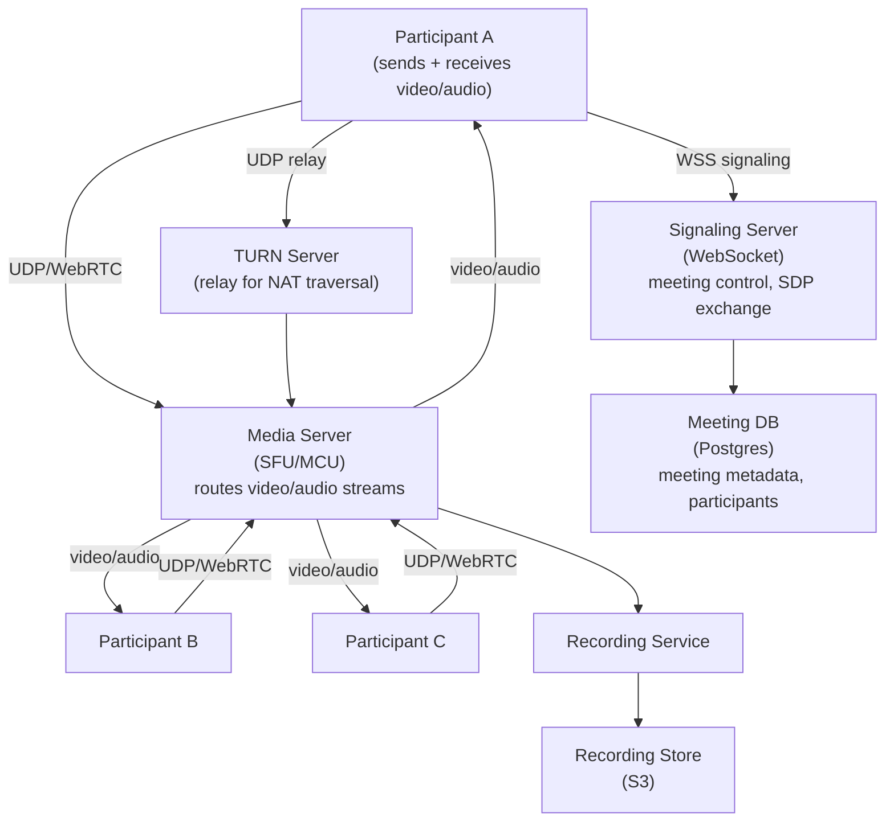
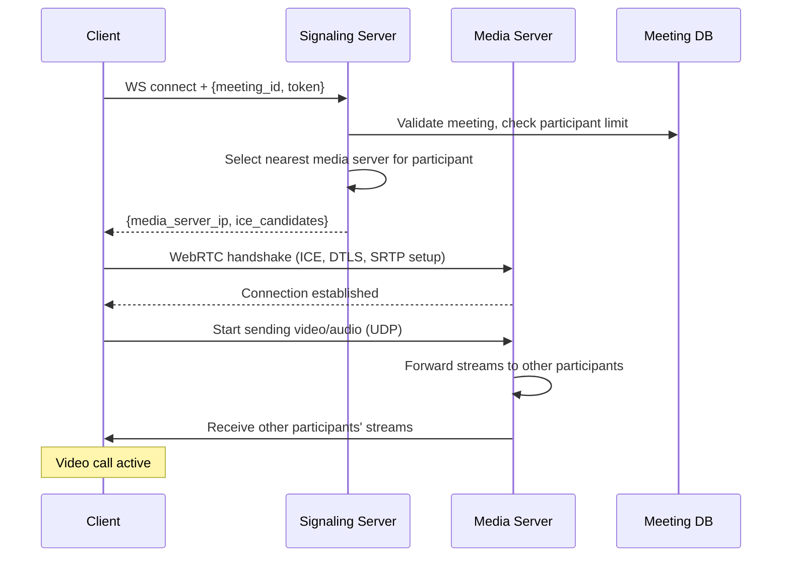
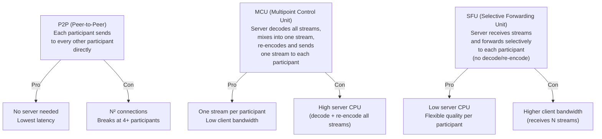
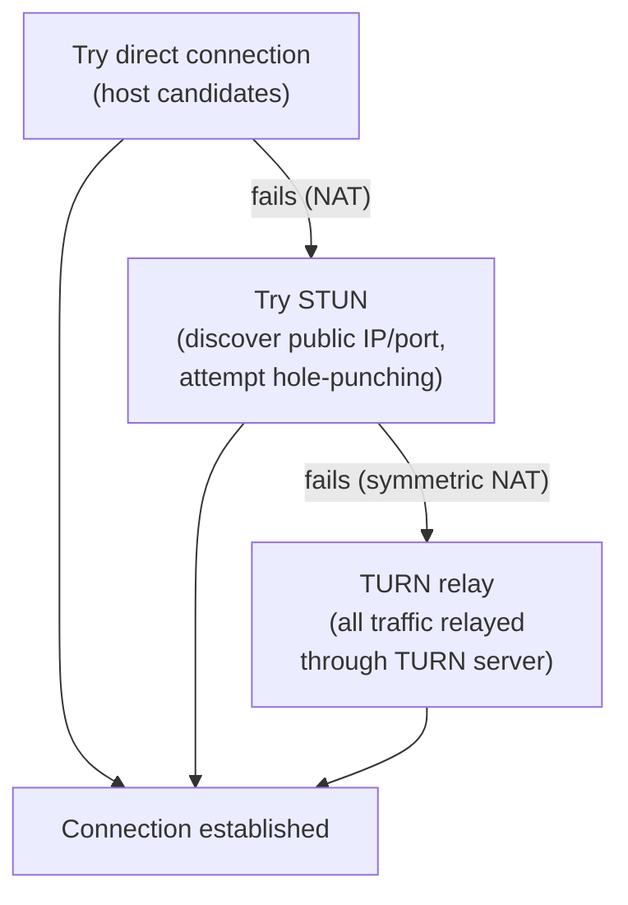
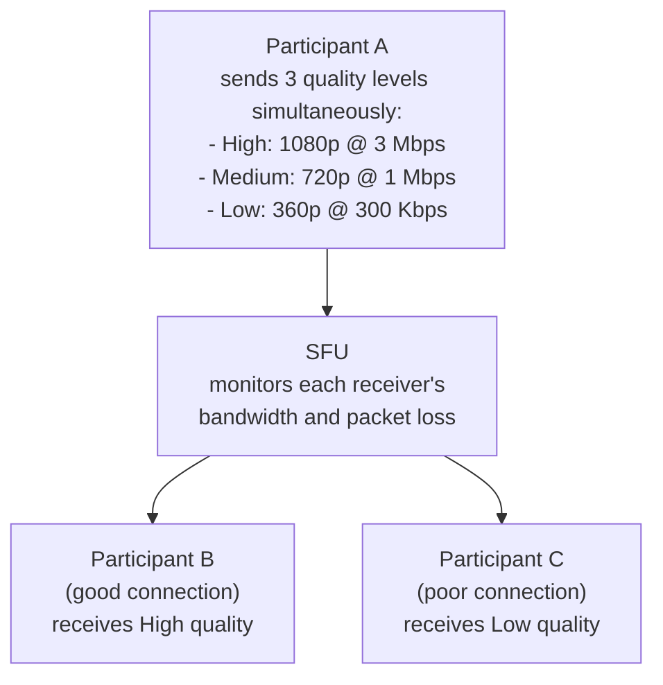
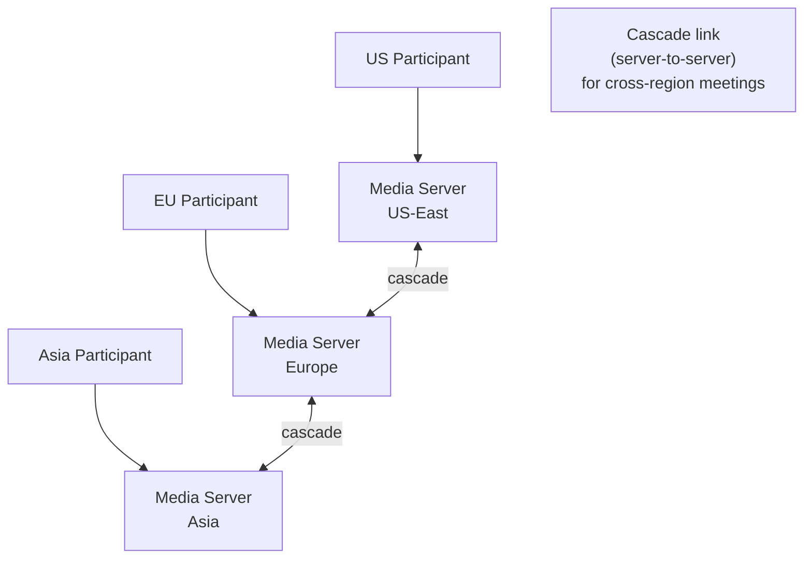
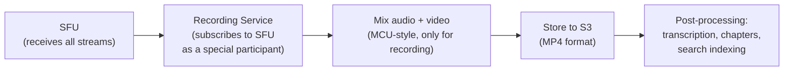

# System Design Walkthrough — Zoom (Video Conferencing)

> Language-agnostic. Focus is on architecture, data flow, and trade-offs.

---

## The Question

> "Design a video conferencing platform like Zoom. Multiple participants join a meeting, see and hear each other in real time, and can share their screens."

---

## Core Insight

Video conferencing is the hardest real-time system to design because it combines:

1. **Ultra-low latency requirements** — audio delay > 150ms is perceptible and disruptive. This rules out TCP for media transport.
2. **Adaptive quality** — participants have wildly different network conditions. The system must degrade gracefully.
3. **Media routing at scale** — in a 100-person meeting, naively sending each participant's video to all others = 100 × 99 = 9,900 streams. This doesn't scale.
4. **Global infrastructure** — participants are worldwide; routing media across continents adds unacceptable latency.

---

## Step 1 — Requirements

### Functional
- Video/audio calls with up to 1,000 participants
- Screen sharing
- Chat during meetings
- Recording (local and cloud)
- Breakout rooms
- Virtual backgrounds
- Waiting room / host controls

### Non-Functional

| Attribute | Target |
|-----------|--------|
| Concurrent meetings | 3M+ |
| Participants per meeting | Up to 1,000 (typical: 2-50) |
| Audio latency | < 150ms end-to-end |
| Video latency | < 300ms end-to-end |
| Availability | 99.99% |
| Packet loss tolerance | Graceful degradation up to 10% loss |

---

## Step 2 — Estimates

```
Concurrent meetings: 3M
Average participants: 5 (most meetings are small)
Total concurrent participants: 15M

Video bandwidth per participant:
  Sending: 1 Mbps (720p)
  Receiving: 1 Mbps × (N-1) participants
  For 5-person meeting: 4 Mbps receive

Total bandwidth:
  15M participants × 1 Mbps send = 15 Tbps ingress
  15M × 4 Mbps receive = 60 Tbps egress
  → Must be served from edge media servers, not a central data center

Signaling (meeting control):
  15M participants × 1 signal/s = 15M signals/s
  Each signal: ~200 bytes → 3 GB/s (manageable)
```

**Key observation:** 60 Tbps of video egress cannot come from a central location. Media servers must be distributed globally, close to participants.

---

## Step 3 — High-Level Design



### Happy Path — Joining a Meeting



---

## Step 4 — Detailed Design

### 4.1 Media Architecture — SFU vs. MCU vs. P2P

This is the most important architectural decision in video conferencing.



**Zoom uses SFU** for most meetings. The SFU receives one stream from each participant and forwards selectively — it only sends you the streams you need (active speaker + a few others), not all 100 streams in a large meeting.

**Active speaker detection:** The SFU monitors audio levels and identifies who is speaking. It prioritizes sending the active speaker's video at high quality and reduces quality for silent participants. This is why Zoom automatically switches the large video tile to whoever is talking.

### 4.2 NAT Traversal — Getting Through Firewalls

Most participants are behind NAT (home routers, corporate firewalls). Direct UDP connections between participants often fail. The solution: ICE (Interactive Connectivity Establishment) with STUN and TURN servers.



TURN servers are expensive (they relay all media traffic). Zoom minimizes TURN usage by trying direct and STUN connections first. Only ~10-15% of connections need TURN.

### 4.3 Adaptive Bitrate — Handling Bad Networks

Participants have different network conditions. The SFU uses simulcast to handle this:



**Simulcast:** The sender encodes and sends 3 quality levels simultaneously. The SFU selects which level to forward to each receiver based on their current bandwidth. Quality switches happen at keyframe boundaries (every ~1s) to avoid visual artifacts.

### 4.4 Global Media Server Distribution



For a meeting with participants in the US, Europe, and Asia:
- Each participant connects to their nearest media server
- Media servers are linked via cascade connections (server-to-server streams)
- Each participant receives streams from their local media server, not from across the world
- This keeps end-to-end latency low even for global meetings

### 4.5 Recording



Recording is handled by a special "participant" that subscribes to all streams from the SFU. It mixes them server-side (MCU-style) to produce a single MP4 file. This is acceptable for recording because latency doesn't matter — it's post-processed.

---

## Step 5 — Decision Log

| Decision | Options | Choice | Rationale |
|----------|---------|--------|-----------|
| Media architecture | P2P / MCU / SFU | SFU | P2P breaks at scale; MCU is too CPU-intensive; SFU balances server cost and client bandwidth |
| Transport protocol | TCP / UDP (WebRTC) | UDP | Audio latency < 150ms requires UDP; TCP retransmission adds unacceptable delay |
| Quality adaptation | Fixed / Simulcast | Simulcast | Sender encodes once at 3 levels; SFU selects per-receiver; no re-encoding needed |
| Global distribution | Centralized / Edge media servers | Edge media servers | 60 Tbps cannot come from one location; latency requires proximity |
| Recording | Client-side / Server-side | Server-side (SFU subscriber) | Client recording depends on client staying connected; server recording is reliable |

---

## Step 6 — Bottlenecks

| Bottleneck | Mitigation |
|------------|-----------|
| Large meeting (1,000 participants) | SFU only forwards active speaker + gallery view subset; most participants receive 25 streams max, not 999 |
| Media server overload | Each media server handles ~500 concurrent meetings; auto-scale; consistent hash meeting_id to server |
| TURN server bandwidth | TURN is last resort; minimize usage; TURN servers are bandwidth-heavy, scale separately |
| Cross-region cascade latency | Minimize cascade hops; route participants to nearest server; accept slightly higher latency for cross-region meetings |
| Packet loss | FEC (Forward Error Correction) adds redundancy; NACK (negative acknowledgment) requests retransmission for video; audio uses PLC (packet loss concealment) |

---

## Interviewer Mode — Hard Follow-Up Questions

---

**Q1: "You said Zoom uses UDP for audio/video. UDP has no delivery guarantee. A packet is lost. What happens to the audio — does the user hear a glitch?"**

> It depends on the loss rate and the recovery mechanism. For audio, Zoom uses two techniques. First, FEC (Forward Error Correction): the sender adds redundant data to every N packets so that any single lost packet can be reconstructed from the others. For example, every 5th packet contains a XOR of the previous 4 — if packet 3 is lost, it can be reconstructed from packets 1, 2, 4, and the parity packet. This adds ~20% bandwidth overhead but eliminates audible glitches for single packet losses. Second, PLC (Packet Loss Concealment): if a packet is lost and can't be recovered via FEC (e.g., burst loss), the audio codec (Opus) generates a synthetic continuation of the audio based on the previous frames. For speech, this sounds like a very brief stutter — barely noticeable at < 5% loss. At > 10% loss, audio quality degrades noticeably. For video, lost packets cause visual artifacts (blocky frames) rather than freezes — the decoder renders what it has. The key insight: UDP + FEC + PLC gives better perceived quality than TCP for real-time audio, because TCP's retransmission adds 100-200ms of latency (waiting for the retransmit), which is far more disruptive than a brief audio glitch.

---

**Q2: "A 500-person all-hands meeting on Zoom. The CEO is presenting. 499 people are watching. How many video streams are being transmitted, and how does the SFU manage this?"**

> The CEO sends 1 video stream (simulcast: 3 quality levels). The SFU receives these 3 streams. For the 499 viewers: each viewer receives 1 stream — the CEO's video at the quality level appropriate for their bandwidth. The SFU forwards the CEO's stream to all 499 viewers. Total streams: 3 sent by CEO + 499 received by viewers = 502 streams through the SFU. But the 499 viewers also each send their own video (even if their camera is off, they send a minimal stream for presence). So total: 500 streams into the SFU + 500 streams out = 1,000 streams. The SFU's bandwidth: 500 × 1Mbps in + 500 × 1Mbps out = 1Gbps. A single SFU server handles this easily (modern servers have 10Gbps NICs). The CPU load: the SFU doesn't decode/re-encode — it just forwards packets. CPU usage is minimal. The real constraint is the viewer's experience: each viewer receives only the CEO's stream (active speaker) plus small thumbnails of other participants. The SFU uses active speaker detection to decide which stream to prioritize for each viewer.

---

**Q3: "Zoom's end-to-end encryption feature means the server can't decrypt video. But Zoom also offers cloud recording. How can you record something you can't decrypt?"**

> These two features are mutually exclusive — you can't have both simultaneously. When E2E encryption is enabled, cloud recording is disabled. The recording button is grayed out. This is an intentional design decision, not a limitation to be engineered around. When E2E encryption is off (the default for most meetings), the SFU can decrypt the streams (it holds the session keys) and the Recording Service subscribes to the SFU as a special participant, receives the decrypted streams, mixes them, and writes to S3. When E2E encryption is on, the SFU only sees encrypted packets it cannot decrypt. Recording is only possible locally — the meeting host's client decrypts the streams (it has the keys) and records locally. The architectural lesson: security and convenience are genuinely in tension. Zoom made the right call by being explicit about the trade-off rather than trying to engineer around it with a backdoor.

---

**Q4: "A participant's internet connection drops mid-meeting. They reconnect 30 seconds later. What did they miss, and how does the system handle their reconnection?"**

> They missed 30 seconds of audio/video — this is unrecoverable for real-time streams. Unlike messaging (where you can replay missed messages), video frames are ephemeral. The SFU doesn't buffer video for reconnecting participants. On reconnection: the client re-establishes the WebSocket signaling connection, re-does the WebRTC handshake with the SFU (ICE, DTLS, SRTP), and starts receiving the live stream again. This takes 2-5 seconds. During this window, the participant sees a "reconnecting" spinner. The meeting continues without them — other participants see their video tile as frozen or blank. The participant's audio is muted automatically during reconnection to prevent noise. For the missed content: if cloud recording is enabled, the participant can watch the recording later. If not, they missed it. The host can also use the "recap" feature (if enabled) to summarize what was discussed. The key design point: real-time video is not a store-and-forward system. Reconnection means rejoining the live stream, not replaying the missed portion.

---

**Q5: "Zoom has a waiting room feature — the host must admit each participant. With 500 participants joining simultaneously (large webinar), how does the waiting room scale?"**

> The waiting room is a state machine per participant, not a queue. Each participant who joins is in `WAITING` state, stored in Redis: `waiting_room:{meeting_id}` → set of `{participant_id, name, join_time}`. The host's client subscribes to this set and receives real-time updates as participants join. For 500 simultaneous joins: 500 writes to Redis (fast, sub-millisecond each), 500 notifications pushed to the host's client via WebSocket. The host's UI shows a list of 500 waiting participants. The host can "Admit All" (one click → 500 state transitions from WAITING to ADMITTED) or admit individually. The "Admit All" operation: the Signaling Service receives the command, updates all 500 participant states in Redis in a pipeline (batch operation), and sends 500 WebSocket messages to the waiting participants' clients. Each client receives "admitted" and initiates the WebRTC handshake. The 500 simultaneous WebRTC handshakes are the real bottleneck — each requires CPU for DTLS key exchange. The SFU handles this by queuing handshakes and processing them at ~100/second, so all 500 are admitted within 5 seconds.

---

## Staff Engineer Review

### Missing Sections

**Recording pipeline**
Cloud recording captures the mixed video/audio stream from the SFU. The SFU mixes all participant streams into a single composite video (N-party gallery view) and records it as a sequence of video chunks. Recording pipeline: SFU → raw frame buffer → real-time H.264/H.265 encoder → chunked upload to S3 (one chunk per minute). After the meeting ends, a post-processing job concatenates the S3 chunks, runs final encoding (quality optimization), generates the MP4 file, and makes it available for download — typically within 5–15 minutes of meeting end. For a 2-hour meeting with 50 participants at 1080p composite: the mix and encode pipeline must run in real time (the encoder must process frames faster than they're generated). This requires dedicated transcoding hardware, not shared compute.

**Virtual backgrounds**
Background segmentation runs on the client — not the server. The pipeline: each 30fps video frame → ML segmentation model (MobileNet or similar, optimized for < 10ms inference on CPU/GPU) → binary mask separating person pixels from background → composite with chosen background image → encoded and sent to SFU. For CPU-constrained devices (old phones, laptops), the fallback is background blur (cheaper: Gaussian blur applied to non-mask pixels, no background image replacement). The server SFU receives only the composited frame — it has no knowledge of the original background. This is important: background processing never touches the server, preserving privacy.

**Breakout rooms**
Participants are moved from the main SFU session into sub-sessions (breakout rooms) and back. Technical challenge: re-establishing WebRTC is expensive (ICE + DTLS handshake = 1–3 seconds). Optimization: when a breakout room is opened, the participant's client establishes a second WebRTC PeerConnection to the breakout SFU in parallel to the main session PeerConnection. When the participant is "moved" to the breakout room, the main session's media tracks are muted and the breakout room's tracks are unmuted — no new handshake required. Moving back to the main room is the reverse: unmute the pre-established main session connection. This parallel connection model means breakout transitions take < 1 second instead of 3+ seconds.

### Critical Questions

> **"A participant's WebRTC connection degrades to 100kbps. How does your SFU adapt?"**

The SFU uses receiver-side bandwidth estimation (REMB or Transport-wide Congestion Control). When the participant's available bandwidth drops to 100kbps: (1) The SFU reduces the video bitrate sent to that participant by switching to a lower "simulcast layer" (if the sender transmits multiple quality tiers — e.g., 1080p, 360p, 180p — the SFU sends only the 180p layer to the degraded participant). (2) If bandwidth drops further, the SFU may drop video entirely and send audio only to that participant (audio is ~32kbps). (3) The number of video streams shown to the degraded participant is reduced: instead of showing 25 participants' videos, show only the active speaker (1 stream). The other 24 tiles become grey placeholders. The adaptation is entirely server-side — the degraded participant's client requests lower quality via RTCP feedback; the SFU responds by switching layers. Other participants' experience is unaffected because they have separate SFU connections.

> **"You have a 500-person webinar. The host's internet drops for 30 seconds. What happens to the 499 attendees? Can a co-host take over?"**

When the host's connection drops, the SFU detects the missing ICE keep-alive within 10 seconds and marks the host as disconnected. Attendees see the host's tile freeze and then go grey. The meeting audio and video from other participants continues — the SFU operates independently of the host. A designated co-host can immediately take control: the co-host's client receives a `host_disconnected` WebSocket event and the UI enables host-level controls (mute all, admit from waiting room, end meeting). This was pre-configured — co-host permissions are set in the meeting metadata at meeting creation, not requiring the unreachable host to approve. When the original host reconnects (typically within 30 seconds via their client's automatic reconnect), they rejoin as a co-host (not automatically reclaiming host to prevent race conditions) and the co-host can transfer host designation back manually.

> **"Zoom recordings must be available globally. A US meeting was recorded in the US data center but the downloader is in Singapore. Walk me through storage and delivery."**

Raw recording chunks are written to S3 in us-east-1 during the meeting. Post-processing (concatenation, final encode) runs in the same region — 5–15 minutes after meeting end. The final MP4 is stored in S3 us-east-1 as the origin. When the Singapore user requests the download: (1) The download link is a signed CloudFront (CDN) URL, not a direct S3 URL. (2) CloudFront routes the request to the nearest edge PoP (Singapore CloudFront edge). (3) On first request, CloudFront edge fetches from S3 us-east-1 origin (a one-time origin pull, ~150ms latency from Singapore to US east). (4) The edge caches the recording. Subsequent downloaders from the same region get the cached copy at local CDN speeds. (5) For very large recordings (> 1GB), the download is served as HTTP range requests, allowing the user to resume interrupted downloads without restarting. The signed URL includes an expiry (typically 24 hours) to prevent unauthorized sharing of the download link.

---

## API Design Snapshot

### Core endpoints
- `POST /v1/meetings` create meeting session.
- `POST /v1/meetings/{id}/join_tokens` issue participant token.
- `POST /v1/meetings/{id}/events` participant lifecycle updates.
- `POST /v1/recordings` finalize recording metadata.
- `GET /v1/meetings/{id}/qos` quality diagnostics.

### Reliability and consistency
- Join token issuance is idempotent and short-lived.
- Meeting events are appended with monotonic sequence IDs.
- Recording pipeline is async with retriable finalization.

### Security and limits
- Host/co-host role checks and waiting-room policy enforcement.
- Abuse controls for join attempts and token minting.

---

## API Data Model and Contract (Ordered)

### 1) Domain resources and ownership
- `Meeting`: scheduled/live session with policy.
- `Participant`: join state, role, and device/network metadata.
- `MediaSession`: SFU-level media routing context.
- `Recording`: post-call artifact metadata and lifecycle.
- `QoSReport`: aggregated quality telemetry.

### 2) Storage and indexing model
- Meeting metadata in OLTP, media plane state in low-latency stores.
- Indexes:
  - `idx_meeting_by_host(host_id, start_at desc)`
  - `idx_participant_by_meeting(meeting_id, joined_at)`
  - `idx_recording_by_meeting(meeting_id, created_at)`
- Event log for participant lifecycle replay and audit.

### 3) Endpoint matrix (comprehensive)
- `POST /v1/meetings` create meeting.
- `POST /v1/meetings/{id}/join_tokens` mint participant token.
- `POST /v1/meetings/{id}/events` participant lifecycle event.
- `GET /v1/meetings/{id}` meeting state.
- `POST /v1/recordings` recording finalize metadata.
- `GET /v1/recordings/{id}/download` signed recording URL.
- `GET /v1/meetings/{id}/qos` diagnostics summary.
- `POST /v1/meetings/{id}/end` host-initiated end.

### 4) Contract examples
Write contract: `POST /v1/meetings`
```json
{
  "host_id": "u_91",
  "topic": "weekly sync",
  "start_at": "2026-05-14T16:00:00Z",
  "settings": {"waiting_room": true, "passcode": "8452"}
}
```
```json
{
  "meeting_id": "mt_451",
  "state": "scheduled",
  "join_url": "https://example.com/j/mt_451",
  "created_at": "2026-05-13T19:20:00Z"
}
```
Read contract: `GET /v1/meetings/{id}/qos`
```json
{
  "meeting_id": "mt_451",
  "packet_loss_pct": 1.2,
  "avg_rtt_ms": 84,
  "degraded_participants": 3
}
```

### 5) Idempotency, concurrency, and consistency
- Create dedupe by `(host_id, client_request_id)`.
- Meeting state machine enforced for start/end/record transitions.
- Join token issuance idempotent for active participant window.

### 6) Error taxonomy
- `403_WAITING_ROOM_REQUIRED`
- `409_MEETING_ALREADY_ENDED`
- `422_INVALID_PARTICIPANT_ROLE`

### 7) Security, quotas, and observability
- Role checks (`host`, `cohost`, `participant`) on control APIs.
- Join token and meeting creation rate limits.
- Metrics: `join_time_ms`, `media_connect_success_rate`, `recording_ready_latency_ms`.

### 8) Webhook and event contracts (where applicable)
- Account-level callbacks:
  - `meeting.started`
  - `meeting.ended`
  - `recording.completed`
- Delivery contract:
  - Headers: `X-Zm-Signature`, `X-Event-Id`, `X-Event-Timestamp`
  - Body fields: `event`, `payload.object.id`, `payload.object.host_id`, `payload.object.start_time`
- Reliability rules:
  - At-least-once retries on timeout/`5xx`.
  - Receiver dedupe by `event_id`.

Example `recording.completed` payload:
```json
{
  "event_id": "evt_zoom_4",
  "event": "recording.completed",
  "payload": {
    "object": {
      "id": "mt_451",
      "host_id": "u_91",
      "recording_files": [{"id": "rec_77", "status": "completed"}]
    }
  }
}
```
