# System Design Walkthroughs — Amazon, LinkedIn, Pinterest, Snapchat, TikTok, Shopify, Airbnb, ChatGPT

> Language-agnostic walkthroughs for the remaining systems from the image. Each follows the 6-step framework.

---

# Amazon (E-Commerce Platform)

## Core Insight

Amazon is not one system — it's hundreds. For a system design interview, focus on the **product catalog + order pipeline**. The hard problems are: **inventory consistency** (two users buying the last item simultaneously), **search at scale** (500M products), and **order state machine reliability**.

## Requirements

**Functional:** Browse/search products, add to cart, checkout, order tracking, reviews, seller listings.

**Non-Functional:**

| Attribute | Target |
|-----------|--------|
| Products | 500M+ |
| Orders/day | 10M+ |
| Search queries/s | 100K |
| Checkout latency | < 2s |
| Inventory consistency | Strong (no overselling) |
| Availability | 99.999% (downtime = direct revenue loss) |

## Estimates

```
Product catalog: 500M × 5KB = 2.5 TB metadata
Search index: 500M × 10KB = 5 TB (Elasticsearch)
Orders: 10M/day × 2KB = 20 GB/day
Inventory updates: 10M orders × avg 3 items = 30M inventory decrements/day → ~350/s
```

## High-Level Design

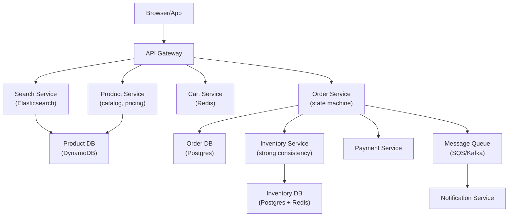

## Key Design: Inventory — Preventing Overselling

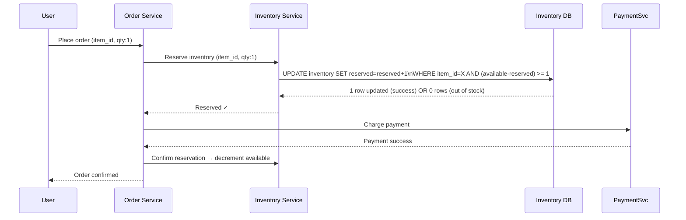

**Optimistic locking on inventory:** The `WHERE available - reserved >= qty` condition ensures atomicity. Two concurrent orders for the last item: one succeeds, one gets 0 rows updated and returns "out of stock."

## Order State Machine

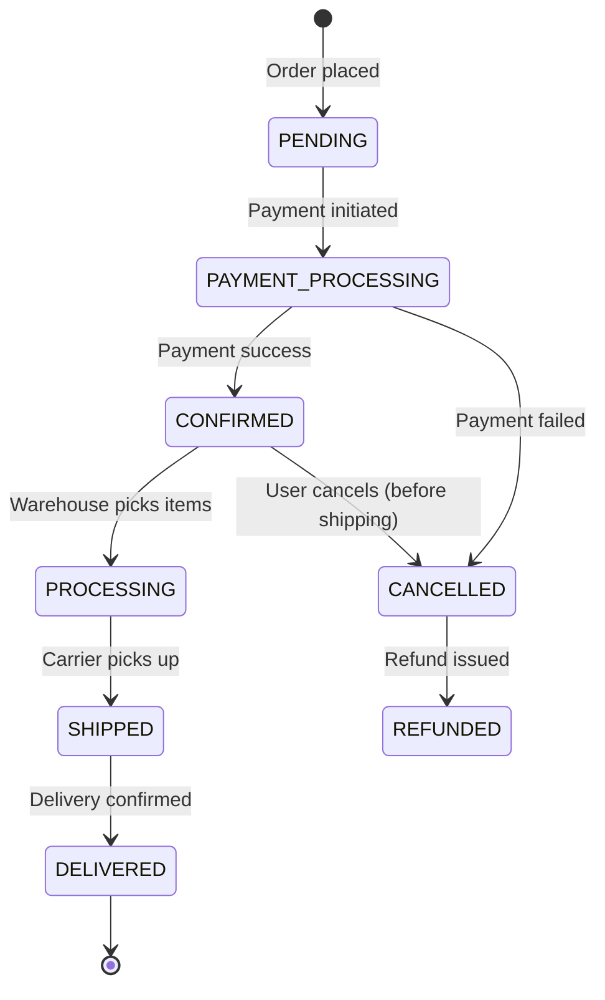

## Decision Log

| Decision | Choice | Rationale |
|----------|--------|-----------|
| Product storage | DynamoDB | 500M products; high read throughput; flexible schema for varied product types |
| Inventory consistency | Postgres with optimistic locking | Strong consistency required; can't oversell; Postgres ACID guarantees |
| Cart storage | Redis | Ephemeral; fast reads; TTL for abandoned carts |
| Search | Elasticsearch | Full-text, faceted filtering, autocomplete at 500M products |
| Order DB | Postgres | ACID for financial records; complex queries for order management |

---

# LinkedIn (Professional Social Network)

## Core Insight

LinkedIn's hard problems: **the social graph at scale** (1B users, complex relationship queries), **feed ranking** (professional content is different from social content — recency matters less, relevance matters more), and **job matching** (connecting job seekers to relevant postings).

## Requirements

**Functional:** Profiles, connections (1st/2nd/3rd degree), feed, job postings, messaging, endorsements, company pages.

**Non-Functional:** 1B users, 310M MAU, feed latency < 300ms, connection graph queries < 100ms.

## High-Level Design

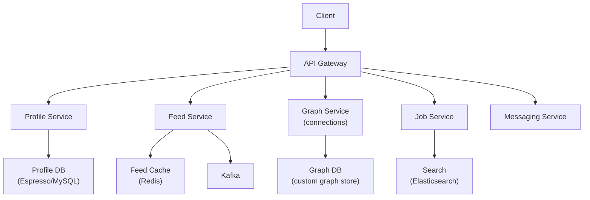

## Key Design: Graph Traversal for "People You May Know"

LinkedIn's graph has 1B nodes and ~500B edges. "2nd degree connections" (friends of friends) requires traversing two hops.

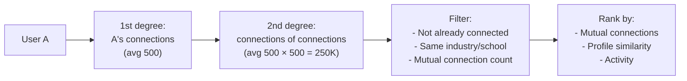

LinkedIn built a custom graph store (not Neo4j) because standard graph databases couldn't handle 1B nodes with sub-100ms traversal. The graph is stored in memory across a cluster, partitioned by user_id.

## Decision Log

| Decision | Choice | Rationale |
|----------|--------|-----------|
| Graph storage | Custom in-memory graph | Neo4j/standard graph DBs too slow at 1B nodes; LinkedIn built their own |
| Feed generation | Hybrid fan-out | Same celebrity problem as Twitter; influencers with millions of followers |
| Job search | Elasticsearch | Full-text + faceted (location, industry, experience level) |
| Profile storage | MySQL (Espresso) | Relational; complex queries; LinkedIn built Espresso on top of MySQL |

---

# Pinterest (Visual Discovery)

## Core Insight

Pinterest is an **image-heavy content discovery platform**. The hard problems: **image storage and delivery at petabyte scale**, **recommendation/discovery** (Pinterest's core value — showing you things you didn't know you wanted), and **the interest graph** (not a social graph of people, but a graph of interests and boards).

## Requirements

**Functional:** Pin images, create boards, follow boards/users, home feed, search, recommendations.

**Non-Functional:** 450M MAU, 200B pins, feed latency < 200ms, image delivery via CDN.

## High-Level Design

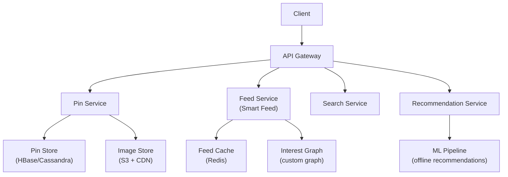

## Key Design: The Interest Graph vs. Social Graph

Pinterest's graph is different from Twitter/LinkedIn. It's not "who follows whom" — it's "what interests connect to what content."

```
Interest graph nodes:
  - Users
  - Boards (collections of pins)
  - Pins (individual images)
  - Topics (fashion, food, travel...)

Edges:
  - User → follows → Board
  - User → saves → Pin (to a Board)
  - Pin → tagged with → Topic
  - Board → categorized as → Topic
```

The feed is generated by traversing this graph: "show me pins from boards the user follows, plus pins similar to what they've saved, plus trending pins in their interest topics."

## Decision Log

| Decision | Choice | Rationale |
|----------|--------|-----------|
| Pin storage | HBase | 200B pins; wide-column; high write throughput |
| Image storage | S3 + CDN | Petabyte scale; CDN for global delivery |
| Feed | ML-ranked (Smart Feed) | Chronological feed was replaced; ML ranking increases engagement |
| Recommendations | Offline ML (weekly) | Collaborative filtering on interest graph; pre-computed per user |

---

# Snapchat (Ephemeral Media Messaging)

## Core Insight

Snapchat's defining feature is **ephemerality** — messages disappear after viewing. This is an architectural constraint, not just a UI feature. The hard problems: **ephemeral storage** (delete after view, but prevent screenshots), **Stories** (24-hour content visible to all followers), and **real-time media delivery** (snaps must arrive quickly).

## Requirements

**Functional:** Send photo/video snaps (disappear after view), Stories (24h), chat, Discover (publisher content), Snap Map.

**Non-Functional:** 400M DAU, 5B snaps/day, snap delivery < 1s, story delivery < 2s.

## High-Level Design

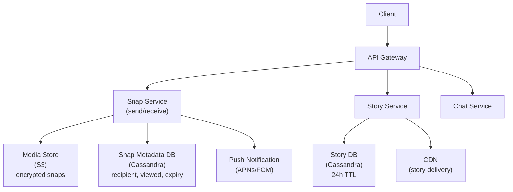

## Key Design: Ephemeral Snaps

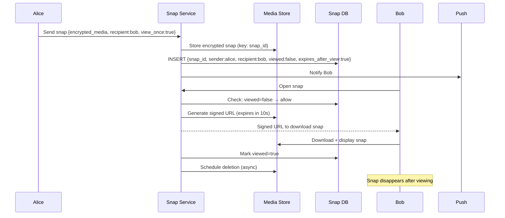

**Screenshot detection:** Snapchat detects screenshots via OS APIs (iOS/Android screenshot notifications). It can't prevent screenshots, but it notifies the sender. This is a social deterrent, not a technical prevention.

## Decision Log

| Decision | Choice | Rationale |
|----------|--------|-----------|
| Snap storage | S3 with TTL + deletion job | Snaps are media blobs; S3 is the right store; deletion is async |
| Ephemerality | Soft delete (mark viewed) + async hard delete | Immediate hard delete risks data loss if client crashes mid-view |
| Stories | Cassandra with 24h TTL | Time-series; TTL handles expiry automatically |
| Media encryption | Client-side E2E | Server stores ciphertext; can't reconstruct snap even if S3 is breached |

---

# TikTok (Short Video Platform)

## Core Insight

TikTok's defining feature is its **recommendation algorithm** (For You Page). Unlike Instagram (social graph-based feed) or YouTube (search-based discovery), TikTok shows you content from creators you've never heard of, based purely on engagement signals. The hard problems: **video processing pipeline** (similar to YouTube but for short videos), **recommendation at scale** (serving personalized feeds to 1B users), and **creator monetization**.

## Requirements

**Functional:** Upload short videos (15s-10min), For You Page (algorithmic feed), follow creators, live streaming, duets/stitches.

**Non-Functional:** 1B DAU, 34M videos uploaded/day, feed latency < 200ms, video start < 1s.

## High-Level Design

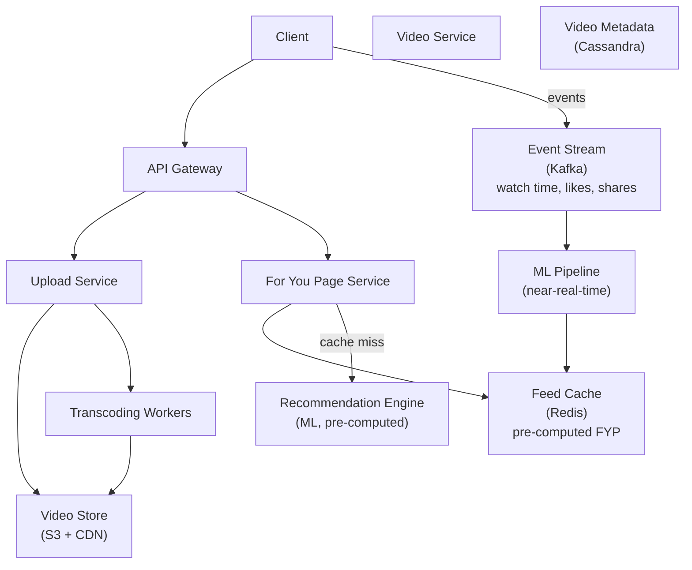

## Key Design: The For You Page Algorithm

TikTok's FYP is what makes it different. It doesn't require you to follow anyone — it learns from your behavior.

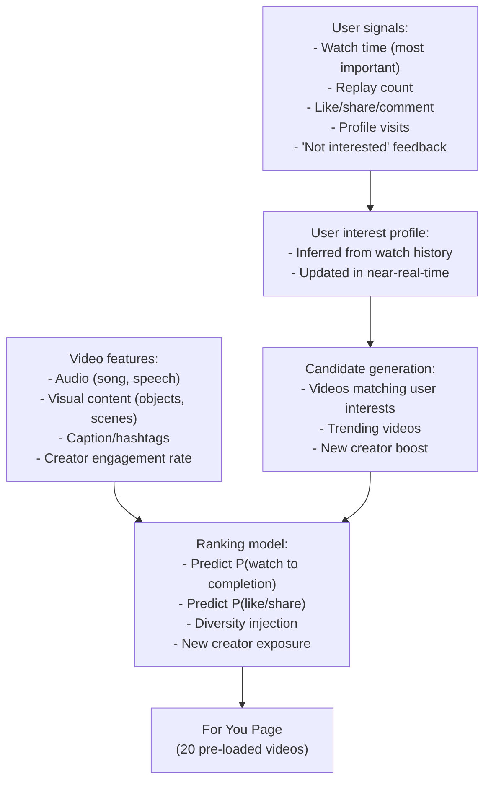

**Near-real-time updates:** Unlike Spotify (weekly recommendations), TikTok updates your interest profile within minutes. If you watch 5 cooking videos in a row, the next video is likely cooking. This requires a streaming ML pipeline (Kafka → Flink → model inference → Redis).

## Decision Log

| Decision | Choice | Rationale |
|----------|--------|-----------|
| Feed algorithm | ML-based (no social graph required) | Core differentiator; social graph limits discovery |
| Recommendation freshness | Near-real-time (minutes) | User interests shift rapidly; stale recommendations reduce engagement |
| Video storage | S3 + CDN | Same as YouTube; CDN pre-positions popular videos |
| Transcoding | Parallel workers (same as YouTube) | 34M videos/day; embarrassingly parallel |

---

# Shopify (E-Commerce Platform)

## Core Insight

Shopify is a **multi-tenant SaaS platform** — it hosts millions of independent online stores. The hard problems: **tenant isolation** (one store's traffic spike shouldn't affect others), **checkout reliability** (payment failures = lost revenue), and **flash sales** (a single store can go from 0 to 100K concurrent users in seconds when a product drops).

## Requirements

**Functional:** Store builder, product catalog, checkout, payment processing, inventory, order management, analytics.

**Non-Functional:** 2M+ merchants, 500M shoppers, 10K orders/s peak (flash sales), checkout latency < 2s, 99.99% availability.

## High-Level Design

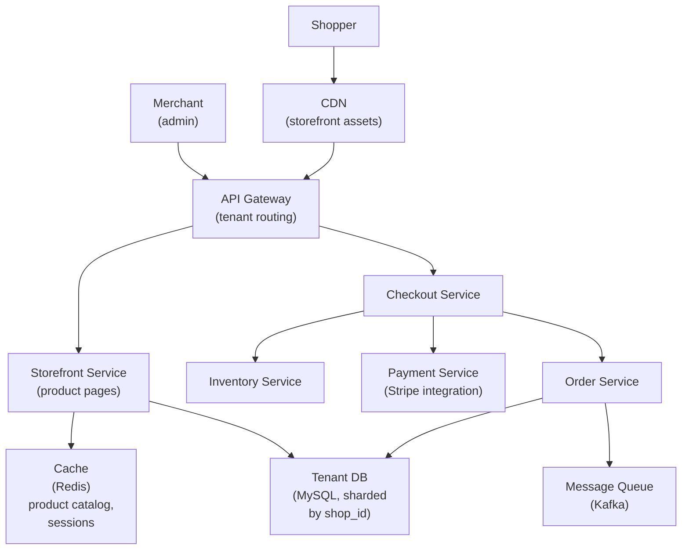

## Key Design: Flash Sale Handling

A sneaker brand drops limited-edition shoes. 100K users hit checkout simultaneously. Inventory: 500 pairs.

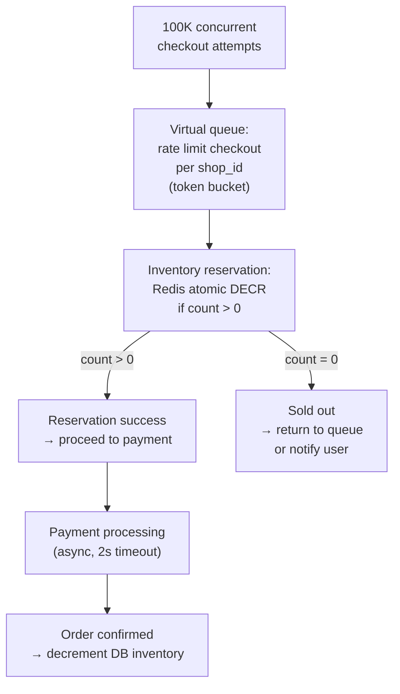

**Redis for inventory reservation:** Redis `DECR` is atomic. 100K concurrent requests → Redis serializes them. First 500 succeed, rest get "sold out" immediately. No database contention.

## Decision Log

| Decision | Choice | Rationale |
|----------|--------|-----------|
| Multi-tenancy | Shared infrastructure, logical isolation by shop_id | Cost efficiency; most shops are small |
| Inventory for flash sales | Redis atomic counters | Database can't handle 100K concurrent writes; Redis serializes atomically |
| Storefront caching | CDN + Redis | Product pages are read-heavy; cache aggressively |
| Database sharding | MySQL sharded by shop_id | Each shop's data is independent; shop_id is the natural shard key |

---

# Airbnb (Marketplace Platform)

## Core Insight

Airbnb is a **two-sided marketplace** connecting hosts and guests. The hard problems: **search with availability** (finding listings that are available for specific dates is a complex query), **pricing** (dynamic pricing based on demand, season, events), and **trust** (reviews, identity verification, payment escrow).

## Requirements

**Functional:** List properties, search by location/dates/guests, book, review, messaging between host/guest, payments.

**Non-Functional:** 150M users, 7M listings, 2M nights booked/day, search latency < 500ms, booking consistency (no double-booking).

## High-Level Design

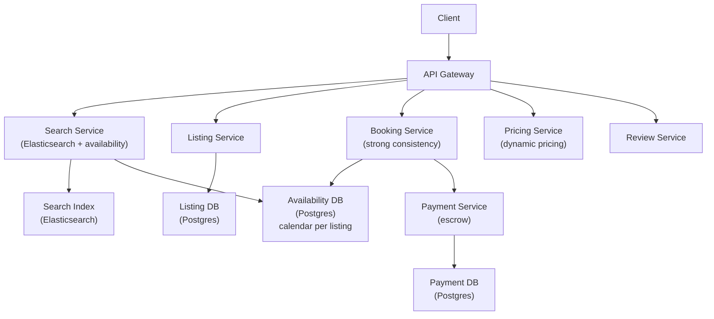

## Key Design: Availability and Double-Booking Prevention

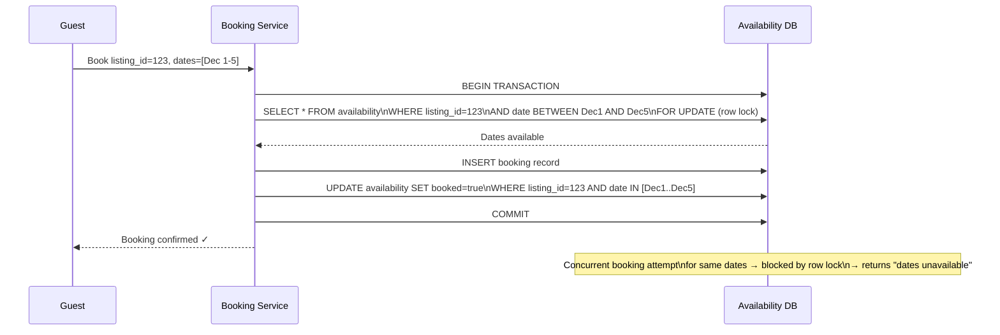

**Row-level locking** on the availability calendar prevents double-booking. The `FOR UPDATE` lock ensures only one booking transaction can proceed for a given listing + date range at a time.

## Decision Log

| Decision | Choice | Rationale |
|----------|--------|-----------|
| Search | Elasticsearch + availability filter | Full-text + geo search; availability is a post-filter (Elasticsearch doesn't know about bookings) |
| Booking consistency | Postgres with row locks | ACID required; double-booking is a serious trust violation |
| Pricing | ML-based dynamic pricing | Demand signals (local events, seasonality, competitor prices) |
| Payments | Escrow model | Guest pays upfront; host receives after check-in; protects both parties |

---

# ChatGPT / LLM Serving Platform

## Core Insight

Serving a large language model is fundamentally different from serving a web application. The hard problems: **inference latency** (generating tokens is slow — 10-50 tokens/second), **GPU memory** (a single model requires 80-320GB of GPU RAM), **streaming responses** (users see tokens as they're generated, not after), and **cost** (GPU inference is expensive — must maximize utilization).

## Requirements

**Functional:** Send a prompt, receive a streamed response, conversation history, multiple models.

**Non-Functional:** 100M users, 10M queries/day, response start < 1s (time to first token), throughput 20-50 tokens/s, 99.9% availability.

## High-Level Design

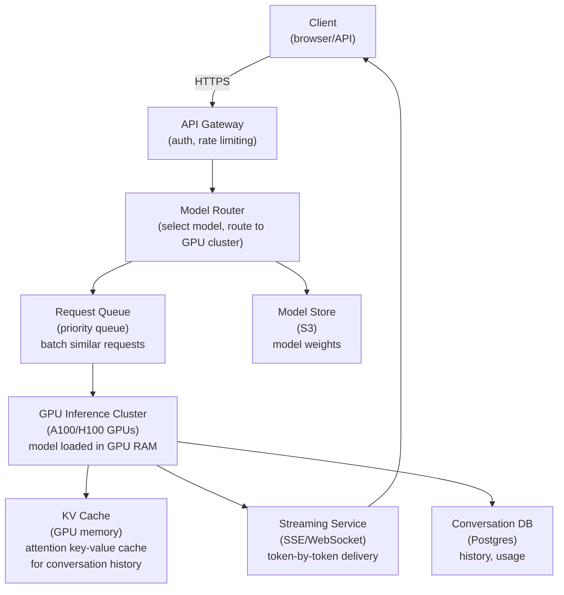

## Key Design: Token Streaming

Users don't wait for the full response — they see tokens as they're generated. This requires server-sent events (SSE) or WebSocket.

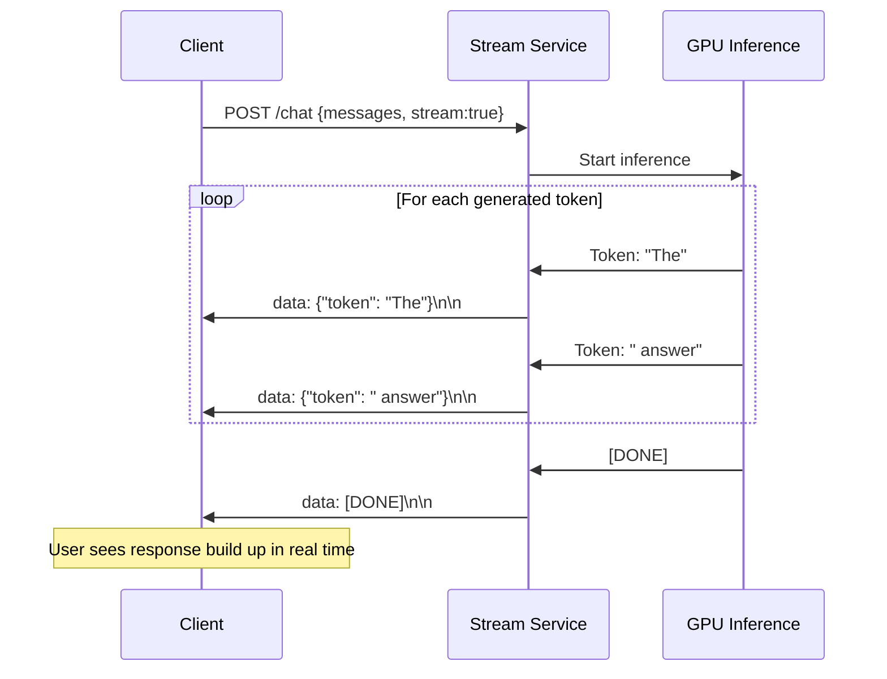

## Key Design: Batching for GPU Utilization

GPUs are most efficient when processing multiple requests simultaneously (batching). But requests arrive at different times and have different lengths.

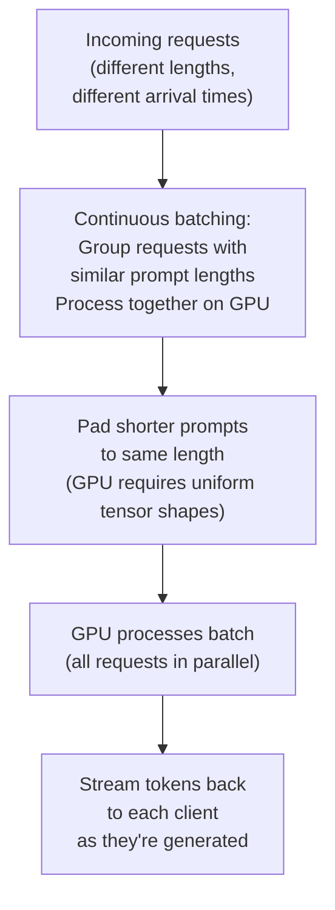

**Continuous batching** (also called in-flight batching) is the key optimization: as one request finishes, a new one is added to the batch without waiting for all requests to complete. This keeps GPU utilization high.

## Decision Log

| Decision | Choice | Rationale |
|----------|--------|-----------|
| Response delivery | SSE (Server-Sent Events) | Streaming tokens; unidirectional (server → client); simpler than WebSocket |
| GPU batching | Continuous batching | Maximizes GPU utilization; reduces cost per query |
| KV cache | In GPU memory | Attention computation reuses previous token representations; caching avoids recomputation |
| Model storage | S3 → loaded into GPU RAM on startup | Models are large (100-700GB); loaded once, served many times |
| Rate limiting | Token-based (not request-based) | Long responses consume more GPU time; rate limit by tokens generated, not requests |

## Bottlenecks

| Bottleneck | Mitigation |
|------------|-----------|
| GPU memory (model too large for one GPU) | Tensor parallelism: split model across multiple GPUs |
| Long context (100K token conversation) | KV cache grows with context length; limit context window; evict old turns |
| GPU cost | Continuous batching; spot instances for non-interactive workloads; smaller models for simple queries |
| Cold start (loading model) | Keep model loaded in GPU RAM; never unload; scale by adding GPU nodes |

---

## Cross-System Comparison

| System | Primary Hard Problem | Key Data Store | Consistency Model | CDN Role |
|--------|---------------------|----------------|-------------------|----------|
| Amazon | Inventory consistency | Postgres (ACID) | Strong | Moderate (product images) |
| LinkedIn | Graph traversal at scale | Custom graph store | Eventual | Low |
| Pinterest | Image delivery + discovery | HBase + S3 | Eventual | High (images) |
| Snapchat | Ephemeral media delivery | Cassandra + S3 | Eventual | High (snaps/stories) |
| TikTok | Real-time recommendation | Cassandra + Redis | Eventual | Very high (video) |
| Shopify | Multi-tenant flash sales | MySQL (sharded) | Strong (checkout) | High (storefronts) |
| Airbnb | Availability + no double-booking | Postgres | Strong (booking) | Low |
| ChatGPT | GPU utilization + streaming | Postgres + GPU RAM | N/A | Low |

---

## Interviewer Mode — Hard Follow-Up Questions

---

### Amazon

**Q1: "Two users add the last item in stock to their cart simultaneously. Both proceed to checkout. How do you ensure only one of them successfully purchases it?"**

> The cart doesn't reserve inventory — it's just a wishlist. Inventory is only reserved at checkout. When both users hit "Place Order" simultaneously, both requests reach the Inventory Service. The Inventory Service uses an optimistic lock: `UPDATE inventory SET reserved = reserved + 1 WHERE item_id = X AND (available - reserved) >= 1`. This is an atomic SQL operation. One request gets "1 row updated" (success), the other gets "0 rows updated" (out of stock). The losing user gets an "Item no longer available" error at checkout. This is the correct behavior — first to checkout wins. The alternative (reserving at add-to-cart) would cause items to be locked in carts indefinitely, which is worse. Amazon uses a short reservation window at checkout: inventory is reserved for 15 minutes while payment is processed. If payment fails or times out, the reservation is released.

**Q2: "Amazon's recommendation engine says 'customers who bought X also bought Y.' How is this computed at scale with 500M products?"**

> This is collaborative filtering — specifically item-to-item collaborative filtering, not user-to-user. The computation: for every pair of items (X, Y), count how many orders contain both. Items that frequently co-occur are "related." At 500M products, computing all pairs is O(N²) = 250 quadrillion pairs — impossible. The optimization: we only compute pairs for items that appear in the same order. Most items never co-occur. The computation runs as a batch MapReduce job: Map phase emits (order_id, item_id) pairs; Reduce phase groups by order_id to get item sets; a second MapReduce computes co-occurrence counts. This runs on the order history (billions of orders) but only touches items that actually co-occur — the sparse matrix is manageable. The result is stored as: `item_recommendations:{item_id}` → top-20 related items. Updated weekly. Served from Redis at read time.

---

### LinkedIn

**Q1: "LinkedIn shows '2nd degree connections' — friends of friends. A user has 500 connections, each with 500 connections. That's 250,000 potential 2nd-degree connections. How do you compute this in real time?"**

> We don't compute it in real time — we pre-compute it. LinkedIn's graph service maintains a pre-computed 2nd-degree connection set per user, updated incrementally when connections change. The data structure: for each user, store a bloom filter of their 2nd-degree connections. A bloom filter for 250,000 connections takes ~300KB with 1% false positive rate. When checking "is user B a 2nd-degree connection of user A?", it's a bloom filter lookup — O(1), sub-millisecond. For the "People You May Know" feature, we pre-compute the top-N candidates offline (nightly batch job) using the full graph traversal, rank by mutual connection count, and store in Redis. The real-time path only needs to check "is this person already connected?" (bloom filter) and fetch the pre-computed candidates (Redis lookup). The graph traversal itself never happens at request time.

**Q2: "LinkedIn's feed shows posts from your connections. But it also shows posts your connections liked. How does this affect your fan-out design?"**

> It multiplies the fan-out significantly. If Alice likes a post, that like event needs to fan-out to all of Alice's connections' feeds — not just Alice's followers. This is "social proof" fan-out. The challenge: Alice has 500 connections. Each of them might see "Alice liked this post" in their feed. That's 500 fan-out writes per like event. At scale (millions of likes per day), this is expensive. LinkedIn's approach: apply the same hybrid model as Twitter. For users with < 1,000 connections, fan-out on write. For users with > 1,000 connections (power users), fan-out on read — when their connections open their feed, the feed service queries "what did this person like recently?" and injects it. The threshold is lower than Twitter's celebrity threshold because LinkedIn's engagement signals (likes) are more frequent than tweets.

---

### Pinterest

**Q1: "A user saves a pin to their board. That pin is now in their board, in the original creator's board, and potentially in search results. How do you keep all these views consistent?"**

> They don't need to be strongly consistent — eventual consistency is fine. The pin record in HBase is the source of truth. When a user saves a pin, we write to HBase (the save relationship: user → pin) and publish a `pin_saved` event to Kafka. Downstream consumers update: the board's pin list (Cassandra), the search index (Elasticsearch, async), the recommendation model's training data (batch). The user sees their saved pin immediately (optimistic update in the client). Other views (search results, the original creator's board stats) update within seconds to minutes. The key insight: Pinterest is a discovery platform, not a financial system. A pin appearing in search results 30 seconds after being saved is perfectly acceptable. Strong consistency would add latency and complexity for no user-visible benefit.

---

### Snapchat

**Q1: "Snapchat Stories are viewed by potentially millions of people. A celebrity posts a Story. How do you deliver it to 50 million followers without the origin server collapsing?"**

> Same CDN strategy as YouTube and Netflix. When a Story is uploaded, it's stored in S3 and immediately pushed to CDN edge nodes globally. The Story is a short video (up to 60 seconds) — typically 5-20MB. CDN pre-positioning: as soon as the Story is processed, we push it to the top 100 CDN edge nodes (covering 90% of global traffic). When followers open the app, they fetch the Story from the nearest CDN edge — the origin server is never hit for popular Stories. The CDN cache TTL is 24 hours (matching the Story's lifetime). After 24 hours, the Story expires and the CDN entries are invalidated. The origin server only handles cache misses (< 1% of requests) and the initial upload. The 50 million followers generate ~50M CDN requests — distributed across thousands of edge nodes, each handling a few thousand requests. No single server sees more than a few thousand requests/second.

---

### TikTok

**Q1: "TikTok's For You Page shows you content from creators you've never heard of. A new creator posts their first video. How quickly can it appear on someone's FYP, and what determines who sees it?"**

> A new creator's video can appear on FYPs within hours of posting. The pipeline: video uploaded → transcoded (5-10 minutes) → initial distribution to a small test audience (1,000 users selected by the recommendation model as likely to engage). The model scores the video based on: audio track (is it a trending sound?), visual content (objects, scenes), caption/hashtags, creator's account age and history. The test audience's engagement signals (watch time, likes, shares, comments) feed back into the model within minutes. If the video performs well (high watch-to-completion rate), the model expands distribution to a larger audience. This is a feedback loop: good performance → wider distribution → more signals → even wider distribution. A video that goes viral can reach millions of FYPs within 24 hours. A video with poor engagement stays at 1,000 views. The "new creator boost": TikTok intentionally gives new creators a slightly higher initial distribution than their account history would suggest — this is how new creators can go viral without an existing following.

---

### Shopify

**Q1: "A Shopify merchant's store goes viral on TikTok. They go from 10 orders/day to 100,000 orders/hour in 30 minutes. How does Shopify handle this without the merchant's store going down?"**

> Shopify's multi-tenant architecture is designed for exactly this. The merchant's store is served by Shopify's shared infrastructure — the merchant doesn't have their own servers to scale. When traffic spikes, Shopify's auto-scaling kicks in: the storefront service (which serves product pages) scales horizontally — new instances spin up within 60 seconds. The product catalog is cached in Redis and CDN — the spike in product page views hits the cache, not the database. The checkout service scales independently. The inventory reservation uses Redis atomic counters — 100,000 concurrent checkout attempts are serialized by Redis, not the database. The merchant's MySQL shard might become a bottleneck for order writes — Shopify mitigates this with connection pooling and write batching. The key architectural advantage: the merchant benefits from Shopify's infrastructure investment. A small merchant on their own servers would go down in this scenario. On Shopify, they stay up because they're sharing infrastructure with thousands of other merchants, and Shopify has invested in making that infrastructure elastic.

---

### Airbnb

**Q1: "A host lists their property as available for December. 100 users search for that property for December simultaneously. How do you show accurate availability without locking the availability table for every search?"**

> Searches are read-only — they don't lock anything. The availability calendar is read with a regular SELECT (no FOR UPDATE lock). The lock only happens at booking time. The race condition: 100 users see the property as available, all try to book simultaneously. Only one succeeds — the first to acquire the row lock in the booking transaction. The other 99 get "dates no longer available." This is correct behavior. The UX concern: a user spends 10 minutes filling out the booking form, submits, and gets "dates no longer available." Mitigation: a soft reservation — when a user reaches the payment page, we create a 10-minute soft reservation (no lock, just a flag in Redis: `soft_reserved:{listing_id}:{dates}` with TTL 600s). The search results show the property as "pending" for other users during this window. If the booking completes, the soft reservation becomes a hard booking. If it times out, the property becomes available again. The soft reservation is advisory — it doesn't prevent double-booking (that's the DB lock's job), but it reduces the likelihood of the "10 minutes wasted" scenario.

---

### ChatGPT

**Q1: "A user sends a message in a conversation with 50 previous messages. The model needs all 50 messages as context. How do you efficiently pass this context to the GPU without re-processing all 50 messages every time?"**

> This is what the KV (Key-Value) cache is for. When the model processes the first 50 messages, it computes attention keys and values for each token. These KV tensors are cached in GPU memory. When the user sends message 51, we only need to compute the KV tensors for the new tokens — the cached tensors for the previous 50 messages are reused. This reduces computation from O(total_tokens) to O(new_tokens) for each turn. The KV cache size: for a 50-message conversation with ~2,000 tokens, the KV cache is ~500MB per conversation (depends on model size and number of layers). At 10,000 concurrent conversations, that's 5TB of KV cache — more than fits in GPU memory. The eviction policy: LRU eviction of conversation KV caches. When a conversation's cache is evicted, the next message requires recomputing the full context from scratch (slower, but correct). Long-running conversations with many turns are the most expensive — they have large KV caches that are frequently evicted and recomputed.

**Q2: "ChatGPT has a 'memory' feature that remembers facts about you across conversations. How is this implemented without putting your entire history in every prompt?"**

> Memory is a retrieval problem, not a context window problem. The full conversation history is never put in the prompt — that would be too large. Instead: a Memory Service extracts key facts from conversations ("user is a software engineer," "user has two kids," "user prefers concise answers") and stores them as structured records in a vector database (Pinecone, Weaviate). Each fact is embedded as a vector. When a new conversation starts, the system retrieves the top-K most relevant memories using semantic similarity search: embed the user's first message, find the K nearest memory vectors, inject those K facts into the system prompt. This is Retrieval-Augmented Generation (RAG) applied to personal memory. The prompt injection: "The following facts are known about this user: [K retrieved memories]." This adds ~500 tokens to the context — manageable. The memory store is updated after each conversation: new facts are extracted and added, contradicted facts are updated or removed. The vector database handles the semantic search efficiently — even with 10,000 stored memories per user, retrieval takes < 50ms.
