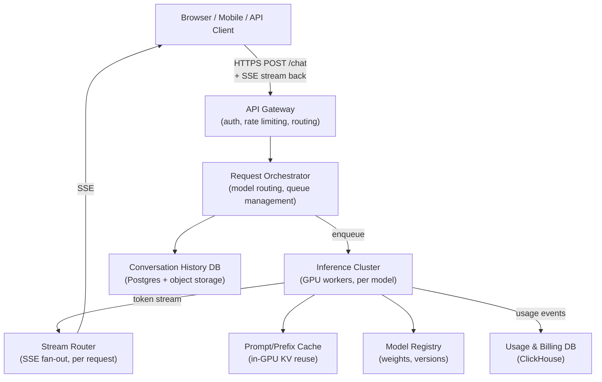
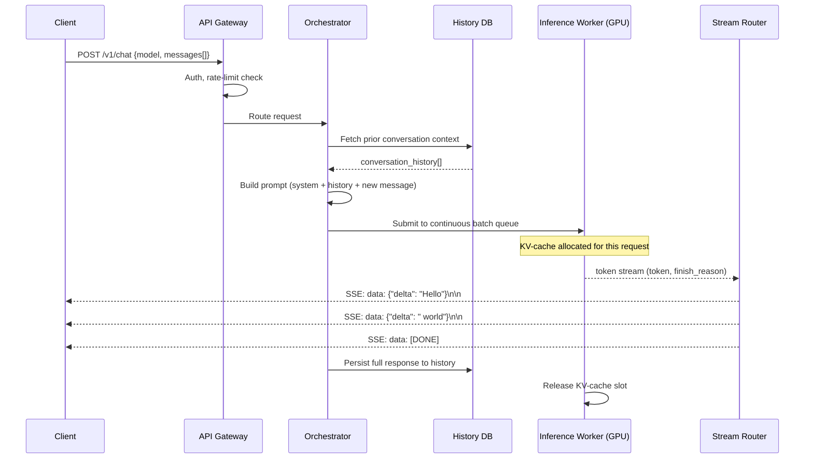

# System Design Walkthrough — ChatGPT / LLM Serving Platform

> Language-agnostic walkthrough following the 6-step framework from `00-system-design-framework.md`. This covers the architecture of a large-scale hosted LLM inference platform (think ChatGPT, Claude, or Gemini as a product).

---

## The Question

> "Design a system that serves a large language model (LLM) to millions of users simultaneously. Users send text prompts and receive streamed responses. The system must be fast, reliable, and cost-efficient."

---

## The Core Insight — Before You Draw Anything

LLM serving has two completely different performance profiles from everything you've designed before:

1. **Inference is stateful and sequential per token.** Unlike a REST API that returns one response, LLM generation is iterative — the model produces one token at a time, each depending on the previous. You can't parallelize a single user's response generation across workers.

2. **GPU memory is the bottleneck, not CPU or disk.** A single model can require 40–700 GB of GPU memory just to load its weights. You can't spin up arbitrary instances like web servers — the capacity planning is fundamentally hardware-constrained.

3. **Streaming is not optional.** At 20–60 tokens/second, a 500-token response takes 8–25 seconds if you wait for the full response. Users tolerate this only if they see tokens appearing in real time. The entire delivery stack must support streaming (SSE or WebSockets end-to-end).

These three constraints drive nearly every architectural decision.

---

## Step 1 — Clarify Requirements

### Functional Requirements

| # | Requirement |
|---|-------------|
| F1 | Users send a text prompt (conversation history + new message) |
| F2 | System returns a streamed text response, token by token |
| F3 | Multi-turn conversations maintain context (history) |
| F4 | Multiple models available (GPT-4o, GPT-4o-mini, etc.) |
| F5 | Users can attach files/images (multimodal input) |
| F6 | Conversation history is stored and retrievable |
| F7 | Usage is tracked per user/API key for billing |
| F8 | API access (OpenAI-compatible REST) and web/mobile clients |

**Out of scope:** fine-tuning, model training, RAG pipelines, plugins, voice mode.

### Non-Functional Requirements

| Attribute | Target |
|-----------|--------|
| DAU | 100M users |
| Concurrent streaming requests | 500K |
| Time-to-first-token (TTFT) | < 500ms p95 |
| Tokens per second per stream | ≥ 30 tok/s (perceived fluency) |
| Availability | 99.9% (some degradation acceptable at extreme load) |
| Conversation history durability | 99.999% |
| Context window | Up to 128K tokens |
| Model update cadence | Hot-swap without downtime |

### The Key Constraints

- **GPU scarcity:** A single A100 (80 GB) can hold ~1 copy of a 70B model. Serving 500K concurrent users requires thousands of GPUs.
- **Context window in GPU memory:** The KV-cache for active streaming requests lives in GPU VRAM. A 128K-token context at FP16 uses ~6 GB per request — this collapses parallel capacity fast.
- **Streaming latency dominates UX.** TTFT (first token) and throughput (tokens/s) are the two metrics users feel. Optimize for both independently.

---

## Step 2 — Back-of-the-Envelope Estimates

```
Traffic:
  100M DAU × 10 conversations/day × 4 turns/conversation = 4B requests/day
  4B / 86,400s ≈ 46K requests/s average, ~150K/s peak

Token volume:
  Average prompt: 500 tokens, average response: 600 tokens
  Total tokens/request: ~1,100
  150K req/s × 1,100 tokens = 165M tokens/s peak inference throughput

GPU capacity (A100 80GB, 70B model at FP16):
  KV-cache per active request (4K context): ~200 MB
  Batching 40 requests/GPU: 40 × 200 MB = 8 GB KV + 40 GB weights = fits in 80 GB
  Throughput: ~40 requests × 30 tok/s = 1,200 output tokens/s per GPU
  GPUs needed: 165M / 1,200 ≈ 137,500 A100s just for generation
  (Real systems also use tensor parallelism, speculative decoding, etc.)

Storage:
  Conversation history: 4B requests/day × 1,100 tokens × 4 bytes = 17.6 TB/day
  With compression (~5×): ~3.5 TB/day → manageable in object storage + DB

Streaming connections:
  500K concurrent SSE connections
  Each connection: ~4 KB/s (30 tok/s × ~16 bytes/token JSON)
  Total egress: 500K × 4 KB/s = 2 GB/s → manageable, not the bottleneck

Billing events:
  4B requests/day → 4B usage records → streaming to a billing pipeline
```

### Key Observations

1. **GPU is the only real constraint.** Everything else (bandwidth, storage, CPU) is secondary and solvable with standard techniques.
2. **Batching is the lever for efficiency.** Serving 1 request at a time on a GPU wastes 95% of throughput. Continuous batching (packing multiple requests into one forward pass) is the most important throughput optimization.
3. **KV-cache management determines capacity.** Long-context requests are disproportionately expensive in VRAM.

---

## Step 3 — High-Level Design



### Happy Path — Streaming Chat Request



---

## Step 4 — Deep Dives

### 4.1 Inference Worker Architecture (The GPU Tier)

This is the hardest and most novel part. A single GPU inference worker uses:

**Continuous Batching**
```
Traditional batching: wait for N requests, run one batch, wait, repeat.
  → Wastes GPU while waiting, causes head-of-line blocking.

Continuous batching (e.g., vLLM): 
  - A batch is always in-flight.
  - When a request finishes, a new one is immediately inserted into the freed slot.
  - GPU utilization stays near 100%.
  - This is the technique that makes production LLM serving feasible.
```

**PagedAttention / KV-Cache Management**
```
Problem: Each active request holds a contiguous KV-cache block in GPU VRAM.
  Fragmentation wastes memory (like malloc without an allocator).

Solution (vLLM's PagedAttention):
  - KV-cache divided into fixed-size "pages" (like OS virtual memory).
  - Pages assigned non-contiguously as the context grows.
  - On request completion, pages are immediately freed.
  - Result: 2-4× more concurrent requests per GPU vs naive approach.
```

**Tensor Parallelism (for very large models)**
```
For a 175B parameter model that won't fit on one GPU:
  - Each transformer layer is split across N GPUs (tensor parallelism).
  - Every token generation requires an AllReduce across N GPUs.
  - N=8 for most 70B+ models (8× A100 per model replica).
  - Adding more replicas = proportionally more throughput.
```

### 4.2 Request Orchestration & Model Routing

```
Routing logic:
  1. Parse requested model ("gpt-4o", "gpt-4o-mini")
  2. Find the inference cluster serving that model
  3. Route to the least-loaded worker in that cluster
     (based on: queue depth, current batch size, KV-cache free pages)

Queue management:
  - Each inference worker exposes a small async queue (depth ~100 requests)
  - Orchestrator monitors queue depths via gRPC health/metrics
  - If a worker's queue exceeds threshold, route to next available worker
  - Overflow: return 429 (rate limit) or queue in a distributed backpressure queue (Redis)

Graceful degradation:
  - Route expensive/long-context requests to larger capacity workers
  - Downgrade model tier if primary model capacity is saturated (with user consent)
  - Shed load with clear error messages rather than silently timing out
```

### 4.3 Streaming Delivery (SSE vs WebSocket)

```
Server-Sent Events (SSE) — preferred for LLM streaming:
  - Unidirectional (server → client): matches the token stream use case exactly
  - Built-in reconnection in browsers (EventSource API)
  - Works over standard HTTP/2 — no special infrastructure
  - Simpler than WebSocket: no handshake upgrade, no ping/pong

WebSockets:
  - Bidirectional: useful if the client needs to interrupt generation mid-stream
  - Higher overhead per connection
  - Harder to scale with standard HTTP load balancers

The Stream Router:
  - Maintains a mapping of {request_id → SSE connection}
  - GPU worker sends tokens to a pub/sub channel (Redis Streams or gRPC stream)
  - Stream Router subscribes and forwards to the correct client connection
  - Handles: client disconnect detection, mid-stream cancellation, reconnect resumption
```

### 4.4 Conversation History Storage

```
Hot path (within a session):
  - In-memory in the Orchestrator process (Redis-backed session cache)
  - Fetched on every turn to build the prompt

Cold path (cross-session, history page):
  - Full conversation stored in Postgres (metadata + message table)
  - Message content (long text) stored in object storage (S3/GCS)
  - Referenced by Postgres row via object_key

Retention:
  - Free users: 30-day sliding window
  - Paid users: unlimited
  - Deletion: soft-delete, purge after 30-day grace period

Schema (simplified):
  conversations(id, user_id, model, created_at, updated_at, title)
  messages(id, conversation_id, role, content_key, token_count, created_at)
```

### 4.5 Prompt / Prefix Caching

```
Observation: System prompts and the beginning of long conversations are identical
across many requests. Re-computing their KV-cache is waste.

Prefix caching:
  - Hash the prefix tokens (e.g., the system prompt)
  - If the KV-cache for this prefix exists in GPU memory, reuse it
  - Only compute KV for the new tokens appended after the prefix
  - Result: 30-60% reduction in TTFT for requests with long shared prefixes
  - Used heavily in: API usage (same system prompt per developer), RAG pipelines

Disk-based KV cache (for even longer contexts):
  - Evicted KV-cache pages written to NVMe SSD
  - On re-use, paged back into GPU memory
  - Slower than in-GPU cache but faster than re-computation for very long contexts
```

### 4.6 Cost Efficiency

```
Spot/preemptible instances:
  - Inference is stateless per-request — a preempted GPU just drops its in-flight batch
  - Requests are retried by the orchestrator transparently to the client
  - ~60-80% cost reduction vs on-demand GPUs

Model quantization:
  - INT8 / FP8 quantization: same output quality, ~2× reduction in VRAM usage
  - Allows 2× more concurrent requests per GPU
  - Trade-off: minor quality loss on some tasks (eval carefully)

Speculative decoding:
  - Small "draft" model proposes N tokens ahead
  - Large model verifies all N in one forward pass (parallel)
  - If accepted, N tokens generated for the cost of ~1.3 forward passes
  - Result: 2-3× throughput improvement for common, predictable text
```

---

## Step 5 — Handling Failures

| Failure | Impact | Mitigation |
|---------|--------|------------|
| GPU worker crash mid-stream | Client receives partial response | Orchestrator detects via heartbeat; client receives error event; client UI shows "response interrupted" |
| GPU OOM (KV-cache exhausted) | Request rejected | PagedAttention prevents; fallback is 503 with Retry-After header |
| Model weights corrupted | Serving broken | Model Registry stores checksums; workers verify on load; rollback to previous version |
| Orchestrator failure | No new requests routed | Orchestrators are stateless (session affinity via Redis); multiple instances behind LB |
| History DB unavailable | Context lost for new turns | Serve request with partial context (last N turns from cache); flag in response |
| Stream interrupted mid-response | Client sees cut response | Client reconnects to Stream Router with last-seen token index; stream resumes |

---

## Step 6 — Bottlenecks & Trade-offs

### The Core Trade-off: Latency vs. Throughput

```
More requests batched per GPU → better GPU utilization → lower cost per token
                              → but higher latency per request (each waits for batch)

Less batching → lower latency per request → but GPU underutilized → higher cost

Solution: Continuous batching with a latency SLO. If batch wait time would exceed
the TTFT target (500ms), dispatch immediately even with a small batch.
```

### Trade-off: Context Window vs. Capacity

```
Longer context → more KV-cache VRAM per request → fewer concurrent requests per GPU
GPT-4o with 128K context at FP16: ~6 GB KV-cache per active request
On one A100 (80 GB): 80 GB - 40 GB weights = 40 GB free → max 6 concurrent requests
vs.
4K context: ~200 MB KV → 200 concurrent requests per GPU

Implication: charge more for long-context requests (reflected in token pricing).
```

### What We Didn't Cover (Tell the Interviewer)

- **RAG (Retrieval-Augmented Generation):** Injecting retrieved documents into prompts — adds a vector DB lookup step before inference.
- **Fine-tuning serving:** Each fine-tuned model is a different set of adapter weights (LoRA) — can be hot-swapped without reloading base model.
- **Safety / content filtering:** Output moderation layer between GPU output and Stream Router.
- **Multi-modal inputs:** Image/file processing pipeline upstream of the inference worker.
- **Evaluation & shadow traffic:** New model versions receive shadow traffic (10%) before full rollout.

---

## API Design Snapshot

### Core endpoints
- `POST /v1/chat/completions` synchronous generation.
- `POST /v1/responses` unified response API with tools/multimodal options.
- `POST /v1/batches` async batch inference jobs.
- `GET /v1/models` model capability discovery.
- `POST /v1/files` upload context artifacts.

### Reliability and consistency
- Streaming responses support client resume via request IDs.
- Idempotency keys on expensive generation retries.
- Queue-based admission control for overload and fairness.

### Security and limits
- Per-tenant token and request budgets.
- Content safety policy checks and audit logging hooks.

---

## API Data Model and Contract (Ordered)

### 1) Domain resources and ownership
- `InferenceRequest`: canonical unit of generation with model/config metadata.
- `InferenceResult`: output payload and token usage accounting.
- `BatchJob`: asynchronous bulk inference orchestration.
- `ContextFile`: uploaded context artifact references.
- `SafetyDecision`: moderation/classification verdict attached to output.

### 2) Storage and indexing model
- Request metadata in OLTP; token usage and traces in analytics store.
- Indexes:
  - `idx_request_by_tenant(tenant_id, created_at desc)`
  - `idx_batch_by_tenant(tenant_id, state, created_at)`
  - `idx_result_by_request(request_id)`
- Admission queue controls GPU worker saturation.

### 3) Endpoint matrix (comprehensive)
- `POST /v1/responses` synchronous or streaming generation.
- `POST /v1/chat/completions` compatibility endpoint.
- `POST /v1/batches` async batch job submission.
- `GET /v1/batches/{job_id}` batch state.
- `POST /v1/files` upload context file.
- `GET /v1/models` model capabilities and limits.
- `POST /v1/moderations` pre/post content safety checks.
- `GET /v1/usage?cursor=...` token consumption audit.

### 4) Contract examples
Write contract: `POST /v1/responses`
```json
{
  "client_request_id": "cr_55",
  "model": "gpt-4.1",
  "input": "summarize this design doc",
  "temperature": 0.2,
  "stream": false
}
```
```json
{
  "request_id": "req_700",
  "state": "completed",
  "output_text": "...",
  "usage": {"input_tokens": 120, "output_tokens": 210}
}
```
Read contract: `GET /v1/batches/{job_id}`
```json
{
  "job_id": "bj_90",
  "state": "running",
  "progress": {"completed": 1200, "total": 5000}
}
```

### 5) Idempotency, concurrency, and consistency
- Request dedupe key: `(tenant_id, client_request_id)`.
- Streaming resume supported via `request_id` checkpoints.
- Usage accounting committed exactly once per accepted request.

### 6) Error taxonomy
- `429_CAPACITY_THROTTLED`
- `422_CONTEXT_TOO_LARGE`
- `403_MODEL_NOT_ALLOWED`

### 7) Security, quotas, and observability
- Tenant isolation for prompts, outputs, and files.
- Token/rate budgets per org and per model tier.
- Metrics: `time_to_first_token_ms`, `tokens_per_sec`, `moderation_block_rate`, `gpu_queue_wait_ms`.

### 8) Webhook and event contracts (where applicable)
- Async lifecycle callbacks:
  - `response.completed`
  - `response.failed`
  - `batch.completed`
- Delivery contract:
  - Headers: `X-Event-Id`, `X-Event-Type`, `X-Signature`
  - Body fields: `request_id`, `job_id`, `state`, `usage`, `error`, `event_ts`
- Reliability rules:
  - At-least-once delivery with retry backoff.
  - Receiver dedupe by `event_id`.
  - For streamed responses, final webhook must contain terminal state only.

Example `response.completed` payload:
```json
{
  "event_id": "evt_llm_101",
  "event_type": "response.completed",
  "request_id": "req_700",
  "state": "completed",
  "usage": {"input_tokens": 120, "output_tokens": 210},
  "event_ts": "2026-05-13T20:15:00Z"
}
```
