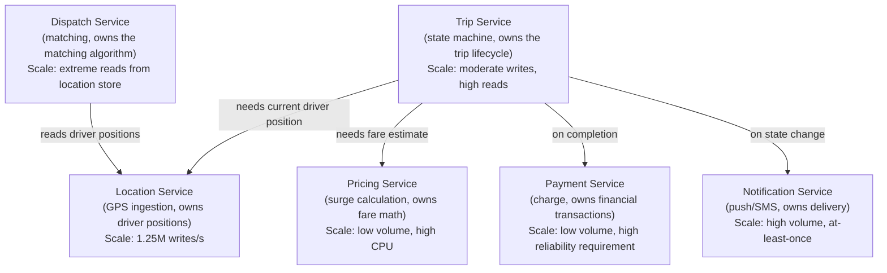
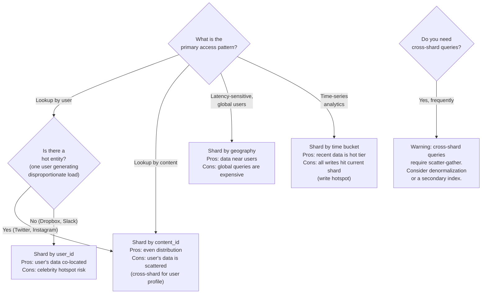
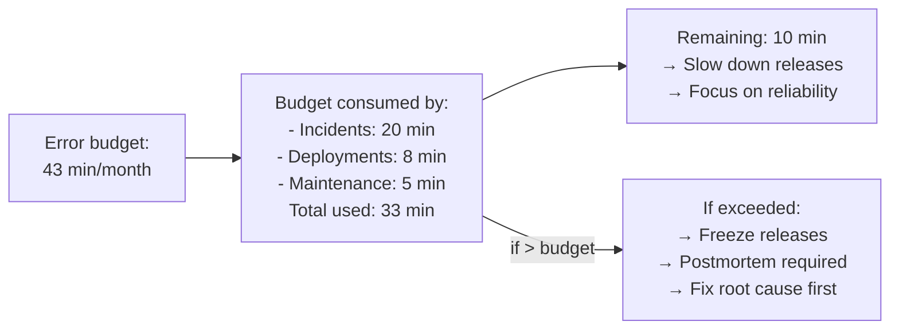
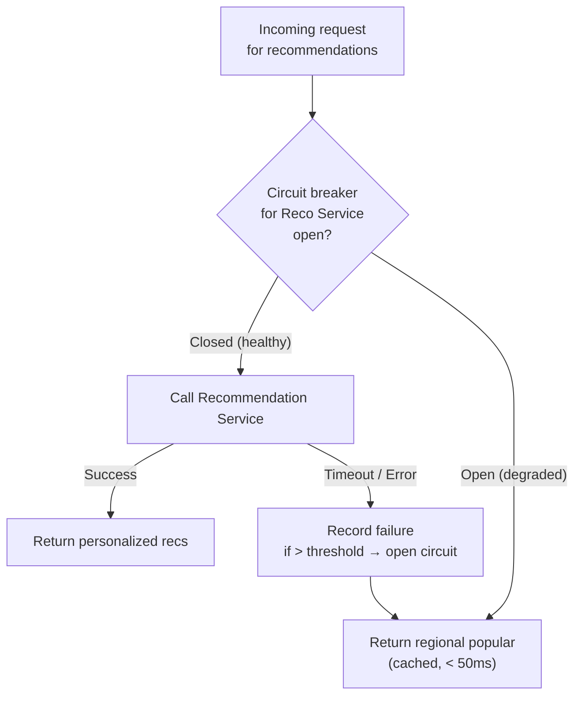

# Staff Engineer System Design — What the Framework Doesn't Cover

> This document covers the gaps between Senior and Staff level system design. A senior engineer designs a system that works. A staff engineer designs a system that works, evolves gracefully, costs the right amount, can be operated at 3am, and maps cleanly to how teams are organized.

---

## The Senior vs. Staff Distinction

Senior engineers are evaluated on: can you design a system that satisfies the requirements correctly?

Staff engineers are evaluated on five additional dimensions:

```
1. Cross-system thinking   — how does this service fit into the broader architecture?
2. Evolutionary design     — how does this system grow from v1 to v10?
3. Operational readiness   — how do you run this in production?
4. Cost as a constraint    — how do you design to a budget?
5. Conway's Law            — how does system structure map to team structure?
```

Each of these gets its own section below with a real-world example.

---

## Part 1 — Cross-System Design: Service Boundaries and API Contracts

### What interviewers are actually testing

A senior engineer designs one service well. A staff engineer defines where one service ends and another begins — and what the contract between them looks like. Getting service boundaries wrong creates the most expensive technical debt in software: distributed monoliths that combine the operational complexity of microservices with the coupling of a monolith.

### The Three Questions for Every Service Boundary

Before splitting functionality into separate services, answer:

```
1. Do they scale differently?
   → If Service A needs 100 replicas and Service B needs 3, they should be separate.

2. Do they fail independently?
   → If A going down should NOT take B down, they must be separate.

3. Do different teams own them?
   → If yes, they should probably be separate (Conway's Law — see Part 5).
```

If the answer to all three is "no," you're probably over-splitting. A distributed monolith is worse than a monolith.

### Real Example: Uber's Service Decomposition

When Uber started (2009), it was a Rails monolith. By 2016, they had 2,000+ microservices and a "distributed monolith" problem — services were technically separate but so tightly coupled that deploying one required deploying ten.

The correct decomposition they eventually settled on:



**Why these boundaries?**

| Boundary | Reason |
|----------|--------|
| Location separate from Dispatch | Location writes at 1.25M/s; Dispatch reads at 250K/s. Different scale profiles. Different failure modes (Location can be down without stopping existing trips). |
| Payment separate from Trip | Payment needs strong consistency and financial audit trail. Trip can tolerate eventual consistency. Different reliability requirements. |
| Notification separate from everything | Notification failures should never affect trip state. Fan-out is async. Completely different infrastructure (APNs, FCM, Twilio). |
| Pricing separate from Trip | Pricing is CPU-bound (ML models). Trip is I/O-bound. Separate scaling. Pricing can be updated (new surge algorithm) without redeploying Trip. |

### The API Contract Pattern

Every service boundary needs an explicit contract. Staff engineers define this before implementation, not after.

**Synchronous contract (REST/gRPC):**

```
GET /location/v1/drivers/nearby
  Input:  { lat, lng, radius_km, limit }
  Output: { drivers: [{ driver_id, lat, lng, distance_m, last_seen_at }] }
  SLA:    p99 < 50ms
  Errors: 429 (rate limited), 503 (service unavailable)
  Versioning: v1 is stable; breaking changes require v2
```

**Asynchronous contract (Kafka event):**

```
Topic: trip.state_changed
Schema:
  {
    trip_id:     string (UUID)
    from_state:  enum (REQUESTED, ACCEPTED, EN_ROUTE, ...)
    to_state:    enum
    occurred_at: ISO8601 timestamp
    metadata:    { driver_id, rider_id, pickup_lat, pickup_lng }
  }
Guarantees: at-least-once delivery
Consumers:  Notification Service, Payment Service, Analytics
Retention:  7 days
```

**Why this matters at staff level:** Defining the contract first means the consuming team can build against a mock before the producing team ships. It makes the system decomposable. Without explicit contracts, you get "implicit coupling" — service A calls service B's internal data model directly, and now they can never be deployed independently.

### Interviewer Question

**"Uber's Trip Service calls the Pricing Service synchronously to calculate the fare at trip end. The Pricing Service is down. What happens to the trip?"**

> Bad answer: "The trip fails." This couples trip completion to pricing availability.
>
> Staff answer: Trip completion and fare calculation are decoupled. On trip end, the Trip Service sets the trip state to `COMPLETED` and publishes a `trip.completed` event. The Pricing Service consumes this event asynchronously, calculates the fare, and publishes a `trip.fare_calculated` event. The Payment Service consumes that and charges the rider. If Pricing is down for 10 minutes, trips still complete — fares are calculated when Pricing recovers. The rider sees "Calculating fare..." in the app. This is the real Uber model. Synchronous fare calculation at trip end is a design smell — it creates an availability dependency between two systems that don't need to be coupled.

---

## Part 2 — Evolutionary Design: v1 → v10

### What interviewers are actually testing

Staff engineers inherit systems. They also make decisions today that their team will live with for years. A common staff-level interview question is: "Walk me through how you'd evolve this design as the company grows from 10K to 10M to 100M users." This tests whether you understand that every design choice has a future cost.

### The Evolutionary Design Framework

```
Phase 1 (0 → 10K users):    Correctness over performance. Ship it.
Phase 2 (10K → 1M users):   Identify and fix the first bottleneck only.
Phase 3 (1M → 10M users):   Horizontal scaling. Read/write separation.
Phase 4 (10M → 100M users): Sharding. Async everywhere. CDN.
Phase 5 (100M+ users):      Custom infrastructure. Multi-region.
```

The mistake most senior engineers make: they design for Phase 4 on day one. This is over-engineering. It adds complexity that kills the team's velocity before there's any scale to justify it. The staff engineer's skill is knowing which decisions are **expensive to change later** (choose carefully) vs. which are **cheap to change later** (choose the simplest thing now).

### Expensive-to-change decisions (get right early):
- **Primary key / shard key choice** — resharding a 10TB database is painful
- **Event schema** — once consumers depend on a Kafka schema, changing it breaks them
- **API versioning strategy** — not versioning your API from day one creates migration nightmares
- **Consistency model per entity** — switching from eventual to strong consistency requires a rewrite

### Cheap-to-change decisions (start simple):
- **Number of database replicas** — add more anytime
- **Cache layer** — add Redis in front of your DB at any point
- **Service decomposition** — extract a service when the seam becomes clear

### Real Example: Instagram's Database Evolution

```
Phase 1 (2010, launch):
  Single PostgreSQL instance on EC2.
  Everything in one DB.
  Works fine at 25K users.

Phase 2 (2011, 1M users):
  First bottleneck: read traffic overwhelming single Postgres instance.
  Fix: Add read replicas. Point all SELECT queries to replicas.
  Don't touch write path. Don't shard. Just add replicas.
  Result: 10× read capacity. Buys 6 months.

Phase 3 (2012, 10M users):
  New bottleneck: write throughput and storage size.
  Fix: Vertical scaling (bigger instance) + introduce Redis for hot data.
  Instagram cached the "last 300 photos" for each user in Redis.
  This eliminated 90% of DB reads. Write path still single primary.

Phase 4 (2013, 100M users):
  New bottleneck: write path, single primary can't absorb all writes.
  Fix: Shard by user_id. Each shard is a Postgres cluster (primary + replicas).
  Shard key chosen carefully: user_id ensures a user's photos are co-located.
  Cross-shard queries (rare) handled by the application layer.

Phase 5 (2016, 500M users, acquired by Facebook):
  Move to Facebook's infrastructure (TAO for social graph, Haystack for photos).
  Custom storage because off-the-shelf solutions hit limits.
```

**The lesson:** Instagram didn't shard on day one. They added exactly one layer of complexity per bottleneck, and only when they hit the bottleneck. Each phase bought 6-18 months before the next phase was needed.

### The "Expensive to Change" Decision: Shard Key Selection

This deserves its own deep dive because it's the most common staff-level design question.



**Real example — Twitter's shard key mistake and fix:**

Twitter originally sharded tweets by `user_id`. This meant reading a home timeline required fetching from N shards (one per followed user). At 300M DAU × 700 follows average = 210B shard lookups per day. They switched to a fan-out model (pre-computing timelines) specifically to avoid cross-shard queries at read time. **The shard key drove the entire timeline architecture.**

### Interviewer Question

**"You designed Instagram's photo storage. It's 2011, you have 1M users, and I'm telling you the read replica you added isn't enough anymore. What's your next move — and what are you explicitly NOT doing yet?"**

> The next move is adding Redis as a cache layer in front of the database, not sharding. Here's why: 90% of reads on Instagram are for recent photos — the last 20 posts from people you follow. These are highly cacheable. A Redis sorted set per user (`feed:{user_id}`) holding the last 300 photo IDs eliminates most DB reads without any schema changes, any shard key decisions, or any application-layer scatter-gather logic.
>
> What I'm explicitly NOT doing: sharding. Sharding at 1M users is premature. The shard key decision will be driven by access patterns that aren't clear yet at this scale. If I shard by user_id now and later discover that the hot path is actually content lookup (for Explore), I've chosen the wrong shard key and resharding is a 6-month project. I'll delay that decision until the write path is clearly the bottleneck, which won't happen until we're at 10M+ users. The Redis cache buys at least 12 months before I have to make the shard key decision.

---

## Part 3 — Operational Readiness: Designing for 3am

### What interviewers are actually testing

A system that works in the demo is not a system that works in production. Staff engineers own systems through incidents. They design systems with failure in mind — not just "what happens when this breaks" but "how does the on-call engineer know it broke, how do they diagnose it, and how do they fix it without waking up three other teams?"

This is the dimension most often missing from senior engineers moving to staff. They can design the system but they haven't thought about who's going to operate it.

### The Four Pillars of Operational Readiness

```
1. SLOs and SLIs   — what does "working correctly" mean, precisely?
2. Observability   — can you tell the difference between "slow" and "broken"?
3. Degradation     — can the system shed load gracefully instead of collapsing?
4. Runbooks        — can the on-call fix it without the designer?
```

### Pillar 1: SLOs and SLIs

**SLI (Service Level Indicator):** A metric that measures one aspect of a service's behavior.
**SLO (Service Level Objective):** A target for that metric.
**SLA (Service Level Agreement):** An SLO with a contractual consequence for missing it.

The mistake: defining SLOs in terms of availability ("99.9% uptime"). Availability is almost unmeasurable in real systems. Define SLOs in terms of user-visible behavior.

**Real example — Google's SLO framework applied to a ride-hailing app:**

```
Service: Trip Request API

SLI 1 (Latency):
  Metric: p99 latency of POST /trips/request
  SLO:    p99 < 2s, measured over 30-day rolling window

SLI 2 (Error rate):
  Metric: % of requests returning 5xx
  SLO:    < 0.1% errors, measured over 1-hour window

SLI 3 (Correctness):
  Metric: % of trips that reach COMPLETED state within 3 hours of ACCEPTED
  SLO:    > 99.5%

SLI 4 (Freshness — for driver location):
  Metric: % of location reads returning data < 10s old
  SLO:    > 99%
```

**Error budgets:** If your SLO is 99.9% availability over 30 days, your error budget is 0.1% × 30 days × 24 hours × 60 min = 43 minutes of downtime per month. When you spend your error budget, you stop shipping new features and focus on reliability. This is Google's SRE model and it's a concrete tool for staff engineers.



### Pillar 2: Observability — The Three Signals

**The three signals every service must emit:**

```
Metrics  → Aggregated numbers over time (QPS, latency p50/p99, error rate)
Logs     → Structured records of individual events (per-request, per-error)
Traces   → End-to-end request paths across multiple services
```

**Real example — diagnosing a latency spike in Stripe's payment pipeline:**

A payment is slow. Without observability, you're guessing. With it, you trace the request:

```
Trace: charge_id=ch_abc123, total=2,847ms

Span 1: API Gateway validate JWT           12ms  ✓
Span 2: Fraud Service score_transaction   234ms  ✓  (expected ~200ms)
Span 3: Idempotency check (Redis)           2ms  ✓
Span 4: Card network authorization      2,598ms  ✗  (expected < 500ms)
Span 5: DB write (Postgres)                 1ms  ✓
```

The trace immediately shows: the card network is slow. Not your system. You can tell the on-call: "Visa is having issues, here are the affected charge_ids, here's the customer impact, here's when it started." Without the trace, you'd spend 45 minutes blaming your own infrastructure.

**What to instrument on every service:**

```
Every inbound request:
  - request_id (for correlation)
  - method, path, status_code
  - duration_ms
  - upstream_service (for traces)

Every DB/cache call:
  - query type (SELECT, INSERT, UPDATE)
  - table/key
  - duration_ms
  - rows_affected

Every external API call:
  - provider (Stripe, Twilio, etc.)
  - endpoint
  - status_code
  - duration_ms

Every error:
  - error_type (not just "500")
  - stack trace
  - request_id
  - user_id (for privacy-respecting investigation)
```

### Pillar 3: Graceful Degradation

A system that fails completely under load is worse than a system that degrades gracefully. Staff engineers design degradation tiers explicitly.

**Real example — Netflix's degradation tiers:**

Netflix uses a "chaos engineering" approach where every feature has an explicit fallback:

```
Feature: Personalized recommendations on homepage

Tier 1 (nominal): ML-personalized, real-time signals, A/B tested variants
  → Latency: < 100ms (pre-computed, served from Redis)

Tier 2 (recommendation service degraded): Generic popular titles for user's region
  → Fallback trigger: recommendation service p99 > 500ms
  → Latency: < 50ms (served from a static regional cache)

Tier 3 (all caches down): Global top-10 titles, hardcoded
  → Fallback trigger: Redis cluster unavailable
  → Latency: < 10ms (in-memory, loaded at startup)

Tier 4 (complete failure): Show nothing, let user browse manually
  → Fallback trigger: all above fail
  → User impact: homepage shows empty shelf
```

**The pattern — circuit breaker with fallback:**



**Real example — Twitter's timeline during an outage:**

When Twitter's timeline service is degraded, the app doesn't show a blank screen. It shows a cached version of your timeline from the last successful fetch (stored in the client). You see tweets that are 5 minutes old instead of real-time. The degradation is invisible to most users.

### Pillar 4: Runbooks

A runbook is a document that tells an on-call engineer how to respond to a specific alert. Staff engineers write these as part of system design, not as an afterthought.

**Template for every alert:**

```
Alert: HighPaymentLatency
Severity: P1
Trigger: Payment API p99 latency > 3s for 5 minutes

Diagnosis steps:
  1. Check trace dashboard — which span is slow?
     → Card network slow: escalate to card_network_oncall, not our issue
     → DB slow: check Postgres dashboard → pg_stat_activity for long-running queries
     → Redis slow: check Redis metrics → check for large key operations

  2. If card network: notify customer success, update status page, wait.

  3. If DB: check for table locks
     → Run: SELECT * FROM pg_locks WHERE granted = false;
     → If locks found: identify blocking query, kill if safe

  4. If nothing obvious: check recent deployments in last 2 hours
     → If yes: consider rollback (use deployment runbook)

Escalate to:
  - payment-oncall if > 15 min
  - eng-lead if > 30 min or customer impact > 1000 transactions

Resolution verification:
  - p99 latency returns below 500ms for 10 minutes
  - Error rate below 0.1%
  - Update incident channel with root cause
```

**The staff engineer question to ask yourself:** "If I get paged at 3am and I'm half-asleep, can I fix this using only the runbook and the dashboards?" If the answer is no, the system is not operationally ready.

### Interviewer Question

**"You designed a payment processing system. It's been running for 6 months. One morning, the on-call gets paged: 'Payment success rate dropped from 99.9% to 97%.' They've never seen this before. Walk me through what you built to help them diagnose and resolve this."**

> I'd walk through the four layers. First, the alert itself: it fires when `(successful_charges / total_charges) < 0.999` over a 5-minute window. The alert includes a link to the pre-built dashboard and a link to the runbook.
>
> Second, the dashboard: it shows the error rate broken down by error type (card network timeout, fraud block, invalid card, our 5xx errors) and by card network (Visa, Mastercard, Amex). The on-call can immediately see: is this our fault or Visa's fault?
>
> Third, the traces: every failed charge has a trace. The on-call can click any failed charge and see exactly which service and which external call failed. If it's card network timeouts from Visa, the trace shows `card_network_authorization: TIMEOUT, provider: VISA`.
>
> Fourth, the runbook: "If card_network error rate > 2% for Visa: (1) Check Visa's status page. (2) If Visa incident confirmed, update our status page. (3) Notify customer success team. (4) No action needed on our end — wait for Visa to recover." The on-call resolves this in 5 minutes without waking anyone up.
>
> The key design decision: the alert is on payment success rate, not on our service availability. We could have 100% uptime but 3% of payments failing because Visa is down — that's the user-visible problem we actually care about. SLIs measuring user-visible outcomes, not infrastructure health.

---

---

## Part 4 — Cost as a First-Class Constraint

### What interviewers are actually testing

At staff level, you're expected to know that engineering decisions have financial consequences. A design that costs $5M/month when the product generates $8M/month in revenue is not a good design — regardless of how elegant the architecture is. Interviewers will ask about cost directly, or they'll describe a scenario where the numbers make cost the obvious constraint.

The tell: "your design costs $2M/month in object storage alone" is a failure signal if you never mentioned cost. A staff engineer proactively sizes infrastructure costs and flags when they're significant relative to business value.

### The Cost Model Framework

For any major storage or compute component, do a quick cost sanity check:

```
Storage cost estimate:
  object_storage_TB × $20/TB/month (S3 standard)
  hot_cache_GB × $0.20/GB/month (Redis)
  cold_storage_TB × $4/TB/month (S3 Glacier)

Compute cost estimate:
  requests/s × cost_per_million_requests
  GPU instance for ML: $3–$15/hour depending on GPU type
  Kafka: $0.10/GB ingress + $0.05/GB storage/month

Network cost:
  egress_GB/month × $0.09/GB (AWS, after first 10TB free)
  → Often the surprise cost in high-read systems
```

### Real Example: Instagram Feed Storage Cost Optimization

The before state: 400TB of Memcached storing full feed objects (post metadata × user × feed position). At $0.20/GB/month for in-memory cache: **$80M/month just for the feed cache**.

The after state (from the Instagram STAR story in file 47): Redis sorted sets storing only post_ids (8 bytes each, 300 per user). 500M users × 5KB = 2.5TB.

```
Before: 400 TB × $0.20/GB × 1000 = $80M/month
After:  2.5 TB × $0.20/GB × 1000 = $500K/month
Saving: $79.5M/month
```

The architectural decision (store post_ids not full objects) was driven by a cost calculation, not just elegance. At staff level, you need to be able to make this calculation and state it as a design input, not discover it after the system is built.

### The Three Cost Trade-offs That Come Up Most

**1. Compute vs. Storage (pre-compute vs. compute on read)**

Pre-computing results (fan-out on write, materialized views) trades storage cost for compute cost. Computing on read trades compute latency for lower storage. The decision is almost always: compute when the result is requested by many users; pre-compute when the same result is requested repeatedly.

```
Twitter timeline fan-out:
  Option A (pre-compute): 300M users × 800 post_ids × 8 bytes = 1.9 TB Redis
                          Cost: $380K/month
  Option B (compute on read): 70K reads/s × fan-in from 700 follows each
                          = 49M Cassandra reads/s → cluster cost >> $380K/month
  Decision: pre-compute wins on cost AND latency
```

**2. Hot vs. Cold Storage Tiering**

Hot storage (SSD, in-memory cache) costs 10–100× more than cold storage (HDD, object storage). The pattern: keep recently accessed data hot, move aged data cold.

```
Slack message storage cost:
  Hot (Cassandra SSD, 30 days):  750 GB × $0.10/GB = $75K/month
  Cold (S3, 30 days–2 years):    40 TB × $0.02/GB = $820K/month
  Glacier (2+ years):            900 TB × $0.004/GB = $3.6M/month

  vs. keeping everything in Cassandra:
    1,690 TB × $0.10/GB = $169M/month

  Tiering saves ~$165M/month
```

**3. Reserved vs. On-Demand Compute**

For steady-state workloads (your API servers run at consistent load), reserved instances are 40–60% cheaper than on-demand. For bursty workloads (batch jobs, ML training), use spot instances (70–90% cheaper, but interruptible).

```
Transcoding workers (YouTube-style):
  On-demand EC2 (c5.4xlarge): $0.68/hour
  Spot EC2:                   $0.20/hour (70% savings)

  Transcoding is idempotent (can restart from raw file on interruption)
  → Always use spot for transcoding
  → Save 70% on the highest-cost compute in the pipeline
```

### Stating Cost in an Interview

You don't need to be exact. You need to be in the right order of magnitude and to flag when cost is a significant design constraint.

```
Good: "Storing 400TB in Redis would cost roughly $80M/month —
       that's not viable. The storage cost forces us toward a
       data model that stores only IDs, not full objects."

Good: "GPU inference at this scale would cost around $15/1000 queries.
       At 10M queries/day, that's $150K/day or $4.5M/month.
       That number means we need batching and caching aggressively —
       we can't afford per-request inference."

Bad:  [Never mentioning cost at all]
Bad:  "It'll be expensive but that's okay"
```

---

## Part 5 — Conway's Law and Team Design

### What interviewers are actually testing

Conway's Law: "Any organization that designs a system will produce a design
whose structure is a copy of the organization's communication structure."

Staff engineers understand that the reverse is also true — if you design a
system with the wrong service boundaries, you'll need to restructure your
team to match, or the team structure will fight the system constantly.

At staff level, interviewers will sometimes ask explicitly: "How would you
organize teams around this architecture?" More often, they're implicitly
evaluating whether your service boundaries would allow independent team
ownership without constant cross-team coordination.

### The Test for Good Service Boundaries

A service boundary is good if the team owning it can:
1. Deploy independently (no coordinating with 3 other teams)
2. Make most decisions independently (no approval chains through other teams)
3. Define their own SLOs independently
4. Own their on-call rotation independently

A service boundary is bad if:
- Every deployment requires coordinating with 2+ other teams
- The team can't make schema changes without approval from another team
- An on-call page for Service A always requires waking someone from Service B

### Real Example: Nordstrom Content Platform Team

The old architecture (legacy CMS tightly coupled to frontend):

```
Team structure forced by architecture:
  Content Platform team → makes CMS change → must coordinate with
  Frontend team → must coordinate with
  Search team → must coordinate with
  Campaign team

Every content schema change required 4-team coordination.
Deploy frequency: once per sprint (bi-weekly), bottlenecked by coordination.
```

The new architecture (Sanity + Content API):

```
Team structure enabled by architecture:
  Content Platform team → owns Sanity schema + Content API
    → deploys independently
    → defines their own SLOs (content propagation latency)
    → on-call owns their own runbooks

  Frontend team → consumes Content API
    → doesn't need to know Sanity internals
    → deploys independently

  Search team → indexes content from Kafka events
    → consumes events, doesn't own content production
    → deploys independently
```

The architectural decision (headless CMS with explicit API contract) directly
enabled three independent teams where before there was one coupled team.

### The Inverse Conway Maneuver

When you're designing a new system, you can use Conway's Law intentionally:
define the service boundaries you want first, then staff teams to match.
This is the "Inverse Conway Maneuver" — design the org structure by
designing the architecture.

```
Wrong order: Hire a big platform team → they build a platform → 
             teams form around the platform's shape (which may be wrong)

Right order: Decide what teams you want to exist → 
             Design service boundaries that enable those teams →
             Hire to fill those teams
```

**Real example — how to answer the interview question:**

"How would you staff teams for the e-commerce platform you just designed?"

> I'd organize around the service boundaries I drew. The Catalog and Search
> team owns the product data model and search relevance — they care about
> how products are indexed and discovered. The Commerce team owns pricing,
> promotions, cart, and checkout — they care about the purchase funnel.
> The Order Fulfillment team owns the order state machine and warehouse
> integration — they care about what happens after checkout. The Content
> Platform team owns the CMS and content delivery — they care about editorial
> experience.
>
> Each team deploys independently. The contracts between them are API specs
> and Kafka event schemas. A pricing change doesn't require the catalog team
> to be involved. A content publish doesn't require the order team to be
> involved.
>
> The signal that the boundaries are wrong: if a change to promotions
> (Commerce team) requires coordinating with the Content team every time.
> That coupling means the boundary between those two services is in the
> wrong place, and I'd revisit whether promotions content lives in Sanity
> or in the promotions service.
