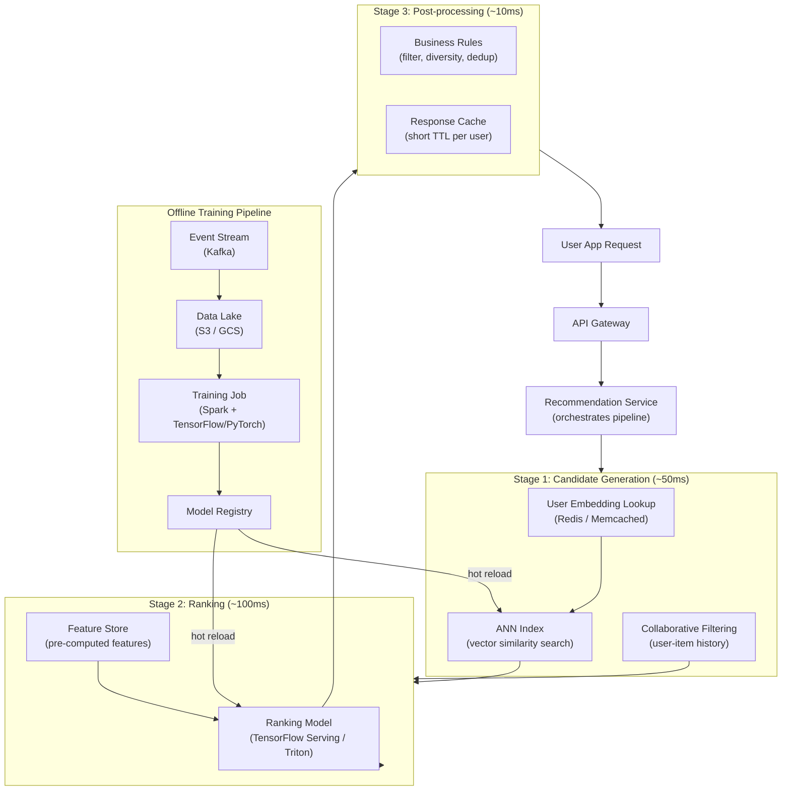
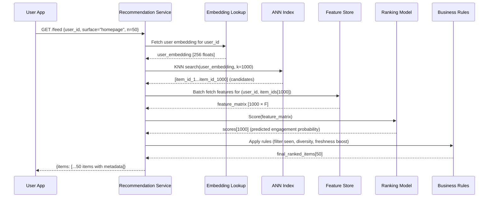

# System Design Walkthrough — AI Recommendation Engine

> Language-agnostic walkthrough following the 6-step framework from `00-system-design-framework.md`. This covers the architecture of a large-scale ML-powered recommendation system (think YouTube homepage, TikTok feed, Spotify Discover Weekly, or Amazon's "Customers also bought").

---

## The Question

> "Design a recommendation system that serves personalized content to 500 million users in real time. The system should continuously learn from user behavior and surface relevant items within milliseconds."

---

## The Core Insight — Before You Draw Anything

Recommendation is not a single system. It's a **pipeline with three distinct phases**, each with completely different requirements:

1. **Candidate generation** — out of tens of millions of items, find the ~1,000 that are plausibly relevant to this user. This must be fast (< 50ms) even at massive scale. Approximate nearest-neighbor search on embeddings is the key technique.

2. **Ranking** — take the ~1,000 candidates and score them with a heavyweight ML model that uses rich user/item features. This is where most of the personalization signal lives. Latency budget here is ~100ms.

3. **Business logic filtering & diversity** — apply rules (filter mature content, enforce freshness, deduplicate, ensure topic diversity). This is deterministic, cheap, and fast.

The entire serving pipeline must complete in < 200ms. The training pipeline runs offline (minutes to hours) and feeds updated model weights into the serving layer.

---

## Step 1 — Clarify Requirements

### Functional Requirements

| # | Requirement |
|---|-------------|
| F1 | Homepage feed: serve N ranked recommendations per user on page load |
| F2 | "More like this": given an item, return similar items |
| F3 | Recommendations update within 24 hours of new user behavior |
| F4 | New items (no engagement history) can still be recommended (cold start) |
| F5 | Users can mark recommendations as "not interested" (negative feedback) |
| F6 | Multiple recommendation surfaces: homepage, sidebar, email digest |

**Out of scope:** search (different problem), ads ranking (separate auction system), A/B testing infrastructure (assumed to exist).

### Non-Functional Requirements

| Attribute | Target |
|-----------|--------|
| Users | 500M total, 50M DAU |
| Items (catalog) | 100M videos / products / songs |
| Recommendation latency | < 200ms p95 end-to-end |
| Feed freshness | New behavior reflected within 24h |
| Throughput | 500K recommendation requests/s at peak |
| Model update cadence | Full retrain daily; incremental update every hour |
| Availability | 99.99% (stale recommendations acceptable over downtime) |

---

## Step 2 — Back-of-the-Envelope Estimates

```
Request traffic:
  50M DAU × 20 feed loads/day = 1B requests/day
  1B / 86,400s ≈ 11,600/s average → ~50,000/s peak (evening hours)

Event stream (user behavior):
  50M DAU × 100 events/day (clicks, watches, skips, likes) = 5B events/day
  5B / 86,400s ≈ 58,000 events/s → Kafka can handle this easily

User embeddings:
  500M users × 256-dim float32 embedding = 500M × 1 KB = 500 GB
  Must fit in fast in-memory store (distributed, sharded)

Item embeddings:
  100M items × 256-dim float32 = 100M × 1 KB = 100 GB
  Indexed in an ANN vector index (FAISS/ScaNN/Weaviate)

Training data:
  5B events/day × 200 bytes = 1 TB/day → stored in a data lake (S3/GCS)
  30 days rolling window = 30 TB for training

Model size:
  Candidate retrieval model (two-tower): ~500 MB
  Ranking model (deep neural net with sparse features): ~2-10 GB
```

---

## Step 3 — High-Level Design

### The Three-Stage Serving Pipeline



### Happy Path — Serving a Homepage Feed



---

## Step 4 — Deep Dives

### 4.1 Candidate Generation — The Two-Tower Model

```
The two-tower (dual encoder) architecture:
  - User tower: encodes user history + context → 256-dim user embedding
  - Item tower: encodes item content + metadata → 256-dim item embedding
  - Relevance score = dot product(user_emb, item_emb)
  - Trained with contrastive loss: push positive (engaged) pairs together,
    negative (skipped) pairs apart

Why this works for candidate generation:
  - Item embeddings are pre-computed offline for all 100M items
  - At serving time: fetch user embedding → one ANN query → 1000 candidates
  - Total: ~20-50ms regardless of catalog size

Item embedding update:
  - New items have no engagement history → use content-based embedding
    (text/image encoder on item title, description, thumbnail)
  - Blend in collaborative signal as engagement data accumulates
  - This solves the cold-start problem for new items

ANN Index (Approximate Nearest Neighbor):
  - Cannot do exact KNN over 100M 256-dim vectors (too slow)
  - Use HNSW (Hierarchical Navigable Small World) or ScaNN
  - Recall@100: ~95% (acceptable — exact recall not needed for candidates)
  - Index fits in ~100 GB RAM across sharded nodes
  - Index rebuild: incremental, every few hours as embeddings are updated
```

### 4.2 Ranking Model — Deep Neural Net

```
Input features for ranker:
  User features (from Feature Store):
    - watch_history_embedding (average of last 100 watched items)
    - user_demographics (age bucket, region)
    - recent_interests (categories of last 24h activity)
    - device, time_of_day, day_of_week

  Item features (from Feature Store):
    - item_embedding (from item tower)
    - global engagement stats (ctr_7d, watch_completion_rate)
    - item age, category, creator_id
    - content embedding (from text/image encoder)

  Cross features (interaction):
    - user_category_affinity × item_category (dot product)
    - user_watch_time_avg × item_duration_bucket

Model architecture:
  - Wide & Deep: "wide" (memorize popular patterns via sparse features) +
    "deep" (generalize via dense embeddings)
  - Or: Transformer-based ranking with attention over user history
  - Output: P(engagement) — click probability, watch probability, like probability
  - Multi-task: optimize for multiple targets simultaneously
    (click, watch, like, share — weighted by business value)

Serving:
  - TensorFlow Serving or NVIDIA Triton Inference Server
  - Batch inference: send all 1000 candidates in one request, return 1000 scores
  - Latency: 50-100ms for a 1000-item batch on GPU
  - Caching: pre-compute scores for top users + top items (hot path)
```

### 4.3 Feature Store

```
Problem: features used in training must be the same features available at serving.
If training uses yesterday's engagement stats but serving fetches live stats,
the model sees a distribution shift (training-serving skew) → degraded quality.

Feature Store design:
  Two tiers:
  1. Online store (low latency, 10-20ms):
     - Redis or DynamoDB
     - Pre-materialized feature vectors per entity (user, item)
     - Updated by a streaming pipeline from Kafka events
     - TTL: 24-48h (most features update daily)

  2. Offline store (high throughput, used for training):
     - Parquet files in S3 / BigQuery table
     - Generated by daily Spark batch jobs
     - Has point-in-time correct lookups (no feature leakage in training)

Feature pipeline:
  Kafka (raw events)
    → Flink / Spark Streaming (compute derived features, e.g., "clicks in last 1h")
      → Online store (Redis) — low latency serving
      → Offline store (S3) — logged for training

Examples:
  user:123:ctr_1h = 0.08        (fraction of impressions clicked in last hour)
  item:456:watch_rate_7d = 0.72  (fraction of viewers who watched >50%)
```

### 4.4 Offline Training Pipeline

```
Daily full retrain:
  1. Data collection: Flink/Spark reads 30 days of impression/engagement events from S3
  2. Label generation: 
     - Positive: watched > 30%, liked, shared
     - Negative: scrolled past, skipped < 5s, "not interested" click
  3. Feature join: point-in-time join with Feature Store (offline tier)
     → ensures training features match what serving would have seen
  4. Training: 
     - PyTorch/TensorFlow distributed training on GPU cluster
     - Two-tower embedding model: ~6h for 500M users × 100M items
     - Ranking model: ~2h on 30-day click logs
  5. Evaluation: offline metrics (AUC, NDCG@10) on held-out test set
  6. Deploy: push validated model to Model Registry
     → Serving workers hot-reload new weights without downtime

Hourly incremental update:
  - Fine-tune ranking model on last 1h of events (warm start from current weights)
  - Update item embeddings for new/trending items
  - Push updated embeddings to ANN index (incremental insert)
```

### 4.5 Cold Start

```
Two types of cold start:

1. New item (no engagement history):
   - Use content-based embedding from a pre-trained encoder
     (BERT for text, CLIP for images/video thumbnails)
   - Inject into ANN index immediately → can be recommended from day 1
   - Explore: serve to small % of users with aligned interests
   - Exploit: once enough engagement data accumulates (>100 impressions),
     blend collaborative signal into embedding

2. New user (no history):
   - Onboarding: ask user to select interests (seed user embedding from category centroids)
   - Or: start with popular items (popularity-based fallback) for first session
   - Warm up: after 20+ interactions, enough signal exists for personalization
   - Store all interactions even in cold start phase — they train future models
```

### 4.6 Exploration vs. Exploitation (The ε-Greedy Problem)

```
Pure exploitation: always serve what the model predicts the user will engage with.
  Problem: user gets stuck in a filter bubble; new items never get exposure.

Pure exploration: random recommendations.
  Problem: terrible user experience.

Solution: ε-greedy hybrid
  - 90% of slots: ranked by model score (exploit)
  - 5% of slots: new/unrated items for exploration (context bandits)
  - 5% of slots: diversity injection (different topics from user's mode)

Contextual bandits (more sophisticated):
  - Each slot is a bandit problem: choose candidate that maximizes
    expected reward given uncertainty
  - Items with few impressions get high uncertainty bonus (Thompson Sampling)
  - Balances exploration automatically without fixed ε
```

---

## Step 5 — Handling Failures

| Failure | Impact | Mitigation |
|---------|--------|------------|
| ANN index node down | Candidate retrieval fails | Replica sharded index; fallback to popularity-based candidates |
| Ranking model server OOM | Cannot score candidates | Serve pre-cached recommendations (hourly pre-computed top-50 per user) |
| Feature Store unavailable | Stale/missing features | Serve with default feature values; log degraded requests for monitoring |
| Kafka lag (event pipeline behind) | Embeddings stale | Acceptable up to 24h; alert if lag exceeds 1h; serving unaffected |
| Training job failure | Model doesn't update today | Continue serving yesterday's model; page on-call if 2 consecutive failures |
| Response cache miss storm | High load on serving tier | Cache pre-warms top 10M users daily before peak traffic hours |

---

## Step 6 — Bottlenecks & Trade-offs

### The Core Trade-off: Freshness vs. Stability

```
Real-time updates → recommendations reflect what user just did
                 → but model needs retraining to internalize new patterns
                 → frequent retraining is expensive and can introduce regressions

Daily retrain → stable, well-tested model
             → behavior from 23h ago not yet reflected

Solution: two-speed system
  - Model weights: retrain daily (expensive, batch)
  - Feature values: update continuously via streaming pipeline (cheap, real-time)
  - The model stays fixed; the inputs (features) change hourly
  - 80% of freshness benefit at 10% of the cost of real-time training
```

### Trade-off: Two-Tower vs. Autoregressive Retrieval

```
Two-tower (described above):
  + Fast: one embedding lookup + ANN query
  - Limited: relevance score is just a dot product; can't model complex interactions

Autoregressive retrieval (e.g., TIGER, generative recommenders):
  + Can model sequential patterns and item dependencies
  - 10-100× slower at inference; not proven at full production scale yet
  - Emerging research direction (2024-2026)
```

### What We Didn't Cover (Tell the Interviewer)

- **Multi-armed bandits for online learning:** update the model in real time from each impression.
- **Graph Neural Networks:** encode user-item interaction graph structure for richer embeddings.
- **Causal ML for debiasing:** popularity bias, position bias correction in training labels.
- **Cross-domain recommendations:** using activity on one surface to inform another (e.g., search history → homepage).
- **Privacy:** differential privacy in training, federated learning for on-device personalization.
