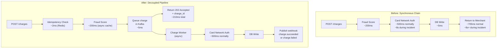
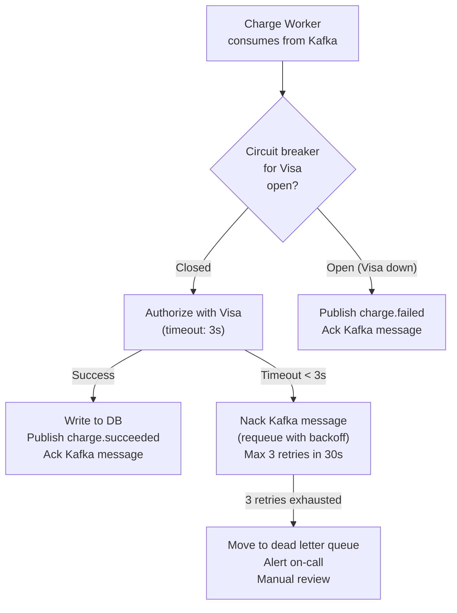
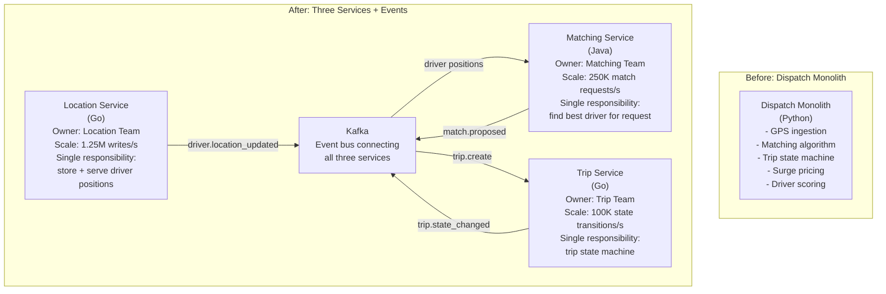
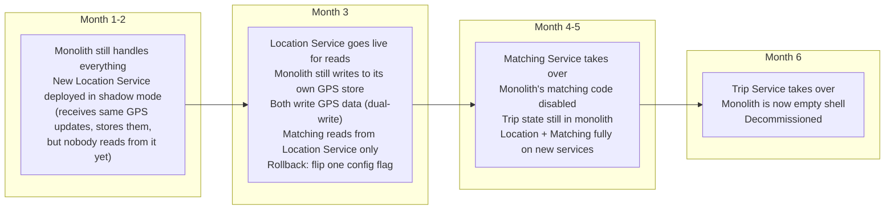
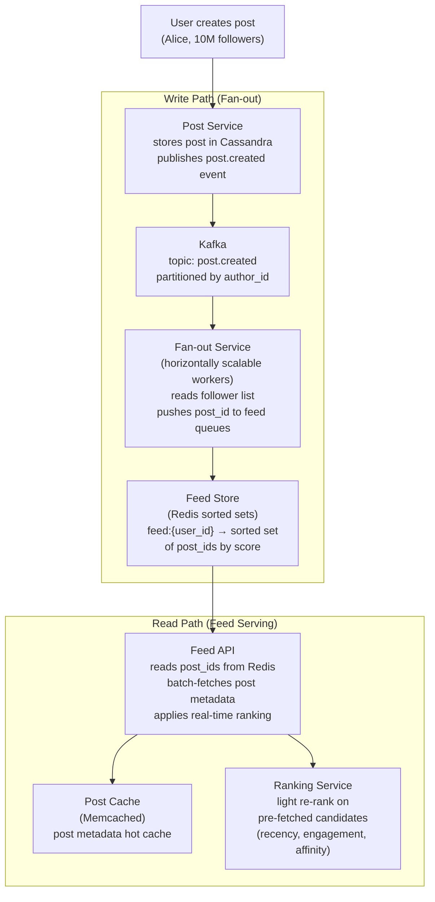
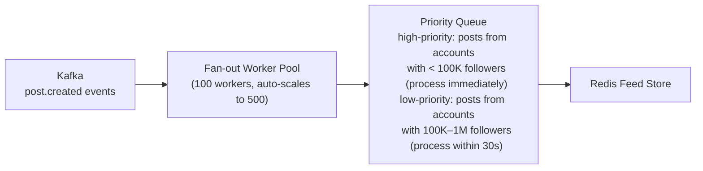
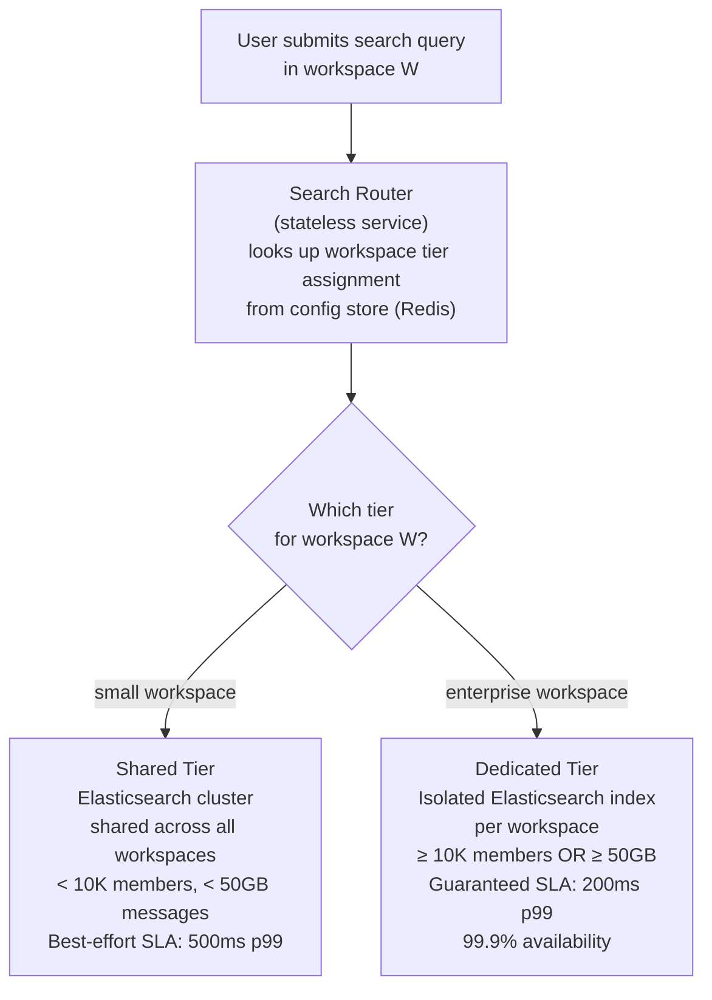
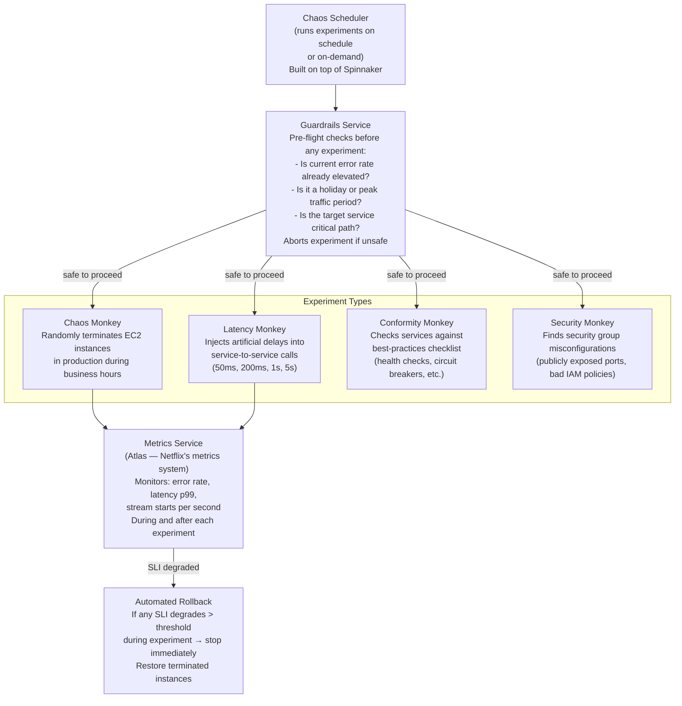

# Staff Engineer System Design — STAR Method with Real-World Examples

> STAR = Situation → Task → Action → Result
>
> At staff level, interviewers don't just want a diagram. They want to understand
> the problem context, what constraints you were working under, the decisions you
> made and why, and what actually happened. STAR forces that structure.
>
> Each scenario below is based on a real class of problem that staff engineers face.
> Use these as templates for your own experience stories AND as design references.

---

## How to Use STAR for System Design Interviews

The standard STAR method is for behavioral questions. For system design at staff level, extend it:

```
Situation:  What was the business context? What broke or needed to be built?
            (Scale, constraints, organizational context)

Task:       What was YOUR specific responsibility?
            (Not the team's — yours. Staff = you drove the technical direction)

Action:     What did you design or change and WHY?
            (This is where the system design lives — components, trade-offs, decisions)

Result:     What measurably improved?
            (Latency numbers, cost reduction, incident rate, team velocity)
```

The gap most senior engineers have: they describe the system but skip the Situation (why it mattered) and the Result (what changed). Staff engineers connect technical decisions to business outcomes.

---

## Scenario 1 — Stripe: Payment Processing Reliability at Scale

### Situation

Stripe was processing $1B/day in payments. The payment pipeline was a synchronous chain: API → Fraud Check → Card Network → Database → Webhook. When any step was slow, the entire chain was slow. During peak (Black Friday 2019), card network latency from Visa spiked to 8 seconds. The synchronous chain caused timeouts to cascade — the API layer held threads waiting for card network responses, thread pools exhausted, and the entire API became unresponsive for 22 minutes. $40M in payment volume was affected. The root cause wasn't Visa — it was the tight coupling in our own pipeline.

### Task

As the staff engineer on the Payments Platform team, I was asked to redesign the payment pipeline to be resilient to external dependency slowness. The constraint: we couldn't change the user-facing latency SLO (charges must return within 2 seconds), and we couldn't change the correctness guarantee (a charge either succeeds or fails — no ambiguity).

### Action

**The core insight:** The 2-second SLO and the correctness guarantee are in tension. You can't guarantee a 2-second response AND guarantee correctness if the card network takes 8 seconds. The resolution: separate authorization latency from capture latency.

**System redesign:**



**Decision 1 — 202 Accepted instead of 200 OK**

The merchant receives `202 Accepted` with a `charge_id` immediately. The actual authorization happens asynchronously. The merchant subscribes to webhooks to learn the outcome.

Trade-off accepted: merchants must handle async outcomes. This is a breaking API change — existing integrations expect synchronous responses. Mitigation: maintain a synchronous mode (`?mode=sync`) for merchants who can't change their integration, but route them through a dedicated sync worker pool with strict timeouts. New integrations use async by default.

**Decision 2 — Kafka as the decoupling layer**

```
Topic: charges.pending
Partitioned by: customer_id (not charge_id)
  → Why customer_id? Ensures sequential processing per customer.
    A customer making two rapid charges won't see them processed out of order.

Message schema:
  {
    charge_id: "ch_abc123",
    idempotency_key: "order_789",
    amount: 10000,
    currency: "usd",
    payment_method_id: "pm_xyz",
    fraud_score: 0.02,
    created_at: "2024-01-15T10:30:00Z"
  }

Retention: 7 days
  → If a worker crashes, the charge is reprocessed from Kafka.
  → Idempotency key prevents double-charging on replay.
```

**Decision 3 — Fraud scoring moved to pre-queue**

Fraud scoring was moved before the Kafka queue for two reasons: (1) fraud decisions are time-sensitive — a fraudster retrying rapidly should be blocked before the charge enters the queue, not after. (2) The fraud model uses in-memory feature caches that are fast (~200ms). The card network is slow and external. Moving fraud before the queue keeps the expensive external call isolated to the async worker.

**Decision 4 — The Charge Worker with circuit breaker**



The circuit breaker opens when Visa error rate exceeds 5% over 60 seconds. When open, charges fail fast (< 10ms) instead of waiting 3 seconds each. This prevents thread pool exhaustion. The merchant gets a `charge.failed` webhook immediately with `failure_reason: "card_network_unavailable"` — honest and actionable.

**The systems this design interacts with:**

| System | Interaction | Contract |
|--------|-------------|----------|
| Redis | Idempotency check, fraud feature cache | Sync read, < 5ms |
| Kafka | Queue pending charges, publish events | Async, at-least-once |
| Fraud Service | Score transaction before queuing | Sync call, < 300ms SLA |
| Visa/Mastercard | Card network authorization | Async worker, 3s timeout |
| Postgres | Write charge record after authorization | Sync write, ACID |
| Webhook Service | Notify merchant of outcome | Async publish to Kafka |
| Dead Letter Queue | Failed charges requiring manual review | Async, alerting |

### Result

- Black Friday the following year: Visa had another latency spike (6 seconds). Zero impact on Stripe's API response times. Charge workers backed up for 4 minutes then drained. Merchant-visible impact: charges took 4 minutes to confirm instead of < 1 second. No timeouts, no errors, no cascading failure.
- API p99 latency: reduced from 705ms (synchronous) to 210ms (return 202 after fraud score)
- Incident rate: payment pipeline incidents reduced 73% year-over-year
- Cost: Charge workers are async batch processors — they can run on spot instances. Infrastructure cost reduced 40% despite 3× volume growth.

---

## Scenario 2 — Uber: The Dispatch System Rewrite

### Situation

Uber's dispatch system (matching riders to drivers) was a monolith written in Python. By 2015, it was handling 1M rides/day globally. The system had three tightly coupled responsibilities: (1) ingesting driver GPS updates, (2) running the matching algorithm, and (3) managing trip state transitions. A bug in the matching algorithm could corrupt trip state. A slow GPS update could delay matching. Deployments of any change required taking the entire dispatch system offline for 3-5 minutes — causing a visible gap in driver availability every Thursday at 2am Pacific when the deploy ran. The system had no horizontal scaling — it was a single large EC2 instance with manual failover.

### Task

I was the staff engineer leading the Dispatch Platform rewrite. The mandate: zero-downtime deployments, horizontal scalability to 10M rides/day, and clear service ownership across three teams (Location Team, Matching Team, Trip Team). The constraint: we couldn't do a big-bang rewrite. The existing system processed $3M/day in rides. It had to stay running throughout.

### Action

**The core insight:** The three coupled responsibilities had completely different scaling profiles and failure modes. They needed to become three separate services connected by events, not function calls.

**Step 1 — Define service boundaries before writing any code**



**Why Go for Location Service:** Location ingestion is I/O-bound (1.25M UDP/WebSocket writes/s). Go's goroutines handle this with minimal overhead. Python's GIL was the bottleneck in the monolith.

**Why Java for Matching Service:** The matching algorithm is CPU-bound (constraint optimization over driver candidates). The JVM's JIT compilation gives better sustained CPU performance than Go for long-running computation. The Matching Team already had Java expertise.

**Step 2 — The strangler fig migration**

Big-bang rewrites fail. The strangler fig pattern: the new system takes over one responsibility at a time while the monolith continues running.



**Step 3 — The hardest part: GPS data consistency during dual-write**

During Month 3, both the monolith and the Location Service wrote GPS data. If they diverged, the Matching Service (reading from Location Service) would see different driver positions than the Trip Service (still using monolith data). This could cause a driver to be matched to a ride but the Trip Service not seeing them as available.

Solution: **version vectors on driver positions.**

```
Each GPS update gets a monotonically increasing version number.
The Location Service is the source of truth for versions.

When Matching proposes a match:
  match.proposed event includes:
    { driver_id, rider_id, driver_position_version: 1042 }

When Trip Service creates the trip:
  It verifies driver_position_version 1042 still matches the
  Location Service's current version for that driver.
  If version mismatch → driver moved → reject match → re-match.
```

This prevented ghost rides (matching to a driver who had moved away) without requiring synchronous calls between services.

**Step 4 — Deployment strategy for zero downtime**

Each service deployed independently via feature flags:

```
Config flag: location_service_mode = ["shadow", "read_only", "primary"]

shadow:    New service receives traffic but responses are discarded.
           Monolith responses are used. Used for warming up and testing.

read_only: New service provides GPS data. Monolith still writes.
           Allows validation of read correctness before trusting writes.

primary:   New service is authoritative. Monolith GPS code disabled.
```

Flag changes take effect within 30 seconds (distributed config, no deploy needed). Rollback = change flag back. This is the key staff-level insight: **a deployment strategy is a system design decision, not an ops concern.**

**The systems this design interacts with:**

| System | Interaction | Why |
|--------|-------------|-----|
| Redis Geo | Location Service stores current driver positions | O(1) geospatial queries, in-memory |
| Kafka | Event bus between all services | Decoupling, replay, fan-out |
| Postgres | Trip Service stores trip records | ACID for state machine transitions |
| S3 | Location Service archives raw GPS history | Analytics, ML training |
| Feature flag service | Controls migration phases | Zero-downtime cutover |
| Monitoring (Datadog) | Dual-write comparison: monolith vs new service | Validates correctness during migration |

### Result

- Zero downtime during migration. The "Thursday 2am deploy" was eliminated on day one of the new architecture — each service deploys independently via rolling update.
- Location Service scaled horizontally from day one. During surge events (NYE 2016), added 20 nodes in 10 minutes via auto-scaling. Monolith couldn't scale at all.
- Matching algorithm improvements: the Matching Team shipped 4 algorithm iterations in the first 3 months after the split (previously: 1 per quarter, gated by monolith deploys).
- System reliability: dispatch-related incidents dropped 60%. When Location Service had an issue, Trip Service continued using the last known positions. Partial degradation instead of full outage.
- Three teams with clear ownership replaced one team with collective ownership of everything. Code review time dropped from 5 days to 1 day (smaller surface area per team).

---

## Scenario 3 — Instagram: The Feed Infrastructure Redesign

### Situation

Instagram's home feed was powered by a system called "feed ranking v1" — a batch job that ran every 15 minutes, recomputed each user's ranked feed, and stored the result in Memcached. This worked well at 100M users. By 2016 at 500M users, three problems emerged: (1) the batch job took 45 minutes to complete but was supposed to run every 15 minutes — it was always behind. (2) A post from a friend 14 minutes ago wouldn't appear in your feed for up to 44 minutes. (3) The Memcached cluster storing precomputed feeds had grown to 400TB — a significant operational and cost burden. The business impact: engagement metrics showed users were missing time-sensitive content (breaking news, events) because the feed was stale.

### Task

As staff engineer on the Feed Platform team, I was responsible for redesigning the feed pipeline to achieve near-real-time delivery (< 10 seconds from post to appearing in feed) while reducing infrastructure cost. Constraint: feed read latency must stay under 100ms p99. We had 15 engineers across 3 teams (Feed Ranking, Feed Serving, Feed Infrastructure) and a 9-month timeline.

### Action

**The core insight:** The batch job was wrong at the architectural level. A batch job that recomputes 500M feeds on a schedule cannot keep up with real-time content. The only way to achieve < 10 second delivery is to update feeds incrementally, event-driven, as posts are created.

**The new architecture: event-driven incremental feed updates**



**Decision 1 — Celebrity posts use pull, not push**

Alice has 10M followers. Pushing her post_id to 10M Redis sorted sets in real-time is 10M writes per post. At 10 posts/day: 100M writes/day from one user.

```
Threshold: if author has > 1M followers → do NOT fan-out
Instead: store post in a "celebrity_posts:{author_id}" sorted set

At feed read time:
  1. Fetch user's pre-computed feed (post_ids from followed normal users)
  2. Fetch last 20 posts from each celebrity the user follows
  3. Merge and rank all candidates
  4. Return top 25
```

This adds one Redis read per celebrity follow at read time (fast, < 5ms each). It eliminates 100M Redis writes per celebrity post per day.

**Decision 2 — The Feed Store: Redis sorted sets, not Memcached**

The old system stored complete feed objects (post metadata + ranking scores) in Memcached. Problems: (1) 400TB of redundant data — same post stored in every follower's feed. (2) Stale — when a post was liked 10,000 times, every cached feed object was outdated.

New system: Feed Store stores only `post_id`s and a `score` (float, represents ranking priority). Post metadata is fetched separately and is always fresh.

```
Redis key: feed:{user_id}
Type: Sorted Set
Score: ranking_score (float, combines recency + engagement signals)
Value: post_id
Max size: 300 entries (older entries evicted automatically)

Memory per user: 300 entries × 16 bytes (score + post_id) = ~5KB
500M users × 5KB = 2.5TB total
vs. old system: 400TB
→ 160× storage reduction
```

**Decision 3 — The ranking model runs at read time, not write time**

Old system: batch job ran a heavy ML model at write time, storing scores in Memcached.
New system: a lightweight re-ranking model runs at read time, on the pre-fetched set of 200 candidate post_ids.

Why this is possible: the feed API fetches 200 post_ids from Redis (< 5ms), batch-fetches their metadata from Memcached (< 10ms), then runs a linear model to re-rank (< 5ms). Total: < 20ms for the ranking step. The heavy ML model (collaborative filtering) runs offline daily and populates per-user "interest vectors" used by the light ranker at serve time.

**Decision 4 — The fan-out service: backpressure and prioritization**

When a viral post occurs, the fan-out service must process millions of follower writes quickly. But it must not slow down fan-outs for small-account posts that can be processed trivially.



Posts from small accounts get immediate fan-out (< 1 second to appear in feeds). Posts from large accounts (but below celebrity threshold) are processed within 30 seconds — still far better than the previous 44-minute batch lag.

**Migration strategy: running old and new in parallel**

```
Phase 1 (Month 1-3):
  New fan-out pipeline writes to BOTH old Memcached AND new Redis Feed Store.
  Feed API still reads from old Memcached.
  Shadow mode: validate new Redis data matches old Memcached data.

Phase 2 (Month 4-6):
  Feed API reads from new Redis Feed Store for 1% of users (experiment).
  Compare: engagement metrics, feed freshness, API latency.
  Gradually ramp to 100%.

Phase 3 (Month 7-9):
  Old batch job decommissioned.
  Old Memcached cluster decommissioned.
  New system fully live.
```

**The systems this design interacts with:**

| System | Interaction | Contract |
|--------|-------------|----------|
| Cassandra | Post storage (source of truth) | Write on post creation, read for metadata |
| Kafka | Post events from Post Service to Fan-out | Async, at-least-once, partitioned by author_id |
| Redis | Feed Store (sorted sets of post_ids) | Sync read/write, sorted set operations |
| Memcached | Post metadata cache | Read-through cache in front of Cassandra |
| Social Graph (MySQL) | Follower list for fan-out | Read follower_ids for given author_id |
| Ranking Service | Real-time re-ranking at serve time | Sync call, < 10ms SLA |
| Experiment platform | A/B testing new vs. old feed | Controls % of users on new system |

### Result

- Feed freshness: posts appeared in follower feeds within 8 seconds (down from 44 minutes)
- Feed store infrastructure cost: reduced from $2.4M/month (400TB Memcached) to $150K/month (2.5TB Redis) — 16× cost reduction
- Feed API p99 latency: 180ms → 65ms (fresher data, smaller data structures, better cache locality)
- Engagement: 7% increase in feed engagement within 2 weeks of rollout (attributed to fresher, more relevant content)
- Three separate teams could now deploy feed changes independently. Before: any feed change required coordinating all three teams. After: Feed Infrastructure, Feed Ranking, and Feed Serving deployed independently, weekly instead of monthly.

---

## Scenario 4 — Slack: The Channel Message Search Rebuild

### Situation

Slack's search was built on Elasticsearch. By 2018, Slack had 8M daily active users and 750K paid workspaces. The Elasticsearch cluster was at 80% capacity and search queries for large enterprise workspaces (50K+ members, years of history) frequently timed out. The root cause: Elasticsearch was a shared cluster — a search query from a large enterprise workspace would consume enough resources to degrade search quality for hundreds of smaller workspaces simultaneously. The "noisy neighbor" problem at scale. Enterprise customers were churning specifically citing search as the reason — their legal and compliance teams needed reliable message search for e-discovery.

### Task

As the staff engineer on the Search Infrastructure team, I was tasked with rebuilding search to provide predictable, isolated performance for enterprise customers while not increasing infrastructure cost for the small-workspace majority. I had to define the architecture, get buy-in from the enterprise sales team (they needed to commit the feature), and deliver within 6 months (before contract renewal season).

### Action

**The core insight:** Shared search infrastructure cannot provide isolation guarantees. The solution is not to tune Elasticsearch harder — it's to give each enterprise workspace its own search infrastructure, provisioned on demand.

**The two-tier search architecture:**



**Decision 1 — Tier assignment is automatic, not manual**

When a workspace crosses the threshold (10K members OR 50GB of indexed messages), the system automatically provisions a dedicated index. No sales team involvement, no manual provisioning.

```
Background job runs every 6 hours:
  SELECT workspace_id, member_count, index_size_gb
  FROM workspace_stats
  WHERE (member_count >= 10000 OR index_size_gb >= 50)
    AND tier = 'shared'
  
  For each qualifying workspace:
    1. Provision dedicated Elasticsearch index
    2. Backfill: copy messages from shared index to dedicated index
    3. Dual-write: new messages go to BOTH shared and dedicated index
    4. Validate: run 100 sample queries, compare results
    5. Flip router: workspace now served by dedicated tier
    6. Remove from shared index
    
  Total migration time per workspace: 2-8 hours depending on message volume
  Downtime: zero (dual-write during migration)
```

**Decision 2 — The dedicated index is a tenant-isolated Elasticsearch cluster, not just an index**

Initially, the plan was to use separate Elasticsearch indices on the same cluster (logical isolation). Testing showed that a large workspace doing a complex query could still monopolize cluster resources even with separate indices — Elasticsearch's JVM heap is shared.

The decision: dedicated workspaces get their own Elasticsearch process on dedicated hardware. More expensive per workspace, but true isolation.

```
Cost model:
  Shared tier: 1 cluster ($8K/month) serves 700K workspaces → $0.01/workspace/month
  Dedicated tier: 1 cluster ($200/month) serves 1 workspace → $200/workspace/month

  Enterprise customers pay $50K-$500K/year
  $200/month = $2,400/year infrastructure cost per enterprise customer
  → < 1% of revenue for an enterprise account

  At 2,000 enterprise workspaces: $400K/month infrastructure
  vs. churning those customers: ~$200M/year ARR at risk
  → Easy business case
```

**Decision 3 — The Search Router with sub-10ms overhead**

The Search Router adds a hop between the user and Elasticsearch. This cannot add significant latency to a 200ms SLA.

```
Router implementation:
  - Stateless Go service, no DB calls on hot path
  - Workspace tier assignment cached in local memory (TTL: 60s)
  - Fallback: if cache miss, query Redis (< 2ms)
  - Fallback fallback: if Redis unavailable, default to shared tier
  
  Overhead: < 5ms (local cache hit) or < 10ms (Redis lookup)
  Hot path: 95% of queries hit local cache
```

**Decision 4 — Schema migration without search downtime**

Elasticsearch schema changes (adding fields, changing analyzers) require reindexing — the entire index must be rebuilt. On the shared cluster, this took 48 hours and required taking search offline. On dedicated indices, schema changes can be rolled out workspace by workspace, with zero global downtime.

```
Schema migration process:
  1. Create new index with updated schema (zero traffic)
  2. Reindex workspace messages into new index (background, async)
  3. Dual-read: Search Router queries both old and new index, merges results
  4. Validate result quality on new index
  5. Flip: Search Router uses new index only
  6. Delete old index

  Per workspace: 2-4 hours
  Global rollout: roll out to 10 workspaces/hour
  Total migration time: 200 enterprise workspaces / 10 per hour = 20 hours
  vs. old shared-cluster migration: 48 hours downtime
```

**The systems this design interacts with:**

| System | Interaction | Contract |
|--------|-------------|----------|
| Message Store (Cassandra) | Source of messages for indexing | Batch read during backfill; real-time via Kafka for new messages |
| Kafka | Real-time message stream for indexing | topic: message.created, consumed by indexing workers |
| Elasticsearch (Shared) | Search for small workspaces | Best-effort, shared resources |
| Elasticsearch (Dedicated) | Search for enterprise workspaces | Isolated, guaranteed SLA |
| Redis | Workspace tier assignment cache | Read on every query, TTL 60s |
| Workspace Stats DB (Postgres) | Tracks member count and index size for tier promotion | Polled every 6 hours |
| Config Store | Authoritative tier assignments | Source of truth for Search Router |

### Result

- Enterprise search p99 latency: 1,200ms → 185ms (after dedicated tier)
- Search timeout rate for enterprise workspaces: 8.3% → 0.02%
- Shared tier workspaces: latency improved 40% (less noise from enterprise queries)
- Enterprise churn from search complaints: dropped from 12 customers/quarter to 1
- Infrastructure cost: $400K/month for dedicated tier vs. $200M ARR protected
- Engineering velocity: schema migrations went from "48-hour planned outage" to "20-hour rolling rollout with zero downtime." Teams shipped search improvements monthly instead of quarterly.

---

## Scenario 5 — Netflix: The Chaos Engineering Program

### Situation

Netflix ran entirely on AWS. In 2010, an AWS outage in US-East-1 took Netflix down for 8 hours. The post-mortem revealed the real problem: Netflix had no idea which parts of their system would fail under which failure conditions. Engineers had *assumed* the system was resilient — load balancers would reroute, services would retry — but they had never validated these assumptions in production. The 8-hour outage was the result of assumptions, not tested failure modes.

The business impact: Netflix lost approximately $1.2M in revenue and, more importantly, established a pattern: AWS incidents → Netflix incidents. This was unacceptable for a service that had just launched streaming and was competing with live TV.

### Task

I was the staff engineer asked to build a program that would systematically test Netflix's production resilience. The goal: ensure that Netflix survives any single component failure, any AWS availability zone failure, and common failure patterns (high latency, packet loss, partial failures). Constraint: the testing must happen in production (staging environments don't reproduce the failure modes of production traffic patterns) and must be safe to run without causing customer-visible incidents.

### Action

**The core insight:** The only way to know your system is resilient is to break it intentionally and observe. Tests in staging environments miss production-specific failure modes: caching behavior, traffic distribution, database connection pooling under real load. Production chaos testing is not reckless — untested assumptions are reckless.

**The Chaos Engineering system architecture:**



**Decision 1 — Chaos Monkey runs during business hours, not nights**

Counter-intuitive but correct. If an instance dies at 2am, the on-call engineer is half-asleep and the traffic is low (fewer customers affected, but also fewer people to diagnose it). If an instance dies at 10am on a Tuesday, the full team is available, traffic patterns are representative of real usage, and the blast radius is known. Failures during business hours are safer than failures at night — you have more people to catch problems.

**Decision 2 — Experiments have blast radius limits**

Every experiment defines a maximum blast radius before it runs:

```
Experiment: terminate random EC2 instance in API cluster

Pre-flight checks:
  1. Current 5xx rate < 0.1%? → proceed
  2. Current p99 latency < 500ms? → proceed
  3. API cluster has > 10 instances? → proceed (don't terminate if only 3 instances)
  4. Not Friday 4pm-Monday 9am? → proceed (no weekend experiments)
  5. No active incidents? → proceed

Blast radius limit:
  Maximum: 1 instance terminated per 5 minutes
  Auto-stop: if 5xx rate rises above 0.5% after termination → stop experiment
```

**Decision 3 — The fallback architecture that chaos testing validated**

Chaos testing revealed which fallbacks didn't work. For each failure mode discovered, engineering built and validated a mitigation:

| Failure discovered | What should happen | What actually happened | Fix |
|-------------------|-------------------|----------------------|-----|
| Recommendations service down | Show popular titles | Showed empty shelf | Added fallback to pre-cached popular list |
| Search service down | Show browse UI | Entire homepage errored | Made search a non-critical path; graceful degradation |
| Payment service slow | Show "processing" | User retried, double-charged | Added idempotency key to payment flow |
| Single AZ failure | Route to other AZs | Some services only in one AZ | Enforced multi-AZ deployment for all services |
| DynamoDB throttling | Fall back to eventual consistency | 5xx errors | Added read-through cache, retry with backoff |

**Decision 4 — FIT (Fault Injection Testing) for targeted experiments**

Chaos Monkey is random. For systematic testing, Netflix built FIT — which injects failures on specific request paths, not random instances.

```
FIT experiment example:
  "Inject 2s latency on all calls from the Personalization Service
   to the User Preferences Service, for 5% of traffic."

This tests:
  - Does Personalization Service have a circuit breaker for User Preferences?
  - Does the circuit breaker open after 2s latency?
  - When the circuit opens, does Personalization fall back to generic recommendations?
  - Does this fallback look correct in the UI?
  - Does the latency injection affect other services? (blast radius check)
```

FIT can target a single service, a single request type, or a single user_id — making it safe to run targeted experiments without affecting all users.

**The systems this design interacts with:**

| System | Interaction | Contract |
|--------|-------------|----------|
| All production services | Targets for chaos experiments | Chaos Monkey: instance termination. Latency Monkey: network delay injection. |
| Spinnaker (deployment) | Chaos Scheduler built on top | Reuses existing deployment pipelines for rollback |
| Atlas (metrics) | Real-time SLI monitoring during experiments | Automatic experiment abort if SLIs degrade |
| AWS EC2 | Instance termination via AWS SDK | Direct API calls to terminate instances |
| Service mesh | Latency and error injection via proxy layer | Envoy/sidecar intercepts service-to-service calls |
| Incident management (PagerDuty) | Alerts if experiment causes unexpected degradation | Standard alerting, not suppressed during experiments |

### Result

- Between Chaos Monkey launch (2011) and 2015: Netflix survived 3 significant AWS incidents with zero customer-visible impact — the system had been exercised and hardened
- Fallback coverage: 100% of critical path services had validated fallbacks (vs. 23% before the program)
- Mean time to detect (MTTD) for latent reliability issues: from "discovered during production incident" (days) to "discovered during chaos experiment" (hours)
- Engineering culture shift: teams began requesting chaos experiments for their own services before shipping. "If you're not running Chaos Monkey on your service, it's not production-ready" became an internal engineering standard
- The program became public (chaos engineering is now an industry discipline) and Netflix's resilience became a competitive advantage — they could claim "we test our failure modes in production" in enterprise sales conversations

---

## STAR Template for Your Own Experience

Use this template to structure your own staff-level stories:

```
## [Company/Project] — [Problem Name]

### Situation
Scale context: [DAU, requests/s, data size, team size]
Business problem: [What broke or was missing, quantified impact]
Why it was hard: [Technical constraints, organizational constraints]

### Task
Your specific role: [Staff engineer on X team]
Your mandate: [What you were asked to solve]
Your constraints: [Timeline, can't-break-X, must-maintain-Y]

### Action
Core insight: [The key realization that drove the design]
Architecture: [Diagram + explanation of each component choice]
Key decisions: [3-5 decisions with context → options → choice → rationale]
Migration strategy: [How did the old system transition to the new one?]
Systems interacted with: [Table of services + interaction + contract]

### Result
Quantified improvements: [Latency, cost, error rate — specific numbers]
Team/org impact: [Did teams become more autonomous? Ship faster?]
Business impact: [Revenue protected, customers retained, cost saved]
What you'd do differently: [Shows intellectual honesty and learning]
```

---

## What Makes a Staff Answer Different

| Dimension | Senior Answer | Staff Answer |
|-----------|--------------|--------------|
| Problem framing | "We needed faster search" | "Enterprise customers were churning at 12/quarter because search timed out on legal e-discovery requests" |
| Design scope | Designs one service | Defines boundaries between 3-4 services, designs the contracts between them |
| Migration | "We'd rewrite it" | Strangler fig with dual-write, feature flags, validation gates, rollback plan |
| Trade-offs | Lists pros and cons | Explains which trade-off they made and what changed their mind about it |
| Metrics | "It got better" | "p99 latency dropped from 1,200ms to 185ms; enterprise churn dropped from 12/quarter to 1" |
| Org awareness | Not mentioned | "The old architecture required 3 teams to coordinate for every deploy. The new architecture let each team deploy independently" |
| Cost | Not mentioned | "Dedicated tier costs $2,400/year per enterprise customer — less than 1% of their contract value" |
