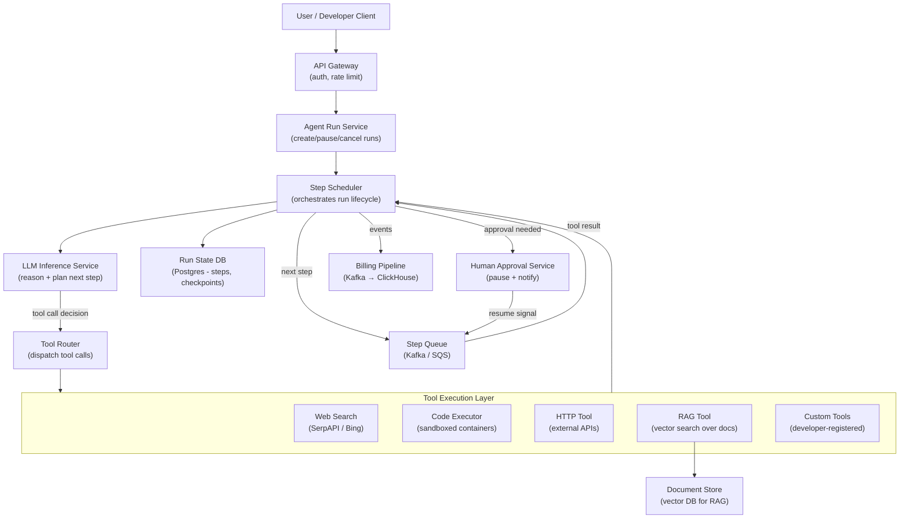
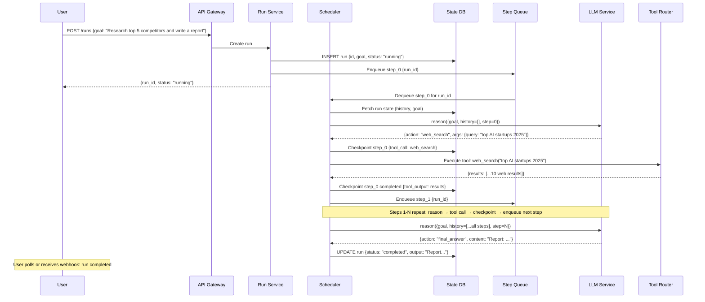

# System Design Walkthrough — AI Agent Platform

> Language-agnostic walkthrough following the 6-step framework from `00-system-design-framework.md`. This covers the architecture of a platform that runs autonomous AI agents — think OpenAI Assistants, LangChain-as-a-service, or an internal enterprise "AI copilot" that can browse the web, write code, and call APIs on behalf of users.

---

## The Question

> "Design a platform for running AI agents. An agent takes a high-level goal, autonomously plans and executes multi-step tasks using tools (web search, code execution, API calls), and produces a final result. Design the system to support thousands of concurrent, long-running agents."

---

## The Core Insight — Before You Draw Anything

AI agents are fundamentally different from stateless LLM chat requests:

1. **Long-running, stateful processes.** A single agent run can take seconds to hours. Unlike a chat response that completes in < 30s, an agent may call 50 tools, wait for code to execute, or poll an external API. The system must manage persistent state across many steps.

2. **Non-deterministic control flow.** The LLM decides at each step what to do next — which tool to call, what arguments to pass, whether to stop. You cannot pre-plan the execution graph. The system must handle arbitrary, dynamic execution trees.

3. **Untrusted code execution.** Tool calls include running arbitrary Python/JavaScript. This must be sandboxed in isolated, ephemeral environments. One user's code must never affect another's data or resources.

4. **Reliability with retries is more complex.** If step 7 of a 20-step plan fails, you want to retry from step 7, not restart from step 1. Checkpointing is essential.

These four properties make agent platforms a novel class of distributed system — part workflow engine, part inference cluster, part secure sandboxed execution environment.

---

## Step 1 — Clarify Requirements

### Functional Requirements

| # | Requirement |
|---|-------------|
| F1 | Users submit a goal (natural language task) to create an agent run |
| F2 | Agent reasons step-by-step, calling tools to accomplish the goal |
| F3 | Built-in tools: web search, code execution, file read/write, HTTP requests, RAG over user documents |
| F4 | Custom tools: developers register their own API endpoints as tools |
| F5 | Agent run state (steps taken, tool outputs) is persisted and viewable |
| F6 | Users can pause, resume, and cancel agent runs |
| F7 | Long-running agents (hours) are supported |
| F8 | Agents can request human approval before taking certain actions ("human-in-the-loop") |
| F9 | Usage (LLM tokens, tool calls, execution time) tracked per user for billing |

**Out of scope:** multi-agent collaboration (agents spawning agents), voice interface, fine-tuning agent models.

### Non-Functional Requirements

| Attribute | Target |
|-----------|--------|
| Concurrent agent runs | 50,000 |
| Max run duration | 24 hours |
| Step latency (tool call round-trip) | < 5s p95 (excluding tool execution time) |
| Checkpoint durability | Zero state loss after ack |
| Availability | 99.9% (eventual consistency acceptable for state) |
| Security | Strict sandbox isolation; no cross-tenant data leakage |
| Scalability | Burst to 10× baseline in < 5 minutes |

---

## Step 2 — Back-of-the-Envelope Estimates

```
Concurrent runs:
  50K concurrent agent runs
  Average run: 20 steps × 5s/step = 100s active LLM + tooling time
  But runs can span hours (waiting on human approval, slow tools)
  → Need to distinguish "active" (LLM computing) vs "waiting" (suspended) runs

LLM inference load:
  50K concurrent runs, but not all calling LLM simultaneously
  Assume 20% "active" (calling LLM) at any moment = 10K LLM calls/s
  Average prompt: 4K tokens (history grows per step)
  → 10K × 4K = 40M tokens/s → large GPU cluster (similar to LLM serving at scale)

Checkpoint storage:
  Each step produces: {step_id, tool_call, tool_output, llm_response}
  Avg step payload: 10 KB (tool outputs can be large)
  50K runs × 20 steps × 10 KB = 10 GB active run state
  + historical: 100K completed runs/day × 20 steps × 10 KB = 20 GB/day

Code execution sandboxes:
  50K concurrent runs × 30% run code = 15K concurrent sandboxes
  Each sandbox: isolated container, ~256 MB RAM, 0.5 CPU
  15K × 256 MB = 3.75 TB RAM across sandbox cluster
  → Needs a dedicated sandbox execution cluster

Tool call queue:
  50K runs × 1 tool call/5s = 10K tool calls/s
  Latency-sensitive → message queue with < 100ms dispatch
```

---

## Step 3 — High-Level Design



### Happy Path — Agent Run Execution



---

## Step 4 — Deep Dives

### 4.1 The Step Scheduler — Core of the Platform

```
The Scheduler is the brain of the platform. For each active run, it:
  1. Fetches the current run state from DB (full history)
  2. Builds the LLM prompt (system prompt + goal + step history)
  3. Calls the LLM inference service
  4. Parses the LLM output: is it a tool call or a final answer?
  5. If tool call: dispatches via Tool Router, waits for result
  6. Checkpoints the step (both call + result) atomically
  7. If not done: enqueues next step

State machine for a run:
  created → running → [waiting_for_tool | waiting_for_human] → running → completed/failed/cancelled

Why a queue (not a thread-per-run)?
  - 50K concurrent runs can't all have a dedicated thread blocked waiting
  - Queue-based: each step is a short, discrete unit of work
  - Scheduler workers pick up steps from queue → stateless, horizontally scalable
  - Suspended runs (waiting for human approval, slow tool) consume zero CPU
```

### 4.2 Persistent State & Checkpointing

```
Why checkpointing matters:
  A 20-step agent run that fails on step 18 should retry from step 18, not step 1.
  Tool calls may have side effects (sent an email, created a file) — replaying from
  step 1 would re-execute those side effects.

Checkpoint schema:
  runs(
    id          UUID PRIMARY KEY,
    user_id     UUID,
    goal        TEXT,
    status      ENUM(created, running, waiting_tool, waiting_human, completed, failed, cancelled),
    model       TEXT,
    created_at  TIMESTAMPTZ,
    completed_at TIMESTAMPTZ,
    output      TEXT
  )

  steps(
    id          UUID PRIMARY KEY,
    run_id      UUID REFERENCES runs(id),
    step_index  INT,
    tool_name   TEXT,
    tool_args   JSONB,
    tool_output JSONB,  -- can be large (web search results, code output)
    llm_prompt_tokens INT,
    llm_output_tokens INT,
    status      ENUM(pending, executing, completed, failed),
    created_at  TIMESTAMPTZ,
    completed_at TIMESTAMPTZ
  )

Large tool outputs:
  Tool outputs can exceed DB row size limits (e.g., 100KB web scrape result)
  → Store large outputs in object storage (S3), reference by key in steps.tool_output
  → Postgres row stays small; scheduler fetches content from S3 when building LLM prompt

Context window management:
  After 10-15 steps, the full history may exceed the LLM context window (or cost too much)
  → Summarize old steps: "Steps 1-10 summary: found 3 competitors, compared pricing..."
  → Keep last N steps in full detail; replace earlier steps with summary
  → Store the summary as a special step type in the steps table
```

### 4.3 Code Execution Sandbox

```
Requirements:
  - Complete isolation: user A's code cannot see user B's data or files
  - Resource limits: CPU, RAM, disk, network (no arbitrary outbound connections)
  - Fast startup: agents should wait < 2s for a sandbox to be ready
  - Ephemeral: sandbox is destroyed after the tool call completes

Implementation: gVisor + container pool

Architecture:
  Sandbox Pool Manager:
    - Pre-warms a pool of 1000 idle gVisor containers (Python 3.11 + common libs)
    - When a code_exec tool call arrives: claim a container from pool in < 100ms
    - Execute code with 30s timeout
    - Stream stdout/stderr back as tool output
    - Destroy container, replenish pool

  Isolation mechanism:
    - gVisor (runsc): user-space kernel, intercepts all syscalls
      stronger isolation than runc while faster than full VM
    - Each container: separate network namespace (no internet by default)
    - Allow-listed external access: only specific domains (e.g., PyPI for installs)
    - CPU cap: 1 vCPU; RAM cap: 512 MB; Disk: 1 GB tmpfs

  Security layers:
    1. gVisor syscall interception
    2. Linux namespaces (PID, network, mount, user)
    3. cgroups (CPU/RAM quotas)
    4. Seccomp filter (whitelist of allowed syscalls)
    5. No persistent storage: ephemeral tmpfs only

  File sharing between steps:
    - Agent runs have a virtual "workspace" (small S3-backed file system)
    - Code_exec mounts the workspace as a volume at startup
    - Files written during code_exec are persisted to workspace
    - Next step can read files from workspace
```

### 4.4 Tool Router & Custom Tools

```
Built-in tools registered by the platform:
  web_search(query: str) → SearchResults
  code_exec(code: str, language: "python"|"javascript") → {stdout, stderr, exit_code}
  http_request(url, method, headers, body) → {status, response_body}
  rag_search(query: str, collection_id: str) → Documents
  read_file(path: str) → content
  write_file(path: str, content: str) → success

Custom tools (developer-registered):
  Developers register a tool via API:
  POST /tools {
    name: "send_slack_message",
    description: "Sends a message to a Slack channel",  // shown to LLM
    parameters: {channel: "string", message: "string"}, // JSON Schema
    endpoint: "https://my-service.com/webhooks/slack",  // called by platform
    auth: {type: "bearer", secret_ref: "vault://my-secret"}
  }

  When the LLM calls a custom tool:
    Tool Router → validates args against JSON Schema
               → fetches auth secret from Vault
               → makes HTTPS call to developer's endpoint
               → returns response to Scheduler

  Security for custom tools:
    - Platform never stores plaintext secrets (only Vault references)
    - Outbound calls proxied through egress gateway (for logging, rate limiting)
    - Response size limit (1 MB) to prevent memory exhaustion
    - Timeout: 30s default, configurable up to 5 minutes

Tool call schema given to LLM (OpenAI function calling format):
  tools=[
    {
      "name": "web_search",
      "description": "Search the web for current information.",
      "parameters": {
        "type": "object",
        "properties": {"query": {"type": "string"}},
        "required": ["query"]
      }
    },
    ...
  ]
```

### 4.5 Human-in-the-Loop

```
Use cases:
  - Agent wants to send an email → requires human approval before sending
  - Agent is about to delete files → pause and ask user to confirm
  - Agent is uncertain about a decision → escalate to human

Implementation:
  1. LLM outputs a special tool call: request_human_approval({question, context, options})
  2. Scheduler: run transitions to status="waiting_human"
  3. Notification sent to user (email / push / in-app)
  4. Run is suspended: no CPU consumed, step queue entry removed
  5. User sees approval request in UI with full context
  6. User approves or rejects
  7. Approval Service: publishes "resume" event to Queue {run_id, decision}
  8. Scheduler picks up resume event:
     - If approved: inject approval as tool_output, enqueue next step
     - If rejected: inject rejection, agent decides next action

Timeout:
  - If no human response within configured timeout (default 24h):
  - Run transitions to status="waiting_human_timeout"
  - User gets reminder notification
  - After 72h: run is auto-cancelled

This decoupled design (queue + event) means the run can wait indefinitely
with zero resource consumption while paused.
```

### 4.6 Failure Recovery & Idempotency

```
Scheduler worker crashes mid-step:
  - Step is in DB with status="executing"
  - On scheduler restart: detect stale "executing" steps (> 2× expected duration)
  - Re-enqueue the step for retry
  - Tool Router checks idempotency key before re-executing tools
    (prevents sending an email twice if the tool call already succeeded)

Idempotency keys:
  Every tool call includes an idempotency_key = hash(run_id + step_index)
  Built-in tools check this key before executing side-effectful operations
  Custom tools are given the key as an HTTP header (X-Idempotency-Key)
  → developer's endpoint responsible for deduplication

Partial failure in long runs:
  - Each step is checkpointed atomically (both args and output)
  - Failed step: max 3 retries with exponential backoff
  - If still failing: run transitions to "failed", user notified
  - User can inspect steps, fix the issue (e.g., fix their custom tool), and resume

Max run duration (24h):
  - Runs have a hard deadline stored in DB
  - Scheduler checks deadline before enqueueing each step
  - If exceeded: run transitions to "timed_out", checkpoint preserved for analysis
```

---

## Step 5 — Handling Failures

| Failure | Impact | Mitigation |
|---------|--------|------------|
| Scheduler worker crash | In-flight steps stall | Heartbeat per step in DB; orphaned steps re-enqueued after timeout |
| LLM service down | No reasoning, runs stall | Retry with backoff (up to 5min); run pauses, user notified |
| Sandbox pool exhausted | Code execution queued | Auto-scale sandbox pool; queue code_exec calls; alert on wait time |
| Custom tool endpoint down | Tool call fails | 3 retries with backoff; step fails; agent can decide to skip or fail run |
| State DB overloaded | Checkpoint writes fail | Read replicas for read; primary for writes; checkpoint write retried before proceeding |
| Human approval never comes | Run waits forever | Timeout policy (72h); auto-cancel with notification |

---

## Step 6 — Bottlenecks & Trade-offs

### The Core Trade-off: Step Latency vs. Throughput

```
Each step = LLM call (1-5s) + tool execution (1-30s)
50K concurrent runs × ~1 step/10s = 5K LLM calls/s + 5K tool dispatches/s

Throughput bottlenecks (in order):
  1. LLM inference capacity — the most expensive and capacity-constrained
  2. Sandbox container availability — must pre-warm enough containers
  3. State DB write throughput — every step requires a checkpoint write

Mitigation:
  - LLM: batching, multiple model replicas, priority queuing (foreground vs. background runs)
  - Sandbox: predictive scaling based on queue depth; warm pool of 1K+ containers
  - DB: partition steps table by run_id; use write-ahead log for durability without sync writes
```

### Trade-off: Centralised Scheduler vs. Distributed

```
Centralised scheduler (designed above):
  + Simple reasoning about run state
  + Easy to implement pause/resume/cancel
  - Single scheduler becomes bottleneck at very high scale

Distributed (e.g., Temporal workflow engine):
  + Built for exactly this problem (durable execution)
  + Handles retries, timeouts, heartbeats natively
  + Open source, battle-tested at Uber/Stripe scale
  - Operational complexity; learning curve
  - Less flexibility for custom LLM-specific logic

Recommendation: at < 100K concurrent runs, build a simple scheduler.
At > 100K concurrent runs, use Temporal or a similar durable execution engine
as the substrate, and focus your custom logic on the LLM + tool layer.
```

### What We Didn't Cover (Tell the Interviewer)

- **Multi-agent / swarm systems:** agents spawning sub-agents; requires a DAG execution model.
- **Memory across runs:** agents that "remember" past runs via vector DB (episodic memory).
- **ReAct vs. plan-then-execute:** different prompting strategies affecting how the LLM decides steps.
- **Agent evaluation:** how to measure agent correctness, regression testing for new model versions.
- **Cost management:** per-run budget caps; abort runs that exceed token/cost thresholds.
- **Observability:** distributed tracing across LLM calls, tool calls, checkpoints — essential for debugging long, complex runs.
