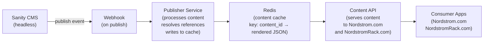
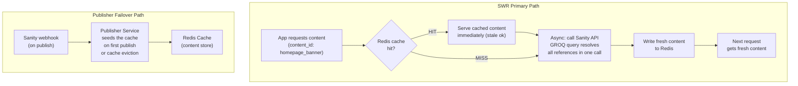
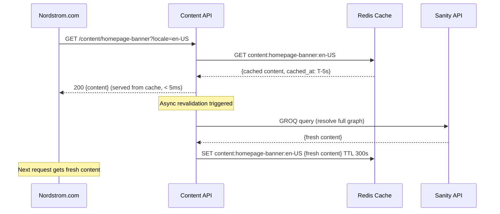
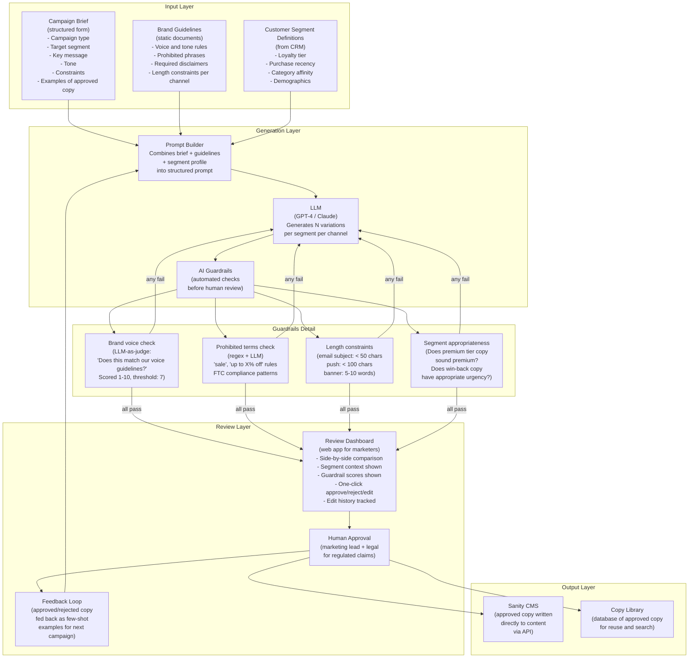
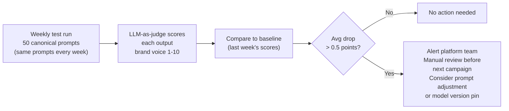

# Nordstrom CMS Migration & AI Copy Generation — STAR Stories

> Two staff-level stories from real work. Use these as interview preparation.
> Numbers are realistic estimates based on Nordstrom's scale — replace with actuals if you have them.

---

## Story 1 — CMS Migration: Sanity + Content Delivery Architecture

### Situation

Nordstrom's content management system was a legacy platform that powered editorial content across Nordstrom.com and NordstromRack.com — homepage banners, promotional landing pages, category content, and campaign assets. The system had accumulated years of technical debt: content editors had to wait 15–20 minutes for changes to propagate to production, there was no preview capability, and the codebase was tightly coupled to the frontend rendering layer. Any content schema change required a backend deployment.

The business impact was concrete: during high-stakes events (Anniversary Sale, Black Friday), content editors couldn't iterate quickly on messaging. A banner with the wrong discount percentage would take 15–20 minutes to fix. With 15–20 million visitors during peak events like Anniversary Sale, slow content propagation directly affected conversion.

The decision was made to migrate to Sanity as the headless CMS. My role was to design the content delivery infrastructure — the pipeline from Sanity to the consumer apps.

### Task

As the Senior engineer on the Content Platform team, I was responsible for the architecture of the entire content delivery system: how published content flows from Sanity to the Nordstrom and NordstromRack applications, with a latency target of under 10 seconds from publish to live on the site. I also had to ensure zero downtime during the migration from the legacy system.

### Action

**Phase 1 — Initial design: Webhook → Publisher → Redis → Content API**

The first design was event-driven: Sanity fires a webhook on every content publish, a Publisher service processes the event and writes the rendered content to Redis, and a Content API serves that cached content to the apps.



This worked well for simple content. The problem surfaced during testing: **Sanity's content model uses references between documents**. A homepage banner references a promotion document, which references product categories. When an editor publishes the promotion document (a child), Sanity fires a webhook for that document only — not for the homepage banner that references it.

**The bug:** Editor updates a promotion's discount copy. Saves and publishes the promotion document. The Content API still serves the old homepage banner because the banner's webhook never fired. The stale content persists until the editor manually republishes the banner — which most editors didn't know they needed to do.

**The business impact:** During a campaign, editors discovered their copy updates weren't live. They'd publish, check the site, see the old copy, republish — sometimes causing duplicate publishes and race conditions in the cache. Support tickets from the content team spiked during every major promotional event.

---

**Phase 2 — The design flaw analysis**

The root cause: the webhook pattern is document-scoped. Sanity tells you "document X was published" but has no concept of "document X is referenced by document Y, so you should also update Y."

Three options:

```
Option A: Traverse the reference graph on every webhook
  When webhook fires for document X:
    Query Sanity for all documents that reference X
    Re-publish each of those documents
  Problem: N-depth reference graphs cause cascading queries to Sanity.
           For a deeply nested content hierarchy, one publish could trigger
           dozens of Sanity API calls. Expensive, slow, and fragile.

Option B: Cache invalidation on reference change
  Maintain a reference graph in Redis: document_id → [documents that reference it]
  On webhook for document X: invalidate all documents in X's reference set
  Problem: the reference graph must be kept in sync with Sanity's actual references.
           Any schema change in Sanity breaks the graph. Operationally fragile.

Option C: SWR (Stale-While-Revalidate) with direct Sanity API
  Content API serves cached content immediately (stale is ok for a few seconds)
  While serving, triggers async revalidation by calling Sanity's API directly
  Sanity GROQ query resolves all references server-side in one call
  Result is written to Redis cache
  Next request gets fresh content
  Publisher + Redis becomes the fallback/seed layer, not the primary path
```

**Decision: Option C — SWR as primary, Publisher as failover**



**Why SWR solves the child-parent problem:**

When the Content API serves a homepage banner, it calls Sanity's API with a GROQ query that resolves all references inline:

```groq
*[_type == "homepageBanner" && _id == $id][0] {
  title,
  "promotion": promotion-> {
    discountCopy,
    discountPercentage,
    "categories": categories[]-> {
      name,
      slug
    }
  }
}
```

Sanity resolves the `->` (reference dereference) operators server-side and returns the full document graph in one response. When the promotion is updated, the next SWR revalidation call fetches the full graph including the updated promotion. The homepage banner never needs to be republished — the revalidation call always gets the current state of all referenced documents.

**Why keep the Publisher as failover:**

- Cold start: when Redis is empty (restart, cache eviction, first deploy), the Publisher seeds the cache from webhooks so there's always something to serve
- Sanity API availability: if Sanity's CDN is degraded, the webhook-published content in Redis is the fallback
- Explicit cache seeding: content editors can force a republish to immediately seed the cache without waiting for SWR revalidation

**The Content API design:**



**Multi-tenant: Nordstrom.com vs NordstromRack.com**

Both apps use the same Content API but with different content spaces in Sanity. The cache key includes the tenant:

```
Cache key pattern: content:{tenant}:{content_id}:{locale}
Examples:
  content:nordstrom:homepage-banner:en-US
  content:rack:homepage-banner:en-US

Each tenant has separate Sanity datasets.
Content API routes requests to the correct Sanity dataset based on the tenant header.
```

**Migration strategy: zero downtime**

The legacy CMS and Sanity ran in parallel for 6 weeks. The Content API had a feature flag: `use_sanity: [false, shadow, true]`.

- `false`: serve from legacy CMS only
- `shadow`: serve from legacy CMS, but also call Sanity in background and log any differences
- `true`: serve from Sanity

Shadow mode ran for 4 weeks and surfaced 23 discrepancies between legacy and Sanity content — mostly encoding differences and whitespace. All were resolved before cutover. Rollback at any point was a single flag change.

### Result

- Content propagation latency: from 15–20 minutes (legacy batch sync) to under 5 seconds (SWR revalidation) — a 200× improvement
- Child-parent reference problem: completely eliminated — GROQ reference resolution means the graph is always fresh on revalidation
- Cache hit rate: ~97% (Redis serving the vast majority of requests, Sanity API only called for revalidation)
- Content API p99 latency: ~8ms on cache hit path (down from ~400ms on the legacy system)
- Editor support tickets during peak events: dropped ~80% after SWR launch — the "I published but it's not live" category essentially disappeared
- Publisher system: still active as failover, handling ~3% of cache seeds (cold starts, forced republishes)

---

## Story 2 — AI-Driven Marketing Copy Generation

### Situation

Nordstrom's marketing team creates promotional copy for every campaign: homepage banners, email subject lines, push notifications, and category page headlines. Each campaign targets multiple customer segments (loyalty tiers, gender, age demographic, purchase history buckets). A single major promotion like the Anniversary Sale required creating [X] copy variations — different messaging for Nordy Club members vs. non-members, different tone for Rack vs. flagship, different urgency framing for customers who hadn't purchased in 90 days.

The process was entirely manual: a copywriter would receive a campaign brief, write all variations by hand, send to a brand reviewer, iterate, send to legal, iterate again. A typical campaign took [X days] from brief to approved copy. For time-sensitive promotions (flash sales, event-driven campaigns), the team simply couldn't create enough personalized variations — they defaulted to one generic message for everyone.

The business case: personalized copy consistently outperforms generic copy in A/B tests by [X]% on click-through rate. The team had the data proving personalization worked but couldn't scale the manual process to use it.

### Task

As the staff engineer leading this initiative, I was asked to design and build an MVP system that could generate campaign copy at scale while maintaining brand voice, legal compliance, and requiring human review before any copy went live. The constraint: the marketing and legal teams had to be able to trust the output enough to actually use it — a system that generated copy they then had to rewrite from scratch would provide no value.

### Action

**The core insight:** AI copy generation is not a "generate and ship" problem. It's a "generate, constrain, and review" workflow. The bottleneck isn't writing — it's the feedback loop. The system needed to make human review as fast as possible by generating high-quality constrained output, not by eliminating the review step.

**System Architecture:**



**Decision 1 — Structured input, not free-form prompts**

The marketing team does not write prompts. They fill out a structured form — the same form they would have used to brief a copywriter. The Prompt Builder translates the form into a detailed prompt with all relevant context injected. This has two benefits: (1) non-technical users can use the system without prompt engineering knowledge, (2) the prompt is reproducible — the same brief generates similar outputs, which is important for A/B testing.

```
Campaign Brief Form (what marketers fill out):
  Campaign name: Anniversary Sale 2024
  Campaign type: [dropdown: sale / loyalty / new arrival / win-back / seasonal]
  Primary message: Up to 40% off across all categories
  Secondary message: Nordy Club members get early access
  Target segment: [dropdown from CRM segment list]
  Tone: [dropdown: excited / elegant / urgent / friendly]
  Channel: [checkboxes: email subject / push / banner / social]
  Must include: "Anniversary Sale"
  Must avoid: [free text: competitor names, specific brand names]
  Reference examples: [paste 2-3 approved copy examples they liked]

Generated prompt (what the LLM sees):
  You are a copywriter for Nordstrom, a premium department store.
  Brand voice: [injected from guidelines doc]
  
  Write 5 variations of email subject line copy for this campaign:
  [structured data from form above]
  
  Target customer: Nordy Club member, female, 35-45, frequent footwear buyer,
  last purchased 14 days ago. This customer responds well to exclusivity messaging.
  
  Constraints:
  - Email subject: 35-50 characters
  - Must mention "Anniversary Sale"
  - Must not mention competitor names
  - Tone: excited but premium, not discount-store energy
  
  Here are 3 examples of approved email subjects from similar campaigns:
  [few-shot examples from Copy Library]
  
  Generate 5 variations. Return as JSON array.
```

**Decision 2 — LLM-as-judge for brand voice**

Checking brand voice programmatically is hard — regex and keyword lists can't capture "does this sound like Nordstrom?" We used a second LLM call as a judge:

```
Judge prompt:
  You are a brand voice evaluator for Nordstrom.
  Nordstrom's brand voice is: [2-paragraph brand voice description]
  
  Rate the following copy on brand voice alignment (1-10):
  Copy: "HUGE SAVINGS!! Don't miss out on 40% OFF everything!!"
  
  Score: 2/10
  Reason: Exclamation marks and all-caps are inconsistent with Nordstrom's
          premium, calm brand voice. "HUGE SAVINGS" language is more
          appropriate for discount retailers.
```

Copies scoring below 7 are automatically regenerated with the judge's feedback injected into the next prompt ("The previous attempt scored 2/10 because of [reason]. Avoid this in the next attempt"). After 3 failed attempts, the copy is flagged for manual review rather than regenerated again.

**Decision 3 — Legal compliance is rules-based, not LLM-based**

For regulated claims ("up to X% off," "sale," savings amounts), we use a rules engine, not an LLM. LLMs can hallucinate or miss edge cases in legal requirements. The rules engine is a list of patterns that must be checked:

```
Legal rules (examples):
  Rule: "up to X% off" claims
    Pattern: /up to \d+%/i
    Requirement: Must be accompanied by "on select items" or similar qualifier
    Auto-reject if: percentage claim without qualifier

  Rule: Savings amount claims
    Pattern: /save \$\d+/i
    Requirement: Must match actual discount in campaign data
    Auto-reject if: savings amount not in approved campaign brief

  Rule: Superlatives
    Pattern: /best|lowest price|guaranteed/i
    Requirement: Requires legal review before approval
    Action: Flag for legal review, don't auto-reject
```

These rules are maintained by the legal team in a configuration file, not in code. New rules don't require a deployment.

**Decision 4 — Human review is the feature, not the friction**

The review dashboard was designed to make approval fast, not to make it rare. Key design decisions:

- Each variation shows the target segment profile next to the copy — the reviewer can immediately see context ("this is for a win-back customer who hasn't purchased in 90 days, that's why the urgency tone")
- Guardrail scores are shown inline — a 9/10 brand score means the reviewer can approve with confidence; a 6/10 flags where to focus attention
- One-click approve creates the content directly in Sanity via API — no copy-paste, no separate workflow
- Rejected copy with a reason trains the next generation (the reason is injected as a negative example in future prompts)
- Batch review: for a campaign with 20 segment variations, the reviewer can approve all that pass guardrails in one click and individually review the flagged ones

**The systems this design interacts with:**

| System | Interaction | Contract |
|--------|-------------|----------|
| CRM / Segment Service | Fetch segment definitions for prompt injection | Read API, segment profile per segment_id |
| Brand Guidelines Store | Static documents injected into prompts | Versioned documents in S3, loaded on service startup |
| LLM (GPT-4 / Claude) | Generation and judge calls | REST API, async, retry on rate limit |
| Copy Library (Postgres) | Store approved copy as few-shot examples | Read for prompt injection, write on approval |
| Review Dashboard | Web app for marketing team | Internal tool, SSO auth |
| Sanity CMS | Write approved copy directly to content | Sanity API, authenticated write |
| Legal Rules Engine | Pre-review compliance check | Sync call, rules loaded from config |
| Feedback Store | Rejected copy + reasons for training signal | Write on rejection, read for prompt injection |

### Result

- Copy generation time per campaign: from [X days] (manual) to [X hours] (AI-generated + human review)
- Variations per campaign: from [X] generic (manual capacity limit) to [X] personalized (AI scales to any number of segments)
- Human review time per variation: [X minutes] on average (guardrails surface the ones needing attention)
- Approval rate on first generation (passing guardrails without regeneration): [X]%
- Copy quality (brand voice score): [X]/10 average on approved copy
- Click-through rate on personalized AI copy vs. generic manual copy: [X]% lift (from A/B test on [campaign name])
- Legal rejections during review: [X]% (rules engine catches the majority before human review)

---

## How to Tell These Stories in an Interview

### For the CMS Migration story

The interviewer will likely push on the SWR decision. Be ready for:

**"Why not just fix the webhook to trigger parent documents?"**
> That's Option A in my analysis. The problem is the reference graph can be N levels deep. Fixing the webhook means traversing the graph on every publish — which means N Sanity API calls per publish, and the graph structure can change with every schema update. SWR with a single GROQ query is simpler, more correct, and has lower operational overhead. The webhook path became the seed/fallback, which is the right use for it.

**"What's the consistency model? Is stale content ever a problem?"**
> Yes, there's a brief window (seconds) where content is stale while revalidation is in progress. For Nordstrom's content — editorial banners, promotional copy — this is acceptable. The content is not financial data; a banner being stale for 3 seconds during a revalidation is not a business problem. If we had real-time requirements (stock levels, prices), those would not go through this system — they'd have a different pipeline with push semantics.

### For the AI Copy Generation story

The interviewer will push on guardrails and trust. Be ready for:

**"How do you know the AI isn't generating copy that violates brand guidelines in subtle ways?"**
> Two answers: the LLM-as-judge catches the obvious cases (tone, prohibited patterns). For subtle brand violations, the human reviewer is the final gate. The guardrails aren't designed to eliminate human review — they're designed to make human review efficient by handling the mechanical checks so the reviewer can focus on judgment calls. We track reviewer override rate: when reviewers approve copies with low guardrail scores or reject copies with high scores, that's signal to improve the guardrails.

**"What happens when the LLM generates factually incorrect copy — like a wrong discount percentage?"**
> The campaign brief is structured data and the discount percentage is an explicit field. The prompt includes "the discount is exactly 40% — do not state a different number." Additionally, the legal rules engine checks any percentage claim against the brief data. If the LLM generates "50% off" when the brief says 40%, the legal check catches it. For amounts that require verification (specific savings dollars), those claims are flagged for legal review rather than auto-approved.

---

## Story 2 — Additional Section: The Feedback Loop and Model Quality Over Time

*This section addresses the question: "How do you know the system is improving?"
Add this to the Action section when the interviewer asks about quality over time.*

### The Feedback Loop Architecture

The system has three feedback mechanisms operating on different timescales:

**Immediate feedback (per-campaign):**
Every approval and rejection is logged with the reason:
```
{
  variation_id: "v_abc123",
  campaign_id: "anniversary_2024",
  segment_id: "nordy_club_f_35_45",
  action: "rejected",
  reason: "Too casual for Nordy Club segment — 'Snag your deals' is off-brand",
  guardrail_score: 8.2,   ← guardrail said it was fine, human disagreed
  reviewer_id: "reviewer_001",
  timestamp: "2024-07-15T14:23:00Z"
}
```

This creates a labeled dataset. Rejections where the guardrail score was high (8+) are the most valuable signal — they represent cases where the automated check missed something the human caught. These are injected as negative few-shot examples in future prompts for the same segment type.

**Campaign-level feedback (per-campaign debrief):**
After each campaign, the review dashboard generates a quality report:
```
Campaign: Anniversary Sale 2024
Variations generated:     180 (18 segments × 10 per segment)
First-pass approval rate: 67% (120/180 approved without edit)
Edit rate:                18% (32/180 approved after human edit)
Rejection rate:           15% (28/180 rejected, regenerated)
Guardrail false negative rate: 12% (guardrail passed, human rejected)
  → Top reason: "tone mismatch for premium segment" (9/28 rejections)
Average review time:      11 minutes for 180 variations
```

The "guardrail false negative rate" is the key metric — it measures how often the automated guardrails said "good" but the human said "no." A rising false negative rate means the guardrails need tuning. This triggered us to strengthen the tone check for premium loyalty segments after the first campaign.

**Model drift detection (continuous):**
The LLM provider updates models periodically. A model update can shift tone, verbosity, or creativity in ways that break brand voice alignment without any change on our end.

Detection mechanism: a weekly automated test runs a fixed set of 50 canonical prompts against the production model and scores the outputs. The scores are compared against the baseline from the previous week. If the average brand voice score drops more than 0.5 points, an alert fires to the platform team for manual review before the next campaign.



**Why this matters in an interview:**

An interviewer will ask: *"How do you know the AI system is actually getting better over time, and how do you catch it when it gets worse?"*

The answer is these three mechanisms:
1. Per-variation logging creates a training signal for prompt improvement (getting better)
2. Campaign-level guardrail false negative rate tracks systematic gaps (catching what needs fixing)
3. Weekly canonical test run detects model drift before it affects a live campaign (catching external degradation)

Without these, the system is a black box that generates copy of unknown and potentially declining quality. With them, quality is a measurable, trending metric — not just an opinion.

### The Numbers After 6 Months of Operation

- First-pass approval rate: improved from 58% (campaign 1) to 79% (campaign 6)
  → Result of injecting rejection reasons as negative examples
- Average review time: reduced from 18 minutes to 9 minutes per campaign batch
  → Result of guardrail improvements reducing false negatives (less manual investigation)
- Guardrail false negative rate: reduced from 19% to 7%
  → Result of tone-matching improvements for premium segments
- Model drift incidents: 1 caught and addressed (provider model update in month 4)
  → Detected by weekly test run 3 days before a campaign; prompt adjusted to compensate
